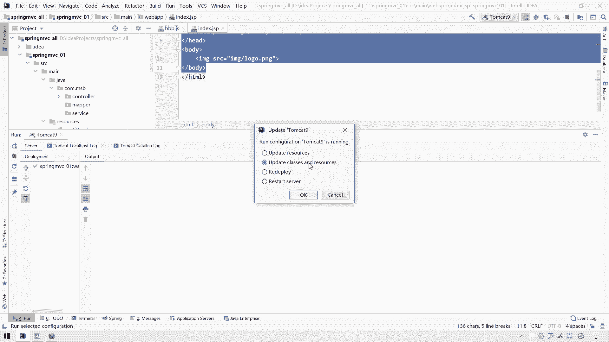
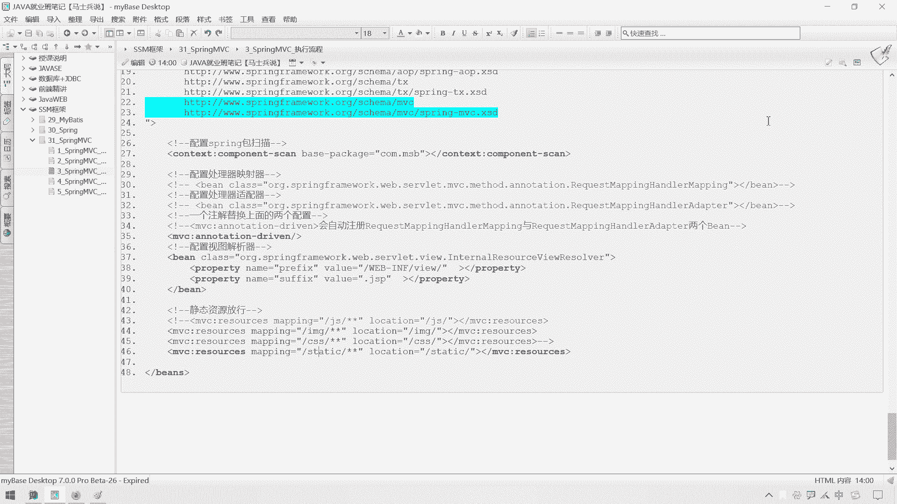
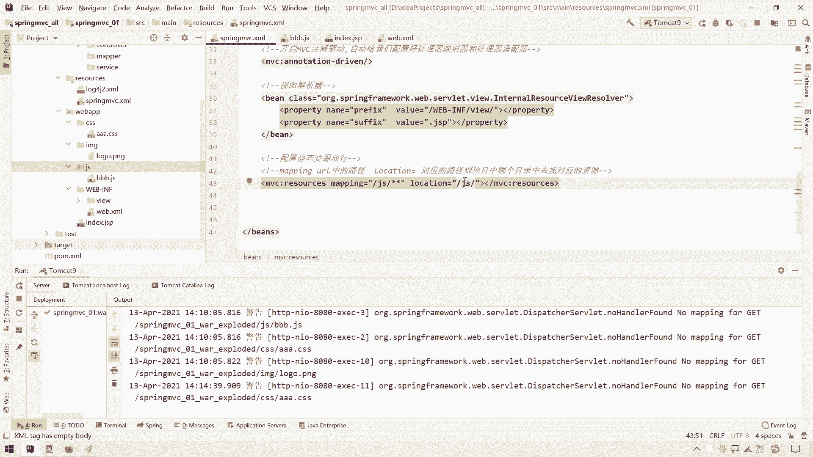

# 系列 3：P73：【Spring】SpringMVC_静态资源放行 - 马士兵_马小雨 - BV1zh411H79h

好三大组件配置完毕之后呢，接下来呢我们接下来呢，我们给大家讲一个叫做呃，spring mvc里面的一个静态资源放行呃，那么呃这个静态资源放行是个什么意思呢。

我们通过一个界面给大家来展示一下吧，哈举这个例子哈，我们在这个web app里面呢，我们准备点静态资源呃，什么叫静态资源呢，这块呢相信已经不会跟大家解释了，就像说我们的一些css文件，js文件。

还有一些图片啦，嗯还有一些其他乱七八糟的，就是保持不变不动的一些资源，我们管它叫做静态资源，那么一般呢在我们这个s s m项目中呢，我们在web app里面呢，我们可以准备一个这个目录。

准备一个js目录，这里面专门放一些js文件，然后在这呢再准备个什么，再准备一个呃i m g目录里，然后里面专门放这个图片文件呃，然后里面再准备个什么，再准备一个叫做嗯，还有一个是我们的一个叫做呃cs啊。

例如网址里面放一些css文件，我们就以这三个来举例哈，呃那么我们在外边a p p a p p下面呢，我们在准备什么，再准备一个呃g s p的一个文件，j s p和html其实都都可以哈，那我们来试一下。

我就把这个index index index呃，第二这sp呢我们再给他准备回来吧，哈刚才一不小心我给它删掉了，那删掉之后呢，我们在这块呢做这样一个事，就是我想往这个cs s g s和这个i m g。

里面的放任的资源哈，例如在cs目录里面呢，我创建一个文件叫做aaa啊，dcs s的一个文件，那么暂时让这个文件空就可以了，因为我们不需要让这个，我们只要是测试一下，这个能不能获取这个文件。

而不是说这个呃要让它有什么功能啊，然后呢在这个i m g里面呢。

我们再准备一个图片，这个图片呢我们可以做个截图。

我们把这个呢给大家截一下吧，然后接一下这个公司的一个logo啊，保存一下，扔到桌面上来一个logo呃。

那这个桌面上多了一个logo之后呢。

我们要把它放到我们这个项目里呢，这个其实也好办啊，把它来ctrl c复制一下，扔到这ctrl v这一粘就可以了，粘回来之后这个图片可以不要了。

js文件呢，我们随便在这块再new一个。

这个文件就可以了，例如我们管它叫做a a a啊，叫做b b b bbb。

点这个gs吧，那这样的一个文件，那么假设我们在这个页面上呢，我们需要这三个静态资源呢，怎么需要呢，假设导图片怎么导呢，正好我们可以来个i m g的一个标签，来一个s r c属性的导入，我们这个图片。

它是我们i m g里面的一个logo，点png的一个图片导进来就可以了，那如果说我想找一下这个css样式文件，我该怎么导呢，在这里面呢，我们可能要通过一个这个link标签。

然后有个ie l为style sheets，然后它的这个叫做呃type为a text css，然后写上它的一个h r e f或f，指向cs目录下面一个叫做a a a。css文件。

那假设我想引入这个js文件，我该怎么引入这个bbb的js，我该怎么引入呢，怎么引入，再来一个script，然后再来一个s r c等于什么，等于这个js目录下面的一个，这个叫做b b b。js一个文件。

那么好，那么这个就是一个呃一个页面，它引入了什么，引入了这么多资源，那引入了这么多资源之后，我们测试一下，看看这个index jsp在请求，我们在请求这个index jsp的时候呢。

它会不会能不能够成功地加载这些资源哈。

那么我们在这块呢需要做这样一个事，第一件事呢我们需要呃，在这块呢应该重启一下重点，这个重启一下也不用重启啊，在这块up to the classes and resources。

就是更新一下，我这个字节码和这个相对应的资源，要不然的话呢我们在这更新那些资源，可能会呃，没有成功的编译进，我们这个这个这个target的目录哈，这是一个，然后呢在这块再点一下它吧。

啊再重新相当于重新部署一下是吧。

部署一下，部署完之后呢，我们在这个浏览器上请求一下，只能请求一下我们这个index js p i n d x，index jsp，在请求index jsp的时候呢。

我们测试一下吧，在这块呢为了验证已经请求他了，我们在这块写这个代码叫做this is an index，点g s p，一会儿出现这个文字，就说明确实请求到他了哈，那么我们在请求之前呢。

我们在这块儿用打开f 12，然后找到这个网络，然后我们测试一下，看看它一共发生了几次请求哈，然后再来一回车，我们发现this is index jsp，确实是找到我们当前这个jsp页面了。

但是你会发现后面这个图片它就显示不了，这个图片显示不了，我们发现这里面有有多少呢，你当他不存在就完事了，因为这个这个东西呢我们之前测试过这个，这个就当它没有，就当它不存在哈，那么下面多了什么。

三个4404分别是指向哪一个没找到呢，是分别是这个a a a。cs没找到，还有这个bbb。js没找到，还有这个logo。png没找到，诶，他为什么会找不到这些东西呢。

原因是这样的哈，原因是这样的，首先呢我们总结一下。

我们说一下，就当我们请求这个index jsp的时候，发生了一个什么事情哈，给大家画个图解释一下。

嗯，在在在在这呃，那么我们的程序这块呢，有一个叫做呃呃这个叫做dispatch solid，i s p a t departure soviet，它是一个我们的前端控制器。

当我们第一次请求这个index jsp的时候，那我们在这请求这个i n d x index，点j s p的时候，那么就像我们的这个tom cat呢，发送了一个请求，嗯，发送了一个请求。

但是这个请求会不会，我被我们这个dispatch soviet拦截呢。

并不会，因为这个dispatch the light，这块的主要拦截谁呢，主要主要匹配的就是我们这个呃，注意看他这个配置信息主要是一个斜线。

而我们此时恰恰请的是一个index jsp，所以这个时候并没有走这个dispatcher来，而是直接干嘛呢，是直接访问到了我们项目下面的一个index，jsp，直接访问到他了。

i n d s index。js p访问到它之后呢，我们tom cat就会把什么，就会把这个index js p呢，返回给我们的浏览器啊，那再加上这一段就是我们的一个浏览器啊，这个就是我们一个浏览器哈。

浏览器拿到这个index jsp的时候呢，就会进行一个解析，拿到这个文件就会解析，解析完之后干嘛呢，解析完之后当然就要进行展示了，对不对，在解析的时候呢，他发现这里面还需要向服务器啊，加载三个资源啊。

解析时在解析时啊，这个发现什么呀，发现需要啊，需要像什么，像这个呃这个服务器啊获取什么呀，像服务器来获取获取三个这个资源，这三个资源分别什么呢，分别就是我们程序里面这个a a a。cs。

还有一个是这个b b b哎，点j s，还有一个是我们的一个叫做logo呃，logo点这个i m g，那logo。一个点点png，好像是啊，这个图片拓展没用，好像忘了，没关系啊。

反正就是需要加载这三个资源，那家里三个资源怎么加载呢，那我们的浏览器会默认，再次产生三个请求啊，产生三个请求，这三个请求分别是一个哎两个三个，这三个请求分别对应的是谁呢。

分别对应的就是我们下面所要这个请求的，三个资源，那他要请求谁呀，他要请求我们这个a a a。c s s，然后下面这个请求我就是b b b。j s，下面请求又要请求我们这个logo。

要请求我们这个logo，哎呀哎呀这个怎么给搞到下面去了，请求这个lg有logo啊，点png来请求他，那么这三次请求，会不会被我们的departure soviet所拦截，当中会被拦截到。

因为我们这个departure soviet里面，拦截拦截的一个路径是这种规则，是一个实现的一个规则，那这个时候这三期三次请求，就会被我们的this partisol e所拦截到，那拦截到之后呢。

它就会解析这些路径，而这个this party sweet它是干嘛的呢，它是专门给我们找什么，找我们的controller的c o n t r o l e r的，它会不会到我们的页面下面。

去找这些相应的文件呢，不会找，那不会涨，所以呢这个时候departure so来，就会发现，在control里面有没有对应这请求的映射路径的，一些对应的control啊，没有，那没有的时候呢。

有我们这个this is parser。

我们在这所看到的这三次请求，三个4。4，然后呢我们可以看一下他是怎么请求的哈，在这呢我们可以点开它请求的应输入径，是我们当前项目下这个cs目录里面，这个a a a。c s s。

其实这个东西如果说我们要是直接访问，也是访问不到的，我们可以试一下，来给他ctrl把这个路径来ctrl c复制一下，拿到这来，没找到的，那那为什么呢，因为这个路径会被我们的diator sweet拦截。

然后呢，他在自己的ctrl里面呢，又没有找到对应的一个映射文件，那么其实我们要是想让这个东西能够找到，该怎么办呢，我们应该告诉spring mvc。

或者是告诉谁呢，或者是告诉我们这个dispatch the light啊，告诉什么呀，告诉我，如果他请求的是这个a a。cs，或者是b b b。js，或者是这个logo。p n g，它属于静态资源。

你不要给我去匹配control群，你直接给我放行，让他到我当前项目里面去找就可以了，那么这个动作呢就叫做静态资源放行。

那静态资源放行这块该怎么配置呢，是这么配置的哈。

在我们这个spring mvc之中，在这个spring mvc这个点差ml之中，在这块继续往下配置一个什么配置，一个叫做配置配置，静态资源放行，静态资源放行的这个方式，是用这样来放行的一个mvc啊。

冒号叫做什么，叫做resources，这个resources呢，就是我们的一个静态资源的一个路径，和一个什么和一个映射关系，那这里面分别有一个map属性，和一个location属性，分别是什么意思呢。

mapping指的就是我们这个a p p i n g，mapping，指的就是我们这个u r l中，url中的这个路径呃路径，然后这个l o c t o location，指的是什么意思呢。

指的就是这个对应的路径到什么呀，到项目中哪个哪个文件夹中，哪个目录中去找对应的什么对应的资源，那么这个mac这块我们该写什么呢，这个写法是这样的哈。

我在笔记上头已经准备好了，是分别是这么写这么写这么写，这么写什么意思呢。

哎这个map这块跟谁对应的，跟我们这个这块对应的哈。

来看这我们这三次请求看一看，它分别请求的都是js b b b。js，然后呢这块事情是i m g logo。png，其实我们说哈这个将来呢。

我们在这个cs目录里面，还有在这个i m g里面啊，还有这个js里面的，可能里面会有很多很多的精神资源，那我不能一个一个的文件去放行啊，那怎么放行呢，我们发现如果请求映射路径中，如果带上cs了。

如果带上这个i m g了，如果带个什么呀，如果带上这个gs了，我不管这个请求意识路径后面是什么，后面是什么，我都认为这是在访问静态资源，而如果我的请求路径后面是这样的，就代表它是静态资源了。

那么怎么写呢。

这么写啊，怎么写，这个参照这个语法器就可以了，斜线js斜线星星什么意思。

斜线gs啊，gs gs斜线星星，意思就是当我的请求应试录取中，而且gs这一段后面呢有可能是多层的，有可能是单层的多少层，咱们还不确定，因为这个js里面万一有子目录怎么办，对不对，那我这会就写两个星。

两个星的意思就是js下面啊，无论这个ul路径，js这一层后面可能有多层，多多多多少层，没关系，那如果他请求是这个资源，我就把这个路径，我就把这个路径呢给你映射哪里呢，映射到我当前当前项目下面。

这个js目录之中，那这个location就指定我这个url中，所对应的一个文件夹，那怎么写呢，斜线js斜线可以就给它映射到这儿。

然后我们看一下这个是这么写的哈，那除了这个js里面的资源呢。

我们放行之后，那还有什么呀，还有我们的这个叫做css请求入境中，我们不管前面这块应该什么，前面前面这个斜线应该是从当前项目往后，下面，当前项目下，你想访问css里面什么东西的时候，那我给你意识到什么。

意识到你当前项目下的这个css这个目录里，如果你是当前，像不像这个i m g里面的一些目录啊，你是这个ul，那我给你意识到什么，意识到我当前项目的这个i m g。

这个目录中就可以了，这么写就可以了，那这么写呢，就相当于给这个静态资源放行了，一放行之后呢。

那这个时候这种这种请求，前面其实还有什么，还有这个呃c s s，还有这个gs，还有我们这个呃i m g唉，哎那么一到什么我们这个dispuselect时候，我们在this spa，so let一看哦。

这是静态资源，直接就给你放行了，到你当前项目里面去，对应的目录里面去找静态资源就可以了，那么能好使吗。

我们在这块呢把这个项目重新刷新一下，因为此时并没有增删文件，所以呢我们暂时不需要在这块儿去干，这个事也行，应该也能好使哈，来我们试一试。

这个时候我们再来访问这个index jsp一回车，这个时候我们看一看哈，诶呃这个a a a。c e s s是有的啊，b b b。j s也找到了，但是这个logo。p n g怎么还没找到呢。

这个有可能是我们项目的编译问题，就是maven这块呢可能有点小毛病，就是我们在这块添了一堆静态资源的，有可能一编译的时候呢，这些静态资源并没有成功的编译进，target的目录。

我们到target的目录里面，这个supreme mc，当前这个snap shop里面，我们看一看，这里面你会发现唉就缺少了什么，就缺少了我们这个i m g这个目录，说明他这个图片比较特殊。

这种图片比较特殊，没有成功编译过来，没有成功编译过来，怎么办呢，呃第一种方式我们可以重启idea，重启idea的时候，它会自动检索这个项目，进行一个呃这个出资的一个编译呃。

或者是我们在这块呃重启tom cat，我们试试看看行不行，如果还是不行的话呢，我们可以手动把这个i m g给他，ctrl c复制一下，然后扔到什么，扔到这个spring mvc下面，也可以手动复制过去。

也可以，因为这种文件其实编译的时候，就是把它复制过来啊，并不需要把它进行，像jaa代码一样进行编译，所以能复制过去也行哈，我们重启一下试一试哈，看看它还可不可以。

如果不可以的话呢，还可以怎么做呢，我们还可以这么做，我们可以借助这个maven插件，借助maven插件这个生命周期，这块不是个life circle吗，我们来一个clean把它清掉，清掉完之后呢。

再来一个compile，再来个编译，看一看可怜和compile之后。

能不能把这个给它编译起来，现在呢我们是属于重启tom cat。

重启tom cat时候，tom cat一启动，它也会对我们的项目进行一个编译，但是这个编译，我们似乎在这里面。

并没有找到那个那个文件哈，并不还是还是什么呀，还是没有找到，这还是没有成功将这个logo。png呢给他呃，编译进来，那你会发现这里面还少了一个那c点，cs文件，我们我们浏览器缓存了js文件。

浏览器也给缓存了。

所以这里面有可能会少了两次，但是这个logo的png还是让没有获得到，那怎么办呢，我们做这样一个测试啊，我们把这个呃这个super m，这个这个这个这个用maven先给它可令掉，我先把这个项目停掉吧。

四刀宝把这个两个团不看全都停掉哈，然后再来可怜一下哦，应该啊，他给的目录已经没有了，已经清掉了，清掉完之后呢，我们再来一个compile，用maven再给他compile一下，看看compile之后。

能不能成功的，把这个静态资源给它编译过去啊，这个静态资源编译的时候会有点小毛病，这块呢也是一个坑啊，顺便给大家展示一下这个坑，然后点开点开之后呢，诶这里面这个这个maven这个compile呢。

那还真得干嘛呢，真得我们去嗯，这个呃其中tom cat启动，tom cat可能还会再给我们再进行编译哈，如果还是不行，重启idea应该就好使了，因为你不想重启idea，我如果发现这里面它里面还没有。

我们再把这个复制过去就完事儿了，再试一次哈，不行的话，那我们就用最终手段给它复制过去，唉出来了，出来之后呢，哎看一下i m g已经有了啊，那这回呢我们这个打开呃。

这里面应该能在页面上，应该能看到我们这个图片了哈，好诶也就过来了啊，那么这个就是我们的一个呃，我们的一个静态资源放行的一个操作呢。

就给大家展示完毕了啊，那好在静态资源放行这一块呢，我们会发现有一些地方有点稍稍有点难受，难受在哪里呢，就是这个静态资源目录啊，如果直接放到这个web app下面呢，你会发现有点繁琐，又怎么有点繁琐呢。

这个文件夹将来可能将来只能是cs s，i n g和g吗，有没有可能有一堆其他的一些静态资源呢，文件夹是不是有可能会特别多呢，如果这块文件夹多了，那么我们请求应收入就入境之中。

这一块是不是就可能会造成很多，很多的这个静态资源放行，我可能要写很多条呢，我能不能用一条这个配置，来把所有的静态资源放行呢，也可以，但是呢如果要是用一条这个配置方式，把所有静态资源放行的话呢。

我们的这个项目结构，对于静态资源管理这块呢，呃可能需要做一些特殊处理，你之所以能用一条放行所有的静态资源，那你就要把所有的静态资源，放到同一个目录之中，那怎么放呢，我们可以在这放到这样一个目录之中。

放上一个叫做ttc的一个目录，其实呢我们后面在学这个spring boot的时候呢，spring boot在准备组织静态资源的时候呢，它就会组织这样一个static，这样一个目录叫做静态目录。

然后把这些资源干嘛呢，全给它放到一个目录之中，放到一个目录之中啊，你要知道这个静态资源路径改变了，我们在引入这些静态资源的时候，那这块的路径也得相应改变，要在我们当前项目下。

这个static这个目录里面里面的啊，这个cs里面找这个a a的，cs这块也是在这个当前项目下，s t a t i c static目录下面的里面，再找js目录，再找这个bb点。

js这个i m g也是在当前项目下，static是用static这个目录里面，去找这个i m g目录，再去找这个logo点，png要这么写才可以，那这么写的话，如果放行静态资源的话呢。

也就是说如果你请的资源是static目录里面，或者是你请的路径中带上了这个thetic，那我就认为是静态资源，那么我们在这放行的话，那就简单了，我们就可以用一条来放行了，我们把这个来给他。

ctrl c复制一下，ctrl v，如果请求映射路径中是一个s t a t i c，static static后面有多少层，不但不确定，当前项目后面直接要访问esthetic，静态资源了。

那要把这个location给他，对应应试到哪里呢，对应到我这个static目录里面就可以了，这样的话呢，我们就可以用一个来放行。

所有的静态资源了，这个里面涉及到一个文件夹，一个拖拽了，这个时候呢，我们可能需要重新部署一下项目，或者是重新启动一下，你看这块这个还没有编译呢。

我们在这重新their classes and the resources，我们试一下，看看这里面会不会跟着变哈，如果没有跟着变，怎么变怎么办呢，手动把这个变音之后东西给它删掉。

删掉之后再重新给他弄一下就可以了，应该说这也没变呢是吧，我们先访问一下试一试，可能你访问的时候呢，他可能就会呃这个给我们更新了哈。

现在还没有变是吧，一点这个我们再来访问什么，再来访问那个他试一试诶，你会发现它又不好使了，又不好使，就是说明我们这个编译它没生效，这种静态资源。

编译的时候肯定会有点小毛病，那怎么办呢，再来点一下这个试一试，更新一下，那重新刷新一下我们的项目，刷新完之后就会发现诶，这块就多了一个static目录了，呃那还是这个好使是吧，哎那这个好使的话呢。

我们再来试一试。

如果说他也不好使了，你就把这个tom开关了，重启就好了，这回我们再来试一试，来一回车，诶，还是不好使哦，他请求的路径好像有点问题，是什么问题呢，我们看一看嗯，a对了，这个地方还不能写一个斜线。

如果一写信的话呢，我们当前项目的这个上下文路径就没有了，所以呢这块呢还是找不到这块呢。

是哪儿写错了，是这儿写错了，就是这块别放斜线呃，如果你要是放斜线的话，那你需要在这块，把这个当前项目上下文路径呢给它放的，放的给它放进来，就是我们当前的项目的部署名，要不然的话。

那就去这个就不会给我们自动补充，当前项目项目的上下文路径的，那如果说你想写斜线好使，怎么办呢，你在启动的时候，在这块把这个项目的这个明天给它删掉，删掉之后留个斜线就可以了，就相当于当前项目没名字。

然后呢假期间应该也会好使，但这个大家有兴趣自己试吧，我就不带大家试了啊。

改完之后这些视频呢是不需要我们重新啊，这个刷新项目的，再来一回车，哎这回就好使了，你看这个路径，就是我们当前项目上下文路径，下面之后再找这个static就找到了啊。

那么这个静态资源啊放行的一个处理。

那么我们也就在这块儿给大家。