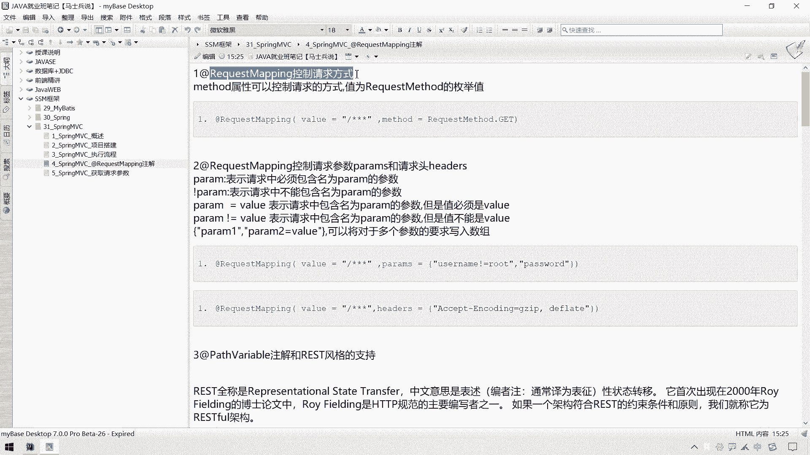
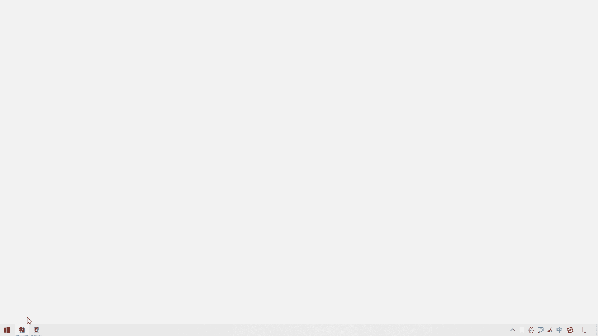
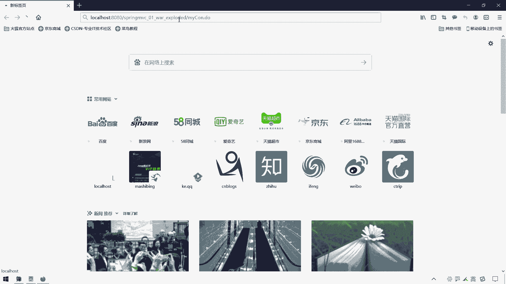
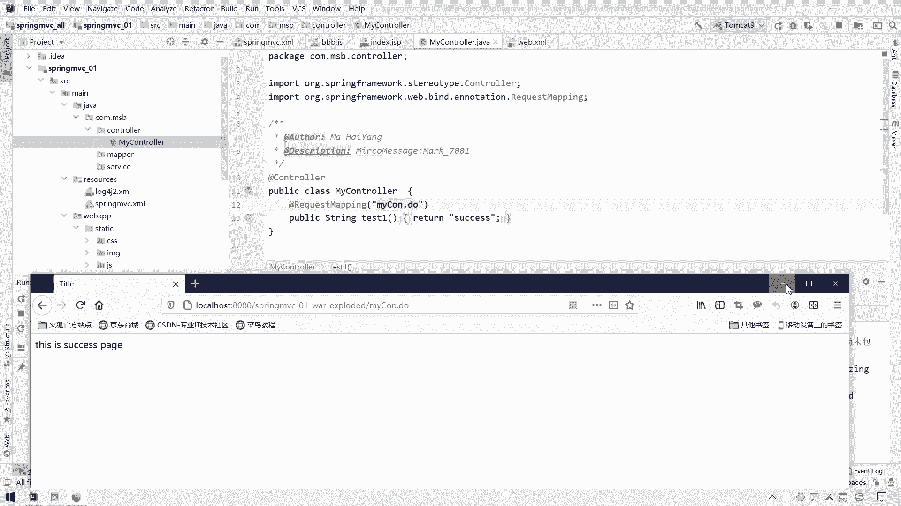
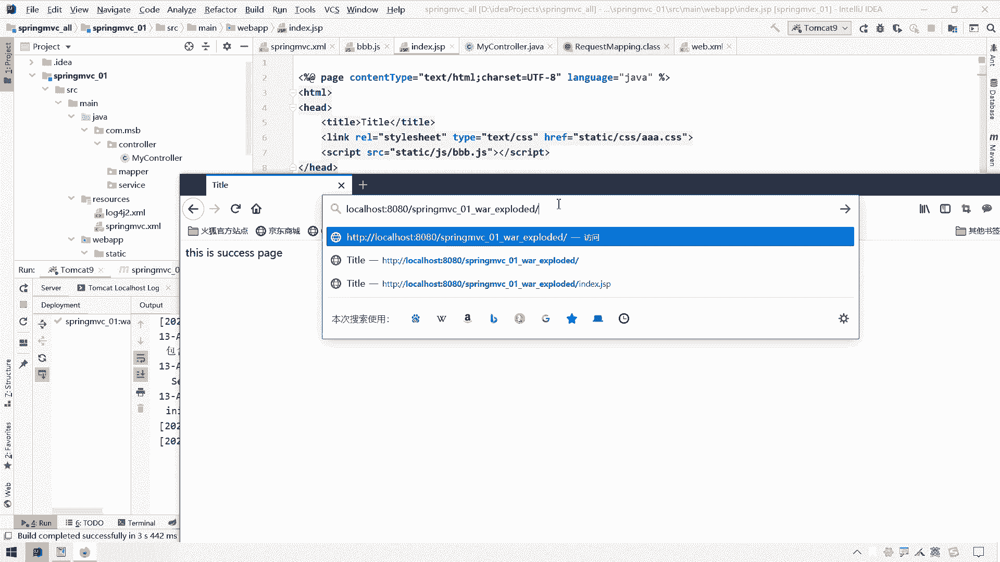

# 花了2万多买的Java架构师课程全套，现在分享给大家，从软件安装到底层源码（马士兵教育MCA架构师VIP教程） - P74：【Spring】SpringMVC_控制请求方式 - 马士兵_马小雨 - BV1zh411H79h

这一小节呢我们讲一下这个关于request map这个注解的那些细节问题。

和一些加了一些控制哈，呃那么这个request mapping呢我们在当前项目中就是加在这个control层次上。

然后用来指定什么，用来指定我们这个呃当前的这个处理单元啊，它的一个映射路径的一个呃这个注解，那么这个request mapping呢，我们现在写的这个时候呢，大家注意哈，前面这块有一个斜线。

那其实这个斜线不加也行，那在这个surprim 4中的这个前面，这个斜线加跟不加，其实并没有什么特别大的一个差别，那么如果说你习惯了的前面加起线，那你就加上就像我们这个at web sol那个注解一样。

如果说你不喜欢加的话，也可以哈，那我们试一试看一看这块，如果说我们不加斜线看看行不行啊，来我们重新部署一下，嗯重新部署完毕之后呢，我们打开浏览器，请求一下我们当前的这个control啊。

来ctrl c复制一下，嗯。

打开浏览器，一会车啊。

ok的也是可以的，也是可以找到了，也就是说这块的斜线加不加都行，那么按照我个人的习惯呢。

我可能还是喜欢加上一点，所以呢我写上就可以了啊，所以给大家看自己的这个习惯就可以了，那么接下来我们就稍稍讲一下这个request mapping这个入解还能够做什么，跟它相关的一些知识点哈。

我们讲第一个叫做request map呢，控制请求方式，我们按住ctrl。一下这个注解，看一看这个注解里面可以填哪些信息哈，这里面有一个默认的一个这个呃pass或者是y6 啊。

他们是一个嗯这个其实这个part跟y轴是一个一个意思呃，我们可不可以可以给这一个这个什么一个这个控制单元提供多个路径，那我们可以写成一个叫做呃pass或者是这个value啊也行，那这是他的一个第一个啊。

第一个路径，那么可不可以再给他多准备几个呢，可以哈，再准备一个逗号，这是一个数组的形式吗，还可以选一个斜线叫做my c o n c o n c u n a a c o n点，a c e t o n。

action，哎这都可以，这都没问题啊，当然一般来说没有特殊情况的话，我们指定一个也就够了，这是他的第一个写法，第二个写法就是我们当前这个request mapping呢，它是可以放到我们这个类上面的。

放到lay上面之后呢，如果我们把这个放在类上面之后呢，那就代表我们要是获取这个处理单元的话呢，那么我们就要在这个我们要是想要想请求这个处理单元，我们就在这个路径之上干嘛呢，先加上这个类上面所定义的路径。

这一点呢我们在上节课其实已经提示过了，在这块就不做过多提示了哈，那这是一个value属性，而我们知道这个value属性如果属性值为y6 ，那我们知道这个y6 是可以省略不写的。

有只给这一个y6 属性赋值，它是可以省略不写的，所以就写成这个样子了，那么这个request mac除了这个value属性以外，还有哪些需要了解呢，还有这个东西叫做叫做method。

这个method能够干嘛呢，这个method能够控制唉我们这个请求的方式，那这是个什么意思呢，我们可以来测试一下哈，呃我们在这块再来一个控制单元吧，在这块我们写成一个呃，public string。

写成一个叫做嗯嗯叫做呃test test a e q u s e request吧，测试请求我们也给它呃，return一个什么，return一个success。

s u c c e s s success，哎，然后呢我们在这儿呢加上这个at request mapping，然后里面加上一个什么，加上一个value，这个value是定义这个应试路径呃。

写成一个斜线，叫做test test r e q e s t request，然后我们在这里面给他说出一句话吧，叫做测试请求，test r e q u e s t，q u e s t啊，简单写了一句哈。

那么我们还可以在这个request map里面通过这个method来控制什么，来控制我们啊，这个允许获取到这个单元它的一个请求方式，那这个method呢它是一个枚举值，我们可以给他多个值。

假设这给他一个，那就来一个叫做request method。

点什么点，这个get意思是什么意思呢，意思就是当前你请求这个控制单元的时候，提交方式必须得是get，那你既想用get又想用pose怎么办呢，它可以附多个值啊，这样写成一个request get多少。

再来一个request request a，这是一个逗号哈，request method的点什么点，这个点这个post p o s t p o s t，那么这样的话呢就是允许什么。

就是允许你当前这个test request可以get形式请求，也可以post的形式请求呃，那么我们来测试一下，那我怎么控制请求是get还是post呢，我们可以通过form表单来指定啊，我们请求的方式嗯。

这个怎么做呢，我们在这个index页面里面来个什么，来个phone表单吧，来个f f o r m four呃，在php里面有一个这个action action呢。

我们给它指定为我们这个当前test request这个action就可以了，呃这块呢建议我们看一看哈，这个当前直接写斜线的话呢，这个在页面上如果写斜线需要加这个当前项目的一个嗯，这个叫做呃上上班路径。

我直接写成相对的就可以了，test request，然后the method这块有个什么method这块有个get和post，那我写成一个get就ok了，然后呢我在这块来一个提交按钮，input嗯。

type type等于type等于呃submit value等于来一个叫做测试七交提交提交，那现在呢我们这个呃这个提交方式呢是get方式提交的，然后请求这个test request。

我们看一看能不能够执行哈，呃在这块呢我们需要重新部署一下这个项目啊。

改代码的话是不需要重启tomcat的，那在这块呢我们要请求的是这个index index jsp可以不用写，然后直接一回车到这块有个提交了。

我们把这个上面的日志呢给它清掉，清掉之后呢，我们在这来测试一下，一点提交你会发现test request是好使的，是ok的，是没问题的，那么如果说我们这块的提交方式是post，它也是可以的，也是可以的。

因为我们这个control这块是允许你提交get和post请求的，但是这块如果说我只要它允许用get方式请求的话，我把这个post给它删掉，那这个时候我们来重新部署一些项目，改代码了，重新部署一些项目。

在这儿呢，呃等这个日志输出完毕之后，还要把它清空。

清空之后呢，我们在这再来刷新一下这个index点啊，这个jsp一提交，你会发现此时呢就是一个405请求方号，不允许了啊，request meat the post not supported。

不支持运筹post请求方式，所以通过这个你就可以控制当前这个处理单元啊。

到底是用get方式请求，还是用post方式请求了，那么这个是我们request mapping这块的第一个呃。

