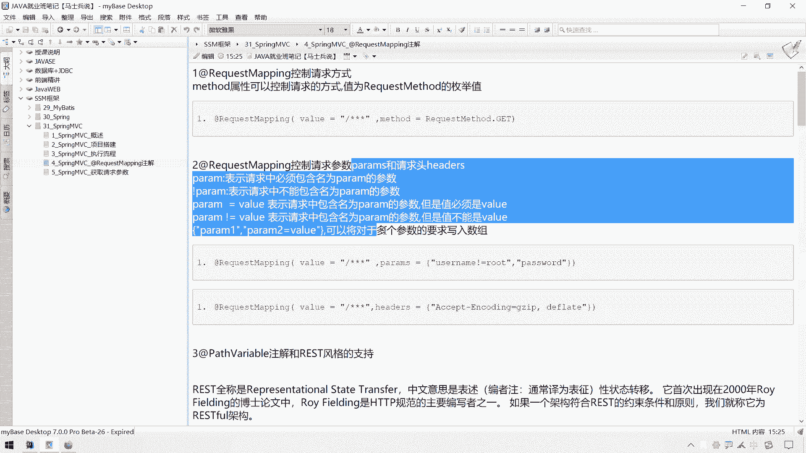
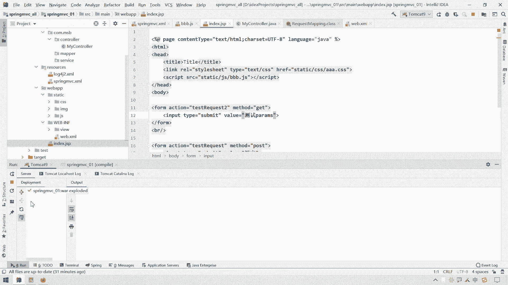
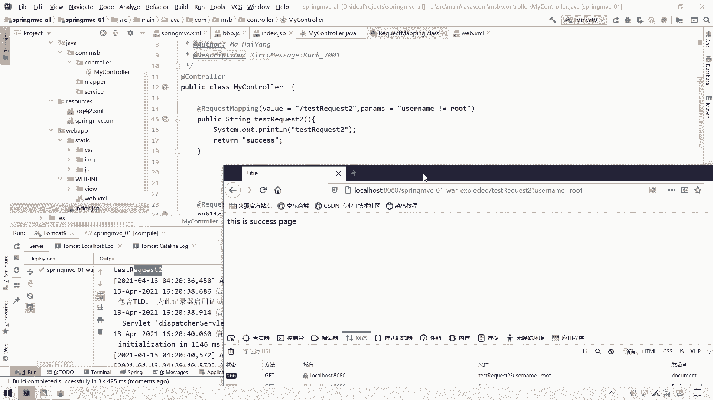
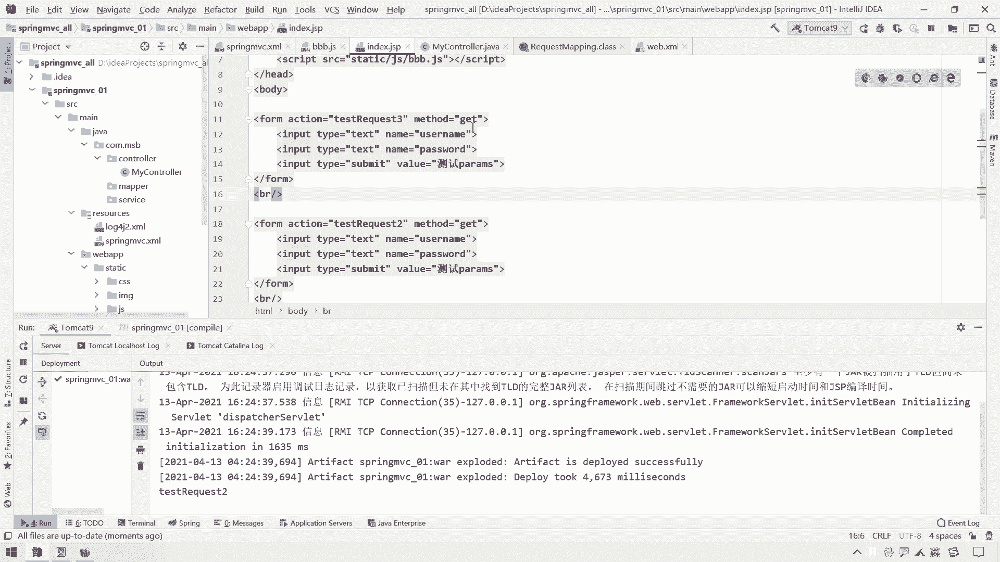
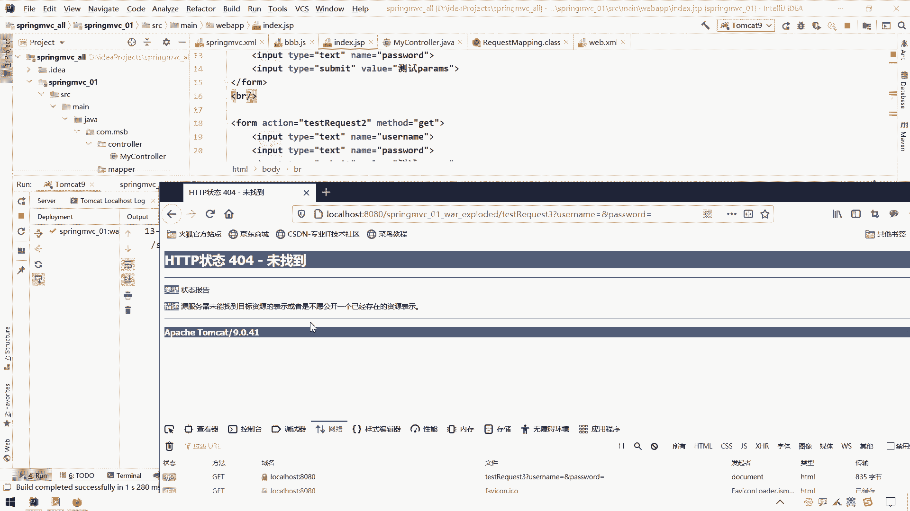

# 系列 3：P75：【Spring】SpringMVC_控制请求参数和请求头 - 马士兵_马小雨 - BV1zh411H79h

好接下来呢我们讲一个关于这个request map的一个呃，请求参数和请求头的一个控制呃，我们这个request mapping除了通过这个matt的以外控制这个请求方式以外呢，还可以呃。

通过这个pm和这个呃parrom属性和这个params属性和hide属性，来进行一个嗯请求参数的一个控制和请求头的唉一种控制啊，那么这个控制的语法是这样的哈，当我们写了这个参数名之后呢。

如果是叹号某个参数名的话，为什么参数，如果写成py，并且值是这个value的这样一个情况，参数如果是一个pa不等于什么什么外流，但是不能是这个值，还可以通过这种形式来指定多个参数，它的一个呃规则。

那么接下来我们可以给这个测试一下。

这是第一个，他除了能够控制这个请求参数员还能控制请求头呃。

什么叫请留头呢，这个呢我们之前呢也给大家讲过哈，呃我们诶这怎么变成一个再测试一下哈，我们打开f 12，然后呢打开网络在这来刷新一下，看一看哈。

呃我们知道请求呢它分为请求行，请求头和请求体，那请求行呢其实就是这个玩意儿，也就是这个玩意儿啊，然后请求头呢是在这的啊，这是一堆请求头，或者是可同时控制这个头的值必须是什么。

这些我们都可以做这样的一个处理，那么接下来呢我们就对于这个request making控制请求参数和请求头呢。

呃做一个简单的一个处理哈，呃我们在这块呢再来一个要把这个来给它，ctrl c复制一下，这个叫做test request 2吧，嗯这个路径名也叫做test request 2。

这块呢我就不做这个请求方式的一个约束了，嗯然后我们这块输出一个test request 2啊，那么假设我们想呃对这个呃对于这个这个这个单元做这样一个要求。

要是什么要求它的pm加上一个pip a r m嗯，诶诶这个怎么是一个逗号哈，p a r a m的一个注解，然后呢写成一个什么，写成一个叫做名字，为什么名字为叫做user name啊。

意思就是要求参数中必须有这个游戏内容，要是没有的话呢，就会呃这个呃出现一个什么出现一个异常或者请求不允许的情况，那真的是这样吗，我们在这个呃前端这块呢在准备什么，再准备一个form表单吧。

来control c拿过来哎，ctrl v呃中中间来个换行吧，b2 斜线，我们往这个test request 2里面去提交，然后请求方式post还是get无所谓啊，这块我们就用get吧。

因为get这个参数可以带在地址栏上，我们看到这块呢我们可以来一个叫做诶测试，什么测试，测试p a r a m parrams，这个哎这个属性我们看一看行不行哈，呃这个时候呢我们改了代码。

但是没有更改文件位置。

所以呢我们直接在这刷新一下这个就可以了，刷新完之后呢。

我们在这儿访问这个呃，这个index a怎么变成他了哦，还没有更新完毕，再来刷一下，我们一点这个测试params，你会发现它直接出现了1400的一个错误，什么意思呢。

perimeter肯定是use name啊，not meant for actual request perimeters。

呃这儿呢我们在这个上面可以看到这个上面并没有报一个异常日志。

我们看看这里面有没有，这里面也没有，然后这块呢呃这也没有，这也没有的话，没关系哈，我们嗯因为这种四级级的日志呢，可能在这个后台上还真的不好看，不好找，估计记得好像后面还是能看到什么意思。

就是这个请求里面要求必须有这个优势name参数，但是现在目前你这块没有提交优势name。

那怎么办呢，提交一个user name呗，你在这块再来个什么，再来一个input标签，然后呢type等于呃这个text，然后呢给它一个name属性，叫做user name啊，这不就有内参数了吗。

然后这个value值value值的话，你可以在网页上随便输就可以了哈，来回到我们上一个页这一块来一刷新呃，随便写一个r o o t啊，root一点测试pythms。

ok成功了，那么这个就是能够成功的哎，这个控制参数必须要有这个参数，我们还可以可以控制这个参数，什么参数，这个叫做呃不等于什么，不等于root，什么意思呢，就是例如你可以登录我这个系统。

但是呢我控制你当前登录这个系统，这个用户名啊，绝对不能是超级管理员，如果是超级管理员的话，那我就不允许，就是说你这个超级管理员不是一般人能登录的，不是在这块登录的，那怎么办呢，我们可以加上这样一个要求。

就是不等于root，如果说这块要求必须是root管理员，那你可以写成这样一个叫做等于root，那如果要求不等于root的话，不等于root的话，那我加上这样一个是吧，那么还是得重新部署一下项目。

部署完毕之后呢，我们在这块儿回到我们这个呃这个index的jsp这一块来一回车，回车之后，这块呢如果我们写成一个r o o t，然后我们一点测试，你会发现诶竟然成功了。

应该是我这个语法写错了，看一看啊，呃是一个叫做哦应该是有空格。

我们把这个空格给它去掉哈，我们把这个空格去掉试一试啊。

叫做不等于这个root还得重新部署一下啊。

来进行一个测试啊，啊他已经这么提交了，我直接这么刷，其实也行，嗯把这个认知清掉。

哎你看说错了是吧，哎那么这就是控制我们某些属性不能等于什么值。

呃，那么同时呢我还想做一个要求，要求什么要求必须有密码啊，然后但是至于密码是什么，只能我不做确定的明确的要求，那我可以这么写，写什么，写成一个p s s w i d password。

这样的话就是要求你的参数中呢必须带上这个密码这一项。

如果不带上密码是不可以的，那此时我们看一下我们这里面有这个提交密码吗。

并没有，那这个时候你一提交的话，你就算是eu 4内这块，你不写成root，它也会报一个错。

呃等这个刷新完毕哈，啊然后呢在这块儿再来回车一下，写成一个我不写root，写成一个1234哎，然后呢1245也行，一测试你会发现还是不允许，因为缺是一个什么确认一个这个password啊。

那如果说我们在这块呢给它加上一个password的一个参数，叫做p a s s w o r d password，加上这个参数之后。

我们再来这个不用重新部署也行，因为这是一个h j s p g s p应该是不需要嗯这个更新的啊，多了一个这块是一个密码，1234账号这块再来一个一二就随便写，不写都行啊，来一点测试。

你会发现这个时候就是ok的。

那么这个就是关于什么呢，这个就是关于我们的一个请求参数的一个这个控制就搞定了，搞定之后呢，我们再来测试一下它能不能够控制请求头也是可以的，也是可以的，这块再来一个test request 3。

这块也来一个test request 3，然后呢假设我想对请求的请求头进行控制的话呢，我们可以通过这个就不用这个pyms了，我这块就不加这个参数控制了。

可以通过这个headers h e headers来进行一个控制，语法呢跟我们这个parroms这个语法呢基本上是一样的，呃假设我想控制必须有什么头，头，必须有什么值，那我们就参照这个语法写就可以了。

我们在这块呢作为一个了解做一个测试就可以了哈。

呃我们看一看这个请求里面，这个请求里面呢，其中有这样的很多很多的请求头。

那么你可以把这个请求头和请求值呢拿过去就可以了，例如host这一块呃，假设不需必须不能是本地的一个访问，那你可以把这个后侧裙头放上去，呃，我们这块可以拿拿这个吧，这个相对来说比较短一点是吧。

我们拿这个accept encoding叫做接受的一个呃这个压缩方式。

这个头呢可以试一下，我现在要求请求这个组件的时候呢，它的这个什么呢，它的这个叫做accept encoding的这个属性的值，encoding这个属性的值，诶，嘿。

它必须等于这个z i p逗号叫做d e f l e t啊，必须等于这两个值，如果说你等于的不是这个值就不行。

呃，那么我们试一下，看看这样行不行哈，我们呃这个时候应该应该应该在这块需要重新，因为改的是java代码，需要在这块重新刷新一下，部署一下我们这个项目了啊，deploy on。

刷新完毕之后呢，呃我们回到什么呢，回到我们这块来，然后一点测试，ok成功了，因为此时呢我们提交这个请求，它的这个acception coding这个头就是这个值。

那假设呢我在后端要求说这个in coding这个值呢只能是这个头啊，这个值只能是他不带后面这个了。

那如果说我们再次请求，还是用这个图去请求的话，那一定会出现一个啊这个请求不允许的情况。

这个java代码又改了，我们在这块再刷新一下。

哎说完之后呢，回到这儿来。

回到这来之后呢，我们再来呃进行一个测试一走，你会发现诶怎么又过来了。

应该是这个项目没有成功刷新是吗。

哦这是太自私了哦，写错了，这个form表单应该再来一个，我让他去请求三去，应该请求这个三去啊，来我们试一试哈，这个请求方式是get还是post。

跟这个没关系哈，这个js p改了之后，这块是不需要重新部署项目的。

最后我们来测试一下，来一点走起来。

就是它并不是什么呢，你看你这个请求呃，这个请求提交的这个请求头，它是一个accept coding。

为长这个值，而现在呢我们要求这个accept in coding呢，对于这个ctrler呢，这个头呢必须是这个值多那个逗号和那个什么d e f不行，那是不允许的，那我再把这个加回来呢，你把这个加回来呢。

加回来之后呢，我们看一看对应这个请求头的一个呃。

这个处理单元它能不能够访问得到哈，呃在这块呢再来啊。

再来直接刷新一下诶，你看啊直接就success就访问到了。

