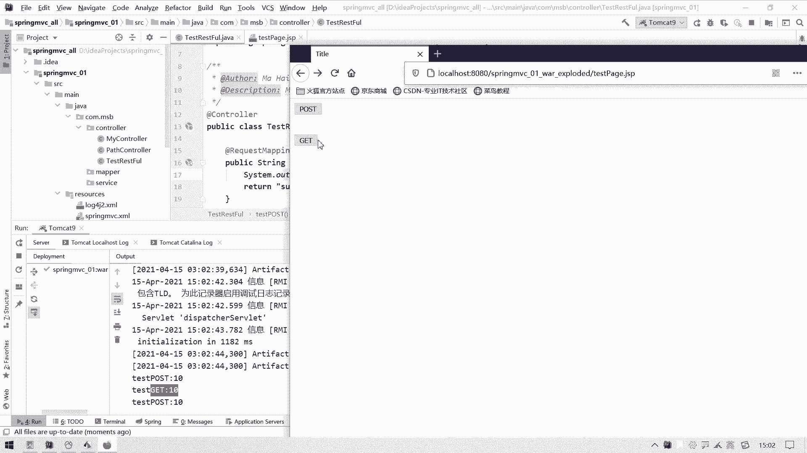
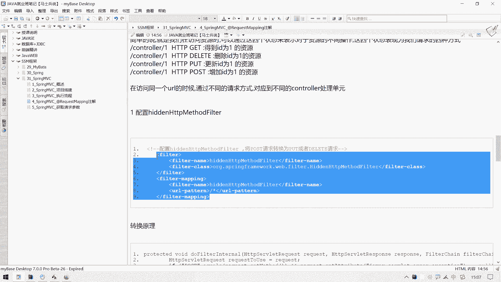
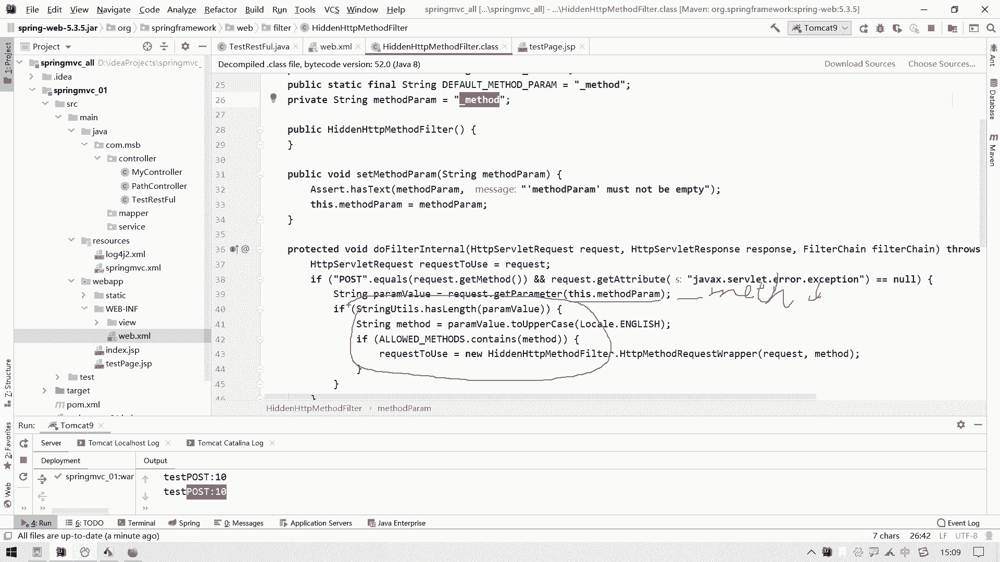

# 花了2万多买的Java架构师课程全套，现在分享给大家，从软件安装到底层源码（马士兵教育MCA架构师VIP教程） - P77：【Spring】SpringMVC_RESTFUL风格 - 马士兵_马小雨 - BV1zh411H79h

上一节呢我们给大家分析一下这个passworable注解它的一个作用，以及rest restful风格的一个这个支持，那么我们说普通的ui l格式呢就是更重要的路径，然后后面什么点都点js p等等。

可能还会带上西山西，带上一些参数等等，那么如果是restful风格制式的风格的呃，这个ul呢它是这种格式的，那么我们说在这块呢嗯简单介绍一下这个restful风格是个什么东西哈。

然后呢通过这个restful风格，我们再来给大家演示一下，我们这个呃htp协议它的这个四个啊，这四种提交的方式，也就是我们所说的这四种状态啊，rest即表示嗯即表述性状态传递。

那么呃是一个叫做law什么什么fielding的一个格law for field格式呢，在这个2000年他的这个博士论文上体现出来的软件架构风格，也就是说rest rest它是一种软件架构风格。

呃那么它并不是一个这个呃强制的这个这个这个规范，那么呃它的基本含义叫做表述性状态转移，是一组呃架构约束条件和原则，满足这些约束和条件原则的应用程序呢就是restav，那么呃值得注意的是呢。

就是restful，它arrest不是一种标准，他只是提出了一些约束条件和原则而已，而rise呢通常呃通常基于使用htp，目前也是在http上呢，呃这个支持他的这个rest的一个风格。

那就说它其实就是一个呃这个风格而已啊，一个一组约束和条件而已，它并不是一个技术标准，那么他这种表述性状态转移到底是一个什么含义呢，可能我们第一次看这个含义的时候，发现它并不是一个什么。

并不是一个可以直接让人理解的一种语言或者一种描述，就是说白了不像人话呃，那么什么叫做状态转移，我们给大家举个例子哈，在http协议上，在http协议上是可以通过这种表述性状态变化来表示不同含义的呃。

在http协议中呢有四个表示操作方式的都是个动词，就分别叫做get和post，这两个其实我们很熟悉，但是还有还有两个叫做put和delete，他们对应的是四种基本操作，get是用来一般用来表示获取资源。

pose，用来表示新建资源或者是传递资源，put的用来表示更新资源，这个delete用来表示删除资源，那么这四个动词它有什么实际的应实际的这个应用和含义吗，还是有的，简单的说就是我们在访问资源的时候呢。

可以通过这四个状态来表示对于资源的这个不同操作，那么这四个状态呢，其实呢就是呃对应的就是我们http协议中的四种请求方式，其中有两种请求方式我们已经见过了，一个是get请求，一个是post请求。

举个例子哈，假设我们请求的这个u r l同样是ctrl 1 ctrl后面带上一个一，那么如果说这个在http中我们用get来请求的话，那么其实啊这个含义可以理解为是得到i d v一的资源。

我们可以这么理解哈，如果说我们是用这个delete方式来进行请求的话呢，那么可能就是表示出来这个删除i d v一的资源，如果用put的方式请求的，就是在更新i d v一的资源，如果是用post请求的。

就是增加i d v的资源，那我们发现我们请求的url呢它其实是一致的啊，是一样的，但是随着我们这个请求的状态发生了变化啊，那么我们这个ul呢它所对应的资源也会有一个转移。

其实呢这就是可以简单的理解说一下什么叫做表属性状态转移呃。

简如果说详细的去分析这个rest风格啊，rest for风格的话呢，那我们可能还要把这个low什么什么fielding这个博士，这个博士的论文呢还要再读一下，那可能就是呃比较花时间。

那么我们通过这个呃这个这个呃这个四个get delete和put put，还有post，那么这四种请求方式呃，在http协议上呢。

呃这样的一个这个实现给大家展现出来这个表现，这个叫做表述性状态转移，它是一种什么感觉，大家做一个了解就可以了哈，那么其实呢就是我们在请求同一个control的时候呢，用四种四种请求方式。

然后呢呃对应分别四个不同的ctrl也就可以了，就达到我们的目的了，所以呢接下来我们就要干这个事啊，把这个把这个事情给大家说一下，就是呃通过在在这个访问什么的访问，那同一个这个url的时候时候啊。

那么通过什么呢，通过这个呃不同的呃不同的请求方式，哎然后呢对应什么对应对应到这个不同的啊，这个ctrl还处理单元嗯，处理单元，那么我们先拿这个最简单的这个get和post来进行一个测试哈。

呃我们打开我们的项目，在这块呢还在这个pass control里面，我们继续写嗯，在这呢我们再写一个这个叫做public string cha stream啊，这个叫什么叫做test get吧。

这样的一个代码，那么我们要给他一个请求的一个应试路径，at request mapping，然后呢里面写上一个诶，我我不在这里写了，我换一个吧，这块儿我可以来一个叫做the test test。

e s t restful风格支持的一个这个controller，然后来一个at controller，还是定义这样一个方法，public string呃，然后再来一个叫做get test，get。

test get，我们给它一个请求的一个应试路径，at呃，require a at request mapping，然后呢我们可以写成一个叫做呃叫做诶。

我看看我这个笔记上的那个路径名叫什么呃，我这个笔记上的路径名叫做test rest。

那好我也来个test rest，test e s t d，然后来个斜线，后面这块呢我们放一个id，这个id呢我希望解析出来放到我们这个呃处理单元中，作为一个参数能够获得。

那我们可以来一个string的一个id，那么前面呢要是想把这个a d呢给它放到这个变量式上去呢，我们需要给它来一个叫做at p a t pass verbal。

然后呢指定我们pass路径里面的这个这个i d哎这个解析出来，解析出来之后呢，放到这个哎这个属性上去，然后呢我们在这输出一下嗯，可以在这输出一下嗯。

那么嗯输出为什么输出为这个叫做呃test get get get，然后这个id值嗯想获得就获得，不像获得也行，然后呢加上这个i d也是可以的。

然后呢我们在这块return一个s u c c e s s success，s u c c e s s success，我们检查一下，在我这个mc中呢，我好像已经配置了这个视图解析器。

它会自动补充前缀和后缀，它会给我们，那我这块如果是return这个呃success的话，他应该会跳到我们这个web i n f view里面这个success。j s b界面。

这个咱们之前操作过哈，右击close others，嗯，然后呢我们就写一段代码来请求什么，来请求我们这个呃这个test restful里面这个处理单元。

然后呢我们先以get方式请求，然后再以post方式请求，看一看啊，这个能不能有这个对应的一个差别哈。

嗯那么我们在这个index。jsp里面，这已经有几个form表达了，那我们用它呢，不用它了，再来一个叫做叫做test page吧，一个点j s p，我们在这块呢再准备一个放表单。

然后form表单给他准备一个action嗯，为这个叫做，唉请求它吧，但是这个就前面不要加斜线了，因为加期限就要加项目的这个上下文test right。

然后里面放一个十me为get方式请求get方式请求啊，来一个呃input type button y67 70可写，可不写了，一个叫做呃叫做get嗯，get方式提交请求哈，这个就不用看了，回到这儿来。

那我怎么知道这个东西对应的是get呢，我们通过它的一个叫做matt来指定来指定什么，来指定这个request method为get方式，那这样的话呢就说明你当前请求呃这个嗯这个注册的这个组呃。

这个这个control的一个单元的话，必须要通过get方式来请求，那我们启动我们的项目来测试一下，看一看行不行哈。

好我的项目已经启动了，但是它默认打开的是index jsp，我们打开这个test page，点js p回车进来，这块有一个get的请求，然后我们这块一点看一看，诶，后台这块好像并没有请不到是吗。

什么原因，哦是supermit写错了嗯，在这块重新再来一个刷新，然后一点这个get，你会发现成功的请到了这个呃test get啊十啊，这样的这个test get这个数据单元没问题是吧。

那么如果这块我们要是来一个呃，如果是我们来一个提交post请求的一个方面表达，把这个改成改成改成什么，改成post，改成pos之后呢，这块呢是个名给它改成post吧，这个里面改一下。

然后这块再加上一个换行符，换个服啊，好那我们试一试看看，如果说我们用post请求在请求这个资源的时候能不能够匹配到哈，这个应该就怎么说呢，应该就会出现一个这个异常了啊。

然后呢我们再来一点post请求方式不允许了，我们已经在这个control这个处理单元上已经加了这样一个要求，它必须是get方式请求，那如果说再来一个post方式请求的话，那我们来试一试啊。

来ctrl c复制一下，往这一站呃，我们这个方法名的人不叫test get了，就test post，然后呢这个输出这块也给它改成test post，但是呢这个请求的方式这块呢要给它干什么呀。

改成叫做post就可以了，但是你会发现哈，这里面请求的这个u i l并没有变化，也就是说同样一个ui，同样一个ul啊，那么这个i d值它虽然是可以变化的。

但是如果说是相同的u l可以根据这个请求方式的不同，给它映射到不同的什么不同的这个处理单元上，那么表现出来就是呃这个ui l中如果带上了这个表述性的状态。

那么这个请字处理单元会随着表述性的状态转移而变化，那么我们试一试，看一看这个post请求能不能对应到它哈，呃然后呢在这块儿回到上面也改代码了，改代码我们需要在这块重新部署一下项目，嗯重新部署完毕之后呢。

我们再来一点这个post，你会发现后面指的是就跳到了test post这一块，回来get就跳到了test get这一块，那我们发现请自这个u r l它都是一致的啊。

你看这个请求的url还是他这个请求ul唉也是他啊。

都是一样的，那么这就是随着表述性状态转移啊。

那么这样的一个达到一个效果，那么在这个http中呢，它不仅仅可以提交这个post请求和get的请求，还可以提交另外两个请求，这两个请求是什么呢。

这两个请求一个叫做put请求和一个叫做呃这个delete请求，那么接下来呢我们就来测试一下这个put请求和这个和这个delay请求。

该怎么提交哈，呃在我们正常的这个页面中呢，如果说我们的form表单要是想提交的话呢，我们想提交一个put的请求的话呢，在这个matt里面呢，它是只有get和这个post的。

也就是说我们在写法上这块只有这个get和post，但如果说我们要是想请提交一个put请求该怎么办呢，我们需要在这块呢带上一个参数，我们需要带上一个特殊的参数，请求中携带一个什么呢。

携带携带一个特殊的这个参数，这个参数的名字叫什么呢，这个参数叫做下划线m e t h d max，然后呢用这个用该参数，用该参数，用该参数来表述什么的。

来表述这个呃这个put和什么hot和这个delete请求，那样子的请求，那怎么表述呢，在这块儿我们可以来一个什么，来一个这个呃，再来一个input吧，嗯input一个input，输入标签。

然后呢type呢我们可以给他来个什么type，给他来一个叫做hien，什么意思，就是隐藏，但是隐藏的话呢仍然会将这个呃这个这个输入标签的数据进行提交，然后它的name属性值呢必须要什么。

必须叫这个下划线matt，嗯，必须叫它，然后呢它的value值是什么呢，它的value值就是我们要请求的方式啊，例如我这块呢想用一个put方式请求，就来一个p u t就可以了，那么这个时候要注意哈。

上面这个form表单里面这个method仍然用post，仍然用post，然后呢在post里面携带一个参数，叫做下划线matter name，如果这个值对应的是put，那么此时就代表他是一个put请求了。

那如果是我想提交一个什么呢，如果是我想提交一个这个啊，这是一个铺的请求哈，我想提交一个delay的请求，怎么办呢，跟这个类似，诶这个怎么跑到后面去了啊，跟这个类似。

我们只要把这个matt的锁定的只能改成什么，改成d e l e delete就可以了，然后这块也改成一个d e l e t delete，那么它就是一个delete请求了。

呃那么呃那后台这块能区分出来吗，目前来看应该还是区分不了的话，我们可以试一试，我们把这个来给它ctrl c复制一下，我先找一个对，先写一个对应put的请求的，那这块首先它得改成p u t。

然后呢这块可以来一个test p u t，然后呢名字也叫做test p u t，那么除了一个put以外呢，还有什么呢，还有再来一个ctrl c拿过来，还有一个是delete。

d e l e t delete，然后这一块呢再来一个d e l e t delete，那这块一定是一个d e l e t t delete，那么接下来我们测试一下。

看看当我们用这个put请求和delete请求能不能请求到这两个处理单元哈。

他这个输出是怎么样的，我们来测试一下嗯，重新部署一下，好部署完毕之后呢，我们看一看这个delete它能够对应到对应到哪个control上去哈，一会你会发现它走的还是post，然后呢再来那再再走到上面。

再走这个put这一块，那你会发现它走的也是post，也就是说当我们上面这两种请求方式哈，呃用这种方式是取决提交post请求和delete请求的时候呢，你会发现它并没有给我们识别到什么。

识别到后台的这个这两个处理单元身上，那可能说这个是因为form表单提交不了嘛，也不是因为这里面呢我们需要配置一个什么，需要配置一个请求的一个过滤器。

配置哪个过滤器呢，就是h form表单本身是没有办法提交这个delete请求和post请求，put请求的，我们需要一个过滤器，然后通过一个过滤器呢来把这个呃。

把这个post请求转化成delete或者是post请求啊，就是通过这个配置叫做hien http method filter，它的作用就是什么。

就是一个叫做将什么将这个post请求可以转换为put和delete请求，那怎么配置呢，原模原样的把这个给他ctrl c复制一下就可以了。

在我们这个web。xml之中嗯，在这，点点错了。

web的插标之中，我们配置一个啊这个过滤器就是它那叫做hen http method failter，叫做隐藏的http方式的一个过滤器。

它使用的是我们这个mvc里面的一个叫做hien http method filter，然后这个filter呢他要过滤所有的请求，那么他在过滤所有的请求之后呢，它就会它的内部的一个内部的一个功能。

就是将什么就是将这个呃将post请求给转化一下，那它是怎么转化的呢，我们可以按ctrl。一下这个类名，然后跳到它的源代码上，可以简单阅读一下哈。

呃这里面有一个叫做do filter internal的一个方法，就是做内部请求的方法，那么他做了这个事先获得这个request对象，然后呢从这个request对象中去获取这个method。

就是请求方式对，如果说他是一个什么，如果说它是一个post请求了。

就要做一些特殊处理，如果说他不是pos，如果说他不是post请求。

就直接干嘛，直接是一个像这个呃这个叫什么，这个叫做请求的一个过滤器呢，传递给下一个过滤器就放行就完事儿了啊，那么如果是post请求，他会怎么做呢，它会获取一个参数，它会获取请求中的一个特殊特殊参数。

那这个参数的名字叫做this mess parrom，然后这个this。mamac parra是个什么玩意儿，它就是我们这个下划线max的，那也就是说他干了一个什么事呢，他在这解析了一下。

先获取我们请求参数中有没有这个下划线m e t h o d这个参数，嗯，然后呢嗯有之后就是下面就开始做一堆逻辑判断了，这一堆逻辑判断可能大家看的不是很顺畅。

我直接在这给大家解释一下，这是什么意思啊，这个图在这里画好了。

请求的这个处理逻辑是这样的哈，他第一步先判断是不是post请求，而如果是post请求的话呢，那是post请求的话呢，呃他就读取一下，你当前这个请求中有没有下划线max这个参数如果没有，是一个now的话。

如果这个参数它是一个闹市的话，他就给我们应试到什么，硬到这个max为post请求本身上去了，哎然后他如果读取这个参数，它带上这个matter了啊，然后这个value值被delete的时候。

发现这个值发现这个下划线met值是delete的时候，它就会什么呀，它就会将我们这个请求呢给它映射到什么，映射到我们这个请求方式为delete这个这个处理单元身上去。

如果发现这个下划线math值是post的，那自然而然就往上面就往这个方请求方法上为为要求是哎，这个这如果这个下划线matter是一个put，那么它跟这个值就一样了，哎这块这个这个这个这个写错了。

我应该换一下，这块应该是一个put，一会把这个图更新一下，如果发现这个只是一个put，就会把这个什么，把这个把这个请求给我们映射到这个request matter这个put上去。

所以说这个呃http had method这个filter，它就干了这样一个事，那这样的话呢就可以区分我们当前项目里面这个delete请求和不得请求了。

那么我们可以试一下哈，但是在试之前呢，这个我之前试的时候呢，它有一个小小的一个问题啊，我们做这个事就是给大家解释一下这样一个小问题啊，就是看这哈，呃目前呢我们这个success呢是当成什么。

是当成这个嗯，是当成这个一个页面的一个路径来返回的，那假设我想单纯的把这个这个字符串当成一串信息，返回给我们的浏览器，我们该怎么办呢，我们可以把这个control给它改成什么。

给它改成改成叫做rest control，改成rise control之后啊，那么这个ctrl下面所有的这些处理单元所返回的这些字符串啊，这些字符串都会被当成文字，直接想给浏览器，而不是不是什么。

不是这个当成我们这个呃请求的这个页面跳转的页面路径了，为什么要改它呢，因为就是这个delete请求和这个put的请求在页面跳转的时候呢，可能会出现一些异常，但如果说不不不，如果说不做页面跳转。

直接返回信息的话，那就没有这种异常啊，那我们试一试哈，来呃看一看能不能够测出来，我们先把这个结果测出来再说哈，我们回到回到这一页再进行一个刷新，刷新完之后我们测试一下get方式仍然可以过来。

但是你看这个时候我们俩就直接收到这个文字展现出来的是吧，然后一点post它也是success，下面也是一个post，ok也没问题，然后呢我们来测试一下这个put，你会发现它走的就是这个put了啊。

他终于可以识别这个获得请求了，我们再测试一下这个delete一点这个delete诶，他也过来了啊，那么整个的这个呃ul中通过四种不同的请求方式啊，这个表述性状态转移之后。

对应的这个请求资源也是一个转移的那种效果呢，我们就把它展示出来了，那这个呢作为一个呃了解就可以啊，那么大家有兴趣的可以测试一下，如果说没有兴趣的话呢，大家简单的能够学会使用什么。

能够学会使用我们这个在请求路径中这么写，来支持rise和风格就也就可以了，当然这种方式呢它只是一种ui路径的一个restful风格的一个支持，呃，在时间研发中，我们会不会用这种方式来提交大量数据呢。

其实不是很推荐，为什么不是很推荐呢，呃如果你想要它提交大量数据的话，那你这个url呢会写的很长，而且呢它仍然是有什么，仍然是有这个暴露数据的一个风险在里面的。

那么我们只是用它来简化我们的u i l还是ok的，还是没问题的哈。

那好那么这个restful风格知识这块呢。