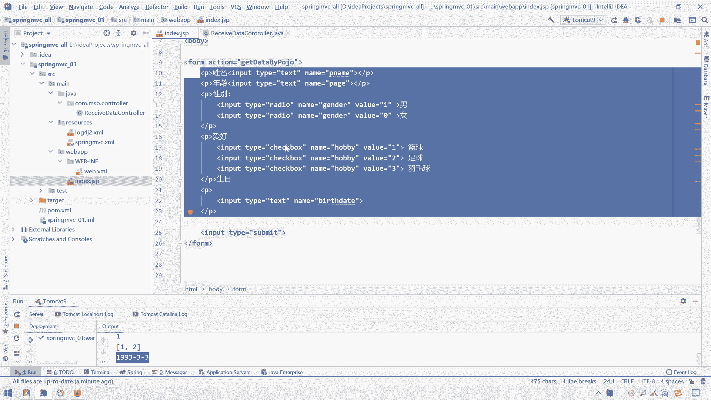

# 花了2万多买的Java架构师课程全套，现在分享给大家，从软件安装到底层源码（马士兵教育MCA架构师VIP教程） - P79：【Spring】SpringMVC_注入POJO类型参数 - 马士兵_马小雨 - BV1zh411H79h

好我们继续开始讲这个呃supremvc这个参数接收的问题，以及参数参数注入和接收的问题哈，呃刚才讲的一个解耦合方式和所解耦合方式和解耦合方式。

那么接下来呢我们主要讲一下这个解耦合方式里面的一些细节问题哈，在这块主要讲这样几个大问题，第一个问题呢就是我们的一个p o g o类型技术参数，第二个就是关于一个日期类型的一个转换。

然后之后呢第三步呢就是我们的一个呃list集合呃，接收这一块，那还有第四个就是我们的一个map集合接收这一块，然后第五个问题呢就是我们的一个关于编码处理的一个问题。

我们先做这个事儿，叫做p9 来接收参数，那这个怎么来做哈，嗯打开我们这个呃，呃我们当前项目里面，这里面有很多的controller，还有很多的这个页面。

那么我们可以暂时把这些无关的这些ctrl先给它删掉，因为这些相关的一些代码呢，我已经给大家留存好了，那我先把这些这个无关的页面和无关的这些ctrl圈给它删掉，嗯删掉删掉之后呢。

我们在这个mapper和service呢暂时我们也用不上，所以呢先给它删掉也是可以的，在static这块呢我们也暂时没有什么静态资源，我们接下来主要用来测试这个参数接收。

还有这个success jsp这块呢也是暂时也不用跳转是吧，呃既然没有静态资源的这个super mvc点插标中的这个静态资源放行。

我们暂时就不用了，嗯还有这个这个也就暂时就不用了，配置处理器映射器和配置处理器适配器，这一段其实就不用了啊，视图解析器呢暂时先留着吧，那么这个先往这一放，下面这个删不删都行，先扔着吧。

那么这是一个非常干净的一个最简单的一个项目，那接下来呢我们准备一个界面，一个普通的一个叫做i n d x index，点js一个界面，我们还是往这里面能放数据，然后接下来往哪里提交呢。

我们在这里面随便准备一个controller，叫做什么叫做r e c i v e receive，receive data这样的一个control嗯，怎么说。

然后我们在这个control里面呢来专门接收参数哈，我们再给它加上一个注解，叫做at at rest control吧，我们后面的测试呢，后面的测试呢通通在返回路径的时候呢。

我们都呃直接返回不返回路径了，直接返回文字，因为我们这块就别跳转页面了，我们只是来测试这个参数接收而已，诶这个关于页面跳转这块我们后面再说，然后接下来呢我们在这块来一个接收参数，接收参数的一个方法。

来一个public string，起个名叫做get data data啊，这个叫做buying，叫做p o j o对，就是通过我们这个一个java的一个实体类来接收我们这个请求的参数。

来一个at request map呃，给它一个路径就随便写一个吧，叫做get data，get data by啊，p o g o好，我们先写这样一个方法好，return一个success。

s u c c e s success，那么配置好占一个接收的一个接收参数的一个control的一个呃，这个功能单元之后呢，我们在页面上的准备一个form表单，然后呢我们在form表单里面呢放一些数据。

往这个处理单元上进行一个提交哈，那么在这呢我们随便写一个放表达吧，来一个f o r m来一个什么表达呢，可以来一个嗯，可以来一个person的一个表单吧，呃提交一个person的一个信息。

他的action呢为我们当前这个get data by pu jo，因为当前这个模块呢这个就别写信了，写信的话得写这个spring mvc啊，那个挺长一串的，我直接写成相对路径得了。

嗯后面再来一个metal，这个matter是get还是post无所谓哈，都ok没问题，所以这会就不指定了，呃里面有写一个上一个input，然后呢type等于一个叫做嗯submit，然后呢value不写。

他也会有个默认值，那么接下来呢我们想想想往这个control里面提交，提交一个一个人的一个人的性别啊，年龄性别等等一些信息，那就写呗，我们在form表单里面应该这么写，姓名呢比较简单的一个input。

来一个乘乘乘五个吧，先乘个五个诶，别这么写了，来一个p标签里面有i n p u t input乘五个，然后呢这么写a写错了，这应该是，p业乘务，然后里面的input不成这么写，in a tb好了。

五个p标签啊，每个p标签呢它会自带换行效果是吧，那好呃，我们第一个要提交一个这个用户名，那么一个人的姓名，那我就来一个内部属性，为什么内幕属性为显是叫做p name吧。

唉然后value只能从界面输入就可以了，然后再提交一个什么属性呢，提交一个这个age p age吧，啊ph这个值，然后姓名年龄啊，再来一个什么再来一个，那这个什么再来一个这个叫什么gender。

性别性别这块呢，我们可以来一个叫做type为radio呃，内幕为什么内幕为gender，嗯然后呢这个value值的为a，一加上这是一个男，哎这是个男啊，然后再来一个女性的一个性别啊，value为零。

这个代表什么，代表这个女哎好呃，再来一个什么，再来一个这个爱好爱好这一块呢，可能就比这个上面我们用的是一个单选框，选性别，下面这块呢我们来一个复选框，选什么，选这个爱好爱好这块呢。

我们用的就是一个叫做check value值，为什么value值为假设这个是一，然后这个叫做篮球，诶这个篮球足球，然后再来一个羽毛球，呃分别值为二，然后写一个三啊，这是一个复选框，但是得给它内部属性。

内部属性，这个为a h o b b y hob h o b b y，好背啊，然后这块也得是一个这些东西，内部属性内部为h o b b y，嗯好的嗯，姓名性别啊，这个是姓名呃，诶姓名年龄性别嗯。

这个前面还得加上这个提示哈，这个一个form表单，这个写起来还是稍微有点麻烦，姓名姓名年龄，然后这边是一个性别诶，冒号下面这是一个爱好，然后之后再来一个生日，那么这个生日这块呢我们写一个什么。

写一个也是一个text吧，然后呢这个内部属性为什么内部属性为b i r t h t h d y，birthday或者birthday，这个birthday就比较称比较官方。

birthday是口语化的生日，birthday是官方的就算了，就这个英文了嗯，那么简单写了一个form表单，基本上就把我们要提交的数据类型呢给大家简单的这个呃准备了一下，分别是呃字符串类型。

然后呢这个数字类型复选框，单选框以及一个日期类型，那么接下来我们把这个日期这些数据在后台这块接收一下，那么在接收这块我们可以怎么接受呢，就是以第一种形式来进行接收。

可以来个string的一个p name，然后再来一个string的一个ph，还有一个是专性的这个gender gender，然后我们再来看这里面这个真的这这些东西都是单个值，就是它是一个两个输入框。

它也是二选一的对吧，但下面这个复选框它是一个可以选择多个的，多个的话我们可以用一个数组来接手，那我们可以来一个string类型的一个啊，一个数组叫做h o b b h o呃。

a h o b b y后背也就可以了，这块不要写这个i e s啊，这块要跟前面的保持一致，我们试一试，看看能不能接受过来，hobbit除了hobby以外还有什么，还有一个是日期啊。

叫做ball state，来这回来一个叫什么呃，先用string b i r t h d a1 birthday，为啥先用stream呢，因为这个birthday这一块呢。

呃它这个转换起来可能会稍稍有点问题哈，然后呢，接下来我们可以输出一下这些参数分别是什么，分别是这个直接输出吧，2345嗯，p内ph呃，沾点呃，这个的一个a r a y s a rise。

to street，来一个h h o b b y后背，还有一个是birthday b i r t h birthday哎，好，那那我们接下来呢嗯做一个这个简单的一个介绍哈。

我们看一看能不能够成功的接收到的这些参数，我们试一试，这个呢应该没什么太大问题，因为我们刚才在讲这个解耦合方式，就是通过这种方式来实现的，但是我们发现的参数有点多啊，它有点麻烦。

这启动可能会稍稍花花一点时间。

行动成功之后呢，默认帮助我们打开这个呃这个index jsp了。

我们放点数据，被姓名小说叫做张三，先别用什么，先别用中文啊，用中文可能会有毛病，年龄为十岁呃，性别为男，爱好篮球足球，生日啊，生日写一个1993杠三杠三，随便写一个，然后一点提交查询。

我们看看后台有没有成功接收数据，这些数据也都接收过来了，好都接收过来之后呢，我们发现有一个问题，第一个问题就是你说这个日期好像没什么毛病是吧，对这个日期可能会有点小毛病，这个日期我们后面单独处理哈。

我们发现这个参数列表啊太多了，呃就是呃前面这块如果说嗯如果说这个参数有变化了。

或者t的数据有变化了。

那么面临的一个问题就是，我们后面在这个这个地方所接触到的一个参数，它的个数也得也得有变化，也就是说我们界面发代码发生变化的时候，我们后面的control这块也得跟着变化，这个呕度有点高。

那如何降低这个饱和度呢，就是我们这块儿可不可以用一个参数或者是参数列表中。

只有一个东西来接收前端发过来的所有参数呢也是可以的，那么怎么接收呢，我们就要用一个比较特殊的一个啊这个这个接收方式叫做什么。

叫做用p o g o来接受，就是你这些东西我可以放到什么，这些参数可以在后台接收的时候呢，让他给我们自动的放到一个呃一个对象身上去，然后这个对象呢可以我们在呃这个后台中自己定一个类来封装，这些对象。

就好比说我们的一些实体类对吧，就像是我们从界面接受一个部门对象，那我我一个部门的信息，我这块就可以用部门对象来接受，那怎么弄呢，然后呢就这个com。m s b。p a p o c o在这个里面呢。

我们这里面假设都是一个人的信息嘛是吧，还来在这准备一个实体，叫做一个person的一个实体类，然后让它实现序列化接口，一般时间都实现序列化接口是吧，哎那么我们看一看，说这个接收参数不是有这么多参数吗。

那好那我在person里面就给他准备这么多属性，要准备这么多属性，每一个都给它来来分开一下，哎好准备了这么多属性之后呢，加上private修饰是吧，这些都该加就加就是了，加上private属性之后呢。

我们接下来给他提供一些get set的方法，我们先用自己的这个get get的方法来给他测试一下，后面的我们再给它改成插件呃，然后呢再给他准备一个全参构造方法，然后再准备一个呃，午餐无参构造方法。

为了方便我们查看对象信息，我们可以把它的to screen给他重写一下，重启完之后呢，我们发现哈这个person里面不是有这么多属性吗，那好那么我们在这个control里面就不用写这么多参数了。

我们可以写一个什么呢，我们可以直接写一个person p就可以了，唉person p就可以了，来给他a不要跑哎，导入一下，导入完之后呢，下面这块就没有这么多啊，我的参数列表中就没有这么多啊。

那我这块直接输出什么，直接输出这个p就ok了，呃在输出p的时候。

这块已经加上这个a。to好，那我们先来测试一下，现在我是用一个什么，用一个对象来接受什么呀，来接受我们嗯这个表单上的全部数据，那这个时候呢我们的这个呃spring mvc的三大组件有一个处理器适配器。

处理器适配器就会自动从request中解析数据，给它塞到我们这个pp这个对象身上去，那么能好用吗，该我们试一试，重新部署一下，回到这块来，这些天体的信息还在页面，页面没有改动哈。

所以呢我们直接等这个后台更新完之后呢，我们直接一点提交查询就ok了，一点提交查询，我们看一看后台的数据，他直接就把这些数据给我们，直接装到一个person对象里面去了，这些数据也就都过来了。

然后bird这块也就都ok了，那么这个也是super mvc非常强大的一个地方，那么如果说我们的参数列表是一个对象的话，它会自动解析什么会自动解析我们这个提交的这个请求中，它的数据。

它的数据中的这个名字哈，提交数据的这个内部属性就是我们的参数名，如果跟我们当前参数列表里面的某个对象的属性名一致了，它就会自动将这个参数名称给我们注入到这个属性，注入到这个对象里面去。

那这样有什么好处呢，好处就是假设我这块的参数变了，我多一个参数或者少一个参数，那么我这块用不用改动呢，这块不用改动，当然我实体类里面只要多一个属性或者少一个属性就ok了，哎所以呢这个是比较好的地方。

而且呢我们的参数列表这一块呢也会变得啊这样的更加简洁，那么这个就是一个用p o g o啊，来接受什么来接收我们这个参数的一个情况哈，当然呢后面呢还有很多很多其他的一些特殊情况。

我们现在这块呢继续往下往下讲解哈，那么在使用这个呃这个实体类来接收参数的时候，叫做叫做通过使用什么使用这个p o g o就接收接收参数时啊，这个一个注意事项，注意事项，这个注意事项是什么。

就是我们这个呃提交的这个参数参数名，参数名必须和什么呢，必须和我们这个呃这个p o g o的这个属性名保持一致啊，什么意思呢，就是凭什么你这块提交这个p name。

要赋值给这个psp对象的这个呃这个属性上去对吧，那就是为他们俩的名字的一致，为什么名字一致就可以给它赋值呢，其实底层就是用反射啊，就是这种反射这块呢接受这个参数名参数名单了。

然后再通过反射获取它这个字节码，再看看这个字节码它的哪个属性名跟这个是一致的，就跟哪个属性赋值啊，所以底层就是用反射来封装的嘛，那就会面临一个问题，那你说我们要是给这个person p属性赋值的话。

他要给这个给这个属性赋值，它是会走这个呃这个set name sp name这个方法呀，还是直接访问我们这个属性呢，那么我们可以在这个set name这个方法这块，我们可以简单输出一句话，输出句什么。

输出一这个set name就行了，呃如果sp nm执行了，我们就知道了它是什么，它是在走这个，他是在走这个set方法，如果说没有执行这个set a p e name的话，那就说明他直接在访问这个属性。

那么我们测试一下，看一看它到底是走什么呢，到底是走哪个东西啊，测试一下，先搞定之后呢，回到这儿来，然后再来提交，我们看一看他走的是这个sp nm这个方法。

也就是说明它底层是用反射来进行对数据进行封装的啊，在这个自然依据哈这个spring mvc底层底层是使用通过反射，通过反射给什么，给这个叫做呃参数列表的属性赋值，但是呢它是使用反射的这个直接访问属性。

还是走散的方法呢，它是通过什么通过这个set方法来设置什么设置属性值的，唉不是嗯啊这个不是直接什么，操作属性，那好那如果既然它不是通过直接操作属性，那么如果说我们在这里面把它所有的属性。

这些set的方法都全给它干掉。

只要你干掉之后，它会发生一个什么事呢，他还能他还会给能成功的给这些属性赋值吗，来我们再来测试一下哈，还是需要在这块重新部署一下项目。

然后我们等它重新部署完毕之后呢，我们在这里提交一下查询哈，再来一点提交，我们看一看诶，你此时你会发现诶它这些属性值就都没有了，也就是说当我们要是把这个类里面的一个set方法确定干掉之后呢。

它的属性值复制就会失败，他就认为你当前这个类里面没有对应的属性，而我们没有对应属性的时候呢，就没有成功往这个对象的属性里面注入一些值，它就复制失败了，哎所以这一点大家一定要注意啊。

呃我们这个这个p o g o的po j o的属性值属性啊，一定要什么，一定要有这个set方法，要不然就会可能就会这个设置失败，那就会这叫做接收失败，唉这个还是比较好理解的哈啊这是一个。

那么我们在呃这个就是一个通过通过p o g o来接收参数，但是在通过g p o g o参数接收参数时呢，还会有个小问题，还有个什么小问题呢，这个是我们下一期就跟大家说吧。

