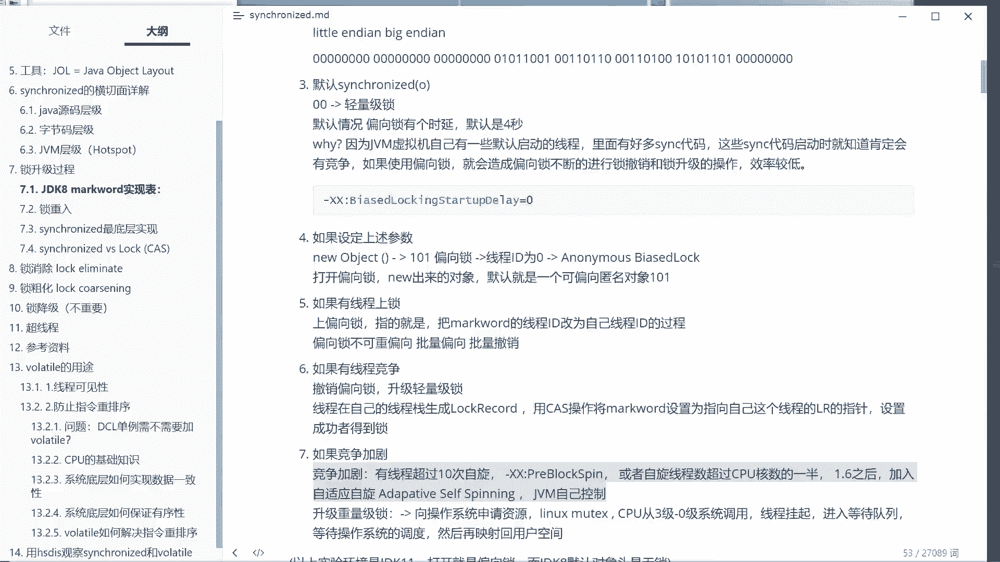

# 花了2万多买的Java架构师课程全套，现在分享给大家，从软件安装到底层源码（马士兵教育MCA架构师VIP教程） - P7：【多线程】锁的细节1：锁重入 - 马士兵_马小雨 - BV1zh411H79h

我们继续，下面我们来聊锁的细节，这个细节啊就超级超级多了，现在是九点半，要到哪儿算哪儿，我们首先来聊第一个细节，叫做锁重入，所升级。

那我们先来聊第一个细节啊，这个是。

所升级几点一。

好，锁重入，好了，同学们，我们先来聊什么叫锁重入，首先第一点呢，这个，synchronized写错了，呃syronize呢是可重入锁的，这新来的必须是可重入锁，那这个呃什么叫做所所所重入。

这个大家能理解吗，也就是说你看啊我有一个方法m这个方法呢是synchronized，他家的锁呢是o这个方法里面调了另外一个方法叫n，这个n呢哎他家的锁也叫o里边也是sonnet。

所以就相当于给这把锁上了两次，你发现没有，就是synchronized的m调n的过程，先给m上把锁，然后调到n的时候又给又同一把锁，我又加了一次，好像这里这个没问题吧，啊这一层一层的，我同学在那聊思索。

你在你在你在说啥嘞，这个不叫死锁，这个叫synchronized，是一个可重入锁，它必须得是可重入的，你知道为什么吗，比如说你的子类里面的实现这个m它是synchronized。

你的父类是synchronized，大家知道我们一般在这个子类的方法里面，我们完全可以调super。m没问题吧，如果你的这个siri不可重入，那就完蛋了，这种这种写法写不出来了啊，所以首先第一点呢。

synchronized是可重入锁，那可重入锁的概念就呃就就这个细节就来了，同学们，你们想想看这个可重入锁他在哪记录了，他重复了多少次呢，这事你们知道吗，有同学说老师记录在mark word里面锁一次。

我就加个一锁一次，我加个一，这样可以吗，这个可重入锁是必须得记录下来的啊，可重入次数，必须记录为啥嘞，重复次数必须记录，为啥嘞，因为，要解几次，解锁几次必须得对应，你重复两次就得解两次。

冲了三次就解三次，你要不记的话，你都不知道你解锁解几次，所以冲次数必须得记录，那记录在哪儿呢，好听我说这个不同的实现不同锁的时间是不一样的，我们先说偏向做实验，偏向索记录在县城站里，每增加一次。

每每重复一次，每重复一次，这时候怎么办呢，加一个log record，可以好说一下这个过程，这个过程是这样的，认真听，同时解释，刚才有同学问老师，那hash code去哪儿了，难道说你加了锁之后。

你还是扣的就访问不了了吗，不是不是解释这个过程啊。

那图调出来。

大家看这里，你来个对象之后啊，这里边记录了hash code，当然大家记住这个hash code，你没有调用的情况下，这里面细节也比较多，这里面的雕呢还是code，叫做identity还是code。

如果你不知道去百度identity还是扣的，注意它并不是我们自己重写的，还是code，它是identity code，ok那么如果有调用的话，这个hash code就记录在了我们的mc word里面。

那么这时候如果给他一上锁，你们看到了这里面就变成现成指针了，那现在第一个问题是，这还是cod跑哪去了，好我告诉你，所有的锁hash code都存档了，存到了自己的县城站里，听懂了吗。

存到了自己的l r这个record里面，这个record呢有一个指针指向一个数据结构，这个数据结构记录着前面这个状态的被做，用来做备份的mark word。

这个我们一般称之为叫displaced head，displaced head，可以替可以替代了已经可以替代的那个孩子，就是你认为他是个备份就行了啊，displaced mark word，那不好。

这个概念没问题吧，我们可以继续吧，所以如果是偏向锁的话，你要重复一次怎么办呢，就在这里再生成一个a l r，但这个l r里边这个值这个指针就是一个空值啊，因为不需要再记录了，我已经给记录下来了。

如果再重复一次，就再来一个，我要解锁的时候弹弹弹走鱼尾纹，弹完之后，我这锁就解了，好偏向锁是这样的，轻量级锁跟这个类似类似，依然是lock record，备份自己的原来的mark word。

接下来接下来就是你记录它的次数，每每每来一次生成一个l r l r弹完锁解开重量级锁的信息，我们没有仔细读，如果我没记错的话，这个你们去验证一下，它会记录在object monitor的一个字段上。

这个呢是惊动了操作系统的重量级锁，重量级所能处理的方式跟这个不一样，它会记录在object monitor一个字段上好了，关于可重入这件事，没问题了吧，不是replaced，是displaced的歌。

陈大哥啊，陈大吉，好所以锁重入这件事就是很简单。

不管你是偏向锁还是自旋锁，好那么接下来如果你是重量级锁，这我需要验证一下啊啊一个小小的问号，打一个小小的问号，应该是object，monitor的某一个字段啊，都是它的指向了一个对象的某一个字段手啊。

好了我们先不管了啊，先把这个略过啊，我说过啊，有些细节呢其实面试官也没有人问过啊，有时候我也懒得去找，找着东西呢，很无聊的，知道吧，面试官不问，我真的懒得着，我跟你说，并不是说读不会读，读不会读不懂。

我是懒得花这精力，人的精力总是有限的，刚才有同学问我了吗，说老师你是怎么平衡工作生活这些东西呢，没有平衡，只有取舍，人的经历也一样。

你同样的这个时间，你你你你你给了工作就不能给生活，给了生活就不能给工作啊，girlfriend a girlfriend b，你现在是2月14号03：05：48，你给他就不能给他，ok这个没有平衡啊。

我们重录这块就聊到这儿好，除了重录之外呢，我们呃再来聊一聊呢这个实现的一些小小的细节啊，就是所升级的过程之中的一些小小的细节，这个细节呢你认真听嗯。

嗯好。

大家听我说呃，这个细节呢是什么样的呢。

这个图没给他抓下来是吧，这个图也给大家抓下来。

好把这图给拿出来了啊，可不这图。

这图，嗯把这图给大家拽下来。

下次我要在讲类类似内容的时候是吧。

我觉得没有必要，每次都切来切去了啊。

复制图片到mx 64，这个叫，lock step by step吧。

就这个啊好，我们来看这个呃这个过程，这个过程呢有一些细节被我略过了，我们一点点来讲呃，我们首先讲这块的细节，这块细节是什么呢，就是我们刚才说偏向锁升级为轻量级锁，这时候只要有一个线程抢。

它就会升级成轻量级锁，只要有一个线程抢就升级成轻量级啊，当然这是偏向所启动的状态，如果偏向锁没启动，那么普通对象就直接升级成轻量级锁，那么现在问题呢我要讲给你讲清楚的是。

轻量级锁什么时候升级为重量级锁。

好看，这里，这叫自旋锁了自旋锁，什么时候升级为重量级锁。

为什么又变黑了。

why，我的问题啊，自旋锁啊，什么时候升级为重的一所呢。

大家听我说啊，这个过程呢我把它放到前面来啊，这个呢是竞争家具，什么叫竞争加剧呢，就是有线程超过十次自选，哈哈就有的人啊，你你不是一人一个人跟着大便，边上的人跟着自旋吗，在这等着吗，如果有的超过十次了。

或者是自旋的线程数超过cpu核数一半，你16个核自旋的线程已经超过八了好了，这个时候像是升级为重量级锁，听懂了吗，当然十次自选，你是可以通过参数来控制的，这个参数呢叫pay block stin。

你自己去控制啊，ok这叫做呃自选，当然这是1。6之前，1。6之前你如果聊jvm调优啊，老师不是讲的jvm调优课吗，如果1。6之前，你居然这个参数是可以调的，但是我告诉你1。6之后不要调了，为什么。

因为这时候1。6之后呢，加入了一个叫自适应自旋，叫addictive of spinning，到底多少次，以及它有多少个线程，这件事由jvm自己来根据算法来控制，所以这个不用你调了。

所以第一个问题就是细节上的问题啊，呃自旋锁什么时候升级成重量级，这点没问题吧。

有没有谁有疑问的，没问题，这个老师可以还能跟上吗，嗯对更智能了。

不需要你调了吗，还能跟上是吧，细节越变越多。

就大家跟着就就就慢慢越来越费劲了啊。

