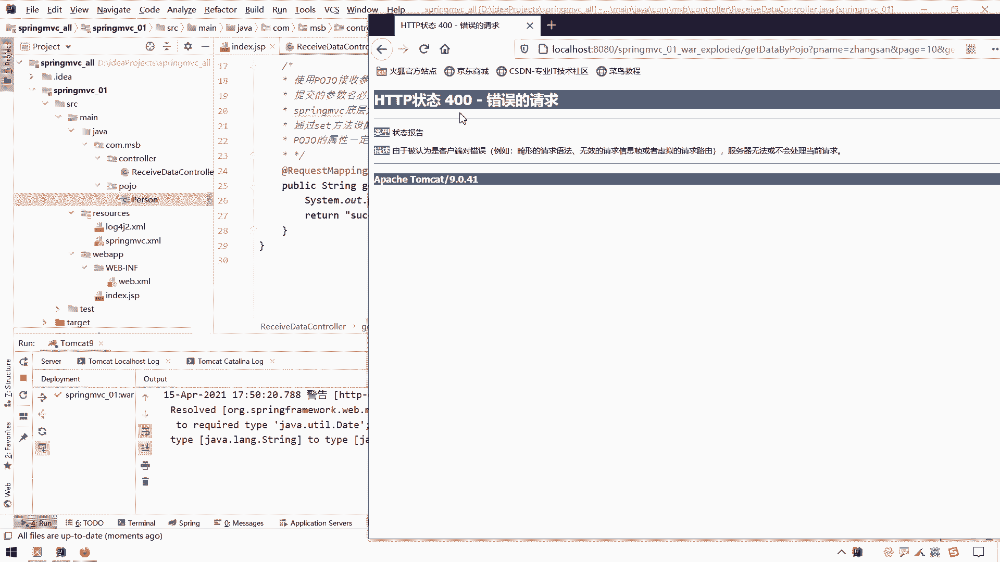

# 花了2万多买的Java架构师课程全套，现在分享给大家，从软件安装到底层源码（马士兵教育MCA架构师VIP教程） - P80：【Spring】SpringMVC_注入Date类型参数 - 马士兵_马小雨 - BV1zh411H79h

好我们用实体类来接收参数，这个小问题我们处理完毕之后呢，接下来我们开始继续往下去弄哈，这个关于日期类型的一个转换的问题，呃那么这个日期类型转换者是哪一个呢，就是我们目前在诶这个这个可以先关掉它。

我们目前呢在这个呃页面上所提交的这个参数呢有一个呢呃不太正常。

就这个birthday这一块，这个boss date这一块呢正常来说不应该用一个string来接受。

我们应该用什么，应该用个date类型，date类型的对象来接受哈。

嗯这块应该用什么，应该用一个a选中，它，应该用一个date对象的类类型的对象来接受，然后呢这个概率算的方法这块呢我这个时候我就使用loop插件吧，来一个at all arctor。

at no arctor，再来一个at da d d a t，然后上面这些没有用的，这个要好，那么呃我们在这块呃，把这个属性改成birthday之后，那么可能就会面临一个问题，我们这么做吧。

我们先做这个事，就是假设在这里面哈，我们不接受这个person了，我们就接受一下什么，我们单独接收一下他这个birthday，再来一个类型b r t b r t h d a t birthday，呃。

如果说我们在这块要是用一个string来接收的话，那毫无问题，因为之前我们也测试过对吧，直接就把那个文字呢转复制给这个字串就完事了，但这块如果我是要用一个date的话，他可能就会有一点问题。

我们把这个birth date给他输出一下，输出完之后呢，我们看一看能不能成功接收到这个birthday啊，或者是他有没有什么问题，还是在这儿我们需要重新的这个呃这个deploy一下这个项目。

这个回到我们信息比较这一页，好这块呢把这个信息的清掉，清掉之后呢，我们在这块再来一点，这块是1993杠三杠三，然后再来一个提交，你会发现此时就有一个400错误了。

什么错误呢，来看这哈，后面出现了个什么东西，就是呃他这个cannot convert value of java，long string to required tape java util date。

在这就他没有办法把一个string字符串给我们成功转换这个date，为什么有些能转换，有些转化不了的，像一些基本数据类型啊，它转换起来还是比较容易的，但是这个日系类型的转换起来可能会稍稍有点麻烦。

为啥有点麻烦呢，他没有办法直接把这个我们在页面上呢所填写的这个文字信息的，给我们转换一下，那怎么转换呢，我们可以呃，我们可以指定一下它的一个转换规则，就是告诉哈就是我们前面接收这个字符串。

我们用什么模板来进行一个转换，我们有两种方式可以进行一个转换，就是把前面这个字符串转一下，怎么转呢，第一种方式在这块加一个注解，然后通过这个注解来定义一个什么，来定义一个pyt模板。

这个模板里面呢就代表的就是这个字符串转成日期类型的一个模板，这个模板我可以这么写，这个这个mm是大写大写m m是月哈，如果你想加十分秒的话，那你在后面接着写这个h是冒号m冒号s就可以了。

但是目前这个日期好像只有这个年月日。

没有十分秒对吧，那我就直接连日就可以了，前面这块呢前面这块呢我们在这输入的时候呢，你就按照这种格式就往里放就可以了，那么这个时候加上这个注解之后呢。

那么spring mvc就知道了哦，他要用这种用这种格式来给我们把它给关掉，呃，要用这个啊这种格式来给我们解析这个字符串并转换这个date对象，那这个时候好用吗，来我们试一试看看行不行啊。

好再来一点提交查询，哎你看这个是继过来了，1993，然后呢这个呃3月三日就继续过来了，那那这是一个关于日期的一个转换，这是日期转换的第一种方式，但是你但是我们这个东西它好像并没有。

如果是直接一个date date类型的数据发过来，我们在这块呢这么一弄就可以了，这是第一种方式哈，呃这个给大家做一个截图吧，我直接把这个给你。

你control c复制一下呃，扔到这个日期型转换这块注解方式，其实这个是一样的，改不改的，改一下吧，再扔个截图啊，那么除了用这种方式以外，这个我们说呃我们这个数据接收的时候呢，是用一个对象来接收。

如果是用一个对象来接收的话呢。

那么我们这个接收的方式这一块，可能嗯这个这个这块我们要写的是一个person呢，它是一个person p诶，怎么跑下面去了，啊它是一个person p诶，那如果是一个person的话啊。

那么呃这个时候我们这个bd在在这儿呢，如果在这的话，能够成功的接触这个数据吗，是吧，我们再重新部署，清空之后再回来，好我们再来一点提交查询看一看，你看他又错了，还是这个原因。

就是这个person or project person啊，就这个这个person这个对象里面是什么呢，哪个属性的birthday这个属性呢，他已经拒绝了这个值了，为什么拒绝呢，那这时候怎么转换呢。

把这个注解加这看一看看行不行啊，然后呢还是一个pattern等于一个嗯y y y y杠mm杠dd哎，把这个注解放这放属性上看看行不行啊，一个是直接放这个参数列表上，一个是放属性上。

看一看这个o k这个是放在属性上，我们看看o不ok，这来查询看一看，唉这也是ok的，也是转换过来了，那就说我们这个as date for mt可以放于呃这个参数列表。

也可以放于我们的这个注解哈，诶怎么说他了呃，无格式粘贴可以用于这个参数列表啊，啊这个方法参数列表列表和什么呀，和这个呃我们的一个叫做呃对象和这个和这个类的属性上，属性上。

那么这个方式一呢也是我们推荐的一种方式哈。

嗯我们这个再给他来个截图吧。

呃放到这儿来这儿了，那么呃除了第一种方式以外呢，呃我们是这种方式，也是我们推荐的哈，方式一王皓也是推荐的一种方式，推荐该方式，因为该方式比较简单啊，你一个注解或者两个注解就搞定了，哪里有日期处理的话。

那你就放那里弄一下就完事了，呃另外一种方式呢叫做自己定义一个叫做类型转换器，那自己定义类型转换器这块可能就会稍稍有点复杂了，那这个怎么做呢，呃我们在项目中自己手动定义一个类型转换器。

我们就不用这个注解了，再把它给它给它给它注释掉吧，注册之后呢，我们可以在这个项目里面，然后这个专门放这里面放上一个叫做c叫做什么，date to a string to date。

string to date co n v e r t。

不是convert，我看这个单词是a converter c n v e r t r。

c o n v e r t e r converter，哎我们自己定一个类型转换器哦，refactor realme下，然后在里面呢我们定义一个这个类型的类型转换的一个类。

然后呢我们告诉spring mvc，当你遇见spring，当你遇见这个spring想转换成date的时候呢，用这个类型转换器转换，那怎么告诉他呢，那么在告诉我们要把它变成一个类型转换器。

但是呢要遵循一个类型转换器呢它的一个要求，那我们可以让它去实现一个叫做c o n v e r，t e r的一个这个类型转换的接口，那么我们可以选择哪一个呢，这里面有很多一个是map adapter的。

一个是这个呃listener这个up，还有一个就是spring核心的呃，那么我们选择这个我们先选择这个spring核心的吧，选择spring核心的时候，这里面有一个什么，有一个泛型，我们先选这个看看。

对不对哈，泛型就是从哪个类型要转换成哪个类型呢，把这两个发型往这放就可以了，泛型写完之后呢，我们重写这么一个方，实现这一个方法叫做convert的一个这个方法诶。

o你会发现string source就是我们要转换的源头，date就是我们要转换成的一个目标对象，那么接下来就转呗是吧，那怎么转呢，那在这块呢我们可以给他来一个这个用什么new一个。

这个叫做也不用在这扭了，不是每次转换都需要扭，我们可以在这块准备一个嗯，private，private simple date for matt，对象叫做simple呃。

叫做date for mac的对象，然后给他一个呃，给他一个new一个simple date for mate吧，然后里面给他指定一个日期模型，叫做y y y y杠啊，mm杠m m gd d。

然后呢我们用这个date for mt去转换这个source啊，来date for mate点有一个叫做pass的一个方法，把这个source往这一放，它会给我们生成一个对的对象。

我们的目标对象这个方法它有异常，但是异常的我还不不能往出抛，这是重写这个接口里面的方法，所以呢我们只能在这块给他，the song the way to cheat一下，那如果说转换正常了。

我们就把这个date呀给它干嘛呢，给它向上返回就可以了，我们可以把这个date对象声明在这date对象那个什么来解题，等于等于个now，然后呢如果转换正常的，就给这个data赋值，如果说转换异常了。

那么他就什么呢，他就这个嗯，他就这个呃出现就被就走这个catch了嘛，然后我最终return d如果成功转换了，那么就是一个正常的值，如果转换失败的话呢，走了cat，但是还是会正常返回，就是他一个闹呗。

因为这个data没赋值，但是我们可以在这手动抛出去上，the ro throw一个什么throw，一个new一个run time exception，然后呢在rap cl里面我们可以写成一句话。

假设叫做呃类型叫做呃日期啊，日期日期转换异常，让他好注册了这样一个转换器之后呢，呃我们自己定义了一个转换器之后呢，我们要告诉spring，就是你遇见这个日期的时候呢，遇见字符串转日期的时候呢。

你要用这个转换器来转换，那怎么告诉呢，我们要在这个spring mvc之中配置一下这个转换器能怎么装，怎么配置呢，首先第一步我们要配这个转换服务，配置转换啊，服务配置转换服务呢其实就是说明一个什么生命。

一个b哎，说明一个b，然后这个b呢里面有一个这个class。

这个class为这个类还挺长的啊，按照我们这来找哈，叫做conversion service factory b啊，这是一个哦，这是一个类型转换工厂。

类型转换工厂这类型转换，啊然后这个类名稍微有点长哈，拿过来拿了之后可以鼠标放上去，然后提示一下呃，more action，不能是create来b a n有没有提示诶，有提示啊，就他一回车倒下来了。

到这边之后呢，我们在这里面要配置什么，要配置它的一个转换的一个内容，就是用什么转换器来转换，给工厂注入一个叫做类型转换器啊，它有一个什么叫做converters啊。

类型转换器的一个属性，那么在这块给l给这个属性赋值啊，叫做配置类型转换器，播放器啊，然后通过这个property啊，然后来进行一个定义，有个converter的一个属性。

但这个converter是一个属性，它是一个什么属性呢，呃它是需要传这个一个集合，我们要把这个数据放在一个一个set集合里，再把这个set集合呢给它放进来，所以呢这块这个配置的时候可能会稍稍有点麻烦。

那麻烦就麻烦呗，在这边我们在写什么。

在写这个标签呃，按照我这个档上写字了哈。

我这边有个通过一个array数组设置，这么也行啊，哎试试吧，用这个array，那么我们要把什么，我们要把我们自己的这个类型转换器呢，啊这个一个一个类型转换器对象呢给它放到什么。

给它放到这个ari这个数字里面，那怎么放呢，写一个b呗，然后里面写成一个class class，为我们自己这个strain to date computer怎么写就可以了。

那基本上跟我们这个文档上也保持一致了哈，也就可以了，可以之后呢，我们就成功的在这块定义这类配置转行工，这叫做类数据转换工厂。

叫做数据转换工厂，那么这个数据转换工厂是谁用的呢。

就是用就是由我们这个叫呃叫做处理器适配器来使用的，就是我们三大组件里面这个处理器适配器，那处理器适配器在这种配置呢就是通过这个注解配置的一个注解，也就配置了我们之前的一个处理器，呃。

这个这个这个映射器和处理器适配器嘛，那我们要把这个告诉给处理器适配器能怎么告诉呢，在这里面我们通过一个叫做呃conversion service的一个属性来设就可以了。

然后这个conversion service这个属性使用谁，使用上面这个使用这个来给他一个id，叫做诶conversion service，那就完事儿了。

那也就是说我们下面这个conversion service呢自动走上面这个conversion service，就是把这个转换服务注册到我们这个这个这个处理器适配器上去，也就可以了。

那这个时候它就会自动给我们进行数据的转换，但是这种方式有点麻烦，第一个它是有点麻烦，第二个就是如果我们注册之后啊，那这个日期类型相对来说就在这写死了，那如果说我想带上十分秒怎么办，对不对。

所以这块呢我们不是十分推荐这种方式，略麻烦，然后呢又又又又不是那么特别灵活对吧，但是呢我们还是作为一个知识了解一下，测试一下哈，呃重新部署项目，这回呢我们再来测试一下，回到上一页呃。

然后呢再看这个control这一块，这个person这块呢，我们已经把这个date这个注解，我们看看这回能不能够成功的封装数据一点提交查询诶，你看他也是可以的。

那么呃我们关于这个时间日期的一个转换这一块。

