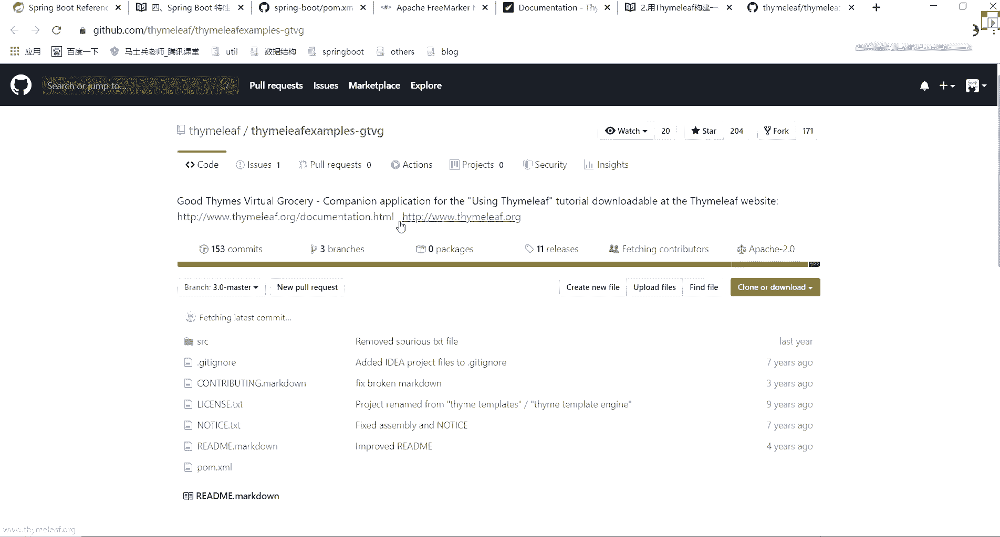

# 花了2万多买的Java架构师课程全套，现在分享给大家，从软件安装到底层源码（马士兵教育MCA架构师VIP教程） - P82：【Spring】thymelaf模板引擎 - 马士兵_马小雨 - BV1zh411H79h

好了这块我没问题，之后，ok这是我们的这个web web开发相关的一些知识点，大家发现了这些知识点，我都是从官网里面截取了一部分，就是我认为比较重要的东西拿出来之后给你们讲一下，来给你们讲一下。

这个我刚刚大家已经发现了我的模板引擎非常非常重要啊，之后我们在开发这个项目的时候，也需要用到我们对应这个模板引擎相关的一些属性点，所以可怎么办，我们来看一下模板引擎应该怎么做，快来找一下sirleaf。

我玩引擎呢找一下啊，在外边开发这块注意了，一般情况下推荐大家使用我们对应的一个模板引擎好吧，而且而且你注意一件事，模板的模板引擎，大家看这个除了rest for a rest web服务之外。

你还可以使用marvc来服务动态页面内容，spac支持多种模板技术，frame mark和js p，当然要注意了，gsb这块我不知道你们在公司里面还是否会使用，现在已经没人用这玩意儿了。

大家想一下jsp它是啥东西啊啊翻译官叫啥叫java server配置吧，相当于说在这次页面里面我可以嵌入我们对应代码，java代码，然后呢可以把我们后台返回的数据动态呢显示到我的页面里面。

而我们在使用我们对应的一个模板引擎之后啊，它也可以完成我们对应的功能功能，所以他说了，所以model里面提供了以下模板引擎的一个支持，free mark la，好吧哈，simf还有这个东西。

目前用的最多的可能是simp这个东西，他做了如果可以，请尽量避免使用jsp，当使用了内嵌sorry的容器之后，会有几个已知限制，这块有限制好，但不管怎么样，建议大家不要再用我的js p了。

最好用我们的simrp这块问题来了，silip我应该怎么学，在我们的spring boot的官网里面啊，官网里面mark这么多，你们诶问一下你们在公司里面用free mark用多还是用生命用多。

free mark用多扣一，simplif用多扣二，都不要，l e g s p只做后端枪弹分离行吧，这块啊如果你用free mark多用用多的话，你就它其实也一样的，你可以看一下他官方网站。

就是那个文件名称后缀的f t l啊，它里面有官方网站，其实也就是一些去对应语法规则，你把这些语法标签掌握了之后就够了好吧，这降完就够了，呃都不用清水js p这这这js p现在已经不用了。

大家看到了这个文档里面都比较简单，其实里面有if else if是不是有一些逻辑判断对吧，同样的simillif里面也是一样的好simillive也也是一样的，把它打开，这是simplive里面。

就是说你用simplive的时候，你可以怎么样呢，直接用我们的html页面等会就行了好吧，它不需要形成一个单独的一个模板引擎，就是用在html页面里面直接进行嵌入，这个地方就是simp它的一个官网。

把simplip用于官网，所以这一块我把simlip这块给大家重点说一下，free mark，如果你们有需要的话，把free mark一个重点学学啊，那东西也不也不难，还是一样，从公告里面看就行了。

他说了，在早期开发的时候，我们都用静态页面，也就是html页面，随着时间周围的发展，慢慢引入js p页面，当在后端，当在后端服务查询到数据之后，可以转发到我们的jsp页面。

可以轻松地使用js页面实现数据的显示和交互，这4p有非常强大的功能，但是在此时boss的时候，而且还嵌入了他们开的容器，因此在某种情况下是不支持我们的jsp页面的。

如果以纯静态页面的方式会给我们开发带来很多的麻烦，所以推荐使用模板引擎，模型很多种哇，有js p fmark sief是用二代码写一个页面模板，然后呢也就值动态的可以写一些表达式。

这些值可以自动后台查询之后返回去，好吧，这是它这个图官网点图啊，说ta然后tm页面这是dollar user，要说这后面可以用我们的date数据，此时你用模板引擎之后。

它显示的数据就是什么叫hello张三，就这样的信息，所以就是说把我们的数据做了一个原生替换而已好，所以simon live啊，他学起来并不是特别麻烦啊，并不是特别麻烦，大家看simlif有些介绍。

官网刚刚已经给你们打开了，还是老规矩，我们从官网里面来进行一个查看，第一个先选一下下面的有东西啊，docs是道高温闪，但他们这块有很多，大家看到了，是不是有using simp，有三的对吧。

有三的下面都是三版本，之前还有用二二的版本，现在啊可能用三星的更多一点，我这里讲的也是三，你可以把这些文档可以在线看，也可以直接把它给下载回来，这块我已经提前先下载好了。

一会儿把分析出来叫u等于simp和同学看这个文档的时候，看的可能很难受，因为全部都是英文的啊，全部英文的嘛，所以这块也一样的，我给你们相应的匹配的找了一个中文的网站，自爆塔，什么离谱。

看看就告诉你这simplif一个例文，什么simalef有什么样的东西，这块都是写好的，但是我们后面如果要进行一个项目开发的话，这块你是必须要会的，所以这块我们先拿几个简单的东西来给大家演示一下。

他到底做了什么样的一个事情，可以看一下什么是离谱，这做的比较一个比较详细的一个解释，然后呢能顺便这狗能处理哪些对应的一个模板，网页发出来，来你们存一下，当然还有一些标准方言，如何构建一个虚拟杂货铺。

这块给大家说一下，它这个网站比较好好在什么地方，它提供了一个对应的一个呃样例模板，也是他给了一个项目，你做这个项目之后，拿过来之后可以直接进行运行。

我这已经运行过了，给大家看一下，这东西叫这vt t，大家之后呢怎么做，直接运行，看看对应效果啊，看对应效果，就这是他那个simp官网里面提供出来的一个呃模板的东西啊，已经使用了是吧。

地址地址地址端口冲突了啊，停掉，一九，修好了吗，等一下啊，ok启动好了。

听到之后看到了吗，是大家提供好的官方网址，product list是有这样一个展示列表，然后下面有一个order list，然后告诉你说你怎么来查看里面有什么的相关信息，再做一个展示。

然后返回返回use the home，什么东西，return之类的，就是他做了这样一个页面，你可以进行自己的一个查询，好自己一个查询，所以这块你可以下载下来这个代码，把这个代码运行一下。

注意不需要改任何东西，直接需要嵌入一个copx容器，它能运行了非常简单的一个方式，这是他官网里面给我们做的一个最基本的一个提供啊，最基本的一个提供，提供了之后，下面更多的是什么。

你要看一下这东西应该如何进行一个使用，它有一个东西啊，标准表达式语法，然后看他说了，第一个叫简单表达式，里面有变量的，有选中变量的，有消息的，有u22 的，还有我们的片段，有常量，有文本操作。

有算术操作，有布尔操作，比较和相等，才叫运算符和特殊符号，这边是不是都有，所以你在用的时候直接拿这东西来进行查看可以了，而且每一个点里面他这都给你做了一个解释，告诉你说你应该如何进行一个最基本使用。

每块都解释了，所以这里面代码你其实可以拿过来之后，直接嵌到你的html页面里面，直接进行一个查看，都非常简单，这是第一点，你要看看第二点我如何来使用我们对应sif，好吧，你往下翻翻。

翻到这块有东西叫属性，在熟悉这块告诉你们说，如果你想引入片段的话，你要用什么叫t h insert好或者t是release，如果你要用迭代片段的话，用t是意识，就是我们的循环条件的话。

提是if局变量提示object，提示位置一般属性a t t r好吧，特殊属性上有value和f s r c文本的话属于我们text，然后呢呃片段的话可以用个for a forgent。

然后还有个t是remove这帮用的这些标签，就是说以后我们如果要写页面的话，你可以怎么样呢，直接用我们的fm这个引擎直接往里面嵌就行了，非常简单，这个属于前端吗，呃不算前端吧，就你写好前端页面之后。

你可以自己做一个基本的修改，你懂我意思吧，好了，那这块我们怎么来做呢，怎么来做呢，也非常简单，下面文章里面我给你写了比较详细的一个模式，第一点你需要先引入我们的模板引擎，我把地址也给你站出来了。

就给up地址好，这是第一点，当你把这个地址写出来之后，你注意了，当你引入当前这个配额妹妹的一个依赖之后，问的一个依赖之后，而中文方式可以放到silive文档里面，可以可以，我给你们加一下中文。

挖地给它粘一下，以后下课忘了变哪去了，我直接打开一下，重新打开，好就这样吧，你们直接访问就行了，直接访问就行了，让大家看注意了，当你导入这个依赖之后，相应的它会有一个会有什么呢，叫same leaf。

然后properties，所以这块我们也可以做一个最基本的查看，怎么看呢。

这写一个叫sim t之外leaf jm r e f properties，打开之后你会看到它在哪儿，是不是指定好了，我们当前这个目录是一个timeless这个目录。

然后呢同时还会告诉你说这有一个点html的一个后缀对吧，所以以后你如果需要自己开发一个web项目的话，直接写html页面就行了啊，写html页面就写了，写完下面页面之后，它会自动进行这些数据的一个渲染。

把那些值给我们给填进去。

这样我也举了一些例子，你把这个看一下怎么使用啊，看这我写了一个非常简单的一个需求，说第一你需要在java代码里面写一些对应的信息，比如说这有个叫model相关的信息，这怎么用啊，让我们写一下试试吧。

先看一下第一个我应该怎么进行使用。

把它关掉了就没用，把拿过来，这儿有一个ctrl是my ctrl，这是lo hello里面加一些东西，因为这是集成mvc的嘛，所以直接用model就行了，model。

卧槽这加一个属性叫model第二代h6 ，然后呢逗号spring再返回这边合页面，返回页面之后再回页面里面，我要写东西写什么，这边先不要了，不要正好注意了。

你要想在html页面里面嵌入我们这个c6 模板，这你必须要加载一个标识，是告诉他你用的就是我们sim lip这样一个东西，怎么加点，表示高考里面也有一个明确表示要找一下嗯。

哪去了，找一下我们的页面啊，这有页面啊，这个记得诶没有吗，这没页面有换一个，我找一下啊，看着就这个东西，你把它给拿过来，把这个代码拿过来，他说c打完之后站到我们刚刚这个地方t标签后面。

站完之后就搞定了，此时在用的时候，你可以干嘛叫显示加点东西吧，消息刚刚，喂冒号后面加一个东西，就加一个p标签吧，啊这加一个叫t h冒号是叫text，赢的时候这是一个变量嘛。

所以用dollar符号括号加一个东西叫msg好，加完之后，这能做一个展示了，现在我们把当前这个应用程序启动一下，启动让他报错了啊，加一个封号，睡一觉中画中画可以吧，可以可以可以中画中画也可以。

把那鞋也可能稍微麻烦一点，来行动号之后，我们这直接返回一个哈喽。

看这显示消息为hello，bot。

是不是意味着我们刚刚后台写进到model里面的一个数据，已经被我们前端这个页面给查到了，这是私用公制谱模板最基本的一个使用好，最基本的使用，所以它并没有特别难，关键就是说我知道如何使用这些标签。

或者说如果使用这个贴纸标签就够了，你要来说所有的属性你都可以加t h冒号，但前提是一定要加上这样一个呃标识，告诉你说你要从simc里面进行一个引入了啊，这块很重要，懂我意思吧，下面来再接着看怎么用呢。

现在告诉你说simplif支持的一个语言表达式这块给粘出来了。

这块粘出来的信息啊，粘出来信息就是我们刚刚给你看的东西啊，从官网里面看的哪看的哎，嘿第四块是标准语法表达式里，每个里面表示什么意思，你要去边上的时候用dollar选出表达式的时候用星。

然后呢消息表达式用井号，这个下载的是一般在国际化的时候用的比较多一点，然后还有什么呢，选择我们的u22 ，用at符号，如果是片段的话，用波浪线对吧，你别告诉你有还有其他的一些曲折的方式。

你直接拿过来取就行了，循环怎么弄呢，一会我给你演示循环应该怎么操作好，同时下面还有什么，第十块，你记住了，第四个点里面告诉你说有哪些属性标签，你可以进行怎样的一个使用，这块东西，文档里面文章都写好了啊。

这张出来图说了，semitive实例演示，test表示文本的一个内容，value表示当前元素的一个值，ph就是表示什么是我们的循环操作了，if表示切判断，insert表示我们代入的那个代码块的一个植入。

然后呢fm表示定义代码块，object声明变量a t e r表示修改属性，那修改属性一般没人用啊，一般没人用，现在怎么做呀，来先看这个方，我把这页面直接站出来，说这这样写一个页面吧。

他们这里面右击另一个a t m a n c h y m e l e f转过来，二位二位扎完之后，大家发现了这个页面其实并不是特别麻烦好吧，81级第一导入这标签，第二告诉你说这是一个text。

you text，然后呢，这有个value，有个each，是不是循环，还有什么呢，我们这有test，然后object是不是各种变量的一个引用，这还可以做一些逻辑上的一个判断，是不是这意思啊。

而且这可以做一个循环这个东西，这东西并不难，关键是什么，这些数据来自于哪，这些数字在哪看，还是一样，你从你对应的controller层里面给它做一个最基本的返回，怎么返回。

再一个public three，这写一个sir括号，加一个at request，main括号c r e m e l e a f clef，提示y，加进来，加完之后是不是可以往里面写我们对应属性值了。

这是原值，你也没必要自己写，我这都写好了，把拿过来看。

c认为这样加一个属性叫model map map，这是少一个person slay是吧，我们建一个person类吧，又一个配置问题，t这定义一个class person，private就这样name。

prada int age by the stream，真的这东西都比较简单，然后写一个构造器，吴三的，韩餐的就加一个set get方法，再加一个突袭队，好了，这定义好之后，这个值不就有了。

ok当你这块写完之后，写完之后就ok了，现在怎么样呢，直接我这是弄好了，这边呃挺妙的哟，重启一下吧，重启一下，感觉有点像以前sars标签其实还是一样，不管是sars源有什么。

是不是有东西og n表达式好吧，你想一下你在学你在学那个js p的时候，g s p的时候有什么东西，是不是有个东西叫e r表达式对吧，还有一个叫什么叫e g g s t a r表达式对吧。

现在呢在thrust里面有个叫og n r，有人用微信号，相当于你知道死啦死炸死，很多同学已经不知道这东西了，好像现在里面就是用了一个t h，其他现在都是什么，就是c标签，p标签。

是不是这些标签用这个标签拿来用就可以了，就这样意思啊，对象导航图语言对，是这样的东西好了，这儿发完之后，我们这儿可以发送一个对应的请求，凭什么信息啊。

叫silit h y m e l e a f到，怎么摆放2p也是看这请到了吗，是不是这些相关的数据我已经全部都请求到了对吧，这块你可以跟我的页面的做对比，好做对比，对比之后你会看到这儿请求东西。

就是我们想要的那第一个这test什么东西，然后呢引入对应的一个值，把这个值给做一个演示，同时这里面还有啥页面了。

是不是还有我们对应的一个循环列表，而least等于啥等于啥等于啥，是往里面显示我们对应心就行了，好判断下是否为空，然后内部等于啥，a就等于啥，真的等于啥。

关键就在于什么呢，再说你在使用这个html标签的时候，你要知道这些属性应该怎么引用，这里面我们主要用两个标签，一个是doa开头的，一个是新开头的多少开头表示引用的是什么，是对应的一个变量值。

而c开头什么意思，是指的是我刚上面是声明了一个变量叫t h object，object里面这个对象里面的属性，你要想引用的时候，必须要用星来进行引用了啊，这是他们之间的一个区别。

像后面刚看到at的标签对吧，这东西我后面会演示的，在这页面你要会写明白我意思吧，好吧，你要知道这个标签应该怎么进行引用，看到了跟我们刚才一样比一样一样吧，是没啥区别啊，非常简单的一个实例啊。

现在之后好好看一下这东西难吗，不难吧，这sima leaf最基本的一个使用这块拆之后。

一定要自己做一个演示，这块来听麦同学扣个一。

能听懂吧。

好了，除了这个sim live这块之外，还有什么东西，我刚说了，还有标准表达式语言，比如说dollar变量使用新叫选择变量表达式，这两个东西在上面的时候都已经用过了啊，所以我们这不再演示了。

好不再演示了，但是你注意了，这个变量在使用的时候，它还有很多小细节在里面，什么细节，比如说这第一个我可以把我们的session里面放数据，就是说它可以获取到我们对应对象的属性和方属性方法。

同时可以使用什么呢，cd s mars local request response session，所谓的contest是不是这些内置对象里面的属性，我也能从里面取到，比如说这样我来做一个演示吧。

非常简单，打开我们的这里面。

在我们的请求里面加个逗号参数，逗号叫a ttp session session，加一个session点，set tribute，这写一个name逗号张三加完之后你也一样，在页面里面加一个东西。

一标签t h冒号test，这写一个叫dollar括号，session点叫name，用完之后呢，我们现在重新刷新，我们对于一个浏览器页面。

是刚才出来了吗，出来了吧，是不是那个对象里面的属性值也能可以获取到，所以它用起来比较灵活一点，比较灵活一点，你可以按照自己的想法，所以去进行一个更改好，这是第一个标准表达式，除之外还在干嘛。

它还提供了很多内置的一个方法，比如说days日17吧，debus数字吧，string字符串，object对象，array数组list集合30倍集合，map是被集合。

我还可以用这些内置的这些方法来做一些处理对吧，里面每个东西都解释了有哪些常用的方法，这块下面都给大家写案例了啊，都给他写案例了，下来之后，你可以把这些案例拿过来之后好好演示一下。

好看一下大概是什么样的一个效果，ok ctrl层里面怎么往里面复数赋值，放数据我也写过了，我也写过了，从拿回去之后好好看看，我都写的比较多，写的比较详细了，所以你有能力啊，把这些东西全部完成。

懂我意思吧，好吧呃，下午时间差不多了，我们大家来聊聊这么多，晚上八点钟我们还有课，所以一会儿我把这个文档给大家分享出来，翻出来之后，你先按照我刚刚写的那些文档，先自己去做一下操作，特别是作为初学者。

一定要做一下，哪怕你把代码复制过去运行一下，要用好，也要试一试，懂我意思吧，8年什么课还是charger smoot，刚刚没讲完，还讲什么东西，比如说国际化我们还没讲。

比如说我们的呃数据数据源还没讲好吧，以及我们估计今天晚上把数据源讲完，讲完之后，我们就开始讲源码，好给你们讲很多东西，所以一会儿把这个文档里面代码先做一个实施好，做一个演练，完了之后，我们晚上再接着聊。

好吧行了，今天东西难吗，觉得男同学扣一不难，同学扣二，难啊这还难啊，sn bot是不是一般不配置多数据源，我记得上一次是谁问我说呃，swibot是不配多配置那个额数据源。

多那个多数原配置总配是是你问的吗，冯生可以配可以配，我这儿给大家写好了，我专门准备了一下，专门准备了一下spring board数据源，今天刚学了数据源，找一下啊。

大哥看着spring boot多数据源的一个配置，我这都写好了，好晚上的时候可以给大家演示一下这个效果好，怎么来切换我们的数据源，这块都有，所以你们面试问到的一些点或者自己不会的点，这样都有啊。

可以随logo对，确实随着logo晚上看挺麻烦的，比s麻烦，需要用到three里面的l o p，先用到spring op，还有很多东西啊，这块我都写好了，晚上讲的时候咱们再说行吧，md是什么软件。

那这里面带一些格式啊，看起来更舒服一点，看起来更舒服一点，笔记传到哪里了，传到我们的get up上面去，我一会会把上传，会把上传，这样左右都会都会给你传上去啊，要这么对，哎，这也可以弹啊。

看搞一个maven的一个插件就行，好像是maven插件就行了，行了，今天下午咱们就聊这么多，晚上八点钟咱们准时再见，好同学们，ok拜拜，老师这个中文到哪找的呀，哈哈哈，中文文档，你你你你你找就行了吧。

这个这个百度里面都有吗，其实大家发现了，其实我现在不是在百度里面找，就你看到我们这些中文网站啊，他都在同一个根目录里面叫gtbook，我不知道这个网站你们有没有人看过叫gtbook，这个网站下去之后。

你们可以注册一下，好，可以注册一下，里面有很多的一些中文的一些相关翻译，这都有要注册啊，这只比较麻烦啊，这边东西比较多，我基本上起码需要中文档的话，都会从这里面搜，这边搜啊，剩下就行了，好了。

就聊这么多吧，晚上再见拜拜，对所有课东西都往上传，是的。

