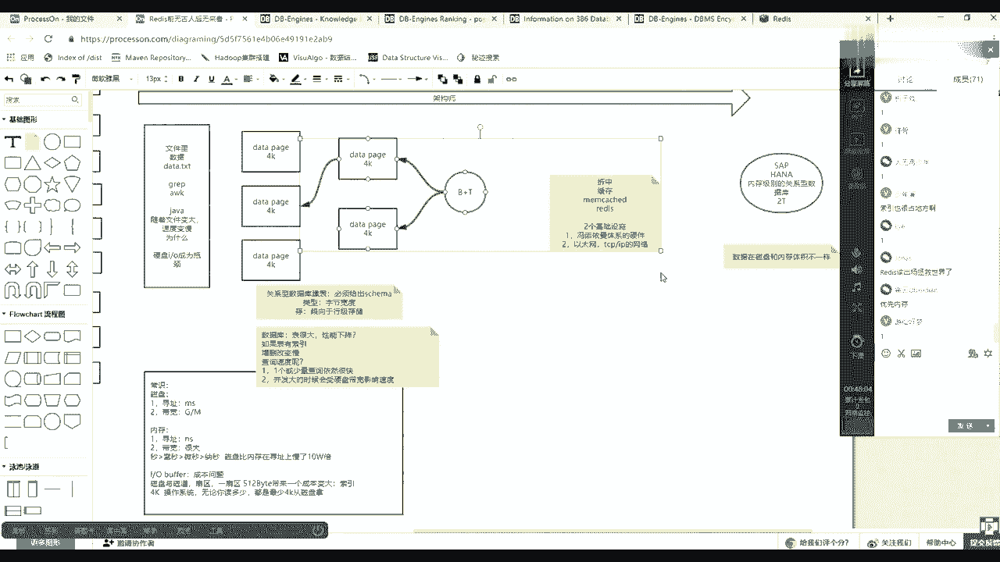

# 花了2万多买的Java架构师课程全套，现在分享给大家，从软件安装到底层源码（马士兵教育MCA架构师VIP教程） - P84：【Redis】数据存储发展进程 - 马士兵_马小雨 - BV1zh411H79h

哦数据可以存在文件里，然后数据如果存在文件里的话，如果我们要查询这个文件，比如说里边有马是兵，要怎么怎么怎么去查啊，一个文件里边有数据，比如说什么data。t i t可以怎么去查。

linux当中有grape，有a wk等等的这样的命令，你还可以用java语言等语言写个程序，然后做一个基于这个文件的i o流读取。

查找数据就放在文件里的话，然后你用相同命令去查的话，随着文件的变大，它就一定会查音速度变慢，对不对，是不是这么一个结论，随着文件变大，速度变慢，那么为什么为什么呀，是因为文件如果变大的话。

这时候访问硬件的时候，访问硬盘的时候会受到硬盘的瓶颈的影响，对不对，硬盘成为瓶颈，换言之，也就是io成为瓶颈，这是计算机目前不可逾越的，对不对好吧，这是第一个时间点，这是一个基础知识啊。

这个基础知识当中带出这些常识，那么随着时间的发展，如果数据都这么放的话，肯定节奏特别慢，如果能变快呢，数据库是不是出现了当时数据库出现出现的时候做了一件什么事情，注意数据库。

这就基本上2~3点可以去描述，第一有了一个data配置，这个配置真的它的低端配置的大小多大呢，是4k，现在如果再跟你说数据库里边，如果你有一张表，你建了一张表，表里面那么多行了，存档存到磁盘的时候。

他其实在你用物理存的时候，好像用了很多很多4k这样的一个小格子，那么这个4k刚好和谁一样，是不是刚好和我们硬件的这个磁盘子里边那个4k这样能对上，明白什么意思吧。

所以这时候如果我们的数据库准备很多这样的4k，也就是曾经数据是在一个文件里边线性，它虽然到底层的时候还4k，但是这一批文件混在了一起，这个4k连起来了，不能把他们割开，找不到他们在哪。

但是如果现在在在在我在我上面软件里边先定义出一个4k，然后每个4k有自己的id 0号1号2号，且这个4k啊，读取这个这个你要读这个4k这边某某一个某就要读它的时候。

正好符合你磁盘那个一一次的i o符合a4 l也没有浪费这个io，明白吧，你可以把它变得更小，比如变成变成1k，但是你会发现你你上层软件这个数据库想读1k的时候，硬盘是不是读4k，索性你还不如怎么样。

直接上面是4k，反正你你要查什么东西的时候，从我上面就掉某某一个某一个位置了，底层就咣当就把这个拿出来了，然后比较大可以比如我定义成8k 16 k可以定义小了会有浪费，定义大了无所谓。

定义大了是无所谓的吧，就是那个可以把大数调一点，但是调小的话其实浪费了，那你读1k底层还是都4k没必要，咳咳那么这样的话注意这是第一个知识点，它会分成很多小小格子，那么曾经这个文件里面可能1万行。

10万行就散了这么多的小格子里边，但是这个时候如果光有这个4k的那种小格子的话，其实你查找数据的数据的成本复杂度还是和前面一样，为什么，因为你还是要从第一个4k先读到内存，然后再读到内存，再多挨个去找。

所以他走的还是全量，i o跟前面io量是一样的，所以他一定会很慢，那么数据库怎么样可以让它变快，也就是建表，如果你使用数据库只是建表了，没有去建索引的话，其实那时候根本就任这个任何提速。

这个这个不可能出现的速度，一定的话会会会很慢，所以聚会的时候另外一个东西就是索引，索引其实也是使用的4k这种存储模型是对应模型，无非就是前面这个4k格子里边放的就是我一行一行的数据。

然后这里边4k里面放的就是什么呀，是我内行里边你面向某一个列，就是升证那一列，我就把身份证那列数据拿到这边4k里边，然后每一个生日号指向的是哪一个c的配置，有一个指向关系，这就是所谓的索引。

那么这个索引，所以你数据变大的话，那么你这个索引肯定也会很多，能看懂，同学们，这不能理解吧，唉就是一定要明白一个概念，数据是用4k4 k去存的，然后你的你的数据如果没有索引的话，速度会查。

查询速度还是很慢，如果想提升这个速度，你就必须有一套索引，搜索引系统，其实变相来说它也是一笔数据，然后这还有一个知识点，就是在我们建工业型数据库表的时候，在建表的时候就关键数据库一般是用什么尊重方式。

在见面的时候必须给出什么呀，必须给出，scheme，什么叫必须给成schemm，就必须给出这个表的啊，一共有多少个列，每个列它的类型是啥，就是约束是啥，那么这里边的每一个列的类型类型其实是什么呀。

字节宽度，比如我第一列是watch 20，那么这个第一列未来就是上线开开辟，就是他一定会开辟20个字节，那么当一个表为什么在使用之前要先给出sker，只要steam给出类型的给出之后。

那么这个表里边的每一行的数据的宽度就已经定死了，你懂什么意思吧，那么这样的话，未来如果你像这张表插入了一行，假设这一行有十个字段，有十个字段，你只给出第一个和第七个，剩下资本都没有给。

但是像这个data配置，你去放的时候，第一个和第七个以及其他那些没有知道那些字节都会就会用零去开辟，用空的东西去补充的那些字节，那么这样会有个什么好处，注意听啊，首先表里边这个概念。

然后存的时候更倾向于行级存储，就是以行为单位来存，为什么，如果你给出scammer了，给出宽度了，那么我这一行假设有十个字段，每个字都是四的话，就是40个，即便你只给了其中一个字段有值。

那么剩下的那个30多个我也会占空，把这一行位置站出来，就站位站位这样一个好处就是未来你的增删改，你比如在向其他补充的时候，你不用移动数据，直接拿你新的数据在那个位置浮写就可以了，也就是数据库。

关键数据库表示行情存储的，然后呢数据是数据，所以也是数据，但是这时候如果有了这个索引之后，其实还差一个东西，为什么你还要注意一点，就是数据和索引其实都是存储在硬盘当中的，都是存储的硬盘。

然后就是真正查的时候是要用到一个东西，就是在内存里边准备一个b加数，内存是速度最快的地方，所以在内存里边准备了一个b数，什么b加数，b加数，所有的叶子就是那些4k小格子，b加数，其实树干是在内存里的。

也就是说有的区间偏移，然后这个时候如果用户想查，只要命中索引了，那么这个查询在b加数会走树干，最终找到某一个叶子，比如你的身份证号，那个号刚好在那个叶子代表这个区间里，那么把它会读到从磁盘读到内存。

把它解析完之后，最最最笨的话便便列完了之后，可以知道应该下一次把哪个data配置放到放到内存里面读进来，那么就可以找到什么呀，找到我们那个那笔记录了最简单的b加数，如果复杂的话。

你就想二叉树中间如果是八的话，左边是小于八的，一边是大于八的，如果你要查查22的话，是不是一定走右边那条路，所以树干的话一定会沿着一个这个最小的方向去找，最终找到一个叶子。

叶子里边可能给定区间是比如说从那个9~30，那你221定出现出现在里边，但是9~30那些明细记录是在这个磁盘的那个小格子里的，你需要从磁盘读到内存，如果把这些索引在堆到内存里的话，你的内存不够。

存不下这些索引，所以索引和数据都放在磁盘内存里，只存一个树干，只存一些区间，就这么讲就可以了，这样的话是充分利用了各自的能力，磁盘能存很多东西，然后呢内存速度快。

然后呢用一种数据结构可以加快你的便利这个查找的速度，然后从而呢又数据就是分而治之的存储，所以这时候你获取数据速度极快，最终的目的是为了减少io的流量，磁盘有这么多缺点。

那么我就不让它发生大量的i o以及减少的水准的这个过程，明白了吧，哎那么这是我们的所谓的数据库这块应该很好理解，当这个理解之后注意，那么随着这个数据量的变大。

假设这张表这张表我不止这么几个data配置了，这张表本身涨到几千亿行，几万亿行啊，或者几百万行，数据量变大的时候变成1t2 t了，那么这时候你都应该听过这么这样的一句描述，就是数据库的表如果很大。

减脂速度一定会变低，也不是检索，就是这个性能一定会变低，对不对，那么这句话如果面试问题的话，应该怎么去打，就是如果16的表是不是好，很多性能就会就会降低，对不对，那么这句话在回答的时候你要小心了。

我把这个笔记能给你做下。

那么这句话描述的对不对。

首先增伤感，如果表有索引，如果不索引的话，然后增删改变慢，因为你要增删改数据，修改里面数据的话，这个数据你见了多少索引都会找这个索引列索引，你提数据去修改这个索引，调整它的位置，对没错。

就是维护索引会让你的增删增删增删改变慢，但是查询速度呢，查询速度会不会变慢吗，查询速度会不会变慢，增删改一定会明白，差距速度会不明白，那么这个时候你要两答，第一把有两个打法，这两个你都要出来。

第一个假设我这个表100个t硬盘就能装下100个t，然后内存也刚刚把书这个这个b柱的书干能都能存下，然后呢哪儿都没有溢出，那么这时候注意来了，一个人的一条简单sql查询其他vr条件能够命中索引。

那么这时候如果少量它就是一个或少量一个或少量查询依然很快，那六是什么意思吧，就是一个查询进来之后，因为你vr条件走的还是内存，b数走的还是一个索引块，这个孙块到到到内存依然走的是一个data的配置。

他并没有说你数据量变大，我未来会把别的位置也也要带到内存里面去，但是什么时候会查清流速度速度会变慢，也就是说当并发很多人到达了很多的查询都到达了，或者一个复杂的思路到达了。

那么这时候查询的时候不是要获取一个data的配置，当你存了有可能要获取，因为你数量变大，数据量越大，能够被很多查询命中的几率，被不同命中的几率就会很大，所以这个时候会受什么呀，并发大的时候会瘦。

刚才不是说了一个常识吗，也就是说硬盘的带宽对不对，手，硬盘带宽影响速度，也就是说假设来了1万个查询，每个查询查一个4k，就每个人查那边条件都不一样，刚好是用散弹不足4k上。

那么这1万个人查询东方进入到这条服务器服务器之后，那么这1万个人的每个4k是留着挨个的，像我们这个内存去走的，差一个你走差一个你走查一走，查你走。

那么这个时候其实有一部分就会等待前面那个4k他们走完之后，能轮轮到自己，能听懂什么意思吧，我刚才甲壳都是必数，不会受到影响，内存还可以，这块是咱能清楚同学的，就是这句话很重要，因为你一定要明白硬盘的慢。

除了寻址慢，是不是带宽。

是不是还有一个带宽，所以这两个你都要说出来，说你把哪个少说了，其实都是少覆盖了一个范围。

ok，好嘞，那么接着聊，那么数据库先简单聊了这么多分库分表啊，分制分布式这个事情不去描述它，那么如果说数据库已经使用磁盘了，那么这个时候其实尤其到后边这个查询，这也发现了，如果数据量特别大的时候。

它就一定会对增删改查，尤其在并发下的时候，他查的速度都会同等下降，都会变慢，那么这个时候如何去解决这个问题呢，那么首先看一个极端，也就是如果发展到最最最顶头的话，会一个极端。

这个极端是s a p这家公司有一个hanna数据库，这家公司有没有听说过这个汉娜数据库，有没有听说过这个sap hanna数据库是一个什么数据库啊，是一个内存级别的。

内存级别的关系型数据库行在这一个小常识啊。

这个故事我相信在哪都听说过，但是这有一个小常识，就是数据在内存和磁盘体积不一样啊，数据在磁盘和内存体积不一样，这句话能不能找到找找找找到那个点，什么叫数据在磁盘和内存体积不一样了，什么意思。

你要明白在磁盘当中是没有所谓的指针的概念的，数据是不可能出现什么呀，出现一个所谓像我们对象一样，我队里就一个对象，我可以不同的线程里边或不同的地方有不同的引用，如果数据想出现在索引。

那么比如身份证号就在这一定会出现，然后他就是原原原本，这还得有一个身份证号，所以这个数据一定会长出，一定会涨出，但是同等，如果关系数据库使用磁盘存存了2t数据，那么如果迁移到汉代的数据库的话。

当内存里边的不是2t，可能1t多一点，因为你这边不可能建一套缩影，而且它可以启动一些压缩优化的策略，好吧嗯好了，那么这个时候注意两个极端，有了这片有这么一个使用磁盘的数据库了，这边有一个基于内存了。

这边我们大家都买不起，这边呢我们数据量又会变大，然后性能又会变低，打半咋办，然后在企业架构当中，如果你现在给公司在维护着一个web一个架构，那么这个系统一定会越来越大。

里边的页面里边的数据一定会越来越多，然后这个时候如果这个东西你们公司肯定买不起，就甭想这个速度了，那么这边的话你肯定使用的是关于数据库，那么关于数据库，数据变大的时候，增删改查都会相应变慢。

尤其并发到这个这个这个出现的时候，所以这个时候什么概念出现了，那么有人说有没有折中，折中的方案，这个折中的方案就是什么缓存，这个过渡的这个过程有点稍显快，但是能知道我为什么要说这个缓存这个事了吧。

明白吗，就是说我还因为没有办法这个内存级的我买不起，然后呢，我还得使用磁盘机的，但是我磁盘记录特别慢，那么我就用小一点的内存把一些数据牵出来，放到这个位置，那么缓存的概念就被提出了，缓存里的记录有很多。

比如mitch，然后还有我们今天要讲的主角redis这样的技术好吧，这就是今天要讲的东西，就把它带出来，那么你就想成这个mac，这个redmc其实就是目前来说什么呀，目前来说没有办法。

所有的it信息系统都这么多年了，从194几年到现在，1966年还是4年，到现在4年应该是第一个这个计算机出现，有两个最基本的常识，两个基础设施，一个是冯，冯诺依曼体系的，硬件制约一个是什么呀，以太网。

和tcp ip的网络，这是所有目前的所有信息系统，两个最基本的基础设施，这两个基础设施没有办法，所以redis才能出现，如果现在硬件不是浮动，一般体系什么量子计算机出现了。

然后所有的硬盘io带宽的问题都解决了，那么估计就没有人再用redis，用mac开始做缓存这个事了，另外一个以太网tcp网络这种网络潜潜台词就是不稳定，所所以这个时候如果你曾经用一个技术。

现在要整合多个技术的时候，那么就一定会带来一些问题，数据一致，双写等等很多很多问题。

所以这时候后边知识讲的时候。