# 花了2万多买的Java架构师课程全套，现在分享给大家，从软件安装到底层源码（马士兵教育MCA架构师VIP教程） - P85：【Redis】数据库引擎介绍 - 马士兵_马小雨 - BV1zh411H79h

有这么一个网址是db的，就是引擎数据库引擎点com啊。

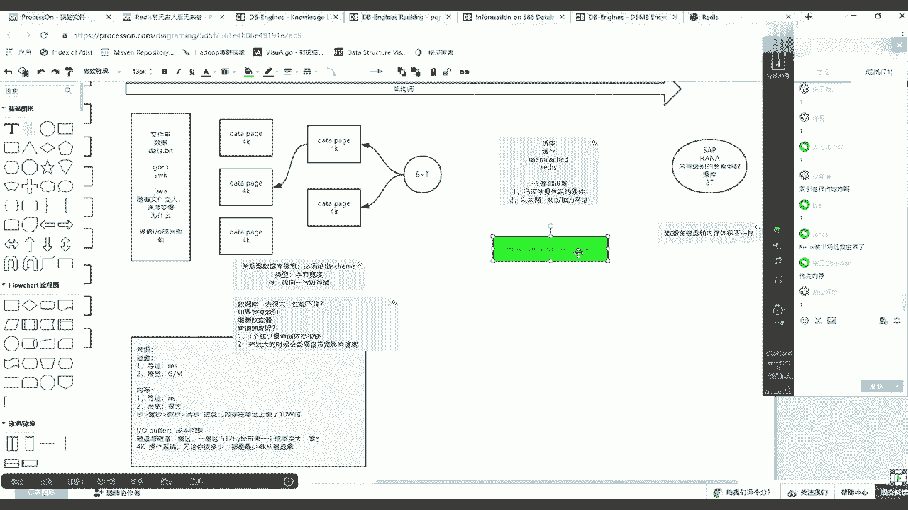

你现在可以随手在你身边，如果富余电脑，你可以看一眼啊，然后打开这个网站，上面有这么几个，一个是排名数据库引擎的排名，一个是数据库系统有哪些系统，每个系统它是干什么用的，以及什么特征，一个是相应的百科。

现在百科我们先来看一眼排名点他。

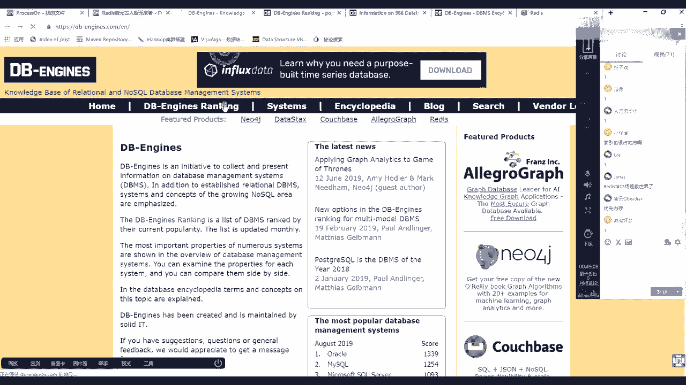

那么会得到一个很多的很多的数据库。

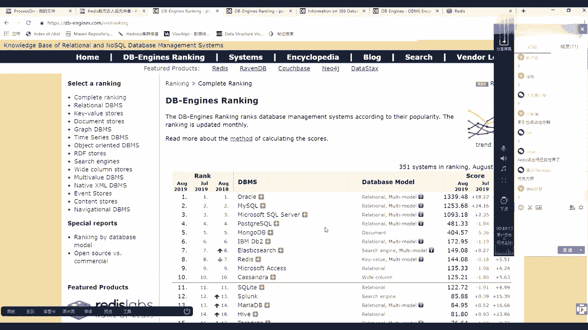

数据库里面有很多东西，首先你明白为什么讲它还是这句话，大家都是架构师，未来你都是架构师，无论你是你是真的架构还是摄像剧的，你都是架构师，架构师必须有一个能力，就是技术选型和这个技术的对比。

就是你一定要给公司做出一个正确的选型，你选对了记住选对了，咱就用这个数据库吧，就用这个了，那么你公司可能最后上市了啊，你选错了，一一堆人跟着你往下走，那么公司可能破产了，就这么一个最基本的一个概念。

架构师可以把一家公司带到上市，他有可能把一家公司带到破产。

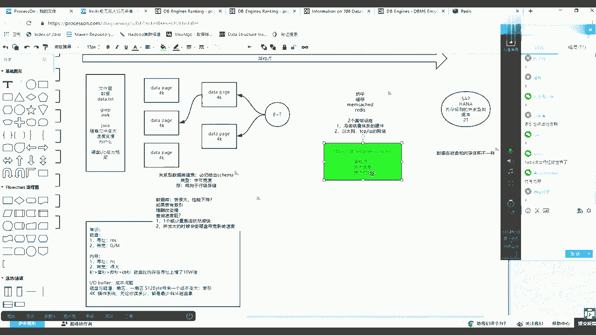

这并不是跟你说笑，能理解吧，那么来看这个排名，在排名当中对我们数据库看第一名的是谁，是oracle，这是关于数据库，对不对，注意后边上的每行描述，它是一个relational的一个关系数据库。

第二名mysql，那么也是一个关于数据库第三名微软的sql server，然后等等巴拉巴拉ipad b two到第七名的时候也来试注意，这个时候这个mongo db是什么呀。

然后呢到原来sir的时候是搜索搜索引擎的，然后到第七名的时候，哎，release出现了，但是注意它是什么呀，它是k value型的，基于内存的，那么这个数据库的排位你可以往下多看一看，但在这要注意点啊。

他的排名是全部的排名，但是注意看左边是不是还有很多的分类，对不对，那么这里这里面关系数据库排名，你可以单看关系数据库的排名都是关系的，这里边一个会出现我们刚才说的s1 p的hanna，看了吧。

这个数据库也是有的，然后你可以再看kv的，kv的数据库，第一名是谁，是redis，这个对的啊，而且是基于内存的速度很快的，这时候你就知道为什么现在所有出去面试的时候，如果达到二三十万年薪以上了。

redis这个词汇一定会出现在什么呀，他那么一点点区域里边必须要写一些话描述的招什么人，但是大部分的企业bt等等都会把这几个字母放进去，就是他的地位很重要，别急，再往下走，这个网站有很多可以学的地方。

你先去把每个分类排名都去看一看，看看之后，其实这些分类如果因为咱们肯定还有一些小白。

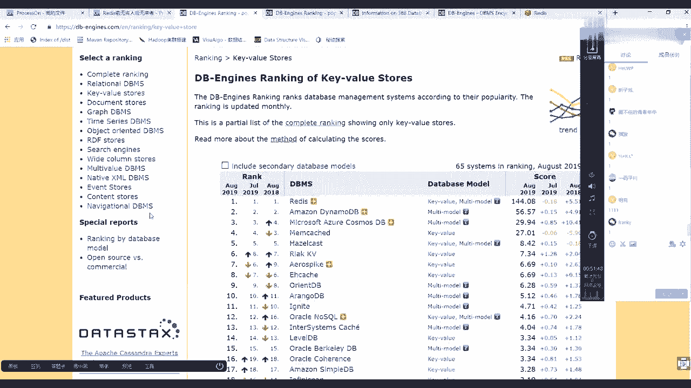

然后从此之前没有怎么从事过这个这个这个这个行业的，除了排名，这个这个这个区域还有一个systems。

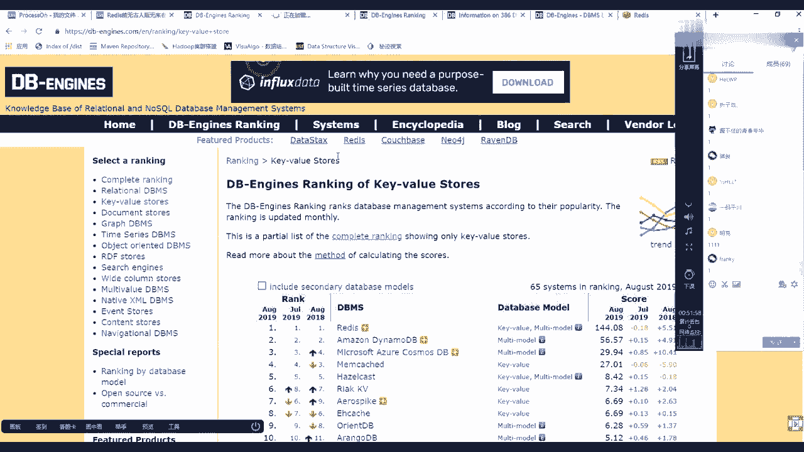

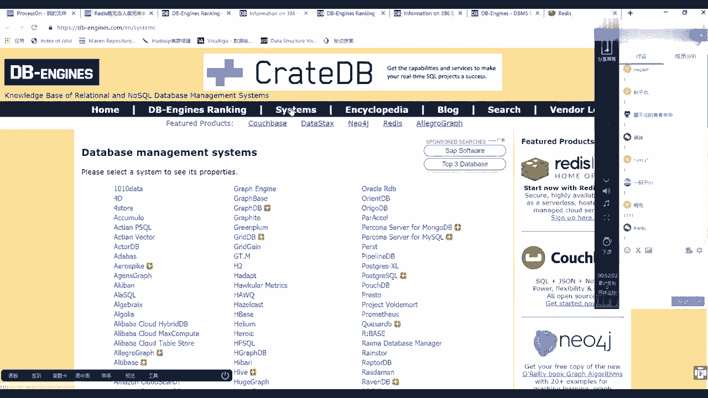

这里面会列出所有的，比如说我们拿两个最基本的好吧，后边这个关了啊，哪两个最基本的呃，拿一个今天要学的redis，然后再拿一个，我们好像是应该会用的什么呀，my circle，好像大家都应该会用的吧。

嗯那么找到架构师的感觉，这俩刚才给你演示了，一个是基于磁盘存储的关系数据库，一个是今天讲的redis内存就缓存，你先来看mysql的时候，它会给出很多的评价，这个这个很多维度的一个一个一个一个统计。

比如说官网，然后呢第1年什么时候，第一个稳定版，什么时间，当前的有点儿多少，然后开源开源否，然后等等的下边，然后这个operating system就操作系统，然后以及下边的ai，然后以及q的语言。

你可以分析出他有没有什么优势，如果你引起当中有一部分人使用某语言，但是这个这个这个数据已经不支持的话，可能就有风险了，或者你要不让你团队介绍他，要么是换另外一种引擎等的。

然后下边还有什么这种分布式的方式，可谓知分布式可谓之主从复制副本啊，主主复制主从复制是mysql可以支持的，他很多功能都可以支持事物是否支持一致性是什么，一致性是强一致性还是最终一致性。

你可以在这儿不用去搜任何的百度，在这块的可以拿到所有维度对对这个产品的描述，未来如果写标书或者和项目组开会的时候，就拿这个东西往往外释放输出就可以了。

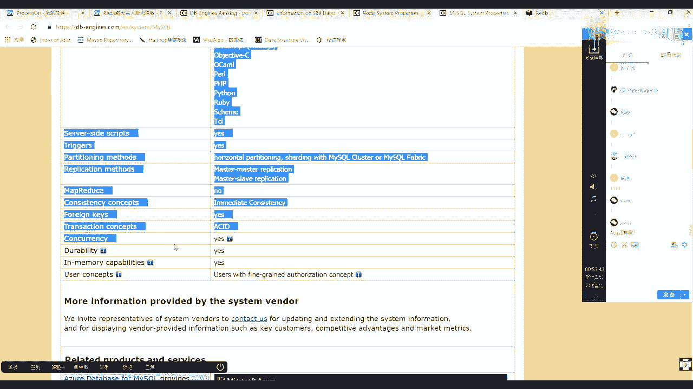

而且除了这些往下，还有一些相关的评价和一些别人的那个东西可以去看。

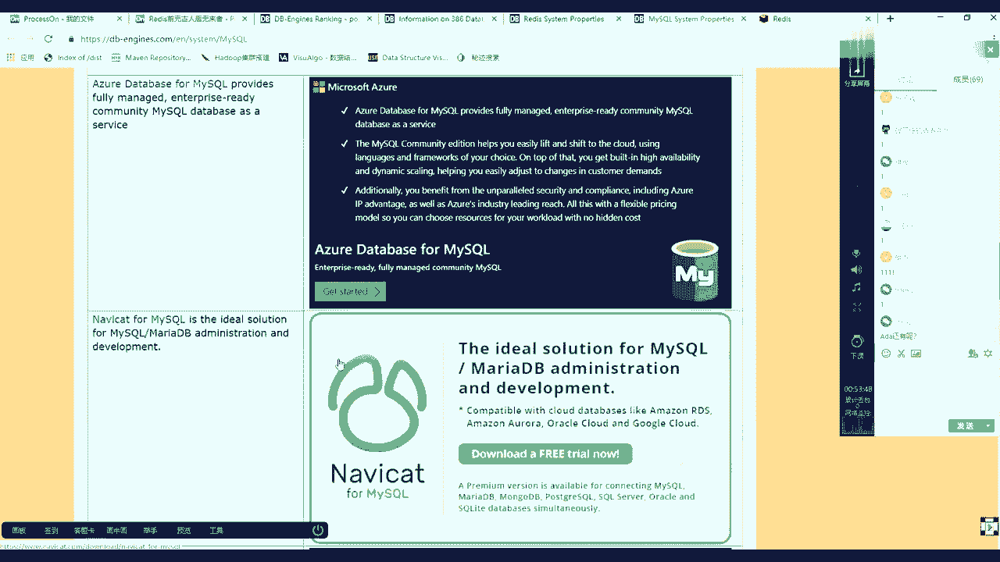

那么除了它再来看release release一样，我们都说一下release release呢，它的网站是哪release dl，这是他的网站，走起后边可以关了啊，再来回来。

然后他的初始版本稳定版是09年，现在19年是五点的版本，五点版本，然后它下边是这个可以用的操作系统，然后呢最主要往下看sql与否是no circle，不支持sql语言的查询，也不是关型的。

因为它是kv型的，前边看到my sql的时候，买sl哪去了，这mysql的时候他sql为一定是一个circle能力吧，然后再往下看客户端言很多很多也就是它的生命力，其实我们的redis为什么火。

这点也很重要，因为它可以和很多的项目很多的源去集成，然后再往下还有它的分布式情况，集群集群集群模型是沙丁分片的啊，然后呢像mysql一般就是会做分桶啊，这边这个分库分表之类的，像redis的话。

后边给你讲到他的集群的时候，是一种上级分片，也就是把你公司的数据切成几个几个片，然后散在不同的节点里边，然后还有一个复制主动复制啊，然后再往下它的一致性，这块是一种最终一致性。

最终一致性并不是一个特别强的，因为其实使用redis的时候，你要做技术选型，对它的评价就是我为什么用它，就是因为它速度快，但是如果其他的维度去影响他速度快的话，那么这时候你可以降低不用它。

而用一个更强大更稳定的其他的引擎，所以这时候什么叫架构师，你不能破坏一个技术，它的特征，你破坏了它的特征的时候，其实它可能降级成别的别的别的产品了，能列吧，所以他这块他们自己的时候就没有使用强一致性。

而使用的是最终一致性，然后事物这块也是他自己组织的一个链式事物，然后in memory yes。

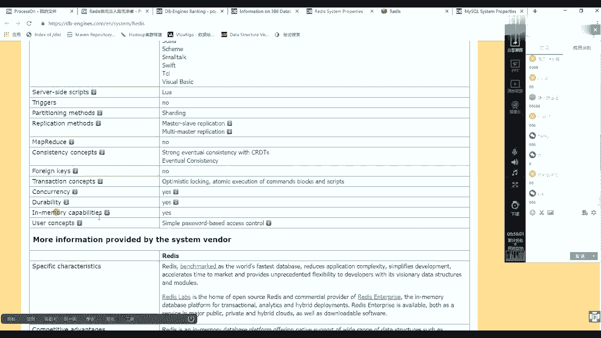

然后往下看，有一些描述，最最重要，往下看，有这么一段描述。

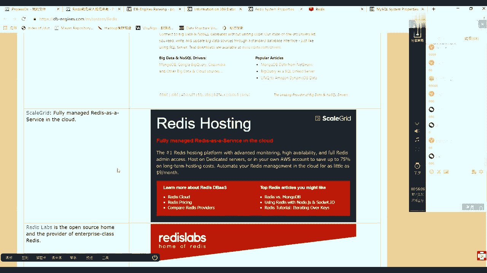

诶，这页面哪去了，我刷新一下，有一个东西得看一眼。

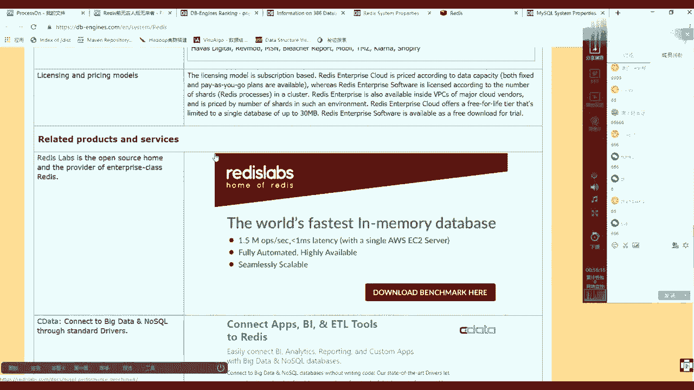

在这儿其实很多知识你都不用去刻意的去找，你看，看到这的时候有这么一个描述，redis in memory database，fast in memory database。

然后注意o p s每秒就是每秒的那个操作的数量是1。5m兆，那么这是多少次，每秒钟多少多少操作，mk是三个零，m是六个零，1x6个零是10万，对不对，不是150万，哥不是150还是15万。

接近每秒钟15万笔操作，那么15万其实说白了就是什么呀，毫秒级的啊，约等于小号小于号等级的操作，其实一般听到就是release可以达到什么呀，秒及10万操作这个东西，这个速度性能是远超过什么呀。

我们我们的观影数据库的关于中数据库的话，如果一般的话，它千级别就差不多了，千级别已经差不多了啊好吧。

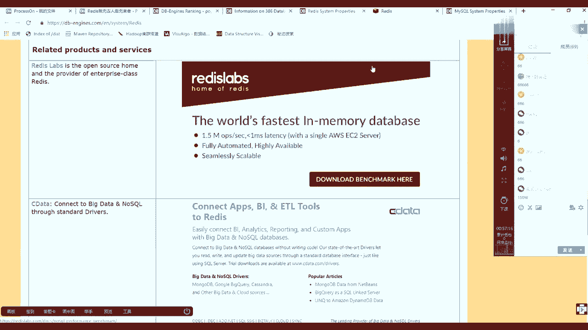

你看就是你很多的知识都不需要老师，你只需要知道一些域名，你根本就看一看，出去面试的时候和别人聊的时候都都还ok，对不对。

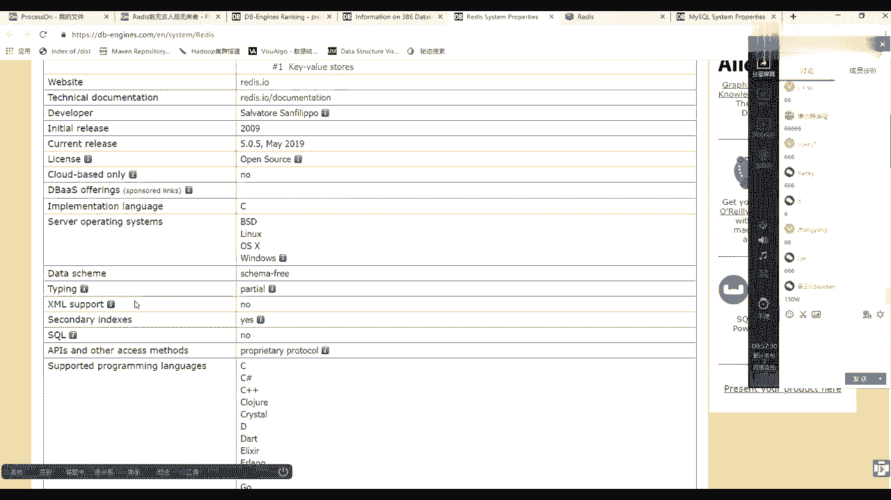