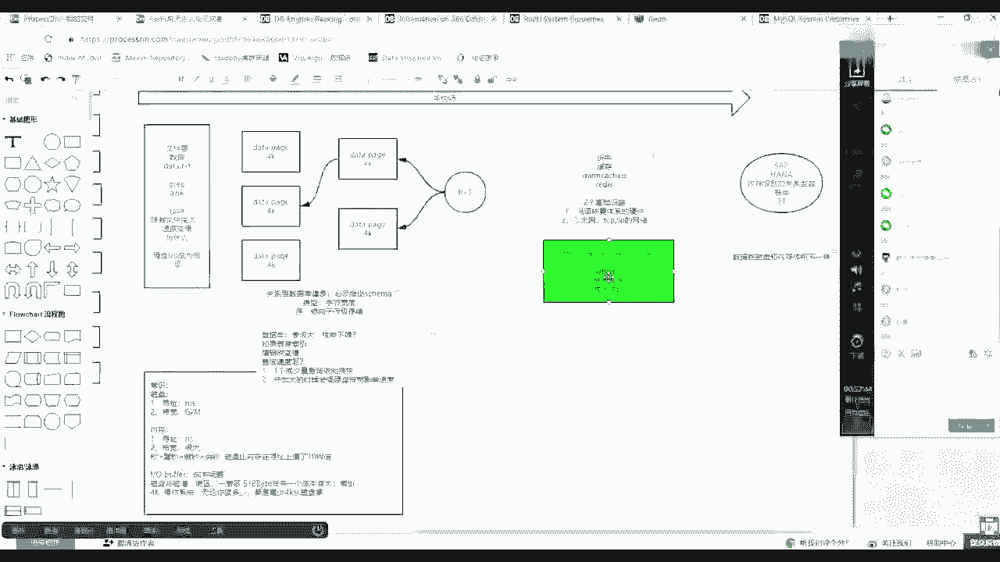
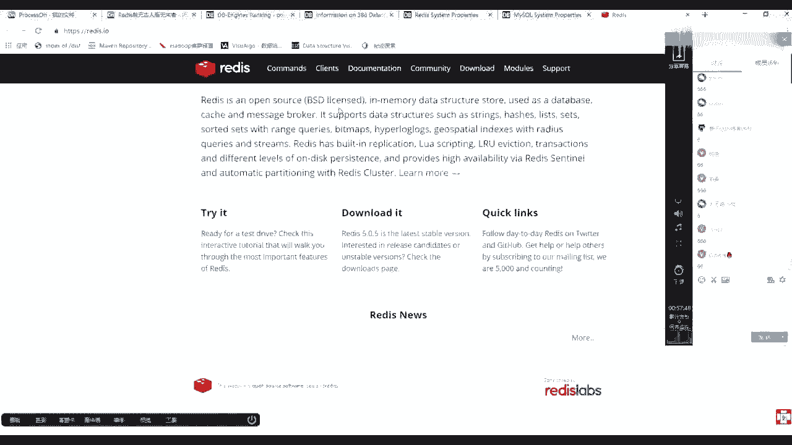
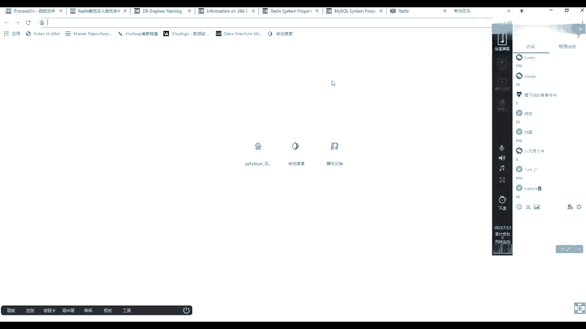
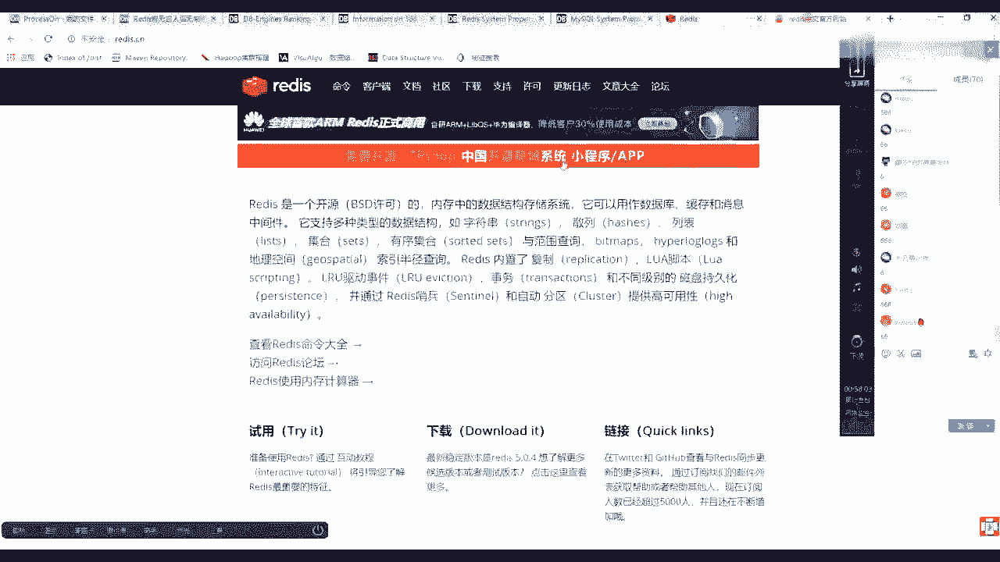
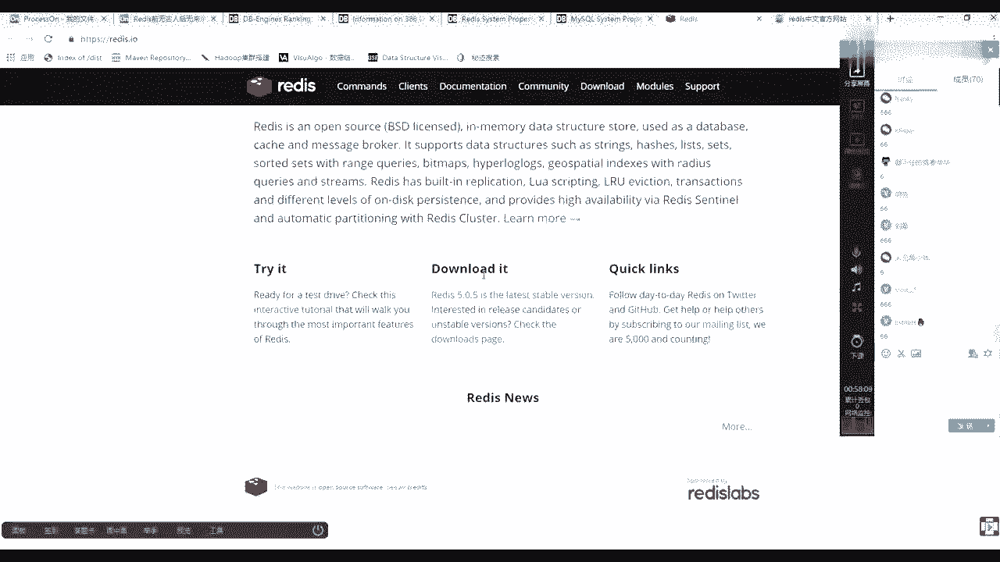
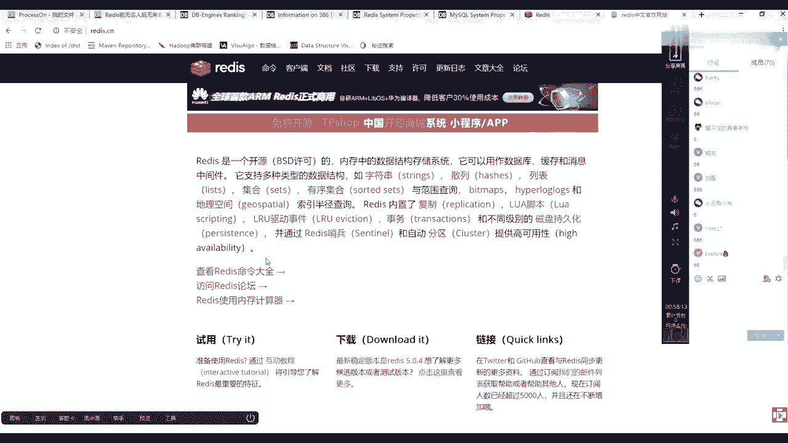
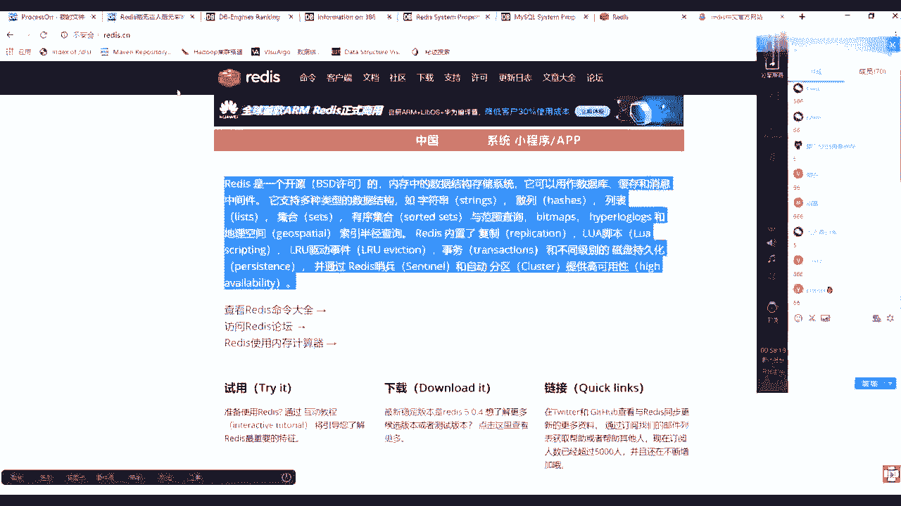
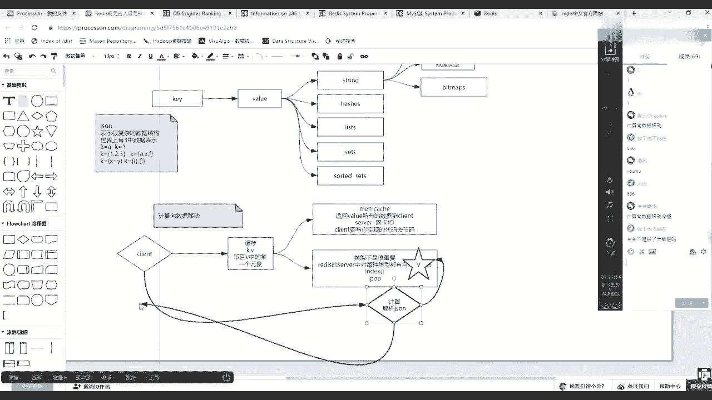
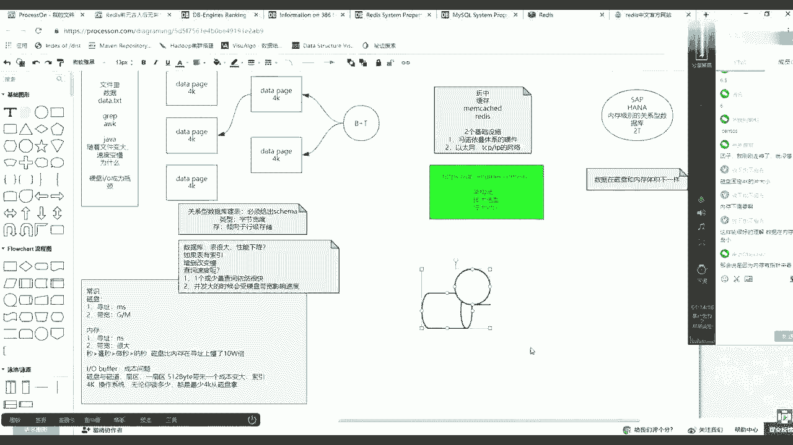

# 花了2万多买的Java架构师课程全套，现在分享给大家，从软件安装到底层源码（马士兵教育MCA架构师VIP教程） - P86：【Redis】redis简单介绍 - 马士兵_马小雨 - BV1zh411H79h

那个听懂之后，然后最后来到他的官方主页。

公告主页呢是英文的，然后呢现在我们的市面上会有很多的关于中文的。

这是他英文的主页官方的，然后呢也会有国内会有很多中文的。

我那个英文水平其实不是特别高啊，所以这块儿你知道他在哪儿。

在哪儿去找他英文英文官方，然后多数看看这个中文就可以了，在中文这的话。

我们把这几个点拿一下，只能介绍他这个特征。

不需要老师的，但是需要我什么东西需要哪，以静制记载，当我把这些东西教教会你之后，本来你学新的技术的时候就变得容易了，这是它的一个官方的一个描述，redis是一个拉大一点，redis是一个开源的。

然后内存中的数据结构存储系统，它可以用作数据库缓存和消息中间件，然后这是前面第一句，第二句它支持多种的数据结构类型，它支持动手术一个类型，也就是如字符串等等，但是这要强调一点。

release的模型是它首先是建立对的，有k，有歪了，那么一定要在这儿注意redis里边的k和value才代表它是一个建制度，然后像这句话，它支持多种类型的数据结构，如字串这几个这几个类型啊。

说的是value的类型，也就是第一个它有一个所谓的spring，像建筑队这个非常好理解，因为你通过键可以找到这个value，这个value类型有spring类型，然后相应的还有一个，string。

然后哈希，类型的，然后还有list，最基本的是五大类型，然后后面混音每个类型给你讲，然后主要讲它的场景和如何使用，然后还有s，那么现在你其实要回忆了，回了你在做编程的时候，你离得开吗。

这些在在你做普通编程的时候，是不是也会用到数据，数据类型的概念和数据结构，对不对，因为程序等于算法加上数据结构，还有一个词汇就是这已经是够五个了，然后向下延伸出来的还有一个beat max。

这个知识点也很重要，它是完全用内存里边的二进制位来进入内存存储空间，但是可以解决很多重要的事情，然后string其实后面会给你讲，它既是ring，也就是可以用字符串操作字符类型。

然后也有整形整数类型操作或者数值类型，因为我写了bgmax，先把新版写出来，就是数值类型，然后等等其他的后边先不用写，有这么多，然后这是这句，然后待会总结redis内置了复制，然后落脚本。

llu这种驱逐事件就是过期等等的事物和不同级别的磁磁盘持久化，并通过redis哨兵和自动分区提供高，这个提供高可用性，就是可以他有集群class，然后也有一种主从复制的东西。

那么以上这里面先过多的先不说，过多的先不说，首先回到圆脸上，把它露出来之后，要去聊一个什么事情，在缓存，就是现在读完一个技术之后啊，你给他简单画一个像，画出项链之后，你就多类比，其实在这个世界上。

在这之前已经有一个技术，这个技术叫做mc，或者你不知道他啊，你不知道他，但是你应该能找到那种感觉，就是键值对的，他也是电子对的，kv的，都是kv的，那么ris是kv的，然后呢mac是kk的。

那么ready出来之后，反而还间接取代这个mad cat这个生存的地位，那么为什么为什么他会取取代这个mac pad呢，那么如果稍微一查资料，就会知道map当中它的value没有类型的概念。

value没有类型的概念，但是redis value具有类型的概念了，这是两个一个最本质的一个区别，你随便上网一搜就可以搜到这样一个结论，那么这时候你要正确的根据条件反射，你学过什么知识。

或者你活这么大的时候，如果看到这样的一个区别，你能给出怎样的一个结论，这就是知识，你要善于动脑，找到条件反射能力，什么意思吧，首先你要明白一点，如果就曾经我我在第一次学这个字的时候，我上了一搜raze。

说他歪了，有类型，然后我们开始没有类型，然后当时我大脑条件反射第一个东西是啥，这次跟着我的思路走啊，跟着我的思路走，为什么条件反射js那个东西，因为肯定开始没有redis。

那么如果假设世界上只有这种这个段，然后歪了没有类型，那么我们使用这个技术的时候，可不可以存一些复杂的东西，那么这时候你的条件反射是jason，对不对，jason它可以表示很复杂的的数据结构。

那么还有一句话，这是在我曾经第一次接触杰森的时候，我随便上搜资料，我忘了在什么地方有这么一句话，就是说世界上有三种数据表示，比如说等于a或者k等于一，然后这是第一种，或者是k等于123，或者是k等于。

然后ax f也就是上面这个等号，后边上边单元素或者线性元素或者是等于，然后一个x，然后等于y就是间段，或者你再可以整合出等于复杂的这种就应用，比如一个k等于一个数组，数组里边又是对象，没毛病吧。

这个你面试的时候都可以聊这个事情，为什么要聊他，其实这里面这就是为什么ready他这个类型会优于我们的map cat的，首先如果你条件反射想起这个知识，那么你会得出一个间接结论。

也就是说你value有没有类型无所谓，好像好像是不是无所谓，因为我mac只要有建筑对了，我的valley是不是也可以放一个js，然后来代表肯有有数组，这边你有list，我这边是也可以。

也可以用js表示一个list，你这边有有这种high side，就high table这种建筑对了，我这边是不是也可以放这个这个理论，能不能听明白，听懂同学来刷波一，好吧，当这个理论你明白之后。

也就是说其实我可以不用redis，我用mcash的，它的value也可以存很复杂的东西，但是但是注意了，你要再逆推一件事情，那么他们的成本，这个value的类型的意义是什么，因为你上面多了还有那个类型。

那么它的类型的意义在哪，如果注意听下面一个很重要的一句话描述，你就知道为什么你要学redis，如果我的客户端，客户端想通过一个缓存系统，而且是kv的缓存器系统当中取回取回这个value当中的取回。

value中的某一个元素，取个y6 当中的某一个因素，比如这个麦片当中y里面存了一个一个数组，然后呢你用原理当中的外表当中存在一个list，那么这时候如果想取回其中的这个它的js里边的某一个元素和直接。

如果它有类型这个例子某一个元素的话，那么成本就不一样了，那么相对mac car来说的话，mac怎么去做的，你需要返回所有的，返回value所有的数据到client端，那么慢慢开始台服务器。

如果很多人都这么都都这么获取的话，网卡那个io就是最大的瓶颈，而且这是第一个要反的客户端，第一个就是服务server网卡，卡l第二一个就是client端要有你实现的代码。

这个编码或者解码解码解码你的js把js劳动数据解码出来，也就是说只有两个复杂度，但是如果换成release的话，因为它有类型了，类型是什么意思，类型其实并不是太重要了，至于面试的，一定要跟面试官说。

类型其实不是很重要，重要的是什么，重要的是redis server，中对每种类型都有自己的方法，也就是说其实他可能给你提供了一个什么，基于index，让你给出一个索引下标或者l pop怎么样。

也就是你的客户端只需要向对方掉一个，我取那个vue的某一个元素，或者左边或者右边弹出一个元素，那么这个时候其实它就规避了上面的问题，你客户端不需要写很多的，因为它不需要把全量数据取走。

女主是server网卡就ok，然后你客户端的代码也比较轻盈，好吧，这个图为什么不管不管下扩展了，本质是解耦啊，那么在这个如果学过大数据的话，应该能给出一个词，这个词叫什么词，学过大数据的话。

应该可以给出一个词来描述这个过程，优势其实没计算向数据移动，计算是向数据移动的，因为你的客户端不是把数据拿回来，在这方面计算，而是说调查他的方法，你的计算方法是在里边发生的，数据直接回来了，好吧。

ok那么粗略的这么一个介绍，处理的一个介绍，从开始这个位置到到这个位置的一个演变的过程，先做一个简单介绍，一会计算向数据移动，没懂是什么意思，很好解释啊，memory catch。

你是不是要把数据你的计算在哪，在使用mac的时候，你的计算是在这个位置，这个阶段是什么，就是解析，js字符串，你的数据是不是一定会存在你的map cat里面那个value。

然后你的客户端是不是一定要盖的那个k，然后把这个外表是不是要通过他的网卡，然后是不是要回到你客户端，然后走那个计算，这计算对不对，公关雎鸠，然后但是如果是redis的话。

这个计算是不是redis当中针对这个y的类型是不是会有一个计算，然后这个阶段就在这等着，然后其实只等着你的调用了，如果你客户端说掉了一个一个计算，这个计算并给出不是某一个k对应的value。

那么这个计算就会在服务端发生的过程，然后发生完之后，计算的小量的结果会反馈给你。

磁盘固定4k大小，这是不一定的，磁盘其实有缓冲区啊，就是其实其实硬件都有缓冲，你硬盘上面会有一个缓冲区，也是基于芯片的，而且现在不止有缓冲了，就是固固态机械混合这种混合盘。

然后呢你的磁盘可以格式化成4k大小的一个格子，或者格式成更大了，为什么，因为取决于你上层应用访问数据的量，就是我掉你一次可能要多少，一般操作系统4k大小合适，不怎么浪费，然后呢也能支持你存一些小的文件。

小念不怎么太浪费，然后基本上中流入门就可以了，但是如果你你买了一个台服务器，想做视频录像，就你又买了几个摄像头，记得这台机上买了一个采集卡，那么这个时候其实你未来你想你把你写的数据。

和你监控上面播放的那些数据对磁盘的话就不是很小很小的访问了，那么这时候你磁盘4k其实就有点得偿失，因为寻址带来的时间这个碎片化太太太太大了，你磁头装照去的，还不如把4k变得更大一点。

让你的磁头飘到某一磁道上，直接读出更多的东西了，就减少磁头控制灯去寻址的时间，就把寻址再降低，也就是其实硬盘这个格子大小是4k呢还是更大呢，其实取决于你上层应用对于i o的这个使用量，就想怎么用它。

我是想更多的读它，就是io密集型的。

