# 花了2万多买的Java架构师课程全套，现在分享给大家，从软件安装到底层源码（马士兵教育MCA架构师VIP教程） - P87：【Redis】redis安装实操 - 马士兵_马小雨 - BV1zh411H79h

首先要安装，要去做的话，我来介绍一下我这个环境啊，斯诺s这是一个linux操作系统，我用的是六点叉的版本，六点叉的版本，然后呢我们安装redis就直接从官网拿最近就可以了。

因为虽然版本变化可能从曾经的二点x四点四点差五点叉，其实里边最核心的东西变化不是特别赞啊，直接官网，那这些人。

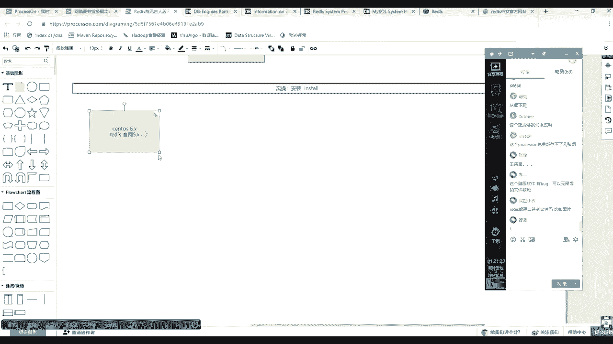

这是个环境，然后呢我的计算机在上课之前已经重置了一台非常干净的，有人在你们实操的时候最好做一件事情，就随便拿了一台机器，然后呢给他拍了一个快照，然后拿了一个原始出装的那个状态给它转到。

然后拿到一个非常干净，那么现在我运行这个状态就是没有任何配置。

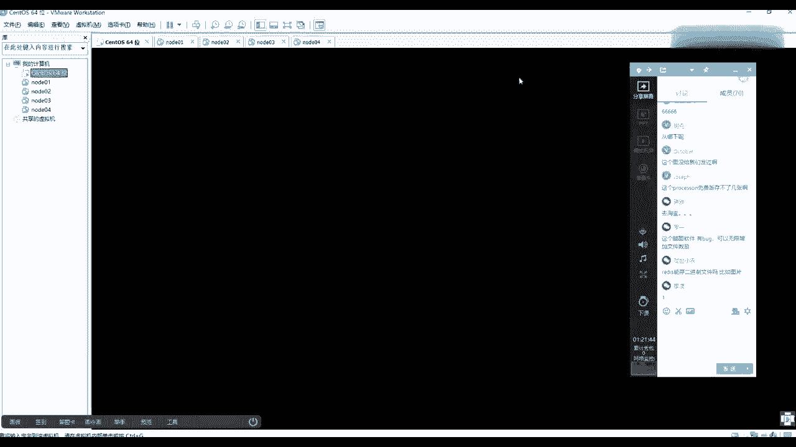

等于系统刚装完能有什么意思吧，得到这样一个系统非常干净。

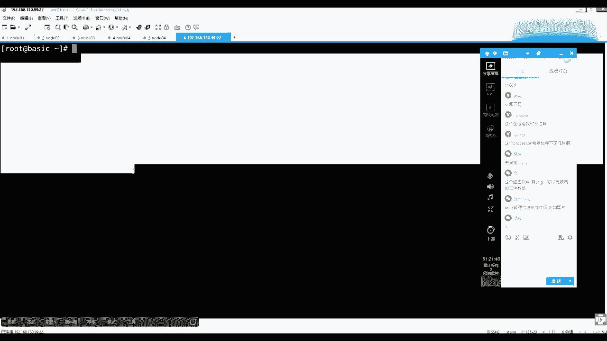

什么都没有装过，然后根据刚才看你可以看中网，可以看英文网，它都提供了一个download，然后呢让你下载的是五点那个版本，把鼠标挪过去之后，看左下角那个状态提示，所以你直接复制复制链接地址啊。

在这儿做一个复制链接，然后可以给你粘过来啊，就是少去抄，然后能记住这个步骤和原理，你会发现这就是一个hp的一个一个一个资源的一个地址。

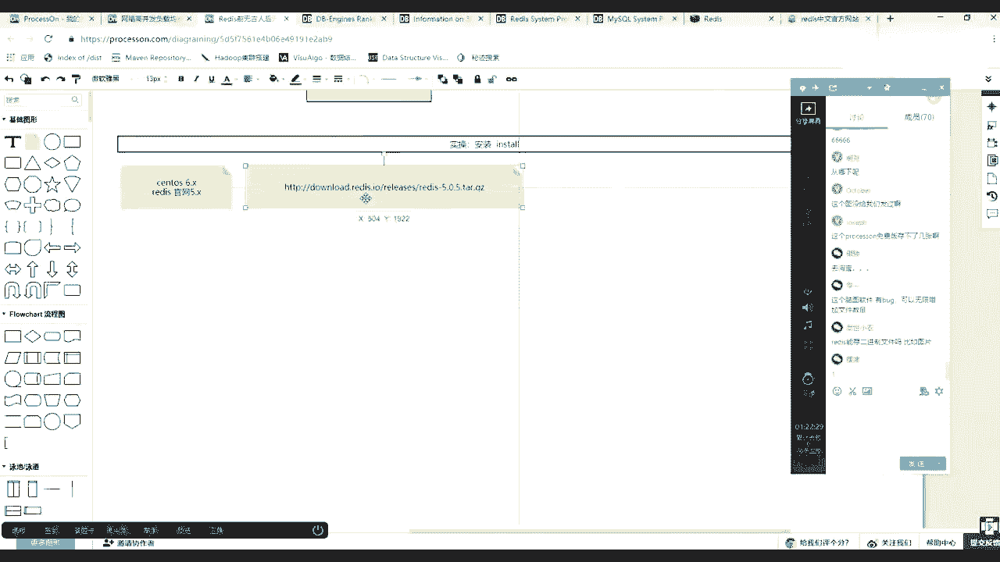

那么拿到它之后，可以在联想当中怎么去做，使用w get，然后后面接了个地址就可以把它下载下来，所以但是这个命令没有啊，因为是新系统干系统，你要装一下这个w盖这个命令，现在他先跟这个仓库同步一下。

这个稍微延迟一小会儿，等了一下，那你加目录，随便建一个目录啊，你是干净一点，cd到salt里，然后w get，然后把你刚才那个地址粘过来。

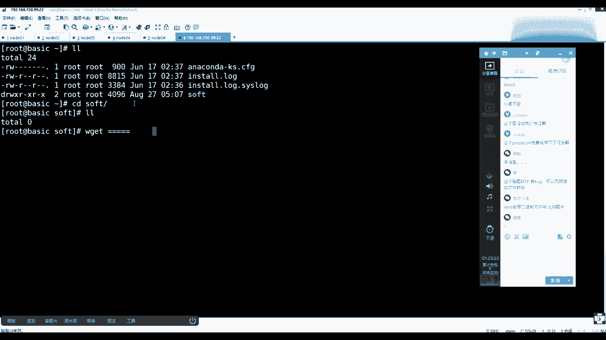

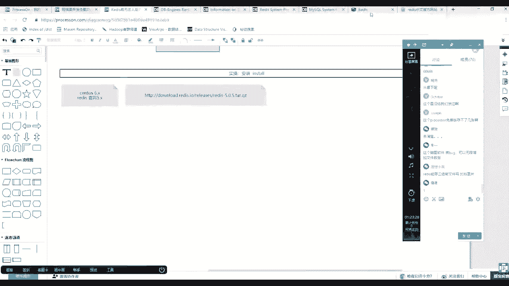

条条大路通罗马，并不是这种方法，并不是唯一的方法，所以你还在使用一些插p等等终端上传，无所谓的，咳咳咳，应该两边的这个两边学院的同学都有过记载，是不是看x f直接release解，因为它的源码体量很小。

其实他才1。9兆，他自己才1。9张，是源码嘛很小，然后剪完之后这个目录这是源码目录就能redis，那么这是一个常识，基本是源码，另行当中呢要按照程序都是c语言开发的，基本上都是c。

然后呢像源码安装的时候基本都是一个套路，什么套路，源码安装上来看的第一个东西叫做read me，你在github上面去访问那些java开发的代码的时候，他进去之后get up，任何项目看的也是read。

也是那个页面也是read me，就是无论你未来安装啥，就先看read me就可以了回车，然后你可以细读，也可以粗看，基本上他会告诉你这个redis的编译build在编译这个时候怎么去编译的。

他说is as simple，as就是make命令就可以了，执行make命令就可以编译，你还可以强调它编译成24 24这个32位或64位，还有test，还有清除make。

后边加第一次clean就可以清除你之前编译，如果编译出错的话，再往下找，除了编译过程，下面应该还有一些关于安装的，编译完其实好像可以直接使用，但是后边会教你就编译完之后run redis。

你直接在它的源码里面就可以找到那些编译完的可执行程序，就可以把它跑起来了，这是一种方式，还可以把它装到你的这个系统里，这是如何去使用它，启动它的客户端就可以使用，所以这时候其实根本就不需要老师。

然后installing redis，如果把它装到系统里面呢，是直接执行make install，或者是接上一个你想安装的位置，就修改的位置，因为它默认位置装在什么user local bin。

这个这个是它的默认的目录，你可以更改它的安装目录，就是在make install中间加上这么一个perfect的一个环境变量的定义，但是这个环境变量是随着这个命令执行，是有效命令，直接完这个环。

这个这个变量就失效了，还有一个install server。s h执行这个脚本，可以交互式的完成既有后端服务脚本，又配置文件等一系列的输出，完成这种服务器的安装，以上听不听得懂，但是你知道了。

要上来看read me，这句话，听同学来刷一波六，好吧，但是你要注意了，你你你们都是用过jav语言，对不对，嗯，java编译的时候是不可能缺少什么编译环境，就是编译器，对不对。

那么这个时候你看我们无非就做了，他让我们执行在这个目录下执行make，但在这多说一句啊，其实make的原理make是make后面的源码没有关系，make是编译命令，它是我们linux操作系统带的。

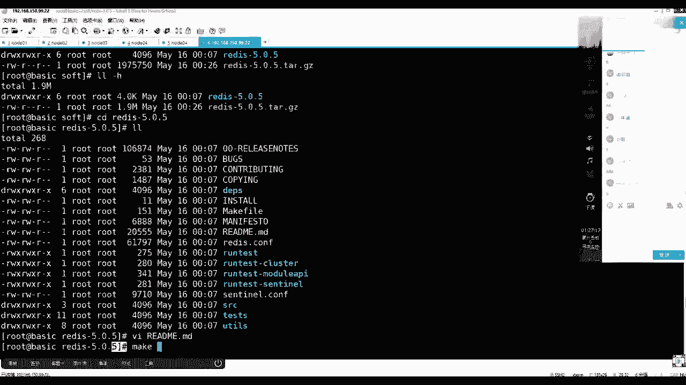

它是linux操作系带的，它是一个编译工具。

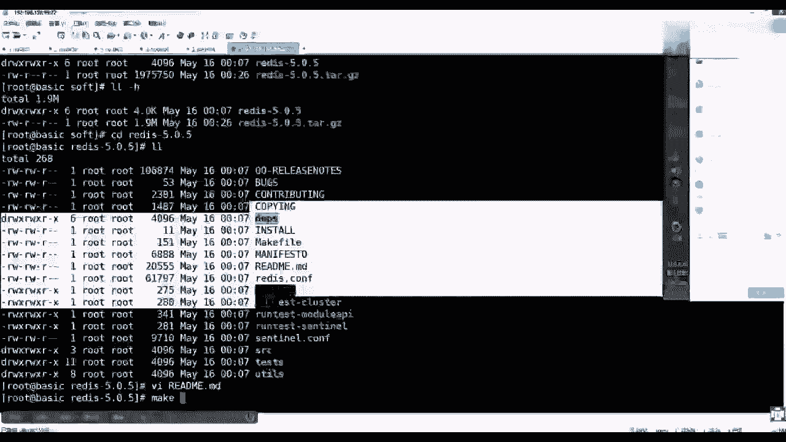

它不知道它需要跟随一个文件，叫做就必须找到一个文件，就是make f，你之前apex的时候是没有makefile，所以你要先执行confit，confit完了之后会生成makefile文件。

你可以回去再试一把，打开你index那个源码，然后它里边是没有make a fi，你所以你看他read me，他告诉你先进行confit，看完之后会有make file文件。

然后那么其实make命令直接如果回回车拍的话，他是要读这个make file，我们先简单看一下这个文件，make up make up，其实就是一个文件，一个编译脚本。

然后这里面会说了哎default or，然后什么还有一个title in star，然后里面会怎么做，如果你什么都不输出的话，就make后面什么参数都不带，那么走，他走的其实是啊，他要cd到src。

然后下边然后再去执行麦克病了以及代理的参数，如果你install的话，如果你make后面带in，刚才看安装的时候是不是可以make install，对对你make后面install并不是make命令的。

install，是你make a file文件里面这个title，你把它换成圈圈叉叉，那么你就你这安装的话，就是make军事圈就会触发这一行，这啥意思吧。

所以这时候其实你会发现这就这个这个源码跟梦下那个麦克风，make file文件就是一个跳板，它会跳到某一个目录下，然后那里边会真实的去执行你的每个命令，一代的参数，所以真身在哪，真身并不是他真身。

是在rc目录下，我们来看一眼v v i s r c可能会比别vi是cd cd的src的源码目录，这是我多讲一点，因为你们之前肯定是对零系统用的人不是特别多的问，然后在这里面你会找会有一个真身文件。

make a fire，然后这时候vi make file文件打开，这才是真正的一个文件，这里边写了很多了，所有的编译的环节细节怎么去编译，以及你可以杠这个斜线。

然后in store搜未来是不是他make后面可以带一个三角，in store那个引导会间接的从外面的make file让你掉到里边那个ssr c模下，int参数还会带过来，所以打开这个文件之后。

他也会找in star，所以找到in之后往下搜，唉找到音色开头这个开头，那么上面是编译的过程，下面就是安装的过程。

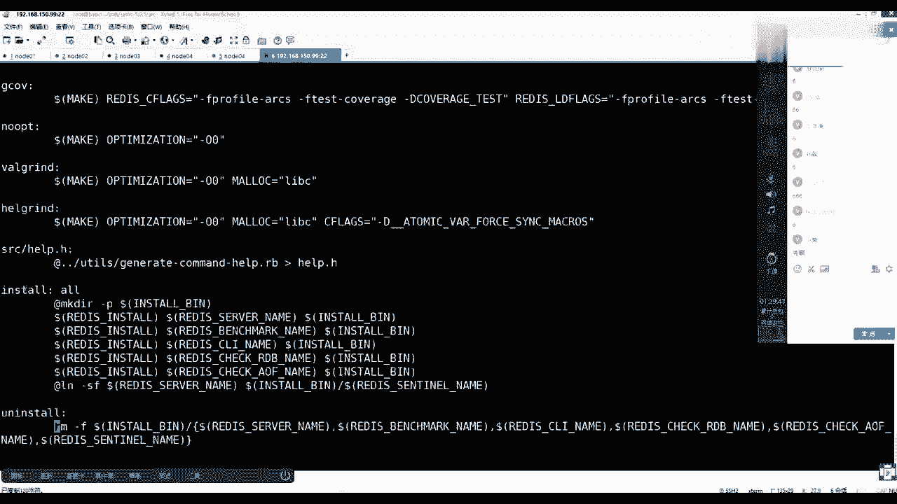

那么你看软件什么叫编译程序，安装编译就是拿着源码变成那些可循程序。

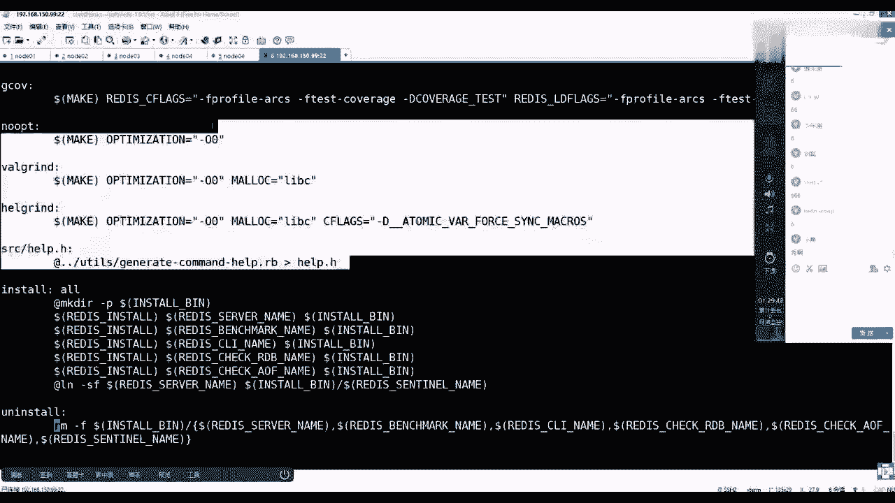

氨水的安装，其实就是一些什么拷贝的过程，拷贝过程，那么这里面会用到一个东西，就是有一个，找不到哪儿去了，有一个reinstall redis server name install b。

有一个perfect，来回忆一下，把这个推到文件上面，然后在这儿会找到一个特thanks，是不是在使用make命令的时候可以接install，是不是里边还可以再让你设置一个perfect。

然后这时候它你看它，它如果这个这个变量他没有找到的话，那默认user local如果找到找到你设置的话，那么就会使你设置那个能理解什么意思吧，然后给你演示一遍，就知道先把这个记住啊。

所以这个时候真正干活的回退，你还要回到这个源码，因为员工物件会有一个make f，他让我们执行mac，但是注意他还缺一个编辑器，但是我们他让我们怎么做，你就完全按照read me的流程去走。

他让我们怎么做，我们就怎么做走，然后这时候他一定会报错，cc command not found，cc是什么意思，c就是c语言的编译器，对不对，是不是c语言编系没有。

那么这时候条件反射基于linux的话，一般都装上了，是不是装g c c养in stop，因为我们的linux是格no linux，这个d是gal那个开组织的意思，能听懂吗，同学们能跟上吧。

你看我们装的是c z，而且使用样方式，它可以装很多的依赖，也该升级升级的东西，同意走，先把编译环境给它给它装起来，条理清晰吗，听得清楚吗，同学们，稍等一下把它装完，好了装完之后，因为你不是神。

你肯定不知道未来会发生什么事，但是你知道rise me让你干啥了，所以你就干啥，make还是只有make，而而而且这你要回刚才关掉的知识点，mac后边是不是任何参数都没带，任何没参数没带。

就是make里边那个default，就是他要跳进去执行那个编译的环节，所以make命令如果一般来说通俗来说make直接执行，就是拿着make fa去做编译，回车就是又报错了，就报了一个啥错误。

你犯depend，我们来切一下make dc t，这次cream，因为刚才执行一次编译时报错了，所以你要清一下刚才那个编译编译报错了，您您您临时文件，而且这个命令并不是我从哪学来的。

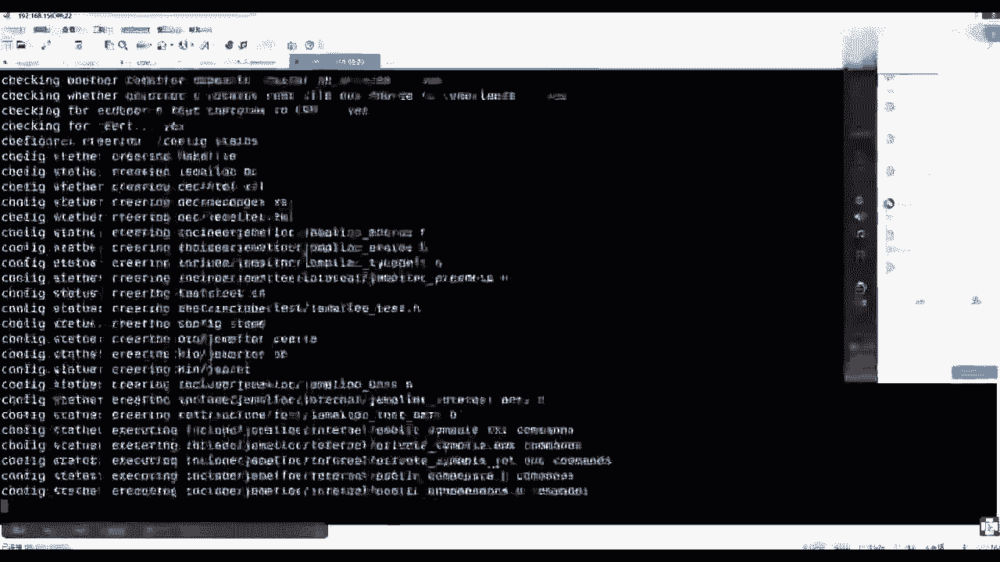

是不是read me里给我们提供的，比如你编译刚才是不是你只要通读一遍，read me里边是不是告诉你了，有那么一个make，然后this is clean，没毛病吧，所以我也不是神，对不对。

有笔记后面都是，我想你带带那个流场现各种思路走，然后我待会把笔记给你写到图上去啊，好了装完了，他说it's a good idea to run make test，可以做一下测试。

但是一般我们都比较懒，这不就就不去做了，因为它的消耗时间太多，但是到公司的时候，你肯定是要编译的时候测一下，看哪是不是编译，有有有这个有bug漏洞等等问题，好吧，那么轻松，刚才做了什么事情了。

是不是就执行一个mac缺什么补什么，确定资金补贴资金，然后执行mac的时候出错的时候该清清清完，找make之后成功了，make完注意分解一段，make完之后去你的sr c目录下就有了一些可执行程序了。

比如redis的server和reci client就有了，那么一般你在这，比如说在这个目录下，我就可以redis，然后server让它跑起来了，回车它就一定能跑起来。

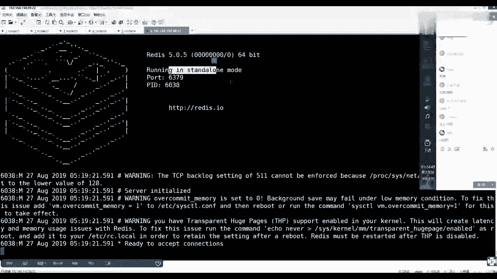

明白吧，但是这个时候其实你到公司的时候，你的软件的启动不可能每次都人工干预。

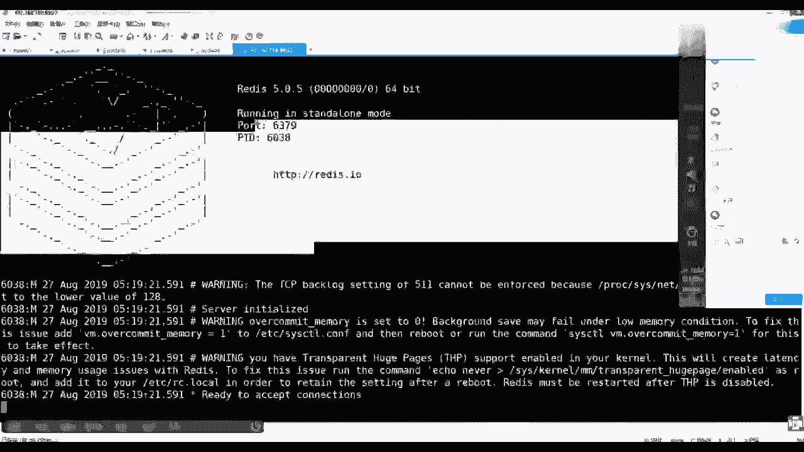

这种方式是不是特别low，对不对，所以这时候你肯定是期望把redis这个程序的一个进程ctrl c给他，ctrl c可以给它结束掉，那么你期望的是让这个程序它更像一个服务软件，就曾经装了一个服务。

然后变成一个服务，但是你怎么去构建呢，ok，刚才在read里面也看到了，util是目录下或一个脚本叫做in all server，明白了吧，这些东西都不是我跟别人学的，就跟着read me。

来来来来来来学的，所以这时候你就直接按照这个insl来做就可以了，但是毕竟我装过，我告诉你一个前置条件啊，来吧，少做一少少，少做一步少做，先先要去装，因为再带你看一遍，看一遍吧，read me。

然后找到install，咱们先按照流程走，也就是上边如果你编译完make编译完之后，然后你可以在它源码目录当中cd s3 c跑server，然后跑client可以来使用。

但是你更期望的是把这个程序install你的那个操作系统里去，所以我们有可能要执行make install或者make带着perfect install就装到某一个目录下，这个装完之后软件安装进去了。

但是你更期望的是把它变成service，所以在执行一到server就走这么几个流程，这些流程都是从我手机里来来来来来得到的，能理解吧，所以按这个流程走，第一个是先去安装make。

然后你要装的是install，安装安装哪去呢，你可以接一个perfect，然后告诉他装到o p t，然后b啊，咱们叫什么呢，马士兵吧，马士兵，然后下面有一个redis 5这个目录，这能看懂吗。

make install这个造是不是make sc目录下的，造里面是不是会执行安装的过程，profix是覆盖它那个脚本，那个脚本文件里边那个那个那个变量告诉他一定要装到这个木下，然后回车。

然后这时候你去看o p t，然后马士兵，然后这个木下他就会帮你创建redis，然后去到redis目录下，然后会有一个bin去到b目录下，你就可以看到深那个刚才编译完那个可执行程序。

帮你牵出了签到你系统的一个你的安装部定下了，就没有和源码混在一起，这部看懂的同学来刷一波，一你看懂了这部在干什么事情，好吧，但是这时候你要注意啊，我只是把可执行程序这个文件放到了系统的。

我希望安装这个路径下，但是这时候想执行的话，依然还是这个梦想，我要执行的redis server，让它好起来，但我更期望的是使用曾经那种比如说什么server，然后redis，然后star把它跑起来。

但是现在都不支持，所以还缺了一步，把它变成服务，那么别的服务怎么去做，然后回忆这个read me文件里边是不是让你证据做的来到源码目录当中，一个intel server，就把它安装成一个服务。

安装一个一个一个一个server，那么执行它的时候注意这个隐匿的那些东西都不允许手工做，执行它就可以了，但是这个脚本未来他需要知道你的程序安装在哪个目录了，我们要多做一件事情。

v i e t c级的profile文件到文件，最后新开一行export，定义一个redis home，一般我们在操作练三组当中装了什么什么什么程序了，是不是都要把它home。

然后及以及它的bm可执行程序文件追加到pass那个环境变量里，你追加进去了，你就可以在任何位置使用那些可执行程序，这是一个基本常识吧，你扎了是不是装完之后也得十加home。

目标不是为了设置扎后面是要为扎后面接的那个b接到pass里去，所以你的所有你的扎入命令在这个位置可以执行，所以我们在这来做是o p t，release，先把它的安装路径加进来，然后exp。

然后是大写的pass里边等于dollar把pass拿出来，再拼上我们的redis，home下载b目录，主要是要接这个ban ban里边有那个reserve和replan，然后把它加完之后保存。

保存完之后注意配置文件是死的，它存在磁盘当中，内存里面做程序只能跟你配置吗，不知道，所以south etc profile文件。

然后这个时候echo dollar pass里面就会出现你redis那个闭目录了，所以你可以在任何位置，起码说我可以直接redis ci就可以起客户端了，这个位置在任何位置可以用了，这个听这个环节。

听同学再说一波一，这是一个常识吧，对不对，这是一个小小常识，当你有了这个之后，你再来调这个install server，它就可以通过上面这个目录里面找那个命令，就知道你的安装路径在哪了。

这是他需要这么一个过程，如果你不是的话，请你到时候手敲也可以，我们来走一遍，下一个流程就是在当前目录下执行install server，注意看回车。

这时候please select the redis part，端口号for this issu，也就是我们希望在我的联系当中安装一个ready的服务，但是他告诉你必须选一个端口号。

这个逗号是你当年实力的这句话，另外一个意思就是一个物理机上边可以跑一个redis，也可以跑多个release，他们靠什么区分啊，靠什么区分，是不是靠的是端口号来区分，对不对，那么这时候注意它。

括号叫做默认选项，你不填东西，后边等你输，你不填东西，它默认就用6379，而且得出一个基本常识，如release默认东口号是6379，如果不选，就按照6379，因为这是目前的第一个实例回车。

他会继续追问你，please select什么呀，release confish f配置文件程序都是有配置文件的，注意它放到哪去了，a d c是不是放配置的目录，他在里面会准备一个release目录。

且为你这个实力准备一个为你准备的6379点康复，也就是如果这台服务器这个脚本我吊起十次，我可以装十个in，30个实例，十个端口号，那么每一个实例它的配置文件的名字都是随着端口号而变化，不会覆盖这个。

再听我同学来刷一波一，也能跟也能跟上的对，然后再看除了配置文件，程序运行的时候是不是还需要日志文件，日志文件放它帮你规划到war war是不是放数据目录的，放数据的目录，对不对。

所有的日子都放这个目录目录就放，然后里面会准备log redis，然后加上端口号的日志，然后只要你上面给个断号，所有的资源文件都能通过端口号来区分和隔离，对不对，然后我们再走，默认再走，下周会告诉你。

slides data directory就是数据目录，那么这问一句，redis不是内存数据库吗，他为什么会有一个磁盘目录来存数据呢，因为只要提到内存的软件，它都必须触发一个技能叫持久化。

因为内存掉电一失，对不对，那么注意你看这个目录是不是又是拿着盾了号去区分的，也是6379，所以你装了很多的实力是不受影响的，reecutable就可执行程序的路径。

那么在这儿他怎么知道是装在这个目录下了，是不是我刚才那个环境变量的配置，如果环境变量没配，你是不是在这儿手敲这个命令的路径，这也能听懂吧，所以我配了它自动识别到这个位置了。

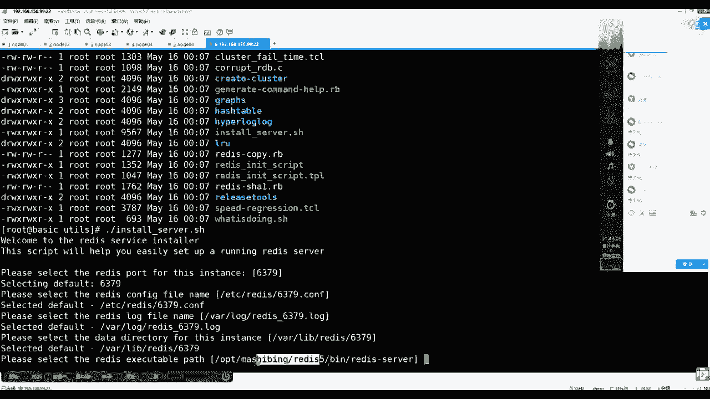

那么好好就是这个位置，回车上面一系列选择完之后。

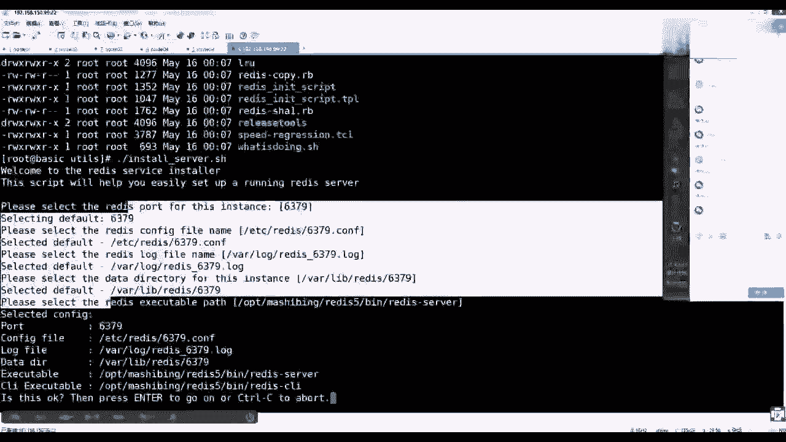

因为第一个我就不去改，待会再装备，我再去改它，然后这时候告诉你这个sley，你选择的配置如下，顿号6379，巴拉巴拉拉，然后这时候如果你觉得ok没有问题的话，然后press enter回车。

然后要么ctrc结束了，流程什么事都没发生，我们现在就回车，注意看回车之后啊，注意看，回车之后回车拷贝他在临时目录当中书写了个六分七，有点看，我把你前面很多的东西都写到这个配置文件里去了。

然后并根据上面的描述放在这个目录下，这是第一件事情，第二事情，installing service安装服务，他其实是把什么把一个启动脚本装到哪去了，装到了e t c的引擎的木下。

bkill confide做了开机启动，在二在35启动b他还帮你把redis提起来了，那么这是常识，注意听啊，这是常识，他能做to confish，能做开e级服务启动的话，他一定会向哪个目录。

是不是cd etc init。d的一个目录下，他一定放了一个东西，就是redis 6379这么一个脚本，注意这是一个脚本，这个脚本当中他书写的，你看我们的可执行程序，就是刚才他识别那个程序。

然后它的配置文件就是他刚才形成配置文件，只能看同学来稍微一，那么有了这个脚本了，并可执行了，带绿色了，是redis，然后start吗，或者dies吗，一定要写这个脚本的名称，才能是这个脚本名称。

就是这service这个后面接这个东西，对不对，所以后面接着下划线6379，然后可以statues来看一眼，rice is running，在6244这个竞争竞赛，为什么呀，因为你上面安装完之后。

是不是他给你做了一个starling，服饰已经跑起来了，以上流程整体看明白的同学来刷一波六，好吧，你能装一个实例，今天是不是可以装多个实例，你再回到这个目录下，去哪儿，注意这个时候要注意我的程序磁盘。

那个可执行程序是不是装在那个o t0 目录一份，对不对，但是这时候未来我这个计算机的内存里是不是可以release的，几个进几个实例，程序文件是不是只需要一份，那么内存里的时候会出现他多个进程的呗。

一来自这个肯定程有多个进程，多个进程他们是不是来自于不同的配置文件，未来使用不同的持久化目录，对不对，也就是程序是一个涉及的资源和内存是多个副本对吧，那么这时候我们还执行这个脚本。

install server回车，那么这时候他走的肯定是脚本里默认值，那么639我是不是中国了，我只要告诉他6380，给第二个实例，然后回车，然后这个数你看以下的配置目录，所有文件是不是都使用6380。

对不对，都能区分出来，你根本就不用管，然后但是程序是不是来自于一份程序一个版本的，然后再来回车，是不是告诉你1380，你觉得有问题吗，没问题回车，然后这时候会告诉你怎么样。

又是你这个这个安装完了并给你启动了，所以那时候sorry，redis 63804364是不是又一个跑起来了，然后这时候你可以用什么去验证，ps杠f e grape redis。

这里面redis是不是一个一个进程，646244，刚才那个一个6288，这两个进程是不是使用了不同的端口号，跑在了不同的，但是程序是来自这个同一幕下，同一个程序在内存里边，是不是他使用了不同端号。

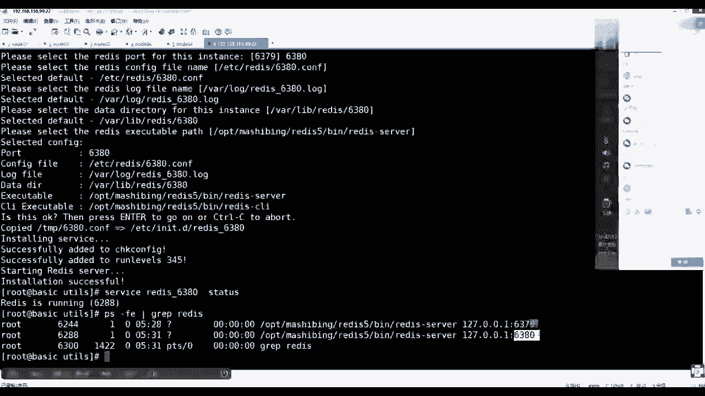