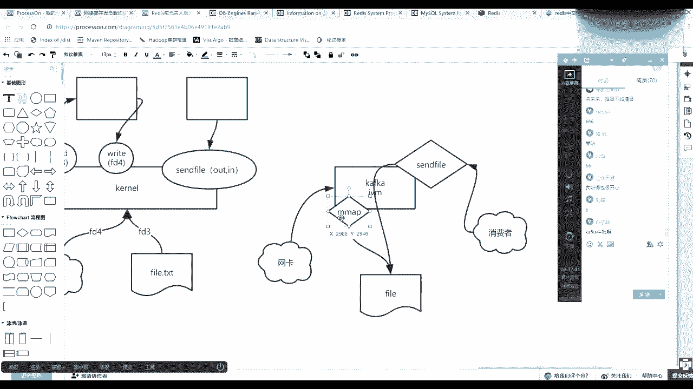

# 花了2万多买的Java架构师课程全套，现在分享给大家，从软件安装到底层源码（马士兵教育MCA架构师VIP教程） - P89：【Redis】epoll介绍 - 马士兵_马小雨 - BV1zh411H79h

潘总啥是一炮，刹车一炮这块要从这讲吧，我这么讲就有点有有有有有点累，我简单跟你说一下吧，公开课有人听，有人没听过，是不是不是，我现在简简单说一下，咳咳咳，计算机啊，在这插一个小小插曲。

做一个查询计算机使用内核，内核呢像内核可以接得住很多的连接，然后向下是有连接的，是有所谓的客户端，我觉得直接下边就是扣端连接，有很多的客户端连接，然后客端连接肯定有很多，然后所有的连接肯定是先到达内核。

对不对，新内核，然后这个时候早先的我们的内核里边会有这个连接，其实是文件标符，然后呢早先是通过瑞的命令，一个连接就是一个sd文件描述符，比如文件描述符八，然后这个是文件描述符九。

然后这里面这个瑞兹说我要读一下八，我要读下八这个文件标符，那么这是你的一个线程，你可以有一个县城或者一个进程线程，或者是因为栅格路我们肯定是线程，然后另当中就是进程，它就是fox的。

但是n n x就是使用的什么呀，一种异不飞蛾的，但是现在描述是早先的，那么这个时候他肯定是期望的什么呀，是瑞的，md 9我加这个差距可以吧，朋友们加这个差距，因为的确是要讲他这个模型啊。

这会儿讲他还是靠谱的，那么这样的话为什么，因为read，因为socket在这个时期，是block blocking是阻塞的，socket是阻塞的，也就是socket产生的这些文件描述符，你读它的时候。

你这个月的命令就不能返回，就在那阻塞着，所以是blocking的，那么这时候之前我们的早期的7。01版本之前的ti是阻塞的i o，也就是说你需要抛出一个线程，然后读这个网网卡。

这个连接有数据就就处理没数据，在这阻阻塞着下面那边执行不了，你只能抛出更多的线程，抛出更多性能的话，如果你只有一颗cpu的话，其实某一时间片上面某一个时间点上只能有一个线程处理，这里面数据还没到。

但是别人数据到他还不能还轮不到他处理，所以整个的计算机其实cpu并没有时刻在处理那些真正到达的数据，会有很多资源浪费，以及线程，更多的话，切换线程是有成本的，所以这就是早期的bl时期。

因为socket是阻塞的，所以叫bl，好吧，这是第一个时期，那么这样的话，计算机硬件是很难被利用起来的，所以谁发生了变化，内核发生了变化，注意再来画一张图，内核肯定是有一个跃迁，一个变化的过程。

什么叫就一个月迁一个变化的过程，在联系当中都可以看到这个东西啊。

首先我们可以通过em install一个man帮助man，然后gpages manu是看帮助的一个帮助程序，my page，所有帮助e回车。

把这给你补一下，你要想怎么去做，先用这个知识，ym install men和menu pages。

首先把刚才的知识理论验证一下，menu可以看，比如我们之前用的命令，比如说ios这个命令怎么去帮助的，它是一类文档，它有八类文档，帮助程序可以看八种类型的文档，然后二类是系统调用。

就是内核可以对外提供，像那个re的命令。

就是一个系统调用，然后比如说can read回车，然后它是二类的信标用啊，就是内核给我们程序暴露了一个调用的方法，对吧，然后这个apple是一个总称。

它它系统调用有一共有三个e create eo cd l e le weight，先来看这个早先的那么吊瑞的时候，这个方法里面传的是不是传了一个文件描述符，文件描述符就是file descriptor。

java当中是用object来代表一个对象，代表一个输入输出流，就是input output 10秒，在linux当中它不是面向对象的，它是一切接文件，所以都是拿着文件描述符文件来代表，这就是一个数值。

1234讲成立项的时候，应该都知道零是标准输入，一是标准输出，二是错误输出，然后你再开启这个这个新的这个这个i o的话，就会产生更多的，比如说我们可以看一眼啊，克隆一下这个标签儿。

任何进程在操作系统里面都会有他自己的i o对应那个文件名符，ps杠f杠grape redis，然后就看6244这个进程，然后怎么去看c d p r o c6244 ，有多少个o呢。

一切皆文件在你联系当中都能看到程序里边的那些东西回车，且这个redis有动用了pap的调用和一炮，even the pp，这就是一pl有socket，因为它开启了一个63791个逗号。

这是所谓的文件描述符，这个10123456就是文件描述符，任何的进程都有，那么有012就是任何进程，这012肯定都有的，剩下的是v其他的好吧，那么回来看先知道你re的是内核。

内核暴露内核爆了一个read，然后他能读一下描述符，那么关键这个描述符对应那个socket也好，对应的那个连接那个文件也好，它是一个什么什么什么什么形式的，然后再来看。

man 2 socket学dio的时候，我们是不是可以用server socket socket来开启连接，对不对，所以链接对不对，那么这个时候你注意看引力了，你要掉sy的话，然后也给出毒慢预瞄。

然后这时候看如果你要所有的看下边，这里边会有一个隐秘的tab pro，就是八零啊或者22这个协议，前面就是那个主主这个地址，然后int tab这个tab是什么意思，往下往下走。

就是调那个socket方法的时候，给你返回一个文件描述符，文件描述符是什么类型的呢，这个tab什么类型的呢，往下走。

再往下下面这做的tag。

然后如果你传了一个socket nblock，number什么意思，nblock什么意思，是不是飞蛾啊，哎那么这时候并不是给你瞎忽悠啊，就是socket内核当中socket可以是非阻塞的。

所以才有了一个非阻塞的，就是你一定要明白，io好像看似bo ni o和ao 3，但是它的发展过程是很细节有很多的，首先是因为内容的socket可以是nblock，刚才是不是一定是blocking。

也就是其实对应的文件描述符是nblock，这个文件描述是不是可以nblock了，那么nblock之后，这个时候刚才说了，线程多是不是会有弊端，那么这时候诶你不阻塞了，我是不是可以用一个线程。

比如说就用一个县城，我就一个cpu，那我就让这一颗cpu上面只跑了一个县城，只跑了一个进程，它不切换就尽量少切换那一个没用的，然后这个线程里面写一个循环死循环，while死循环先去问read。

然后文件名八，哎你给我给我给我给我读一下，然后他肯定给你返回什么呀，告诉你有数据或者没有数据，然后这时候你变了八，发现没有数据好，你再编列谁啊，然后f d9 ，没什么意思吧，就你一个进程可以循环先掉。

先先先去读他给你返回没有，那么你就再去读它哎，给稿里有了哪儿，有的东西可以开始处理，处理完之后才能再去循环遍历文件图标，文件符里面名符吧，它没有，然后再进来往下循环，一直循环便利。

就是轮询明白这个轮询发在哪了，轮询发生在了用用户，您，能听懂吧，这个时期叫什么，这个时期就是非阻塞io的到到到哪了，但是它是同步还是异步的，什么叫同步，什么叫异步，什么叫同步啊，什么叫衣服便利。

取出来处理都由他自己来完成，所以叫同步，非阻塞时期，是不是不堵车，是不是堵，你一下就可以记完做代码，但是这个所有你有的时候我我从你取出去的事，是不是还得自己做，是不是同步fix 11，这这这能听懂了吧。

然后这个时候就可以叫什么，是不是可以叫n io了，很清晰吧，但是技术是永远向前发展的，但是技术的发展不是因为技术，而技术就是你非要酷炫，技术一定是要解决问题，那么请问我现在的问题是什么。

我请问现在的问题是什么，这个模型已经是同步非紫色nl了，那么问题在哪呢，问题在，问题在哪，还没有到钩子呢，因为先要再出现一个多路复用，后面才能是什么呀，才能试这种就所谓的a l异步的，代表用户进程。

轮询调用1000次，就是成本问题，注意这叫成本问题了，是不是成本很大，因为想找到问题问题才能促使科技的进步，也就是这个进程不是自己处理不处理的问题啊，你写那个后边的多路复用也是也是自己做这件事情。

他是自己的一个用空间查询一个文件描述符，就得调一次系统调用，然后内核用态内核态切换，cpu保护现场恢复现场一大堆，是在那换来换去，换来换去，这是随着你的这个连接数，如果其实连接数很少的话，无所谓。

两三个两三个连接7度也也也就这样了，没必要往前发展，那么怎么解决这个问题，当你发问题的时候，怎么解决问题，如果有1000个，但是这1000个里边谁能不能读了。

不需要触发1000次性掉一次掉两次就能发现这个问题，是不是可以加快这个速度，就是将这个问题不解决就可以了，但是要想解决这个问题，少减少这个这个这个性教用，那么用户自个儿能实现吗，是不是实现不了。

所以内核得向前发展，能跟着这个思路吧，就是内核不变，这辈子你可能实现不了，没错，就是把你这轮询的事扔到内核里去，内核里从而多了一个系统调用，他就是增加一个系统，这个系统要用早期叫什么呀。

叫做select，来增加了这么一个系统调用select，然后这个时候其实你的用户间是调那个新的星标，用了新的调用的时候，其实就是掉个select的一个系统要用select。

但是掉它的时候我们可以看一眼啊，如果你的进程想掉select吧。

下边假设1000个文件名符进来了，来看推出来menu 2 select性调用select，然后这个时候注意看这个时代方法，然后int然后number有多少个文件描述符。

然后这需要一个指针指向一个没有符的一个结构，这里面是你要想读的那个一共有1000个文件面符，然后sd有有就读写了两个方向的，你要把1000分都作为参数传给了个系统要用，然后有没有报错，就这么三类啊。

以及这个这个轮询时间是立刻还是阻塞在这个这个轮询结果上，这是掉了一些疗用，那么这个sli可以完成什么事情，就是内核里边提供一个slide，然后select就完成这件事情，你看这个字根本就不需要老师。

完全你你看看看看人家的帮助就知道了，这是同意a program，一个程序to monitor，监控更多的failty rever，文件描述符是个负数，然后waiting until，等待直到什么呀。

直到one or more，一个或多个of the fidistributor，文件描述符become什么呀，reading就可以触发io操作，这英文读的还行吧，还可以吧，啥意思啥意思啊。

画一下画图是这个世界上表示知识，表示原人类沟通最重要一件事情，比如吊带的时候要穿啥了，曾经建了一个一个连接，你这边拿到了他一个文件描符，以前是自己用写一个死循环，现在不写死循环了。

哎我统一的把这1000个文件描书传给你。

然后你去做一件事，什么事情，你内核去什么呀，这个监控这些东西，然后waiting until one or more。

文件描述准备好之后，并且return返回，返回之后，然后他再返回之后，你再拿着返回的那个文件描述符，水有了，然后再去调什么叫read，如果还有一个性能用，就再去调这个read。

我就把rate不会调那些没有数据的那个文件名，read，是你在这步完成之后，是第一步，第二步，第三步可以返回之后，你拿着的反思结果编译一遍，哎，你因为你给他传1000个，他可以给你返回1000个。

你的1000个便利的1000个哎，在这个里边看一眼谁谁谁那个状态标成那个有了，然后直接掉瑞的，然后把那个文件没传进去，给他传，三传的是有数据的那个文件名符，那么这样的话这个时期和前面那个时期一对比。

你会发现多了一个什么好处，精确了，这两个时期比较是不是内核的发展，觉得这件事情让你用空间复杂度是不是变低了，啊这是应该f d s严谨一点，这是一个复数对吧，能看懂吧，哎没错，批量批量交给别人去轮询啊。

你给我的时候，我不这个主要不是轮询多少的问题，是不以前1000个，我说掉你1000次，现在1000个掉你一次，我等着你回来告诉我这里边50个，那我就得50个挨个挨个去读，它还是这个同步非阻塞的。

这只是减减少了这个内核态运动态的切换，对不对啊，这个东西叫什么呀，叫做多路不用，是不是出现多路复用了，选择一些，有的我直接去直接执行就可以了，那谁有了是你我一次吊你，你来告诉我多多少个有了。

多多复用的n，就是为了减少云在那台，千万对不对，能看懂这个意思吧，没错，这些都是底层科的碰撞呢，其实这些事情这些东西谁掉的，是你代码调的吗，谁掉的，你一定要明白，我们的程序，我们的逻辑跑在谁身上。

我们的逻辑跑在jvm身上，gbm用什么写的，你的代码是这个java语言，gmm是什么，原写的c语言写的，没错，如果内核不加，这些系统调用不增，不不出现这个nblock这辈子实现不了这些东西。

就像linux能实现n i o，但是linux实现不了a i o，内核上还没有，还没调整一件事情，只有windows才能真正实现a i o好吧，但是这时候注意听，如果你的思路就停止到这个环节了。

觉得ok了，已经可以多多复用了，但是这里边你会发现一个问题，什么问题啊，我每次都给你传很多的文件，棉服，你得给我回，然后我还得挑在里面谁能用，然后再去再去找，再再再再再去调，这个还是有点复杂。

如果把这个复杂度再降低，就是追求更快的速度，就是尽量的做一种伪a l o v l这件事情也是增加再去减少这个过程，我把这个调大一点，这要讲redis io全讲了一遍，然后select有了pull。

我就不讲了，就是后面出现e poo了，你快点说吧，你赶紧说完，我想这个是不是也想听，对不对，不投诉我吧，你们要有人说不想听，我就直接讲redis，但是我觉得redis如果大部分人这块没听懂的话，讲的话。

其实有点有点跳，那时候还得发展，前面的问题你得找到问题，前面的问题是啥，你找到问题了，才能找到这个突破，问题是啥，前面的问题，你学知识一定要找到问题，你才能知道我要学啥，咳咳，这里面一定要明白一个事情。

就是用动态内核态，只有两个菜或者两个空间，你的进程啊有一堆有自己的一个内存空间，里边放着1000个文件描述符，这个这个所有的第一个二进制，你掉内核的时候得传参，你把它传过去，只要数据的拷贝。

听过零拷贝吧，是不是大家在传输的时候都都都期望是零拷贝，不考虑考虑不考虑考虑速度变得更快了，那么其实现在找到问题了，就是拷贝拷贝来拷贝去的数据并不是我说的数据，并不是你i o里面到达那个数据啊。

是我这个内核跟我用户进程俩沟通得i o里面有没有数据这个事，咱俩还得穿着数据跑来跑去，跑来跑去，能不能听懂这个过程，就在决策的环节的时候，文件描述符这样的数据都成为累赘了，当这个成为累赘的时候。

内核如果出现新的东西可以解决这个问题多好呢，有什么问题出现了什么东西。

来看一个一个调用，mm a p，或者是卸载files or davis into memory，挂一个映射map是不是做映射这个这个这个事情的是不是都映射的，然后这个时候它可以解决什么问题。

曾经你的内核有内核的内存地址空间，你的用户进程和应用进程地址空间，那么这时候其实都是虚拟地址空间，那么站在物理内存上面无非就是两个区域，然后这个时候内核的区域你进程是不能访问的，所以需要传参传这批数据。

所以考虑考去，那么怎么规避这个问题，如果内核说得了，咱俩喝出一个空间来，你也能访问，我也能访问，然后你直接在你那个你那，而且这个空间在你这是属于你的虚虚拟的空间里边，你往8号位置写了一个东西。

其实间接写到那个位置了，等于如果你来调一个信标，要用的话，就不需要传单，把这东西拷给我，你只要告诉我8号的位置，然后我翻我通过cpu翻译一下，我就知道是我这边的9号位置，我直接可以读那个数据了，换言之。

我这边如果有一个这个地图空间，我把那个10号的位置放了一个东西，一个文件标符是可以可以读了，然后那个10号位置其实对应的是里边8号位置，你直接就可以通过你那八不是那个那个那个那个7号位置。

通过你读到那个数据，就不要再给拷贝的程减少减少拷贝，说通俗点就是一个所谓的共享空间，没错就这个意思，但是共享空间是通过什么系统调用实现的，你一定要知道，这都是内核来实现的，这个系统交流叫做，mvp。

没错，相当于用动态内容太有一个空间是共享的，当有一个共享之后，有了一个共享之后，那么做了一件什么事情，内核内核怎么去用这个空间运用空间，我们程序怎么用这个空间，在这个空间里边，他做了这样一件事情。

三天不在线，我忘了，这是一个列表，明白什么意思吧，然后这个空间里面放了一些数据结构，这个数据结构里面什么东西啊，我的那我的进程通过一炮一炮可以看啊。

但是e e o是一个整体，它不是一个性，不要用，你直接搜e后七类杂项杂项里面给你解释什么，这个性标用是e泡二类的，有e create易爆的cl呢，evil weight和eo c t l。

这是三个三个系统调用，你可以读一段这段英文就知道怎么工作的对吧。

我简单给你解释一下，你的用户间只需要哎我我我手里有个文文，有1000个文件名符，ok我就写到这个共享空间里去，把这1000个其实自己也就是说一定要怎么自己还会有一个空间，你都有共享空间了。

还需要再准备一个空间去存1000块钱标符吗，先把这一点弄明白了，有了共享空间，这个共享空间其实间谍可以得出一个结论，共享空间就是他自己的空间都在说他可以直接访问，对不对，是不是可以换的。

换位到换到这个这个位置了，这个qq同学来刷不了，这才是本质，你明白共享空间是进行了自己的空间的一部分，也是内核那个迅捷的一部分，所以这时候从这个歌词就不用不用单单独去维护了1000个文件。

描述这个这个这个地理术语，所以进程里边多了一个文件标符，就把这个固定空间的红红数据放往里放啊，往里放往里放，他放的这边只要调性要用，不需要传这个数据，就没有拷贝的过程。

内核是不是就可以看到这个分数一一共都是文件标符的对，然后由红由我们那盒当中，拿着这六根那边符去通过所有的i o这个中断，谁的数据到达了，谁都可能具有了，然后把到达的放到电表里，分到列表之后。

然后这时候如果这边有数据了，你上层用空间是不是可以从列表中取出这个文件变符，直接发生读取dna件名符就可以了，这跟零拷贝没有关系，这跟零拷贝没有关系，这叫共享空间，各自的这个，因为零拷贝是什么意思。

零拷贝是另外一个姓都要用来来来给你看一眼，零拷贝叫做sfs e n写错了，顺着发，synfile是完成零拷贝的，然后sunfl什么意思，也多了一个系统调用，它有一个输出的文件标，个输入的文件标符。

比如偏两个bug和那个那个统计。

明白吧，也就是说再给你画的，举个例子，也就是内核里边多了一个坑，里边，多了一个性，不要用，孙子发，但是说synfile这个系统要用的时候，synfile里面它需要俩参数，一个输入，一个输出。

跟你使用阿帕奇那个i o u t s里边会有一个out，一个in的对象，是不是一个概念，但是你要明白，有他之前发展出这个系统调用之前，它还会有另外两个系统调用，一个是刚才看到read可以读一个文件描符。

有瑞的读就一定会对应有一个什么呀，write写的不对，还是这个应该是right吧，明白吧，你以前程序，如果你有一个文件，啊有一个文件，然后有一块网卡，网卡到内核肯定是一个socket。

socket i o文件，当内核肯定是一个文件i o对不对，这俩是不是两个i o，两个io是不是文件描述符，假设这是fd 3，然后这个是fd 4，然后你之前瑞的时候，你之前的时候肯定read读三。

从三把文件读出来，然后再去掉血写出去，然后这个时候你的这两个系统调用发生在内核身上，那会儿得完成一件啥事，是不是得先瑞的给你，你再ride出去，这能看懂吧，也就是你的数据。

你的文件数据先到内核到八核可能区，然后再由这个这个这个调用，然后这个调用还考虑你用空间，用空间再再尽量再拷回来，然后再发出去，这需要拷贝的过程是需要拷贝的过程的，那么现在有了新的bug之后。

你的程序会是一个什么过程，是直接掉了这一个，然后由内核当中内核拿到缓冲区，直接读它放到缓冲区，然后直接发出去，就不给你的程序考虑考去了，这是sunfile，它跟前面那个一样吗，跟那个m一样吗。

是不是不一样，然后cfl如果加上m v p可以组建一个什么东西，有高效的技术，谁是不是卡不卡，卡卡是不是肯定会有网卡来的数据，网卡的数据来，然后写进了数据之后必须走，你卡玛卡玛什么是基于gmm，对不对。

这一面吧，我多说一点吧，说的有点有点有点开心了，他说这是一个运动关进程，网卡肯定走内核，然后走他他完了之后，它里边一定会使用麦，然后mac里边他是不是可以对files和davis进行挂载，对不对。

它可以挂载到你的文件，直接挂载到文件，然后又因为这个map做的空间是是这个共享空间，内核是共享的，所以这个时候其实你map你这卡夫卡通过map看到这个内存空间，完你写了东西之后，其实内核也能看到。

他直接触发内核就减少系统调用，减少数据拷贝，也约等于是达成了一个他的到时实验零拷贝，但是零拷贝不是两个文件标符之间的内存，倒是用用用户空间到内存空间减少了一个考虑的过程，所以直接写文件了。

然后这是为什么进来的数据，那你打数据的时候可以很快，而且可以存存存到文件上，然后这时候别人是不是有消费者，消费者是不是还得需要把它读出来，消费者是不会拿着拼音来读数据，顺着男人pa要来读数据的时候。

其实这时候走到哪儿是不是走的零拷贝了什么饭，确实走到零拷贝了，零拷贝里边，它sfile的输入来自于文件输出，来自于他，不迷惑吧。

一切的支持来自于底层。