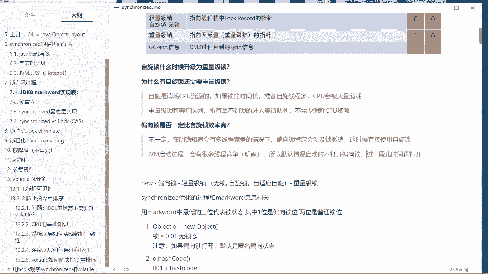
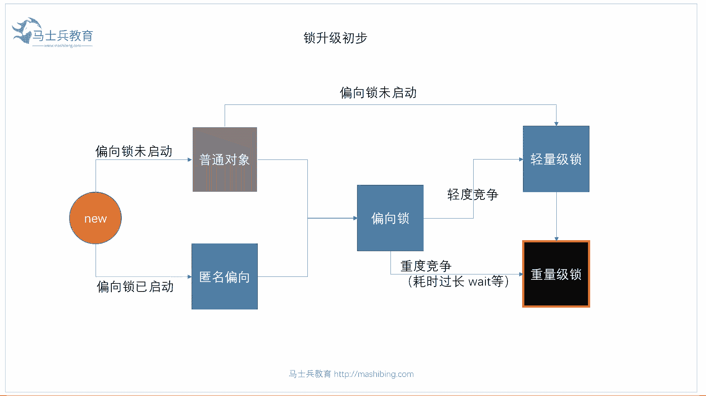
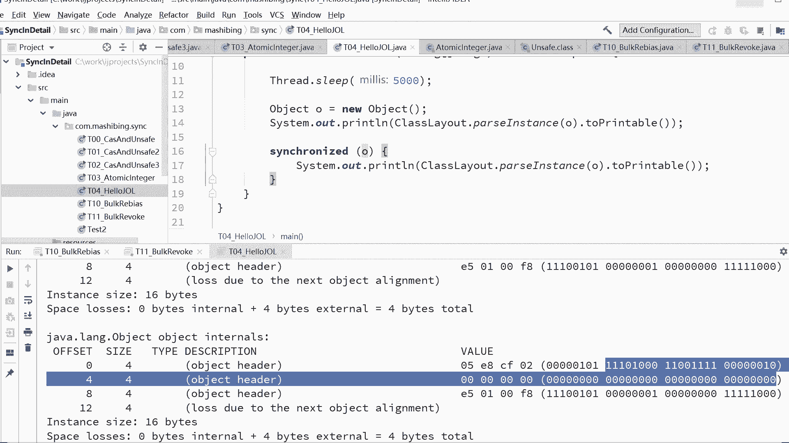

# 花了2万多买的Java架构师课程全套，现在分享给大家，从软件安装到底层源码（马士兵教育MCA架构师VIP教程） - P8：【多线程】锁的细节2：偏向锁启动与偏向锁未启动 - 马士兵_马小雨 - BV1zh411H79h

这个细节呃。

下面我们来聊下一个细节，就是什么叫偏向所启动和偏向所未启动。

这个认真听啊。

来看这里作为偏向所来说，大家我想问大家一个问题啊，我想问大家一个问题呃，我先问大家第一个问题就是。

提问吧，按照提问的方式啊，提问式的这样的东西有这么几个问题，你弄明白之后呢，你就知道什么意思了，我先问大家一个问题，为什么，为什么有自旋锁，还需要重量级锁，怎么打开，你想想看。

我已经有自旋锁了，我自旋锁在用户空间我还是轻量。

我比这个重量比较轻诶，这个时候我为什么需要重量级锁。

还需要重量级锁，为什么为什么呀，原因是这个竞争啊，你得看具体的情形，比如说大家伙都在竞争这个马桶，好，少量的人在旁边自旋，你搁这蹲着，特朗普来了，自旋个14 八次的啊，可以让他等着，没关系啊。

再让他在让他在这里等着就可以了，但是你想想这么一个问题，如果你持有这个资源，花好长时间，你才能干完自己的事，要持有这把锁时间非常长，其他人自选自旋的人数又特别多，1万人在这里自选，1万个县城在这自选。

大家注意自旋这件事。

它是占有cpu时间的，好自旋是战友，cpu资源啊，cpu时间等是吧，它是消耗cpu资源的消耗，这个设定较好，四圈是消耗cpu资源的，如果锁的时间长或者自旋，线程多，那么大家你想想看。

cpu资源会被大量消耗，你花时间就花在这些人的自选上了，执行那个空循环，花时间就花在线上的切换上了，全都花在这上面了，那这个是不划算的，所以在这种情况下会升级成重量级锁，重量级锁什么概念。

重量级锁里边有各种各样的队列，认真听啊，里面有各种各样的队列，你要理解这个概念之后，我后面给你讲reaction lock condition这一类的内容，你也能听懂啊。

不然的话我给你讲condition，很多人听不懂的，就是新新版的那个那个j uc那个锁的condition，重量级锁里边有什么呢，有队列听懂了吗。

就一object monitor里面是有各种各样的队列的，什么队列呢，比如说著名的wait set里边有好几个队列，有conditionalist，有entralist，weight s。

每个队列有它自己的作用，有的是用来做竞争的，有的人是用来做执行的，有的呢是用来做等待的，好这个到底是什么意思。

我们先来看源码，我们找到object monitor，where are you here，搜一下吧，这个object manager里面呢它有一个著名的东西啊，就是他就是wait set。

看他名字就知道这是一个set，这set是什么东西呢，是一个里边全部都在weight的一个一个的现场，所以所谓的重量级所是什么概念，重量级所的核心就在这重量，你所的核心在于当你持有这把锁的时候。

你想申请这把锁，一个县城想申请这把锁，像操作系统，操作系统给你这把锁，但是他会把把把把你这个线程给你扔到锁上面的一些队列里面，如果说我们等待的线程数超级多，1万个线程在那消耗cpu时间。

那我还不如给你升级升级重量级锁，升级重量级锁之后，它会做一个管理，做什么管理呢，凡是那些在那里自选等待，拿不着锁的线程，你都给我扔到一个叫做为set里面，维c的概念是我把你扔到一个队列里，我不让你执行。

把你给冻在那，freeze，你不需要消耗cpu资源，什么时候你想抢这把锁，是要通过我操作系统的进程调度，把你这个线程给你拿出来之后，你才有资格继续持有这把锁，所以当我们所升级到重量级锁之后。

有一些那些个锁他就扔到了weight set里面，它不需要消耗cpu时间，所以在锁定中超级激烈的时候，重量级锁会比自旋锁更合适，非公平的吗，你这就属于那个一知半解还得求关注的这种linux内核。

对于进程的调度，它叫做cfs，目前用的是这种调度方法，叫complete completely f，completely公平公平公平怎么说来着，completely fire哈。

我想到那个fire completely fire strategy叫呃完全公平策略，这个完全公平做策略呢路数非常深，我跟你讲的话就得讲半天，它并不是一个完完整的时间片分配。

而是根据你过去执行的时间片的一个比例来分配，你现在的调度过程，这没法没法跟你讲了啊，就讲到这吧好吧，总而言之，重量级所有自己的一个等待队列。

你不需要消耗cpu时间，所以在这儿呢，有等待队列啊，所有，拿不到锁了，进入等待回应，不需要消耗，19岁，所以这就是为什么有了自旋锁还需要重量激素的原因啊，不知道这个问题说清楚没有，有没有人有疑问的。

没问题吧，嗯，没问题，继续啊继续，来可以继续的给老师扣个一。

继续聊细节。

好我们继续，我们下来，下面来看什么叫做偏向所未启动，什么叫做偏向所已启动，好大家听我说。

我想问你，继续问你一个问题，看这个问题偏向锁是否一定，自旋锁效率高，我跟你说，凡是这么问的，那100%是不一定就是看你能不能想清楚他到底为什么，不一定就是偏向锁，为什么一定比自全球的效率高。

你偏向锁不是门贴上去不就行了吗，对吧，偏向锁什么时候效率高，多数的情况下只有一个线程执行的时候，偏向索的效率最高，但是如果有多线程，你明确知道有多线程在这里跑的时候，实际上它并不比自旋锁的效率高，好。

大家听我说偏向左不一定，首先答案一定是不一定在明确知道，会有多线程竞争的情况下，好在这种情况下，你明确知道这个资源会有多个线程来竞争它，那这个时候你还用偏向锁是完全没有必要的，为什么。

因为偏向锁肯定会涉及，所撤销，偏向组肯定是会涉及到所撤销的这个过程，那锁撤销这个过程一旦涉及的话，你用平白无故的耗费时间这个词能理解吧，所以你明确知道有很多很多先生在竞争，那你这时候直接关闭偏向锁。

你不应该打开偏向锁，你应该使用什么呢，你要直接关闭吧，应该直接使用自旋锁，好了，偏向锁不需要停战，没错，偏向所不需要停战，但是他撤销需要耗资源啊，把那条把大灰狼那那个名字条，你把它薅下来。

你不得耗点资源呀，大灰狼还会咬你呢，对不对，所以在明确知道有竞争，这时候呢实际上你没有必要啊，开启这个偏向火，好大家听我说，我们继续这vm启动的时候，启动过程会有很多，线程竞争。

你比如说最简单的我们往那个这边启动的时候，我要把那个一个一个的class落到内存，或者一个一个对象落到内存，在内存里头，要是不是要增强内存位置，要不要加锁，一定要加，所以在这种情况下，会有很多线程竞争。

明确知这就是明确知道啊，这个很明确，所以默认情况启动时，不打开摄像锁，什么时候打开啊，过一段时间再打开，等启动完了。

好所以呢这个东西在哪呢，这个东西在这儿就是默认的情况下，我告诉你，by as the locking start of delay，来我们读一下。

bias the locking start of delay，读一下啊，bias the locking that start up delay，什么意思，偏向左启动延时，大家注意偏向左。

默认的情况下有一个实验，这个默认是多少秒呢，四秒钟来验证一下。

验证一下，好看这里啊，我们刚开始new这个object的时候，注意我我我这时候呢没有，它默认是不启动偏向锁的，你还记得吧，他有个实验吗，四秒钟吧，所以你看到它扭出来一个对象的时候是001好。

来我们呢做一个最简单的，当然你可以通过参数来设置，怎么设置呢，就是像刚才那样，我可告诉你参数。

你把它设成start up delay啊，设成零好，这个时候他刚开始就会给你启动偏向锁好吧。

当然我我我所以最简单的就是让他睡五秒钟，五秒钟之后再来new这个对象，这时候偏向锁一定已经启动了，那我们来看一眼头像，15秒钟等着来，注意看这哥们儿刚才是什么，刚才是001。

现在呢现在nel对象是101，发现没有，同样是没对象啊，你睡五秒钟和不睡是完全有区别的，你们很好玩好了，这块能跟上的，给老师扣个一。

啊这没问题是吧嗯，那有同学说了，大哥你这个刚定出来对象，你就给上把锁玩呢，刚弄出来对象，你就是偏向锁状态，这啥意思，刚才我不是说了吗，这个偏向锁呀，其实后面会记录这个偏向锁的线程指针。

但是这里的指针你明显一看就是啥，全是零嘛，没有指针吗，空的吗，因此这把偏向锁叫什么呢，叫匿名偏向。

叫anonymous by locking，请跟我读anonymous，anonymous blocking，也要读出那种伦敦郊区音儿来啊，我看这里，所以为什么会有偏向。

所以启动偏向所未启动和偏向所已启动两种状态，就在于这在偏向锁没有启动的时候，你new出来的就是普通对象，001在偏向锁已经启动的时候是101，但他这种状态对象呢，由于刚开始还没有偏向任何一个县城。

所以他叫匿名，偏向，好讲到这里，没问题吧，讲到现在为止，这条线讲完了，这条线讲完了，这条线你看到了偏向锁没启动的时候，它自动升级为轻量级锁，这条线讲完了，这条线讲啊，这条线只要我们打开那个一看。

你就会知道上线要锁了好，还有一条这条线，这条线其实非常简单，如果在一个偏向锁状态，有可能直接升级成星链锁，什么时候呢，你偏向你偏向锁的时候，就把这个线程直接掉了，wait方法直接掉了，wait方法。

那二话不说，你轻量级锁不可能让你wait直接进入重量级锁状态，很简单。

好了，既然是匿名偏向这种匿名偏向态，我把这个注意看啊，我现在是匿名偏向台，匿名偏向台，我上把锁，他一定还是偏向锁状态，只不过里边的值就不再是零了，而是指向了某一个线程，看这里101。

但是里边的那个值全是零，匿名偏向依然是101。

但里边已经有值了，这是啥，已经偏向于我们这个may线程了，所以这里一加锁就是不再是匿名偏向，而是真正的偏向锁。

因此这条线我是不是也就讲完了，看这图，想到现在为止，这条线这条线匿名偏向到偏向左，这条线普通对象到轻量级锁，这条线偏向锁到轻度竞争到轻量级，这条线自旋锁到重量级，这条线重度竞争到这条线全都讲完了。

最后还差这么一个普通对象，完事之后呢，上偏向锁好，留作作业。

