# 花了2万多买的Java架构师课程全套，现在分享给大家，从软件安装到底层源码（马士兵教育MCA架构师VIP教程） - P91：【Redis】redis及NIO原理复习 - 马士兵_马小雨 - BV1zh411H79h

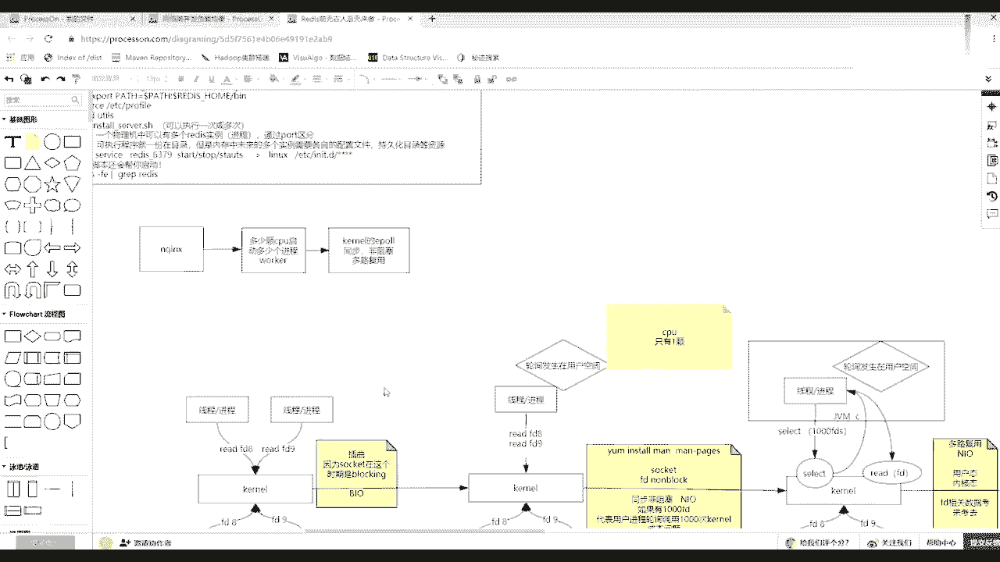

简单回顾一下，是把ris安装了一下，装完之后呢还没来得及使用。

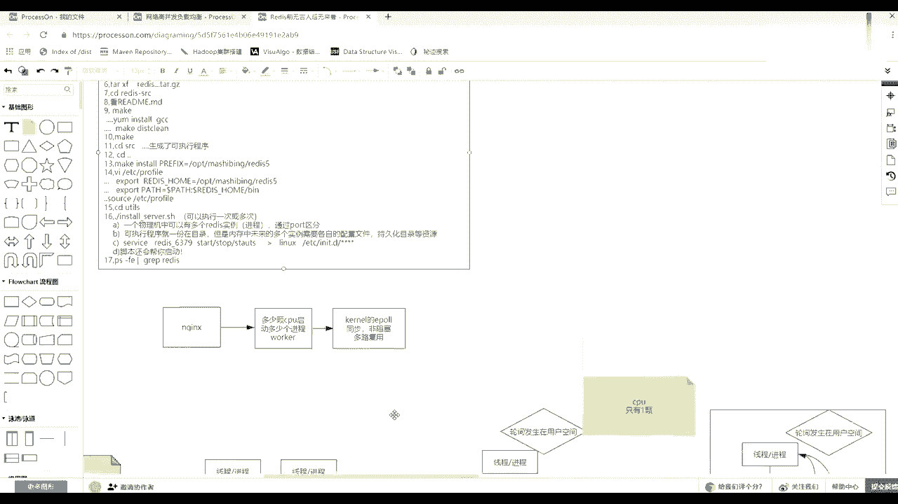

然后呢就讲到这个io模型这块了，因为要我我让你脑子里有一张图。

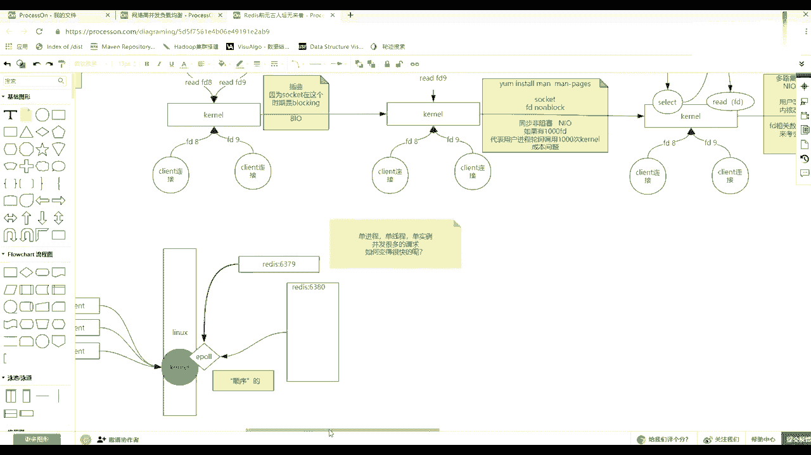

就是这个计算机当中这个ready是怎么运行的，就说的就是带了一嘴一。

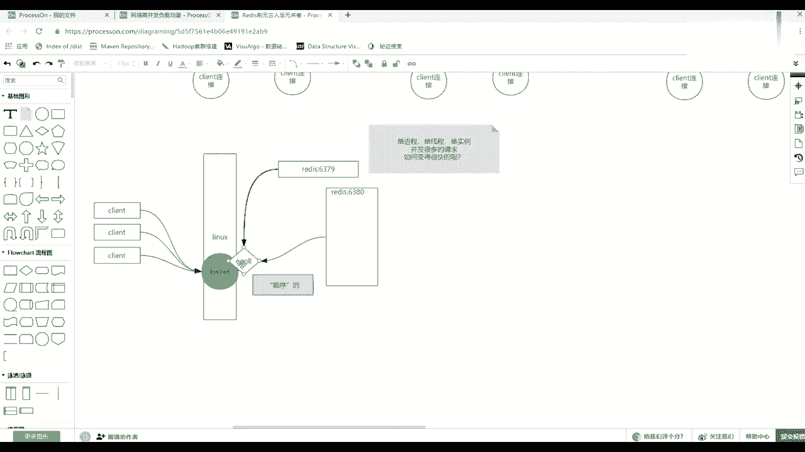

就讲到l模型这块来了，然后讲完之后呢，跑到后面的时候又讲到这个零拷贝。

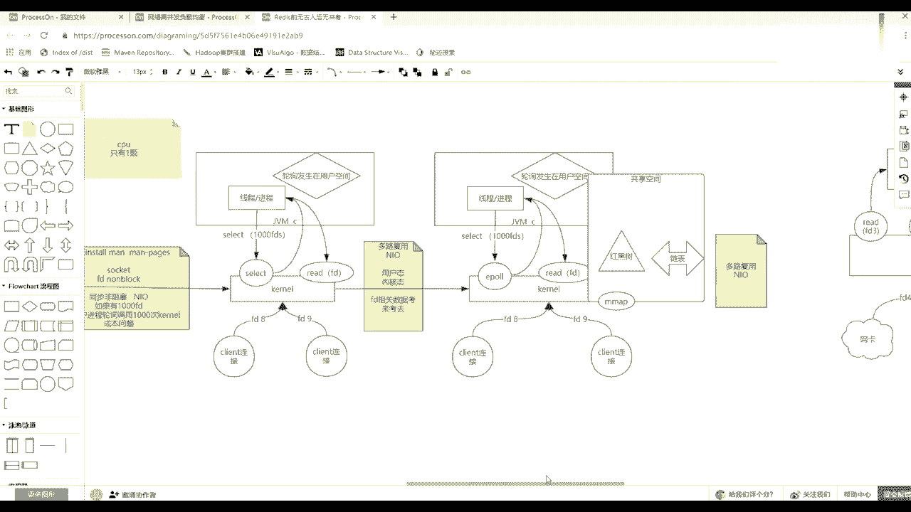

结果一炮这块说的还不太清楚，先把那个一炮，因为现在无论你的n这个词啊等等，用的这个一炮的那种io复用的模式比较多一些，啊对不对。

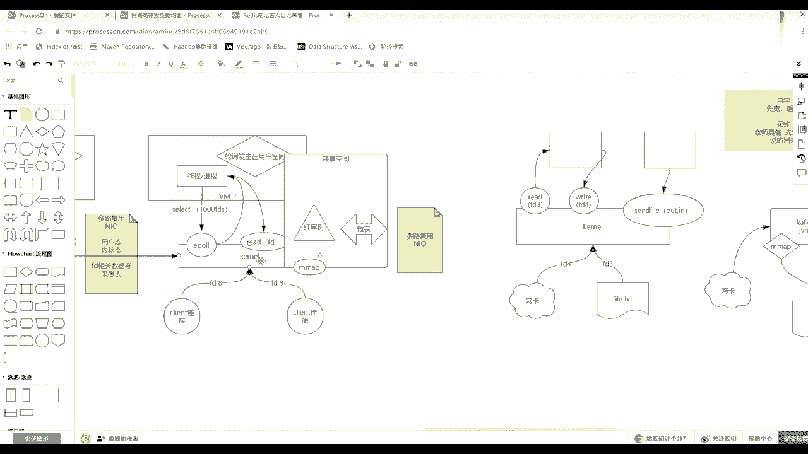

安装资料就在咱们那个大数据的那个get up就有啊所有的安装的步骤，但是那个东西包的话，你你check一下，如果是网盘链接失效的话，然后我再给你发一下好吧。

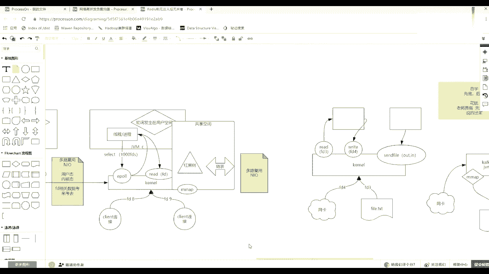

收回来，然后在这个一炮这个模型这传这个画着这个这个图的眼睛过程。

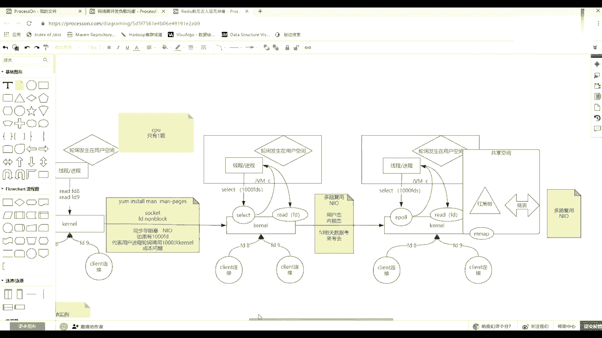

先是bo就是阻塞的一个美连接。

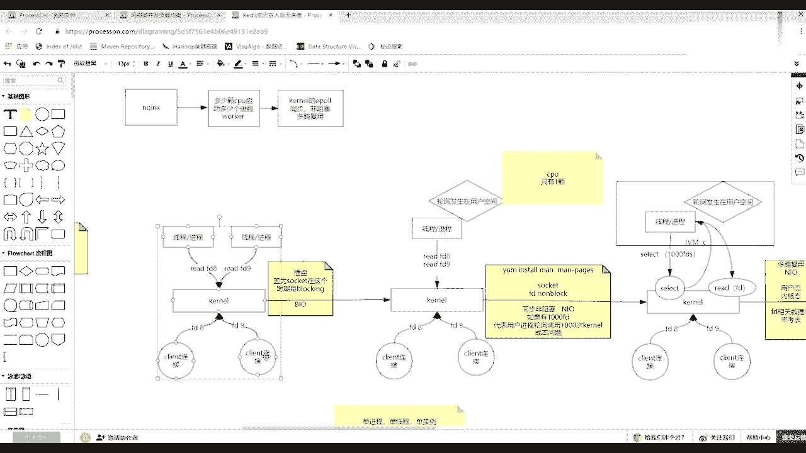

会抛出一个线程去，然后内核发生变化之后，连接这个sd上就可以使nblock就可以不用堵塞了，那么会发生用户空间程序拿着1000个连接描符，然后疯狂去掉内核，然后这样的话虽然他可以不用抛出很多的线程。

在这多说一句，在这多说一句，就是大家都是搞gm的，在gbm当中，一个线程的内存成本多少，一个线程为什么说前面这个模式当中抛一个线程对应一个连接。

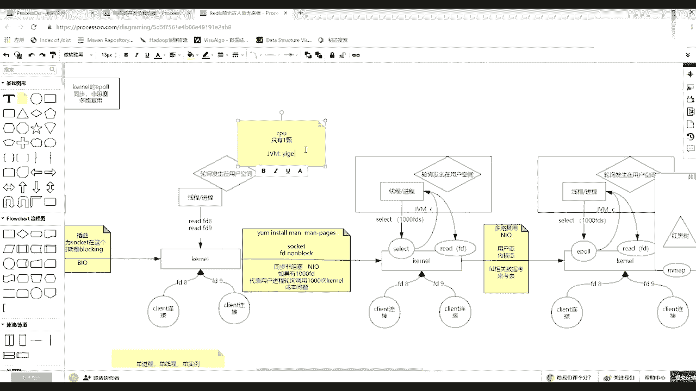

这个就有问题对吧，你知道问题了，就是因为每每连接1000块钱，就1000个线程的那个线程多了，到底哪不好，有人知道一个连接的成本是多少吗，这是一个县城的成本，我们可以控制，我们可以调。

然后呢但是我们只聊啊干扰的内存当中堆是共享的，但是县城站是独立的，县城那个站是独立的，这个站的大小默认可以是一兆，你这b然后呢你也可以调调，把这个这个站的这个线程占的这个单位调小一点。

也就是代表着你的单位内存内可以创建更多的这个线程，其实数上去了，但是你cpu数还就那么几个，其实线程多了，第一在这你要知道d只有两有两个，有两个那个不好的地方，第一线程多了哈，调度成本啊，cpu浪费。

这cpu就正在忙着调度这个事了，消耗在这个内核空间，第二一个内存成本，你想如果你是32位的话，就一个4g内存，以1000个约等于下1000个县城就消耗出一个地区3000个线程内存，就光光把新城站出来的。

然后你还不能对对象，因为堆没还没地儿，你堆怎么也得给个12g，所以这种抛线程的方式肯定不太好，而且一般也会限制，就是无论c的还是做java的，还是做c的，都会控制这个线程的数量。

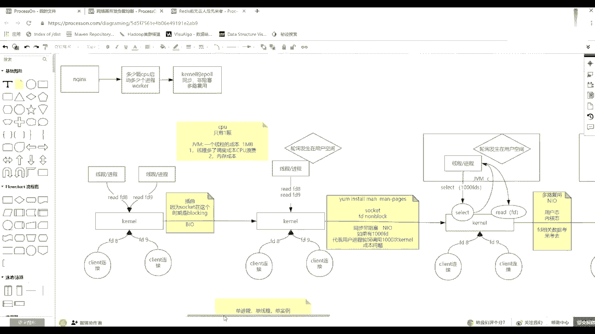

那么就是要县城不好，所以才有这么一种方式，就是哎我最低可以一个县城或者几个县城来做这些事情，那么这就是非阻塞，因为只要你稍微不阻塞，我吊你询问的时候，你不阻塞的，你就告诉我立刻立刻回话，有没有。

所以这时候我可以用一个线程后路1000个连接，但是每一个连接都要掉一次内核那个调性调用。

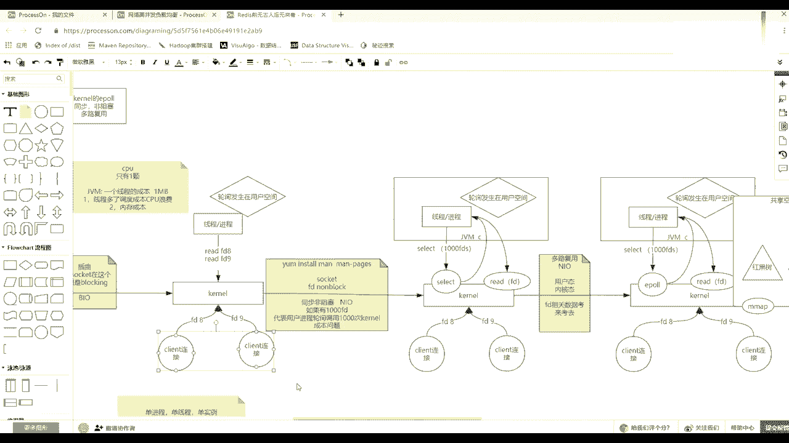

所以成本又很高。

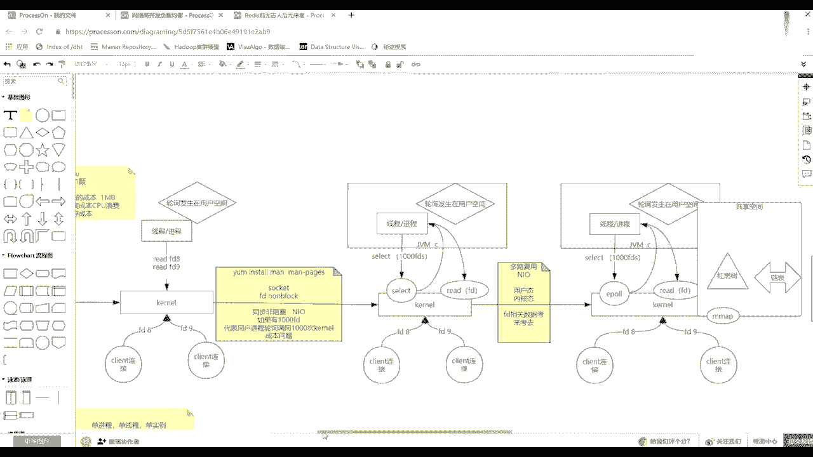

这个很高，怎么降低，就无非把这个1000个连接的1000次调用这个数字减下去。

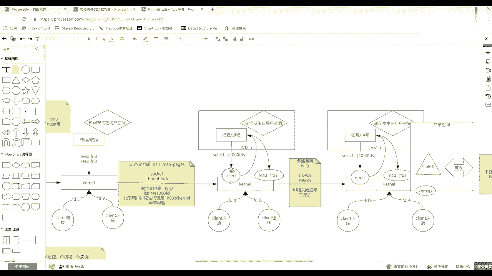

所以才出了这个io多路复用，也就是用我们的一个线程，就是1000个连接服用了一个线程去处理，那么县城这次只需要调用内核给的select这种方式，然后把1000个文文件名传给他。

那他就在那等着内核在内核太，因为掉了他一次，他把1000个变了一遍，然后给你返回几个，然后这个时候注意你这个还得拿着这几个文件描述符，自己调这个锐族数据，或者写出序列这种系统调用。

所以你这边还得是自己去完成数据的写出和读回来，就是这个数据的拷贝拷贝来拷贝去，这个事情就是read read方法，还是用关系调的，那么这个时候其实叫做同步非阻塞，前面那个也叫去。

就是你无论便利有没有数据到达和读数取出事。

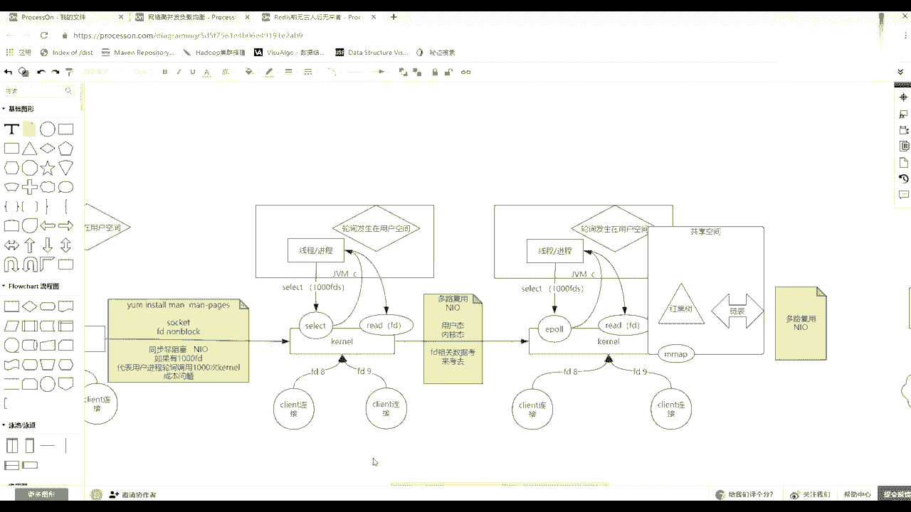

都是你现成空间自己做的事情的时候，都是你都是你用空间自己做的时候，那么叫同步的，只不过是非阻塞的。

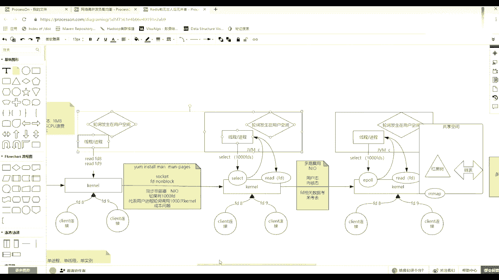

然后在这种环境下又有一个问题，虽然他解决了这个疯狂迭代这个便利的文件内容符的数量，然后但是它有一个新的问题，就是每次我这写个死循环，每次都要传了1000个，然后他给我编辑一下。

然后返回之后我再遍历这个返回的可用的是找找到可用的，然后去调方法，这样的话用山那个在传递数据的成本比较高，而且完全你自个儿去，每次要传了1000多个标服回来变一个1000多文件标符。

然后等于其实力度不够细，因为你在便秘的时候可能有数据到达了等等，这个就因为右时间上和那个用餐点的切换数据考虑去成本比较高。

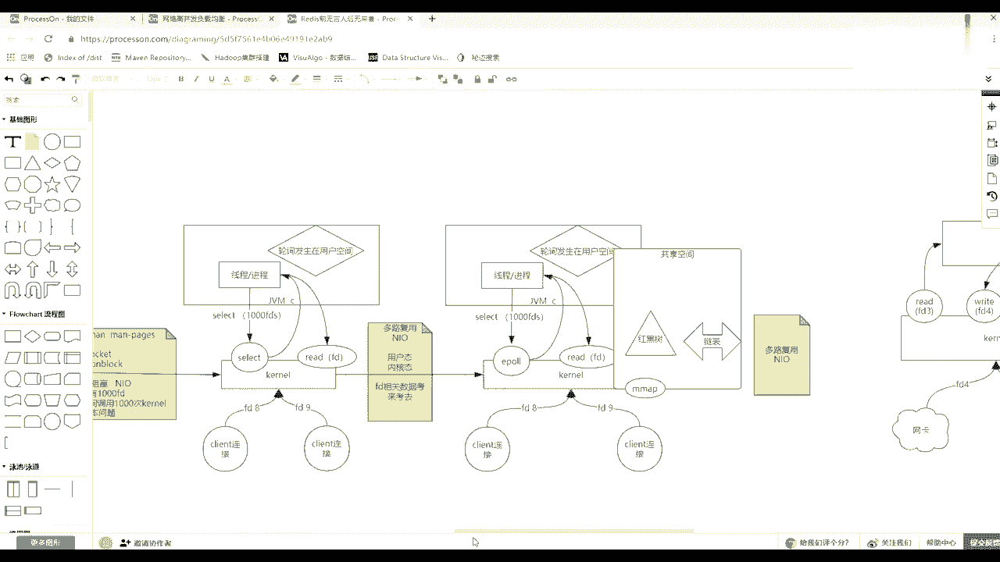

所以才输入一套这种方式。

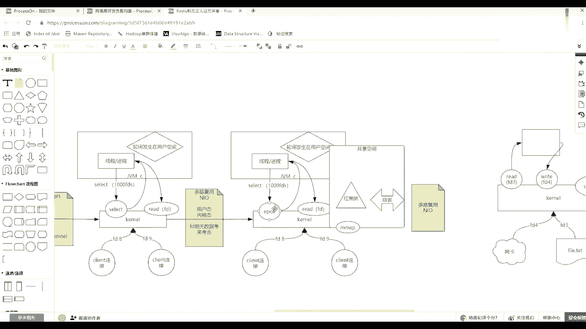

那么除了一炮的话，一炮是一个大的概念，它里面其实有三个标用它select，就一个一个slap标用，那么一炮有三个标用，第一个就是我用户空间当中可以create create，那么在这就不是select。

我在调cray的时候和我肯定给我返了一个一炮，打完全面符一炮，那么返回e破文描述之后，然后未来我用空间有一个连接进来了，我就把这个链接交给这个，写给这个e破的那边有符1p文件标号符。

其实e po这边会准备一个共享空间，是m a ap，明白吧，就就就一个共享空间，一定要明白它们两者的变化是在这块一个非常重要的一个东西，那么有了一个共享空间之后。

它里面只需要维护一个红为数运输空间的每连接1000个连接的话，以前是每调每每学分学这四级四之后1000个传给他，现在是疫情来了之后，1000块钱注册进去就注册了红位数了。

那么注意这个空间里边增删改的操作是内核来完成的，然后查询是两边都可以查，两边都差，尤其我们要查这边这个供电分类的数据，然后当你注册一个链接写进去之后，写个红黑树，然后由这个用空间还会掉一个东西。

对这个一个性标用掉到一po上，这么去写了会掉一个weight，有两个调用，一个是ctrl的调用是往里加，比如a b或者delete我的这个真正的socket文件描述符，然后还有一个方法就是位置。

为什么吧，论文里掉了这种传递，这个新来的炼金阵往里放，放到同一处了，然后用户间就掉位置调位了，那等待等待等待事件，这个其实叫做事件驱动，就是挣来的，因为这个内核里边去完成这你注册这个魂数。

这个这么多文件描述1000个谁注意到了，到了之后就会把这个节点，然后放到链表里去，并维护这个这个数据是写可写还是可读，然后呢你这个wait只要这边有了with就可以返回，你为了从阻塞。

然后你可以变成不阻塞，然后取了个链表，把实际到达那几个文件标符，然后因为这个空间是共享的，直接取出来到你这边，然后你自己还得单独去调read方法，right方法，所以它不叫a i o，千万记住了。

一炮也叫做ni o，它不叫做a i o，什么时候你用空间这个胃的方法掉它了，就是这个给了他一个八分，我不管了，然后数据什么是大的，我也不不用你数据，到时候我才去调这个方法，我是先注册，把说话注册到内核。

然后内核里边某一个来了数据之后，瑞的方法假假设是在内核当中完成这个读写了，然后最终给了你一个消息，或者给了你一个通知，你或者毁掉了你一个，就比如那边准备了一个线程池回调。

把你那个方法要把他那个性能占领去，然后这个时候你的主线成蒙你自己的两边事，根本那边的读数的事，更不是不是不是你去做的，就读这话不是你到了之后才把它吊起的，那个时候他叫a i o。

但是060很难实现这种方式，linux io发展的历程非常复杂，有兴趣可以去看啊，所以这时候一般就停到nl就不聊了，虽然它也有a o相调变方法，但是linua i发展发展的这个路程是相相相当相当复杂。

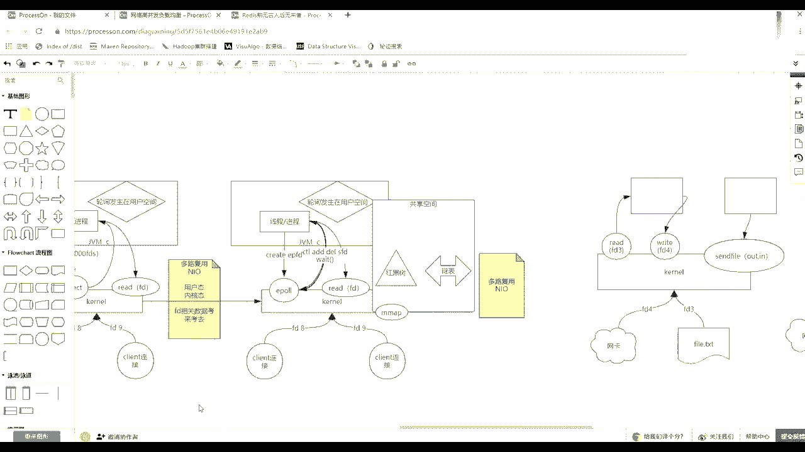

好吧，就给你补这么一点。

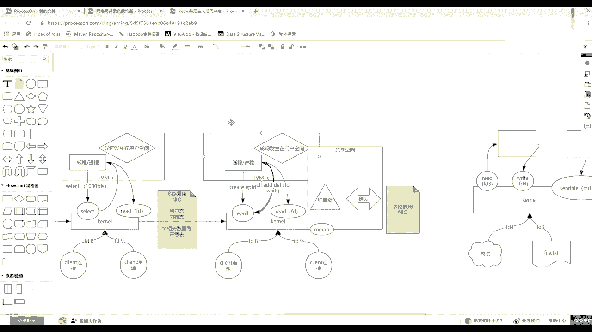

把这个知识补起来就可以了，好吧，ok收io这块就不做更多的细讲了。

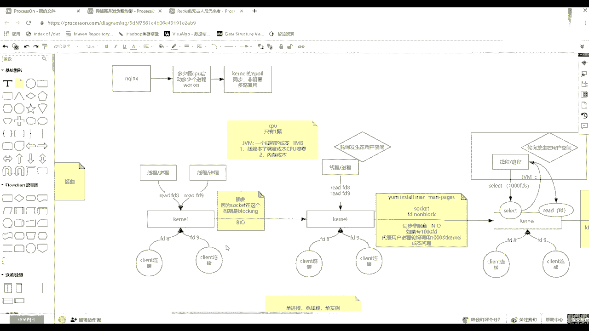

那么回来回到这块的时候，当你io的模型能听懂吗。

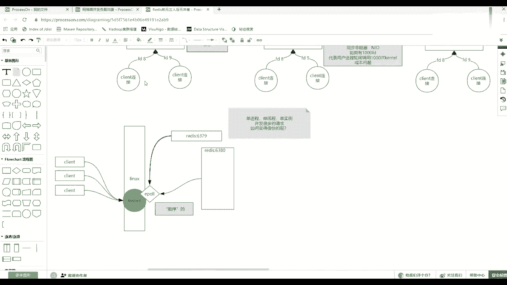

这个时候要把学有所用，把学到的理论应用到实际场景，比如第一个release瑞兹就会有很多的客户端的很多稍微连接进来，可能一个客户端，比如你准备一个一个一个淘汰，它有一个线程池。

它连过了很多或者是几台机子分布式的很多台去连着一个release，不管怎么样，最终站在这个redis所在机器来说，就是进了sy的很多全打在内核上了内核，这个时候你的release是一个进程进程。

可以调我们的所谓的一炮，然后来便利寻找这里边哪一个客户端，那个sop的那个信息发过来了，然后这个时候注意他re是单进程，单线程来处理用户这种数据，这关于他这个数据的处理的。

但是他锐利自身是就一个县城一个进程吗，不是，没了就是你要明白处理用户了，对数据的操作是它里边的一个线程来完成的，但是他可能还有别的线程在做别的事情，但是这个事情可能跟你的数据没有关系。

所以这时候一般我们就直接说，release是丹尼的单线程来处理我们用户的请求，那么这样的一种单机轮胎线程处理用户请求会有什么好处，这是一个顺序性，但是这个顺序性我再给你强调一下，因为一旦在分布式情况下。

这个数据一致性等等就很重要，而且是一个非常头疼的事情，注意这个顺序是什么，顺序是连接内啊，或者一每每连接，美连接内的命令顺序，这个能听懂什么意思吗，美连接每个连接里面这个这个命令是顺序到达的顺序处理的。

但是如果说比如说这个u k u k为a，那么他也发了一个对a的操作，他也发了一个对a的操作，那么无论你往网络当中跳跃，谁先到达的或者一炮明确的，只不过谁先轮到谁了。

那么其实这两个人对一个的操作为就你很难判定谁先谁后，但是如果是你一个人，它里边线性，而且没有使用多线程，线程线程还是安全的，虽然它可以有多线程，但是只要线程安全，对a的操作，他这边能控制住。

先创建a再删除a，只要他这个能操作的话，那么这个数据是可以保证的，如果他是单线程，这个客户端就是一个线程，就是一个socket，里边也是一个线程，那么这个线程肯定是先发出一个创建。

创建a再发出一个删除a，但是如果他自己这个规则里边是多线程多线程，那么这个创建者和删除的指令是跑前面的，如果线程不安全的话，那么有可能先把这个删除的发出去，再把那个创建了发出去，这块能够清楚。

尤其在思路情况下，多钱的情况下，一无论什么场景，这个数据一致等等，这个数字的情况一定是最头疼的好吧，所以以后开发的时候一定要关注这一点，注意这个小细节。

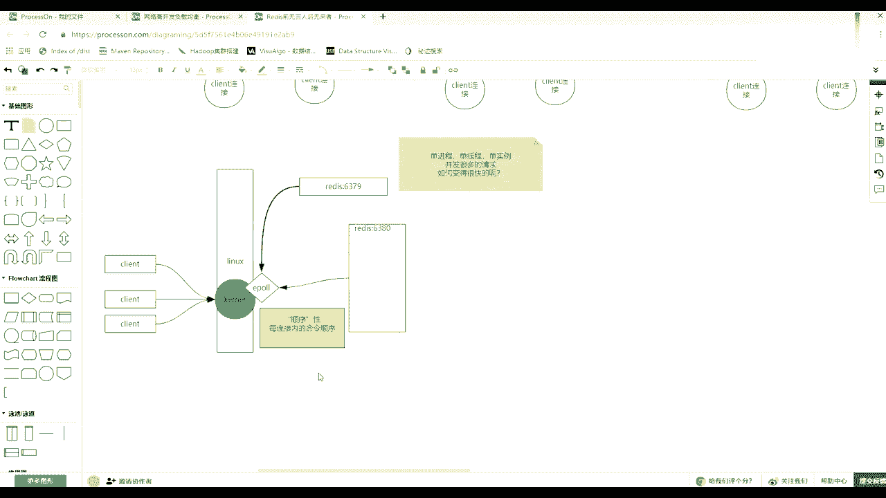

也就是你在前面会有很长的路，你在做负载的时候，或者在做业务这个这个这个网络路由的时候，你要把尽量的把相同的东西打到一个节点上去，就跟卡夫卡一样，为了保证一个资源的顺序，虽然顺序可能是差差，时间差差很久。

但是尽量用在一个tp的一个分区里，说对于一个k的所有的操作，那么这时候他们到达的是相互顺序是可以保证的。

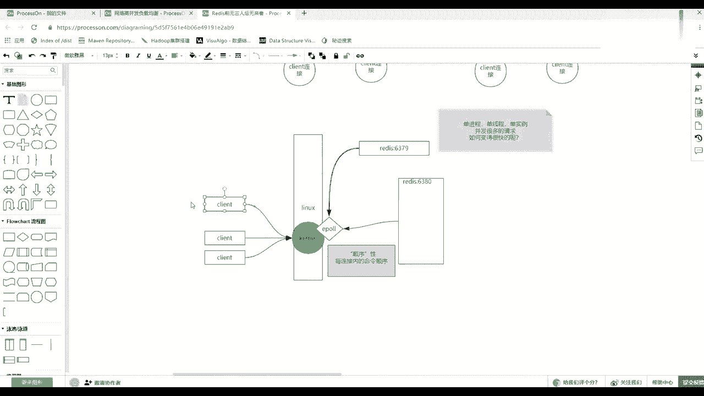

这简单说一下它的顺序，那么这里面注意它是一个线程来处理这么多，然后每每连接里边是可有顺序的，那么这块完事之后，那么到后面到release 0 release再往后是什么样的。

而且我把客户端拿到这个方向来，因为画到这边就有点看不清楚了，假设一个客户端本来我可能还有一个客户端去访问的release，那么我客户端和rise访问的时候，数据如何传输的，以及redis应该怎么去使用。

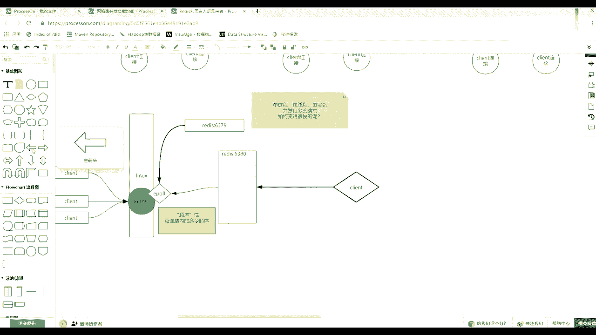