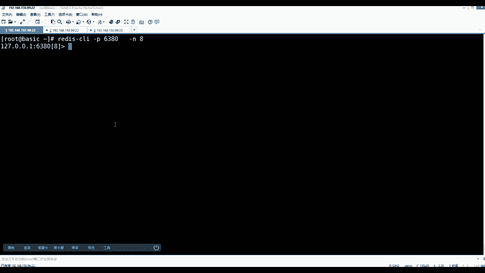
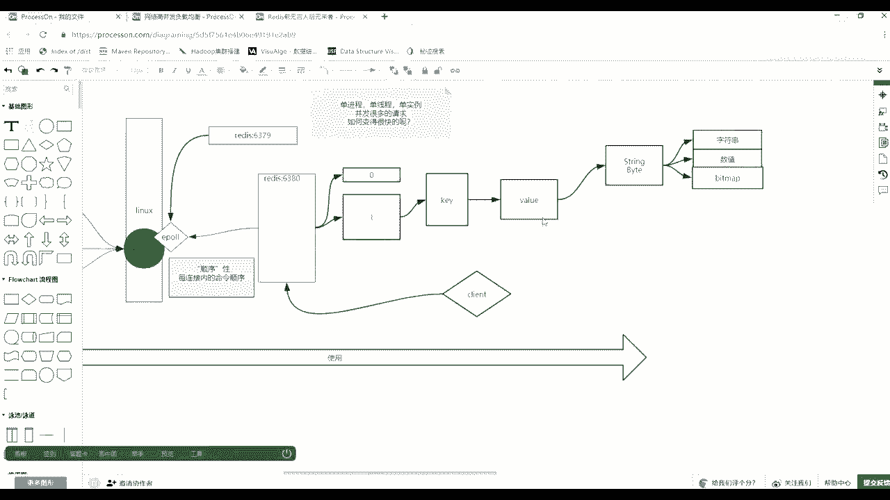

# 花了2万多买的Java架构师课程全套，现在分享给大家，从软件安装到底层源码（马士兵教育MCA架构师VIP教程） - P92：【Redis】redis使用 - 马士兵_马小雨 - BV1zh411H79h

理论东西都破解了，开始比较实用，比使用的时候注意看。

咳咳咳，这个a6379 和6380，这有两个release竞争已经跑起来了，那么客户端内容是什么，客户端怎么去连我们先讲命令行的客户端app先不说，因为redis其实还是原语的。

你只要会到命令行的那些指令了，那个指令在他的app i当中，基本上可以找到那种a pi那个对应的对应的那个那个调用，那么客户端是用redis gun client这个命令来直接启动，那么直接回车的话。

它默认是连的6379，但是如果你退出的话，1e x退出，你还可以redis杠c l i，然后让h看高度帮助里面它会有一些选项，比如说你连到具体哪一个主机的哪一个端口的，像我们当前这台主机就有两个端口。

639和6380，所以这么一个过程，然后后面讲解的时候可以输密码，然后下面还注意还有一个杠n，就是选一个db database number，然后还有一个杠杆rw，这是要么使用是默认的。

要么使用格式化的这个新技术，大概给你讲，首先先看到一个db在这扩展一下到图上。

那么只要是数据库，学mysql的时候，也会见库库什么的电表，不同的部门可以建立自己的那个库，然后表示隔离的在release里边也有这么一个概念，就是release里边准备了16个，默认是16个库。

默认16个库，也就是有一个0号库，然后还会有1号库，2号库一直到16，但是这个东西可以在你的配置当中去修改，配置文件也一会儿来讲，这个就概念就0号库，1号库，你连接的时候可以通过杠n来指定。

我连那个库或者到内部的进去之后来切换那个库，但是这个零一这个是死的啊，它是不能起名字的。

就这么一个概念，好吧，我们演示一下，然后呢先是用p，然后呢这个6380，这给逗号，那么进来的时候就连6380了，然后呢你还可以在里边，现在这边这边简单设置一下下一个k1 。

这个是比如说k0 号库的380，380里边的，然后k380 ，然后第一个冒号一，这是第一个k，然后value是hello回车，那么这时候get k380 里边就会有一个hello。

然后你还可以select，比如选了一个8号库回车，那么差异在这出现了，你可通过电话，你也发现刚才肯定是走的0号库，默认就进了零，然后现在进了8号库了，8号库里边儿。

然后你get k380 冒号一是没有数据的。

new就是没有的意思，你的k串在哪个区域里了。

那么其他区域是看不到你隔离的好吧，然后退出来也可以通过刚才连接的时候直接给定，比如去8号库。

那么连接是吧，这是简单的操作，没问题，不同的好吧好吧，那么你可以连起来了，那么在使用的时候注意rise里面刚才简单的是使用几个命令。

那么正确的如何去学呢，不需要老师进来之后学任何东西都有一个have回收，那么在rise客户端，注意这客户端里面有这个have客端的help当中，你如果直接说help，它可以告诉你这个help的使用。

有人提出使用方式，第一个help加一个那叫福i，后面可以跟一些组，他把很多命令分组了，或者是直接接到渴望这个命令，他告诉你命令怎么去用，或者help后面可以直接用table，他待会给你提示，给你提示。

现在这这这个前面带符的就是后面各种组，然后后面再出现命令，或者你直接写一个s e，它还能补全，这是他客户端比较人性的一个地方，好了，当这个help这个事情会用了之后。

我们来简单看一眼help用at他分的什么组呢，第一个通用组就是全局的意思，基本配置，那么回归之后，他会告诉你在这个哪些内容是属于这一组的，我们就简单看一眼。

这里面比如剑灵之一比例的删除k你给rik都会删除，然后呢exist pink是否存在，或者是像这种给出定义时间的啊，k的这个存活时间，这个后边讲他这个内存优化都在说这件事情还有可使用的时候。

case是可以接一个这个通配符，或者是这个这个一个一个一个描述吧，可以删掉我们的q有哪些，然后还有move移动，然后object可以查询关于我们k啊。

关于我们k他自身的这个诶怎么黑了自身的一个o b i定义，后面会讲这个proceed，可以将一个你定一下过期的这个东西给它持久化下来等等，这是面向k的，等于这些面子其实都是在面向k做做做些什么事情好吧。

还有一个态度常用的就这几个啊，我就先给你标一下，你走一遍，这是关于常用组的，比如说我在这里面可以简单的用case加一个星号脱位符，然后这个时候可以显示我曾经见过哪些k然后有一个月了。

在这儿注意说一下flash，flash或flash db这两个东西我演示一遍，你知道吧，然后立刻忘掉它，比如fladb回车，然后再case星就没有了，那么你也知道他做一件什么事情，他其实是在做清库的。

这这这种命令在生产当中就尽量的不要使用这个命令，而且一般运维都会把这个命令给你，realme就是你到运营，到你到公司的时候，你可能发现没有这个命令，他给你给自己改名了啊，咳咳好了。

那么这是刚才用的是一个通用的一个组，再来看除了通用组往下，那么说了，还有五种基本的类型啊，五种基本的类型，value指向的是widow，那么vile型也就stream that and table。

有list，然后有set，然后有so sad排序的哈，希然后向下的这种就是消息队列啊对吧，下面不是了事物，这是它的几种几种功能等等的，然后先不说那么一个来看。

先看我们今天先学的第一个string spring类型，那么敲到string类型之后。

它会把关于string这个y类型里边的所有的命令给你展示出来。

一定要记住那句话，就是上面给你标准图，那么比如说在0号库或者拿1号负数吧，你按库分好了之后，这里面有会有k，会有一个k还是key，会有一个key，他因为他raise是是这个键值对的，所以有key了之外。

这个key还会有一个指针指向一个value，那么value里边它是具备五种类型，这个概念要找出来就无所谓行，今天先学哪个，先学spring spa就行了，但是string其实你要把它想成是bat。

后面给你解释啊，就有这个string string其实后面还可以再说他有关于字符串，字符串，字符串或者直接数组的操作，这是第一个反应，有哪些命令还可以基于数值的和位图的，betterman。

这就是rise非常强大的一点。

那么现在我们看到哪了，看到k然后上面这个value，然后根据at的组可以检查出这么多命令好吧，那么刚才比如说我set的时候，我通过set设置了一个k value是hello，然后可以通过get现在取出。

可以通过一个get相等取出，那么这就是关于spring的一个。

那么so思路带回来看这张图你会看得懂，脑子里边一定要明白linux操作系统当中，然后可以有多个re实力，一个release实例当中会有零到这个就是多个库，后面配置文件告诉你能改一个库下都是存在着建筑队。

存的都是键值对存的建筑队当中，然后k其实是个对象，除了可以自身的这个名字之外，还有他的tag类型，然后以及including type类型是用户访问的时候直接看你的方法。

这个这个这个类型是不是具备这个方法操作可以快速返回，你是我这个这个这个方法，这个命令就用错了，不需要去真的去拿那个数，真正参与计算的时候，报报一常可以规避异常，明白吧，然后用qq的话也可以规避。

你后续直接透穿到拿这个字节拿回来直接做计算，这个事可以在前面做一做挡挡一次，对这个用吧，然后这个它是有这个东西，然后什么lance等等，其实你的value的长度，lance当中。

k当中那个对象当中也会保存，因为只要你做增删改这个value了，做资源，同时把这个长度算完之后，后边如果1亿次定完查询的话，不需要再重复计算的长度，长度直接返回，因为你从来在再也没有改过他。

所以就要用这个作者在这个k上的小心思，它让我们的raise虽然是登登记的单线程，但是有一些操作都会预埋下来完成对后续与高并发的查询，那个速度极快的返回基本都是欧冠o e的复杂度。

这是k然后y当中它的release val类型丰富，value的类型的丰富，现在只看到了spring，它的使用类型当中，我给你总结的可以面向最少三三类使用场景，属于字符串的名字上的切割覆盖。

然后还有基本的设置，统一长度还没有数值类型的分类来查，那么数值类型的这种快速的其实有一个场景，这个没有说完，这个也是它很值钱的一个地方，下面这个位图这个场景给写出来了，那么面向那个数值计算的场景。

其实比如就是我们的这个呃抢购商品的叫什么东来着，抢购还有什么什么场景来着，那叫做什么叫什么来着，那这些词突然忘了没对，秒杀，秒杀还有详情页，像淘宝的详情页，详情页当中大部分静态的图片中的信息。

但是他一定会这个后后端发起一个亿，不查实就一不查询查询你这个商品的这个所有的公开数额，然后等一系列东西，所以这个时候如果release没有这个数值，没有intedegree的话，你要到数据库的话。

等于一个并行度的，多个人想去同时对一个生命加加加减的话，必然会触发数据库的事物，对不对，所以这时候其实如果有了这种redis对输出类型的话，可以规避并发下对数据库的事务操作，然后完全由外力，是内存。

内存代替，完全有ridis的内存操作代替，而且这个东西叫做计算项数据移动上上节课其实也说过这个事儿了，这个能看懂吧，像微博当中的，除了这个这个这个香叶微博当中的时候。

还有什么点赞评论等等这样的一个评论数，评论数，好友数，凡是那些看似不是特别重要的数据，看似不需要必须精准的，但是银行里的钱这种事儿，他出了多少钱，利息多少，那个东西必须要染指事物和必必须要持久化存储。

数据可靠性必须要保证，所以这时候在不同的场景下，你要做正确的技术选型，就是这句话，就是他就光一个string，我可以讲出这么多东西来，rise是不是另外一回事儿，现在说的是一个值在观影库里边。

表里边的一个值的变化，使用关系数据库，你肯定得触发事故，在并发情况下，多线程情况下，但是这个值挪到redis里，因为它自身它就是一个进程，一个县城所有的请求增改查，而且计算机数据动。

所以发射站的那个内存，那个地图空间自身上面，所以这个时候他其实是比关税率要快很多的，可以规定一个事物那个那个发起，但是但是如果对redis里边如果多条执行的话，必须先前前面成立，后边后边还还能还能成立。

他对多比明明会组成一个事物，那是那是另外一个事，好吧，没错，这个世界上肯定观影数据库是你们最最能看到的，而且是被公认的，但是这个世界不可能就只有这一种关系型模型，肯定剑之多少的数据库能出现。

就一定都有它的意义，还是那句话，那一刻有没有让你去做这件事，db engines，这个世界上不止不是只有关系型数据库这一种数据模型，并不是所有的数据都必须是主键，然后这种翻译法和三还有很多的模型。

比如说这里边还有我们的建筑队的kiva的模型，然后还有宽烈劣势的这种模型，所以还有涂的，还有持续的有很多，我建议你们回去之后把这个网站这几个模型，尤其会标准的，必须看的，什么是文档存储的，什么是图的。

什么是时序的，什么是关系的，什么是键值的，什么是劣势的，这几个必须要看，你看完这个之后，把这些都背下来，心里边有点有点概念了，什么搜索引擎那种的，他们各自差异在哪，所以面试的时候聊这些东西。

都让面试官觉得你和别人掌握的东西不一样，好像具备3年工作经验，而不是只只是被简单被被被概念被支持的。

好吧。