# 系列 3：P94：【Redis】redis中value类型--数值 - 马士兵_马小雨 - BV1zh411H79h

那么在这当对redis的基本使用有一个认知之后，那么现在高级的地方就出现了，马上出现了，那么首先进行一个命令，刚才看这个全局命令的时候，一个ta tab比如说接我的k1 ，他会返回什么。

tab是不是看类型的意思，我刚才面前k一调过一些命令，你命令其实都归属于smile组，所以tab k k一的时候可以看这个k它的y值的类型是死于类型，这是一个常识，你用tab命令审视一个k的时候。

可以是死的类型。

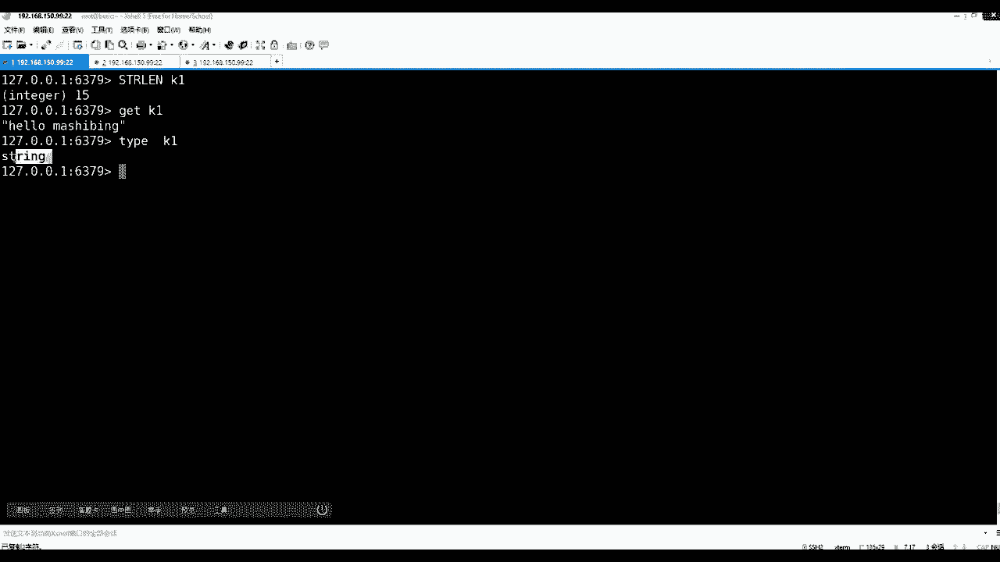

为什么，因为它有五种y的类型，每种y的类型都会有相应的什么呀，都会有相应自己的方法，每一种方法是和类型绑定的。

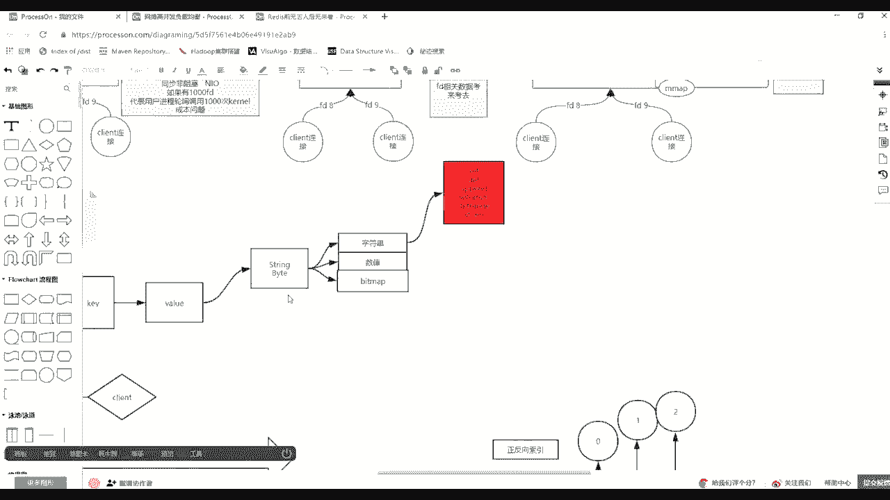

如果你从客户端就是发出了一个非实用类型的方法，想操作这个spring k的话，不用发生实际的操作，他只需要拿你那个方法，对于0k类型找不匹配。

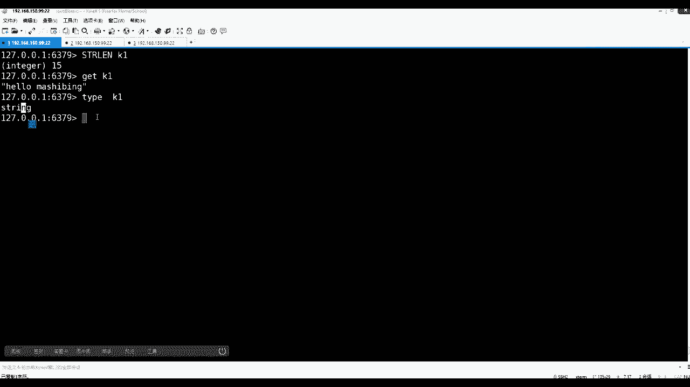

直接给反应报错，这是最基本的一个一个优化，也就是说它这个k里边会登记k里头会有一个属性就得知道加了，除了y轴上面刚才说到指定的一个知识，就要补一个，在k里边会有一个最基本的一个态度。

态度描述的是value的类型，type描述就是y轴的类型，那么除了有一个tap，还有什么东西。

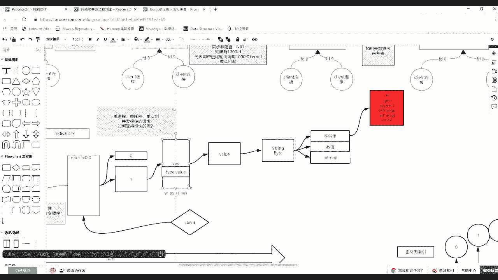

还有什么东西来注意看，如果我用set连青眼库啊，flash d flash，然后我用set首先看一眼help，sin命令，这个set命令一定是取值类型的，对不对，所以说我set一个k1 。

然后比如说给一个99回车，那么现在注意我是刚才set一个什么hello之类的，这k1 hello跟sd 99，那么这时候注意看type k1 ，请问我回去之后，他应该是个啥来看。

如果他们可以用它回的时候是个啥，没错是个string，因为我说了你这个命令是哪个分组的，那么未来这个k的val就是哪个类型的，所以肯定是死神类型，对不对，那么这时候再来看，我算了一个k2 。

然后一个hello，那么这时候不用想，因为你你的命令是什么类型的，所以k2 的tap类型也是损失类型的好了。

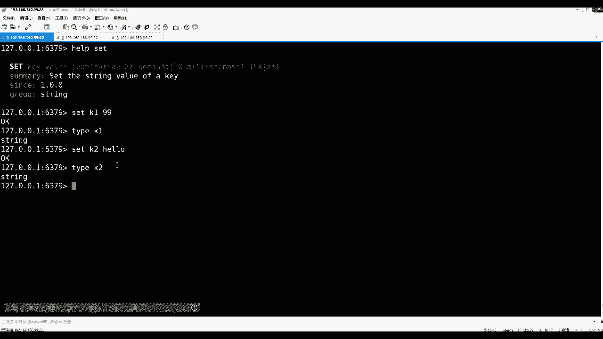

这两个都是之后，然后注意看啊，他的tap是绝对外边形，那么k其实它就是一个ob de，在月亮就是oem，除非这个太后也是你客户端，只要掉了这个k上面同学的tag去审视它的话，就告诉你明白了什么类型。

除了他之外，简直是个ob dex，还有一个东西，还有一个命令是审视这个k里面其他的一个元素的，比如说它里边还会有一个o b站的命令。

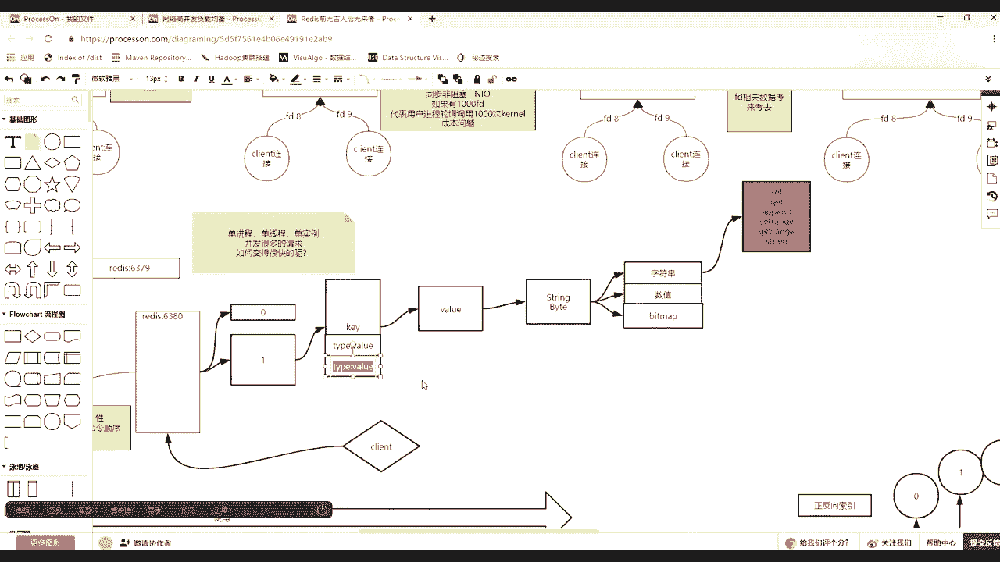

可以看到e n coding，那么因为ky是什么意思，ob jazz有这样一个命令，在rap当中有o b j的命令，它可以接受一些子命令，你可以通过help，b站，然后ob jack c直接回车吧。

啊可以通过a de后面这个have看不到，我上调一下o b i可以接入指令当中，就有一个including编码的意思，你要给个k那么什么意思，比如ob ject，然后对我们的d n cod。

然后刚才k28 楼注意我回头绕就会显示啥，走会告诉你是一个nb编码的一个string，不管怎么看成string了，因为我刚才k2 是不是一个hello，就是一个死刑，对不对，这个应该认可吧。

没有没有好用，对不对，那么除了它注意看刚才是来个k1 ，如果用object in call in对k1 ，请问回答正应该是啥，是自发的行吗，是不是自重类型来说一下，是不是字段类型。

这应该搭个是int类型好，如果这个你能懂，因为毕竟我刚才我给你演示的时候，碰上你看到了我对k1 c的是一个99，对不对，那么这时候注意看。

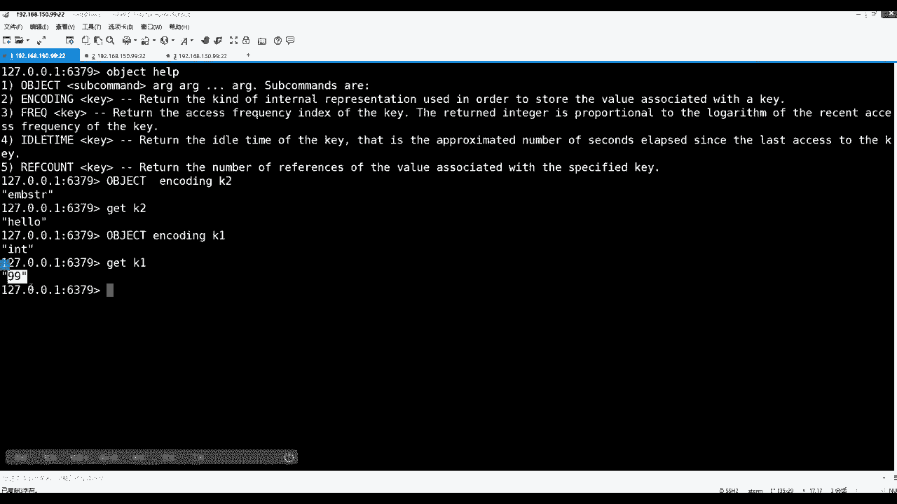

一定要记住类当中类型当中五个类型里边有这种例子，还是有什么有int类型吗，并没有int类型，那么这个ink是个啥意思，这个int类型是一个啥意思，它并不是太好注意，你并不是用tap去看的。

这一定要注意了，是有这个对象，我们这指向这个value里面，它的编码说到现在的in q的编码，这个编码如果是运营的话。

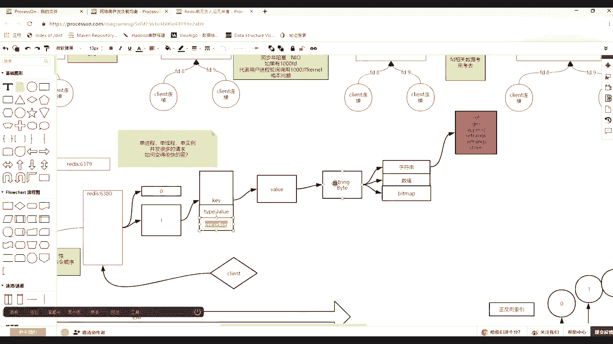

这个value的话，它有可能是指令，有可能是印子，为什么，因为面向，因为面向rex使用类型除了作为字符串的操作，还有一个计算的操作，如果发现这个k1 k1 ，你存在九九，如果他发现int类型。

比如说increase对我们的k一作为一个增加，那么这时候跟k一就变成100了。

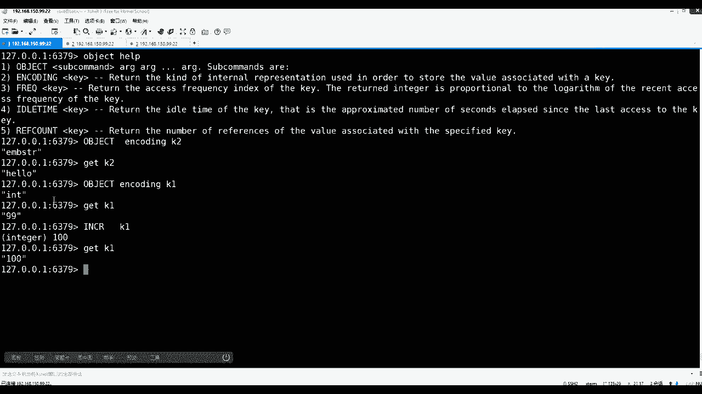

所以这时候立刻先抬成为一个概念，就是面向string的话，除了自传这些操作指令，他还有一系列数值的操作能看到。

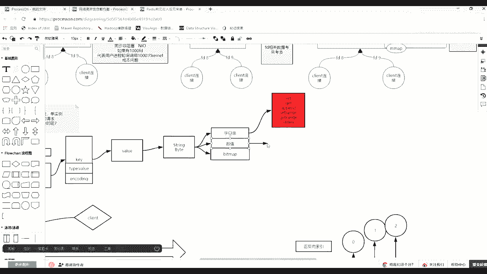

比如说increase increase，你怎么可以给他们读了呀，不怎么样，它是加一，而且你看，increment，然后the integer value of a key by one。

它是固定是晚上加一的，那么除了，除了有加一，还有一个by在后边是可以跟我们那个k1 ，然后后面给出一个加几，比如加一个就是这个22回车，那么再盖的k一就从刚刚100变成122，这是累加。

那么有哪家就相应的会什么decredc don，然后对着k1 ，它就会减一，然后d create，然后然后这时候对着我们的k一减去22就变成99，能加能减，加个y就可以加东西，那么除了可以加整数。

还可以接后边by float，然后对着我们的k1 ，然后加上一个0。5，然后get k一就会有一个小数加进来了，这就进了一个常识，没问题的，同学们，那个e m b s c r什么意思，就前面不用管。

你只需要关注t r就可以了，为啥比如说我给你再设一个sd，就这这么进行提示啊，比如k3 ，然后y轴是12345678 90 11 12 十，30 40 50 60 70 89。

22 122324252627，2829 33 13233343536373839 39吧，设置39个字符，然后这个时候在o v e，然后e偷丁，然后我们的k3 诶，那我再给他一下ak 3。

注意看现在是不是还是s2 类型的啊，刚才39个再给他追加追加几个12345 44左右的，然后在obs in coding k3 ，就这么瞎提示一个roll，一个是这个e m b s r，一个是int。

刚才有这个int类型好吧，这是啥，这是啥，你现在肯定不懂，我要把下面讲完就还可以了。

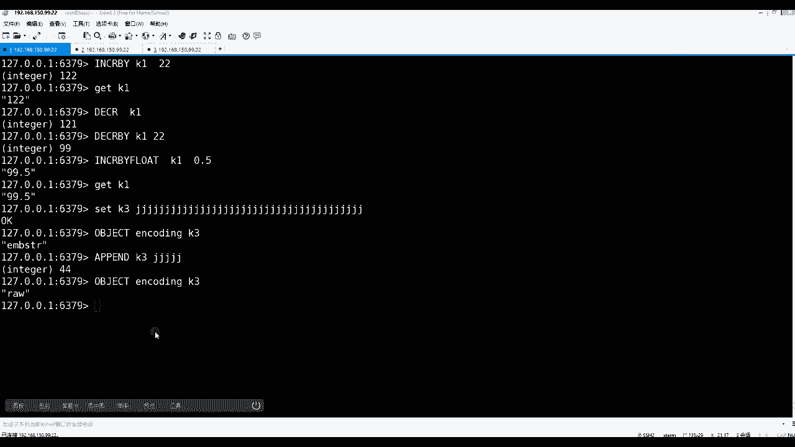

现在收做减法，所以知道了，我们一直在讲string value的类型，它里边有字串的操作，然后呢还有面向数值的操作，这里都increment decrement。

还有increment decrement by，还有一个这个关于防守的浮点型的计算，都可以在上实现，对不对啊，这个都听懂了，没问题了，那么这时候首先你要知道还有这种操作。

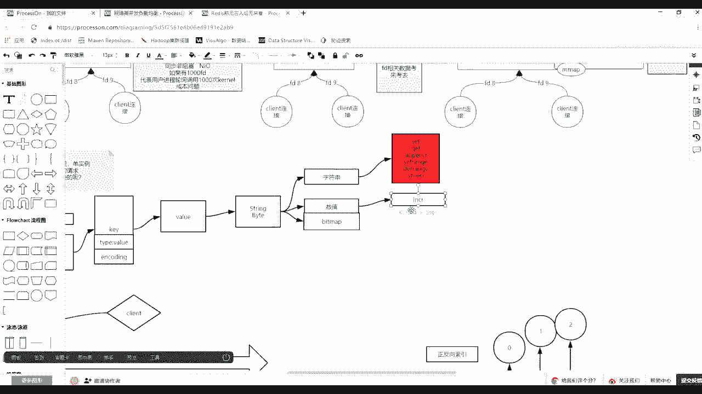

但是什么来自于string，对不对，那么现在问大家一个问题，flash清一下，清完之后，如果看相当于case里边库里不能有了，注意看，如果算是一个k1 ，hello，如果用slost来看k1 。

请问长度多少，前面两个字都铺完了，字画了数值都铺完了，那么现在接着往下走，一个一个过渡的知识，sn k12 楼选的长度多少，长度是多少，长度多少啊，为什么是五呢，回车的确是五，为啥是五。

好像是按照字符的字符个数，一个两个三个四个五个，对不对，是不是五级存的，对不对，但是这时候追上先往上攒，慢慢攒，跟着我自己坑里走，下一个k2 ，如果我设置一个九，设置一个九推车模式成功。

然后ob j然后in coding，然后k2 它们是一种in的类型，那么这时候如果再用scar这个spring lows，然后对k2 的长度进行判断，请问它是几，请问它是几，那么这个时候其实有一些常识。

一些理论就是如果我用一个字节可以表示零到多少啊，或者正负的话，就是0~127或-127~127，对不对，然后呢在不同语言里边，比如java里边还分为具体的类型，比如少double和int不同的宽度。

那么在redis里边，在redis里边如果它能识别出int的话，那么这个int代表的是java中，就是给他开辟四个字节来存了一个数值呢，还是就开辟了一个字节呢，是不是相关的很多知识带出来，对不对。

你要先把这个知识铺垫一下，这都是常识，为什么，先来看结果是一，明白不是一，对不对，那么这时候注意看啊，如果注意看，如果append对着k2 ，刚才那个九，what a，比如对九。

这个再再一个九或互联网站39吧，三个九回车之后，然后我gk 21定变成四个九不对，四个角，然后再看ob站，然后a扣b然后对我们的k2 注意看是roll认为的，对不对，是不是现在类型。

因为你除了append完了之后，他诶诶这四个九应该应用，为什么还是漏了呢，这是他的方法的问题，但是不要紧，如果increase对着我们的k2 ，是不是这样能加一，能不能加一，能不能加一，能还是不能回答。

挺能的，也能加一，你发现它也能加一轮，也能加一，那么这个时候加上一之后再看，哎又在int特别是int也就说一些方法，一些方法会让这个类型变掉，一些方法提前固定的这个编码，这个in in in的，对不对。

这些都能看懂，比较基本比较基本，但是这个时候要问大家一个问题了，如果在still lose，然后看我们的k2 ，现在蒙是对的，因为我是一步把你往这个坑里带，那么起来的长度多少，都一半了。

一半的时候应该几个长度多少，变成了五，为啥变成了五，为啥鼠标鼠标都是为啥子了，不算完还不算完还不算完还不算完。

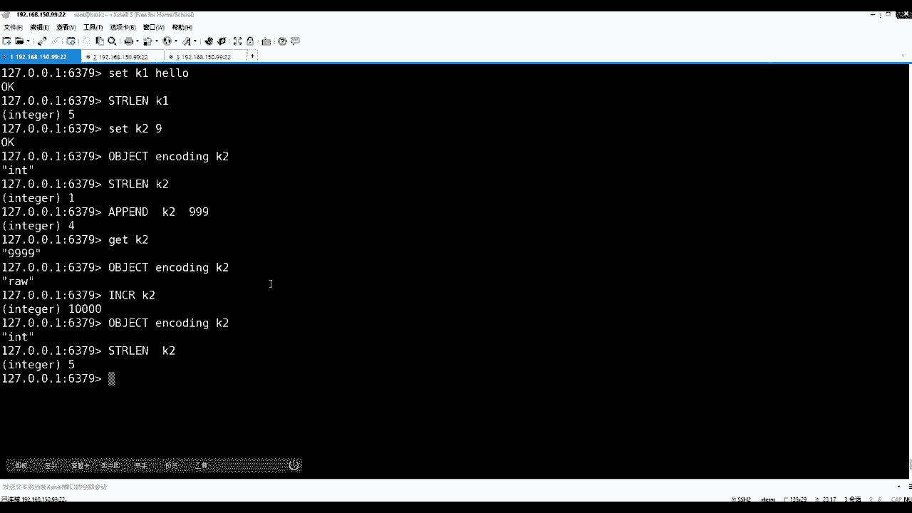

再来看，给你演示这么半天就是为了带出来什么呀，注意它的一个二级制安全的这么一个事儿啊，然后这个数值计算。

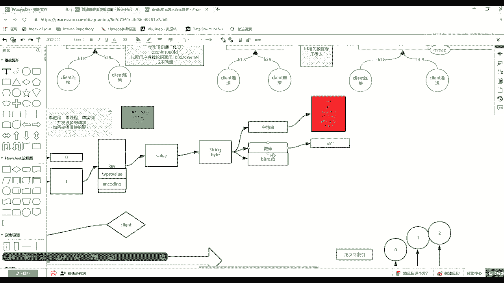

那么还有一个命令可能没有演示的，这是作者非常幸运的地方了，help spring类型，它里边还有一个比较长的一个get set的gsn，有这么一个小命令，这个gsn什么意思。

就是get three string value of the key and return is old value，不是set，设置你这个k的新址，并把老老值给你返回，很简单。

比如我下了一个k把张飞k一设置成hello，那么get kt的时候肯定是hello，然后这时候还有一个正规名叫set get get set get set get set里面我可以对着k1 。

然后给他一个马士兵，然后注意看回车的时候，如果你qq弄掉的话，他会把哈罗给取回来，老的值给你取回来，写新的值，这是马士兵了，更新了，那么这个那个有啥意思没有。

你要感觉ris在各种场景下为你的这个系统的一个考虑，其实这个位置可以完全不需要开发出来，不是原则性，不需要开发出来，也就是用户直接可以先get了k1 ，然后呢在下面k1 ，那么用户等于既取到老的值。

又更新了新的值，但是这时候你要考虑什么问题，就是成本问题，什么叫成本问题，你发送一个get，再发送一个set，等于在通信的时候发了两个包，两次的i o的请求，当然这个时候其实这两个命令如果合成一的话。

等于在通信上你就发了这么一个命令，过去就发了这么一个命令，过去能理解什么意思吧，同学们就带了一个完整的过程啊，会减少一次i o通通信，这就是做了比较细腻的一个地方，然后除了这些你说的原则性了。

然后看help spring当中还有一个关于多比操作的，多比操作的一个more set，在more set设置很多k的时候，k y k y k value。

还有一个more set是more set nx和ex，比如说像n x n x n x是什么意思，only if none of the key exist，就只有keep that的时候。

是不是才能才能设置，但是这里面前面注意多了一个m就可以设置多个k value，k valk value，那么就是来看走一个过程，比如我先把它清库，把我们的库存掉了之后，现在case都没有了。

那么这个时候如果msn x，然后你可以设置一个k1 a k2 b两个k那么走，然后m盖把你的k1 k2 出来，这个值都能更新上去了，对不对，对对吧，但是这时候注意看，如果你要这么做。

m sn x然后对着k2 给它变成c k3 ，变成d就这样一个操作，那么注意听注意看回车，然后m get k1 k2 k3 回车，那么你会k一是a k2 还是三分d没有变成c k3 ，也没有设置上去。

那么这个时候这个东西才叫做原子性操作，能能能能再多一点吧，也就是你在同时想试着多比剑剑值的那个这个时候加这个m，多比的加了个n存在的时候，他其实想多做多比的时候，它一定是一个原子的，有一个失败了。

有一个失败了，其实这里边谁失败了，k3 可能创建，只不过k2 已经已经存在了，他失败代表了所有人都失败了，好吧。

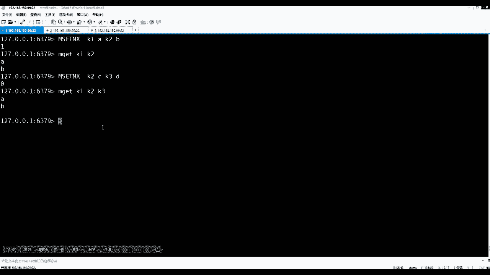

k3 根本没上去啊，根本没上去啊，好了，那么这就是他们向我们的string这个类型里边的诅咒数数值的基本操作。

