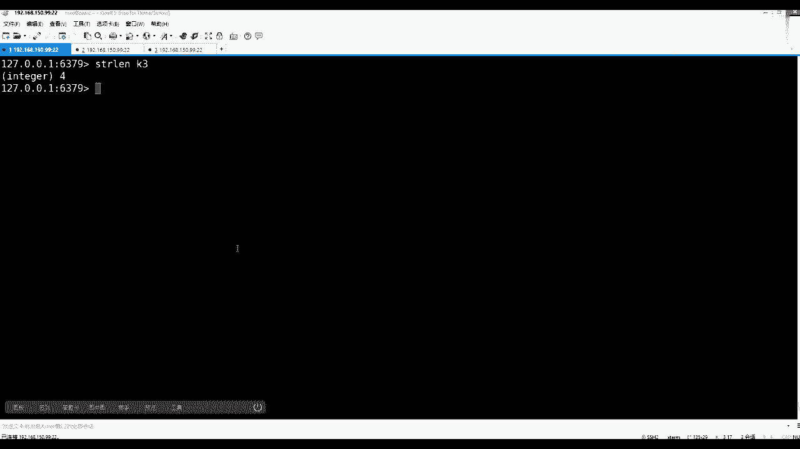
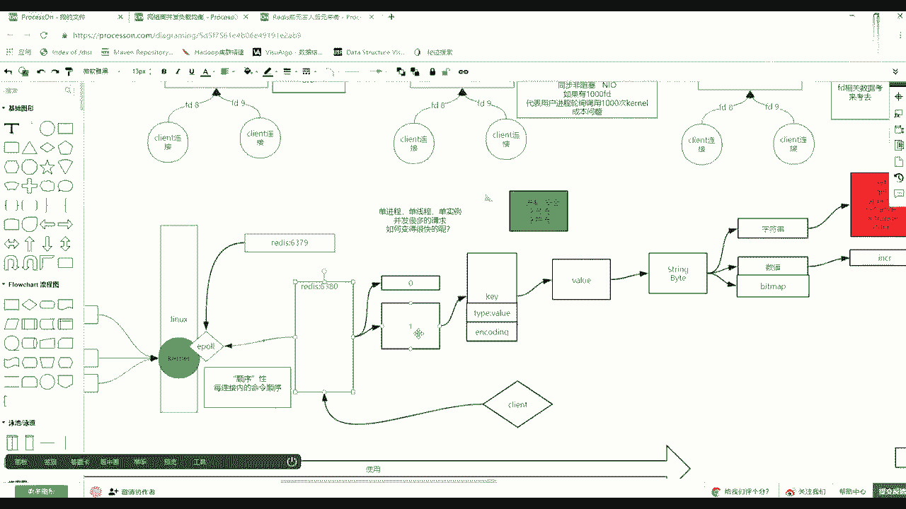
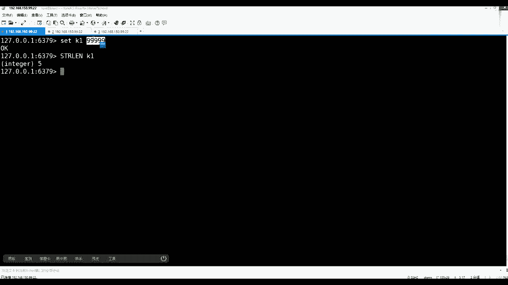
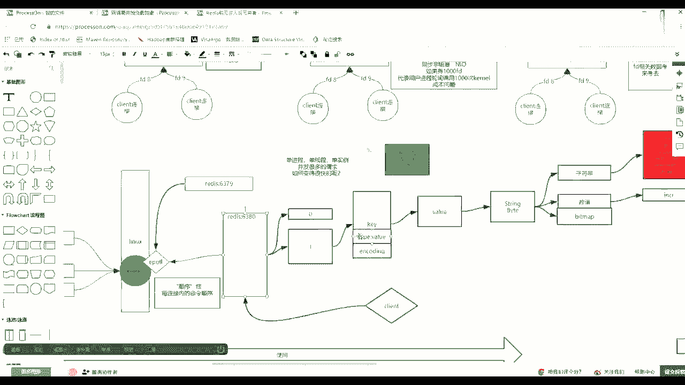
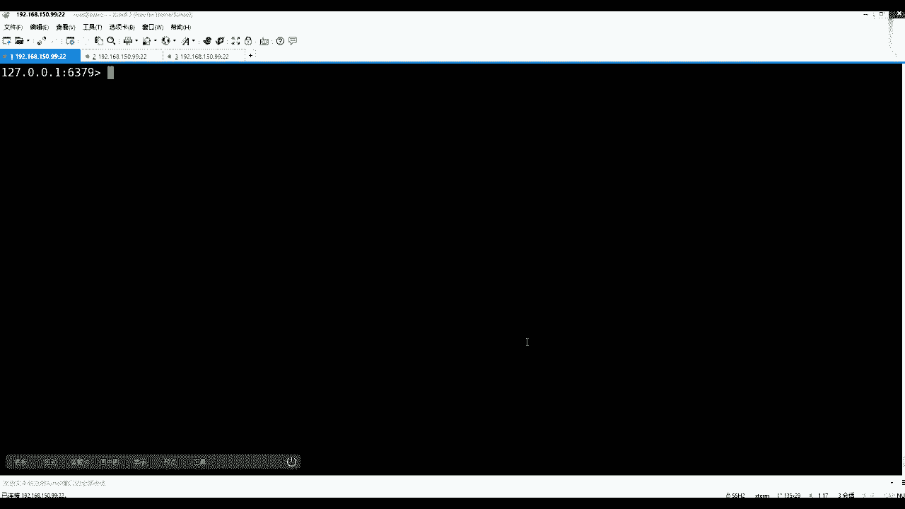
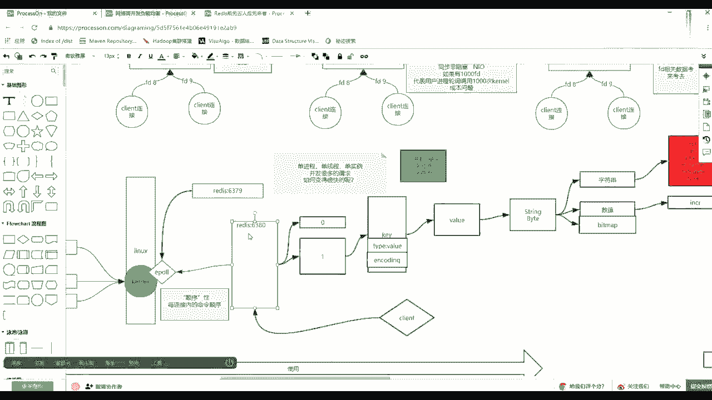

# 系列 3：P95：【Redis】redis--二进制安全 - 马士兵_马小雨 - BV1zh411H79h

下载一个k3 ，如果了a然后这个时候你get k3 就是一个a，然后l然后看k3 也是一个字节奏的，这都没问题，如果append我对着k3 注意看追加一个什么，我们追加一个中国的通字，回车。

然后你get，k3 不应该先盖子落落出来了，赶紧刷一下，k3 ，请问它的长度多少，我刚才看他是不是一个a后面啊，它那个中国的中字怎么那么现在整个长度上是四，不是啊，很多都已经蒙掉了。

那么点演示这么多半天，为啥我给你带出一个概念来，这个二进制安全，好像用红色看不出来，有一个概念叫做二进制安全，就是在read当中自有的一个特征，什么叫做二进制安全，这些low的听上去很高级。

但是glow也就是说在瑞兹进城与外界交互的时候，他与外界交互的时候，课本给他东西的时候，有人给他的字节数组等于，其实二让你想，我们一般面向流有字节流和字符流。

那么redis如果别人通过solit访问他的时候，大家从socket里面拿到的什么流呢，他只拿出字节流，并没有拿字符流，他被我拉特殊球，为什么，因为如果ris它只存字节，没有从字节取个东西。

按照某一编码集转换的话，也就换言之，只要你未来的双方客户端有统一的编解码，数据就不会被破坏，这句话听懂听懂吗，所以叫做二进制安全重要是这个安全这个字。

如果rise它自身除了vivo那种大的类型tab之外，他还有一个真正要动这个音coding，比如说你给了我一个999，我就全称什么什么东西，然后你别人取的时候可能一出我还这个不同不同语言。

因为这是客户端语言很多嘛，那么不同语言的时候，其实对整形的宽度理解是不一样的，就有可能发生截断一出这样的一个错误，没有什么意思，同学们就像在多语言开发的时候，我们更倾向于使用json。

使用charm l这种文本表示数据的方式来交互，而不使用序列化，序列化之后，这个时候大家就必须要自己增加一个什么呀，编码器和解码器，对不对，如果编码器解码器不一样，你那边认为int是四个。

我这边认为int就俩，你那边写的时候成功了，我用一个比较大的一个四四字节，能表示一个特别大的一个数写进去了，然后威尼斯也是四字节，但是这客户端认为这一类型不是该两字节吗，求来之后一出了不够了。

说完显不对了，所以这时候其实rise作为一个非常核心的一个中间一个中间者，他其实有一个二技能安全，它只只只取字节流，所以再来看刚才所有的这个和你想的可能不一样的地方。

第一再清一下fly是，听到之后，第一个数值这块set一个k19999999 ，这是五个九，但是splk一是五，现在就明白了吧，他并没有，虽然他知道ob ob i including，他是int类型。

但是他并不会把它按某一种数据类型给你存，比如按四个字节或两个字节，它就是一个字符，一个字节，一个字符，因为re拿的是字节流，你这个它形容面那个客户端，它的编码也是一个字符，一个字节。

然后直接向字节流去写，所以说先听一部分先听，这能听懂吧，是不是就能听懂，这块能够有，因为保证2d的安全，但是它里边的确会有increase decre这样的一个这个这样的一个计算。

这个计算的过程其实它是要把这一个字节的内存里面拿出来，先转换成数值的。

转成数值之后，然后它会更新我们k上那个这个encoding编码int。

那为什么要加这么一个，因为加了它之后会方便，如果我掉一次including，然后呢把他可能开始绕，可能是字符串，但是我把我把它识别出之后，打转入数字，没有报没有报错，没报异常，没报异常。

你给的参数也是一个数值，我加成功了，只要我计算成功，我就给including更新成int，代表着这个k状态往后都是硬核类型了，下次如果加计算的话，是不是就可以直接拿出来往上加，如果说发现不是int类型。

那么它其实你可以尝试买规律的报错的问题，明白什么意思吧，就是为了一个加速，就是要更新这个这个这个这个这个所谓编码这个这个过程，但是它的编码现在我强调的是，你要看这个长度，它的编码并没有影响数据存储。

这是第一个知识点，还有一个迷惑，刚才那个中国的中字为什么四个字节都不对，是不是为什么四个字节这周就来看set，一个k2 ，一个一个中国，我直接写一个中国的公子，我直接写一个中字中字回车。

那么这个时候我get我现在看成我随便lance看k2 型的长度多少是三个，为什么是三个，那么注意看到这个有关系的是看工具，然后看看在哪啊，选一个看看属性吧，我当前的这个插销连我的reits。

它有一个编码，编码在哪，我在这也就是我这个x shell这个软件和我的ready的通信是u tf杠八的，然后呢，你看我刚才在一定的框架，我试了一个中国的中字，它的长度是三。

然后我给他切成gb k编码及切成jpk回车，这个时候我再set一个k3 ，然后再写一个中国的中字，回车也k了，那么这时候through plus，然后来看我们的k3 ，请问长度多少啊，长度是二。

因为中国的中字在ut方当中是占三个字节，在jp当中jk jk就偏于我们中国自己的语言，所以他其他语言不会顾不会顾虑，所以压缩空间，然后用两个字也可以表示变成二，这都能看懂吧。

也就是说其实他真的走的是字节流，当这个课程之后，然后把客户端退出，注意客户端连接的时候，他默认啊还不能退出啊，再再再来看一眼case星，那么这里边有k2 k3 。

那么这时候注意看get k2 gk 2的时候走是三个字节，因为一这个八，然后盖的k3 是不是k3 ，这边是两个字节，一个三个字节，一个两个字节，这这个这个是16进制的。

它的值它那里边的代码直就是阴天和八当中中国的中字，他这个是值代表的是gj bk编码器当中中国的中字，它的编码这两个听懂之后，然后再退出，然后这时候用怎么进red cli。

然后杠杠这个落后会触发一个格式化回车进来之后注意看，如果你盖了k3 就中的中子，get k2 是这个字，为什么别忘了我现在现在年轻的编码机是不是已经jdk了，如果你只需要知道。

如果不带着他也就是无is只会识别什么呀，只只会识别阿斯玛的超出巴萨哪，他就直接按照16进制给你显示，但是如果你加了这个选项，它就会触发编码集的格式化，也就是说发现了这三个实力进制。

且符合u这个你当前这个编码器的编码规则，就从编码集当中给你找到那个字符就不给你显示三个或两个了，现在这个k2 因为约定了八的1t和八当中，这三个东西在这个当中就是他就水都灌满了，其实最核心就是一句话。

redis是2d的安全的，学了大数据的同学应该更懂，首先还是2d的安全的呀，hbase是不是也是二进制安全的，是不是我们在向hbase写数据的时候，也是要先给他们做序列化，变成一个字节数组。

hbase根本不会去破坏你的编码的，这个时候再看看长度长度这个事儿，它就是长度k3 ，这个点k2 就是三，长度是不会发生变化的，底层就是即便我在这个这种模式下，即便在这个模式下，比如我在一个k4 。

一个中国的中子走，然后star plus一个k4 依然是俩字节，他jpk情况下，也就是说给你上层客户端外围你啥编码，redis不知道raise不知道。

你只要想守raise给他的就一定是你这个客户端先变成字节数组，可以一开始就设成这个int类型，不是自己设置的，是在你设置的时候，你设置了一个k5 ，一个五，然后这个时候o然后in coding。

而且这个时候虽然我告诉你有这个编码这个事了，但是忽略了他会做一些预判断，它是一个int类型，那么这个时候如果他已经判断成int类型的话，你就会来调increase。

然后k5 的时候他就直接可以触发这个计算，而不需要做一个排错的过程，就不需要判断能不能转成直接直接发动计算就可以了，就提速，可以把一个判断转转转行这个过程给他忽略掉。

没错其实说白了就是它底层存的时候就是按照字节去存的，上面只是说在k上面要做一些优化，k上面如果没有赢勾引的话，你每次计算的时候，他都要先走自判断这东西能不能转成，如果发现诶。

你上次的计算是围绕着这个string的一个字节数组的一个类型当中，作为数据数值计算体积成功了，我觉得include直接给标印标准，这个之后你下定论的时候，直接直接对着二进制，然后做累加就可以了。

就反正他就会加速一点，相当的就是适当的会加速这个这个这个加速这个过程，如果他能识别出是这个4g2 的话。

如果你加的话，他就根本就不需要去转码。

直接给你报错，这个类型不符，他不能按计算，是不是大伟这个点一定要get的到啊，这这个其实就是作者比较细腻的一个地方了，作者设计的时候完全可以不用带它，但是带他的话就会稍微好一点。

他可以让他的一些方法的速度变快一些，ok现在什么是二进制安全，听明白了吧，就是未来代表一个什么问题，代表一个什么问题，所有使用rise，你在很多人使用radio，大家一定要在用户端，这个叫什么呀。

沟通好我们的数据的编码和解码，redis里边是没有数据类型的，他虽然是为了客户端，但其实也是客户端稍微带来了一个问题，是在公司当中。

