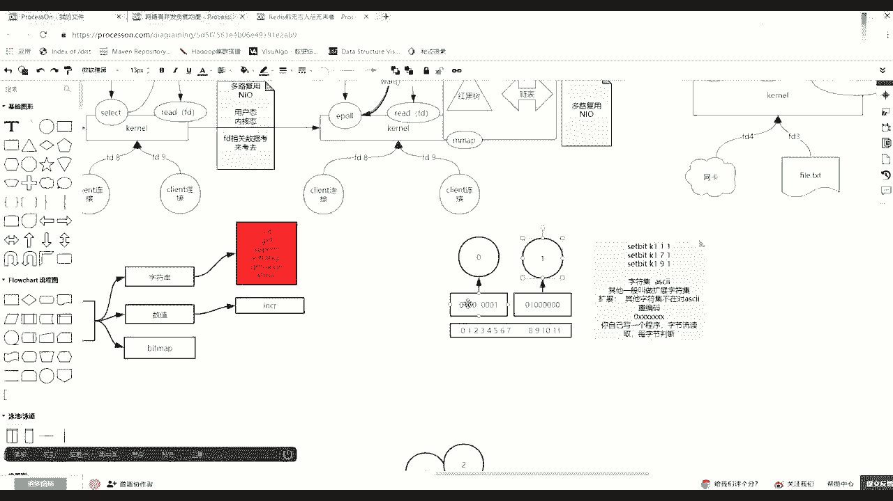
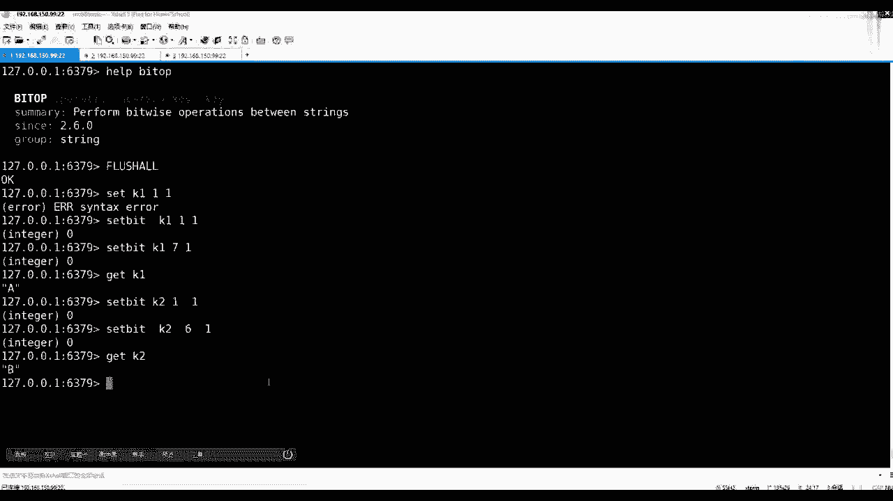

# 花了2万多买的Java架构师课程全套，现在分享给大家，从软件安装到底层源码（马士兵教育MCA架构师VIP教程） - P97：【Redis】redis中value类型--bitmap - 马士兵_马小雨 - BV1zh411H79h

下面开始讲那个未投币的map，嗯，我上节课为什么花了一点时间把你往坑里带，然后为什么你带带出这个二进制安全，最终为什么让你明白他就是一个字节流，而非一个字符流，然后最终为什么让你明白他底层存的就是字节。

其实知道自己这种存储形式之后，为图这个事的好学了。

好吧，比如说自己是什么意思，你看我先清一下库啊，什么叫做贵族，都没有了，那么第一个命令cd，注意这四个b的一个命令，它也归属于string这个vue类型为字符串里面会有这么一个命令。

然后这个命令会给出一个key，会给出一个offset，然后给出一个value，当然这时候注意了，他已经带入这个bt这个位这个操作了，那么这注意听这个outside是二进制位，而非数字节。

数组是二进制位的偏移量。

那么通俗来说画一个画一个东西来说，首先一个字节有多少个2年之位啊，12345678，这是一个字节，对不对，一个字有八个内置位，然后再有一个字节的话，是不是他也会有八个内置位，对不对。

那么这个字节刚才说了，在radio里面的时候，刚才说他这个这个索引的时候，它是面向面向的字符节，是面向字节，它会有索引，也就是说第一个字节的索引奥赛是零，对不对，第二个是不是一了，这个理解吧。

但是注意清注意披露，面向二零中位也有索引，它在二零中位有索引，如果你在使用未命令的时候，使用未命令的时候，它的按键位也是有索引的，它的索引也是从左向右，012345678 90 11。

那么这个就我就很难画了，就是前七个是肯定是起这里边对应他那个位置，就是二进制位，虽然字节是割裂的分开的，但是对于rise里边二进制位，他就想成是一长串。

所有这个位从左向右一直从零一直到他那个位置最大最大。

这个模型先新新到了六数，那么像这里面sfit的时候给出一个k。

你给出这个outside，注意这个outside是哪个，说的是二零之位的outside。

而非字节的offset，举个例子，它的位置我对k1 ，然后注意凹下的是一，然后value那么二零制的value，除非就两种，要么是零，要么是一，对不对，哎我给一个一，那么回车，想大脑里有几个问题。

第1k一的长度是多少，第二它的二进制表示什么东西，有两个问题，先告诉我的长度多少。

没错就是一个字节，那么这时候你要明白这个一是什么意思，这个一是他这个第一个字，第二个字节这个一这个作用吗，不是他说的什么呀，是这个一，也就是说其实它的内存当中是把从左向右，第二个因为从零下方开始。

pc把它变成一了，刚才塞在地上是发生这么这么一件事情。

能理解吧，那么他是个啥东西呢，这个at的福在阿斯码当中01000的一个字节正好是艾福好吧，然后注意再看到那个那种感觉啊，如果，给出k k1 ，请问长度是多少，请问它是一个啥东西，长度是多少。

没错还是一个字节为例，因为七代表的是第八关，所以他不需要开立新的字节，他最小的开闭空间是一个字节，对不对啊，他他他不需要开辟第二个，开辟一个就够了，所以它的长度就还是一个字节，但是它它的数值是什么呀。

你要看你对阿斯玛熟不熟了，是大写的a就是那按这表示表示注意是01234567。

是不是第八个是把它变成了一注意01000001。

现在k一的只有一个字节，就是字节的二进制位，就是01000001，那么它的阿斯码值就是大写的a你可以冷去验证ma，啊什么你就去找大写的a，但谁一说了啊，这里面是，这是十个均值，对不对。

然后这两个数字代表的是前面四位，这个数字代表后四位。

后四位是不是就是一啊，16进制是不是这么这么表示的，因为1248满的话，就是16该进去了，对不对，就是零到15，然后16就到这了，所以这个后边四个正好是这个一，前面这个四是什么意思，124这个位为一。

就是代表四四十一，这代表的是大写的a没毛病。

同学们，然后这个会了，注意在看啊，如果做这样一个操作，set beat对着我的k1 ，然后对他一个九，如果设置成一了回车，那么请问这个长度多少，没错，长度二，因为九已经超过了。

因为他第一个自己的下标是0。35789，已经超过了第一个字节的那个八的宽度，所以程度是因为二，那么请告诉我，根据刚才的知识盖了k一的值的时候，它是什么，gk一的值是什么，没错，是ai，就是这么简单。

他的命令行客户端是可以不全都显示这个这16进制。

如果那个视频均质刚好呢，一个字节能能转成阿斯玛的，给你按阿斯玛给你给你显示能看懂意思吧，因为现在这个k一在内存里边第一个字节就是0100001。

因为我刚刚对九九其实就是八这个七下周10123~789，把这个位置改成一了，它就是at，现在看懂了吗，追风，因为开始的时候你注意我这个整个这个这个命令这个顺序啊，我这个妹子是这么顺序的。

set beat，然后对k1 ，我开始是为一的时候给了一个一，对不对，注意k一可能就是我一个k然后这个第一个是outset，偏亮偏量为一的时候，就是零幺在这打到一个一，这个位置完之后，然后为七七的话。

你就是下下边为七，就是第八个，对不对，就是012360234567，就是第八个在这儿打了一个一，就变成他了，然后下面又执行了一个sat beat，然后bk 1，然后对九打了一个一。

那么这时候一定要知道二进制，这个outset是从整个所有二进制里边从左向右写的，就是012347899的话，是不是第二个第二个自己的第二个位置带一了，那么这时候你的需要天量没有超过两个字节。

其实最终就两个字节，这两个字节就是你的k整个while的内容。

所以这个时候你在get k一的时候得到了a at，因为它是以一个字节来显示的，刚才这个追风这这这个这个过程听明白了吧，嗯ok好吧，这是面向我们的一个206位，可以做这个设置了，这个能听懂，比较简单啊。

月牙是ask ask了，不是u tf杠八，首先你退出去啊，注意看这个。

我给你补上吧，有这么一个基本常识，这个我都讲过，这个字符集，字符集标准的是a s c i阿斯玛字符集，其他的一般叫做什么呀，扩展，扩展字符集，关键是这个扩展的意思，什么叫做扩展啊。

什么叫做扩展啊啊其他字符集不在，对a s c i i重编码，复用复用的时候注意阿斯码有个规律，就是零必须的，然后把1234567，那叫阿斯玛里边第一个第一个字节，第一个币是零。

后面可以从全0~1个全新的变化，代表不同的东西，所以这时候当这个常识，这叫常识，有了之后，任何的程序你自己写的程序，你自己写一个程序，字节流读取，然后你肯定是每字节，每字节判断，你要每字节判断。

如果你读到的第一个字节就是零开口，那么你脑子根本不用想，你都不考虑你自己的gpk还是1等8，直接拿着这一个字节找他，是第一个是零开头，直接去阿特玛把这个字符都显示出来了，但是一旦发现不是零开头。

是一开头，比如一个又一个妈当中有三个一一个零的话，那么你除了这个字节，还在读出两个字节，因为三个一代表用三个字节来表示，然后再把它的前头马踢掉之后，拿剩余的26位拼成一个数值，去你的那个你那个客户端。

那个现在这个字符集当中把那东西取出来，那个字符显示出来，比如中国中子，字符集这块能听懂的同学来刷波一。

好吧，所以这时候其实你会发现很多客户端，你比如说apex当中也是诶那个英文字符，怎么能显示我别的东西，怎么还是那种16进制罗德码似的，就是因为什么软件字符集里边大家都会是阿斯玛，但是他未必去认识其他的。

而且他一般也不会给你做强转。

因为人家放的时候，因为你你你你那是阿里的安全，我要训练客观是那个预定八了，但人家放铃是不是按应该放的，我不知道，所以我就一定是什么呀。

就是按实际实际就是给显示了，但是如果你客户端当中给出什么呀，recline告诉你尽量的拿着我打开的那个就是把它一加，然后我客观现代一直行的时候是啥编码集，那么就尝试着拿着一些16进制的那个不是零开始的。

拿着我这个这个字符集去找那个字符去显示，但是就有可能会出现乱码，因为人家对方可能拿拿了优点，网吧到这里是二进制安全的，还是那个ui编码，就代码了，好吧说的有点多，回来收好，我们在讲我们的两位图。

这件事情现在往里设置，往里设置，这个事情可以可以可以会了，然后再来看还有什么相关其他的，随便这个内容组当中面向b的操作，呵呵呵，这个操作还有什么become，然后big show的这个往后讲啊。

这个这个32出来之后，这个东西比较复杂，今天讲的更晕了，现在简单bedcm的be a beauguration，然后beat pose，还有下边有sb干没了，就这么多，一个来说，你往里设置了。

现在还有一个是beat，pose这个命令big post命令是做什么事情呢，是find first beat，寻找第二位，然后在你的这个字符在哪个位置，他的语法格式用这个命令后面接你单了一个k。

然后呢给出你要寻找的二分之位，但是无无非就两种状态，要么零，要么一，然后你要给出一个区间，但是在这注意了，这给的是star end，它并不是说aset。

那么这个3n说的谁说的是你这个字节的索引。

我们来演示一下，如果用be pose，我要查二零至120制，这个一二进制，这个一在0~0，star 0 n的零，那么请问他会出现吗，beautipose，你要注意这个命令干什么，干什么事情呢。

我是要找的是二分之位，一在这个零到这个零。

这俩零是什么意思，其实这俩零说的是第零个是第一个字节，那么找一的话。

它出现在哪了，是不是出现在一这个位置了，唉走回车。

这，刘我没有给出k没有给出k啊。

是哪个k是我的k一用了啊，你要先给这个k啊，回车是不是在这个这个唯一的位置，在那个一的位置，然后注意看，如果把这个零换成一的话，换成一的话，1~1，那么这两个一star呢都指向一的话。

其实说白了就是第二个字节，对不对，是不是出第二个字节。

那么请问如果查一的话，它的偏移量，它反对的偏量，这个偏量是多少是多少。

要小心回答了是多少。

是多少，没错是九。

他给你返回的是这个一在二这堆二零中位的位置，这么翻译就对了，而不是说在这个字节里，它出现在第几个，返回2g位的时候。

它是全亮的，它是全亮的，那么这时候如果改成0~1呢，它等于多少，他是找到第一个的first。

如果big pose，我要在k一这样的一个二这两个字节这么多二进制状态当中。

我要找一这个二进制第一次出现的位置。

显示在零和一两个字节数的去找，那么回回这就是一就是这个下标一，它找的第一个出现的位置。

这应该都听懂，这个还比较简单好吧，好了，那么除了bp这个bhouse，还有一个是become become become，后面要接一个k。

然后给诸stend，注意start end说的就是什么呀，是你个字节的起始和结束。

然后count什么意思，count它只抗只抗了一，他只count count一出现几次了，那么这时如果对于k1 ，我从0~1这个范围，这个字节单位的范围区内统计一出现了几次什么回回几。

是不是出了一次两次三次。

对不对，那么这时候回的就是一个三，它可以做二进制为一的统计，你给出这个字节的区间，如果给的是0~0的话，就第一个字节里面两个一，如果1~1的话，这个时候出现出现过一次，这个一二是这个一，那么接着往下讲。

好那么接着看，除了这些，还有一个是叫做bat option operation，为了操作，那么这个语法的命运是我可以注意注意叫diss，叫目标k目标k后面可以接一个k或者更多的k。

这个目标k是结果是结果不打印了，是要放到这个里面来，那么你参与的k会触发什么，触发一个关于二进制位的逻辑操作，与或非亦或是and or tral或者not学过计算机二进制的。

这应该都知道是不是面向二进制的，或者与或非对不对，抑或单位的单位的操作的，那么举个例子，比如说要注意听啊，我先准备两个，我先把这个库清一下flash，然后我算了一个k1 ，然后把他的一标成一。

然后啊设个壁纸好设个壁纸，然后在sdk一的七标成一，那么这时候k一就是大写的a对不对啊，如果我想得通过200v的操作得到一个大写的b我应该怎么设置，我通过给k2 ，我最终想把k2 你重新带一个b。

但是通过四个b这种方式怎么去设置，然后对k2 的第二个那个v是不是标一个一就可以了，就是零一啥啥的呗，这个这个单我给你讲哪哪用它，然后在sb对着k2 是什么呀，ab是不是能来的。

零一是a10 是不是就b了，一一是不是c对不对，所以说我对它的六这位打一，这能看懂吗，所以这时候加了c2 是带个b，因为后边要用到它做逻辑与后算这个逻逻辑与或的时候用它好了，现在我有kk 2。

一个分别是a一个分别b我给你写出来吧。

因为咱们的确有的人可能对这个，这个的值是不是大写的a，对不对，然后换一个值，后面改成1020制，这是这个零一是110，是不是二，所以它对应的是b了。

对不对，来请问这就是k1 ，这就是k2 ，我要做一件什么事情，d operation operation，然后目标k比如说and key，先先写的是origin是and不and的安慰语。

然后目标k是and key，然后参与的是k一和k2 ，明白啥意思了，然后这时候回车，那么目标把kk安慰语的操作是不是存到目标k里去了，除了标配的话，那么这时候get and key它的值是什么。

请告诉我值是啥暗语的操作的时候直接回到我值是啥，这全答错吗，按位与操作，什么叫安慰语啊，什么语操作有益则益，不是这个有有零则零。

全一唯一的问你琢磨琢磨，这俩如果按位与的话，德国这是个啥呀。

是不是01000000，所以它的值是，明白了吗，现在制作时候都按照这个这个啊这个这个b的b的o o a了吧，如果改一下，如果beat operation，然后给的是一个按位或操作，然后是okey。

然后也是k1 k2 ，那么这个时候我get ok。

那么它里面存的是啥，这是不是c了啊，或操作的时候是不是有一则意了，全因为赢得来，那就是01011。

明白了吧，好了，ok这就是按位操作。

有这么几种方式，那么有人说了，老师你在讲啥，你在讲啥，这边这个知识点很重要，在国内当中最值钱的就这个bm，这是位图，举一个经典的例子，首先我先告诉你的命令，你回去自己整理，这里面是不是会有这个cle。

然后还有bat count，回忆一下，还有beat pose，然后beat operation有这么几种方式。

