# 花了2万多买的Java架构师课程全套，现在分享给大家，从软件安装到底层源码（马士兵教育MCA架构师VIP教程） - P98：【Redis】redis中value类型--bitmap例一 - 马士兵_马小雨 - BV1zh411H79h

这个位置因为上面都很很容易理解数值计算字段的操作，只为图你们很多人可能第一次听说，所以给大家这个这这儿单独给你做一个笔记，就把场景写出来，两个场景，第一个听需求，第一个听需求，如果你的公司有用户系统啊。

公司有用户，那就优惠点呗，是不是很多用户对不对，哎，然后这时候这个需求是什么，需求统计就是未来这个需求是统计用户的登录天数，且窗口随机什么意思，比如说在电商的公司当中。

电商的网站一般都是说你老板心血来潮，说马上这个今天是8月28828，马上就9月了，那么9月1号往前推一周，9月1号往后推一推一周，这14天所有用户登录的天数方统计一下，然后没过两天被十双11了。

双11的前后保存一下，然后哪天他老婆生日了，哎我老婆生日前后前后几天给我统计一下，就是你的老板会随机的让你统计，指不定哪天就哪天结束这个范围之内，能听懂我什么意思呢，在这个需求下，你是怎么维护jp数据。

支持用户登录的时候登记，且可以把这些用户1年的数据随机窗口去查询，比如就差a这个用户，a这个用户在某一个时间窗口内，他动了几次，那么怎么去处理，是不是处理的解放是有很多，你尝试着多想一想，多说一说。

用你之前的这个思想，过往的经验，你是不是可以拿一个数据库mysql，然后呢创建一张用户登录边，用户每一笔登录是不是可以在里边产生一行记录，然后登记他的时间，哪天登录的，对不对。

然后用户所有动物是不是可以往里灌，但是这时候我想你想一想，这样的存储的时候，是不是就要从存用户的id，因为mysql是关系型数据库，它里边关表示表之间必然有一个主外键，对不对，关联的对。

所以d这个这个id可能就是几个字，几个字节了，至少得三四个节，存一个g吧，能听出来表达这个词，没听说在算这个成本复杂度，对不对，这张表最少每行是不是得存一个日期，再存一个，它哪天登的吗，日期日期的话。

你最少也得准备一个四个字节id，你得准备一个四个字节，这是八个字节，表示一个用户的一笔登录要消耗八个字节，这是第一反应，那么你京东有多少人，每个人1年基本上得有200多天登录这张表的数据是不是极大。

查询的时候，用户老板给出一个随机窗口，是不是要被列，所有的数据成本是不是极其极其的高，怎么优化，怎么优化，大数据处理不需要release。

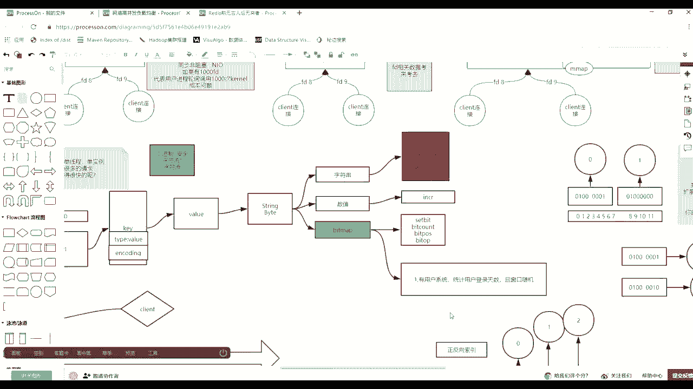

足以来看，各有思路的啊，各有思路的，你只需要算一个成本，这里没有一个固定的一个数值，有两个固定的数值，第一个固定的数值就是1年有365天或者366天，对不对，我大方一点儿，1年400天。

如果每一天对应一个二进制位，就是从左向右，第一个二进制位代表第一天，第二个位置，二进制位代表第二天，也就是四个400个二进制位，400÷8是50个字节。

用50个字节可以最大记录一个用户全年365天的登录状态，比如比如说这么做，set data，肖恩，我就说，那么我这个人就是key，然后给我的，加上一个一，这什么意思，回车这什么意思，我第二天登录一次。

因为你一定没背20位偏向中心块，对不对，所以是我第二天登录了，然后我过两天之后，如果我的用户再产生登录，你就看哪天了，第八天就下周为七打一个一，我第365天登录的时候要做什么，364打一个一，对不对。

打一个一，我这1年是不是就是第二天，第八天，第365天登录了，只有三笔登录，顶天46个字节，顶天是最浪费的，如果天天登录的话，是不是也是四个字，也是40 46个字节，你就算你你的电商当中有多少个用户。

无所谓了，就用户了，每个用户是bb一路这个数据能登了。

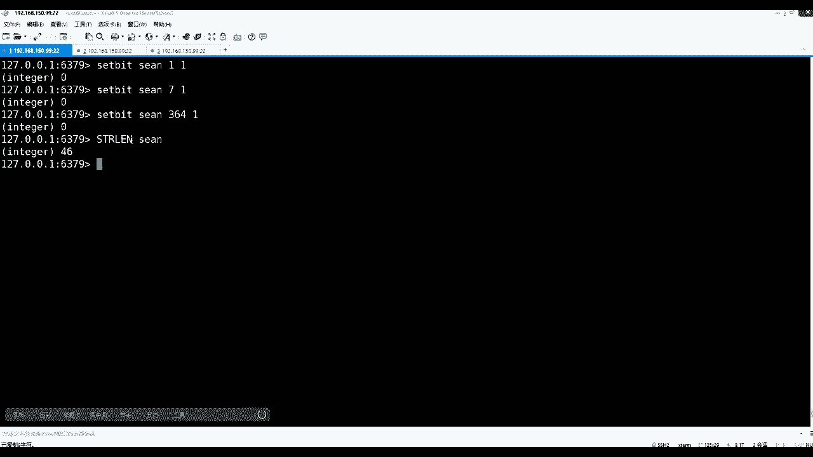

那么最终问题是老板会给出随机窗口。

随机有什么意思，这个任务后最后最后的这几天有没有登录啊，一个字节是八天的，是不是八个人是八天的，那么它的用户最后两周有没有登录，你只需要取什么就可以了，b的count肖恩，然后给出此案的361共是天使。

这么多要除以八个人，那就是负-2和-1，是不是最后两个字节两个字就是最后16天，对不对，是不是动了一次，是不是按照字节的逆向索引，这是统计用户的登录，对不对啊。

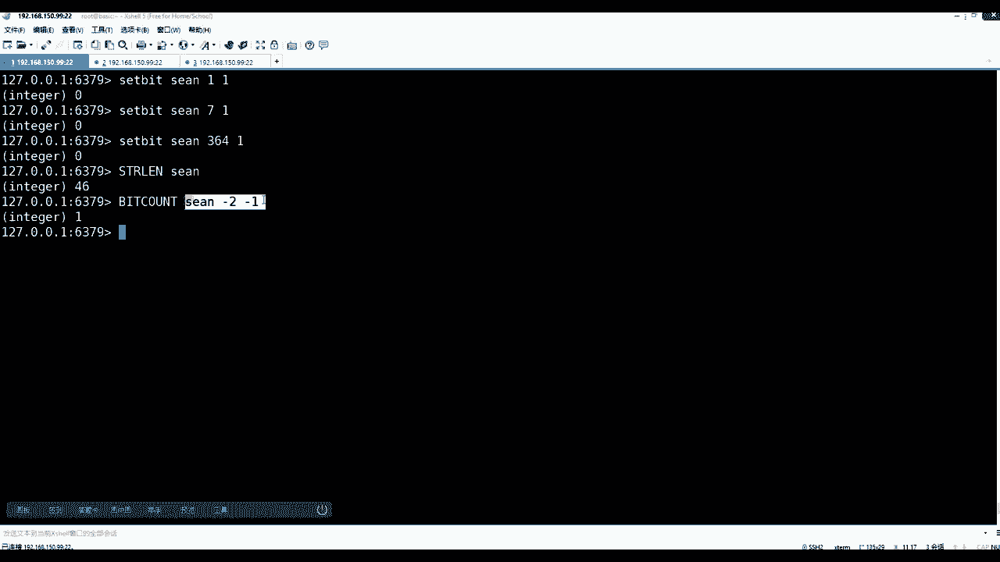

这是第一个场景，大概就是四五楼能看懂吧。

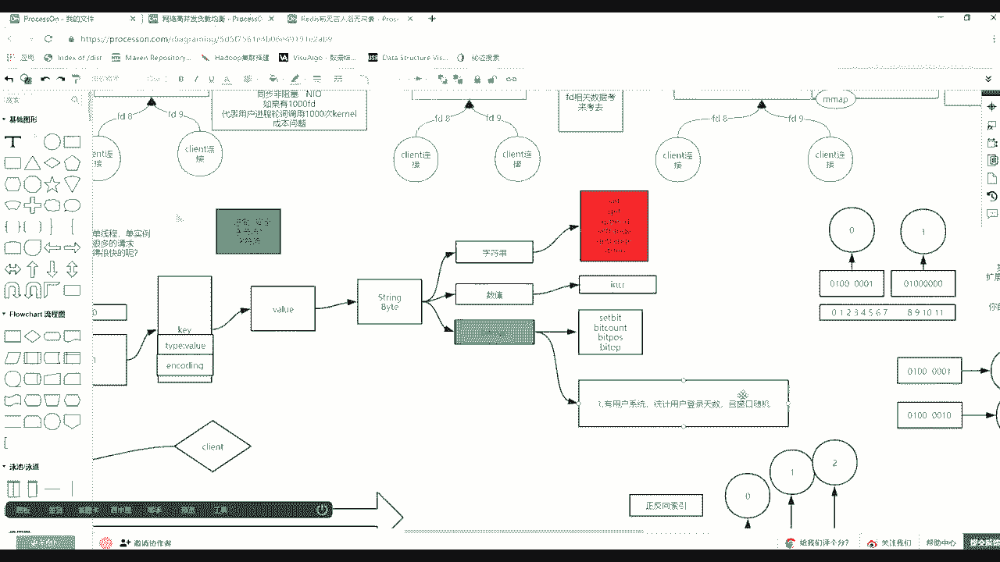

我把这个这个笔记给你做一下，其实做的就是set beat。

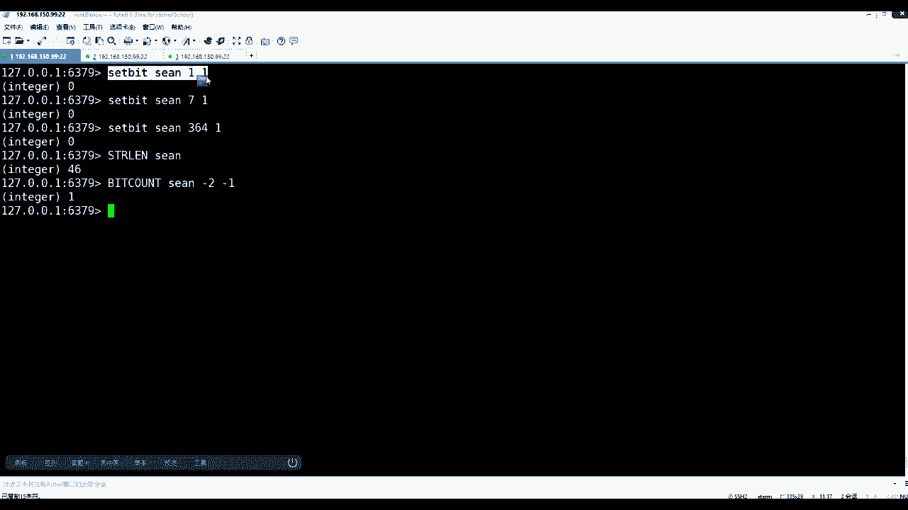

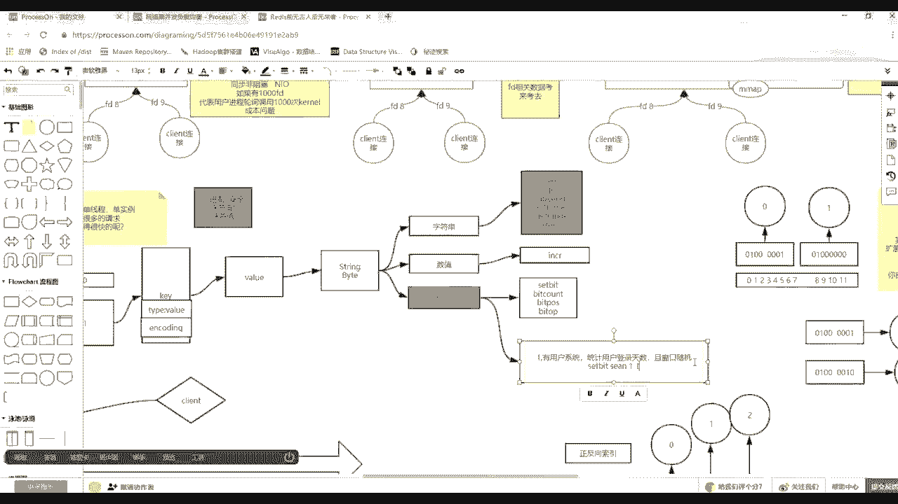

什么beat。

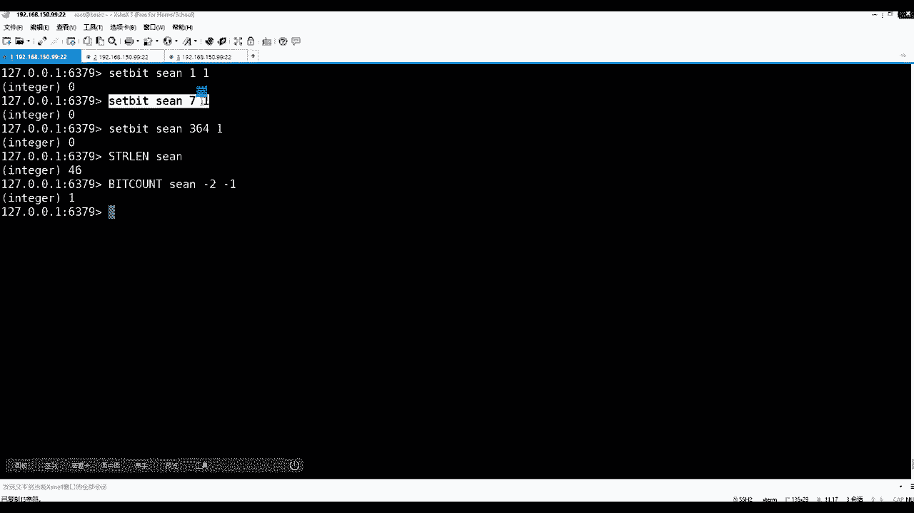

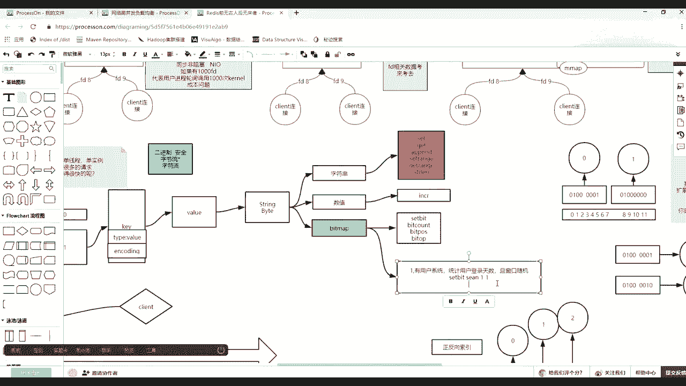

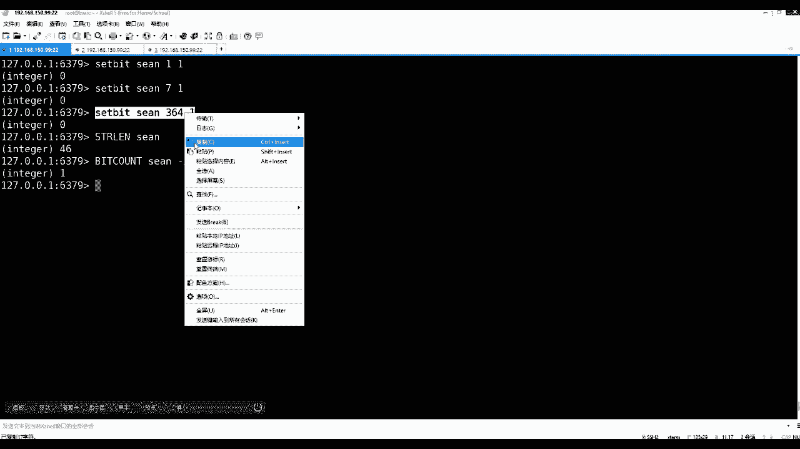

这就是所作为图。

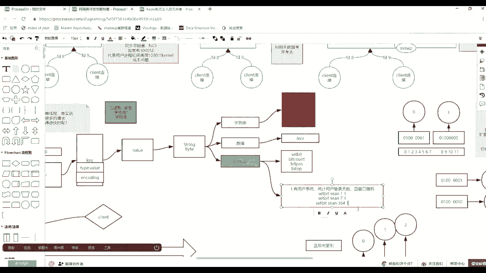

然后你学过你就去思考一些事情，比如劣势存储啊。

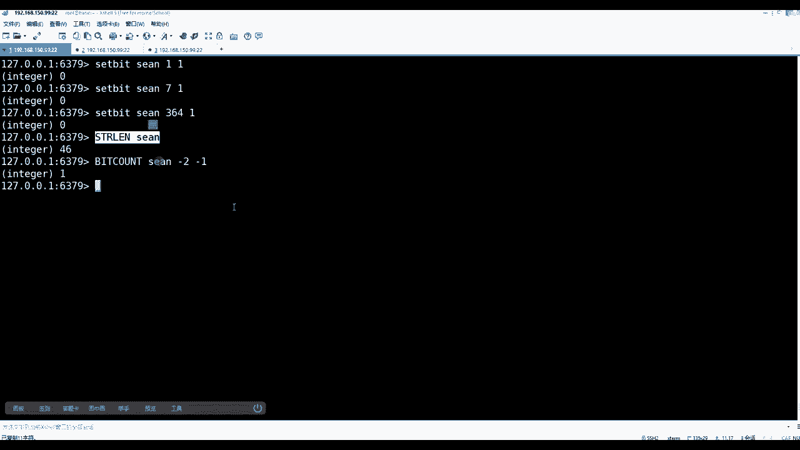

或者什么大量的数据，然后我想猎手就有的有的有的行，有数据好像没数据。

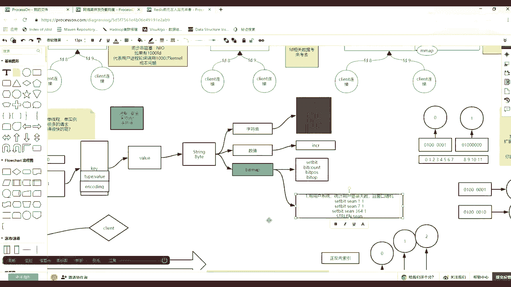

是不是你可以挂一个索引来标识这个用户的某些好友，数据好像没数据。

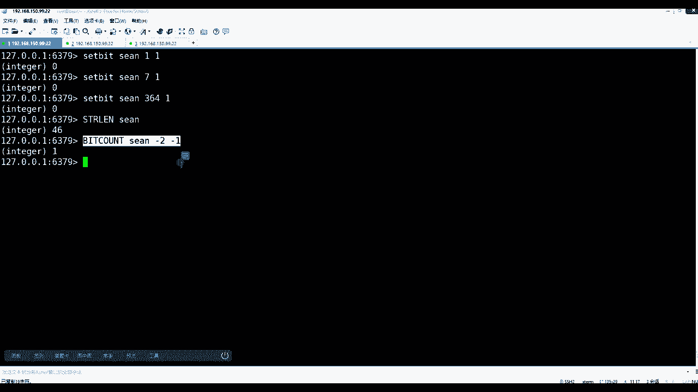

然后是不是可以外挂一个位，除了一看就是为了一个状态，一个缩影，按这位的缩影了，对不对，然后其实内存消耗很小，好吧，这是第一个需求展现出来的，这个矩阵是一个什么矩阵啊。

上面这个矩阵和下面矩阵是分别长什么样的，上面矩阵是比如说肖恩，然后这里面如果二进制的话，这是key value的话，比如说0101010101，这是在不同的天出现，对不对对不对，然后比如说有消音了。

然后库里边比如还有这个js，然后0101011111，这是它的不同的登录这种这种场景，然后上边对应的是日期上面比如说的这个0102，然后零三第三天，然后零四，把这个最好向右，我就不画全了好吧。

其实你整个公司无论你怎么去设计，就这么点数据，要么就是用户id为key，先为v，要么就是什么，这个时候其实整个内存消耗你都可以算算上边，如果如果上边每一个用户，每个用户是多大的，每用户46字节。

每用户是刚才看是46字节，然后乘以什么呀，用户数和用户数，那么46个字节乘以乘以乘以乘以千万个，十百千万，10万百万千万只拿1000万，大概说1000万的话，就是46乘以它就是最终等于46，46。

然后后面加上，个十百千万十万百万，是不是这样一个，然后这是1k然后兆十兆百兆就知道不是，这是1k然后怎么算1k 10 k8 k照，然后40兆是应该四五十兆的，这是三个三位是1k对不对。

三位是1k然后这是1k了，这是1k 10 k8 k然后兆十兆百兆，400多兆，400多大，400多兆可以放任你京东所有人就是1000万人的全年的登录的明信，然后如果你觉得大的话。

是不是可以把这个用户拿出来，使这个一半的用户放到一个release，另外一个rise的另外一台存，另外一半一半的用户是不是可以单独去统计它们了，是不是可以分开了，能给我吧，下回自个儿再算算，基本上。

但是这东西一定会小于什么呀，第一小于买sql，第二速度快过买sl，因为这个20多倍的计算。

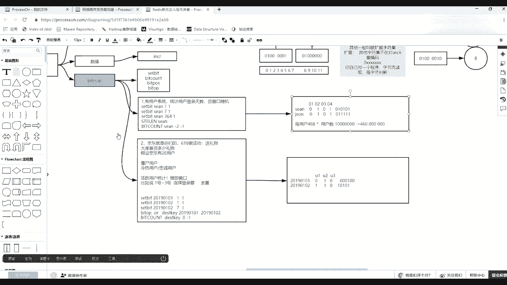