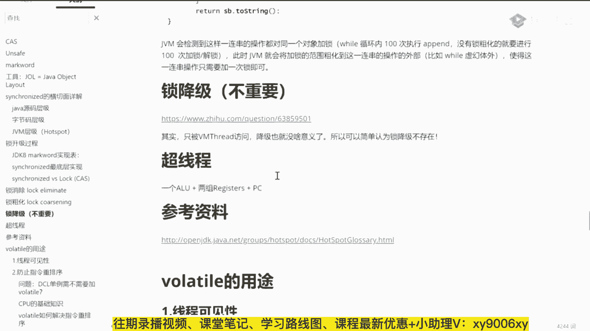
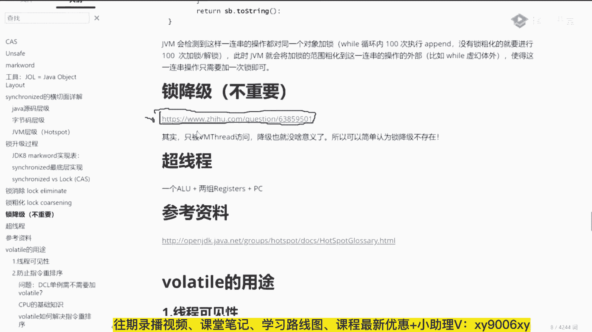
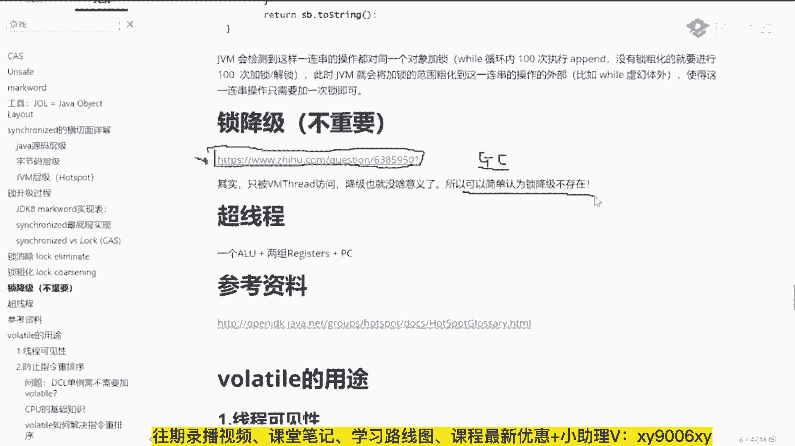
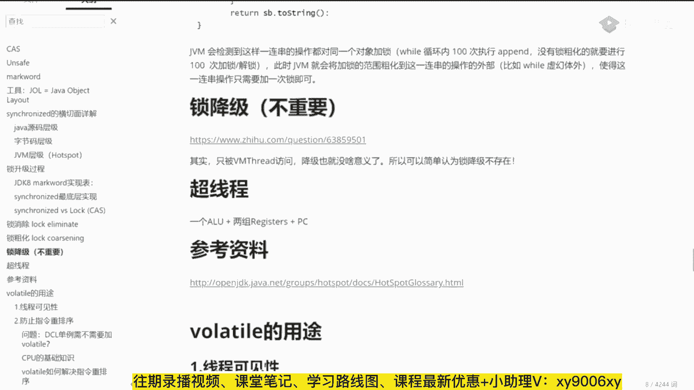
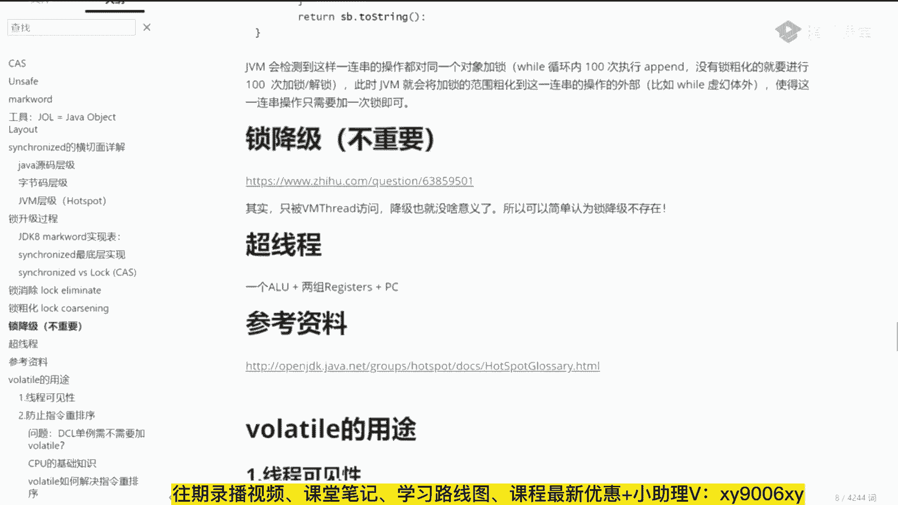
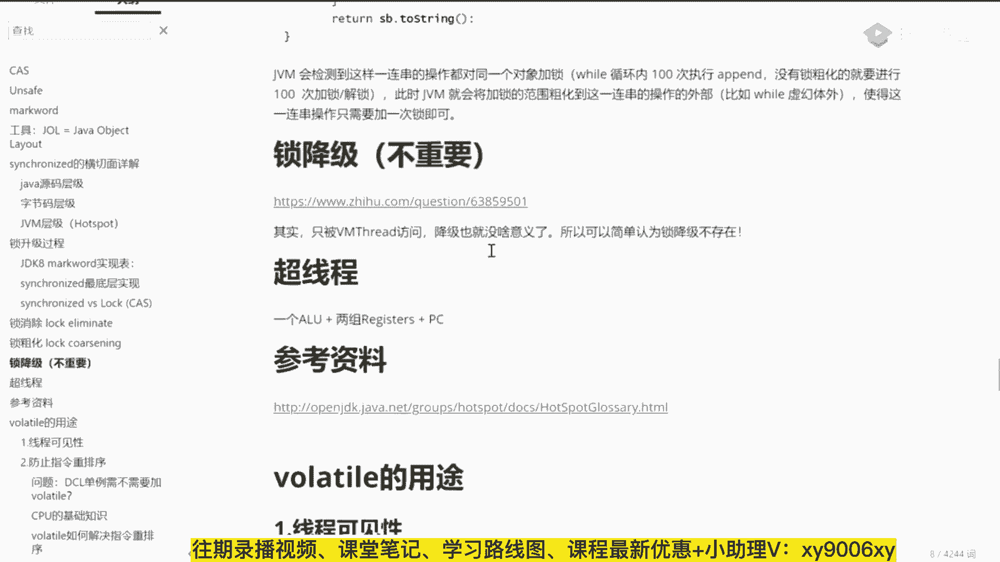
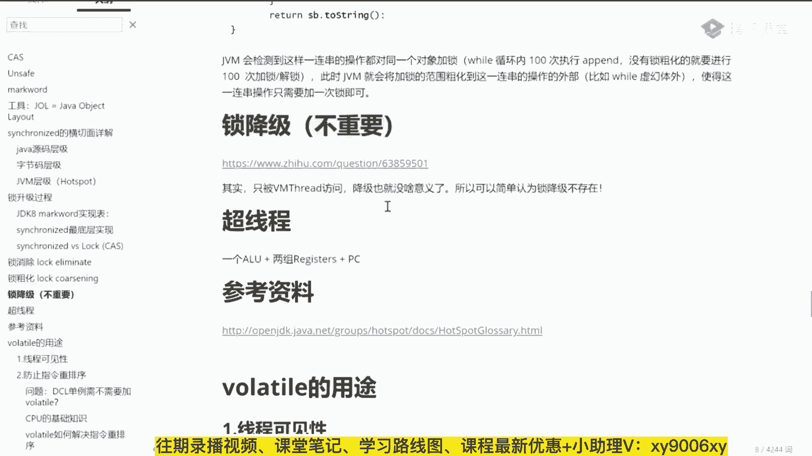

# 系列 3：P9：【多线程】锁降级过程 - 马士兵_马小雨 - BV1zh411H79h

和大家听我说啊，之前所要及这件事不重要。

可以认为不存在就行了，呃我给大家一个链接。

如果对缩小锁定你感兴趣了，直接去看这篇链接就可以锁降级呢只是发生在gc的时候的一个状态。

但是那个状态你读一下就知道。

其实降级是没有任何意义的，所以简单的可以认为所降级是不存在的。

所以如果有别人问你说你聊不来的所降级。

你就跟他讲，所降级呢在某些特定情况下会发生。

但是这种特定情况下，就是在gc的时候，这把锁已经不被其他线程任何任何人锁锁锁锁锁定了。

好，这个锁可以降级。

可是你想一下都开始gc了，这哥，们呢没有任何人，其他东西。

没有任何其他的，除了那个gc线程访问他之外，没有任何其他线程去访问他了，那你见降低还有什么意义。

没有意义了。