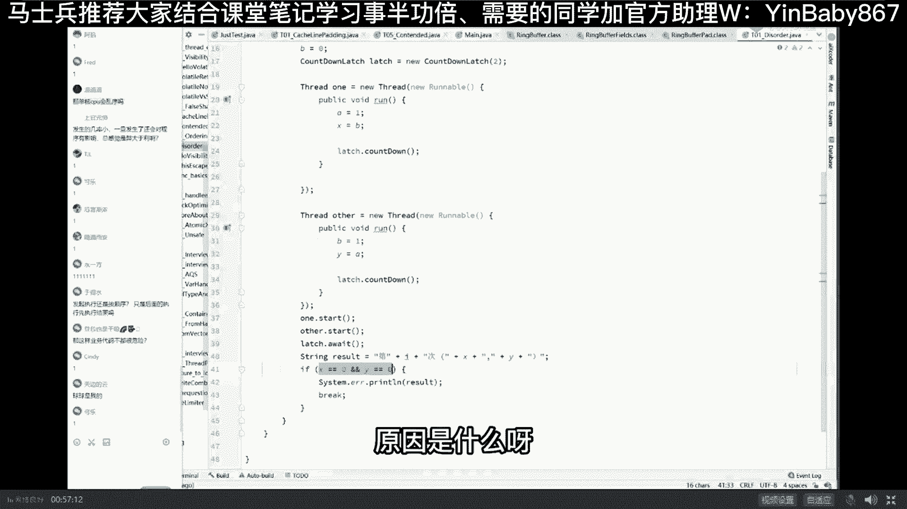
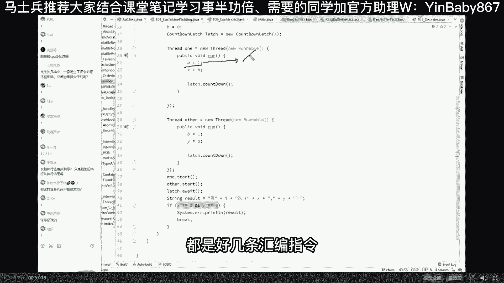
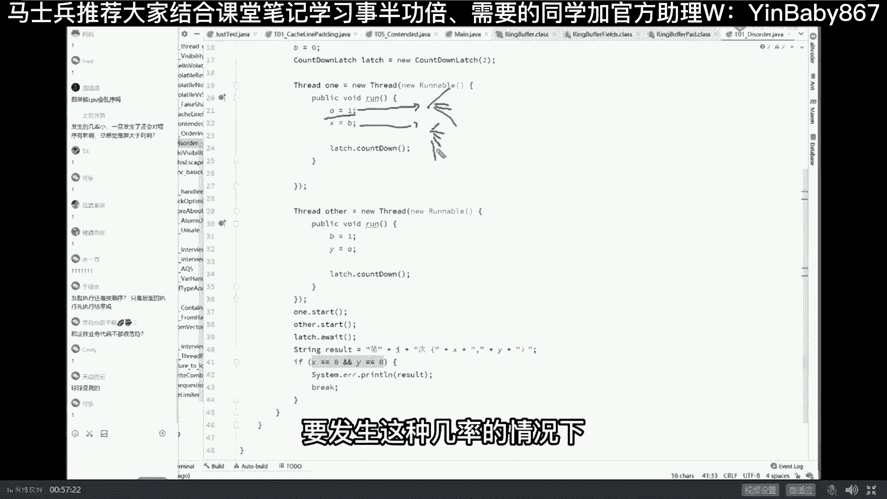
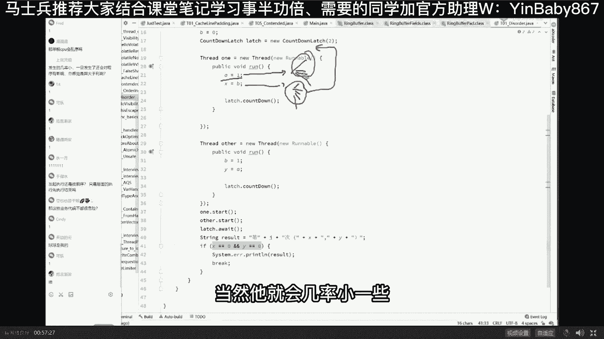
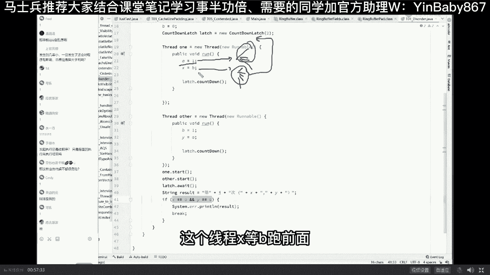
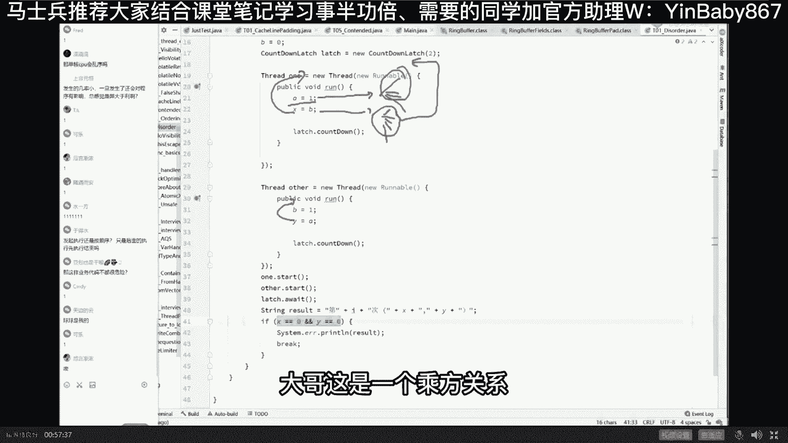
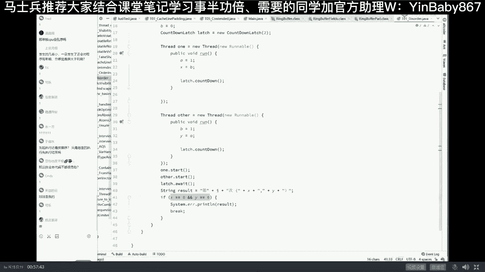
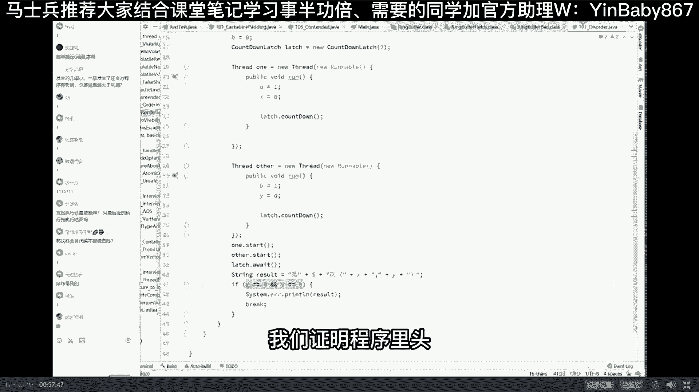

# 系列 5：P11：11、为什么乱序？ - 马士兵学堂 - BV1E34y1w773

简单说就是为了提高效率，有同学说what乱序执行居然是为了提高效率，没错，举个最简单的例子，大家都知道CPU的嗯，严格来讲应该叫CPU内部的寄存器的速度，寄存器的速度啊，访问寄存器的速度。

就是我们CPU计算单元访问寄存器的速度，要比计算单元访问内存的速度要快得多得多，快多少呢，大概是100比一，比如寄存器的速度是内存速度的100倍，那么假如说我们有两条指令，第一条指令啊。

它是跑到内存里面去读数据，但是由于我的ALU我的计算单元访问，我们计算这个这个这个内存的速度呢，它非常非常的慢啊，我发一条指令过去，然后等着这个内存给我返回回来，数据的时候大概得得有99个时间周期。

那如果后面还有一条指令，这条指令的话呢，它是不需要访问内存的，它只需要在本地的寄存器做计算，比如说对某个寄存器ENX加了一个班好，我就直接在本地做一个计算就可以，我有必要等着这99个时钟周期返回吗。

如果前后的指令没有依赖关系的话，完全有可能是在第一条指令执行的过程中，第二条指令优先执行完，这样的话效率反而是最高的，如果你还听不懂，我给你举个生活中的例子，比如说你要烧开水泡茶，正常的情况下。

你按照顺序执行，是洗水壶，烧开水，烧上洗，洗大壶，洗茶杯，拿茶叶泡茶，但是完完全全可以并行执行，怎么执行呢，洗水洗完水壶之后，烧开水的过程之中，我就直接洗茶壶，洗茶杯，等烧完开水之后，拿茶叶泡茶。

好能get到这一点的同学，老师扣个一，人是有灌鸡汤，有点学不动，灌鸡汤不用我灌，找那个我们的看看看我们最近就业的信息，你不就直接给关了吗，学的动的都已经薪水翻了倍了，它不香吗，嗯好我讲到这儿了。

总有同学也会有疑问，回答同学们的一点点的疑问，哎，几分钟EDD问呢，单核CPU会乱序吗，废话说的就是单核CPU，这跟多核有半毛钱关系吗，单核CPU现在执行的是两条指令的歌，后面这条指令有可能跑前面去。

发生几率小，一旦发生了还会对程序有影响，总感觉弊大于利，上官元恒这里省了99个等待的时间，你居然说弊大于利，你是脑袋进水了吗，发生几率小，发生的几率非常高，我们这个程序为什么发生的几率小啊。

难道你理解理解不了吗，我讲到这还能跟上吗，我下面给你讲，为什么这个程序发生的几率比较小，底层发生的几率超级高，这个程序是一个证明程序，它发生的几率相对小的原因是什么呀。

每一句话翻译到汇编都是好几条汇编指令。

这句话也是要发生这种几率的情况下。

得把这好几条跑到这好几条前面去，当然它就会几率小一些。

与此同时，这两个线程同时发生，这个线程X等于B跑。

前面这个线程Y等于A也得也得跑前面大哥。

这是一个成方关系。

学过概率，这里的发生几率小，指的是那个我们证明程序里头。

并不是只说的底层的发生概率小，这个是必然发生的，那这样业务代码不都很危险，你写的业务代码很危险，你要是理解了，你写业务代码就不会威胁发起执行，还是按照顺序后面执行，先执行，结束，没看懂，请说人话好听。

我说我讲到这呢，很多同学应该能理解了，为什么有可能会产生乱序呢，就是为了提高效率啊，就是为了在前面等待的时候好，后面的呢可以留下来执行，那现在现现在问题就来了，就说什么情况下我们讨论一下啊。

就说什么情况下能够提，能够呃呃乱乱序来执行呢。