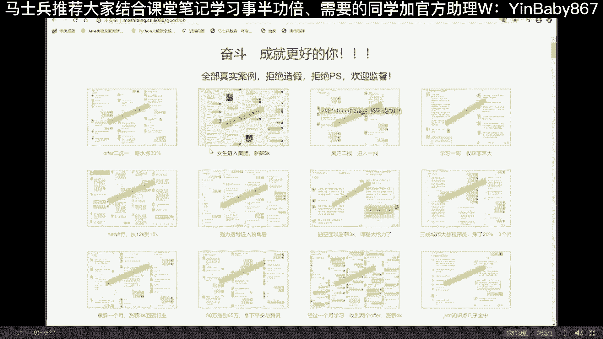
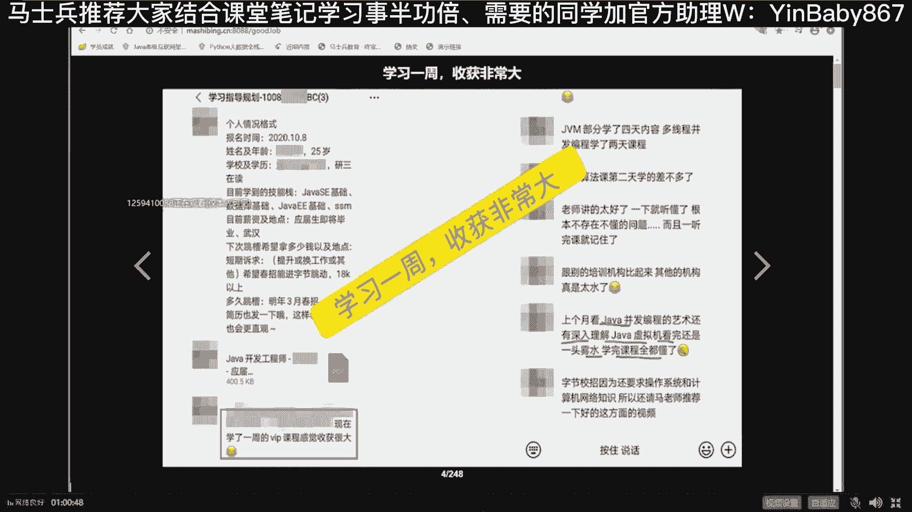
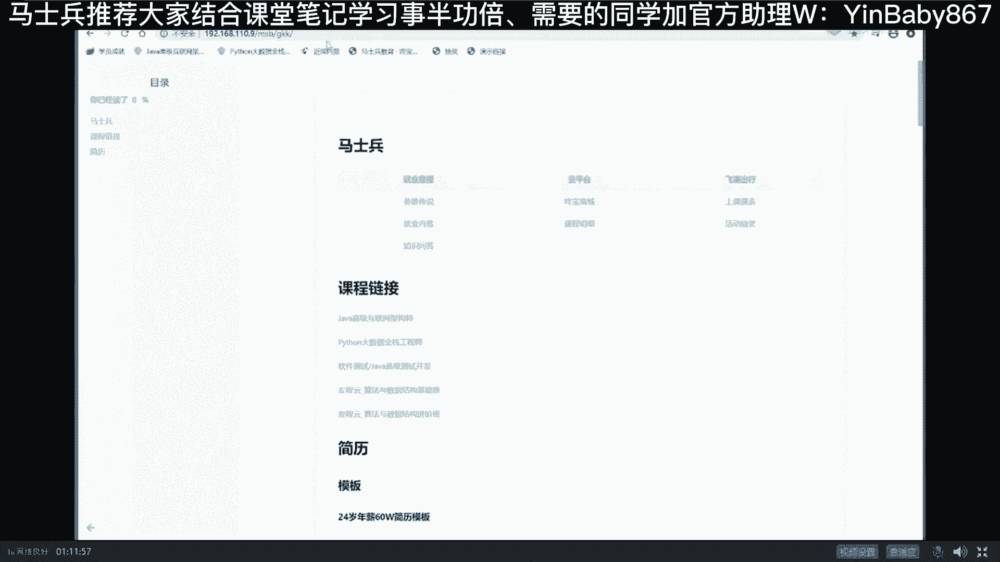
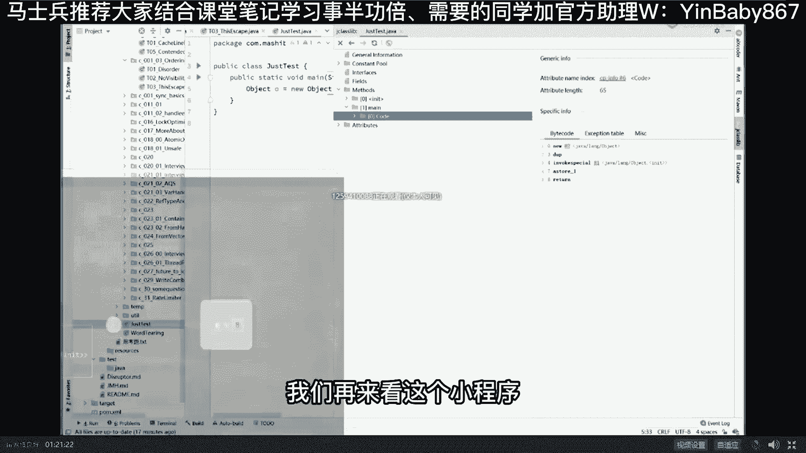
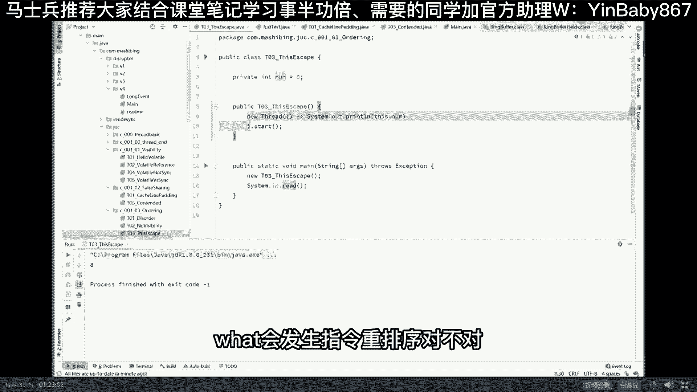

# 系列 5：P12：12、乱序存在的条件 - 马士兵学堂 - BV1E34y1w773

什么情况下好听，我说这种情况呢叫做一条原则，这个原则呢是这样的，前后的指令一定不存在依赖关系，你不能说前面指令是X等于一，后面X加加存在依赖关系，绝对不可能换顺序，但是最终的顶顶级的原则。

这条原则叫做as if serial，来这个单词应该都见过，This is zero，看上去像序列化的好，请给我记住这条原则，这条原则叫做不影响单线程的最终一致性，什么意思，X等于一，Y等于A嗯。

好就这么说吧，无所谓啊，这两条指令先执行后执行，在我这个县城里面，影响最后XY的结果吗，ab的结果不影响啊，这俩这哥俩谁限制性都可以好，这就是乱序的最根本的条件，就是只要是不影响单线程的最终一致性。

那么你就可以做到整个程序看上去像序列化，实际当中有可能是乱序的，好了，这个东西叫做as if serial，看上去像序列化的，但实际当中是乱序的，只要是单线程的最终一致性不受影响，没关系。

里边的顺序随便换，这单词见过对吧，那个最近有同学说我们讲课的问题啊，嗯好像是最近啊。

A1周VIP啊，嗯上了一周课，就上了一周的课，上个月看java并发编程的艺术，还有深深入理解java虚拟机，完全一头雾水啊，学完课程全都懂了，对你们自己看看，基本上听不懂啊，嗯嗯咋说呢。

你们如果看到这个单词a serial，估计很多同学也理解不了到底什么意思，现在大家伙应该都能理解了，就是很简单，因为我们CPU需要提高效率，所以他最终有可能乱序执行，乱序的最终的原则就是。

只要不影响单线程的最终一致性，可是他现在影响的是，不影响的是单线程的最终一致性，但是我想问你的是，如果多线程会不会出问题啊，多线程会不会出问题，当然会啊，你看我给你举的这个例子不就出问题吗，X等于零。

Y等于零，是你期望想得到结果吗，未必，但是它就出现了，当然这种问题呢是存在于面试里头，我再给你看一个问题，这个问题看大家能不能找得出来，当你理解了乱序这件事之后，我们来看这个问题，来看这里来。

我先跟大家说啊，嗯这个问题是出自于一本书，这本书叫ja and currency practice，那本书你从头到尾看，你也看不懂，听老师讲你就能听懂了，这个小程序是降子底，小程序呢有两个值，第一个类。

第一个值是布尔类型的ready，第二个值是number，ready等于false number，它的一个初始初始的默认值就是零是吧，我们有一个线程reader thread。

它执行的时候是我not already，只要你这个还没有准备好的时候，Not already thread yield，我的线程就不执行，继续下一次循环，什么时候你好了，我就把那个给你打印出来好。

我们的主线程干了一件事，让这个线程启动，把number给它设好，number等42诶，设好了，设到number里，然后把ready等于true，那我们这个值就已经打印出来了，最后呢我们等这个线程结束好。

我想问你是不是我们打印的这个number值，一定就是期望我们这个42期望的是42，是这样的吗，另外仔细阅读这个小程序，给我挑出来这个程序中的两大毛病，两个大毛病，给大家30秒时间，读一下啊。

这小程序有两个大毛病，30秒钟，看警方问了个问题啊，说那个其他高级语言也会有类似情况吗，听我说所有语言都一样，今天我讲的内容跟语言没有半毛钱关系，我现在讲很多东西都跟语言没关系，我讲了rust语言。

讲过go语言，讲了N多N多的语言，我们的课程包里都包含这些语言，但是你理解了一门，其他门呢理解起来就非常的简单，罗哥哥说join join是个什么鬼，这小程序已执行结果是对的，你执行1万遍。

这个结果都有可能是对的，单手我直接告诉你啊，就变成如果按变式来讲，它有两大毛病，米兰的老铁匠不是ta run吗，老铁匠同学呢是一个零基础的小伙伴啊，你非常的可爱，其实你比较面的时候最好不要说话。

因为你说话容易让别人知道你比较面，先从我们零基础的课开始慢慢跟，好不好，老铁匠，95kg嗯好我们说问题出在哪，这里面有两大问题，第一大问题是呃，这个线程很可能结束不了，什么意思呢。

就这个线程呢有可能结束不了，这里面说的是线程的可见性问题，可见性说的什么，这里有一个ready吗，ready是在我们内存里false，然后我的主线程main线程，我把这个false给改成了。

我把这个RAR给改成了true，它是改的哪部分内容，实际上改的是他本地的缓存，改的是这部分，把自己缓存的这个给改成了true，所以如果这哥俩不做同步的话，而另外一个线程我们的reader thread。

他读的是自己本地缓存的这个R它是false好，如果这哥仨之间不做同步，我告诉你这个县城有可能都不结束，当然由于线程可见性，它底层的内容呢牵扯的比较多啊，MES是一个主动机制，它就有可能给你做了同步了。

像那个volatile是一个被动机制啊，就是lock指令帮你做的，这个呢今天就不聊就不聊了，反正总而言之，如果你想让这个程序写的比较严谨的话，这里要加一个关键词叫volatile，还有这是第一个问题。

如果这个问题没听懂，放一边，我们讲有序性，主要聊的是第二个问题，这个问题是什么呢，这个问题就在于同学们，你们想一下，如果说这两句话发生了顺序，再看一遍，仔细分析一下，如果这两句话发生了，换了换了顺序。

ready等true等于42放到前面去了，我们正常的情况下不都是这么写吗，我先把这number改成42，然后再把ready设为true，正常应该就打印42了，不一定的。

如果ready等true在我们执行的时候被放到了前面，跑前面去了，那么这时候ready就先设为true，也就是说这块就先结束了，打印的这个还没有来得及来得及设计，42的时候，打印出来就是零，好。

能get到这一点的同学老师扣个一，所以这个程序不单单是有那个可见性问题，还有还有什么有序性问题好吧，这种情况有办法解决吗，当然有，Sure，必须有，这种情况解决的最优雅的方式，你们可能都想不到。

叫做atomic preference，当然还有其他的解决方案，比方说加synchronized，加入entry lock，这些都可以啊，但是最优雅的方案其实是这个atomic reference。

把这两个值设为我们一个引用类型的，一个一个一个成员变量，然后呢设好了之后，统一性设好之后再开始执行啊，这个就不展开说了，我们继续说有序性的问题啊，如果说这个面试题还算是相对简单的话。

那么下面这道面试题就比较难了，看这道题啊，我们来看这道题，这道题我得给他恢复一下原型好，大家看这里啊，New thread，This number，好看看这个小程序哎这小程序特别好玩。

小程序呢就是我我有一个类，这个类里面有成员变量等于八，然后我构造这个构构构造，我们写我们构造方法的时候，直接new了一个thread让他启动，就是说构造构造完成之后呢，我就new了一个thread。

让他启动打印我们这number的值，当然这个打印呢你其实可以理解为，我就是开始使用这个number的值啊，比方说他让他加加呃，让他跟其他的数值做计算，那么我想问你的是这个小程序有没有毛病，这块比较难。

我先说答案，这个是著名的this1出问题，这个是绝对有毛病的，有毛病，有同学说我这么简单的程序居然也有毛病，没错是的，你说的很对，为什么会有毛病呢，好好听我说毛病出在哪，要理解这个东西。

有毛病这件事你得理解另外一个东西好，现在还能跟上吗，同学们，我现在有点把控不好，你们每个人的这种对这种这种这种基础啊，还有同学跟不上还能跟上吗，没问题吧，可以是可以，我们继续啊，还行。

OK这个小程序怎么会有毛病，他毛病出在哪呢，好仔细听我说，为了讲清楚这个问题，我们必须得弄明白一件事，就是我们new一个对象的时候，就是new一个对象，new谁呢，new这个T03。

this escape啊，new这个对象的时候，你有一个对象的时候，他背后到底发生了什么，为了弄明白这件事，我们写了一个特别复杂的小程序，这个小程序太复杂了，看大家能不能读懂好，这个小程序，就一句话。

object o等于new object，这个世界上最复杂的程序，美团曾经围围围绕这句话，提出了九个系列性的问题，答出来，你的年薪就大概在50万左右了，好听，我说我们先说其中一个比较简单的这句话呢。

它背后到底执行了什么操作，什么意思，大家都知道啊，这个我们高级语言，这是我们的高级语言，他翻译翻译翻译总要翻译成为第一级语言，翻译成汇编，java呢又是一个java虚拟机。

JVM虚拟机就把它当成一台虚拟机器，它有它自己的汇编语言，这个汇编语言就是我们的二进制字节码，叫bite code，好下面我们就来看一眼，当这句话执行的时候，它会翻译成为多少句二进制的字节码。

嗯distance说算了，还是去学C加加吗，现在去学C加加的全是傻帽，多说两句吧，有一门语言，那叫Rest，如果你有希望有机会的话，我希望你好好学学，当然我们课程里就已经包含了啊。

Rust rust rust rust rust rust。

rust在哪来着，好像就在我们课程包里啊。

嗯rust语言呃。

这个呢我讲过了，大家听我说啊，嗯可以这么说，现在世界上有很多很多的语言都在抢呃，有一门语言的这种市场占有率，这门可怜的语言就是C加加，好多好多的语言都在抢它的市场占有率，那么有谁呢。

有著名的go on是吧，有最新的Rest，当然还有和rust其他类似的各种各样的语言，原来还有java是吧，哈尔听我说C加加呢，由于它太复杂，当然一时半会儿呢，它的市场占有率也不会被占完，原因是什么。

他以前开发的很多类库太多了，大家用的顺手了，但是我觉得大概未来几十年内，他慢慢的不能说淡出历史舞台，但是他以他的占有率会依然会缓慢的下降，毛病出在哪儿，毛病出在C加加比较复杂，他要手工管理内存。

当然它比较好，它效率比较高，效率比较高呃，他要手工管理内存，但是如果有一门语言，如果有一门语言是什么样的呢，不需要手工管理内存，执行效率跟CC加加一样高啊，跟汇编差不多，那么你说它的市场会不会被抢到呢。

有人长得跟你一样漂亮，还比较便宜，还比较能干，你说你的市场会不会被侵占，好，这门语言叫rust，你们一定要抬头看世界啊，别闷着头往前冲，傻了吧唧的那个路都已经走歪了，还还在闷着头往前冲呢，别这样啊。

好了不废话了，我们来看这个啊，就是你跟着老师走呢，你就永远站在世界的最前沿，it界的最前沿，好大家看这里啊，包括我们讲的service mesh，很多人都没有讲呢，我们都已经开始落地了，就是总而言之。

这么多大厂的一线大厂的老师肯定不能便宜了，他们是吧，得让他们多多的好好的呵呵，压榨他们的价值，都让他们讲课，嗯你呢正好就得到了最好的训练，好看这里object o等于new object呃。

这句话呢它翻译成字节码会有好几条指令，View should bite code with class library，这是一个小的插件，直接拿来用就可以好，我们找到methods两个方法。

一个是构造方法，一个是main方法，main方法点code我们就得到了哦，原来在这里它有这么多条指令构成，好这么多条，看一眼，一共有五条指令构成，12345，第一条指令叫new。

第二条指令叫duplicate，第三条那叫invoke special，第四个叫a store，第五叫return，好，为了让大家能理解这五句话，我专门做了一个，PPT这五句话呢不太容易理解啊。

你认真听呃，这个呢跟我在JVM课里讲过那个class漏到内存，有一个中间态跟这个差不多有点类似，看大家看这里啊，嗯我们假设有这么一个类class t，它有成员变量int m等于8T，小T等于6T。

当我们执行这句话的时候，刚才我们看到了它有五条汇编指令构成，第一条叫new，第二条指令叫duplicate，我们先把它略过这块，我要给你讲的话比较复杂，我得给你讲那个呃县城本地站啊，栈顶指针啊。

怎么压榨，怎么出战，太复杂，扔扔一边，而且跟咱们现在讲的乱序没关系，先扔一边好，接下来invoke special调用特殊的方法，invoke调用special，特殊调用特殊的方法，什么方法呀。

initialize调用它的构造方法好，下面这条叫door store的，意思叫做，把这个小的局部变量，和我们new出来的对象建立关联，它指向一个new出来的对象，所以当我们执行这句话的时候。

return先不管他一共执行了三条最主要的指令，第一条叫new new是什么意思，申请空间，把这块内存申请下来，相当于C加加里面的new，相当于C语言里面的memory allocation。

好第二条呢叫做调用构造方法，第三条叫建立关联，那么这几条指令执行的过程是什么样子的，仔细看，当我们执行到第一条指令new的时候，它真正的会在内存里面申请出一块空间来，这块空间就是我们new出来的T对象。

当然就是一个T对象里面，由于他的有一个成员变量小M的歌，所以这个它里面一定要有一个小M的好，这个小M的值是几呢，在java语言里面，当我们new一个对象来的时候，里面的成员变量都有一个默认值。

这个默认值int类型的默认值是零，很多同学可能没想明白，我说老师他为什么有一个默认值呀，他没有值不行吗，我反正申请了这块内存，这块内存原来装的什么值就值呗，上一个程序留下来的，我就直接拿来用呗。

反正我新的程序要对它赋值，我干嘛，我我我我没有必要说，我再去自己去给他初始化一遍啊，没有这个必要啊，这块讲能听懂吗，尤其是写过C语言的人，写过C加加语言的人，当我们申请完一块内存，这里面有个值。

它的值是什么，这块能确定吗，如果是C和C加加的话，这个值叫做上一个语言留在这里的上一条语句，上一个程序留在这里的是几，就是几，说不定正好上一个程序留在这里的是一个password，是我的一条密码。

Very good，太好了，我就把你密码给你破了，有安全问题，OK所以在java里面就干了这么一件事，申请完这块内存之后，马上就对它进行一个默认值的初始化，这个默认值是几呢，零，好这块还能跟上的。

给老师扣一，现在大厂面积的时候，都是从一个简单的问题开始，一直顺着往里面面面看，看你能聊多深，聊多宽，刚原来开始还是聊多深的问题，现在开始都是聊多宽的问题，越来越难了，所以我每次都得给你展开来聊好。

大家看这里再来继续看，当我们执行到这句话的时候，new new对象的时候好，申请完内存里边有一个默认值是零，调用构造方法好，就用到这句话了，这个时候才会把它的值给改成八，他这个八是它的初始的值是吧。

给它附了一个初始值，所以中间有一个从0~8的过程，好零这个状态M等于零的这个状态，这个状态叫半初始化，刚初始化了一半，那最后一句呢叫a store，HISTORE的意思是建立关联，什么叫建立关联。

这个小T指向了我们初始化好的这个对象，我们再来看一遍，当我们new就这么简单，一句话，new一个对象是怎么执行的呢，执行到new的时候，申请内存设默认值好，new执行完了。

接下来执行invoke special，改为初始值八，执行a store建立关联，三三步由三部构成，抽烟喝酒烫头，周老师三大爱好，抽烟喝酒剃头，主要烫头，他就他那头皮就给烫了，好三步构成申请空间。

设默认值建立关联哎，要申请空间啊，这个勾呃调构造方法建立关联好吧，好了我们继续听我说，当我们理解了这句话之后呢。

我们再来看这个小程序，不知道你现在是不是能发现，这个小程序的毛病之所在，来看这小程序，不知道大家能不能发现，这个小程序的毛病之所在，就像关于毛病的隐藏的比较深，我就不卖关子了，直接讲给大家听。

这个呢我们仔细想一下啊，当我们执行到这句话的时候，New t 03this escape，好好听，我说，当我们执行到这里的时候呢，其实我们是有一个隐藏的this变量，当前对象嘛。

然后这个this变量指向谁啊，指向的是调构造方法的时候，这是我们调这个构造方法的时候，一个局部变量类，如果这块你实在理解不了的话，这会应该能理解啊，如果你实在理解不了的话，我稍微给你演示一下啊。

看大家能不能看得到，我们依然看他的那个呃，汇编码，V show bite code，Buy buy buy bubbite code with the class library，找到这个构造方法啊。

Initialize，这是我们的构造方法，看他的code，我们不要看它的code啊，看他的这个呃，Local variable table，局部变量表，大家看这个局部变量表里面是不是有个this啊。

看到了吗，所以说这是我们构造方法里面的一个局部变量，局部变量this好，所以说我们在new这个对象的时候，我们有一个this变量，this变量指向谁呢，指向我们正在new的这个对象。

当前的这个对象this指向它好，既然是这样的话，他new的过程不是有三步构成吗，有印象吗，第一步申请空间，第二步设初始值，这个值为零嘛，是默认值，然后把它改成八，然后呢让this指向它。

所以我们这个线程打印this number的话，我们打印出来是八，但是很不幸的是，我刚才说过，说这个东西呢它是有可能会发生指令重排序的，what会发生指令重排序。

对不对，好在哪会发生呢。