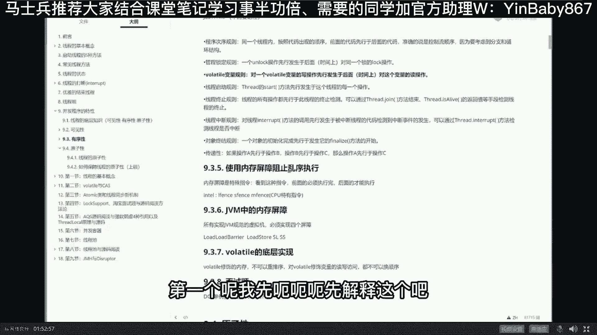

# 系列 5：P13：13、乱序真的会扰乱“并发”吗？ - 马士兵学堂 - BV1E34y1w773

同学们你们想想看，如果这两句发生了重排序，这两句，会发生什么情况，这两句发生重排序会发生什么情况呢，会发生这样的情况，就是当我们呃new出来，然后把它的值设为零，设好了之后呢，我并不是调构造方法。

而是直接先给建立了关联，那这个题指向的就是我们班主任，就像这个this指向的就是这个number是为几为零，而这时候我们启动了线程，线程一启动输出的值是几呢，是零，好能听明白这个问题的同学，老师扣一。

所以在这个小程序里面，这就是著名的this溢出的问题啊，它叫做英文的名字叫this escape，你要你要去读那个多线程专业的书的话，你读到你未必能理解的了，而这种程序还能出问题有问题。

所以一般的情况下我们怎么做呢，这个程序怎么去修改它，听我说啊，一般来说呢，你在你的构造方法里面不要去启动线程，你可以让这个线程初始化，但是不要去启动，看这里你可以这么来写，指尖的旋律，没懂旋律的旋律。

小伙伴，你是那个什么水平啊，你可以定义一个线程threat，然后在这里呢把它给初始化了，注意看，T等于new thread是吧，new完了之后呢，我们在另外一个方法里面再让它启动，带另一方法。

Public void start，叫start t吧。

嗯然后在这里呢调用start，这块大家能看懂吗，new出来之后调用start t这么来写，再说一遍，为了防止this溢出的问题，不要在构造方法里面new线程，有同学说，老师啊，我平时从来不这么干。

但是不耽误你，有的时候很可能调用第三方的类库，不小心这么干了，所以这种问题呢一定要小心，嗯而且呢这种问题可以说出现之后呢，八辈子你见不着错误结果，可是见我见到一次之后，很可能就是灾难灾难性质了，好吧嗯。

加volatile，这跟volatile没有半毛钱关系了，目前目前跟volatile没关系啊，实际可以跑出来这种外形的效果，跑不出来，不好跑，相当的难跑，所以这个东西是存在于面试之中。

而且是特别值钱的面试之中嗯，稍微的巩固一下这个问题，这这这会大家还能跟上吗，我看有同学说跟不上，是不是跟不上，我得问问你的基础在哪里啊，如果基础太弱的话，先跟我们零基础的课去呗。

我要从零开始把你培养成为上海名媛的嗯，我们在座的上海名媛，每个每个都是有一定的经济基础的，是不是嗯，好好OK我们继续，你们继续，当理解了这个问题之后呢，我们真的来看一眼这个美团的问题啊，美团嗯。

这个美团的围绕我刚才不是说了吗，美团啊围绕着这句话，就这句话啊，object o等于new object，就这句话，这哥们大概问了七个问题啊，后来又加了两个，一共是九个问题。

第一个问题要解释一下对象的创建过程，就是半初始化，我刚才给你解释过了，第二个呢就是DSL和VOLA的问题，这个是指令的重排序，我一会儿讲给你听，第三个呢叫对象在内存中的存储布局，分成四部分。

分别是Mark word，Class，Pointer，instance data以及padding，第四个呢叫对象，投者包括什么，包括两个大项，一个叫Mac word，一个叫class pointer。

我可以这么说，大厂的面试题里头关于底层，这哥们大概承担了30%以上的面试题，Mark word和他相关的太多了，务必把它搞清楚，第四个表对象是怎么定位，直接定位还是间接定位，第五个是对象怎么分配。

从站上开始到县城，本地到伊甸去到old区，到底在内存中占多少个字节，压缩不压缩都是16个，第八问，为什么HOSPORT不使用C加加对象来代表，代表java对象，HOSPORT本身是拿C加加写的。

它中间采用了OOP2元模型，而并不是采用的C加加对象，直接代表java，为什么这里面主要涉及到虚函数表的问题，第九问，class的对象是在堆还是在方法区这块，能答对的人也不多。

十个里头有九个基本上都答不对，好不废话了，我们今天呢主要聊这个问题，这个问题呢也是跟重排序有关的，这个问题是什么问题呢，仔细听看这里嗯，嗯我们来读一个小程序啊。

这个小程序看大家能不能读懂这个，这个这个这个小程序嗯，劝退哈哈没有劝退啊，嗯你的目标呢就是个30万，这样的水平就无所谓了，这题懂不懂的，基本上都能达到，你的目标，有30万以上。

大哥这些问题好好跟我学一遍，薪水就让你涨上来了啊，这真不是开玩笑的。

好看这里啊，这个这个小问题是这样子的。

呃，大家看这个小程序，看能不能读懂这个小程序呢，是单利啊，雪狼兽都没工作，从零基础开始玩啊，我们从那个零基础的3月就让他拿了，薪水不太高吧，8K左右，零基础吗，来看这里看这里看这里啊。

我们来看这个小程序啊，这小程序呢实际上是单例模式的一种写法，我一提这个估计好同学又开始头疼了，老大什么叫单例模式呀，单例模式是单例模式，是一种非常魔性的模式，就是他的要求呢非常的简单。

当你设计一个类这个类的对象，大家都知道啊，new new这个类对象可以new好多个吗，person p1等于new一个对象，person p2等于六，一个对象好，有一些是不能new好多个的。

wife w等于new wife，一个对象又new一次又一个对象，我靠你这疯了，不可能的啊，你家wife肯定不同意的好，这时候怎么办呢，wife就想办法把自己设成单例，就是您您老人家。

甭管你有多少个放心，拿到的都是同一个人，这玩意怎么完成啊，这非常简单啊，wife2话不说先new出一个来，作为wife类来说啊，wife作为外服类来说，二话不说，先new一个出来，new一个出来之后呢。

他把自己的构造方法设成私有的private好，别人new不了，他只能我自己new好，那什么时候我想用一下这wife怎么办，专门有一个方法get instance。

把我们new好的对象给他返回回去就可以了，这样的话呢，不管你调用多少次的get instance的方法，不管你得多少次，你拿到的都是同一个wife对象好，这会儿能听懂的，老师扣个一。

这就是最简单的单例模式，单例模式嗯哼，我们重点讲的不是单例模式，单例还是相当简单的，当然呃为了追求单例模式的，比较牛叉一点的写法，人们是那个在这里面呢各种细节锱铢必较好，现在问题来了，有人就说了。

我现在还没有用到这对象呢，您二话不说给我new了，出来，啥意思，这不是占内存空间吗，能不能等我用到的时候再new，哎这简单改一下，当调用get instance方法的时候，先判断，如果等空。

最开始我有这对象，但是我不给它new出来，如果等空把它new出来，如果不等空，说明已经有了，直接拿来用，当然这种写法有问题，问题出在哪，就在于并发上面。

假如要是多个线程都调用这get instance方法，你拿到的绝对不是同一个对象，你会有多个wife，虽然这是你梦寐以求的，可是实际当中是不允许出现的，所以这是不行的，那怎么办，判断一下第一个线程来了。

判断为空暂停，第二个线程来了，判断依然为空啊，没有人new吗，那我就二话不说，new一个，第一个线程继续又new一个，所以这里会有并发访问的问题，数据不一致，因此要求修改，怎么改。

锁good方法上上锁很对。

使用这种写法加synchronized，还有多少同学理解synchronize这个事，可以这么说啊，如果说Mark word担任了30%面试，synchronized估计还要再单身10%。

这俩哥们加起来有40%的面试，都是因为他俩synchronized呢，Synchronized，等会我就不给你展开了啊，Sychronized，它涉及到的知识点非常多，我讲的话没有四个小时，估计讲不透。

Synchronized，首先第一点它锁定某个对象，这里面有个管程的概念，有个monitor的概念，我就不给你展开了，锁定某个对象，持有这把锁，你才能干某些事，这里头是两个概念啊。

第一个是锁本身这个概念被监控的对象，我们一般称之为monitor，这里监控的是谁，监控的是this，准确说监控的是this，Sorry，这不是this static，监控的是class对象。

零四的class对象，准确的说是这个对象上面的Mark word，一会看时间吗，有时间我给你展开来讲讲，没时间就算了，总而言之，synchronized所代表的含义是，只有一个线程能执行整个方法。

而且作为一个原子不可不能被打断，这个很重要，这就是并发编程第三大特性，原子性加上了synchronized的代码之后，这段代码叫不可以被打断，它具备原子性，同时也具备可见性，好我们先不聊这个问题。

总而言之，言而总之，我上了synchronized，上了锁之后，下面的这一大段不可以被打断，一个线程执行完另外一个线程才可以执行，所以绝对放心，我只要有一个线程把它给弄出来了。

那么另外一个线程再来访问的时候，他一定不为空，那这就可以保证了，不过很不幸的是，那有的人又继续的吹毛求疵，说大哥，您的锁的力度太粗了嗯，多台服务器叫分布式锁，锁的力度太粗了。

呃我看有同学说那个嗯多台服务器是吧，多台服务器的那个叫分布式锁，分布式锁的话呢，很多很多的讲讲讲的讲的太多了。

我们课程里。

在这里来自于阿里的曹老师给大家讲了。

分布式锁，分布所实现C它用的特别多。

大概分锁我看讲了多少节课呃，这是分布式事务，这是分布式分门锁。

大概呃黄老师讲的应该是两节课左右啊，各种各样的实现，那是分布式锁啊。

那个是另外的概念，我们现在讲的是单机，你先把单机弄明白了，再聊分布式嗯，我们刚才说了啊，又有人挑毛病了，这毛病什么叫做力度太粗，就是您这锁啊太粗了，别人承受不了怎么办，什么意思，就是我不能被打断的。

原子性的这段代码代码太多了，比如说这有一些业务逻辑，从数据库里读一个数据显示出来，其实这部分可以不上锁的，可以不放在我们原则性里面的，所以你能不能把这个力度给我改细点。

这个事当然也很简单，我相信很多同学应该都知道，就这么玩吗，来看看我们把这个代码业务代码给它略过去，先判断in since等于空，如果它等于空，我们再上锁上锁，Synchronized major。

零五点class static的吗，嗯上完锁new对象搞定好，15秒读一下这代码，想想看，并发情况下拿到的，是不是能够保证只有一个对象可以吗，看气问了个，为啥要sleep11呢。

sleep不sleep关系并不大，我主要是让他sleep之后，我做实验的时候能让他快速的发现这个问题啊，就是为了fail fast，Fail，这个也不行啊，原因是什么呀，同学们，你们想一下嘛。

一个线程来了，判断哥们儿，你是等空吗，等空好，第一个线程暂停，第二个线程来了，哥们儿，你是不是依然为空哎，依然为空，因为第一个线程还没有new呢，所以第二个线程继续往下运行，它怎么运行呢。

锁定对象上锁new对象好，把它初始化了，解锁把锁解开，线程结束，and好，第二个线程运行完了，这时候注意我们的instance已经有一个对象了，那么我们第一个线程继续，第一个线程下面去申请锁，抢锁了。

能抢到吗，可以为什么，因为第二个县城已经从茅坑里出来了，他已经把锁给解开了，所以第一个线程上锁成功，又new了一个对象，new了俩，所以在这里呢，虽然看上去你觉得能够解决多线程的问题。

但实际上他没解决，跑圈看看吧，我在这里睡一个毫秒呢。

主要是想快速的给你暴露出这个问题来，这样很容易就能看到这个结果，它不是同一个对象，你看我们打印的还是code，这里有什么287结尾的，这464结尾的是吧，前面还有032结尾的。

所以这100个县城里头，说不定丢了多少个对象出来，好了，菜碗豆腐司机，你等会儿你先把这个问题保留着好听，我说讲到现在为止。

我觉得你应该能理解了这种写法是不行的，因此就诞生了著名的写法。

就是这种写法来同学们读这种写法，看能不能读懂这种写法是这么来玩的，首先第一步判断诶，哥们儿你是不是等空啊，如果是等空的话，上锁哎，探头探脑了，哎哥们儿，你这个门里头是不是有人没有人呢，一探头啊，没人啊。

没人呢，哎赶紧进去是吧，上锁啊，先先持有这把锁去申请这把锁，专业的名词叫竞争，这把锁竞争好了之后，我才能进去干事，是吧，噗噗噗便便，但是有没有可能在我竞争所的过程之中，被别人给抢了，有可能吧。

所以在你竞争完所拿到锁的过程之中，再去判断一次是不是依然为空，好这就是著名的双重检查锁，英文叫double check lock，先检查一遍，哥们儿是不是等空等空上锁开始初始化，在初始化之前再检查一遍。

有没有人在我上锁的过程中，把里边的值已经给我初始化了，好，如果依然没有，那么说明没事啊，这件事我可以安全的初始化了，这叫做双重检查锁，叫double take log。

Double check check，第一次check，第二次中间加了一个lock，上锁的过程好，这个著名的double chloe，如果你愿意去阅读一些开源软件的话，就像我们课程里。

我们大概讲了20多种开源软件的源码。

你会经常性的见到这种写法。

这种写法是用的非常非常多的，啥也别说，好好掌握住double check lock，Double check lock。

两个check中间加了一个lock好，这就能保证我们现成的一致性，因为有第一个线程，如果说结束了，被第二线程已经new完了，你第一个线程上完锁之后，再判断instance已经不等空了。

那我就不需要再弄第二个了。

所以拿到的肯定是同一个，好像那讲到现在为止还能跟上呢。

老师扣个一，做一点小小的答疑吧，这里用think this可以吗，来告诉我static的方法有没有，This king，你作为一个king，一定能回答出来这个问题，当我们还没有new对象的时候。

就可以访问static，不需要对象就可以访问static，它有this吗，没有啊，没有，好菜碗豆腐司机蔡文dog，来看看是什么问题，这么一大坨，这活干的有点多呀，老师我这里有一个问题，目前这样写。

注意是目前屏幕上这样写，static第一个线程调用get什么什么，你说的是枷锁的方法和不加锁的方法，是不是能同时执行，答案是yes，反射可以破坏DCR单位，反射有可能吧，底层判断有用吗。

老师你，你问的问题简直深入骨髓，好我们先先问你一个问题啊，很多同学读到这个程序的时候都会问大哥，您这判断有用吗，完全可以不用啊，把它去掉不就完了吗，直接上锁搞定啊，喂同学们告诉我一下。

为什么第一层判断还要留着，哎说的非常非常非常的对，这个是效率问题，这是交流问题啊，什么意思，同学们，你们想一下，我现在有1万个线程来new这个对象，如果我没有外面这层检查。

我这1万个线程每一个人都要抢一遍锁，都需要锁竞争过程，这是一个很耗资源的操作，它的效率比较低，但是假如我有外面一层检查，就会发生什么情形呢，只要有一个线程new完这个对象之后。

其他线程只用执行到这一句话，不用强锁就可以不用再继续执行了，Very good。

提高效率，好了讲到现在为止还没讲完，这个程序有没有什么毛病。

如果我们这么写，有没有什么毛病。

结合我们刚才讲的this溢出问题，有没有什么毛病，你们想想，有吗，可能返回NO，你怎么会怎么可能会返回，now大哥，好我们这小程序截下来，对照我们刚才的，半初始化对象这块，回顾一下啊。

new对象呢a new1半调构造方法初始化，然后建立关联是吧，好我们来看这句话，来来来来对比一下小程序，我贴到这啊，看这里对比这个小程序，我们现在假设第一个线程来了，大哥第一个线程，第一个线程来了。

第一个线程刚刚new到了第一，就是刚刚我第一句话new也就是初始化了一半，这时候M值是几是零，正好在这个时候发生了指令重排序，刚才我们说过这个指令重排序呢，这这哥俩换了顺序了，再看一遍。

第一个线程判断为空没问题，上锁没问题，然后开始new这个对象没问题，new到一半的时候，指令发生重排序，然后这个小T就建立了关联，注意这个小T指向的是一个半初始化对象，哥们儿穿衣服穿了一半就出来了。

那么你猜猜看，如果这个时候正好来了，第二个线程会发生什么情形啊，还没有来得及调构造方法的时候，第二个线程来了，第二个线程来了之后，首先会判断哥们儿，你是不是等空，对不对啊，等空吗，不等空。

你已经指向对象了，怎么可能等空，那既然不等空的话，来直接拿过来使用好，尽管你穿了一半衣服，我就直接拿来凑合用吧，能看懂的意思吗，所以这种写法是有问题的，这种问题呢比较的晦涩难懂，看米兰的老铁匠。

你又开始跟着卖弄了，我已经向劝过你了，当你水平还不够的时候，尽量少说话，volatile保证不了原子性，volatile只能保证可见性，只能禁止重排序，感觉他是故意的嗯，有道理，好这块能跟上的。

给老师扣个一，再通过这几个小问题的讲解，我觉得你现在应该梦小二跟不上是吧，可不想回头听我们珊珊老师课啊，我们是零基础的课啊，有有一个有一些小伙伴自己带的，就是那个那个我们零基础是小班课，特别小，十个人。

一个班不超过十个人，有班主任老师带着你，然后由我们的授课老师在里面，有什么问题随便提，哎就这么一个小班慢慢辅导你走向成成年好吧，小班多少费用，七八千块钱吧，好像是就是带你到就业这种程度。

好听我说嗯嗯只到现在为止呢，我觉得你应该会产生一个很大的印象了，就是嗯乱序这件事儿，在单线程情况下是没有问题的，为什么，因为它本身就是说单线程，不影响单线程的最终一致性嘛，所以单线程一定不会有问题。

但是在多线程的情况下，可能会有各种各样特别麻烦的问题，所以我们必须得有一种机制，能够在特定情况下禁止他重排序，这是架构师的课程吗，对这是架构师课程里头的三大部分那种，其中一个基础算法架构。

三大部分中的基础部分，架构师，我们肯定得奔至少30万到70万年薪吧，好在这种程度下，底层是必问的，必问底层，很多人死就死在底层上好了，大家听我说，再重复一遍，我讲到现在为止很，12我们得有这种机制啊。

得禁止他，不能让他重排序，来告诉我怎么让它不让它重排序，不让他重排序这件事怎么完成。

当然刚才说了啊，这种情况下会产生不必要的后果，好下面有一大堆的问题。

一大堆的问题，第一个呢我先呃呃呃先解释这个吧。

就是哪些指令可以换顺序。

其实刚才我说过这个问题了，如果是在底层的话，任何指令只要是能满不满，不影响单线程最终一致性，他就可以换，但是在JVM层面，这个规则叫happens before原则，估计有很多同学应该是看过这个单词的。

叫happens before，这话意思是说呃，某某东西一定要发生在某某东西之前，这是JVM的规定，并不是指令的具体实现，借着这一点好。

如果你想详细了解这句话的话，去读老师看过的书，这本书叫java language specification。

这本书只有像老师这样无聊的人才会去看。

一般人不会去看这本书，第17章的第4。5节。

Happens before order，There are two actions，Can be ordered by a happy relationship。

我就不给你从头到尾念了，一共有八条规则。

只有开发java虚拟机的人，只有开发java语言编译器的人才会关心。

一共有八条不讲了，请你不要去背它，没有任何意义，没有人问问也没意思，都是很很简单的这种这种呃很自然而然的问题，比如说县城只有先启动了之后，才能执行其他方法，这不废话吗。

好。

我讲到这里。

