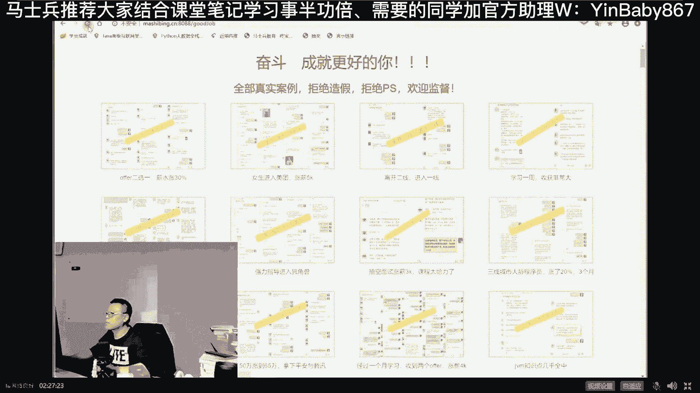
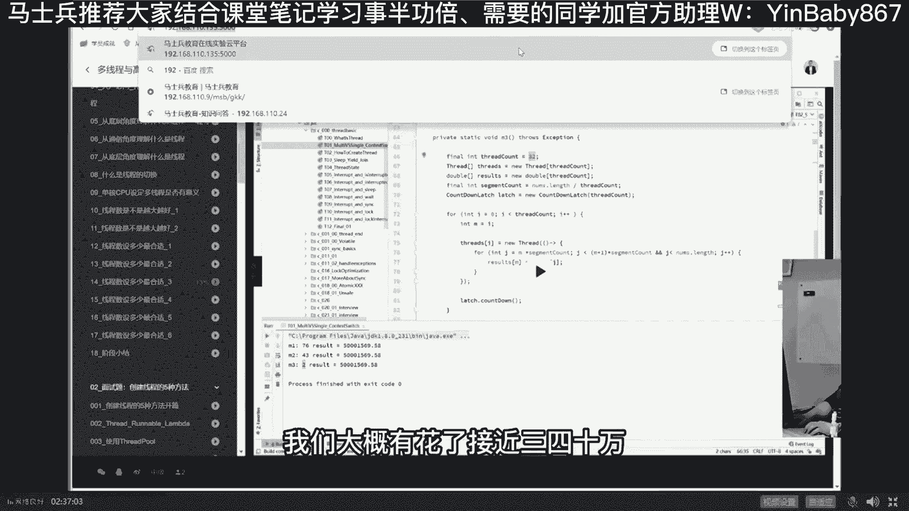

# 马士兵教育MCA4.0架构师课程 - P15：15、volatile底层实现原理 - 马士兵学堂 - BV1E34y1w773

当然我讲到现在为止呢，你应该大体明白了，这个至少是这个这个有序性这件事是怎么回事，明白了吧，应该肯定比原来应该清楚多了啊，就是并发编程的三大特性之有序，按顺序来是吧，首先第一点不一定按顺序。

不按顺序的原则是，只要不影响单线程的最终一致性，在多线程情况下不按顺序来，会出现莫名其妙的问题，著名的this1出问题怎么解决这个问题，加屏障，底层屏障是汇编语言。

JVM级别层屏障是一个逻辑上的四个屏障，volatile修饰的读和写需要有这个加加这些屏障，好那现在问题又来了，讲我们今天的最后一个问题吧，比较深入的最后一个深入的问题，好看这里。

volatile到底怎么实现的，它底层是那些个l fans，i'm fans这些来实现的吗，好如果你想了解这件事的话，比较复杂，还想听吗，别讲了，要不然下面这个有点难了，就太难了，嗯讲到这。

Ok m e s i，这跟MESI有半完全关系，MESI是解决可见性问题，这里解决的是有序性问题，大厂吊起来揍这个够嚣张对，没事啊，来这底层的，反正他敢问底层，你就吊起来揍就行了，想听再讲会是吧。

那我慢慢讲，我慢慢讲嗯，因为这块最后一块知识呢相对比较难，你仔细听看能不能听得懂，认真听，刚才我说过了啊，这是什么意思啊，大家咋说呢，还是拿程序举例子吧，我们看这个啊。

这个volatile修饰的变量manager06instance，这个变量在这个变量里面，我们去看它的二进制字节码，View show bide code with class library。

这个工具很好用，建议大家拿下拿下来用，我们看到它的fields field只有一个，就是它的这个变量嘛，本地本地变量只有一个，就是这个instance，点进去你会发现这哥们呢有一个修饰符，看到了吗。

Access flags，这是它的修饰符呃，这个修饰符呢它有三项构成，00X004A代表private static volatile，这里面如果你不理解的话，我在外面那个课里专门讲过这个问题啊。

拎过来。

但是我要讲这个有点有点有点有点多了，看一眼work closet jvm，讲这个课的话，这个class文件结构啊，因为这个里面是专门讲过，我是专门讲过这个class文件结构的，就是基于java1。

8的这种class文件结构，一个class文件每一个字节到底代表的什么意思，它的x flags，如果它是private是什么意思，如果是static是什么样的，如果加不加volatile是什么样的。

这几个值混在一起，最后得到的结果就是0X004A，所以你看到0X004A的时候，你会知道它是private static volatile，好，现在的问题是我知道了啊，这哥们是一个讹的东东。

现在的问题是JVM读到这个volatile之后，读到这种volatile之后，它到底是怎么处理的呢，同学们，你们想想看，我作为一个java文件，我写了一个volatile，我编译成class文件。

我的JVM读这个class文件读过来之后，我发现其中有一项是volatile的，那么这时候他是怎么处理的呢，下面我要讲这个问题，好看这里，这个问题是这样子来处理的，如果你想了解JVM是怎么处理的。

你是不是得去阅读JVM源码啊。

JVM源码是拿C加加写的，没关系啊，同学们想成为牛逼的架构师吗，牛逼架构师，有同学说老师有多牛逼，看着玩吧，你这个纵横捭阖，想到哪讲到哪好不好，有多牛逼呢，好我们有一位29岁的。

到目前为止没有没有人能超过他，比他更牛的，29岁的小伙，学完我们课程之后，大概的简历是这样写的，当然，他这个有点难，一般人呢达不到，不过没关系啊，我因为我们教东西呢，一向是认为你最好追求比较高的东西。

100万年薪没追求上，只追求到50万，good好，但是作为我们来讲，课程深度一定要达到这个深度，当然有同学有的有的有，有的机构呢人家最深也就30万，那你就拿你顶头就拿30万好，这小伙呢学我们整体的课好。

这是他全部的家当都扔在这儿，阿里呃，练完之后120万年薪P7加嗯，80万底薪40万股票，而且我偷偷告诉你，最近这小伙又跳槽了，中国it界给薪水给的最高的三大公司，抽烟喝酒烫头啊不对。

中国IT界给薪水给的最高的三大公司，华为拼多多字节，他跳到自己目前年薪200万以上，好这是架构师，这是牛逼的架构师好，那么成为牛逼的架构师。

有一个很重要的点叫做，不要让自己拘泥于某一种语言，语言不能成为你前进的屏障啊，你不能说内存屏障啊，我语言是成为我的屏障，这句话怎么理解，所有同学会问我，老师点NE怎么样啊，go怎么样啊，java又如何。

C加加牛不牛，swift语言值不值得学，最近rust挺热的，我要投入激情吗，PHP听说是世界上最好的语言，JS现在越来越牛，什么都能干，前端后端都能写，汇编哇，听上去就很牛，C语言写底层的。

我一定要学好，请问老师，我应该选哪种呢，来有这种问题的，给老师扣个一，有没有有没有这种问题的，应该有啊，这是入门级的问题吗，小小问题吗，是不是，好所有同学听我说，我今天讲的东西其实跟语言有关系吗。

没关系，但是当你如果让你的工作岗位，就局限在某一种语言层面，我就拿go写高并发服务器程序，我用到这样了，写业务逻辑我就拿C加加写类库，我就拿swift开发我的IOS程序好了，同学们。

从此你就拘泥于某一种语言层面，我就能开发这么一种特别窄的层面的，这样的类型的程序，其他的我干不了好，你的天花板就到头了，到目前为止，在北京地区点net天花板3万，3万到4万吧。

差不多这样go语言天花板3万到5万，差不多这样，java语言的天花板3万到4万吧，有的还包括java，对包括包括啊，你只需要用这种语言，只了解语言层面的东西，就薪水也就这样了，不管你是30岁，35岁。

38岁还是40岁，到头了，你想更进一步，请你给我建立架构，14位，什么叫做14位，我作为架构师来讲，我要购我要建一座房子，建一座building，一座摩天大楼，那这个柱子我该用水泥，我就用水泥。

这门子该用木头，用木头，同样的你构建一个软件层面的东西好，我是一个软件的高并发的，淘宝级别的这样的一种一种结构，我怎么构建接入层，我怎么处理，该用NGINX用NGINX，改用lure，用lure。

该用那个那个CDN，用CDN，该用各种手段，用什么，用各种手段好，微服务层怎么玩API网关吗，服务网格层或者是微服务层，数据的服务，从数据的缓存层，数据的持久化层，AI的处理层，AI怎么玩，排分吗。

好整体性的熔断限流，降级的处理，整体性的监控，整体性的报警，整体性的压测，整体性的链路，OK这叫做一个完整架构，这叫架构师，这块还合适用la来，我们用la这块和适用Python来good。

拿来Python来用，这块合适用java写业务逻辑，来来就是了，这块适合用构拿go一样来写好，这叫牛逼架构师，你的薪水不可限量，这块能听懂的，能接受的，给老师扣个一，人呢，可以层次不高。

但是请你打开你的眼界，好看这里我讲到现在为止，你说没事啊，他是拿C加加写的，没有关系，我们大体能看懂，我刚才说了，当java虚拟机发现一个class文件，里面有一个volatile的这种修饰符的时候。

这个怎么处理呢，这处理比较特殊，如果你想读的话，你需要读什么，你需要读那个by code interpreter这个文件，这个文件啊，这by code interpreter呃。

有点小啊，我来给你切出来，放大一下。

这个文件by code interpreter，By code，字节码，interpreter解释器，字节码解释器的C加加的文件肯定嘛，字节码解释器嘛，我读到了，我在这个字节码解释器文件里面。

当我读到了某个属性是volatile的时候，如果它是一个volatile，那么它调用了什么呢，它调用的是order access的fans方法，看到了吗，它是调了另外一个类的fans方法。

fence不就屏障的意思吗，这个由于我要建立debug环境，我得去LINUX底下，懒得去，所以我就呃definitions，找到definition吧，501，嗯看笔记吧。

我懒得我懒得给你去LINUX环境了。

就在windows底下给你大致解释，呃我们看笔记，volatile fans方法，防止指令重排序，嗯如果你想了解这个，what the fans方法到底是怎么完成的。

他最后调用的是order access fans方法好，这个分子方法在哪呢，是order access的LINUXX86in liner hp p这个文件里面。

嗯在这，Sorry，这是atomic，算了不找了。

找我得去LINUX也给你找，不找了，你就读就行了好吧，order access linux x86的实现，LINUX的实现，X86架构的实现是这么来实现的，这FS方法这个分析方法是这么写的。

他说if os is m p呃，他首先做一个判断，判断是什么，判断是is m p m p的意思，就，a market person叫多人运动，我主要我要看看你们有没有在认真认真听讲啊。

好mp的意思是什么，多个处理器好，如果你你你你你你是用的多处理器的话，多个多个CPU，那么他执行的是哪条指令，哪条指令呢，就lock指令，Lock adl，这哪是零，lock adl好，讲。

到现在为止你们应该知道了，java volatile底层实现啊，它并不是拿什么l fs m fans，什么那个等等，专门的CPU特有的屏障指令去实现的，而是采用了偷个偷了个懒，叫lock指令。

这个logo指令呢有的时候锁的是缓存，缓存锁，有的时候锁的是总线总线锁，总而言之，底层就是上了把锁，所以凡是牵扯到volatile的话，它底层就是上锁来实现的，好吧，这是讲cs大哥。

这跟cs有半毛钱关系吗，嗯这块如果再解释的话，没边了，稍微解释一下，还能跟上吗，能跟上，李老师扣一，这是LINUX吗，java是什么样的大哥，这是JVM的底层实现，java就是这样的。

嗯零基础是有点难了，那这块有点难，不过别急，因为这是年薪50万的课，你感觉难也正常，你要感觉还特别容易，那说明你就快达到这种水平了，恭喜你好，大家看这里log这东西呢叫做，锁总线什么意思。

这是一颗CPU，这是一个CPU，两颗CPU多CPU吗，去访问我们volatile修饰的变量的时候，我会把总线给锁住啊，再说一遍，比如说你可以理解为锁总线啊，但它实际上锁的是缓存，缓存锁，这个效率更高。

但是不管怎么样，你理解为索总现在更容易理解一些什么意思呢，呃我们CPU是通过一条线，去访问我们内存的数据线吗，好这条数据线叫总线，当我的一颗CPU去访问volatile，修饰的这块内存的时候。

我把总线锁住，其他CPU不许访问，听懂了吗，你什么指令都过不去，必须得等我执行完了，你其他人才能执行，来能get到这一点的同学，老师扣一，JVM就是这么粗暴，二话不说，就用一条锁总线的东西给给给锁了。

哈哈说不是有地址总线和数据总线吗，您还少说了一条，还有控制总线呢，所控制总线不就行了吗，当然严格来讲，这里锁的是北桥信号硬件咱就不提了行吗，讲讲讲讲成芯片设计了还怎么玩，好到这就差不多了。

JAVG也就问到这了，你基本上可以把它吊起来揍了，所以本质上就是一条lock指令嘛，它既保证了可见性，又保证了有序性，这就是volatile的最终实现，好当然你要观察到这个问题的话。

你要观察到这个问题的话啊，还比较复杂，应该说如果你想你想你想你想动手观察到，你得你得你得去LINUX底下去去干这件事，这个我们VIP我我我带他们观察过呃，但是五官个人就算了，太麻烦。

用HOSPORT的DISSEMBER，这个全称叫hot sport，This assember，Hot sport disassembler，观察synchronized volatile。

这时候你才能观察到要复杂，就不多说了，讲东西呢，我讲底层呢讲的应该来说是比较深入啊，呃这个呢是给大家讲的，基本上是沿着沿着沿着有序性这件事，给大家讲了半天，但其实这里头有序性呢不算是比较难的。

难的是原子性呃，其实与此同时呢，像那种底层的一些东西了，呃像这种什么都会给大家讲到啊，像什么和平写的技术啊，这都是像那个NOMA就是CDC才支持的呃，像还有像像像像像像其他的啊，鸿蒙啊，操作系统。

宏内核微内核啊，晋城县城县城嗯啊基本上全给大家讲一遍吧，各种中断嗯，好各种内内存管理同步的方法啊等等，嗯到汇编呃，我觉得呢你听完老师的底层课呢，第一你去听你们什么操作系统，你听起来会比较比较比较轻松。

看起来比较轻松，第二面试官来讲，你凡是签和java相关的这种底层问题，你就拎起来揍就行了，拿皮拿皮鞭子抽他啊，当然与此同时你会拿到比较好的薪水呃，薪水会拿到什么样的一种程度呢，我们最近的吧。

那最近的举个例子，这这这这这都是我辅导过的嗯，这也是我们整个课程的特色之一，就是我们一对一的辅导，其实是N对一的辅导，好多老师服务你一个我辅导过的啊，这个小伙是offer2选一，新水涨了30%。

最好玩的是，当他选中了一个offer之后呢，另外一个厂子开始追求他，求他说哥们儿，你来这边吧，我再给你涨点心水啊，这是女生，我们辅导之后进入的美团涨薪，涨了5K薪水，虽然涨的不是很高。

但是开启了大厂之旅，其实薪水是翻了倍了，这个显示不是不是很准确，这个薪水是翻倍的，为什么，因为他原来是12K12薪，他现在到美团之后是17K16星，你自己算一下，基本接近翻倍啊，嗯15。5新嗯。

当然现在正在念百度，还有蚂蚁哈哈，这个小管呢呃它的原来的一份薪水，8月份啊，8月1号报的名到了吗，8月1号报完名，到现在为止，最开始的时候呢进就龙湖地产，还有像什么五班啊啊都已经拿下了，他进的是五八。

入职五班一个多月了，有了美团的机会，美团又给他发发offer了，OK我当然建议他离开五八进入美团，五八算二线。

美团算一线。

有一线，当然进一线是吧，学习一周收获非常大，现在学了一周的VIP收获很大，老师讲的太好了，一下就听懂了，不存在不懂的问题，一听完课就记住了，哎这怎么还贬别的培训机构呢，算了把这把这部分回头给删掉啊。

上学看这个看不懂是吧，其他无事全全懂了，字节校招操作系统就能忘了。

通知一下这方面的课程都有来就是了，老师的课你牛逼就牛逼，在从零一直带你到年薪120万以上，好介绍一下我们的课，我们课全称叫MC，我从粗的层面介绍好吧，我介绍那么细，课程的全称叫MCA。

课程大概是这样来安排，MCA的全称叫马士兵certified architect，就是我们认证的architect，认证的架构师大概涵盖了从零到15万年薪，从15万到30万年薪，从30万到70万年薪。

从70万到120万年薪这样的几条路线，好如果从直的角度来讲，从P5到P6到P7到P8，好这一个课全包含了，呃大家听懂这意思了吗，好课程量比较大，所以需要我们一对一的做规划和指导服务。

这个服务所带来的效果就是短时间跳槽，涨薪进大厂，你来就是了，学完我们的高层知识体系，从如果从从课程角度讲呢，是大概分七个大的方向啊，如果是从课程角度讲，从年薪角度讲，分几分几块，从那个直体角度讲分几块。

如果从从从从这个课程角度讲，那东西就比较多了，底层的源码的，算法的架构的项目的设计的非常非常多了，就哈哈，我就不给你一一弄完了，我给大家举几个点就行，在老师这儿的课里，其他任何一个机构都没有的。

给你举个例子，比如老师这会带你真真正正的落地架构师，什么叫落地啊，有没有人自己亲手从一台机器都没有，一个节点都没有搭，一个类似于淘宝能支撑百万的QPS的，这样的一个架构出来，你具备这样的架构师水平吗。

没有吧，好吧，这里老师会带你做，是美团的老师啊，他在阿里也待过，美团也待过，他带领大概接近十个人的团队来再造一个淘宝，而且是真真正正的给你搭建分布式系统，全部拿出来搭出来，分布式id配置中心所集群事务。

集群服务集群，网关集群，注册中心，集群监控集群，MQ集群，ES集群，MYSQL的集群等等等等，全部都比你比从头到尾都给你打出来，让你真真正正能够落地，就是咋说呢，你的那种架构师级别的东西，嗯嗯先过。

演示一下吧，And where i is architect，原图去哪，嗯这张图拎出来很多同学呢，可能那个见过类似于这种图啊，我也知道有很多，有很多培训机构就培训这种这种东西，这东西是什么呀。

就是我们啊我们把它们把它称之为PPT架构师，哈哈两三个月的课啊，每周两次课，三次课，嗯然后呢我给你讲啊，这个地方应该有一个DNS啊，这个地方应该有一个防火墙啊，这个地方是运维参与的，这地是开发参与的。

哎这个地儿呢是一个负载均衡，这个地儿是MQ啊，这个地儿呢就是大数据了啊，这个地儿就是K8S集群，这个地儿就是CCD，这个地是docker，这个地是MYSQL集群，这个地是阿尔萨斯的集群，好。

你看完之后觉得我靠，好牛逼啊，见过吗，见过这样的同学，扣个一来，你们你们在企业里做方案是不是也这么做，哼看完之后觉得听完觉得特别爽，一落地啥都不会好，我们的看法是带你从头到尾真正搭一个。

我们在阿里云上大概60万1年，这是花出去的真金白银，就是为了讲好课这件事我们是不惜血本，60万1年，这里的每个节点全买下来，但你从头到尾搭，可以吧嗯嗯来，能感受到我们就是为了教好一门课的苦心呢。

哈给给点鼓励啊，老师扣个一，这事还没完啊，这事还不算完。

我们还干了一件事，你们可能就是还是那句话，就是你看到的这些没有人做过哈，就只有我们做呃，腾讯课堂本身他的一堂课两个小时，找东西不好找怎么办，看到了吗，我们现在一堂课给你干到三到5分钟。

35分钟一节课来就是了，复习起来特别好，复习想找老师吗，来这堂课我不会了，马上直接问老师啊。

来就是了啊，那个为了达到好的课程效果，真的是不惜血本，再给你举个最简单的例子，我刚才说完，我说我那个架构师呢可以让你落地，很多同学可能就说了，老师我要去阿里云上，要买的话，是不是也得花60万。

你可能花不了60万，但是我估计你得花1万，就是你想搭那环境下来，你个人要想临时性的，这一个月我就练习练习，花1万块钱，几十台服务器，上百个节点，那不是开玩笑的，没办法，我们大概花了接近三四十万。

搭建我们内部的私有云，专门为学员服务的，这是我们自己的私有云平台。

登进去，啊这是我们的整个的监控监控大屏了，我们云主机，我们自己的这种网约车项目啊，自己的运维产品，自己我们自己的app等等等等，全部都是搭在我们私有云平台上的，好这个平台，对外开放免费的。

能体会到良苦用心吗，这个是一个我给你请的老师，BAT勾的一线大厂的，北京的，不是长沙的，不是武汉的，不是那种三四线城市的，也不是像什么五八了，唯品会了，这种二线大厂的，全是一线大厂，带着你们学习。

想进阿里吗，你想知道阿里P5P6P7P8怎么玩的吗，找曹老师就行了，他原来叫阿里毕业吧，不能说阿里毕业的阿里，阿里出来的程老师，阿里的P8，你达到他的级别，120万年薪以上了，干就是了啊。

好我说的这个大的层面，有同学说老师您讲了半天底层，你跟我聊大的层面，那底层你有啥呀，底层就更多了，左老师的算法课有没有听说过，所以从最基础的基本数据结构开始讲，到基础的算法，到高频的力扣刷题。

刚才给你看评价了，没有比他讲课讲的更好，好，包含在我们整个课程包里，最后给你个结论吧，2000小时课程，别人家300小时，有的人号称1500个小时啊，逗着呢，翻来覆去讲了五次，号称1500小时的搞笑呢。

2000个不重复的课时，是别人家的七倍，价格1万2000多块钱贵吗，不要说贵，钱能解决的问题都是最便宜的。

看效果强力指导进入独角兽，独角兽啊，我们是真真正正真的是连续的指导，他好几个月抽空面试，涨薪3K1年就3万多咋整，三线城市的大量成员，三个月涨了20%的薪水，三线城市的大龄啊不是很高。

但是一年涨回学费来总是太轻松了吧，裸辞一个月涨薪3K回到行业，31快32了哈，刚办了离职，经过一个月的学习，两个offer涨薪4K，收了四个offer，年薪涨了7万，你说1万多块钱贵吗，记住有效果。

良品铺offer9K涨到1万5，一个月，欧弟和中移动两个offer，3月份刚找的工作，靠刷算法涨薪6K，这就是刷左老师算法了，37岁两个月左右，55万干到70万，杀进美团，待遇都是总包。

70左右，大概涨了27%，别说贵，这是最便宜的壳，2000小时，1万2000块钱，每每每小时五块到七块，好人家300小时6000块钱，一小时20，我们有20位老师，每个老师500，人家就三个老师。

每个老师2000，傻帽才觉得我们课程贵啊，好，直播接不上去怎么办，直播跟不上，看录播呀，我们最近在探索录播加直播的内容，任何一个机构都不可能保证你进去之后，就是你正好想听的直播课，这点你能理解吗。

我相信你应该能理解啊，正常人都能理解，不可能说任何一个机构都不是包括线下，你刚进去啊，就是你想听的那部分不可能没关系啊，如果有很清晰的，而且定期直播讲难点答疑来就是了啊，最重要。

我觉得学习方式呢按照我们安排的走就行，你呢最简单的，只要你肯来带着人来，老师安排你怎么学习，你就怎么学习，你达到的效果就全有了，我就想问一句，想不想要这样的效果。

其他的都是说别的都都都都都都都都都没意思，想不想跳槽，年薪涨10万的，学完了就学了三门课，就上涨了20万，你想不想收了四个offer，太烦了，不知道怎么选，想不想拥有这样的烦恼，你想就行了吗。

你跟钱有仇，跟你光明的职业前景有仇是吗，那你就别来，否则这个地儿独一无二，没有人愿意花血，本来真正投到不是投到广告上，而是投到教学效果上，6+2看了一半，这是什么意思。

因为我们有专门一对一的职业规划的指导，举个最简单的例子，大二大三，你想进到大厂7+1加一跟我们学一年，二本学校想进一线大厂，前十家，一线大厂99%让你搞定，就这么牛逼，应届生想进大厂6+1。

你跟他的路线是不一样的，飙升一到3年的相亲大厂6+2，呃我说我想那个那个那个全方位提升，MCA的再造淘宝课程，带着你所有知识点全学到老师，我想你自己算法课，老师我想加强我的竞争力，推荐系统AI老师。

我想从零基础开始玩，来老师，你说这些都是废话，我就想找短期见效一个月，我就想涨起薪水来，only one就一个月能不能行，3+1帮你搞定，除此之外，今晚有六张，VIP的黑卡，走过路过，千万别错过。

这个原来从来没有发售过的这个黑卡，以前我们是要单独卖钱，500多块钱才会有，今天晚上免费送出六张这个服务，黑卡包括什么，我们中俱乐部的终身会员，线下的活动，欢迎你参加门票免，当然要吃饭，您自己掏。

我们自己的app，就是将来你要看课程，像这一类的玩法来吧，在你的手机上，界面一样的一节一节碎片化的时间，就学习了系列化的知识，我们MCA的课以后升级怎么办，我们我们今年生了很多东西啊。

明年还会生啊，我们已经在规划之中了，我偷偷摸摸告诉你，我们2021年的课程已经在规划之中了，我们会升级设计专门的设计系列课，我们会升级考核，我会做你考题懂吗，我会测试你的水平。

您您您您您老人家到底是那个P5还是P6，还是P7还是P8好。

包含了，不用你单交钱，我们有终身的职业就业和技术的指导，遇到难题了对吧，刚才我看有同学找我聊天来着，说老师我有点害怕，说那个进去之后卡不住怎么办，有20位老师大哥。

这么多老师做你的后盾，你有什么难题cover不了的，这都是家里人有什么难题，往往老师这跑就行。

从此之后，你的职业生涯一路有人护航，学科免费重修，这辈子你随便什么时候想学。

