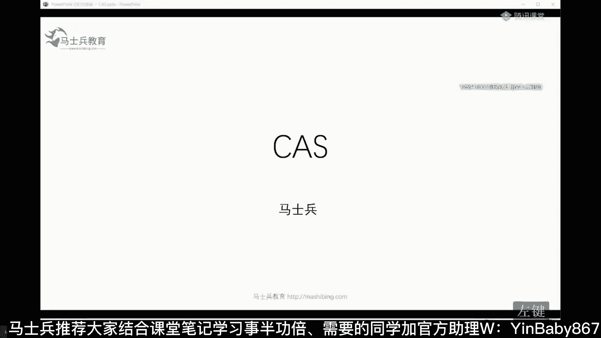
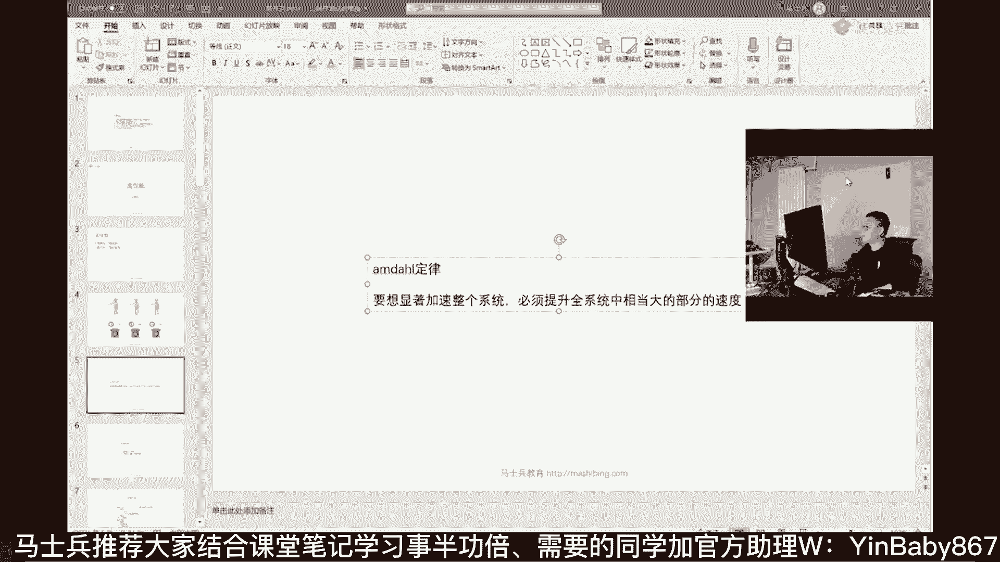

# 马士兵教育MCA4.0架构师课程 - P16：16、互联网三高 - 马士兵学堂 - BV1E34y1w773

面试面的也多，那么我今天呢主要想给大家呢讲这些内容，面试之中可以说加分加的最高的就是互联网，三高到底是个什么东西，这里面呢高性能是怎么被体现啊，单机版的高性能。

然后java汇编我们来聊聊体能性能是怎么提升啊，然后我们来聊呢JOC诞生的来龙去脉，和它的原理，好吧，我们先聊一个事啊，就是我们说这个互联网三高这件事，互联网三高是哪三高。

不知道大家咱们小伙伴们了不了解啊，很多同学呢其实说的都不是很精确，很多人上来就聊高并发是吧哈错了啊，上来就错了，注意互联网三高指的是这三高叫高性能啊，还有一个叫high scalability。

是不是要给大家敲一下，给大家做个笔记吧，好不好，新建文档叫他嗯，断成两天训练营的一个笔记，呃做点笔记出来啊，互联网三高，这个互联网三高呢很多人并不是了解的很透彻，实际上是这三高。

我直接告诉大家答案叫高性能，高扩展，高可用，实际上这三者它们之间是互相之间是有重叠的，这里面最关键的点叫做高性能，这块是最关键最核心的，也是最值钱的，2020年后半年，咱们的小伙伴出去面试的时候。

把这块能写出来的薪资都比别的要高很多，那么这个高性能主要指的是什么，我们先说，今天我主要跟大家聊聊这个高性能啊，把这个聊完之后呢，我们来聊单机版的和那个分布式版的高性能，主要体现在哪些方面。

然后我们从单机版的一点点开始开始聊，可以吧，好高性能来说呢，其实是体现在两个方面，请大家记住我们平时所说的高并发，只是高性能中的一个层面，实际上呢它有两它，它它是它是两个层面构成，第一个呢叫呃，叫响应。

第二个呢叫吞吐，这两个呢都体都是性能的，所谓的系统的性能的两个方面叫低延时是吧，low latency啊，这个叫低延时，那么叫high throbot，这个叫什么，高吞吐量。

所谓的高吞吐量是不是就高并发，所以说我们平时所说的高并发，只是我们高性能的其中的一个一个层面呃，高性能来说呢，怎么样让一个系统达到特别高的性能，其实这是一个很很很很很很复杂的一个话题。

这东西呢你要是从头到尾的透彻掌握住的话呢，基本上到面试的时候，大厂的面试的时候呢，可以可以加的加分项的非常的高啊，好，今天呢也是我第一次，从这个层面来给大家讲高性能，看看大家是不是能够理解。

高性能实际上是包括两个方面，第一方面呢叫低延迟，也就是你响应特别快，第二个呢叫高并发，有吞吐量特别高，这是衡量你系统性能是不是够高的两个层面，另外这两个层面也是相互影响的，呃我给大家举个形象点的例子。

比如说你去银行存钱，假如说你在这里面，银行里面只有一个柜台，只有一个柜台，然后这一个柜台呢我们存钱的话需要十秒钟，同学们，你们琢磨一下，如果我想让我把存钱这个系统的性能提高，我们该怎么做呢，请大家记住。

请大家记住，如果有人要求你，提升系统的性能，提升两个方面，第一个叫降低延时，就是让你的响应速度越快越好，第二个层面呢叫提高吞吐，所以如果让你优化这个系统应该怎么做，其实非常非常的简单，对不对。

你琢磨琢磨，我要让你优化这个存钱系统，你该怎么做，比如说优化存钱系统，把原来的存钱嗯，十秒，给他优化整个我们的业务流程，对不对，我们业务流程上呢，原来存钱需要十秒，各种手续办起来太麻烦了。

我们只要把存钱的十秒能够变成存钱五秒，同学们，你们琢磨琢磨，我们系统的性能是不是提升了一倍啊，而且呢与此同时，你琢磨这件事，只要我们延时降低了，我们吞吐量是不是自然就提高了，我再说一遍，延时降低。

吞吐量自然就提高，我讲到这儿啊，你们今天来了，一定要带点收获回去，请大家把这俩词儿给我记住，一个叫响应，一个叫吞吐，任何对于说系统性能的一个优化，就从这两方面下功夫，听懂了吗。

get到的给老师扣个一延迟跟延迟有什么区别，没有什么区别啊，是吧，哎，这事很容易理解，对不对，你你你变成你本来你那个十秒钟处理一个，你变成五秒钟处理一个了，你相当于十秒钟能处理俩，你的吞吐量当然就高了。

所以呢吞吐量自然就提高，那么单纯从提提高吞吐量方面，我们说就说你原来还是十秒钟，你提高吞吐量，这时候怎么做呢，其实很简单嘛，我们就加柜台不就可以了吗，我告诉你啊，目前来说想提高的想提高吞吐量呃。

提高我们系统的并发量，说白了就是提高我们系统的并发量，这词应该大家会经常的见啊，经常见说什么高并发系统，对不对，到底该怎么样进行处理，我跟你说，提高系统的并发量，从这个简单的系统来说很简单。

多开我们就就就是多开窗口就可以了，从系统的角度来讲，就是你多开线程是不是就可以了，线程不够了，我多来机器是不是就可以了，机器不够了，我们多上上到云，我们进行弹性扩缩容，是不是就可以了，所以说到最后呢。

其实归根结底都会放到这两个层面上来，一个叫做岩石，一个叫做吞吐，所谓的优化就奔着这两方面去好，大家听我说，关于优化这块呢，有一个叫阿姆达尔定律，我不知道大家听说过没有。

嗯大多数人呢可能没没有听说过这个定律。

这个定律并不如摩尔定律呃，那么的那么的那么有名啊，但是这也是一个很著名的定律，呃，如果说大家伙有兴趣的话，那个这本书叫深入理解计算机系统，这本书当时超级厚啊，我不建议你去买下来。

仔细去读它这本书的第16页，专门讲了阿姆达尔定律，这个定律呢其实它的最核心的点就在这儿，他要你要想显著的加速整个系统，必须提升全系统的相当大的部分的速度，这什么意思呢，说白了很简单。

就是你想提升延时这块这块给大家复制下来啊，阿姆达尔定律。

就要想显著加速，整个系统必须其中全系统相当大部分的速度，就是你只提高一部分不行，你只提供了一个点，我们整个系统处理下来需要ab CD e啊，好多个点，你只提升C点D点，这事是不行的。

你得把ABCDE大多数的点全都提升好了，你整个系统的性能才能，整个系统的延时就是食盐这一块儿，这还不是说吞吐量，整个系统的这种食盐这块，他才能够得到显著提高，所以我们可以这么说，想加速整个系统。

想让系统的性能得到提升，根据阿姆达尔定律，我告诉你比较难做到，就比较难，你得把系统的整个层面提升，才能够得到我们比较高的一个性能提升，所以现在很多人他偷懒，他在这块呢并不下太多的功夫。

他把大多数的这样的性能的提升都放在哪里了，放在提高吞吐量上面了，听懂了吗，这块我不知道我是不是讲的有点有点抽象了，所以现在呢正是因为这个考虑，诞生了一系列的系统架构，嗯阿姆达尔阿姆达尔黑，写英文吧。

SADIE定律，告诉我们提升系统的响应延时，比较困难，所以现在很多系统的性能提升，体现在提高吞吐量上，那怎么提高吞吐量啊，这里就诞生了，各种各样的系统架构，当然从系统架构角度来说呢，就非常非常多了啊。

嗯我我这样啊，我刚才说了，我说那个我们要优化整个系统的话呢，实际上我们要么优优化它的响应，要么优化它的吞吐量，呃我不知道大家伙有没有优化系统的概念，不知道大家有没有优化系统的概念，如果有的话。

如果有的话，那你给老师扣个一好不好，如果没有的话呢，我给大家举几个小例子啊，这样我给大家举个小例子啊，举例比如说啊，我们说我们对系统来说，我们做了一个集群来，你告诉我一下。

这个东西是优化响应还是优化吞吐，说我们给系统做了个集群，我们单机撑不住了，我们就给他做了一个集群，让好多台机器共同提供提供服务，这很明显是油画吞吐是吧，同学们肯定的，能不能既优化响应，又优化了吞吐量。

优化了响应，听我说啊，记住只要你优化了响应，本身吞吐量就自然而然会被优化，好吧嗯，还有一个啊，比如说我们做了负载均衡来，同学们告诉我你是在优化响应呢，还是在优化吞吐呢，吞吐对没错啊。

比如说啊我再给你说一个，比如说我们做了缓存来，你告诉我你是优化响应还是优化传统，响应说的很对，比如说我们缓存本身又做了负载均衡是吧，又做了集群，那就是你既优化了响应，又优化了吞吐，听明白这意思了吧。

所以总而言之，言而总之你各种各样的手段，要么我们优化它的响应，要么我们优化它的吞吐，我再给大家举个例子，这个看大家了不了解，我做了JVM的优化，这个是优化了什么，响应对吧好，我现在做了分库分表。

我做了什么优化，吞吐对不对，嗯当然同学们，你们琢磨一下这分库分表，这表小了，它的响应是不是也就提高了，是不是，所以呢这两个都做了，OK嗯我再给你说一个啊，比如说我们说一个更详细一点的。

我们说tom cat呢，我们用了非阻塞协议，原来tom cat我们用的是阻塞协议，现在我们用了非阻塞协议来这个，这个我们是优化了什么，优化了响应，优化了它的响应之后，记住它的吞吐自然就高了啊，响应快。

吞吐自然高，这个很正常好，我们再说一个，我们用了MQ，我们用了异步，这个跟tomcat非组织协议其实本质是一样的，对不对，嗯蒙了是吧好吧，蒙蒙蒙蒙了就算了，不举例了，反正总而言之。

在你的整个系统架构里面，你去优化你的系统架构，不论你采用什么样的具体的技术手段，我相信我建议大家呢先从框架上理解，就是你要么优化它的响应，要么优化它的吞吐量，就看你们追求什么这块大家听懂了吗。

MQ叫做message，Q叫消息队列啊，这些技术都听过，但是没做过，老师这课都有啊，这里所说的所有的全有，放心吧，嗯那个啊，我讲课呢愿意从更高层次上来，带大家认识一些东西，一些东西啊，吞吐响应是个啥黑。

还有人有这个问题吗，我看到有小伙伴，那个他的他的他的他的这个问的比较简单，这样啊比较简单的问题，我就回答你一次，我会快速的回答你一遍，响应是个啥，就是你比如说你去银行办存款，他用了十秒钟。

它的响应时间就叫十秒钟，就这意思听懂了吗，用了十秒钟帮你做好了，这就这个就叫响应你，你你去访问一个页面，这个页面一秒钟你就你就访问到了好，这个响应就是一秒钟，当然这里面还有细的概念叫TPSQPS。

这个我们回头再说，不着急，大的层面上处理完你这个请求的时间，就叫响应每秒钟，或者说每每个时间单位能处理多少请求，这个就叫吞吐，好了，大家了解高性能这件事情呢，它的本质，最后其实有的时候呢。

我喜欢从大的框架给大家讲东西，呃，稍微的说的虚一点，就是我希望大家伙一定要建立一个，框架这样一个概念框架，我说的这个框架呀，并不是说呃，说说说什么java经常用的这些个组件框架啊。

spring spring的，不是那些，我说这个框架是说从大的层面，认识技术和其他事物，呃我稍微从大的层面给大家讲一点点，同学们有没有听说过这样一句话，年轻人就要去多犯错，年轻人要去多犯错。

为什么要做犯错，因为吃一亏长一智，他慢慢就成长了，应该听说过吧，说年轻人不怕失败，是不是没错，同学们听我说，所谓的犯错有两类错误，一种呢叫做细节性错误，就是你大的方向是对的。

但是呢你可能犯了一些很小的细节性的错误，你方向是没问题的啊，我是走在正确的方向上，我是要往嗯，整个社会呢他就正在拥抱新机的时候啊，5G物联网，我奔着方向去，中间你可能走歪了一点点，走歪了一点点。

但是你大的方向是没有的，这种错误没关系，随便犯，多犯一些，让你成长更快一些，但是还有一类错误叫框架性错误，人生这辈子框架性错误大概就那么两三回，这玩意儿你要是犯了，可以这么说，你再做努力全白费。

我给你举个最简单的例子，高考别人都在那学习，你玩儿了，你得用多长时间才能够把这个错误给揪回来，你有你能理解吗，这个就叫框架性错误，比如说别人在那里玩后端玩go on玩java，然后你在那里玩什么呢。

你在那里玩的是嗯，从来没听说过啊，这个这个这个这个pascal，你在玩这个，你在玩SPSS，这个就叫框架性错误，这大家能理解吗，很多人学东西呢，他是从细节开始学懂吗。

就是咱们从小到大的教育都是从细节开始学，以至于咱们认为我细节学好了，我这个我这个人呢就一定是生活的很好啊，就这个这个这个，但其实啊在我看来，所有人是犯了很多很多的框架性错误，还在那个细节里头使劲钻。

你越钻错误就越多，越钻越钻，你错的就越远，嗯希望大家伙能抬头看路，路在哪里，路在何方，看那个整个的发展趋势好吧，看准这个之后，认准方向，先把框架搭好了，搭起来，搭起来之后，你在里边再生那些树枝，树叶啊。

树的那些个脉络，那个就方便的多啊，也好得多，也不容易犯更大的错误，所以大家伙可以犯细节性错误，但是不要犯框架性错误，那么举个最简单的例子，你你为什么现在很多人是婚姻，或者说男女朋友之间啊。

结了婚之后就特别别扭，特别多，为什么呀，是因为你们从来没有认认真真的选过，你的结婚对象，说这个人不错啊，我们认识三天啊，哎呀太爽了，然后呢，你后面就用各种细节性错误，去纠正你原来的大方向错误。

这个人适不适合你，这人本来就他不适合你，结果呢你就就是就是就是凑凑合合的是吧，然后呢就结了婚了或者处了对象了，实际上你从来没有想过这个人到底适不适合，是因为你在选对象这方面，你没下功夫。

犯了这种框架性错误，你想用细节性的各种东西来弥补，怎么去维护关系是吧，各种各样的小细节有用吗，屁用都没有，中国呢拿国家发展来说，中国改革开放发展也犯了很多细节性错误，但是大的框架性错误犯过吗。

基本没有啊，我们有好多那种，那么他做了很多具体的东西吗，没必要，框架搭好了之后，我们很多东西都可以做的比较到位，慢慢慢细化就可以了啊，嗯总而言之，言而总之希望大家伙学东西也好，或者是后面走后面的路也好。

先建立框架性的东西，如果这事还不能理解呢，我最后再给你举个例子，通俗的说一下，呃，相信每个人的手里一定是有好多好多的，各种各种的视频，各种的文章啊，各种的收藏夹里面装了好多好多技术性的东西。

这个就相当于什么呢，捡了很多零件，比如说你拿一个啊，你你你你你你弄了一厂子，这厂子里面有好多零件啊，这个小螺母小螺钉啊，方向盘小轮子特别特别多，这些零件你学好了之后，每天都来学习学习，拿出来看看啊。

这还算很不错，每天感觉自己都在进步，但是当你把这个零件想给他攒起来一辆车，你能想象这个难度吗，有没有有多少人是学了很多很多细碎的东西，让他做一个实际项目，发现无从下手的，有没有有的话给老师扣个一。

应该有的是我觉着零件都很好，学零件就像认字认词，顶多组个句子，你要写一篇优质的文章，作文这事儿难了去了，其实啊这事应该反过来知道吗，应该先学整车，先学框架，也就是说我一般都会建一个学习方法。

叫做囫囵吞枣，很多人都不建议，但是我一般会建议大家叫囫囵吞枣，从整车往零件选，就是呢你上来二话不说，能够理解我们所做的这个东西，能够做一个什么样的项目，懂吗，哎这个项目里面有好多细节，你可能没有掌握的。

通过这些细节觉得我哪哪有所欠缺的，再去学这些零件，当你囫囵吞枣能做完一辆车的时候，你就可以用碎片化学习去学习零件了，因为你发现有好的轮子，把原来轮子剃掉就可以了，不知道我说的重要啊。

咱们学习方法就聊到这儿好吧，我希望大家伙在你脑子里建立起来，这么一个框架的概念，你把这个概念建立起来，今天就没白来，不要老盯着细节，首先定大的方向，大的方向对了，再去努力，大的方向不对。

再怎么努力也白搭，好了不废话了，这个讲的有点有点远了啊，OK反正总而言之，如果大家伙以后聊性能这件事，记着两个层面，一个叫响应，一个叫吞吐，响应提高了吞吐自然提高，但是响应不太容易提高。

所以很多人在吞吐上做文章很简单，现在的云原生，K8S是不是直接在吞吐上去做文章了，没关系啊，你说你想要慢没有关系，我们就动态的，扩缩容动态扩缩容没有关系，你你需要的时候，我直接给你一堆的容器。

直接弹性给你补上来，双11双11过了再给你缩回来，OK这东西呢我预测会慢慢的干掉，Spring cloud，今天留在这啊，但是呢呃五到10年spring cloud死不了，所以你现在该学还得学。

这没什么可说的，总而言之，学到最后你会发现思想是相通的，慢慢学思想就可以了，好了不废话了，因为很多人基础不到位，我这个说的太多了，理解不理解的也不好说，OK嗯聊点具体的技术的内容，嗯大家听我说啊。

就是说刚才还有同学问说那个聊不了锁，就是我们要聊点县城这件事了，聊点具体的嗯，嗯什么情况。

嗯这是汇编。

汇编就先不讲了。

呃我们说讲了这么几个了，就简历里面的互联网三高到底是什么，你现在应该理解了是吧，大家把它背过叫高性能，高扩展高可用嗯，那么高性能是怎么体现的，两个层面，一个是低延时，也就是响应要快。

第二个呢叫吞吐量要高。