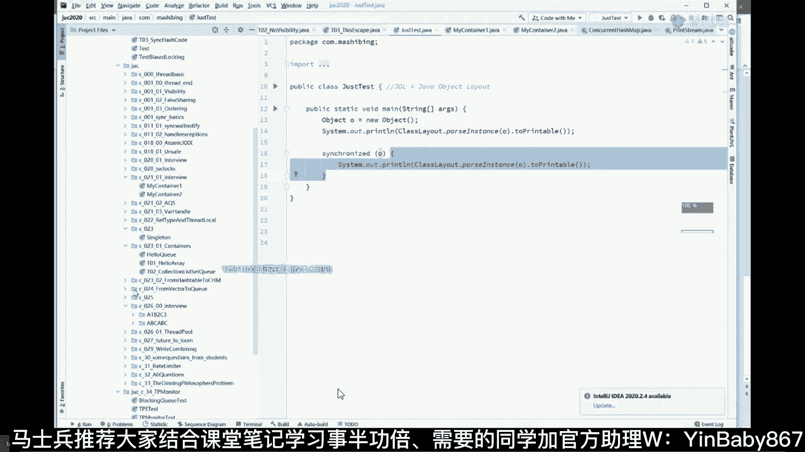

# 马士兵教育MCA4.0架构师课程 - P17：17、多线程与同步锁 - 马士兵学堂 - BV1E34y1w773

单机版的高性能，我们开始聊单机版高性能是怎么做到的呢，但这个事大家应该知道啊，单机版来说，如果你只有一个线程，它一定是做不了的，那么一定是有好多好多线程共同对外提供服务，这个时候呢。

就你就从你从一个线程扩到多个线程的时候，你就琢磨这件事，我们是不是从并发这块，就是从吞吐这块就给他做了性能的提升了是吧，原来你只有一个服务员，我现在呢给你可以给你起一堆的服务员，当然有了多线程之后呢。

就会产生各种各样的问题啊，我能从一些细节开始讲讲吧，好不好。

不能只聊粗的层面，我们要聊点细的层面好。

大家看这里啊，嗯如果我要是从这儿开始讲，那个说现成的最基本的概念，这个就没意思了，不讲了，线程最基本概念不想讲了，这个大家能理解吗，讲讲讲一点比较简单的好吗，讲点比较简单的啊，听我说嗯。

首先说呢我们说第一点啊，每一个线程是运行在不同CPU里的，就是一个一个CPU呢，通常情况下只能运行一个线程啊，不考虑那些什么线程撕裂是吧，不考虑那些什么八核16线程，四核八线程，不考虑这样的一个结构。

通常来说我们说一个线程运行在一个CPU里面，我们有多个CPU就可以同时运行好多个线程，这个东西呢就相当于增加了我们的吞吐嘛，吞吐嗯，所以我们整个性能一定是有提升的，呃那好呃，从线程角度讲呢。

我先问大家第一个特别简单的问题啊，这个呢是不是在我讲多线程的时候呢，会被很多的，会被很多的人问的一个特别简单的问题叫做，是不是线程数量越多越好，答案肯定是否定的，绝对不是啊，为什么呢。

关键是为什么同学们有这么一件事情啊，就是说我是不是无限制的，假如说我有八颗CPU，八个，我是不是无限制的，就可以往里头装各种线程呢，如果我说我装一个县城，然后啊装八个线程啊，我们的效率很高。

我要装8万个线程，它的效率是不是一定会比原来的高1万倍呢，肯定不是，原因是什么呀，原因是因为每一个线程跑在CPU的时候，会有一个叫做系统切换这个概念能理解吗，会有一个叫做系统的切换，这，个我看看。

这个我看看嗯嗯嗯。

这个东西呢会有一个现成的切换啊，叫做系统切换，那么这个切换是什么概念呢，这个切换是如果我只有一颗CPU，正在跑第一个线程下面，我要马上切换成第二个线程，它中间是要做一系列操作的，是要消耗资源的。

是要把寄存器的这些东西呢全都保存好的，然后呢再切换成另外一个线程的，就总而言之呢，我一个服务员现在正在服务一个客人，我中间是要切换切换成其他客人的时候，我是需要消耗资源的，因此呢。

因此呢我正在运行T1的时候是吧，我要切换成T2，我怎么做呀，我需要把那个T1所有的这些东西全都拿走，放一边去，然后呢再把T2所牵扯到的所有的数据什么的，唉放进来，所以这里呢会有一个线程切换的概念。

这个线程切换呢它会消耗系统的资源，所以说不是说线程越多越好，因为如果你只有CPU的数量固定啊，十颗CPU你要起1万个线程，相当于每颗CPU会在1000个线程左右里头，来回切换。

它会把大量的时间花在切换上，因此它不是说你的CPU的数量越多越好，这点大家理解是能理解的，给老师扣个一，所以说工作线程数肯定不是设置的越多越好，这是肯定的，因此呢一般来说我们让切换啊。

让切换跟我们设设置的正确的一个数量，达到一个平衡点是最好，比如说我们有八核的CPU，我们放16个线程合适，还是24个线程合适呢，如果不考虑其他的因素的情况下，还是32个线程合适呢。

这个东西呢它一定不是线性增长，它一定有一个平衡点，到了这个点之后再多，它性能可能下降了，能听懂吗，所以说要找到这个点，这个呢也是被经常我突然发现我讲的复杂了，呃，那个这个呢也是经常会在大厂里。

会不会有人问的说，你设置你总的线程数的时候要设多少合适，要设多少合适，24没啥依据，对现在人家问你的就是这个依据，有没有人被问到这个被问到过这个问题嗯，应该有对，实际上这时候呢有一个公式。

我不知道大家了不了解，有一个公式，这个公式是这样的，你可以截个图回去自己琢磨好吗，这个公式呢我我可以这么跟你说，你在面试的时候可以说没问题，但是真正实际工作的时候，记着我的结论一定是以压测为主。

你要模拟你真实的环境，压测的时候，如果是十个线程合适，我们就设十个压缩，20个合适，我们就就就设20个，根据这个公式可以算出来一个初始值，然后来回调整，根据这个公式算出来，如果是八个，我们就先设八个。

八个不合适不合适，调成十个试试，十个不合适调成12个试试，最后在这些里面找一个合适的指出来嗯，大家可以截个图，这是这个这个问题的标准答案，好吧，怎么确定多少合适。

实际上这里面是要你是CPU密集还是IO密集啊，今天呢我重点就不聊这个了啊，这个这聊的话就有点多了，好我们从简单的问题开始聊，那么大家伙思考一下，当多个线程共同开始工作的时候，一定会产生各种各样的问题。

比如说最常见的就是锁的问题，关于锁，关于同步，大家伙至少就算你没有用过，我觉得你多多少少都应该听说过来，有多少人用过这个关键字的，有多少人用过这个关键字，看这里，这个关键字有多少人用过的。

synchronized在你平时开发之中有没有用过吗，哎肯定是用过是吧，那么这个关键字到底是什么意思呢，我给你举个例子，最简单的例子，比如说我们synchronized某一个关键字。

然后在这里头写一段话的，有谁大概能理能能能能聊一下，这个到底是什么意思，来讲讲，保证线程安全，你说的很对啊，同学们听我说，多线程的编程呢，实际上它非常非常的复杂，要比那个嗯单线程的编程要复杂得多得多。

多线程呢它有三大特性，我希望大家伙先记住它，因为今天我可能来不及把三大特性讲给大家听，第一个呢叫可见性，第二个叫有序性，第三个叫原子性，同学们认真听我说，这里面最复杂的实际上是原子性。

可见性和有序性相对简单一些，但是也远比你想的复杂得多，我今天呢给大家讲原则性的一部分呃，可见性有序性呢我讲以前也讲过好多次了，它也是很复杂很复杂的好吧，也是面试的非常重的重灾区。

我们就拿这个来拿这个小程序来举例子吧，好不好，所谓的synchronized o，然后里面敲一个I加加，我们先说最基本的定义，这相当于什么呢，把这东西当成一把锁，说我要干里边这件事的时候，哪件哪件事呢。

中括号里包含的这件事，这件事你在中括号里面包含的这件事，我要在里面干这件事的时候，必须持有这把锁，必须持有锁，持有所才能干这事，不持有所不允许干，上个厕所，你才能在里边噗噗噗，不然的话这事你是不能干的。

因为有任何人可以冲进来，跟你屁股对屁股一块噗噗噗，你能你能受得了吗，盯得住吗，肯定不行，好这里的这个小的对象，synchronized的括号里的小对象，这个东西呢就是一个锁的最基本的概念。

他就把这个对象当成一把锁来用，当然这个里面的细节也特别多，说这个对象怎么能当成一把锁来用，是怎么做到的，平时我们说我把这门锁上，大家会很容易理解，只有我把门锁了，我这一个县城在里面干活，别的县城进不来。

对不对，但是你怎么把线程当成当把对象当成一个锁呢，同步监视器啊，没错，你说的很对，这块需要了解，需要我讲讲细节吗，需要的给老师扣个一，不需要就算了，因为很多人大家伙这种代码呢可能就上手，二话不说就写。

但这个代码的背后到底是什么意思，很多人可能真的不知道，我试试看啊，我就讲讲的简单一点点啊，同学们听我说，嗯我先把这小程序删了，小程序是我随便敲一个，嗯没呃，首先大家伙需要了解这个所谓的给对象上锁。

到底是什么概念，为了对比起见，我们先弄一个小的简单的对象出来，object o等于new一个object这块我以前讲过好多遍，以前有同学可能听过我讲的速度稍微快一点，就是我们弄一个小小的普通对象的时候。

这个对象他到底长啥样，很多人可能没没不知道，没有用过，我教大家一个东西，这个东西呢叫JOL这个类库啊，JOL它用起来非常的简单，你稍微百度一下，一定会一定会有。

它的全称叫java object layout，java对象布局，这什么意思，你看我直接用就行了，Class lay out their past instance of their two principle。

Rs，同学们听我说这句话的意思呢，就是我用了GL类库里面的一个类，我把这个对象给做了个分析，做了什么分析呢，你们琢磨这件事，我new出来的任何一个对象放到内存里面，它一定是由零一构成的，对不对。

一定是这样的，好，这句话的意思是说，把这个new出来的对象里面，这个零一到底是怎么布局的，给你打印出来啊，我们先跑跑看啊，你有一个直观的认识，你就理解了，好你看这里就是我们new出来一个对象之后呢。

我们分析这个对象的时候，这里就是在内存里面的对象布局，你如果把脑袋伸到内存里面，真的一个10101去看的话，你会发现这个对象长这样，这是一个对象的样子，好这个东西你一定看不懂。

但是美团百度阿里围绕这个东西一堆的问题，我今天先给大家讲比较简单的，同学们听我说这个东西呢，其中有一部分叫做object header，我相信你你就算什么都不懂，单词应该能读懂吧，这东西叫什么叫对象头。

比如我们真正的对象弄出来之后，是有一个脑袋的，这个脑袋呢其实记录了好多好多信息，比如说说我给你说一个最简单的，所谓的给对象上锁到底是个什么概念，Synchronized o，我们给这对象上完锁。

再把他的布局给他打出来，你看看比较一下，你就知道了，跑一下，来做个比较，自己做一个比较，这个呢是刚刚开始我们new出来的很普通的对象，这个是我们上完锁之后的对象，能看懂吗，是不是发生了变化。

我们是不是能得出一个结论来，最简单的结论，所谓的给对象上锁，其实就是在他脑袋上记录了一些信息，所谓的给你的厕所门上锁，不就是拿一钥匙咔嚓把锁给锁住吗，所谓的给对象上锁是什么意思。

就是在他脑袋上记录了一些信息，说我锁定了其他人，不许来来能get到这一点的同学，老师扣个一，所以我们说synchronize o这件事啊，所谓的锁定O指的是修改O的头记录锁信息，好这事情我就交代到这儿。

我以前讲过课呢，我把这里面的零一都给大家分析过，但是今天呢咱们小伙伴的基础我不知道怎么样，我先把这块略过好吧，嗯不管他，反正总而言之，言而总之，所谓的锁定O指的是什么呢，指的是修改O的头部记录的锁信息。

这个事儿你一定是看到了，你已经看到了，所以他一定是没错的，那么下面我们说下面这部分，这部分的本质是什么，这部分的本质是说，这部分本质是这样子的，看这里就是就是我们锁定之后的这部分。

这部分有专业名词叫critical section，叫临界区，我们先不去管它，我们聊这部分的本质是什么，本质是什么东西啊，本质是这样子的，好多个线程如果共同执行这里面的东西的时候，相当于是什么样的。

相当于是一个并发的操作，比如说这里面是什么爱加加呀，里边有一堆的操作，那就相当于这堆操作呢，有一个线程在运行，另外一个线程也在运行，另外一个线程也在运行，另外一个线程也在运行。

这个东西是好多线程在可以并发操作的，并发，如果是多线程运行这个啊是可以并发操作的，但是如果我上了锁，这就变成什么样了，我这个如果说我这个线程拿到了这把锁，那么一定是这个线程先执行。

而且呢是把这个所有代码全执行完，执行完了之后，另外一个线程拿到了这把锁，这就是那把锁，我锁定了这个类型，拿到这把锁才可以来继续执行，等我这线程执行完了，才可以被另外一个线程拿到锁之后，继续执行这段代码。

才可以被最后一个线程拿到这把锁之后，才执行这段代码，你会发现整个的执行过程加了锁之后，从并发变成了序列化执行，序列化执行，所以我们平时所加的这把锁叫做互斥锁，那我讲到这同学可能会说了。

老师有没有一种锁能够让我俩线程进去执行的，你们有没有这样的疑问，有吗，有没有有的话，给老师扣个一，这东西应该能想到啊，对不对，我现在这种锁就是特别简单的这种锁，这种锁呢就只有一种。

只有一个线程能在里边玩，对不对，然后有没有一个我能连线成一块在里边呢，当然有sure，必须有，对不对，好，那个东西叫什么，就是SAMHA，信号量啊，嗯看时间，就在这个锁里面呢，那粉丝他都死掉了。

