# 系列 5：P18：18、synchronized本质是一把悲观锁 - 马士兵学堂 - BV1E34y1w773

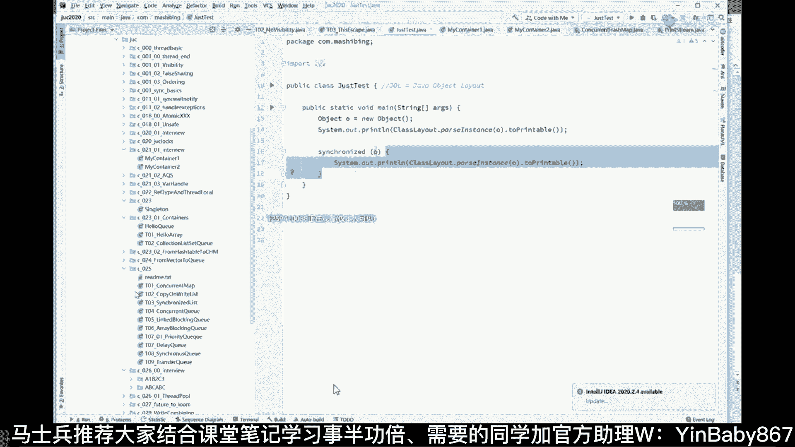

信号量啊，这是那个阻塞队列哪节来着嗯，基本上是这个啊，SAMHK呃，就是说多个线程是可以的啊，是是没问题的，呃我告我可以告诉你啊，在JDK的早期呃，基本上就只有他一个，只有这一把互斥锁，别的锁都用不了。

只有这一把互斥锁，后来呢为了增强锁的一些效率，我们就提到性能了啊，为了增强性能，为了提高一些功能才诞生了这个包，这个包叫JUC，它的全称呢实际上叫做这个这个东西。

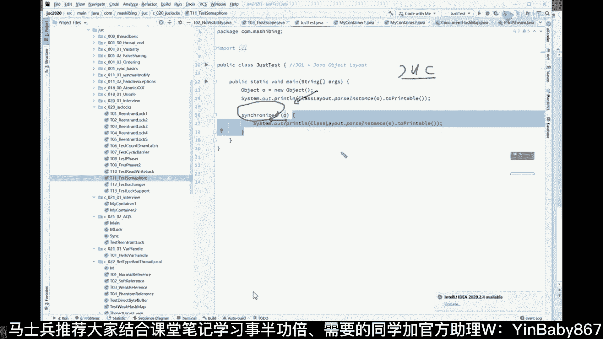

叫java utility功能。

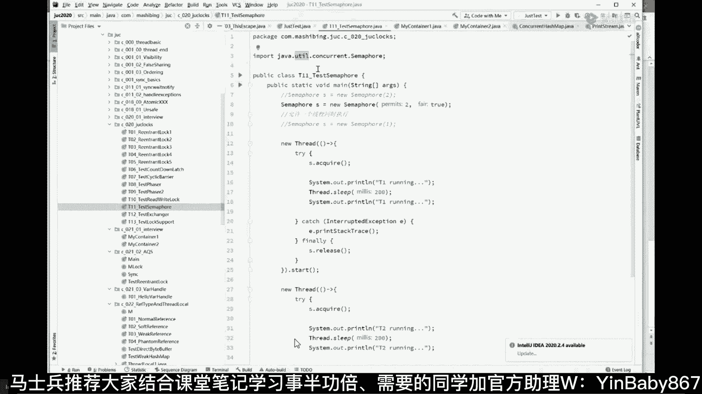

Concurrent，并发包，在并发包里面呢有很多很多新的所所诞生。

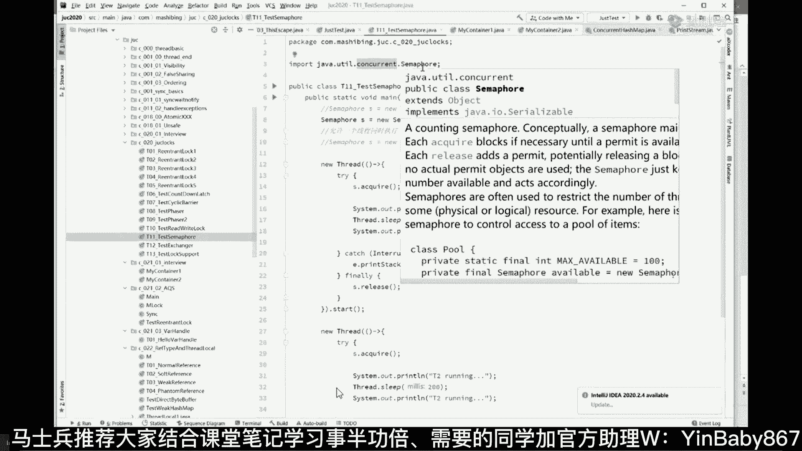

好吧，什么诞生起来的，我今天尝试着呢给大家伙聊，聊清楚这个历史也聊清楚呢，所谓的JUC它的本质是什么，我们不是说学东西学框架吗，我们先把它的本质给他了解透了，其他的万变不离其宗。

你学习起来就方便了好多好多好，那么大家呢嗯认真听这件事啊，就是我们还回到刚才的那个那个那个嗯。

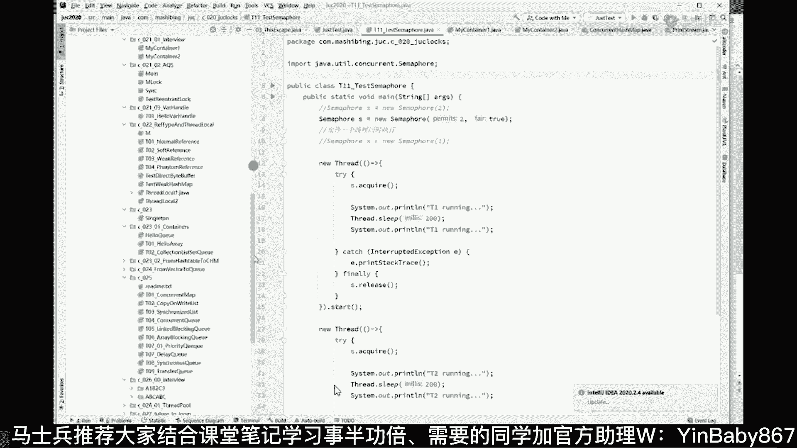

synchronized这件事，呃总而言之呢，你以后再见到synchronized的，你就不要说什么同步了，就不要说这个了，你脑子里头只要反映一件事，说我持有了这把锁之后，只有我自己能做。

我从原来的并发变成了序列化，一定记住这一点，你从并发变成序列的话，你就琢磨这事儿，它的效能效率一定是降低了，肯定是降低了，所以你要尽可量的让这部分呢执行的更快一些，就相当于你的响应时间会更提高的。

更更更更更更快一些，你的吞吐量自然就高了，这也是性能优化的一部分啊，O呃那么我们讲到这儿呢，我们就聊这个synchronized的东西，关于SYCHRONIZED，它的本质是非常非常多。

两个小时之内一定是讲不完我，我给我给他大家聊，最重要的一点，好好好好听我讲啊，SYNCHRONT这玩意儿为什么有了这玩意之后，后面又诞生了JUC，为什么，原因是什么。

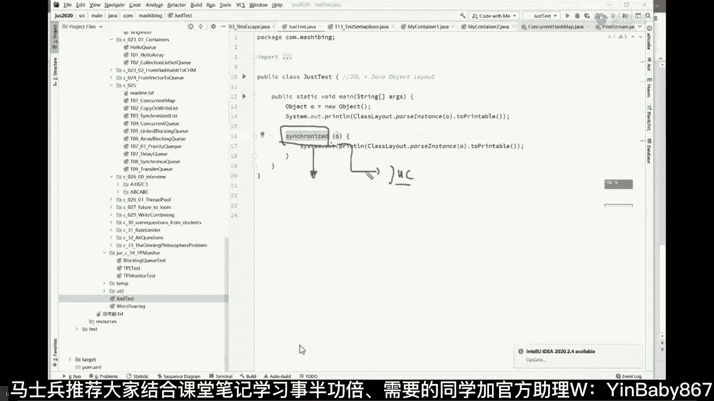

原因是SYNCHRONT这玩意本质上它是一把悲观锁。

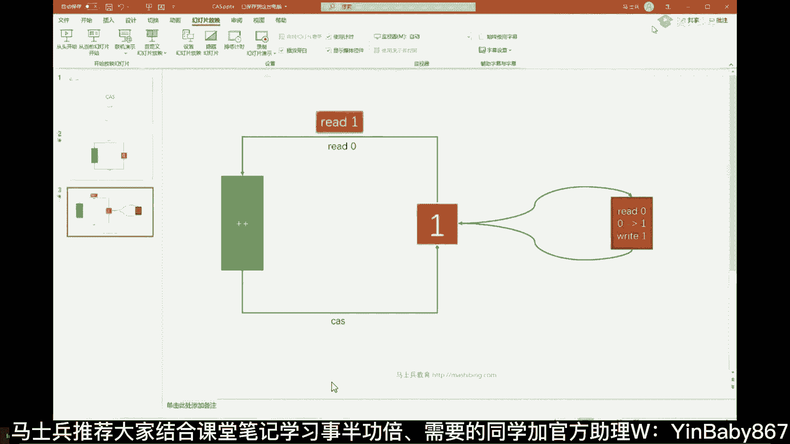

Ok。

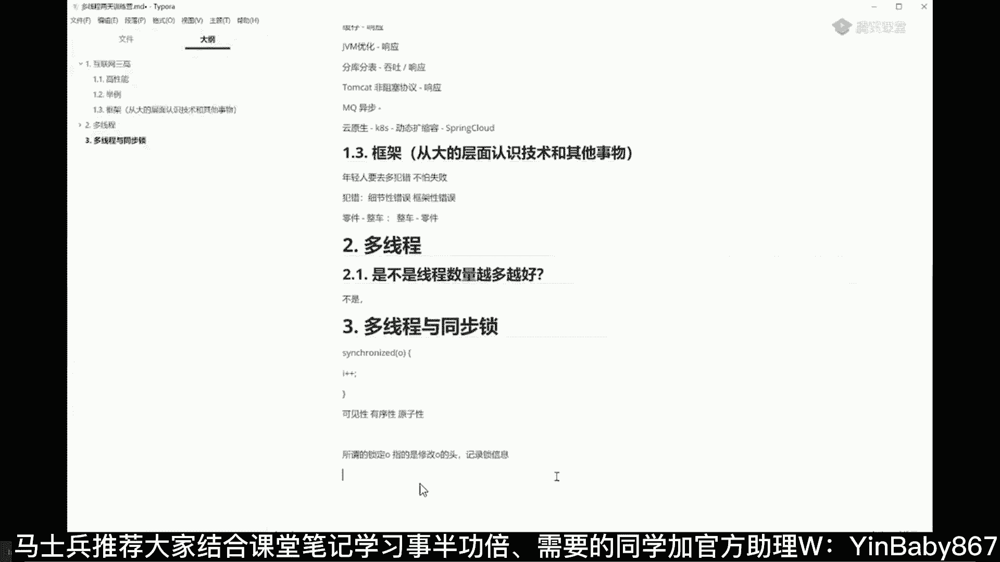

synchronized的本质是一把悲观锁。

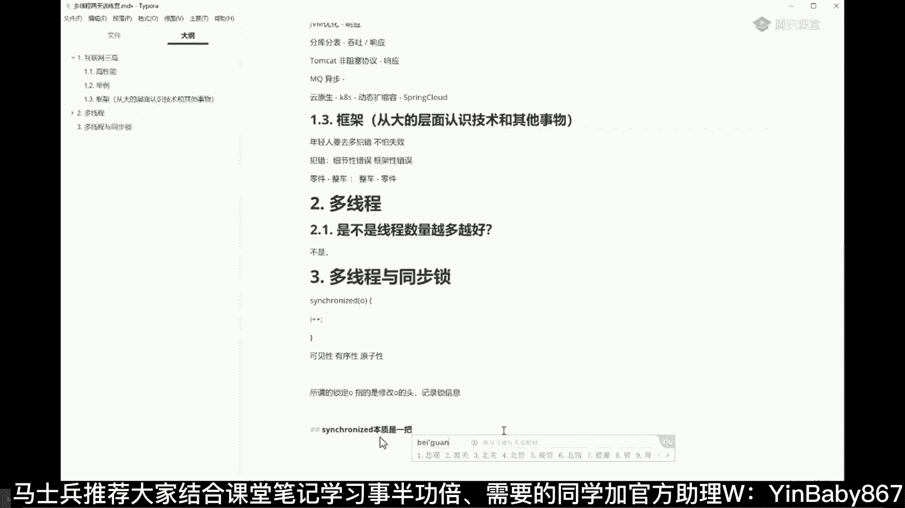

这是啥意思，有同学说了，怎么又出来了，悲观锁，乐观锁了啊，对没错，所有好多好多种，有全局所局部所有分段的所有悲观锁，乐观锁，有读写锁啊，有只读锁是吧，有可解锁，有多个拥有多个多。

可以可以跑好多好多现成的这种信号量啊，也有可以说好多线程一块，同时开始跑的这个栅栏等等，特别特别多，但是synchronized最早的那把锁，这个东西本质上是一把悲观锁，什么叫悲观锁。

悲观锁的概念就是同学们，你们琢磨一下，我要进去拉便便，很难便便，举例子只有一坑位，我要进去拉便便，一定有人跟我抢吗，不一定吧，啊你自己一个人在家在里面拉便便，一定一定有人跟你抢吗，没有啊，不一定啊。

是不是不一定有人跟你抢，既然不一定有人跟你抢，你一定有必要把那门锁上吗，这块能听懂吗，能听明白，给老师扣个一，就是说所谓的悲观所指的意思是说，虽然不一定有人跟我抢，但是我上来二话不说把锁锁上。

虽然不一定有人跟我抢锁，但是我也要锁定，没必要啊，你家里就你一个人，你锁什么锁，你锁锁，你自己琢磨，你锁锁这个东西不就是修改一个对象的头吗，你修改头不需要消耗你的CPU资源啊，不需要消耗你的时间呀。

他也需要，对不对，所以呢这个东西有没有人跟我抢，我也要锁定，实际上它的效率本身就不高，这块我能大家能听懂吗，能听懂给老师扣一，我再说一遍，就是不管有没有人，你都要上诉你，这个效率本身就不高吧。

那我能不能够做到说我不上锁，不上锁行不行，那有没有同学告诉我不上座行不行。

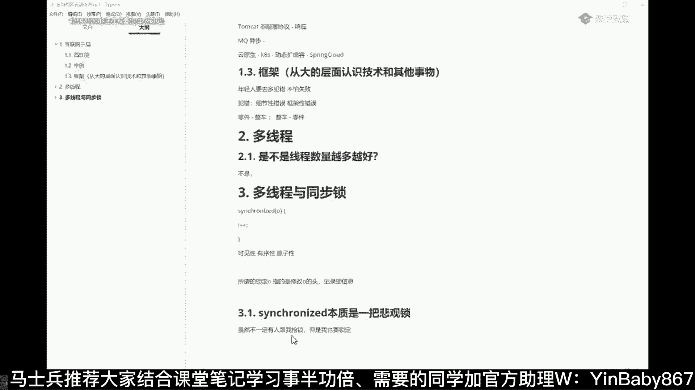

不上锁肯定不行。

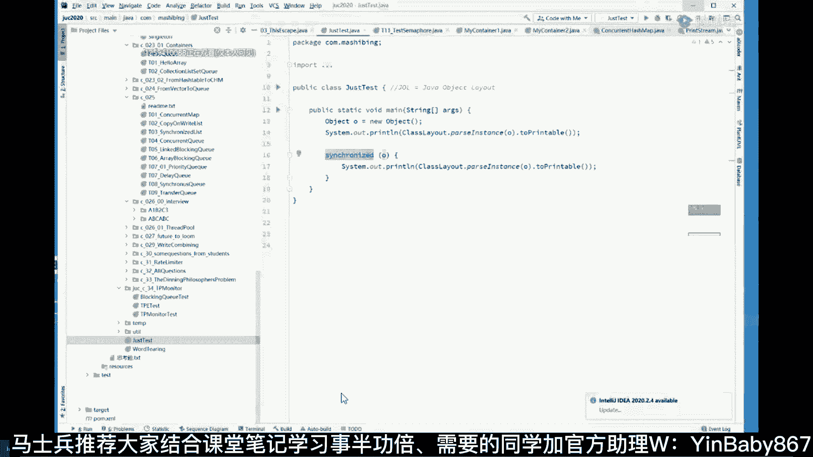

万一有人锁呢，万一有人跟你抢，你正跟里边拉的欢。

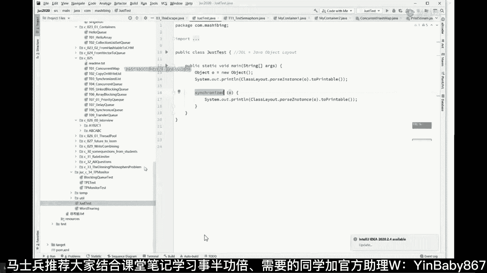

突然一堆人跑进来，所有的屁股围着你的屁股，然后扑哧扑哧不合适是吧。

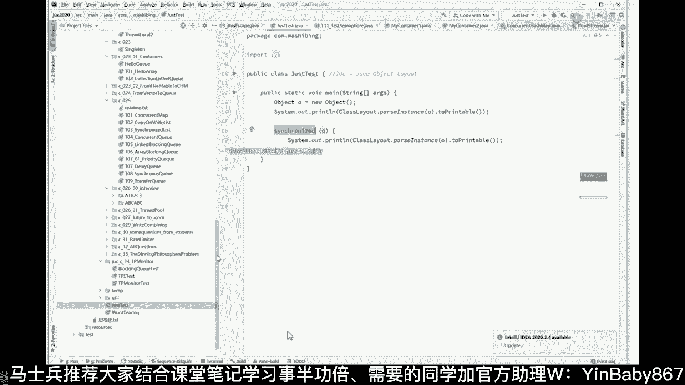

哎这肯定不合适，那么有没有一种我们不上锁，也能解决问题的办法呢，答案是有的，这个东西叫乐观锁，当然乐观锁的具体的实现，一般我们称之为叫CAS啊，嗯这是JUC的本质。

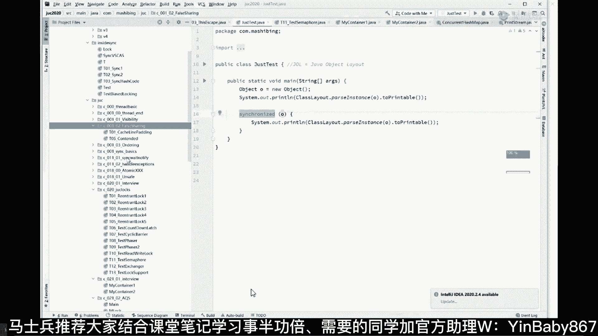

听我说JUC所有的锁，基本上JUC里面所有的锁替代，synchronized这种的reaction log啊，包括后面的countdown，Lch，Seliberria phase。

Rewrite log，Sumricks changer，除了LOCKPORT以外，所有的其他所本质上全是乐观锁的实现，全是CAS的实现，嗯那么为了聊了聊清楚这件事呢。

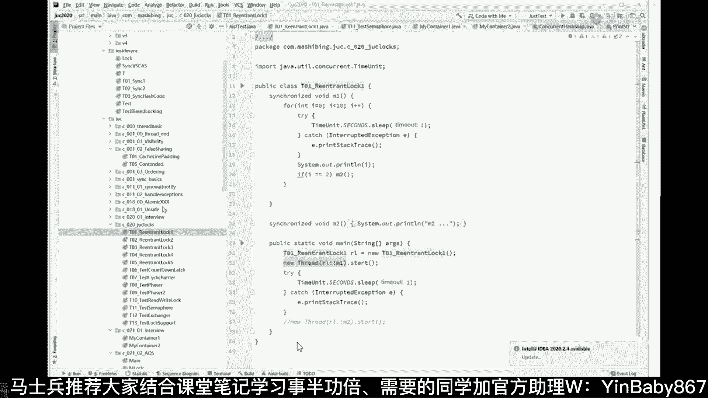

我看看啊。

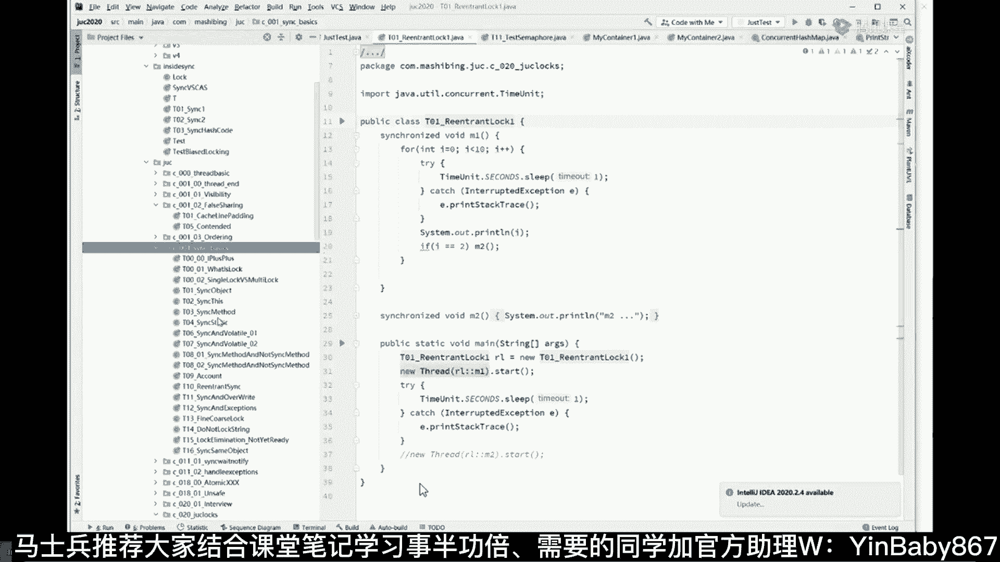

我们拿这东西来举例子吧，嗯大家听我说。

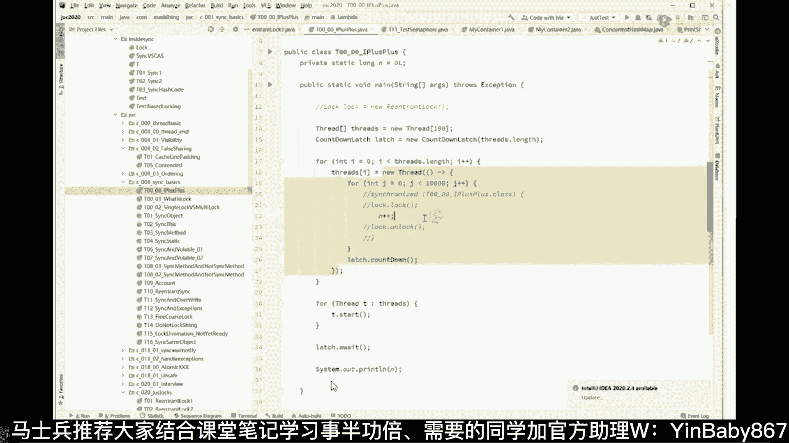

这是一个最简单的案例，像很多同学呢学学学java的时候，就一定是了解过，就是我们有一直最开始是零。

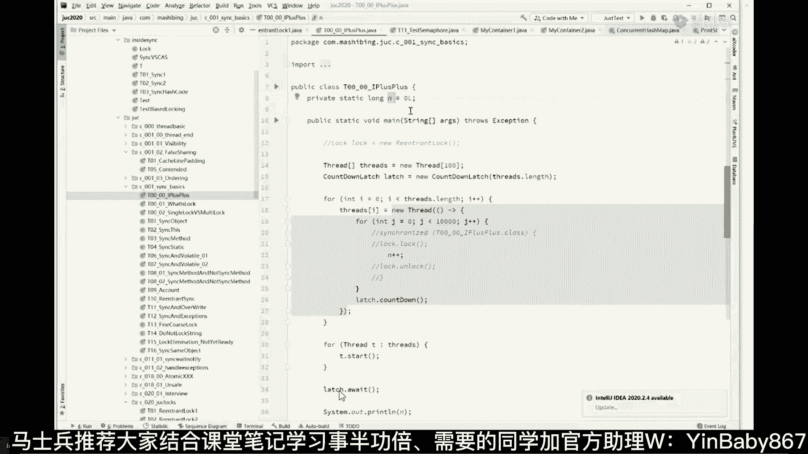

然后呢我起了好多线程，每个线程里面给他加了1万次，起了100个线程，100个，每个线程给他加了1万次，正常的结果是100万。

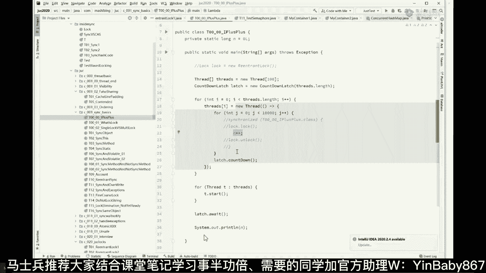

但一定是100万吗，不上锁肯定不行，你看不上锁的话，3万多再跑一遍，不上锁3万多，为什么会这样，很简单，是因为如果你不上锁的话，有一个线程这里如果是八，你把这八拿走了，改成九。

另外一个线程也把这八读走了，改成九，另外一个线程也把这八度了改成九，然后每个线程都往回写，写了九这个九我把它覆盖了九，这个九我把它覆盖了九，加了三次，一共加了三次，最后呢这个结果只加了一。

产生这个问题的主要的问题就是由于什么呢，我有一个线程读过来之后，在正在加的过程中被另外一个线程打断了，另外一个线程已经把这个八改成九了，所以大家应该都知道怎么解决这个问题，怎么让他得到结果。

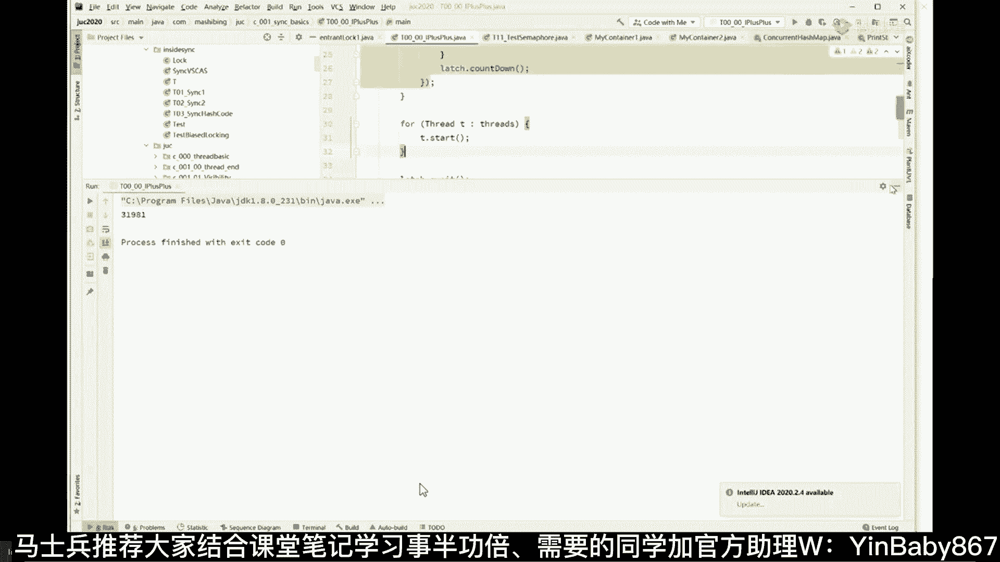

100万很简单嘛，上锁嘛，所以呢我就来了，把锁synchronized。

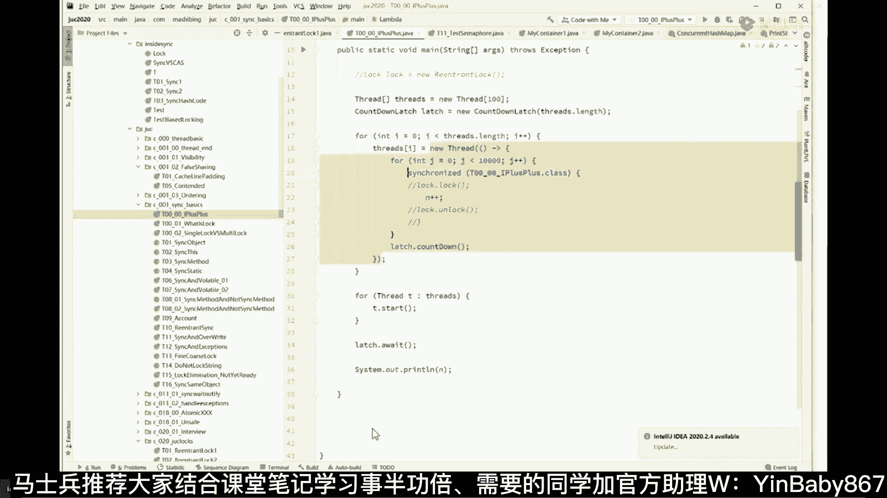

OK来了，把锁跑一下，看最后结果一定是100万。

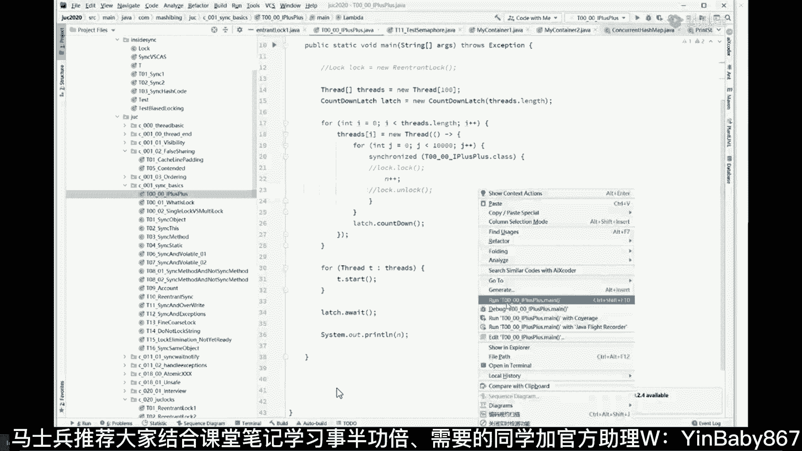

100万，为什么上锁能解决啊，因为很简单呀，你们分析我们刚才的那个所说的，我们持有这把锁之后，有一个线程加完了，另外一个线程才可以加，才可以加，才可以加，才读这个新的值，才可以加，读这个新的值才可以加。

所以这玩意儿最后的结果一定就是对的，我一个线程做的时候，另外一个线程不许不许操作，但是这把锁叫悲观锁，我说过了。

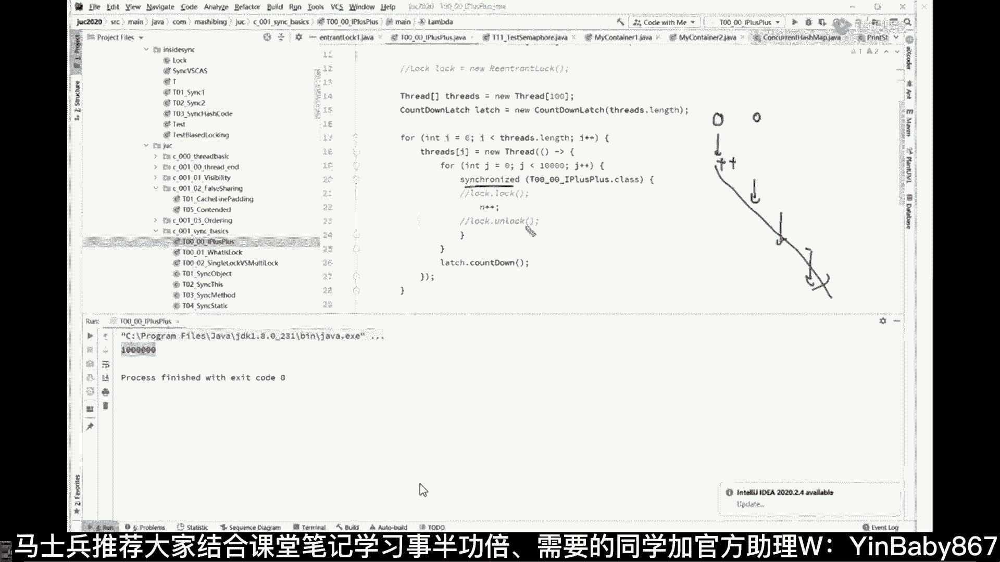

我我才不管你有没有人打断，我。