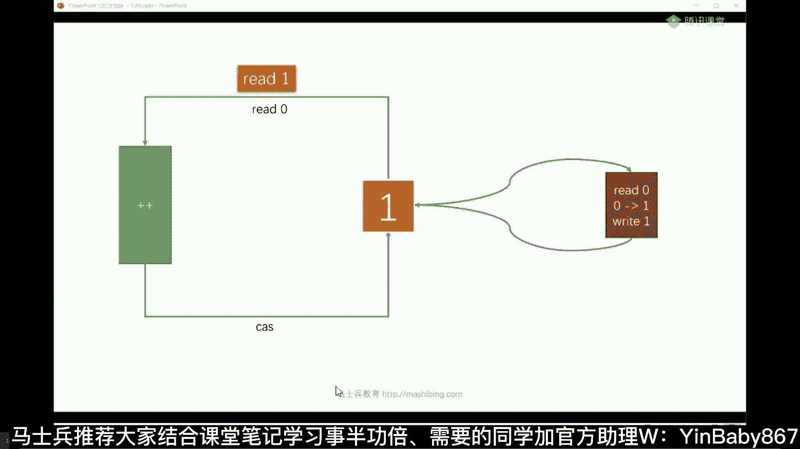
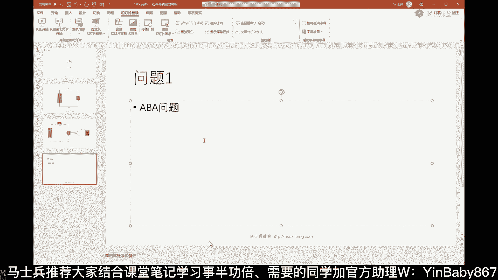
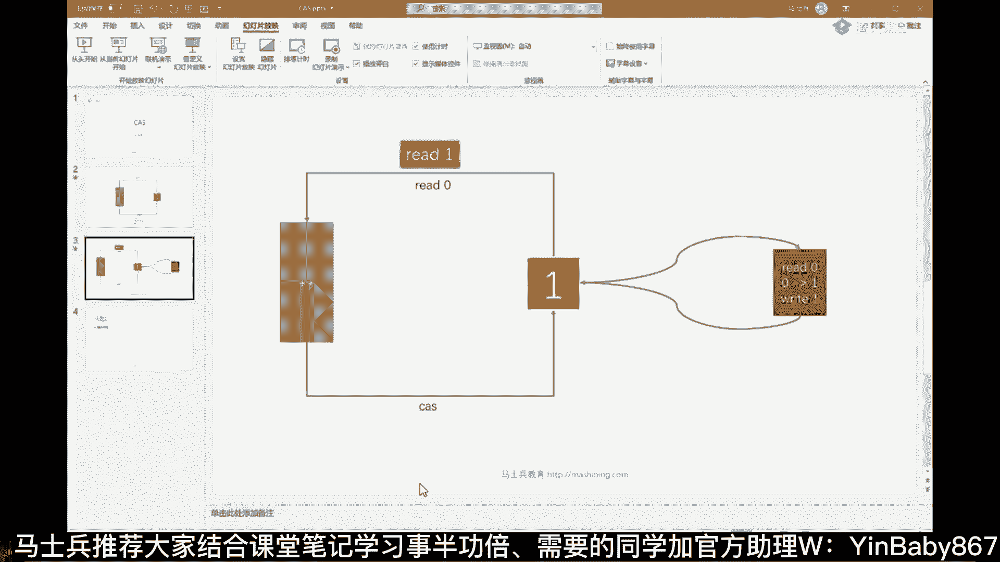
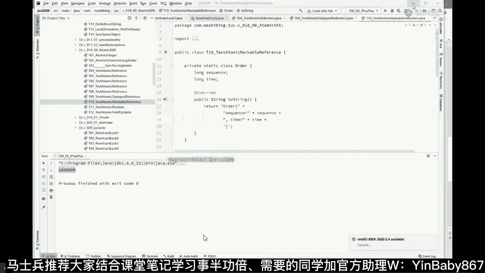
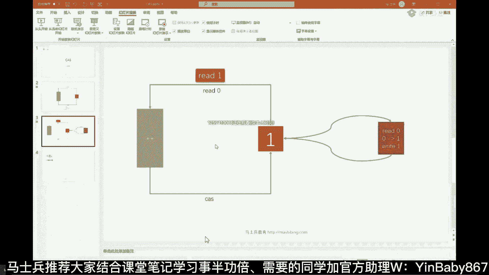
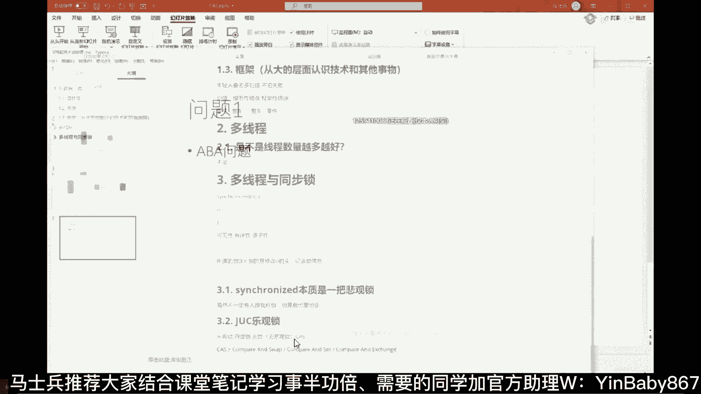
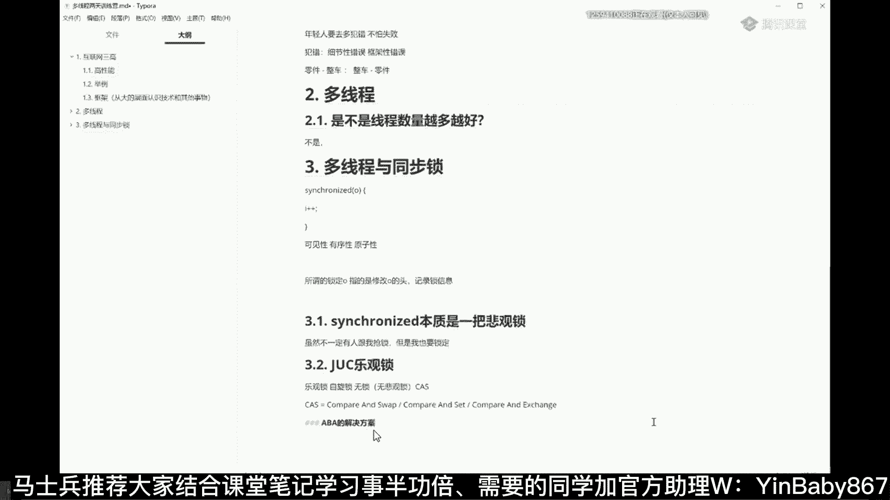
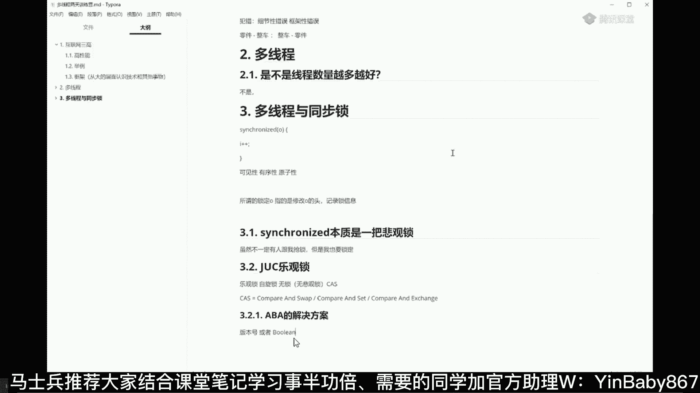

# 马士兵教育MCA4.0架构师课程 - P20：20、ABA问题 - 马士兵学堂 - BV1E34y1w773

我们先说这个cs的第一个问题啊，cs有一个致命的问题，这个问题呢叫做就是凡是问到你cs自旋锁，乐观锁一定会问你这个问题，问题一，这个问题是什么呢，ABA问题，这是著名的著名的问题。

这个AABA问题是什么概念，其实很简单，就是同学们你们琢磨一下啊，如果我把这个一读走，然后我翻回头来的时候，做修改的时候，我判断诶哥们儿，你是不是依然唯一啊，唉确实他依然唯一。

但是这个一很可能在中间经历了一些别的事儿，怎么经历的呢，有可能有一个线程把这个一改成了八，另外一个线程把这个八又改回成了一，所以此一非彼一能听懂吗，再说一遍，ABA问题指的是什么呢。

在我修改这个值的过程之中，虽然我判断它依然为一，但是这个一有可能是从一改成了八，又回又八，回到了一，这个过程虽然看上去还是个一，但实际上被别人改过，这个东西呢叫做ABA问题，因为从1~8又回到了一。

这叫A改成了B，又回到了A叫ABA问题，来get到这个问题的，给老师扣一，当然咱们现在这个小例子呀，没别的问题，我们不在乎哈，简单直基础类型，你说这个一跟那个一到底有啥区别，没关系啊，没问题啊。

但是如果这是一个引用类型就完蛋了，这是个引用类型，中间指向了别的对象，后来又回到原来对象了，中间指向别的对象的时候，你这个属性改变了，其中的某个属性改了，那完蛋了，中间就有可能产生问题，能听懂吗。

所以这玩意就看你在乎不在乎，如果你在乎这时候怎么办，解决ABA问题，怎么解决JDK呢。

给你提供了各种各样的解决方案，好吧嗯，看我在哪讲的啊，On safe，看这里，比如说这种atomic reference啊，就这种东西是专门解决ABA问题的，Atomic reference。

如果你呃呃呃呃呃，中间有一个那个那个引用类型被指向了别的了，中间或者说它的属性变了，这时候就会产生ABA问题，那么怎么解决呢，它提供了两种方案。

第一种呢叫stamp reference standard reversion，指的是什么，就加个版本号，某一个内容被人改过一次之后呢，旁边还记录了一版本号，改一次版本号加一，改一次版本号加一。

如果你读的时候，这个版本号为一，回来的时候发现版本号为十，说明被人动过了，看你在乎不在乎，不在乎就算了，这是你的女朋友，这是你的男朋友吧，boyfriend好，然后你出差了。

回来之后呢发现依然是你的男朋友，但是你不太放心，你这个时候呢在他脑门上记录了一个版本号，你走的时候是1。0，回来的时候是99。0，说明什么，说明被人动过了，这时候就看你在乎还是不在乎，能听懂吗。

就是你回来的时候，9。0你该怎么处理，是你自己的事情啊，OK这个东西就可以理解为叫stamped reference，里面记录着一个邮戳版本号，当然当然，除了呃用版本号来解决之外。

还有一种这种叫markable reference，那么这种叫是什么意思呢，其实这种的呃用法呢是叫做用布尔类型来代表，简单说这是你的男朋友，在你离开了之后，他从1。0到了99。0，你这人的容纳度比较高。

只要100以下，我不在乎，OK那你就用这个就可以了，但是呢有的人一次都不行，你完全可以用布尔类型，走的时候为true，回来的时候为false，说明中间被人改过改我我才不管他改多少次。

改一次我都受不了干掉，所以两种一种是记录版本，一种是记录布尔类型。

详细的我就不给大家演示了，嗯好理解吧。

是不是很简单，所以ABA问题这件事情比较容易理解啊，要记一下。

A别问题的解决方案。

版本号或者布尔类型，Ok。

来这块儿能听懂的老师扣一。