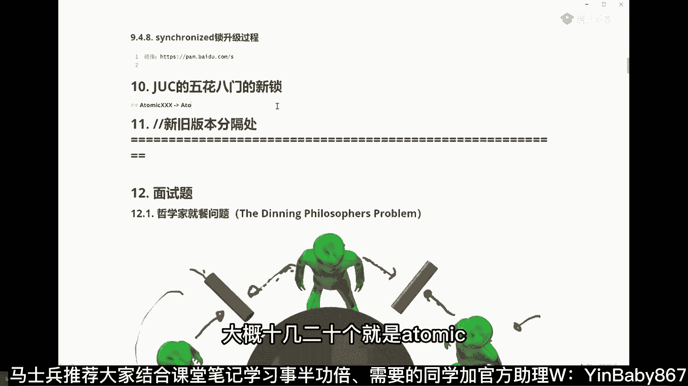
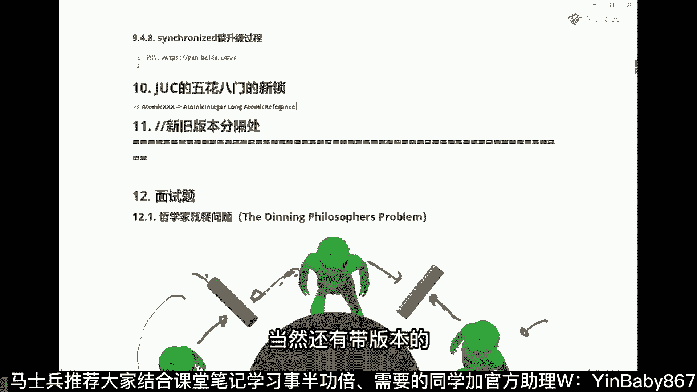
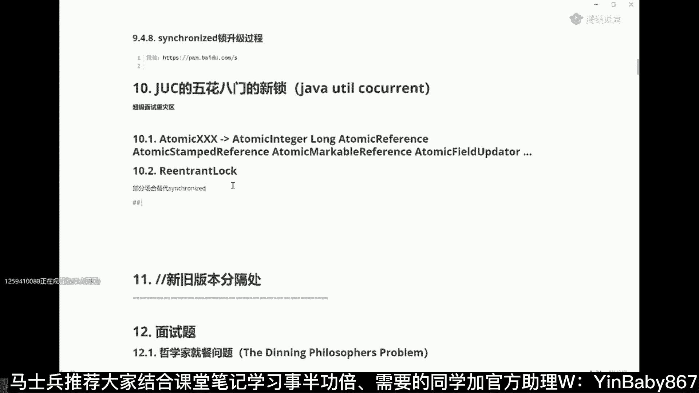
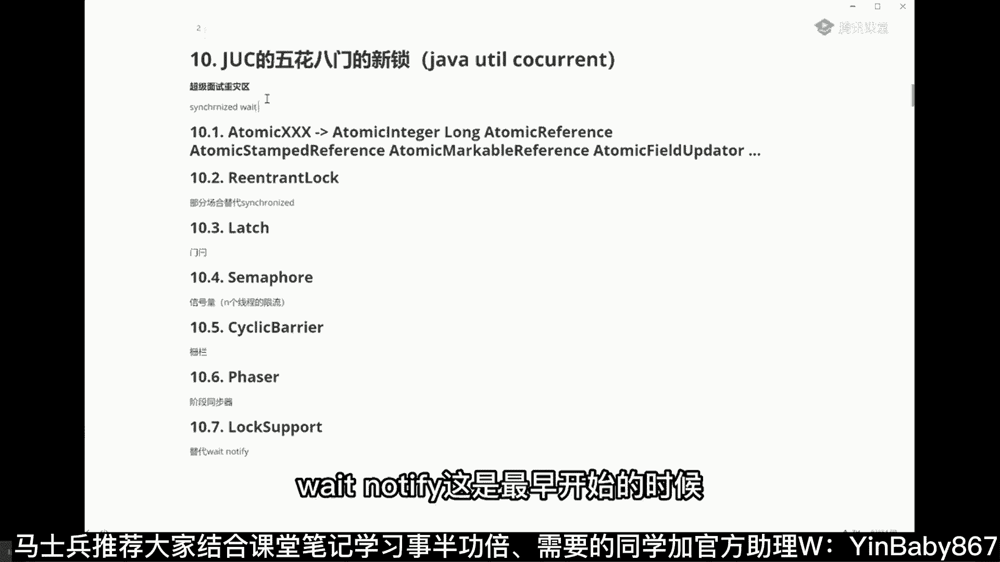

# 系列 5：P23：23、JUC五花八门的新锁 - 马士兵学堂 - BV1E34y1w773

JUC的新锁啊，我们来聊这个这个东西。

嗯这里面其实有好多好多东西了啊，我先给大家介绍一下。

就是所谓的锁是什么东西。

就是原来我们想给某一个东西，给线程做同步，给某个东西上锁。

我们一般是用这个关键词，这个大家应该知道叫synchronized，但JDK1。5之后推出了很多很多的新型的。

所弥补了很多synchronized的不足之处。

呃这东西包括哪些呢，我给大家列几个啊，就比如说啊。

我们可以用and atomic相关的一些各种各样的类，atomic相关的包括什么呢。

呃这个就太多了，大概十几20个就是atomic。

什么integer是吧，Atomic long，atomic bullet等等等等等等。

就是那些基础数据类型在这全有啊。

atomic double等等，当然还有什么呢，还有atomic，比如叫reference，这是什么呀，这是用原子性的来呃。

Reference reference。

用原子性的操作呢去更新引用的是吧，当然还有带版本的。

为什么要带版本呢，因为这里面用到的全是cs操作。

这个东西叫atomic。

Stamped reference，当然还有那个简单的版本号啊。

叫atomic markable reference是吧，还有什么呢。

atomic更新，我们的用原原子性的来更新，我们自己的一个成员变量的属性的嗯。

Atomic field。

啊等等等等。

这个非常多啊，来这块需要我详细的需要我说吗。

我觉得这个应该应该不用吧，这个应该是是是是是嗯，比较简单的一个内容啊。

嗯JUC是啥是吧，对JUC是啥呢，JUC呢是这个叫做java，detail can current这个包啊。

这包下面所包含的一些新的锁。

大家平时写程序，写线程的时候，说给县城上上个锁。

怎么拿拿什么上，就是synchronized，但是synchronized它本身有好多的局限。

另外呢它用起来也不是特别灵活，不能适用所有的场景，或者所有的场景用起来写起来特别复杂。

但在这种情况下呢，嗯在DK1。5之后，JUC添加了很多很多新式的。

各种各样的花样的锁，这个也是面试的超级的重灾区。

我跟我跟大家说一下啊，这是超级面试重灾区。

就多线程这件事。

多线程这件事，基本上就是超级面试的一个重灾区啊。

我先把这块先给大家列出来，列出来之后呢，我们慢慢的在跟大家聊。

下面还有什么，比如说还有什么呢，嗯各种各样的新的锁啊，比如像替代，比如这个reaction lock是用来干嘛的呀。

替代，在在某些情形下啊，替代synchronized。

部分场合替代synchronized是吧。

还有什么，比如这个latch。

这是门栓是吧。

比如还有什么嗯，Semh。

这个是什么呢，这个叫信号量，这是N个N个现成的限流。

哈哈你可以这么来理解，比如啊还有什么呢。

嗯大家知道的可以跟我说一下啊。

你们可以敲敲试，上次面了一个10年的java，只会搞CRUD。

那好吧，比如CLI，cyclic barrier是吧嗯，这是什么呢，就是栅栏，比如什么呢，还有什么HASER，这是阶段同步器。

比如还有什么lock support。

这个是用来替代什么的呀，这个是用来替代我们的weight。

Wait notify。

用来替代这个的synchronized。

Wait notify，Synchronize them。

Which notify。

这是最早开始的时候，做线程同步必须要掌握的机制。

不能叫老的，这叫经典同步机制，是吧，还有吗，比如EXCHANGER。

这个相当于呢就算是一个嗯交换器啊。

让它同步同步交换器。

嗯比如还有什么呀，嗯嗯差不多了啊，差不多了，就是现在JDK自带的大概也就也就这么多了。

除了JDK自带的之外。

就说这些个新的玩意儿啊，是靠什么东西写出来的呢，这新的玩意呢你听我说啊。

两个东西啊，CKCS和EQS就这两个概念搞清楚了，你的心的锁就能透彻理解它的原理了，cs加上AQS这两个概念是什么概念。

就是说同步锁的原理，新型同步锁，原理包括哪些呀，原理就包括两个大项就可以了，cs啊，加上AQS，当然肯定要加什么volatile了这一类的啊，这个因为相对简单。

cs是什么cs呢，就是，Compare and swap，乐观自旋锁，乐观锁是吧嗯。

呃用户空间，解决问题啊，那个怎么能用文件，就是JVM自己解决问题，这版本自身解决问题啊，他是不需要。

操作系统老大的调度自己就能调度了嗯。

AQS是什么呢。

AQS叫做写这些锁的最根本的一个工具。

一个基础的类库，这里面还涉及到一个设计模式。

这个设计模式呢叫template method，如果你跟那个面试官要聊到这种程度啊。

我跟你说想要个什么30万50万的，你要就是了啊。

它叫做abstract，Synchronizer，Abstract cute synchronizer。

这东西是一个基础的同步器。

这么来理解这个玩意儿。

由他是可以写出来这种各种各样，各种各样各种各样类型的锁啊。

这些锁的最底层的核心都是他，那么你通过他呢也可以。

你自己想想，自己写自己这种类型的锁也可以的啊。

你想说那个只能两个两个执行，只能是三点执行。

像这一类的索尼完全可以可以用它来做，门栓等于门栓，你说的很对。

嗯正式版刻的多线程看起来太麻烦了，这个没有办法呀。

我跟你说多线程就是它本身呃东西比较琐碎，然后你还面试面来面去，面来面去，必须得做一些，我在第二版里头，会会帮大家做一些更深入的总结，会更会稍微爽一些啊，嗯大概呢基本上就就就就这么多东西啊。

就是新鲜的，我们今天看吧。

