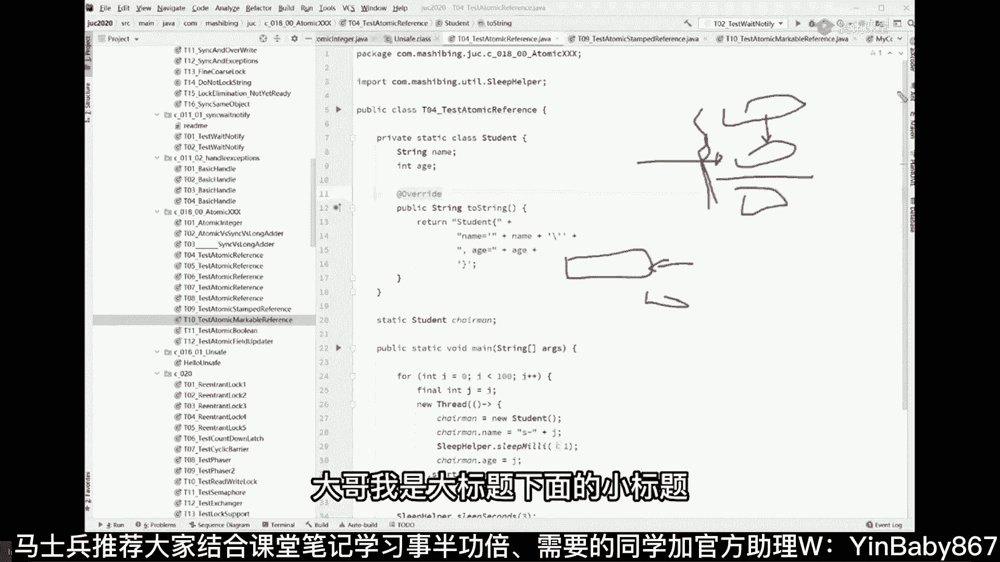
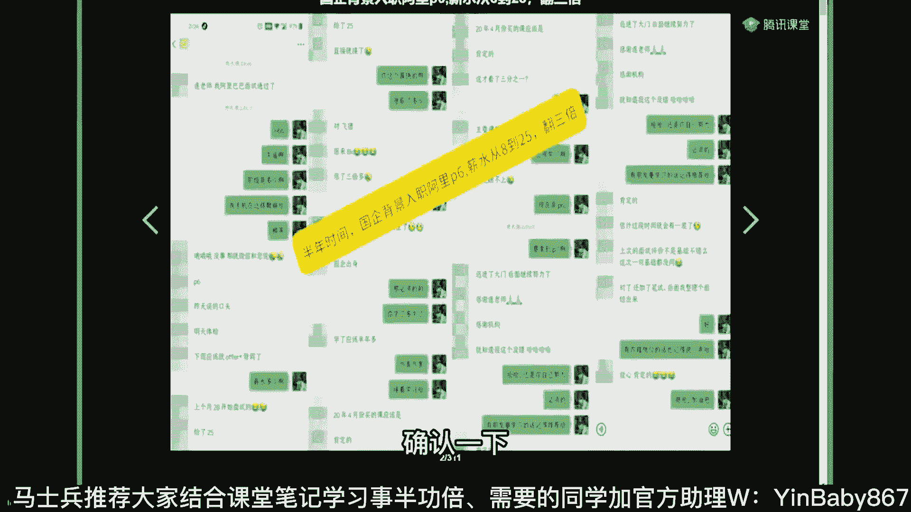
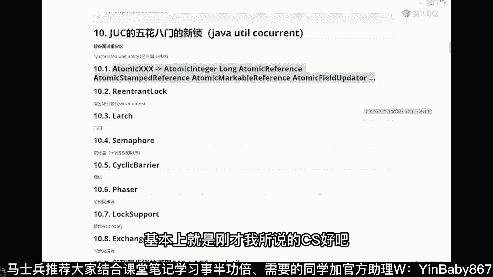

# 系列 5：P24：24、常见的Atomic CAS锁 - 马士兵学堂 - BV1E34y1w773

呃先讲一点比较简单的，像这种atomic，听我说啊，atomic这个东西叫做原子更新，我先讲点入入入门性的东西啊，就原子更新是个什么概念嗯，atomic atomic integer吧。

我们来看这个小例子就行了，比如设计最简单，有多线程啊，对一个数字往上往上做递增，那么大家应该都知道，如果你不上锁的话，这个数字最后得到的结果一定是不对的，但是不上锁也可以。

就是不上那种老的那种synchronized的锁，其实也可以用什么来做呢，用atomic integer或者atomic la，那么它里面的操作呢，这个东西是可以具备原子性的，它是具备原子性的。

Increed get，他为什么不具备原子性呢，当我们点进去它的时候，你会知道看一眼这里他用到了底层的一些操作，好这些操作主要的操作是什么呢，就是这个操作这个操作叫compare and swap。

In compare and swap，就叫做CAS操作，就叫CAS操，作，好这个cs操作呢，因为这种这个课呀我大概讲过好多好多遍了，我就是稍微给大家复习一下，有多少同学是不了解cs。

我要简单给大家介绍一下CAS，吐着天线宝宝是吧，好不知道cs的小伙伴啊，我大概快速的给你们介绍一下这个概念，先去了解它，think没调汇编指令，哪个都会调汇编指令好看，这里你像原来的话。

当我们对这个数字进行一个递增的时候，比他原来是一给他做一个加加操作，我们就给他上把锁就可以了，锁定啊，这个锁不好画是吧，哎这是一把锁给他锁上，咔嚓给他一锁，然后在我做这个操作的过程中，其他线程不许打断。

我持有这把锁的线程才有权去做加加操作，这是一种这种其实叫悲观锁，叫二话不说，我先给你，我就认为你中间有可能会打断我，所以二话不说我先上锁，而CS操作是一种乐观锁，CAS操作是乐观锁，乐观锁是什么概念呢。

看这里啊，他原来是个一，我这线程呢就把它拿回来，拿过来之后给他改成二，然后往回写的过程之中，这个时候做一个cs compare比较比较什么呢，比较一下哥们，你现在被我拿走的这段期间有没有被人改过。

我乐观的认为你不会被人改过，你依然还是那个一再说一遍啊，就是说我把这个一拿走改成二，再往回写的过程中比较一下哥们，你是不是依然还是那个一，您没变，如果我看一眼啊，您这个值现在依然还是那个一。

那我就把你改成二，这叫做比较，并且设置，那有同学说老师这东西没上锁，它能保证原子性吗，可以保证的，你琢磨琢磨这件事，如果你你你往回写的过程中发现哎哥们，你确实依然还是那个一是吧，那我给你把它改成二。

这不很正常吗，那说明你没被人动过呀，那现在问题是呢，如果被人改了怎么办啊，这这块还能跟上，对不对啊，如果被人被人改了怎么办，如果被人改了，比方说他也改成八了，那没关系啊，就把这八拿过来。

八拿过来改成九对吧，加加嘛加加操作，把九往回写的过程中比较一下，哎哥们儿，你是不是依然还是那个八，如果你是八，把你改成九，如果你是80，没有没有没有被人改过，是吧，这块能跟上啊，有人说了，又被人改过了。

改成12了，没关系，把12拿过来改成13，反正往回写的时候我都比较一下，看看哥们儿，你是不是依然是我期望的那个纸，来这块能能get到的老师扣一没问题吧，当然cs呢有两大核心问题。

cs有两大核心问题的重灾区，第一个最重要的核心的问题呢叫做，如果说你离开了，把这个一拿走改成二，返回了头来的时候，看到的确实是这个一，但是此一非彼一，很有可能这个一啊在你拿走改成二的过程中。

被另外的线程拿走，改成了八，后来又被别的线程把从又从八改回成了一，所以它中间有一个1~8到一的过程，虽然你看到的是这个一，你你读的最开始独走的是这个意义，但是实际上这两个一本质上是有区别。

因为中间经历了一个状态，这个AABA问题，这个问题是必须你你面试要对答如流的好吧，ABA问题，ABA问题，第一个呢看你在不在乎你女朋友离开，你经历了别的男人，当你回来，你发现还是他，但此他非彼。

他就看你在不在乎，如果你不在乎的话，就像这个一这个一跟这个一有啥区别，你不在乎不在乎没有关系啊，那就放过他吧，也放过自己呃，直接该怎么操作怎么操作就行了，那么如果你比较比较在乎你怎么做呢。

这个时候用的东西呢叫做叫做atomic reference，也叫做atomic stamp reference，stamp的意思是加个标记，加个标记，Atomic stamp reference。

你要拿它的时候，需要拿版本号的，知道吧，就是你需要你拿它或者往里设置它的时候，需要设版本号，比方说最初始的版本号是零，那么每一次都会往上递增，initial step等于是零，每次都要往上递增。

经历过一个男人脑门上写了个一，再经历过一个写了二，再经历过一个写了三，当你回来看脑门上写了1万，你就知道中间经历了一些事情，就看你在不在乎了，好吧，你要在乎的话呢，脑门上贴版本号来这块概念能听懂的。

给老师扣个一，嗯嗯明白这件事情之后呢，我们再来琢磨一件事，如果有的时候我只在乎改过或者没改过，动过或者没动过，而不在乎说到底动了多少次好，这个时候怎么做呢，也可以用另外一种呃加版本号的东西。

这种版本号的东西叫什么呢，叫MARKABLE，叫atomic markable reference，而这东西呢你只要说初始值给他一个false，只要有人改了，它就会它就会变成true了。

所以当你回来发现脑门上原来写的false，变成了true啊，说明你女朋友已经是真正的真正的女人了，是不是就这意思啊，至于说多少多少多少个或者多少次，你不在乎，你只要做一个布尔类型的标记就可以了。

这是另外一种解决方案嗯，当然代码那我就不给你详细看了，其原理是非常的简单的，你明白了原理之后，看代码就比较简单，所以我刚才讲了两个东西啊，第一个是cs的概念，第二个呢是。

cs所带来的ABA问题怎么解决好，我们现在来聊第三个问题啊，第三个问题我就不想细聊了，因为这东西我要讲起来一个小时以上，就是好好听我讲啊，你你琢磨琢磨琢磨这件事，就是在你比较并交换的时候被打断了。

怎么办，刚才我看有同学已经问出来了，还会还是说这个问题一咔咔咔咔咔哎，变成二二，写回去的过程呢，大概用维码来模拟的话，就是这样的啊，看看哥们儿，你这个值是不是依然等于一呀，如果你等于一的话。

我就把你设设为二了，实际上就这么一个操作，这个就是cs操作，如果不等于一，没有关系啦，来继续下一步了是吧，再重新读了，OK那好，这就是cs操作，但是你们琢磨琢磨过没有。

如果有另外的线程在这里把这两部分给打断了，我刚判断完V等于一，还没有把它设为V等于二的时候，另外一个线程把这个值直接给干掉，干成100了，结果您老人家把这100直接给设成二了，这肯定不是你想要的结果呀。

这块能理解吗，所以呢你要想完成CS操作，就是这里的操作必须要保证原子性，必须要保证原则性来并发编程三大特性，请给我读，并发编程三大特性，可见性，有序性，原子性，抽烟喝酒烫头。

当然这个东西的人是怎么保障的，这个东西的保障在于硬件的底层给你做了保障，我以前对这个呢做过深入的剖析，今天咱们主要讲应用层啊，咱们稍微放过自己，因为有好同学呢说老师，你这个公开课讲的有点难。

能不能来点简单和轻松一点的，完全没问题啊，咳，好嘞我我我就讲完cs的几大问题了，就说了cs的概念，ABA问题，硬件底层保障，原则性，听懂了吗，OK要喜欢男的是吧，那你肯定是女的了，水煮鱼啊。

那不是两个版本吗，你要是嫌嫌琐碎，你就你这个真是难伺候，我发现咱们学生真是真是难伺候啊，这个你知道为什么吗，因为有的人啊，他在腾讯课堂看的时候，他说一个版本一节课大概两个小时哇，老师我找东西找不着。

你知道吗，我中间讲了好多概念，我要拖动才能找到，然后我们第二版，剪成一段一小段一小段的，一小段一小段的，那你捡起来那个找起来就特别好找吗，水煮鱼说太琐碎，你锁什么叫琐碎，就是你找东西不更好找吗，水煮鱼。

我说大哥太难伺候了啊，别这样，你要是嫌那个什么去看那个腾讯课堂第一版，就你事儿多，不是不是不是这个意思啊，就是说呃我们呢是在做出努力，让咱们的VIP学员呢会更加的学起来，会更加的怎么说，体验感会更好。

别介别介别介，嘿嘿嘿停停停，就是我觉得啊我觉着我觉着小段比大段好，这是我的感觉，小段你可以选择，你可以选择听到这我就暂停了，我我我我一看标题，我就知道到哪了，大段的话呢不太不太方便啊，清晰明了。

而且他他就算在所说他有大的标题啊，大哥我是大标题下面的小标题。

咱别这样啊，你是我们VIP吧，确认一下。

这件事情是一堆的，我是大标题下面的小标题啊，这个这个这个看起来不更方便吗，德院长的第二版，这看起来不更方便吗，我现在正在更新，你像我这还有是吧，有大标题还有小标题，你找起来不更爽吗。

怎么会怎么会不如那个那个那个大段的呢，大哥，暴露了啊哈哈嗯好，我觉得这个体验应该会更好啊，大多数人应该会喜欢这个体验，来好了，我们继续啊，这里面所有用到的东西，基本上就是刚才我所说的cs。

