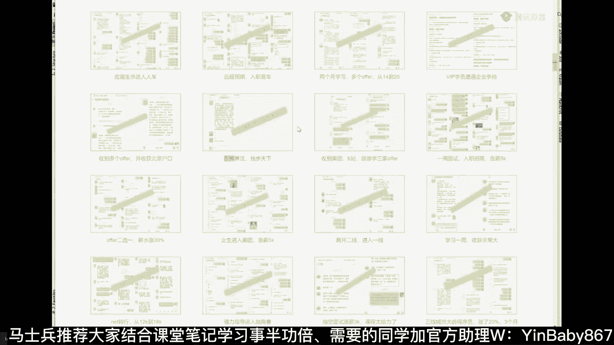
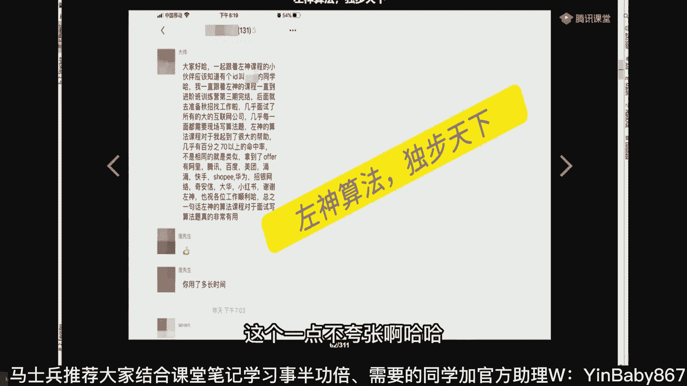
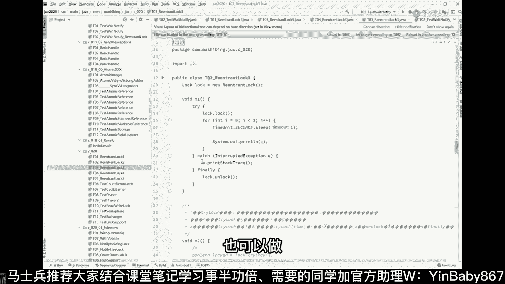

# 马士兵教育MCA4.0架构师课程 - P25：25、都是锁，为啥JUC就比synchronized牛一点儿 - 马士兵学堂 - BV1E34y1w773

还有我说了啊，我今天讲的东西呢偏应用一些呃，我不知道有多少人不了解这个旧的锁是什么，是什么机制，就是经典的这种同步机制，不能叫旧的，叫经典同步机制，Synchronized。

还有wait notify这种这种同步机制，这个大家应该应该应该都了解是吧，Synchronize，如果要细聊的话呢，那里边的问题讲四个小时差不多，有各种各样的应用级别的细节。

还有各种各样的底层原理的细节，我们呢今天主要来聊应用，关于关于synchronized，我大概写了十几个程序来帮你解释，SYCHRONIZED是什么意思呃，Synchronized。

当我们这么来写一个东西的时候，叫synchronized的O，那这小O代表什么，代表的就是你上厕所的时候持有的那把锁，这个跟你下面的操作没有直接的关联，synchronized小O下面一堆操作。

这代表什么呢，代表当多个线程去执行，都是执行这段代码的时候，同一时刻只有一个线程在运行，这叫互斥锁，互斥，我再说一遍，我就就就这块儿，大家伙应该应该是比较熟的啊，这块要互斥锁。

就是synchronized后面跟了个对象啊，甭管它是什么，就是这个对象被我们当成锁来使用了，你就想啊，我要进厕所，我肯定得把门给锁上，门上那把锁就是这个对象，这是synchronized的本质。

然后synchronized上完锁之后，下面会进行一系列操作啊，脱脱脱脱脱裤子坐下解手是吧，OK然后然后穿裤子啊，完事好，然后一系列的操作好，这一系列的操作是必须持有这把锁的情况下，才能够进行。

那么这带这是什么意思呢，这把锁叫互斥锁，互斥锁的意思是只能有一个县城，同一时刻，同一时刻只能有一个县城在执行下面这段操作，只有这个线程把下面这段操作执行完毕之后，另外一个线程拿到这个线程。

执行完之后的最新状态才可以，执行同一段代码，申请同一把锁好，这个线程执行完了才是下一个线程，所以这会把并发的问题做成序列化的问题，所以互斥锁的本质就是，这互斥锁的本质，就是把并发的问题改成序列化执行。

独占yes，那么如果下面呢就是这个护士所呢，只能有一个线程执行吧，如我可不可以有两个线程啊，可不可以有三个线程呢，OK如果允许多个线程在里面同时执行，比如N个一共有1万个线程。

只能允许十个线程在里面同时执行好，这个东西就叫信号量，叫sam for，这就是心锁之一，并行改穿行，Yes，miss那片海同步锁呢，这个就是同步锁，互斥锁就是我们俗称的同步锁，同步锁是同步的概念。

是由各种锁都可以做同步，像这些个都可以叫同步锁，只不过我们有好多人呢，就约定俗成的不去那个细究概念，就直接说啊，synchronized叫同步锁，好嘞，最基本的概念呢synchronized。

最基本的你搞清楚了，weight是什么意思，notify又是什么鬼，这个我不知道大家有没有同学知道，weight是什么意思，NOTI又是什么鬼，等待啊，等待的本意一定要理解清楚啊，嗯像这个小程序啊。

我们有我们把这个object当成一把锁，我们有一个线程持有这把锁，打印启动睡一秒钟，让他去wait，让他去wait，注意有很多人呢把这个weight理解成为O点weight，这意思是说让O去WEIT。

让O去wait，大错而特错，嗯讲点最基本的概念啊，跟大家说清楚，不是让O去WEO是什么呢，O是那把锁，你要进厕所了，你要锁定那把锁，让所谓的O点weight哎指的是什么呢。

一直打完结束在O上面wait又错了，还是不对，OOOO点weight指的是什么，认真听指的是在这把锁上面，其实他持有一个队列，同学们，你们琢磨一下，由于一个时刻只能有一个人进去拉屎。

那其他人拎着裤子在旁边轮不到我的时候，该怎么办好，这个时候我们可以调用锁点weight，指的是A索大人，请你把我安排到，等待着这把锁的那个队列里面去，包括这些啊，这哥们全是等待的，在里面等着等着干嘛呀。

排队吗，排队排着队，等这哥们儿出来了，下一哥们进去，这个叫O点weight，所以O点weight的前缘，这个全全全全面比较精确的描述叫什么，叫在这把锁的进入这把当前线程，让当前线程啊。

当前的线程当前线程是什么呀，不就这个线程吗，new new了这个thread吗，让当前线程进入到这把锁的等待队列，等待着被调度，来这块能get到的老师可以，liquid嗯，ADAMS拉库里是吧。

等待调用，那好读音，比如说嗯这把我当前线程进入等待队列了，等待队列有一个很重要的特点，就是我不用再占用CPU了，这话能听懂吧，嗯所以这个是嗯，老的这种这种这种或者经典的这种同步的机制。

让O点weight weight的意思，我进入等待队列了，我就等着，我就等着调度器，老大什么时候把我调出来，我就开始来持有所进行了，我就不用消耗CPU了，已经持有锁了，为啥还等好这部分呢。

叫持有所持有锁的时候，比如说啊我给你举个最简单的例子，我要通过网络上读过来的一段数据，我才可以给他反馈回去，好这个时候我在等数据的过程，我有必要占用CPU吗，没有必要进入等待队列，等着别人把他唤醒。

这是第一种啊，再再给你举一个更经典的，比如说这是一个容器，我们有十个生产者往里头不停的扔馒头，我们有一堆的啊，我们有十个十个拉粪者往里头不停的拉粪，我们有一堆抽粪器，从外往外不停的抽。

那么当你拉满的时候，你必须得给我去wait，能听懂吗，必须得给我去wait，你不能说还往里拉，这玩意儿它就冒出来了，好昨天吃的虾仁你都能看见了，这肯定不行，所以这个时候在某些特定的情况下。

这个线程必须得wait wait，Wait，Wait，Wait wait，等什么呀，等什么，不就等着说那个抽粪器把它给抽，抽完了吗，抽完了你再继续吗，在这块能get到的老师口音。

哎所以一定要是要进入wait持有所，为什么要wait持有所，在你干活的过程中，有可能是需要等其他资源，所以你必须得要去wait gun，是公开课吗，Yes si，那这个代码不是死循环了吗，一直持有。

一直等，哎，你说的很对，听我说啊，weight是要释放锁的，所以呢weight这件事是释放锁，释放暂时释放，等他下次再回来的时候，他又被叫醒了，他会继续往下执行，他不会说从重新再把这锁申请一下。

它会继续从这里往下，哎来琢磨琢磨，还有其他问题吗，HY公开课吗，对公开课嗯，好嘞，所以呢这个wait的含义，我相信大家就能明白了，但是wait wait，如果你不指定的话呢，它是无限期等待，你。

不是等着操心老大去调调度他吗，去等着去调度他，那好什么时候把他叫醒呢，好听我讲，你可以在另外的县城里，比方说我这是我的主线程，我睡了五秒，持有这把锁把他叫醒，欧点notify啊。

older notify的含义，你明白了什么叫order weight，O点weight是叫醒进入这把锁的等待队列，等待被调度，Oder notify，叫醒某一个县城来，你醒过来了，赶紧去干活。

干活干什么呀，继续往下，抢到这把锁，继续往下，唤醒之后有锁定证，对你说的非常的对，这个大家伙考虑的细节考虑的比较多啊，确实非常的对啊，辣椒说的非常对，这个线程进入到等待队列了，在这等着。

如果有其他人把他唤醒，唤醒之后，他也是需要抢这把锁的，也是需要抢到这把锁才能继续执行，如果没抢到怎么办，如果没抢到，你程序自己处理，听懂了吗，如果没抢到，你，比方说你可以用while来写。

我们一般来说面试中的重灾区叫做生产者，消费者问题，生产者消费者问题里面一般是well，如果我醒了之后没抢到怎么办，我又又wait，我醒了之后又没抢到怎么办，我还是wait，唉，什么时候我醒了之后抢到了。

我才继续执行，所以用一个while循环在这里就可以了，怎么唤醒指定的县城，你说的真的是哎蚂蚁，你们这么聪明呢，我从来没有教过这么聪明的学生是吧，国企里8K还能杀到阿里拿个25好听，我说嗯。

既然大家说到了呢，咱们就再聊点细节的概念，首先第一点呢这个东西啊它是不消耗CPU，暂时释放锁，那么刚才我讲过cs，cs和这个的区别是什么，回想一下cs是怎么做的呀，cs是哎哥们儿。

你这把这个一你你你你你拿过来，他我拿过来之后，如果发现别人已经在改了，我不会去wait的，我会在这里转圈，哎哥们儿，你是不是还是一，如果不是U，赶紧读过来再转一圈，赶紧读过来再转一圈，cs叫消耗CPU。

一直占用CPU，听懂了吗，一直占用CPU，OK他不需要去调度，因为他永远都活着，所以他一直占用CPU，他不释放锁，当然他也没有锁啊，它本身就是自旋嘛，他没有没有那种原始的这种锁，CI就是所谓的自选。

严格来讲这两个概念是有一些细节区分，但是你完全可以这么认为，没问题的啊，就cs自选，一般来讲自旋cs是自旋锁的一种实现方式，但是基本也就这种，没有什么其他新鲜的，这个是阻塞了，对这里是阻塞了。

这个weight是阻塞了，而而那个阻塞的概念是什么概念，就是我把这把锁暂时释放，我去等着等着被唤醒，而那个cs是我永远都醒着，我就拎着裤子转圈，形象点理解这哥们在这里干活呢，噗噗噗噗噗在这里拉呢。

那么其他持有这把锁，其他人怎么办呢，如果进入到等待队列，老老实实等着这个东西就是weight好，如果那个那个那个不进入等待队列，拎着拎着裤子，诶转一圈发现出来了没有啊，再转一圈出来了没有啊。

好这个东西叫做cs这块大家能get到，来人给的老师可以，诶那行嘞，行嘞，水煮鱼可能有点误会，能否把电脑版网址发一下，收到消息，微信公众号里看哦，你找班主任要一下水主意，就是咱们所有的所有一切找班班啊。

班班都给你解决好，所以那个所有一切去找班班啊，小鱼鱼看这里啊，那这个O点notify oder，Notify，唤醒一个线程好，其实还有一个调用方法啊，其实还有一个地方方法，这个方法叫什么。

这个方法叫做O点OO点，Notify all，Otify，NO all的意思是什么，notify all的意思是，把等待队列里面所有的所有的线程全叫醒，Older notifo。

这个队列里面所有的线程全校性叫醒了之后，让让让他们老老实实去抢锁链，谁抢着算谁的，来这两个概念的区别大概就明白了，当然这里面呢我看刚才有同学问说，那个什么是公平锁，什么是非公平锁啊，什么是公平。

什么是非公平，听我听我说一句啊，三期王送contra hashmap是不是用的锁，C可能还是Mac，用的是cs啊，不是这个synchronized，还是听我说这个什么叫公平，什么叫非公平呢。

嗯以前有同学的，他的错误理解是什么，就是说到你了，然后下一步如果如果有两个线程，一定是你先我我在你又又是你，又是我又是你又是我又是你又是我，不一定的，不一定的，听我说所谓的公平锁的意思是说。

这是我们的队列，他在这里等待着这个队列，好这个队列，公平锁的意思是，当新来了一个县城，是直接去抢门上那把锁，还是进入队列等待，这个是公平的含义，那如果是公平锁，就是您新来的县城呀，不要去抢这把锁。

你直接进队列，我只要对烈士里边里边有人，你就得老老实实给我排队去，这叫公平，有人说上来就砸门是吧，谁抢到算谁的，那个叫非公平，听懂了吗，就是这个跟新来的县城是有关系的啊，新来的排队就是公平。

新来的不排队呢就是非公平，还有同学说，老师我总是要找到下一个线程去执行的，在这个队列里面的是有一系列的这个队列里面，我要优先唤醒谁，是有一系列的算法，这个算法被操作系统老大。

叫做那个线程调度器的一个东西来，由他来控制，因为这块儿再往下讲，我就我就只能给你讲操作系统的原理了，叫线程调度器，而线程调度器它本身自己又有好多种算法，像LINUX目前用的最多的叫CFS。

叫completely fair strategy，叫完全公平算法，所以这里面他叫醒哪一个，Order notify，叫醒哪一个，我跟你说的不一定的好吧，佳佳县城调度器怎么决定下一个拿到锁。

哎呦我这我这费半天劲给你讲这么半天，线程调度器自身需要用各种算法来做决定的，各种算法有优先级，有执行时间，然后呢采用了一种比较复杂的，叫目前用的最多的啊，所以好多种算法目前用的最多的就是CFS。

LINUX的底层调度原理，LINUX底层调度原理，因为今天也有听课的VIP的，在在听LINUX底层调度原理呢，我是，啊我是在这门课里讲的，就是这个程序员应该掌握的底层知识，操作系统的进程管理。

在这块讲的听懂了吗，所以你要是有VIP的，直接去听就行了，这里面我告诉你了，所谓的CFS是什么情况，这么跟你说，如果你想玩嗯，比较高级别的这种面试，这些是必须掌握的。

叫CFS叫completely fair strategy，叫完全公平，算法，完全公平并不是公平的，说每一个每一个每一个时间，每个时间都是一样的，那个叫做平均时间分片算法，那个算法是不公平的。

其实本质上是不公平的，LINUX所采用的就是综合考虑你的优先级，综合考虑你原来等待的时间，然后做了一个叫CFS的算法好吧，面试不问，大家不用纠结，LEONLEON是这样的，面试问不问这件事。

不是你说了算嗯，曹老师sorry，黄老师去阿里面试的时候，问的是LINUX内核的这个0X80的调用过程，0X80调用过程面扎瓦，所以不要认为人家不问，已经有至少有好几个同学遇到过这个问题了。

可能有可能你你你薪资问题，所以他们没问，你好吧，好不说了啊，我同事前端去阿里面试问的LINUX和算法，那就对了，我个人判断在未来的几年应该会发生，成员行业应该会发生两大转变。

第一个呢一点都不懂AI的哥们儿，你呢等待被被再一次被时代落下，第二个是你不以算法为核心的，全是学应用的，就是原来那种旧培训应用就教你工具怎么用，怎么去建项目，死死的CRUD这个基本会被落下。

今年这个趋势已经很明显了，像前半年的时候，上半年的时候大厂的面试还不怎么，除了字节之外，还不怎么涉及到特别复杂的算法，到下半年开始，各种面试算法特别特别多，所有的面试官其实最后都会意识到一个问题。

程序员最核心的东西就是叫算法，就是所有东西都是算法逻辑能力吗，你算法如果真能考过关了，我跟你说，也就相当于你的程序员一定是合格的，你懂吗，这也是唯一一个你走不了捷径的东西，LEO灭了三次支付宝年底再战。

继续，不会AI，只会API，那就完蛋了，左神的算法是不是可以涵盖大部分了，左神算法可牛逼到什么程度。

这哥们是嗯训练营第三期完了，然后他大概拿了offer，阿里腾讯，百度美团，滴滴快手虾皮，华为招银前进，大华投入嗯，这个一点不夸张啊哈哈。

他是面试专业户哈，有可能，啥时候来自算法公开课，左老师每周都有算法的公开课，你可能没注意，另外我们管理P6没问我算法过，就是spring源码和一些技术，你再你再念，你试试看，阿里呢它有不同的bu。

不同的业务线，不同业务线面临的情况不太一样，有的呢我可能就需要你过来做应用，所以它有可能就不考你算法啊，阿里确实考算法，考的不算多的，算法最多的是字节，腾讯华为拼多多这些美团快手，这些是最多的啊。

没见过老做老师的公开课，华子不是每个人都能成为神，所以不用努力了，你说的很对，华子可以成为半神吗，你不能成为超人，但是也可以成为蝙蝠侠呀，华子我不是这个意思，我说你是你就是开个玩笑，开个玩笑啊。

来来来来来，大专学历是不是要被淘汰了，你你你我弟问的那个马云是大专吧，好像是是不是忘了嗯，好了好了，我们回到那什么吧，我们回到回到回到回到我们的技术层面，技术层面看这里啊，嗯大专，对啊，大专好多的啊。

谈不上淘汰，其实那个学历就代表着，你年轻的时候有没有努力过，也许你年轻的时候那时候没努力，后来开窍了，进行了一系列的努力，也并不代表你的水平就差哪去，所以别这样啊，如果一个人真的一个标签。

就能把他给淘淘汰掉的话，那这人也太简单了吧，这个世界是不是也太简单了，非零即白啊，非非非黑即白，非零即一，成员的眼里的世界就是这样子的吗，提高一下情商，用灵活一点的角度看世界好吗，来看这里啊。

跟你们聊聊天，真费劲啊，太轴了，好大家，如果你明白了这个weight是什么意思了，明白了notify是什么意思，明白了NOTIFO是什么意思了，但其实你发现没有，像这一类的同步机制。

就是weight notify呀，是必须要持有锁才可以，比方说我如果我作为一个另外一个线程啊，我作为县城，我想叫醒你的话，也许你得摸这个锁，把我先持有锁才能去叫醒这个锁上面，等待这些队列的所有的人。

这是第一个，就这个锁呢是这个同步机制是有些问题的啊，这这是第一个问题，第二个呢是这哥们儿只有非公平的，没有公平的，只有非公平，就是你来了之后直接抢，谁抢到，就算谁的，第三个呢是这哥们呢。

他的队列里面不能精确地叫醒，不能精确叫醒，举个最简单的例子，我们刚才所说的这个呃，有有有有一部分人往里头扑哧扑哧，往里往里往里往里搁东西啊，有另外一部分人往里头消费啊，往外抽东西。

那好那这些个对于这个锁的访问的过程呢，这些个生产者会进入到这个队列，而这些消费者也会进入到这个队列，生产者什么时候进入队列啊，满了的时候，消费者什么时候进入队列呀，空了的时候。

所以当我们用这个NOTIFO的时候，我本来只想叫醒消费者的，我不想叫醒生产者，但是没有办法的，没有办法，你必须得叫醒所有的，当你使用order notify，如果叫醒的，你本来本来想叫醒的是一个生产者。

不想叫醒的是消费者，结果你不小心叫醒了消费者怎么办，你这个消费者必须得再负责叫下一个，所以这程序写起来是相对麻烦的，这是它所带来的问题啊，我再说一遍，看大家是不是能听得懂。

因为这里面涉及到方法论的一些东西啊，就是你像这种队列，就是第一个呢这个队列呀，它是你，你你不可以指明你，到底我想叫醒哪一个或者是哪一类，这些都不行，叫醒哪一个也不可以，叫醒哪一类也不可以，或者双向队列。

两个队列，两个队列，如果有三种类型的人呢是吧，你不能不能只能说我灵活的可以指定多个队列，听懂了吧，这是解决问题的方案，还有一个呢它是公平的，他永远都是非公平的啊，不可能是公平的，Ok。

所以呢就诞生了那个其他的这些个玩法，这个玩法不知道大家有没有见过啊，这玩法不知道大家有没有见过这玩法呢，叫叫叫lock support，这东西是不需要你不需要持有锁的，它写起来要简单的多。

比方说我让我想到一个县城，当前线程阻塞，我怎么做呢，其实非常的简单，就干这件事就行了，叫lock park，park是停车的意思，停车的意思是暂停到这，你给我暂停哪个线程，程程暂停不就阻塞了吗。

线程暂停是不是就阻塞了，阻塞了到这是阻塞了，然后我怎么想叫醒他呢，Log support on pack，把这个现成的名字传进去就可以了，这就简单简单好多了。

因为这里没有涉及到任何的synchronized，上锁这个概念，你直接拿来用就可以，哎哥们，我现在正在park的park，我就暂停了，我一看里边有人，我就直接park了，谁想叫醒我，把我名字传进来。

提这个事儿呢，就相当于你自己写了个调度算法，你想叫醒哪个，叫醒哪个，而刚才的notify是不能叫醒指定线程的，只能说调度算法来帮你决定调点加强哪个，有同学说以后我全用这个吧，不一定的。

你自己写的调度算法，真的一定要牛过操作系统的调度算法吗，don't think so是吧，这个T是什么参数，这个T不就是现成的变量，就是线程，就那个人，停车释放CPU吗。

park这块它内部的过程是有一个升级的过程，如果没记错的话，他应该是一个升级的过程，刚开始是用那个自旋哎，那个轮轮到我继续往下了吗，转了几圈之后发现轮不到他就进入队列了，所以它有一个优化过程。

这个要看具体实现的啊，不一定是有不一定会进对联，也不一定不进，就看他的视线是怎么写的，自适应自旋，所以内部实现未必使用了自适应自旋，好这块大家能get到吗，能get到，老师扣个一来我感觉大家伙的感觉。

大家伙的基础看着有的人看上去很牛叉，但真正一聊发现，嗯比较稀松，面试这件事是一定要能说得出来啊，雷克雅维克，我就是个菜鸡，你不用看上去，那怎么着怎么办，你作为一个菜鸡，那只能咬一口了。

队列是object monitor，ENTRALIST队列，object monitor有三个队列，entry list是马上要执行的线程，weight set是放在队列里等待着被调度的。

这个不一样的啊，好嘞好嘞，那嗯这个是一种玩法，咱们说还有一种呢是我我就我想叫醒一类人，那想叫醒一类人的话，这个该怎么办呢，这个是另外的一种锁，这个锁那叫reentrant lock。

Reentrant lock，好，这把锁的这把锁比较好玩，嗯他也可以做，公平的也可以做，比方说被打断的锁定过程也可以做呃。

