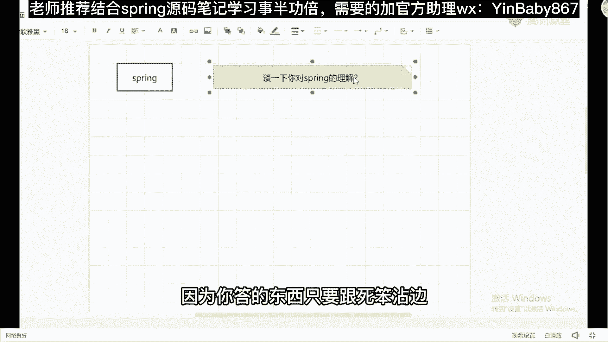
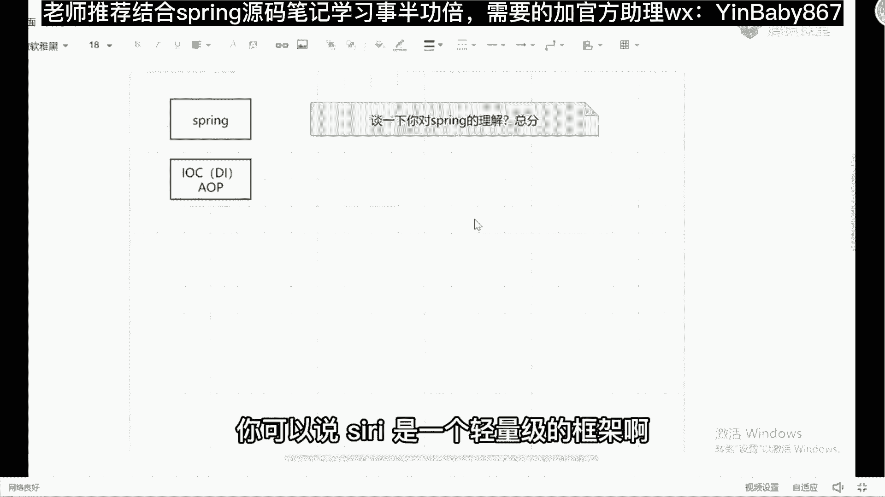
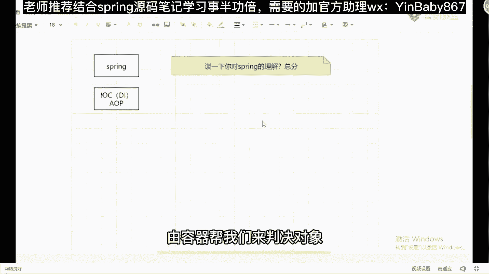
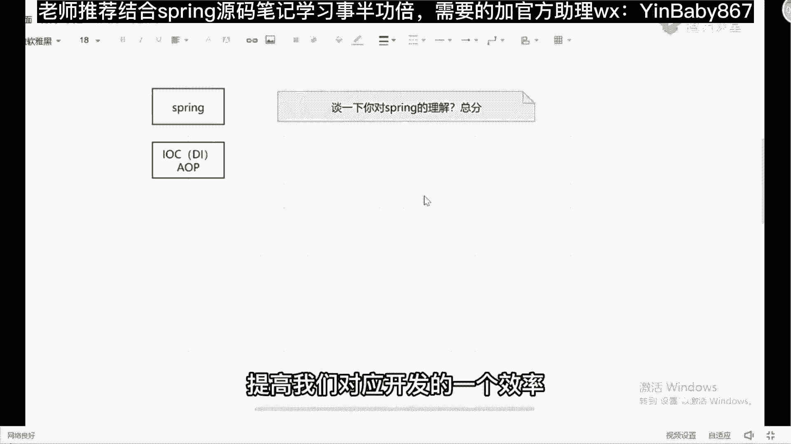
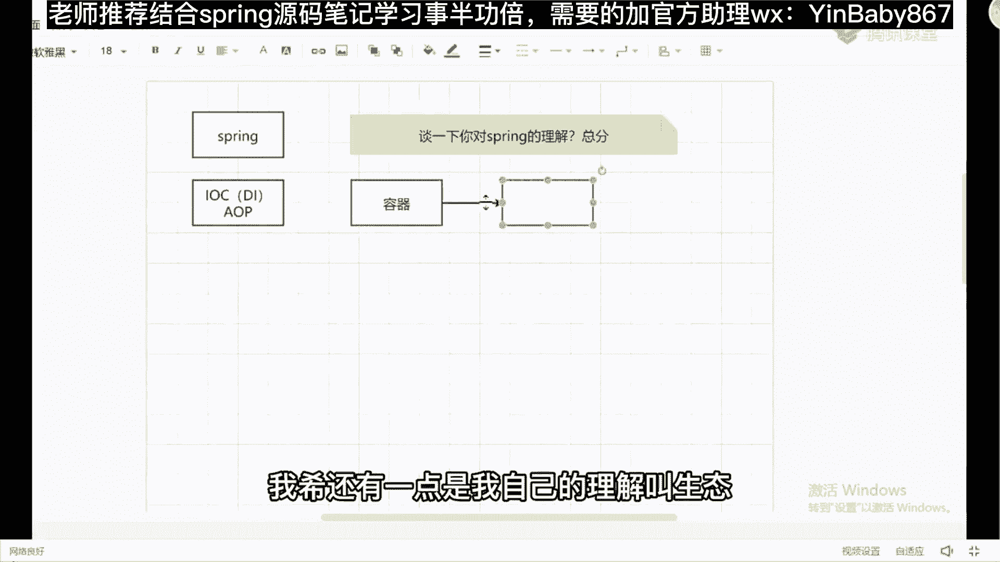
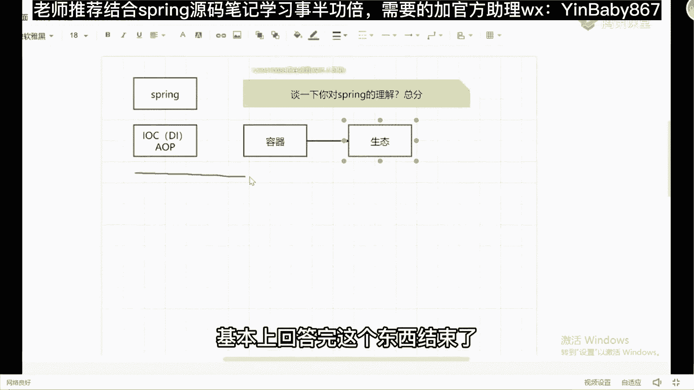

# 马士兵教育MCA4.0架构师课程 - P29：29、Spring源码基础讲解 - 马士兵学堂 - BV1E34y1w773

来先说第一个吧，spring spring啊，我就所有人在用吧，在公司里面你们可能会用spring boot。

可能会用spring cover，无所谓什么技术，但是它最终的底层基础支撑都是我们的spring吧。

而且每个学生在刚接触框架的时候。

基本上都是spring开始的，那面试的时候经常会问到一个问题，说来你给我谈一下你对spring的理解。

当问到这样问题的时候，告诉我怎么回答。

有思路吗，我们还是一样，我们我们围绕着面试来说，好吧嗯嗯谈一下你对spring的理解。

这个怎么说，怎么表达呀，很多同学啊其实是非常害怕。

或者说惧怕这种宽泛性，这种问题的在我看来。

我觉得这东西啊它是非常容易的一件事，为什么，因为你答的东西只要跟spring沾边。

都不能说你错，那个同学在面试的时候经常会怎么表述，基本上会提到两个名词。

第一个是LC，我们叫控制控制反转。

第二个叫什么叫AOP叫面向切面编程，然后呢，你们可能会描述一下。

LOK好解决什么样的一个问题，AOP解决了什么问题，然后到这个环节的时候，基本上戛然而止了。

我告诉大家，你们以这样的方式去表述，百分之百是不对的，所有同学老师。

我在IOC的时候还会提另外一个东西叫DI，要提交一些名词。

这些名词告诉大家，谁都会，你要凸显的是什么，你与别人不一样的地方。

所以你在你这个问题的里面，你要贯穿进去。

你对于整个spring体系的理解，那么在回答问题的时候要怎么去回答，告诉大家一定要回答一种方式叫总分。

什么叫总分，先说明清楚好吧。

总的spring的理解是什么样子的，你可以说spring是一个轻量级的框架。

好简化我们的开发，明天重点包含两个模块，一个两个功能。

一个叫IOC，一个叫AOP，IOC叫控制反转，原来我们在使用对象的时候。

必须要自己去new好吧，然后才能进行调用，现在使用LC之后可以干嘛呢，由容器帮我们来创建对象。

并且由容器来帮我们管理对象对吧。

减去我们很多的一些呃，开发代码上面的一个成本和，提高我们对应开发的一个效率。

LP叫什么叫面向切面编程，什么叫面向切面编程呢，我们在使用的时候，需要嵌入一些跟业务无关的一些核心代码的。

时候，可以在a OP里面进行操作，比如说日志权限的增加。

都可以在a OP里面进行操作，很多同学基本上这样描述。

你聊完之后就结束了啊，这样说我不能说你错。

但我只觉得这样说不是特别完整，那么下一步你要紧跟着说什么，这上面是对IOC和a OP的解释。

那么紧跟着我希望你能说出对于spring它的理解。

那spring是什么，说完这些点之后，你可以加一句话，其实在我看来。

spring的本质是什么，是一个容器，虽然我们把它当成框架来用。

但是呢基本上是容器好吧，除了容器之外呢，我C还有一点是我自己的理解叫生态。

因为我们现在在公司里面用的主流的框架，基本上都是在spring的基础之上。

上层框架，比如说spring boot，Spring cloud。

Spring data，Jpa，spring security等等，一系列相关的一点好，这是它对应的东西。

那么我们要了解的是什么，在整个spring里面，最关键和最核心的就是我们整个IOC容器里面。

如何帮我们去创建好吧，以及管理对象的。

那么这里面必不可少的，要涉及到我们的什么bean的生命周期问题吧。

你是不是可以把bean的生命周期带出来，再带到bean的生命周期的时候，你可以提到spring源码里面还有哪些具体的扩展点。

提到扩展点之后，你必然会提到一个东西叫being post processor。

提到并post processor之后必然会提到a OP。

提到IOP之后再解释a OP的详细功能，能理解我刚刚说的这个思路吗。

能力的来给老师扣扣一，能听懂吗。

就是什么叫体系性回答，你要给别人展示出你自己不一样的地方。

怎么去展示，因为一般同学基本上回答完这个东西结束了。

你不会有自己的理解，那后面你要去贯穿上你的理解，什么bean的生命周期的对吧。

AOP的一些简单应用了的实现原理了，这些东西把包括动态代理对象啊。

这些东西你是可以能输进去的，你要把它揉到一块去，给没给面试官的感觉是什么。

这个人还了解过源码，或者说看过源码，或者说对这个基础框架是有深入理解的。

要给人这样一个感受，明白意思吧好吧。

这样的话你的薪水才能高上去，但如果说老师我对这东西不理解，我到现在对于spring也简简单单的就是一个会用。

哪怕我对应面，就是面试中问到我那个B的生命周期问题。

我都是提前一天去网上搜一个帖子，我背下来了。

我把它背完之后对吧，我去面试官给面试官说，至于你说的那个扩展点，我压根不知道是啥。

这个别慌，今天这节课我们第一个点，我先帮你去把整体的思路给你贯穿起来。

好不好，坐下面哈，好好听课啊。

来我刚刚啊已经做了一个范本了好吧，有兴趣的同学下去之后。

可以把我刚刚说的那套东西好吧，整理成一个文字描述，然后自己往里面填肉，把把各种细节都填充完整了，那下面我要说的是什么。

是整体的ring框架的实现原理，LOK的整体的实现机制好吧。

spring怎么解决循环依赖问题，这个是一个比较大的问题。

明天我会专门拿出一节课来表述，别着急好吧，什么画图软件叫枫叶云笔记好吧。

这个画图软件大家如果想要的话，可以去下载一下好吧。

工业云笔记。

