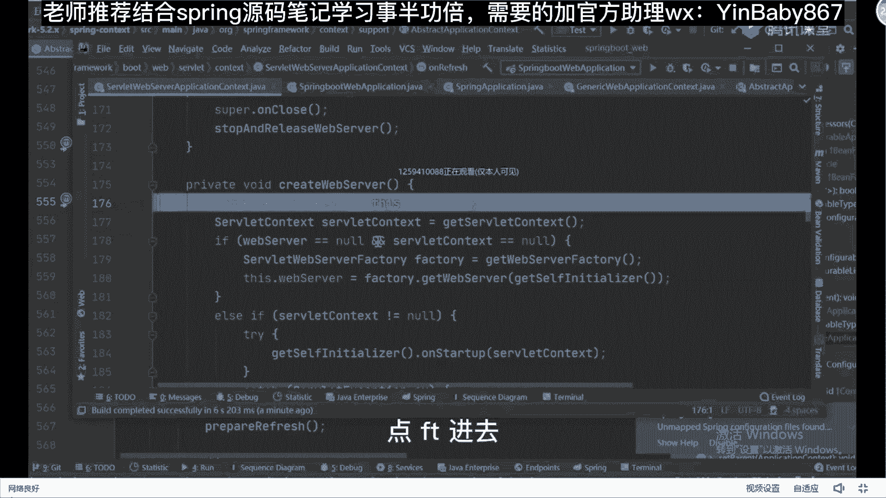

# 马士兵教育MCA4.0架构师课程 - P30：30、spring加载bean的过程及框架的扩展 - 马士兵学堂 - BV1E34y1w773

好吧来接着来讲我们的spring spring最开始提到之后，第一点它已经是个什么容器了，好吧，容器干嘛的，用来装载东西的，比如说我们的水杯水壶水缸对吧，对于我们的应用程序而言，它用来放什么。

放我们的定对象，当然里面可以放一堆的，比对象不只是一个N多个好看，你个人的一个需要先放多少个，放多少个，那这个时候你想我们如何去把IOC给它，融融融融到一块呢，IOC是个容器。

我们可以把整体这个框框认为IOC容器里面，B对象它是如何帮我们去创建的，或者换一句话说，谁能告诉我，spring是怎么知道你要去创建哪些对象的，怎么创建，先不管他怎么知道我要创建这个对象啊。

通过什么来知道好，同学们通过什么cam，也就是说我们其实是有一些方式，可以让所有人感知的，比如说最开始学习的时候，很多人接触的时候用的是XM2，上面配置文件嘛对吧，然后后来呢大家可能为了简简简化操作。

我们更多用的是注解，不管是长毛也好，还是我们的注解也好，包括我们的配置类也好，这些方式里面它都是定义好了，预先存在的并对象，当我把这些bean对象定义好之后，然后我叫容器来帮我管理。

那这里面定义的到底是个啥呀，对像零零后的程序员可能都没有写过XM，因为现在很多机构讲课的时候，基本上都是直接以配置文件，直接以这个注解的方式来讲，但是坦白说我这提一件事。

我还是希望大家能够好好的把XML文件这种方式，理解一下的，因为它是根，它是本质，如果你能把XML文件的方式理解的很透彻的话，对于注解的方式更容易理解，好吧，我问一下上面文件也好，数据也好。

它里面定义的是啥，比如说老师定义的类定义的bean吧，其实这里面定义的应该怎么说，它叫bean的定义信息，我希望你们这么去描述它叫bean的定义信息，比如说老师什么叫bean的定义信息啊。

我们想创建出一个对象的时候，如果用反射的方式的话，我必须要知道他的一些信息吧，写一个案例吧好吧，比如说我要随便写一个配置文件，对于很多零零后没见过小孩，我给你们写一下好吧，写有很多零零后程序啊。

你不要觉得这是很难啊，比如写一个叫beta sclass，等于com点回味一下这种方式，第一data，boss可以这么干嘛对吧，然后脚下之后里面会有我们对应的property属性。

name等于写一个手机号，然后呢value给一个叫dollar大括号BDBC点username，当然里面还可能包含一些其他的一些属性值，对啊，我这不写了好吧，然后最后再来一个闭合标签。

这不就是我们变的一个定义吗，像这样的一些定义，什么叫bean的定义信息，比如说里面的什么ID的属性了，class属性了，name的属性了，value属性了，这些东西都可以成为定义信息。

我只获取到这些完整的定义信息之后，我才能够去创建出一个具体的并对象，在这里面会涉及到TMA也好，注解也好，其定义的都是这样的，BB信息，有了这些病信息之后，我会干嘛，我要预先把这些bean的信息。

加载到我们整个容器里面去吧，因为加载完成之后，在容器里面我才能够去把对象给创建出来，如果不在不加载进去的话，在外面放着，我是识别不到的，所以我是必须要有这样，当前这样一个加载过程的。

因此在这个地方你可以怎么写，在spring里面，它提供了一个默认的接口，用来承载这些具体的信息，比如说叫B，所以你看这个单词的名字，你能猜出来它翻译过来不就叫BD定义信息吗，是不是这意思。

注解也是一样的，注解最终在解析的时候，也要把它转换成一个b definition的对象，然后我通过各种方式，可以把我们的XM2加进来，可以把我们的注解加进来，最终都组装成这样一个对象，这没问题吧。

来到这块能听明白，同学给老师扣一，能听懂吗，没问题吧，那有没有同学会好奇啊，老师我这样QM文件是如何组装重叠对象的，如果是你让你来实现，你现在有一个XML文件，你怎么把它组装成这样的对象，能做吗。

可不可以做，可以吗，第一步，刚开始我是插画文件开发文件，有了之后可以干嘛，是不是可以把这些读文件给读过来，你告诉我读文件用什么方式，读文件用什么方式，IO流IO流的方式把它给读取过来好吧。

读取回来之后先把它放到我们对应的内存里面，放内存之后别忘了它是内存里面的一个数据了，紧跟着要干嘛，说白了，拆包文件里面放的东西，在我看来就是一堆字符串，那这些字符串。

我如果想把这些字符串给充分的利用起来的话，我要怎么做，说好的对象，那你别忘了，XM文件是一种非常独特的，具备特殊格式的一个文件，所以在这里面我可以通过什么，比如说FAX对吧，比如说dom qua。

这样的方式，我是不是能把XML文件转换成什么东西，叫document文档类型吧，当我有了这样一个文档类型对象之后，我是不是意味着里面就包含了对应的父子节点，对吧里面一堆的什么note node对象。

有了note之后，我能不能通过循环的方式，把node里面的每一个属性值，属性名称把它取出来，取出来之后我能不能设置到我们对象里面去，设置到BB中，可以这么做吗，可以吧，这个流程能听懂吧。

如果让我们自己操作的话，我们一定会这么干，其实源码里面也是这么做的，跟我们想的东西是一模一样的，只不过很多同学没看过这些源码，所以感觉这东西好像很难的样子，其实不难，你就按照你传播的手段做操作就可以了。

BD是啥，BD不是bean definition吗，我这儿我这儿写不下了，所以我写了个BD叫bean definition，好明白意思吧。

如果大家不信这东西的话，我们可以来验证好吧，再验证呃，我问一下有多少同学在私下里边自己看过源码，给老师扣个一，就自己尝试看到过这个东西，不是让你在项目中用的，是帮你帮你把这个流程梳理清楚。

你面试的时候能跟面试官吹牛逼，懂我意思了吗，不是让你自己在项目里面用的，一般也接触不到，好吧，如果你看过源码的话，你应该会知道好在源码里面很多人在看的时候，基本上会提到一个非常重要的类。

叫abstract application context。

在这个类里面会包含一个非常重要的方法，叫什么呢，叫REFLESH，之前有人说过一句话说，如果你把REFLESH的流程看明白了，那么你对spring框架理理解到位了，我们不带你看这东西啊。

我带你看到处理那个配置文件的那个地方，他是在哪做的，回答，你看这个东西叫load bean definition，叫加载bean的定义信息，点开里面我们一直往这边看啊，选它天猫。

然后选择这个选择这个选择这个，然后ACG选择，你不用跟上我的速度啊，无所谓，我对这东西很熟了，所以我打的很快，你们可能跟不上啊，跟着往下听就行了，我带你们找到具体的地方来往，这看到这行的时候。

你告诉你看到了什么东西，这样代码能看到吗，比如说我们写在外面的XML文件，会把它变成一个resource的一个对象，然后我通过这个result对象可以读取我们对应数据，所以这样获取到result之后。

第一步获取到我们的input stream是吧，引流了，当我引了流之后，我开始对这些流进行相关的一个处理了吧，不要把数据进行处理的那么点进去，在这一刻它有个东西，把刚刚的put source。

input source里面是个put stream stream，拿出来之后，把它组装成一个什么东西，啥是我刚说的document的，不管你是通过SX也好，还是通过我们的端口PJ也好。

把它转换成一个document文档，没问题吧，当我有了文档之后再干嘛，文档是包含了父子节点关系的，就在这里面我会干嘛呢，解析出我们具体的父子节点关系，是不是可以通过循环点进去看这块儿诶，哪去了看看。

那我开始获取到他所有的子节点，有了对应的子节点之后，我可以把每一个节点取出来，取出来之后我看一下，我是把它当成一个默认元素进行解析，还是把它当成一个用户自定义的元素进行解析。

是不是数据流程跟我刚刚写的一样吗，一样吧，所以你们在看原版的时候，同学们注意了，为什么很多同学看源码看不懂原因在什么地方，你看源码，你就真的是在看源码，而不是说我在思考这东西，如果是我的话。

我会怎么来考虑这件事情，或者我会怎么来创建对吧，别人写的方式比我写的方式到底好在什么地方，这是你需要去对比思考的事情，你带着思考去学习，和你直接跟着学习，效果是完全不一样的，明白意思吗。

来这块儿能碰到同学被老师扣一，慢点吧，那不学怎么做注解一样吗，我识别到你的类上面加了一个at component，at service好，at repository好吧，At control。

这样注解的时候，把具体的类对象给你识别到识别，到时候把它装成一个BD对象之后，我把这些B对象来生成我们的具体对象，不就完了吗，一样的流程一模一样好吧，但是你还要去做一件事情，同学们弹幕上转完之后。

看起来我们好像已经把这个流程给结束了，结束完之后紧跟着我该干嘛，叫创建对象对吧，我问一下，在框架里面创建对象一般怎么创建啊，怎么创建，能创建吗，反射吧，基本上都是反射。

很少有人用new的方式来创建我们这个对象，基本上反射，因为反射它足够灵活，能满足我们各种各样的一些需要啊，配完对象之后，我可以拿过来直接用了，看起来就说好像很简单，那这个时候你就要思考了。

为什么这个地方在写的这个配置文件好吧，它定义成XML文件，话说如果我把它定义成一个properties文件行不行，给我定义一个配置文件格式，这个配置文件格式呢叫properties。

我的properties里面，能不能也把它装成一个预定对象，能不能可以吧，那你告诉我properties和TM的区别在什么地方，不就是两种文件的解析方式是不一样的吗。

我只要配置好对应的properties，它的解析方式不就可以了吗，用解析properties文件方式解析它，用创号文件的方式解析它是不是可以，那同样的刚刚说的用压码是不是也可以对吧，我能不能用JON。

是不是也可以，我只要能解析好它对应的关系不就完了吗，其实很简单，那你在这块你要去思考什么东西，同学们想好了不同的定义方式，需要有不同的什么解析方式吧，我要不要给他形成一个统一的规范，因为在我没读取之前。

我其实并不知道我的配置文件是哪一个，是不是这意思，我在这块我是不是可定义规范，写东西叫定义，约束规范对吧，所有啊需要进行解析的操作都要实现直接跑，可以不，那这样的话，不管怎么样，我后面如果有其他。

如果有其他新的配置文件，我是不是也可以实现这个接口，只要分配好接口了，我匹配好对应的类了，我是不是可以把对应的实现类或者解析类，给它冲进去，我是不是就可以解析对应的配置文件了，这块能理解吗，能理解。

给老师扣个一，能不能理解，所以这就是，为什么源码里面要提供这么多的接口，这么多的抽象类里面的原因，我要定义好对应的约束和规范，那同样的在源码里面，这块会有一个东西叫什么叫并definition。

reader好包含这样的一个对象。

当你有这样的一个对象之后，我们可以来看一下小b refer。

它是一个接口啊，你看接口之后，我定义好对应的方法，我只需要去实现具体的子类就可以了，那这样的话我根据我不同的子类，我就可以进行配置进行识别，并且对不同的配置文件进行相关的解析工作了。

这句话意思吗对吧，所以这个地方其实在源码里面，你在看的时候注意到像spring里面有7000多个大类，里面有很多的接口，很多抽象类，其实都是为了方便我们进行扩展栏使用的。

只不过我们平常在做业务开发的时候，你用不到这些扩展点，仅此而已，但你不能不理解其中的扩展，因为一个框架能够流行起来，或者说能够被绝大部分人认可，最关键和最核心点就在于它什么，它的扩展性能懂我意思吧。

所以我希望大家时时刻刻把这两个字留意起来，我问一下，如果你们需要在框架里面做扩展的话，可以用哪些扩展方式，或者我们自己在写我们自己的业务逻辑，代码的时候，可以用哪些扩展点有吗，能想到吗。

刚刚我说的接口是一个还有吗，不要说BPP和BF p p可以看，听过课的同学，听过课的同学可能知道什么叫P和BBFPP，没听过的同学可能不知道什么叫BBB，B和BFPP，比如说模板方法这种东西知道吗。

设计模式。

设计模式不可以扩展，像spring里面还有很多这样的扩展点，我给你看一个，再找一个吧，看这里面我们找到我们刚刚说的那个，reflect方法，在rap方法里面一共包含了13个方法。

你点开这个方法里面有任何子类实现吗，没死的时间吧，所以他这个东西干嘛的，就是留给子类进行扩展的，再比如说往下看这个on reflesh，这直接告诉你叫for subclass。

Do nothing by default，我留好这个口，你说这个口之后，我就可以在这里面实现我具体的业务逻辑了，那这样我问一个问题，你们都是有经验的开发程序员对吧，这个地方有哪些扩展事件，你知道的。

有人知道吗，哪些地方用到这个on reflesh方法了，有没有人知道，对在spring boot里面内嵌tomcat的时候，是不是就是在on reflesh里面进行操作的。

是不是你要发现这些东西的关联性，我为什么说spring是基础，是生态，因为很多上层的建筑和上层那些框架，都是在spring的基础之上做了一些额外的扩展功能，你现在就可以自己看。

在spring boot框架里面好吧，这一块就是用来创建我们对应的tomcat server，tomcat server就在这个步骤里面完成的，这不就扩展点吗，默认的时候还是什么都没实现，就这意思哇。

听懂了吗，来这块听懂的同学给老师扣个一，能不能理解，我需要我带你们看一下spring bot里面怎么扩展的吗，有需要的吗，希望嗯，我打开一个项目好吧，可远了，随便打开一下午吧，我带你快速快速看一下。

这个这个这个这个这个东西好吧，怎么看，打开你的启动类，改完成之后，这一个run多少，我就直接带你们找过去了，好吧，不一行一行带你们看了一行再看，太浪费时间了，reflect reflesh看了吗。

从这里面refresh1行一行，点的时候就能点到这个refresh方法里面去，依然是这个abstract application contest，然后在里面找什么找on reflesh方法，点击之后。

这默认实现没有，你点开里面太快了，从头来打到你六级debug启动起来好不好，我把启动起来，好了进来之后点F7进去好吧，找到new run方法进去，再点击run方法，然后听到它核心的启动流程里面去。

在启动流程里面，下面有一个东西叫reflesh contest，找到我们的reflesh contest，这行代码，然后点F7进去，再点F7进去往下走，点F7进到REFLESH里面去。

super refresh里面再点F7进去，我咱们今天课不讲spring boot好吧，我带你看看这个流程，你看下这有REFLESH，我刚刚在你们看的时候，这里面是不是也是REFLESH。

是REFLESH，两个地方是一模一样的，都是这个abstract application context，好，后面这也是abstract obligation context类是一样的。

只不过我在找的时候找到具体的实现不一样，我们往下走走走走走走走，什么意思啊，走走走到on reflesh这行代码里面去，然后点FC进去，这有一个super refresh对吧，再点去往下走。

有个create web server df，七进去往下走。

往下走，可空吧，等于空之后开始获取我们的web server factory，这一获取下一步告诉你了，当前的factory是什么，The tomcat sweb server factory。

有了这个factory对象之后，我就可以根据这个工厂来创建出，我们具体的什么，他们看到server了吧，是不是东西，所以我给大家讲这么多意思是什么，你有时间我给你们讲spring box源码好吧。

这个这个这个这个没啥难的，我想给大家说的是什么，你要知道它其中的扩展点在什么地方，你要知道这东西哦，而且你在看原版的时候，你要时刻留意这东西，就这东西你掌握好了，才是你自己的实力提升的点，明白了吧。

好吧对啊，废话不多说了啊，还是要跟着我学学的是什么，不是说简单把流程学会了，我希望大家学会的是什么方法，方法很重要，OK好了，我们这涉及到接口了，写完接口之后问一个比较low的问题啊，特别low的问题。

谁能告诉我这个接口和抽象类的区别呀，讲到接口了，我说了原版里面spring源码有7000多个类，里面一定有很多的接口和抽象类，接口和抽象类有区别吗，谁能说一下，单继承多实现，这个蜡笔没了。

小心你竟然听过我的课是吗啊，软件是在BW待过BW是吗，很多同学啊听过我的课，你应该会知道我强调过这件事情，虽然那个接口有什么，你们好多人刚告诉我什么单继承，我们多实现什么，不能写具体的方法。

代码什么之类的，这东西没问题，但我认为你们所说的这些点，统一的称为什么叫语法上的区别点，你在面试的时候，如果只去跟别人说语法上的区别点的话，不好意思，这东西谁都会，哪怕一个小白，刚学完之后。

老师也一定给大家总结了很多具体的东西，这东西不重要好吧，主要是什么，你要体会其中的设计思想，什么叫设计思想，接口和扩展类最主要的区别在什么地方写一下，接口它本身是一种叫自上，向下的思维模式，而抽象类。

叫做就这样，向上来，这样东西能理解的扣一，不能理解的扣二，什么叫自上向下，什么叫自下向上，之前说过乔尔同学比较多，我解释一下这件事情，你们之前在面试的时候，如果去给别人说语法上的区别，我觉得没问题好吧。

因为他这样区别没问题，但如果你想凸显的自己跟别人不一样，你要说这玩意儿什么叫自向向上，什么叫自向向上，这两个东西怎么理解，很简单，接口我们叫什么叫定义的，叫约束和规范，这意味着什么事，我定好了规则。

你的子类必须要按照我的规则实现来，没例外好吧，特效是什么意思，抽象类是因为你有了很多具体的子类实现，你把很多公共的特性拿出来了，变成了一个抽象类，能听懂这意思吗，比如很多动物动物有什么眼睛的颜色啦。

名字了好了，把这几个属性拿出来，拿出来之后，我变成一个抽象类，其他的具体实现子类我直接继承就完事了，那接口呢我定义好了，具体的方法实现，你就必须要按照我的方法规范来，你可以自己加，你自己加没问题。

但是我我写东西你必须要有，所以这个时候你理解什么叫自上向下，什么叫自下向上了吗，来理解的图一，所以你面试的时候你要给别人说这东西，不是说你们说那些语法上的区别，你说语法上的区别没有意义，好吧。

显示不出来你自己的技术实力，谁说不理解，下课之后你私聊我通项问你什么意思，接口你怎么定义的，你先定义了一个interface，里面有A方法，有B方法，有三方法，我的实现子类在实现了这个接口之后。

我必须要把ABC3个方法去重写，我可以自己再扩展一个地方吧，但是我必须要按照接口里面的，ABC这个方法来，所以它是自上向下的一种模式，我定义好约束你来实现就完了，而抽象类呢什么意思，我有猫对吧。

有狗有兔子，这边有一些公共的属性，比如说毛发对吧，比如眼睛，比如内蒙这样的名字，每个里面都有，我为了简化操作，我把这些公共的属性拿出来，变成了一个抽象类，我的子类只需要写自己独特的属性就可以了。

它是什么，它是共性的东西，它并不是定义了约束和规范，所以它是自下向上的，而结果是自上向下的，理解了吗，这东西啊，你们学基础的时候，老师应该告诉我们，那你们很多人基础老师不讲这玩意儿，你讲完之后之后。

很多人不理解，但你写这玩意写多了，你就理解了，明白意思吧，好吧行了，不多说了不多说了，这东西讲讲讲，扯的有点远，真没告诉我，你要你要去思考什么叫思考，对不对，好吧好了，内部之后，我们接着往下讲。

回到我们spring来收回到spring这块好吧，老实说背会就行，背会你体现不了别人的差距啊，我还是那句话。

