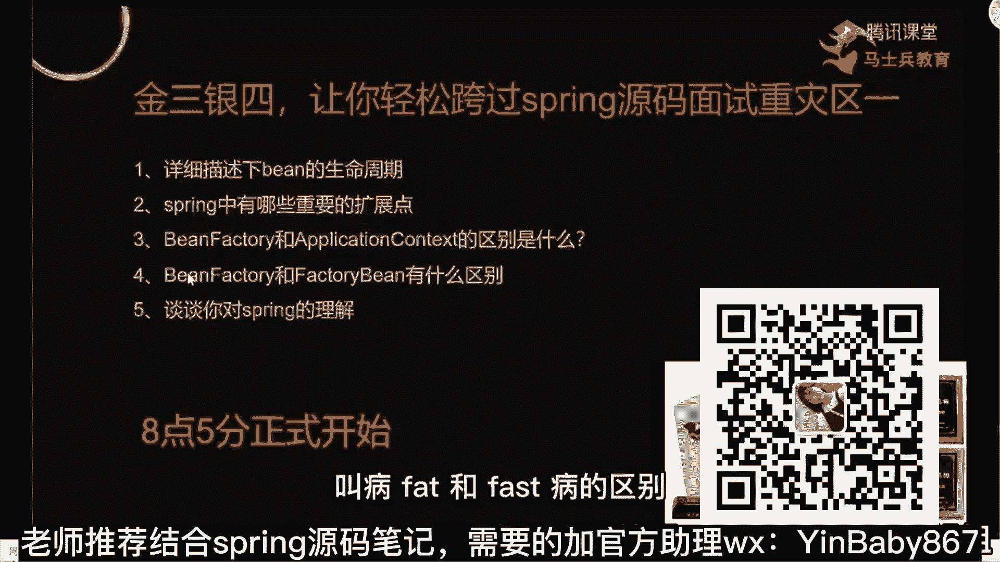
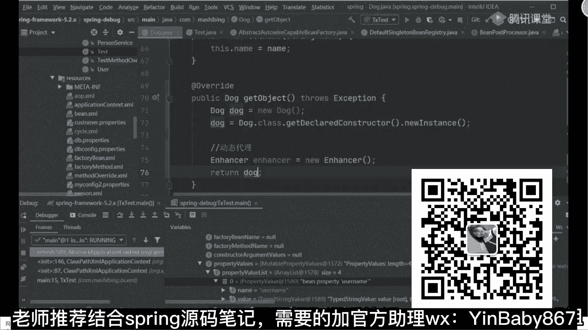
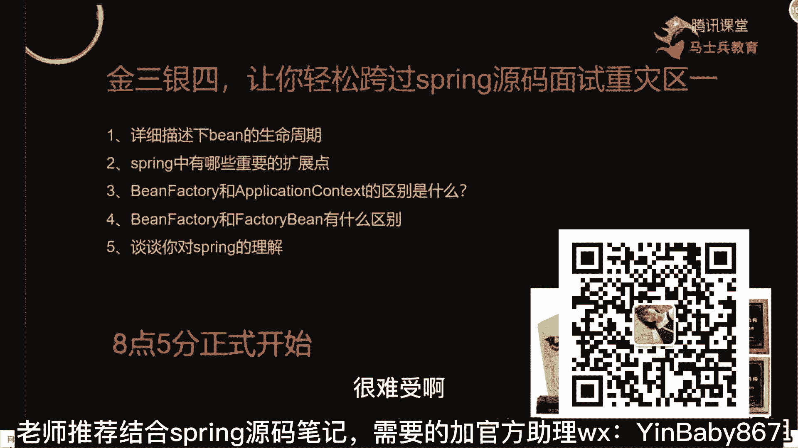
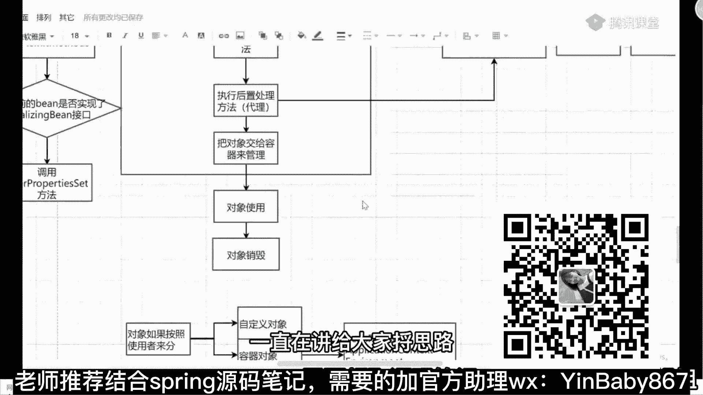

# 系列 5：P33：33、BeanFactory和FactoryBean的区别 - 马士兵学堂 - BV1E34y1w773

好了，来回到我们这节课上面，第一个变成生命周期，能说清楚了吧，对不对，第二个重要的扩展点，第一个刚刚说的，你在执行post process里面post，呃这叫什么来着，Post in factory。

post processor的时候，你可以有一个扩展点，那个模板方法，还有那个on reflesh对吧，可以有模板方法的扩展点，除此之外，你的BBPP和你的BF p p，是不是都是我们的扩展点对吧。

这就是我说的扩展点，你能把这三个东西给面试官说出来足够使，因为一般人根本理解不到这个程度好吧，第三个，bean factory和application content的区别不用说了吧。

一个是它的子类实现而已好吧，第五个，看来你对此的理解，看那个问题的时候，就按照我上课说的东西，这东西来来来来说就可以了好吧，第四个问题刚刚没说叫bean factory和factory bean的区别。

有人为什么绕过这个问题吗，就been factory和factory bean的区别，有人问过没，问个扣一，这俩有什么区别啊，其实区别点啊非常非常简单来说一下，In factory。

还有factory bean，首先啊两个东西，两个东西他们都是用来创建对象的，明白吧，都是看对象的，都这样的功能，但是我们在使用并battle这种模式，来判断对象的时候，它类似于什么呀。

叫必须遵循完整的bean的生命周期，创建对象是不是意思，我问一下这个过程麻烦吗，复杂吗，你们觉得，不复杂，你debug一下原版就试试了，你第八个一下原版就知道了，很复杂，我刚刚在你看的时候。

有很多逻辑判断是跳过去的，没带你们看，如果你加上那些逻辑判断的话，它是非常普通的好，所以我把它称之为什么呢，很简单，叫流水线式的创建对象，流水线式创建对象，然后你点一下点个门，像没点烟好吧。

第二个factor是什么意思，它更多是什么，也是创建对象，但是没有标准的流程啊，它更多类似于什么东西叫私人定制，什么叫私人定制呢，其实很简单，比如说这里面他这个接口里面会包含三个方法。

第一个方法叫什么呢，叫is singleton，什么样的sequence很简单吧，判断是否是单例，这是第一个说到这，还有第二个方法叫get object type，这返回对象的类型还有第三个。

懂了叫get object，什么叫返回对象啊，还有这三个东西，那有这三个有什么用处呢，很简单，比如说我刚报告打开我们的类，我如果在这上面也实现了这个接口，实现它里面的方法，这两个还有一个叫意思。

第一个如果是单列的话，返回true对吧，get btt tab可以返回dog点class对吧，第一个这个get到变成你可以怎么办啊，你怎么办，很简单，第一步，dog dog等于又一个dog。

可以不自己new吧，还有什么还有啥该怎么做，dog点class点get deconstrutter，New instance，我是不是也可以返回一个对象，对不对，第三种我可以使用什么动态，代理嘛对吧。

enhor enhancer等于new一个enhancer对象，然后在enhance里面我可以设置一些set什么东西，设置一些东西，做完这些东西东西之后，然后呢来进行进行创建，是不是也可以。

然后最终我返回一个报对象，是不是也可以，你是不是可以按照你自己的一个方式来进行，对象的一个创建，能明白意思吗，同学们这意思。

所以这是他们两个之间的区别，来这块能听懂，同学给老师扣一，能听懂吗，所以把这个东西啊大家搞清楚啊，这是这是我要讲的一些点，对这几个问题，我希望你们在面试中，如果在面试被问到了啊，能够把这些东西啊搞清楚。

不要因为这些问题再被卡住，很难受啊。

同样的，刚刚我也带你们看了一下源码，一直在讲给大家捋思路。

捋的思路。