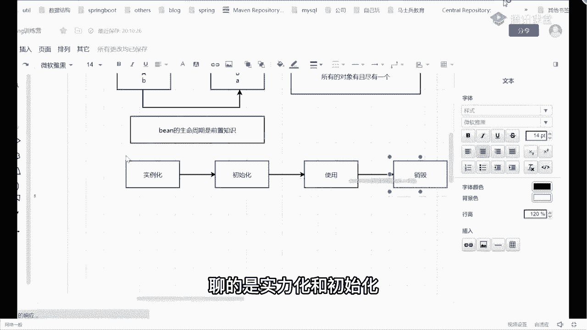

# 马士兵教育MCA4.0架构师课程 - P35：35、循环依赖的基础知识铺垫 - 马士兵学堂 - BV1E34y1w773

首先先来解释一件事，什么叫循环依赖啊，你怎么理解啊，其实非常简单，当我们定义好一个对象之后对吧，比如说我定义了一个A对象，A对象里面可能会包含一个属性叫做B对吧，同样的我可以再定义一个B对象。

B对象里面有一个属性A，当他们之间相互引用的时候，就出现了我们说的循环依赖问题，那为什么会出现这个问题呢，其实也非常简单，问大家一个最基础的知识，在spring里面bean对象默认的是单例的还是圆形的。

默认是哪种形式啊，单例吧，如果你不做任何特殊设置的话，基本上都是单例的，什么叫单例，也就是说我这儿有一个容器，容器是什么，就我之前给大家说一个map结构，这放了一个map容器里面所有的对象，找对象好吧。

叫有且仅有一个，有且仅有一个，这叫单例好吧，一般情况下bean对象啊都是单例的，单例的话，这就会有一个问题，我现在有两个并对象需要放到容器里面去，如果我要想往容器里面放的话，就意味着一件事。

容器里面的这个对象必须要创建完成之后，我才能够把它给放进去，所以我不管是A也好还是B也好，我一定要优先网络创建一个对象，假如让我先创建A，那么意味着我可能在创建A的过程中，需要去设置我们的属性B对吧。

那我再检索一下有没有B属性，如果没有B属性的话，怎么办，我是不是要去创建B对象了，而创建B对象的时候，紧跟着话又会有一个属性A的设置，我要去看一下有没有属那个对象A，所以这样的情况下。

就造成了一个循环依赖的问题，想把循环依赖这些问题搞得倍儿清楚的话，朋友们一定记住了，需要大家对于整个bean的生命周期是有所了解的，也就是说生命周期并到身为NBD，生命周期是前置知识啊，叫前置知识。

你必须要会的东西，因为你会这东西之后，对你的理解会相对容易一点，今天我也会带着大家去比bug源码，带你看一下他详细的流程到底是什么样子的，以及他到底是如何去解决当前问题的哦。

当然我也知道咱们有很多同学啊，可能之前没有自己debug源码，没有也没关系，到时候我上课会一步一步带大家去进行操作，你到时候好好听就行了，在上课之前还是一样，先重复一件事，同学们记住了。

今天上课期间你不需要自己去做任何的笔记，我今天晚上画了图，下课之后会分享给大家，对上课的时候，你只需要做一件事情，全神贯注的去听我的讲解就OK了，不要去记笔记，跟着我的思路把它给贯穿下来，很重要。

好吧好了，既然提到我们的生命周期这件事情了，我先问一下，如果我们按照一种比较粗的力度来划分的话，生命周期可以分为几个步骤，记住啊，叫粗粒度来划分，可以分为几个步骤，昨天上午讲过的四个吧，哪四个。

第一个叫做实例化，这句话完成的工作非常简单，就是在堆里面申请开辟一块空间，这是第一个步骤，紧跟着第二个我们叫初始化，初始化完成的工作也比较简单，第一步可能是给对象的属性进行赋值嘛对吧。

然后呢我要进行某些额外的扩展工作对吧，调用一下我们对应的初始化方法，对不对，就不干就干这几件事，然后初始化完成之后好了，我可以进行使用了对吧，当我使用完毕之后，我可以进行销毁了，大概是这几个步骤啊。

大概是几个步骤，然后今天我们在讲循环依赖问题的时候，我们不是每一个步骤都聊，我们重点好，我们重点聊的是谁，主要是实例化和初始化这样的一个团结。

比如说我们在说对象创建的时候，就不聊对象的使用和对象销毁了，只说对象的实例化和初始化，因为你们在之前自己看帖子或者看书的时候，一定有人听说过，在spring里面到底是如何解决循环依赖问题的，谁能告诉我。

你们看我帖子怎么总结的，一般情况下会给你两个名词，一个名词叫做三级缓存对吧，第二个名词叫做提前暴露对象，但这个时候其实你应该有一个疑问，什么疑问，三级缓存指的是哪，三个缓存，提前暴露对象。

对外暴露的到底是什么，像这些东西面试中都会问的，像最近面试问的是什么，他不会说只问你说来你给我讲一下循环依赖，各位问你一个问题，很尴尬的问题，说为什么循环依赖必须要使用三级缓存，二次缓存行不行。

一级缓存行不行，为什么必须是三级，他会有这样的问题，所以今天听完课之后，我希望你能够把这个知识给详细的表达出来，面试的时候好吧，能游刃有余的把这个问题回答出来。

