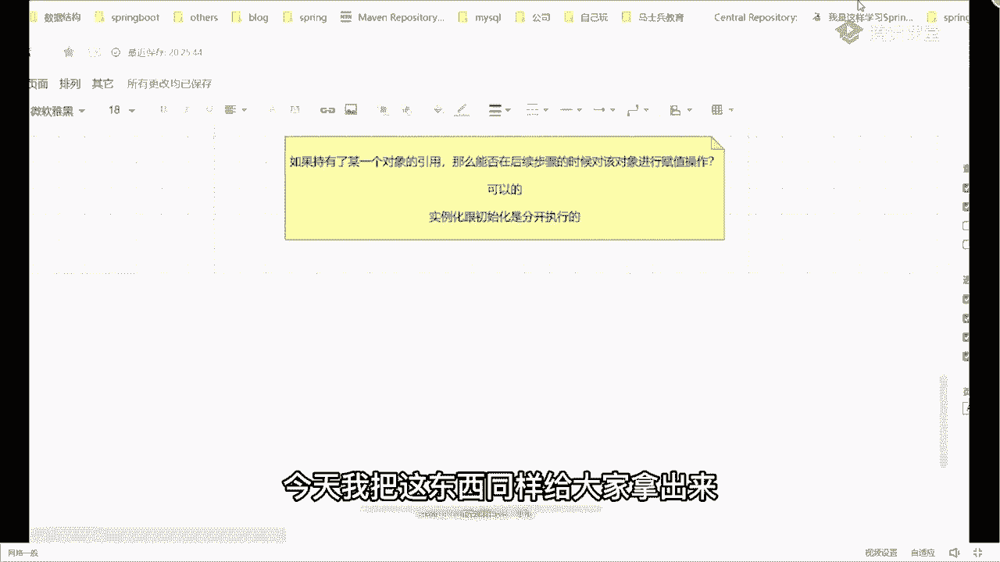
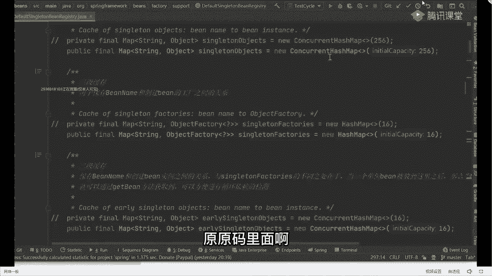
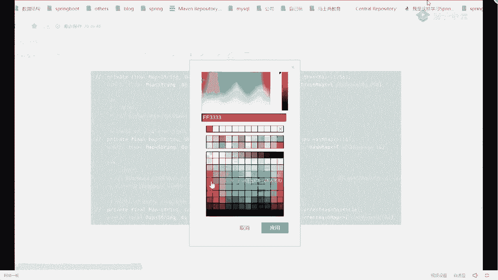
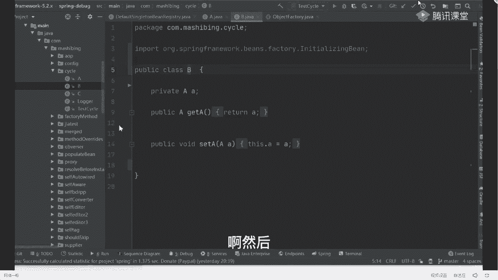

# 马士兵教育MCA4.0架构师课程 - P38：38、debug循环依赖的前置准备 - 马士兵学堂 - BV1E34y1w773

对昨天如果你昨天听课了，昨天上课的时候，其实我再给大家看这东西。

今天我把这东西同样给大家拿出来，怎么看呢，把东西关掉来，我们搜一个东西叫default，Being rejection，在当前这个类里面，你往上翻，最上面这块有三个具体的map结构，这是啥玩意儿。

我把这三个东西给大家截出来，源源码里面啊。

本来源码里面写的是私有的，我改成了公有的，改公有的原因是什么，是因为我修改源码了，一会给大家说好吧，就给大家说，然后我们把这头粘过来，实际尺寸，这就是我们经常做到的东西，一级二级三级缓存。

也就是说这里面实际上指的是这三个Mac结构，你是需要对这三个map结构，有整体的认知和把控的，好吧，这三个Mac到底什么意思啊，也非常简单，这个叫什么，大家注意了。

上面那个叫singleton object，Singleton object，它表示是一级缓存，改一下颜色。

他表示一级缓存，而我们下面第二个这东西，我们称之为什么叫三级缓存，好再往下走，一个这玩意儿叫二级缓存，他没有按照我们说的这个顺序来定义好吧，你知道这东西可以了。

一级缓存叫singleton objects，二级缓存好吧，叫做early sequent objects，三级缓存叫做snon factories，那下面我紧跟着就会问一个问题。

这三个缓存结构有什么样的区别，有区别吗，为什么有的是韩信吧，有人还信办法，现实安全不安全吗，啊一级和二级，一级和二级是线程不安全的，所以要加SCHNET的，而三级是安全的，所以要加用哈希Mac就可以了。

这在它后面代码的操作，我一会看下就知道了好吧，那有什么区别，先说有区别吗，有吧，第一个区别就是你们说的，老师看后面的创建对象不一样，一级二级是content哈希map，三二级三级是哈希map。

除了这个之外，比如说老师还有容量，一级2256，二级16，三级16，为什么一级更大一点对吧，那些点不是最主要的，最主要的东西是什么，就同学们说的这个玩意儿，你看一下。

一级和二级里面放的东西都叫object对象对吧，而三级里面放了一个东西叫object factory，那下面就要解释一下什么叫object factory，不知道怎么理解啊，能叫这玩意吧，它是个啥。

它具体要表达的到底是什么样的一个意思啊，这东西不要不要直接翻译，同学们不要叫对象工程，它是什么，它是一个函数式接口，如果接触过拉姆达式，同学应该知道它是一个函数式，接口好吧，有且仅有一个方法。

明白意思吧，那它还有什么用处呢，可以啊，当做方法的参数传递进去，也就是说当指明此类型参数的方法好吧，可以传入，传传传传入一个拉姆达表达式，在执行的时候并不会执行那个表达式，马上再好。

不调用get object方法的时候才会去调用，那么表达式处理的逻辑，这东西如果谁不清楚的话，下去去补充对应的基础实例，可以看一下拉姆表达式对应的一些点啊，我们这儿不再浪费这个时间。

你就记住为啥看拉表达式你就知道了，好记住了，我们在指定方法的时候，你可以传一个object factory这样一个类型，那么在传参数的时候不可以不是一个具体的值，而我可以传一个拉姆达表达式进去。

当把lab表达式传进去之后，我再调用这个方法的时候，它并不会立刻执行，只有在调用这个get object的时候才会执行这块，你可以好好去看一下，这个代码叫get factory，我们可以直接点过去。

他们叫functional interface，好吧，然后里面有个get不get好，通过这个方法来进行调用，还是编程的一个思想，接下来自己看好吧，我不再讲这东西了，属于比较基础的东西。

所以你要把这个点记住，因为我们三级缓存存在的意义和价值，说白了就变成这玩意儿最核心的点，其实就在于这块好吧，OK把这三栋先记住，那把这三栋记住之后，还有还有啥，我们要实际的去模拟一下ab对象。

在整体的整个创建过程中，它到底在三个缓存中是如何流转，所以呢我为了方便给大家画图，我再画几个框，这是一级，写不到字了过来，一级缓存，下面是我们的二级缓存，后面是我们三级缓存，我把这三个缓存结构放这块。

然后我们在整体对象创建的时候，我会往后面加上我们对象整体流传过程，你要跟着我的思路往后慢慢捋，当然在最开始的时候，这些对象一定是等于空的，这没问题吧，放到这儿啊，后面我会往后面画框，你跟着我的思路。

把这个对象的流转也要搞明白了，那这个时候下一步我们紧跟着进行一个操作，干嘛要进行debug，我知道很多同学，我问一下，有多少同学自己debug源码进行过这个操作，同学扣一没进过这个操作，扣二，好了。

大部分同学偷的都是二，为了方便大家去理解，我们这儿先做一个我提前的预告，在整个对象的生命周期里面，我们在创建对象的时候，大概有几个非常重要且标准的方法，你给我记住了啊，一共就六个方法名字。

你把这六个方法名字给我记住，第一个方法名字叫什么呢，叫get ban，这是第一个，第二话名字叫do get bean，第二个，第三个叫create be，第三个记住第四个，叫do create b。

然后紧跟着后面第五个叫create bean instance，然后第六个，叫popular be，来这六个方法能不能记住，这没问题吧，我就靠大家的记忆力，脑瓜子记住这个方法没问题吧，这还是很容易的。

也就是说我们一会再进行debug的时候，你其他任何的逻辑代码你都不需要看，你只需要给我记住这六个关键方法，当一个方法执行完成之后，我希望你能去放代码里面，去找下一个方法来处理逻辑就完事了。

因为原版里面代码很多，你要一行一行去看，太浪费时间，同时很多同学可能跟不上，所以我们要记住这东西，方便你来带着整体的流程，同时我也做一个预告，在原版里面会有很多套娃的存在，当你看到套娃之后。

别觉得奇怪啊，很正常的一件事情，OK好了，这些东西聊完之后，前期准备工作做完之后，我们开始DIY代码，什么debug，debug之前，我一定要去给大家看一下我们的原始代码啊，我这写了一个包叫SL好吧。

里面定义一个A对象，你可以看到A对象非常简单，里面只有一个B属性，提供了一个B属性的set get方法，有一个合作方法，有一个TOSTRING没了好吧，同时有一个B对象。

有A里面的set和get方法没了好吧。

然后我在配置我们具体的配置文件的时候，也很简单，下面啥都没定义，配置了一个B对象，A配置了一个B对象B，然后A的属性B好吧，引用了B，然后呢B对象的属性A引用了属性A就这意思，这能看懂吗。

来这个代码能看懂，同学给老师扣一，这个很简单很基础的东西了，你这个东西必须要会好吧好了，这之后我们开始运行整个应用程序。

