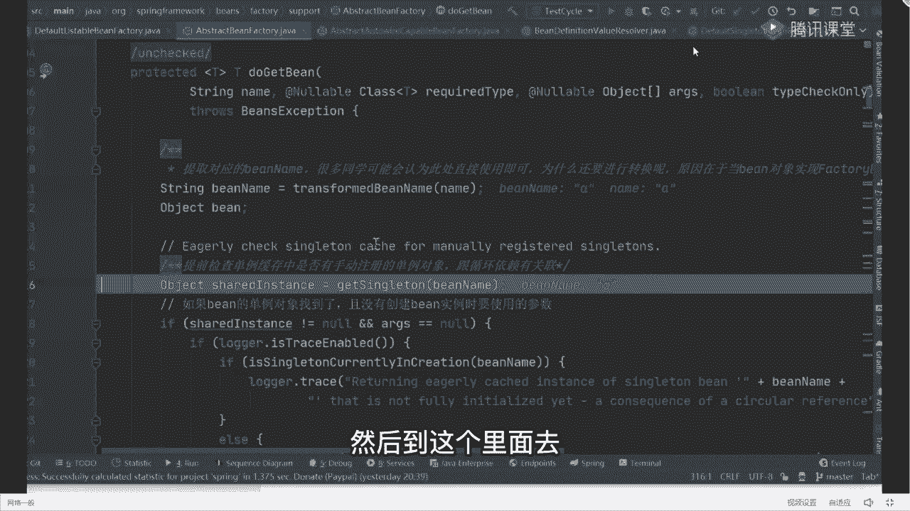
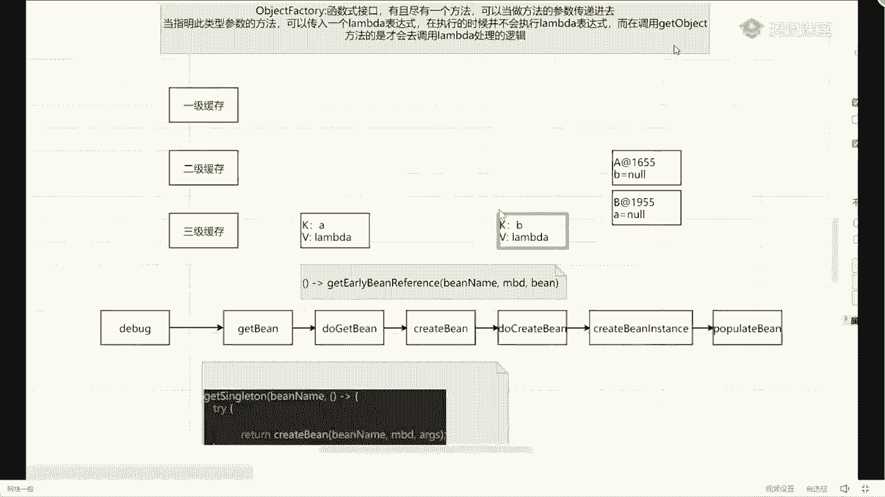
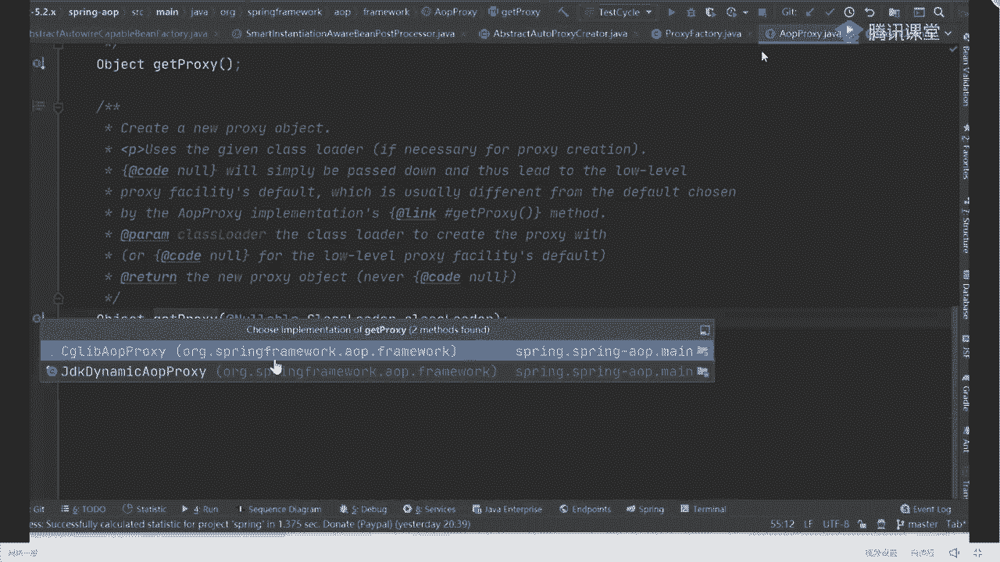
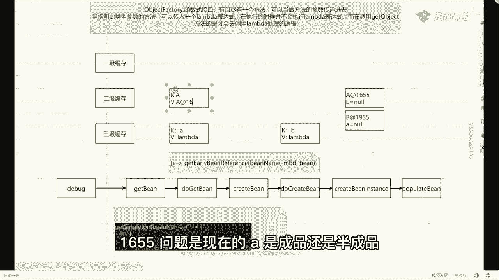
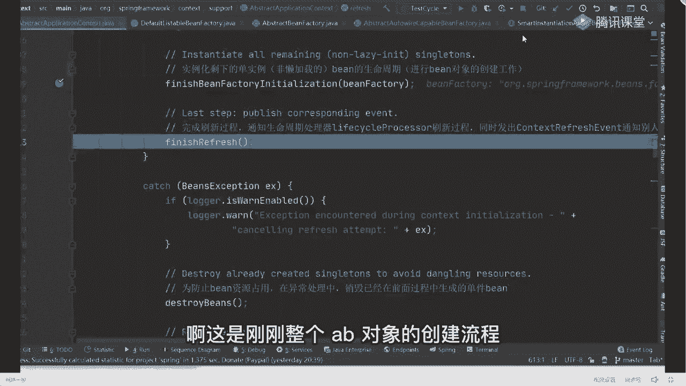
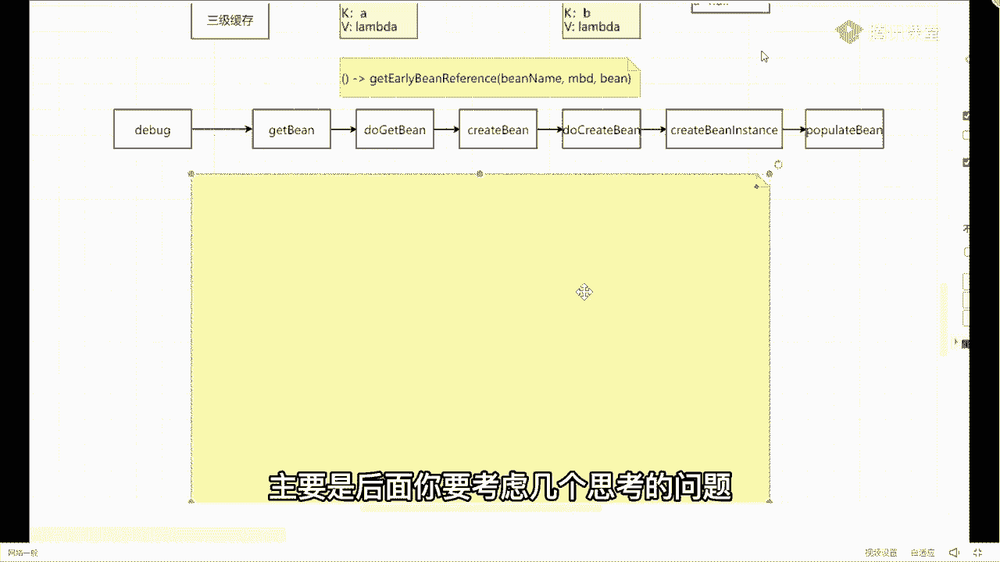

# 马士兵教育MCA4.0架构师课程 - P39：39、循环依赖的详细debug过程 - 马士兵学堂 - BV1E34y1w773

啊这看了之后，我们开始运行整个应用程序，打开我的test test里面也非常简单，我这打一个点，打开之后开始右击第八个，我错了，为啥写配置文件，你可以用auto wear，没关系，我为什么讲配置文件。

讲配置文件的原因非常简单，因为配置文件是最原始最老的方式，它也是最完善的功能体现，如果你能把配置文件的方式搞清楚了，那么你再看注解也好，看配置类也好，都会非常轻松，因为它是最麻烦的，你明白吗。

他是最麻烦的好，所以我想带你们看最麻烦的东西，捡东西你们自己看啊，所以刚开始会提到这个地方，我们点F7进去创建对象，这是一个WEBLOGIC，等于bug，不管它点FC进到我们的构造方法里面去。

再点MC进来，上面的东西super不用说了吧，要用父类的构造方法干什么事，不管爱干嘛干嘛，我昨天给大家说过了，看源码的方法论了，不要每一个方法都点进去，你通过方法名字，知道我调用父类构造方法就完事了。

爱干嘛干嘛，不管他下一个叫sconfig locations，什么意思，要设置配置文件路径，传过来的就是我们的CIA的XM对吧，我只要把配置文件传进来，它会设置到我们指定的位置里面去就OK了。

明白意思吗，还是一样的，你别写进去看好吧，里面数据逻辑还多呢，你要一层层往里边点，我告诉你一会就点蒙了很多，别往里面点啊，学会适可而止，控制住自己的手好吧，不用管它，再往下走。

跳到我们的REFLESH方法，我昨天也说过这件事了，我说如果你能把abstract application，context里面的REFLESH方法，你如果能看懂的话，我告诉大家。

基本上源码已经从源码已经接到了，基本上就够了好，但是还是那个里面逻辑还是很多的好吧，这块前面有一些准备工作好吧，要做一些容器的初始化好吧，赋值啊，包括像监听器啊这些东西操作，不管它。

我们直接到电脑代码里面去这样，因为从这个步骤开始，才正儿八经的去创建我们的对象，都这直接跳过来，有的老师是这样吗，是不是这样，我们可以做一个验证，刚刚我带你看过了1233缓存是什么。

一级缓存叫singleton object，二级缓存叫early signal objects，三级缓存叫signon factories，所以你打开当前这个第八页面之后，找到我们的b factory。

在bean factory里面找C工程OBJESS，找一下往哪看，四点共同JECT里面有对象吗，有吗，点开有ab对，有ab对象吗，这里面提现这五个对象是什么，是容器需要对象并不是我们创建的A和B对象。

就现在容器里面没有AB对象，你再看二级缓存零吧，三级缓存零吧，我错了，对象还没开始创建，所以现在这个步骤一定都是空，不管他，我们点F7进去进去好吧，进来之后上面有一些属性值的判断，你可以直接跳过好吧。

这些步骤也不是创建对象的，我们直接到这一行，从这一行开始，终于进入到我们创建对象的流程里面去了，所以再点F7进来，进来之后来问一个问题，刚刚的配置文件里面，我问一下，我需要创建几个对象。

我需要创建几个病，俩吧就俩吧，一个A1个B没别的东西了，又是什么东西好吧，所以当我识别到之后，我点开我的创业类，你会看到它会把be对象的名字给你，放到一个集合里面去。

是a release里面就是我们的A和B两个对象，我说了AB两个对象啊，它没有明显的先后创建顺序，也就是说我可以先创建A也可以先创建D，这个无所谓啊，对于我们当前应用程序而言，0号位置是A嘛。

所以刚开始取的时候取的是A对象，我先把B内取出来好吧，当我取到B内部，A等于之后干嘛了，是不是该创建我们的A对象了，但是注意了，同学们在创建任何对象之前，我都要去做一个预先的判断，判断什么东西啊。

我需要判断啥，谁能告诉我，对容器里面是否有对象，所以往下走走，走到这行代码里面叫get be，我要先去容器里面获取一下，我到底有没有当前的A对象，所以从这开始，进入到我们核心的处理逻辑里面去了。

比如我刚刚给你说的第一个方法叫A对象，叫叫get in，这是我们第一个叫get in，get完之后点F7进去到第二个方法叫do get be，好吧，这提个醒以后，你们再看一些框架源码的时候。

如果你看到了以do开头的方法，一定要警醒一下自己，为什么，因为你不开图的方法，基本上是实际干活的方法，也就是说在这个do开的方法里面，包含了非常多的真实的处理逻辑，就这是我们要小心的留意的。

OK我再点M7进去，进来之后先获取一下我们对应的名字吧，获取完名字之后来了一个东西叫get singleton，什么叫get singleton，电瓶之翼啊，我昨天讲过电瓶之翼，为啥注释是黄色的。

再自己改的颜色亮一点，好看一点，获取单单单单对象吗，我们现在能获取到A的单例对象吗，不是一级缓存的名字啊，这是一个方法叫获取单对象能吗，你都没创建，你哪来的获取不能，所以当这个步骤执行完成之后。

你会发现这个对象等于空，如果等于空意味着什么事，我是不是必须要去创建A对象了对吧，你要创建了吗，也没有吗，没有你只能创建吗，别人不会给你，所以我再往下走，下面有一堆的逻辑判断，你可以直接跳过。

不用管它好吧，不用管他，不用管它，我们直接找到一行代码里面去，在这行到这块之后，你会发现一个方法叫什么，叫create be，对吧，终于看到了创建对象这个方法名字，这是我说的第三个方法，然后往下走一步。

又来到一个方法里面，叫get singleton，这个时候我希望你能好好留意一下，get singleton这个代码，这是刚刚给大家说那个object factory，这个东西可以拿出来。

让你好好看一下，拿过来，我把这些乱七八糟的注释给干掉，是不是没啥用，同学们注意看，在当前这个方法里面我放什么东西，get signment是方法名字对吧，b name是方法的第一个参数就是A。

然后后面我出来个六，这玩意，这玩意是啥，就是我们的拉姆达表达式啊，它对应的就是我们刚刚那个object factory函数式接口，它的一个调用过程。

所以当我开始进到这个singleton方法里面去的时候，我这里面的current d并不会真正的去执行，就来点FT进去，进到这个方法里面去，调完之后，这里面依然有一堆的判断逻辑，我刚刚前面写过了。

我说这个东西要通过什么来调用来着，通过get object的方法来进行调用，所以此时我们在看源码的时候，我就要去找了，往下找找找找一堆的判断，跳过去，不管它，你不要好奇，看这东西没用好吧，直接到这一行。

叫singleton factory，singleton factory是啥呢，往上翻是我们刚刚传过来的参数，传过参数是啥，是我们的lambda表达式，所以此时当我在调用这个get object的时候。

你告诉我实际执行的方法逻辑是谁，不要跟三熊猫跟三级缓存没关系，没到那是我们的BREAKBEAN方法，所以我点一个F1进去，是不是到CREDB了，到create in方法了，从这个步骤开始。

我要真正的去创建我们对象，然后再点F7进去，这里面又有一堆的逻辑判断，我说了这些逻辑判断，你可以不管，我问一下第四个方法名字叫什么，他们听好了，这东西啊，很难理解，我在带着你去debug源码。

如果你都觉得很难理解的话，你自己去看，你会变得更懵，所以现在晕，别着急，跟着我的逻辑线去慢慢往后走，你会把这些源码给理解透了，没大家想的那么难啊，所以第一个方法叫do cret b。

我们下面情况找了找找找找，找好了，找到了，第四个方法叫do create be，我刚刚也说过了，不开合作方法都是实际干活的方法，所以我们再点F7进去之后，终于到了实际创建bean对象的一个处理逻辑吧。

好意思，往下走往下走，往下走，往下走，到这个方法，那么到这一步之后，就是我们说的第五个方法吧，来这个方法叫什么，叫pread bean instance，叫创建bean实例。

说白了就是我们创建对象对象名字是谁，是A嘛，所以我创建出来的就是我们的A对象，对往下走一步，你会看到现在我获取到的A对象叫什么，叫a at1655里面的属性B是什么，是空的吧，是不是空的好吧。

所以这样我也要做一个标注了，我先创建出一个A对象，叫a at1655，此时的B等于N，我问一下，现在我有往三个Mac结构里面放东西吗，现在我要把三个map里面放东西吗，没有啊。

还没我只是把当前对象给创建出来了啊，所以这是什么，相当于我们刚刚在这张图里面，我只完成了实例化对象，还没开始给里面进行赋值呢，把头理解错了，所以我先把它扔一边，先放这个地方，当我放这个地方之后。

中间依然有一些逻辑判断，不管它我们该找干嘛了，是不是该去填充我们的属性了，所以来到我们的第六个方法里面去，那第六个呢叫populate bean。

但是在populate bean之前有这样的一个处理逻辑，叫at singleton factory，当你看到这个方法之后，别着急，猜这个方法干嘛的，你注意看它的参数，第一个叫冰name。

第二个我又传递了个什么玩意儿，什么玩意儿，拉姆达表达式，这个拉姆达式我要给大家站出来，因为这东西才是我们解决循环依赖的，最关键的问题所在，我需要把它给粘出来，方便我们一会来进行查看，算出来放这儿好吧。

放完之后来往下看，干什么事呢，很简单点，M7进去，就这个方案里面去，进完之后往下走，里面有一些异常的处理，不是那个线程的处理操作，不管它第一步叫this singleton factories put。

这是往哪个缓存里面放，哪个三级缓存吧，但是你注意三级啊，不是二级啊，三级，但是你注意往三级缓存里面放的是啥，K是我们的a value是个什么玩意儿，什么玩意儿，拉姆达表达式，它并不是把我们的A对。

他并不是把A对象放进去，留答案，他并不是把A对象放进去的，而是放了一个，然后表达式，所以我这在进行标注的时候，我也应该这样来标注它，什么叫做刚开始K冒号放的是我们的A对象，对吧。

而value放的是什么调lambda表达式，哪个拉姆表达式呢，就是下面这块我放这了，下面这个对象把它放进去了，搞清楚没放对象好吧，现在没放对象，OK完了之后来往下走。

叫this rise early singleton object remove，而二级缓存给移除掉，二级可能现在里面本来就是空的，啥都没放，就不管它，再往下走，就reject singleton。

当你所有的bean对象放完之后，会有一个已注册的bean对象把它放进去，就这相当于是一个已注册并对象的一个集合，不管它没啥用，跟三级缓存没关系，跳过也就是说在对象属性设置之前。

我已经把K等于a value，等于拉姆表达式的一个东西，放到了三级缓存里面去，注意我放的并不是A对象，而是包含A对象的一个拉姆达表达式，来这能听懂的，给老师扣一，能听懂吗，好了继续跟没到精彩的地方。

当这执行完了之后，我们紧跟着再来干嘛，下一个步骤叫popular bean，你注意popular be，poplar be叫填充属性，你可以翻译一下，说白了就是给我们的属性来进行赋值好吧。

现在我们的A对象还是这玩意儿，A艾特1655好吧，B等于空，没做任何变化，然后从这个步骤开始，我要开始填充我们对象了，这里面有一堆的逻辑操作，你都不用管它，我们直接跳到最后一行，因为只有在最后一行。

这块才是具体的属性值的操作，中间这块都是检查判断啊，没啥用，所以我直接跳过来了，到最后明白了吧，直接跳过来，跳完之后点F7进去啊，进来之后怎么进行属性的赋值啊，走走走走走走走，注意啊，我先问你个问题啊。

A里面有几个属性，一个吧只有一个B属性，所以我要找到我们对应的属性值，所以往下走走走走，走到这往下看，叫PV，PV就是我们的属性值的集合，好吧，里面只有一个属性值B，所以当我重复完成之后好了。

我获取到我们属性名字了，等于B好在下一步我该干嘛呢，叫PV点get value，正常情况下，你告诉我我这个get value应该获取到一个什么值啊，不知道有什么值，那么好吧，但是当你执行完成之后。

你会发现他这获取到一个对象，这个对象你们可能没见过叫什么，叫raw time bean reference，记住啊，叫wrong time being reference，把这个名字给我记住。

因为后面我们会用到的东西，装上b reference，大家只记住叫运行时的一个并引用，这样你是必须要知道的好吧，当你知道并值之后往下走，来到这行叫value reserve resolve value。

If necessary，通过名字判断你告诉我干嘛的，如果必要的话，我要去处理value值了，实际上我们这个value我最想获取的是啥，是不是应该是一个B对象，因为如果我能够获取到B对象的话。

我就可以直接完成我们的布置工作了，但是我现在获取到的是什么，第一个wrong time，并reference一个对象引用，而不是B对象，所以现在我要去处理我们的病B对象了，这是不是需要处理的。

你只从那点F7进去，进来之后，这个逻辑判断，If value instance of wrong time being reference，来告诉我，我们刚刚传过来的value值是不是这个类型。

是不是这个类型是吧好了如果是的话，我能进来，第一步类型强转，强制完了之后到这叫resolve reference，开始处理我们的引用了，我再点F7进去，第一步先获取我们bean类型的bean类型。

这只有一个标签B吗，好返回之后等于空获取标类型，如果他在找他的副工厂里面有什么东西好吧，然后说如果不等于空做什么事，我们再等于空可以跳到这往哪看，同学们关键点来了。

叫string点value of do evute reference get the name，说白了我就是把什么，把我们刚刚传过来那个B参数，给它做一个名字转换，所以这处理完成之后。

我的名字等于谁等于B哎你写不出来了，没事往哪看，这个叫result name，等于谁为B然后当你到B站之后，套娃从此开始了，看下面这行代码叫并等于this beget。

并告诉我这是你第几次看到get并对象，第一次第二次吗，相当于什么事，我现在本来要给A里面的B属性赋值了，我通过我的名字破烂照之后，我发现我没有B对象，所以我现在要干嘛，是要去容器里面查找我们的B对象吧。

回到这张图上，是判断容器里面是不是有B对象，知道这步骤了，从这开始要判断了，来到这还能跟上同学给老师扣一，听好了，这个地方我为什么说它是套娃的开始，因为从现在开始，它的执行步骤。

跟我们刚刚创建A对象的执行步骤，是一模一样的，所以当我点F7进去之后，又回到了我们的第一个处理逻辑里面去，叫get in，Get in，后面的第二个方法叫什么，叫do get be对吧，再减F7进去。

第一步转换名字，第二步叫get singleton，来，问题来了，这个get singleton里面有B对象吗，有没有没有，所以这取出来等于空，当它等于空之后，紧跟着我是不是要去创建我们的B对象了。

对往下走走走走走走走走走走，走到这儿再进到我们的get snon里面，然后里面是什么格式，编码一模一样，DF7进去进来之后找什么，找get object的方法，走走走走。

当我找到get object方法之后，紧跟着我要去调用我们的create bean方法，我再点FC进去，下一个方法是啥，下一个方法是什么，Do create bean，所以往下走走走走。

你这个逻辑看跳过，不管走，走到这叫do cred，是不是进去了，点FC进去，进去之后往下走走走，走到这一步，当我到这一步之后干嘛了，我是不是要去创建我们的B对象了，此时我创建对象是谁，B吧，是该B了。

所以这时候你打开，你会发现我现在已经把B对象创建好了，创建好之后，B是谁，叫bf1995来拿出来，我依然给他扔一边儿，D at1955，此时A属性等于空来，我问一下，它对应我们上面这个图里面。

哪个步骤是这个步骤，我开始完成B对象的实例化了吧，B对象实例化，当我B对象的实例化结束了之后，紧跟着来再进行操作，往下走走走走走走走走走好吧，走走走，走到这一行来告诉我这行干嘛，这样干嘛，放缓存嘛。

往哪放，往三级里面放，放的是谁，当这我往三级里面放的时候，我一样的，我放的对象K他放的谁叫B吧，但是我的value是谁啊，还是那个拉姆达表达式，就现在三级里面都已经包含了，我们的AB对象和AB的名字了。

但是不过我的值是一个拉姆达表达式而已，那这个拉姆达有什么用，一会儿我们再说啊，先把它搞定好了，这波执行完了，所以往下走，大家都这叫populate bean，点FC进去吧，哎还记得干嘛了吗。

现在是不是该给B对象里面的A属性，来进行赋值了对吧，给B对象里面的A属性进行赋值，所以点mt进去进去之后一样，老规矩，直接跳过到最后一行叫apply property values，再点F7进来。

进来之后往下执行我们代码的一个逻辑，找谁找属性名字吗，都跳过跳过跳过跳过，不管它都过跳过跳过跳过跳过跑到这第一步，获取我们属性的名称，往下走，名称是谁，A吧，好紧接着获取我们的value值。

这个时候你再看你获取到的value值是谁，是什么，同学们是不是依然是A吗，怎么会是A呢，你A现在都没往里面放，咋会是A呢，不是A啊，是不是还是一个运行时的并引用，依然是运行时的宾语用啊，没关系。

当我看到运行的宾语中，我也不慌，往下走，是不是该进行值处理了，点F7进去好吧，判断一下你是否是这个类型，很明显我们的value值是这个类型，一旦我是这个类型之后，可以干嘛，是不是可以强制类型。

转完之后开始处理我们的引用，处理的时候步骤一样，第一步get beat啊，没有好吧，然后呢，bin不等于空进入到里面，等于空往下走，又开始获取我们的属性值了，当这儿获取完成之后，我过去了A吧好了。

现在告诉我第几次看到GP方法，第三次第三次了，所以我说了，如果你真正的能把一遍流程跑通的话，你会发现里面基本上都是套娃，它的处理流程，处理步骤几乎是一模一样的，所以不需要慌，好吧，来再点X，这干嘛来着。

我要去找找谁了，现在我要去找谁了，告诉我，找A对象吧，好找A对象，然后我点F7进去又到哪了，do get been对吧，再点F7进去获取名字，然后到这个里面去。

现在问题来了，他到哪了，是不是相当于执行到这个步骤了，执行这个步骤了，来执行这个步骤，能理解，同学给老师扣一，能理解吗，可以吧，能理解的话，来我问一下，这里面有A对象吗，我们现在三个缓存里面有A对象吗。

看着看图有没有。

有没对象的有吗，注意你是没办法从1233个缓存里面，直接去获取A对象的，但是这有一个三级缓存里面有值吧，所以我就干什么事来看看它的处理逻辑，点F7进去，再点F7进去，到这个方法干什么事呢。

第一步从一级缓存里面获取值，一级缓存里面有A对象吗，没有，所以这值变等于空，没问题吧，第二个判断一下，如果这个值等于空，并且叫is singleton time increation，我问一下。

现在我们的A对象是不是在创建过程中，是吧，所以就等于true，我能够进来，进来之后，我从二级缓存里面取，我问一下二级缓存里面有对象吗，看图有没有没有，依然是等于空的，所以跳过这个值是恒等于处的。

他说如果这个等于空值等于true的话，OK我进来pi之后往下看，这是从哪取，第一级吧，这里面有一个synchronized的双重检查，一级怎么是三级呢，一节再走一遍，一阶二阶都取不到之后。

紧跟着我开始从三级缓存里面取对象了，我问一下，从三级里面取完之后，我获取到是个啥，是A对象吗，不是是一个拉姆达表达式，所以你取出来看看，dollar拉姆达艾特1738是一个拉姆达式。

当我把这个拉姆达式取出来之后，我是不是要调我们的get不get了，你告诉我，当我在调这个get object的时候，我执执行的实际的处理逻辑是哪个逻辑。

get early being reference吧，这东西get early be reference，是不是该接他了好吧，然后点F7进去，再点F7进去，到这个方法路径里面。

到这之后你好像看到点东西这个属性名字，我觉得你应该认识叫exposed object来，谁能告诉我什么叫exposed object，翻译过来叫啥，代号叫啥，暴露对象。

这是你们在看帖子的时候看到那个暴露对象，什么叫提前暴露对象，暴露是谁，暴露的是这个玩意儿，这玩意儿干嘛了，来往这看，第一步操作，我先把A对象赋值给了exposed object。

紧跟着我在最后返回的时候，我返回的是expose object，但是中间这一块的时候，expose object有没有可能会改变，有没有可能会改变，可能吧好吧，这里面是不是有处理逻辑改变啥了。

这需要做什么改变吗，需要做什么改变，来我们点到这个方法里面看一眼，点进去，点完之后找实现类，第一个是一个适配器，不用管它，它上面一个类叫abstract，Auto propose，Secreator。

再点进去叫Viper，If necessary，我再点进去叫create propose，再点进去叫propose battery，Get propose，我再点进去get吧，再点进去往这看。

你告诉我干嘛，我这是不是有可能拥有一个判断。

怕什么东西啊，同学们，判断一下我此处是否需要把它改成代理对象，也就是说这个步骤我在提前进行暴露的时候，要不然我暴露的是原始对象，要不然我暴露的是代理对象，来这句话能听懂的，扣一，记住我说要不难。

要么暴露的是原始对象，要么暴露的是代理对象，至于是否是在一项决于什么，绝于当前这个衣服放大能不能进来，我们刚刚的配置很简单，什么都不配，就配了一个AB对象，那个ab对象它需要生成代理对象吗。

需要不需要不需要吗，对这个地方if是进不来的，我直接把谁返回了，把谁返回了，不就是我们的A对象吗，被对象a at1655，把A对象返回回去，当我返回回去之后，你告诉我我能不能取到A对象啊，能不能。

为什么AB没有再这样，你配了吗，因为没配上这对象吗，所以返回原始对象吗，好了，当我返回原始对象之后，紧接着看，就this early signal object put，放哪了，把原始对象放哪了。

二级缓存嘛，所以现在我可以改变一下我们这张图了，拿过来K依然是我们的A，但是value变成什么，叫AAT1655。

问题是现在的A是成品还是半成品，半成品啊，记住了好了，放这半成品，Ok，放完之后紧跟着叫this singleton fast remove，把谁删除了，把那东西删除了，把三级缓存里面的东西给删除掉。

我们这真的删除，给他标个红色表示删除，你把删删除掉，为什么要删除啊，有人想过这事吗，为什么是半成品，你看这个A对象，你的B是等于空啊，你没给B赋值啊，对不对，所以为什么是三级缓存要删除掉啊。

因为你的查找顺序是一级二级三级，如果二级里面有了我，三级还有必要存在吗，没必要明白意思吧，没必要了，这是不是是不是这意思好吧，把这搞清楚了，所以这块我们到这个步骤了，这是为什么三级缓存容量比较小的原因。

原因在这十六十六吧，哇好了，这搞明白了吧，搞明白之后，来现在我的他往回返回返返返回返，回到这步之后，我把我们的为什么浪费，表示一会再说好不好，别着急，我说了，你们跟着我的思路走，不要提前问问题。

你现在都想不通，后面的东西，你没法问问的东西，别问这是我的思路走，我后面会解释的，为什么要放张表达式，我不解释的，别着急，好不好，心急吃不了热豆腐，快点来好不好，我已经尽快放慢这个节奏了，好听好了。

现在我有没有把A对象给取到，计划就能调大了，你放的数据多了，自然而然就扩容吗，它有自动扩容技术，为什么要自己去设置，不需要吗，提到了吧，我刚刚为什么要取A对象来着，我取A对象的原因是啥来着，对不对。

不错了，不好意思啊，所以现在我已经把A对象获取到了，我能不能给我们的B对象来赋值了，你看到了，刚刚没有create命令方法是进不去create病了，所以往回返再往回返再往下走。

现在我获取到了我们的A对象，那我可以干什么事了，我是不是可以给我们的B属性赋值了，在哪赋值很简单，看完啊，看完在这个步骤里面叫BW点set property values。

在这里面可以完成我们整个的复制工作，往下走走走，返回返回，好吧，再往下不到，这就可以了，你再看一下你的B对象，有了吗，是不是有了，有了的话，你告诉我现在的B是成品还是半成品，成品了吗。

虽然这个A里面是B，但没关系，我的B对象已经有属性值了，所以B现在已经成品了，那成品之后往下走走走走，一直往回返返返返返返回来，按照我们刚刚出逻辑，一直往回返反到哪呢，放到这个方法里面去。

叫ADSINGLETON，注意bb signal object是谁，是B对象，然后点F7进去，第一步叫this signon object put，这是几级缓存，一级放的谁B和B对象吧。

所以此时可以得到一个结论，我可以把什么把我们的B对象给放回来了，写一下K冒号是谁B吧，value冒号谁叫b at1995，现在我们的B对象是成品还是半成品来着，刚说过了商品对象好吧，发送过来了。

挪过来之后，紧跟着干一件事，就this singleton factory，三级缓存移除掉，然后呢二级缓存移除掉，是把三级和二级给1921955，这是把二级和三级干掉。

这样我们一样标红B是不是完了来到这儿，不就是成品了吗，赋完值之后不就是成品了吗，对不对好了，登录完之后点进来下一个问题，我为什么要去创建B对象来着，能听好，我为什么要去创建对象来着。

是为了给A里面的B属性赋值，现在我的B对象已经获取完了，我是不是可以给A属性赋值了吧，所以往回返返到这，我现在我已经能获取到我们这个B对象了，往下看，哎看那B艾特1991995就是九，我没写错啊。

那就这写错了，啊好吧，这写错了，所以现在我已经获取到我们对应的B对象吗，那我获取到B对象，而且获取到是一个成品对象，下一步干嘛，是不是该给A属性A里面的B属性赋值了。

所以往回返返返反反反反反一直反写逻辑判断，不管他跳过跳过跳过跳过好叫BW点，Set property value，到那完成之后是不是给B赋值了，所以往回返返一步到这一步，你再看当前的A对象。

A对象里面有没有B有B吗行吧，A里面有B，B有AA有B，B有A，A有B，是不是意味着我的A，B对象对象都已经创建完成了，对不对，所以此时ab都成了成品，但是还没完，怎么做，走走走走走走。

往回返返返返返返到哪，我现在A对象我也创建完成了，转完之后别忘了，还有一个步骤叫ADSINGLETON，ADC干嘛，是不是A还要去丢到我们的一级缓存里面去，把它丢上来，听完之后。

现在我们的A变成了成品对象，然后把二级是不是也给干掉，是这意思啊，是不是删掉，我说让红色表示删除，那你告诉我现在我这个逻辑执行完了吗，听完了没完了吗，没完没有，同学们不要忘了。

刚刚我们为什么要创建A对象来着，我问一下为什么要去创建A对象，初始化，是因为我们在刚开始的这个循环结构里面，我是先取了A，对不对，当我取完A之后，别忘了这个集合里面有两个值，你只是把A处理完了。

现在你的B处理了吗，没有吧，我先干嘛，该出你B的吧，处理B的时候是不是也是一样，我找get in叫do get bean，然后这个步骤你告诉我，现在能不能从一级里面取到B。

能不能从一级里面去取到B可以吧，所以此时我直接获取到B对象，我获取到BD项了，好了，我下面我还需要去重新叫create beam吗，还需要执行这个步骤吗，不需要了啊，他就执行完了。

所以当这个步骤执行完成之后好了，我们整个处理逻辑才算是结束了啊，这是刚刚整个ab对象的创建流程来听懂的。

扣一，告诉大家我我以这样的方式去debug，你们能能能跟上吗，应该没问题吧，好了这能跟上，我告诉大家还有问题，其实告诉大家，现在给大家解释这个流程，它并不是循环依赖里面的最关键的点，最关键的点。

下面我要写的这段文字，描述才是最重要且最关键的点，也就是说那个流程其实非常简单，你只要正常情况下，你听完了，你应该能看得出来，哪怕你跟不出来，你下学之后自己跟着做一遍也能跟上来，这其实并不是主要的。

主要是什么。

