# 马士兵教育MCA4.0架构师课程 - P40：40、Spring中的AOP你真的理解吗？ - 马士兵学堂 - BV1E34y1w773

18年对应该是那个时候好了，之前呢其实我讲过N多次，spring源码的一些公开课程了，很多同学其实公开课学到了很多东西啊，spring源码在之前授课过程中一直讲的是什么呢，是IOC相关的一个知识。

今天是首次分享，分享一下AOP，讲一下AOP的东西，其实AOP啊，很多同学我之前一直一直为什么一直没讲，原因其实也非常简单，原因在于AOP你要想了解清楚了，必须要把IOC理解清楚。

如果IOC你了解的不清楚的话，永远记住a OP，你是搞不清楚的，明白意思吧，他们俩是一个相互依赖的关系，所以这块你必须要搞清楚，为什么今天讲了哈尔滨一样，IOC讲过很多遍了，很多同学多多少少都听过了。

所以今天来分享一下AOP相关知识，来聊一下UP吧，什么叫AP啊，最简单的一个理解，面向切面编程，面向切面编程，这是它最基本的一个意思，然后呢面向切面编程好吧，它里面在进行实践的时候。

实现的时候一定用了什么机制，同学应该知道叫动态代理吧，在进行动态代理的时候，你需要注意一点，注意什么，它有两种不同的实现方式，一种是CDAB对吧，还有另外一种是a OP的方式，要不是JDK的方式。

两种方式你必须都要知道，大概表达什么样的一个意思，这东西啊说起来很好理解，很多同学可能也都会，但是我想强调的是什么，整个流程你自己有真的穿过吗，你自己有真的感受过这个过程吗，它一步一步是怎么调用的。

我们到底应该如何进行处理，这块面试中也会问问的比较多，同时是大部分同学的一个知识盲区，如果你掌握的话，一定是一个非常好的加分项，所以往这儿好好听，第一个先聊几个概念，叫a OP中的核心概念。

想一下AOP没有什么呀，核心概有哪些，第一个有什么切面，还有呢切点吧，切点还有呢，切入点我们叫连接点吧，对不对，还有呢通知，对吧，还有呢支入，对吧，还有引进等等一堆概念，光看这些名词。

你可能会感觉这东西太难理解了，我压根理解不了，那我们从代码的层面上来说，它到底需要的是什么东西，我们到底应该怎么去解释这块东西，或者说我怎么去理解它，其实记住了它非常简单，不要把它理解得非常难。

所有的技术你认为难的技术都是纸老虎，只不过你没有认真耐下心来，把这东西好好研究一下，先说一下什么叫面向切面编程，这东西怎么理解，举个例子，第一个假如说第一个，我这有一个方法好吧，下面有一个方法。

有三个方法，master1懵逼了是吧，懵逼之后会好好听，听完你就不懵逼了，Max max3，老师这节课VIP有吗，肯定有啊，武器里面讲的比这个更更更详细啊，来往上好好听，首先我有三个方法。

它们归属于不同的类，它指向的是class a，复制一下，它指向class b，下面的指向是class c，这可以吧，三个类里面三个不同的方法，这个方法里面一定包含了自己不错的。

那个很多的一些什么实现逻辑吧，你做增删改查也好，还是做一些CRUD也好，无所谓啊，不管你做什么操作，衣服也好，for循环也好，一定包含了很多逻辑代码，逻辑代码，这时候就有一个问题，什么问题。

当我这三个方法我都完成之后，我现在有这样一个需求，什么需求呢，向往这些方法的，在这些已经写好的方法上，添加一些对应的什么日志，处理工作怎么办，比如说方法前方法后，我分别要进行这些日志处理，我应该怎么做。

正常的一个思路的话，同学们可能想很简单啊，你现在有三个方法了，按照把每一个方法的前面和后面，都加对应的日志处理即可，是不是改方法就行了，我们之前遇到逻辑的时候，一般都是改方法，这个思路没问题。

但是你想一下，现在只有三个方法，三个方法可以自己动手改，如果有100个方法呢，方法的同学老师我也可以动手改，你累不累啊，麻烦吗，对不对，那这时候就要想一件事了，当方法增多之后，修改每一个方法的源代码。

肯定是一种比较低效的方式，说当需要添加逻辑的方法比较多的时候，如果去修改每一个方法的源代码，好吧肯定效率很低，因此在这种情况下考虑一种方式，能不能有一种更好的方式，是按照某种匹配规则去匹配方法。

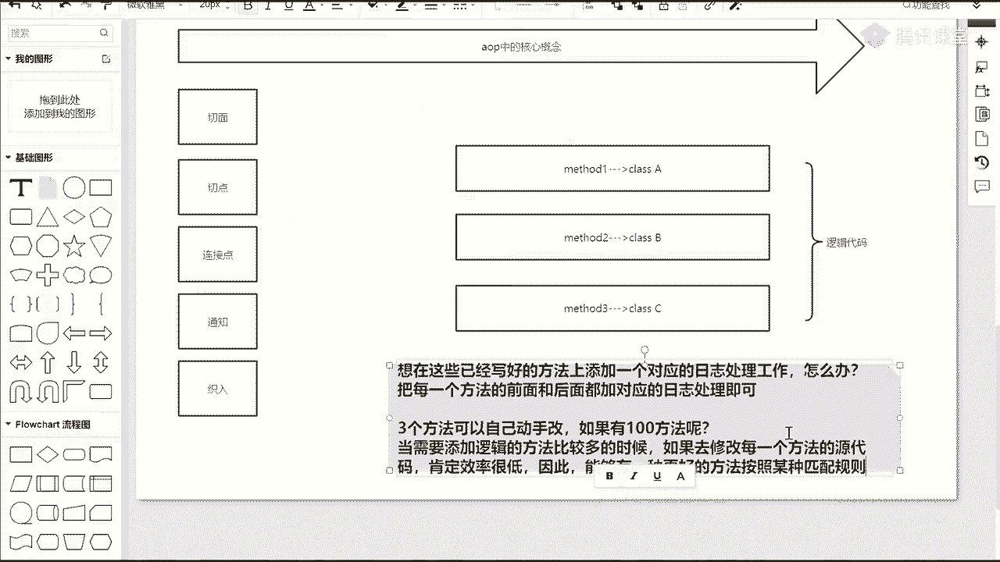

然后添加对应的日志处理，可以吗。

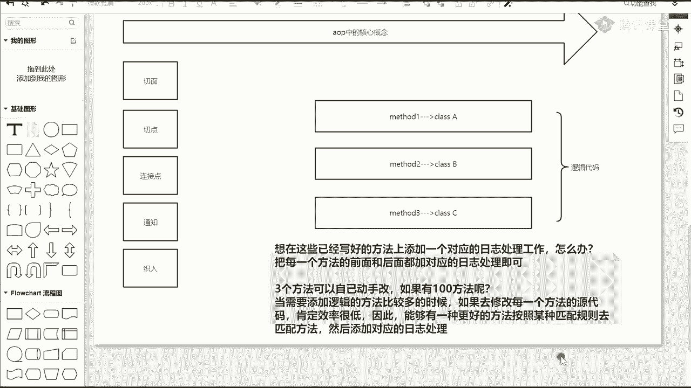

如果有这样的一个方式，是不是我们想看到的，来我这写的方式，这句话能理解同学扣一不能理解的扣二。

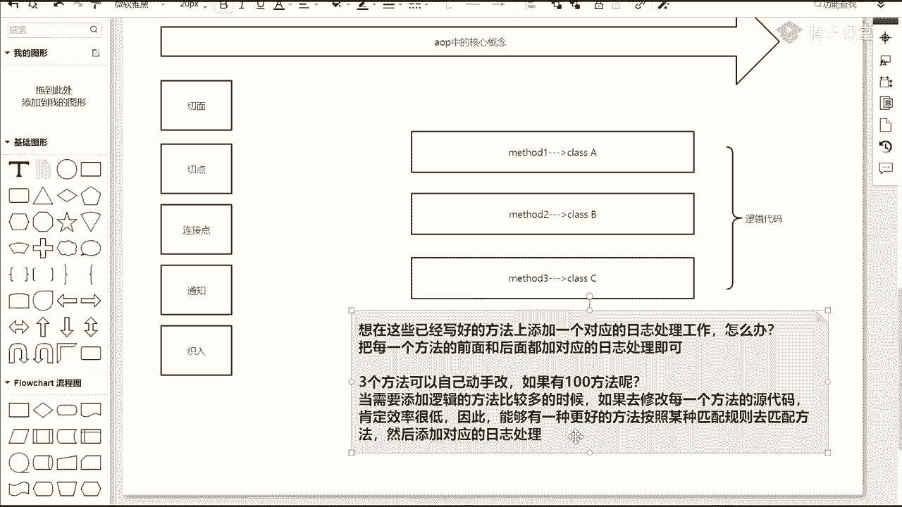

什么方式先不管啊，什么方式你先不用管，我知道了，有一种方式好吧，可以在这个方法里面进行一个切入。

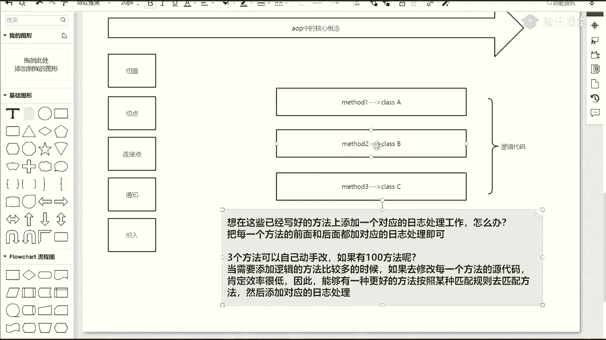

增加对应的一个日志逻辑处理，很明显没问题吧，这个时候问题又来了，每一次我们在手写的时候都是java文件，java文件，Mac java文件，如果想把java文件运行起来。

那意味着所有java文件都要变成字节码文件，你想一下这个字节码文件是已经生成好的，一个写死的东西吧，对于写死的东西，我已经加载到我们当前的JVM里面去了，我还能对它进行相关的修改操作吗，如果想修改的话。

我还能用原生的class文件吗，不懂了吧，因为你要知道java程序想运行的话，他预测的就是我们对应的class文件是不是意思，所以这时候就想了，我能不能由JVM，根据我们当前的逻辑听好这句话啊。

通过某个技术某个技术好吧，在什么程序运行期间好吧，根据需求动态的创建字节码文件，好吧，当然所生成的字节码可以在内存中，也可以写到一，写到一写到磁盘，但是最终要有一个class文件，这可以理解吧。

如果我可以动态的改变我们的class文件的时候，你就想一下在中间处理的时候。

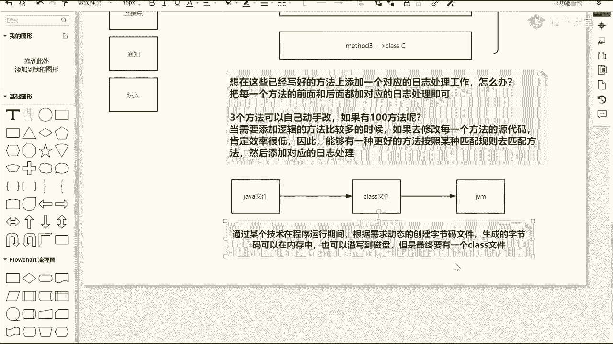

上面class文件不能动，所以呢我动态生成一个新的字节码文件，生成新的字节码文件无所谓，就是添加一些什么16进制的一些字符串吧，把它加进去，加完之后完成我们具体的一个逻辑，如果让你去手动修改。

很明显手动修改麻烦吧，很明显很麻烦，因为你需要对什么，对class文件足够熟练才可以麻烦，那这时候出来了一个新的技术，什么技术叫a s m gun static渠道的，它是一个什么，是一个框架，记住啊。

它是一个框架，你可以搜一下ASM。

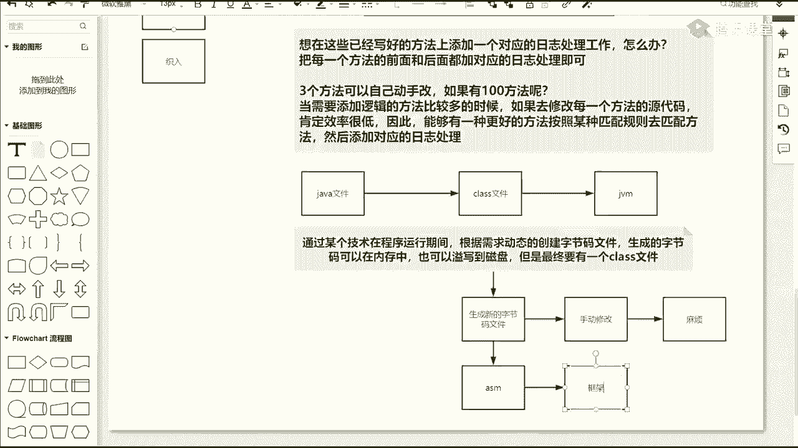

啊嗯什么东西来看。

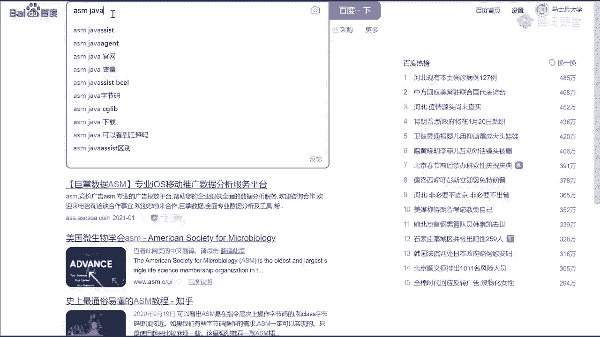

随便一个解释啊，ASM是一个java字节码操控框架，它能够被用来动态生成类，或者增强既有类的功能，SM可以直接产生二进制class文件，也可以在类被加载的时候，JVM虚拟机被动态改变类行为之前进行插入。

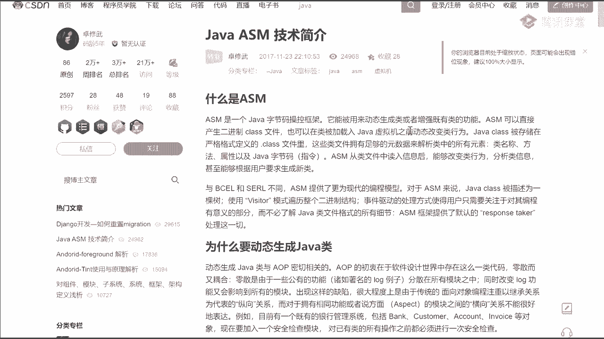

是这意思，说白了就一句话，它用来生成我们的class文件，这样能不能理解动态不需要手动了，动态的框架，动态生成，好吧，那这种方式相比较而言的话，它应该是一种比较简单的方式吧。

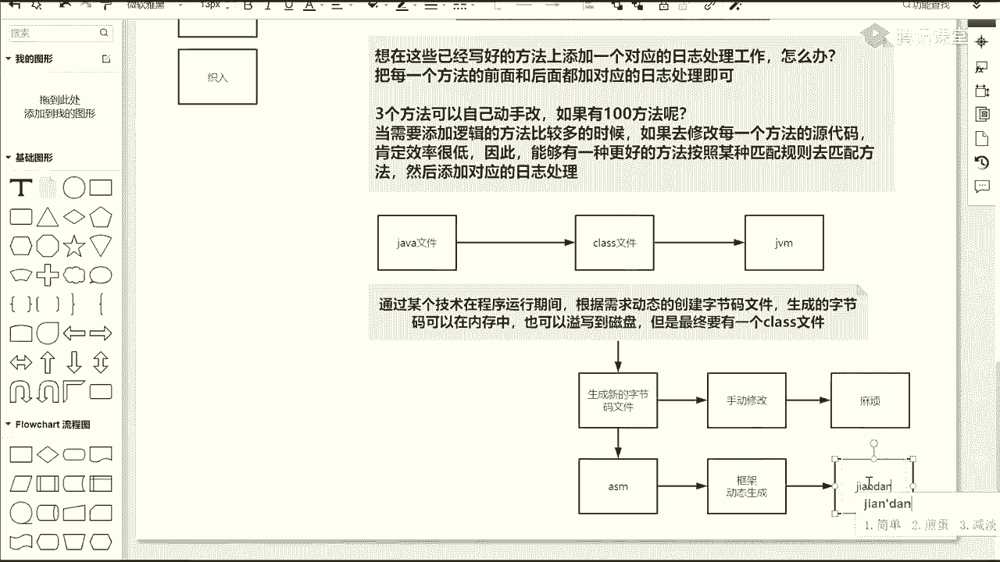

而至于说ASM怎么生成的，注意如何生成，不需要管，生成不需要管，好吧，目前面试还面不到这个级别，所以这东西对你而言无所谓，无关紧，要，先扔一边，不管它，那既然有这样一个方式的话。

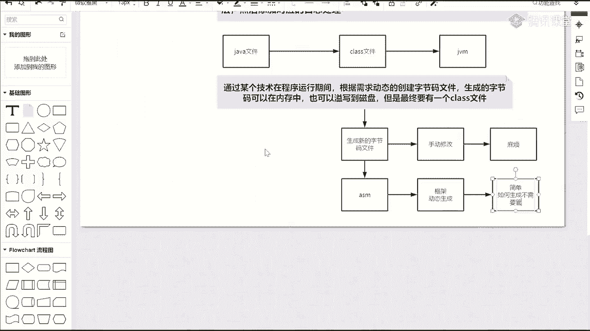

你就想一下，如果我现在不改java文件，我直接去改class文件，我在class文件某个指定的方法的前面或者后面，加上我们的日志处理不就完了吗，是不是意思，正因为有了这样一个技术，所以可以干嘛。

就是这句话再重新生成生成，或者在原来的class，文件基础之上，直接添加日志处理的相关逻辑即可，这句话能理解同学扣一，能理解吗。

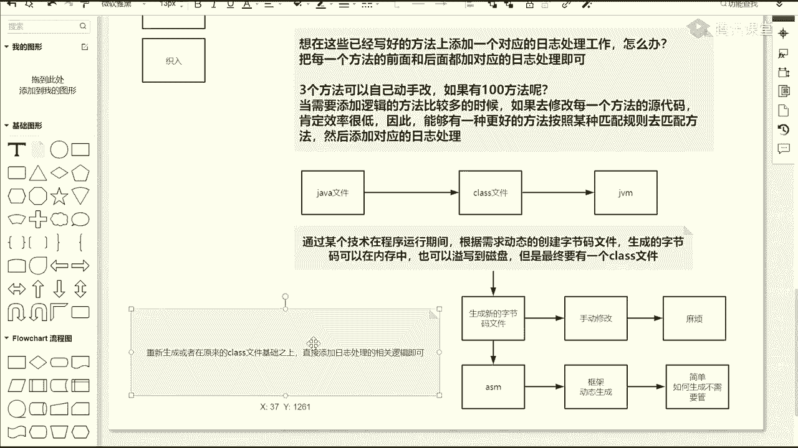

可以吧好吧，这就是我们这个面向切面编程。

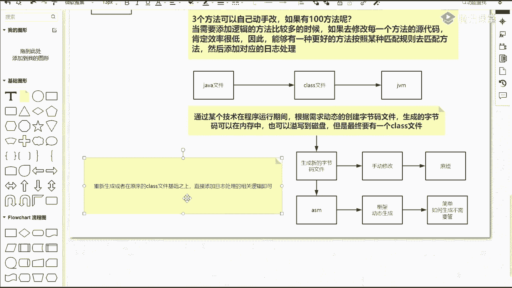

好吧，就是这个核心的一个机制，用通俗的话给大家解释一下，如果这东西你能理解了。

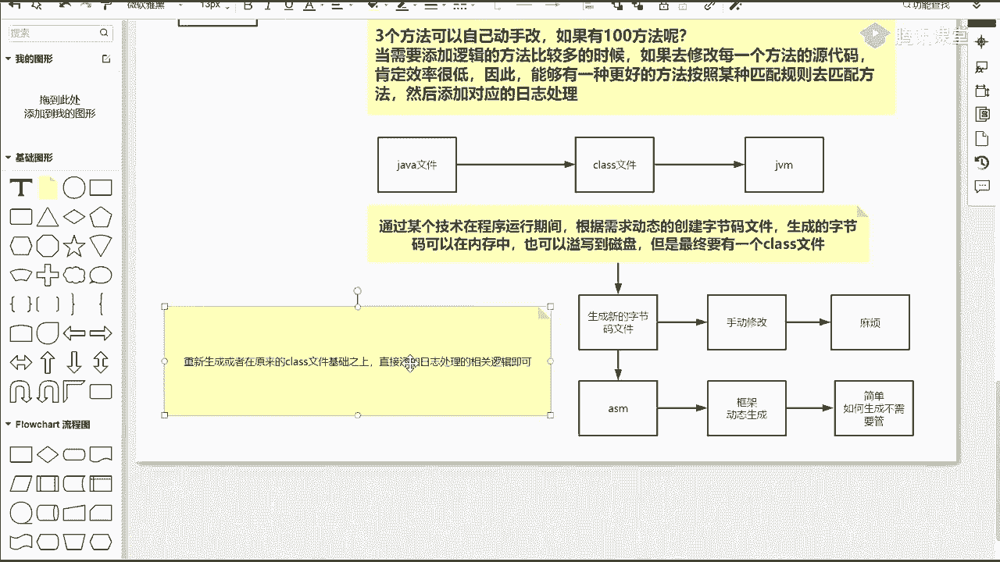

下面注意了，它起了一个对应的名称叫什么呢，叫a OP，a OP叫面向切面编程，它是一种什么叫编程思想，编程思想，有了思想之后，我必然要有具体的一些实践吧好吧，而如果我想去进行相关的一个实践的时候。

你就要考另外一件事，什么事规范要有吧，什么叫规范，我在实践的时候，我怎么加加什么类，加什么方法，怎么写代码，怎么写，配置文件怎么进行处理，我一定要对应的规范好，或者说有对应的要求。

当我定义好这项要求之后，我只要按照你的规范要求进行实践，是不是就可以完成我们具体的一个功能了，功能什么意思啊，所以注意了，同学们在spring中AOP里面，它其实就是定义了这样一堆的规范。

那这种问题来了，什么规范啊，往里面插代码的时候，往哪儿插，怎么插入，所以他给了一堆什么，我们前面讲过的这些技术名词。

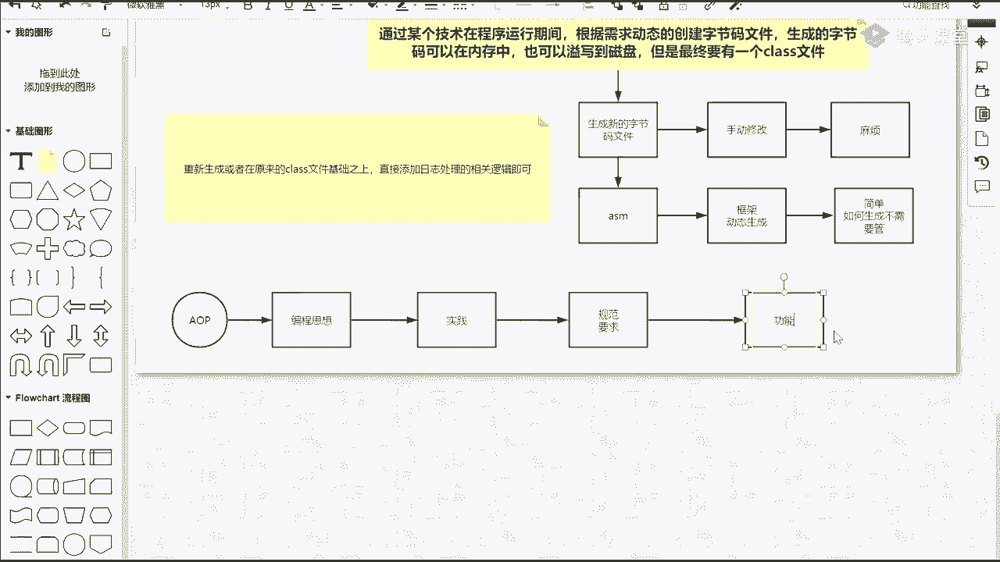

什么切面，什么切点，什么连接点，什么通知。

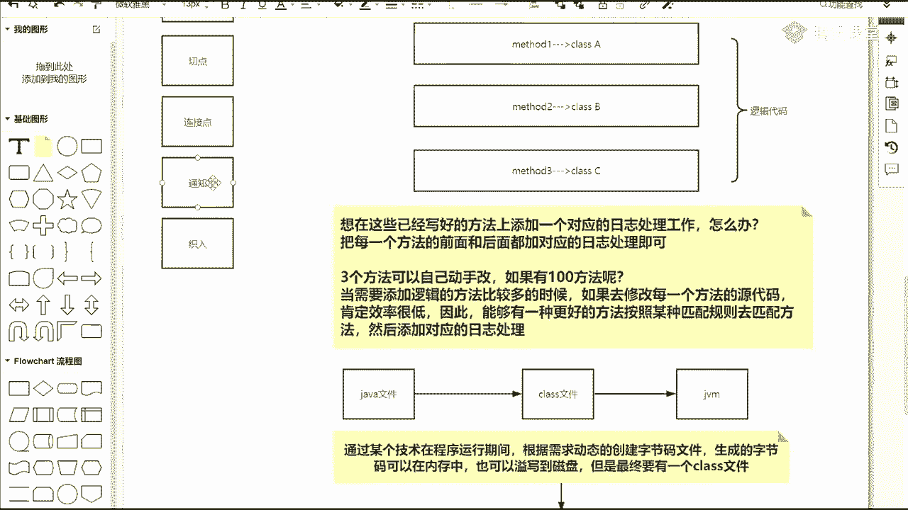

什么支路，一堆名词看起来很难理解好吧，但是不重要，来我说一下我们需要什么东西。

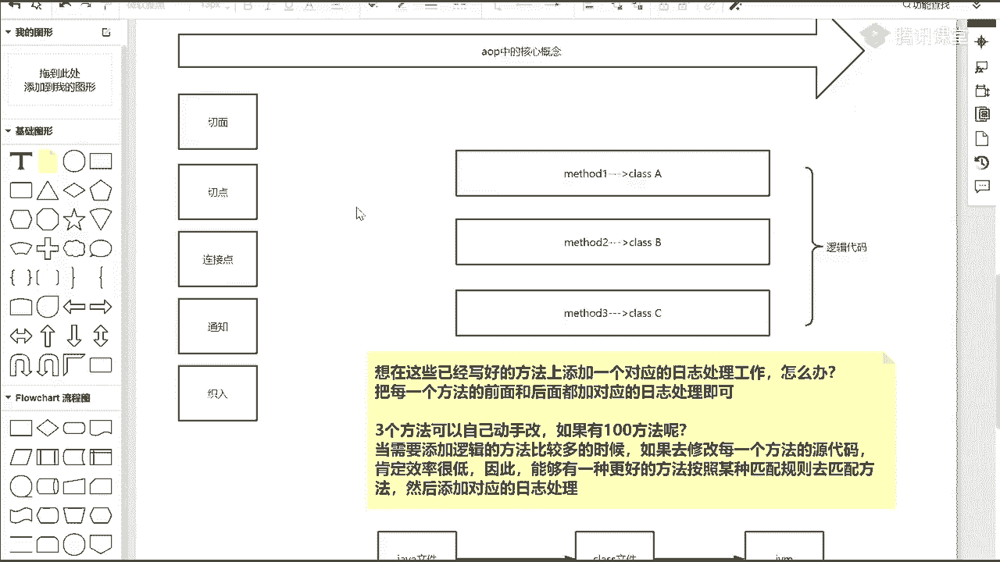

先想一下，你想往哪一个方法的前面或者后面进行插入，如果我有100个方法，这一版方案里面我想有50个方法，注意啊，我想有50个方法好吧，被进行日志操作，另外50个方法我不需要日志操作，我怎么办。

能听到这句话的意思吗，100个方法有一部分我需要加这个日志操作，但另外一部分我不需要做，我怎么把它给区分开啊。

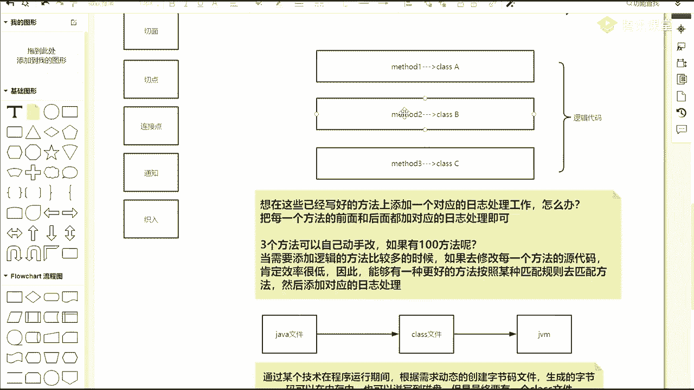

怎么区分开，最简单的一种区分方式。

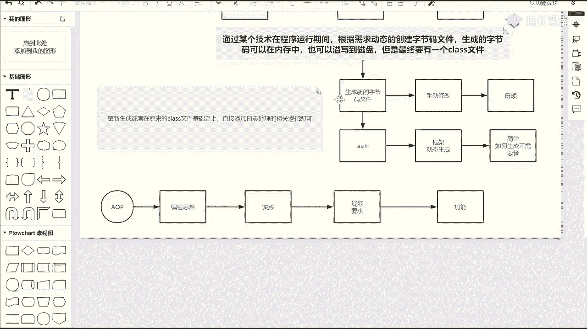

我们可以按照类型匹配啊，不是不是类型，我没看到什么东西，按照某一个类别匹配，那这个类别在进行匹配的时候，你很难固定说我的类名就这么起，我的方法名就这么起很难，那这时候怎么办。

我能不能让它遵循一部分的规范，就说我能不能通过一个，类似于与正则表达式的东西来匹配，可以吗，可以吗，所以在spring中，它专门的有一个具体的对象叫什么叫expression。

expression啥玩意儿，你通过翻译应该知道这个名词叫做表达式，是不是意思，你想一下，如果我有表达式之后，我要想进行匹配的话，我应该包含哪些规则，或者包含哪些描述，哪有描述，其实无所谓，就几块。

我们这写一下第一个方法名字你要有，是不是这意思啊，第二个方法的参数要有第三个方法的返回值，你要有吧，这几个东西是不是都要必须写出来，我是不是可以按照我们的名字好吧，参数个数包括返回值的一个类型。

参数的类型，我能不能去进行相关的一个匹配操作，忙还是不忙能吧，包括甚至什么你当前方法所在的完全限定名，什么叫完全系列名啊，报名加类名儿吗，我可以根据包叫类，然后呢来进行一个设定，这都是OK都是OK的吧。

所以第一个对象就已经有了，来这个地方能理解，同学扣一能理解吗，就说我是为了干嘛叫匹配方法，第一个点写过来，匹配方法，匹配方法好了，第一个当匹配方法有了之后，第二个我在方法里面加的时候。

你应该知道一个方法里面不可能只有一行代码，可能包含了N多行的代码对吧，那这时候就想一下，方法的哪些位置可以插入代码呢，说到这个问题，比如方法哪个位置可以插入，你想一下，当我在开始执行方法之前。

最前面能加一个吧，比如最前面可以加一个对吧，然后当我方法的核心逻辑执行完成之后，最后面我后面可以加一个吧，然后再想一下还有什么还有什么东西有前面了，有后面这块啊，都表示了我们的核心逻辑好吧。

核心逻辑还有什么，我出现异常的时候，我是不是可以加，对不对，同样的有些方法是有返回值的，因为方法没有返回值，我在返回值的时候是不是可以加，是不是一共包含了这四种对应的消息通知。

那这四种通知对应过来之后就是啥叫before，是不是意思，然后呢后面还有一个，后面有一个after，对吧，还有一个异常叫after throwing，还有一个返回值叫after returning。

是不是玩意儿，我是不是有了这些对应消息通知了，为啥异常时候能将你在一出现异常的时候，我们怎么处理来着，我们一般情况下在进行异常处理的时候，都是try r y括号，大括号。

然后呢后面可以跟一个什么catch对吧，大括号后面可以跟一个什么叫finally，我们一般是不都都这么写的，那你告诉我，我catch里面我不能做一些异常处理吗，如果我就想说，如果出现异常。

我加一个日处理，你怎么办，你是我开指定加了，那我是不是可以指定，我们对应异常的一个情况了，专门在异常的时候进行使用，是不是意思，这也能理解啊，这个同学叫没名字啊，你这东西你应该能理解啊。

专门为异常所准备的一种情况，因为代码出现异常是一种正常情况。

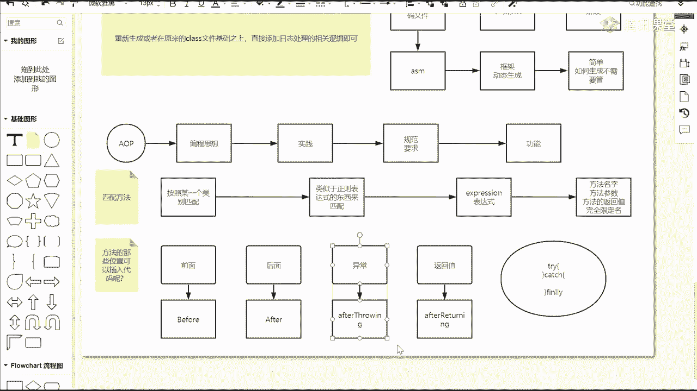

你代码如果不出bug了，反而不正常，明白意思吧，当我有了这四种之后，你就开始想了，大部分情景里面我们一般都是怎么样，前面和后面是不是都要加，每次都写两个，可能太麻烦了，所以在他们两个的基础之上。

基础之上，我可以这样再加另外一个额外的东西，叫什么叫环绕通知，环绕通知就是我们说的around，既包含前又包含后，什么意思啊，既有钱又有后对吧，一共在spring中提供了这五种对应的通知类型，通知类型。

这能理解吗，所谓的after也好，before也好，还是after throwing也好，after returning也好，around也好，他们表示什么意思，他没有什么意思，我们虽然说了叫通知。

对不对，给个名词叫通知，叫通知，但是你要注意一点了，当前这个通知有了之后好，我要干嘛，这些before after after throwing after return，里面是否包含处理逻辑对吧。

包含，哪怕你就打印最简单的一句话，打印什么话，比如说写这样的话，The system，点out点print line，写一句话叫方法开始执行，这句话是不是也是一个逻辑处理。

我是不是要把这些before after after returning，After throwing，我都变成类似于这样的一个描述，他是不是有方法了，是不是有方法，那这些方法叫什么，这些方法叫什么。

给个名词，什么名词啊，叫啥，别光送花，听课好，听课好吧，不让送花了，叫什么切面吗，a OP吗，好了，这给了一个名词，同学们需要记住了，叫什么叫advice。

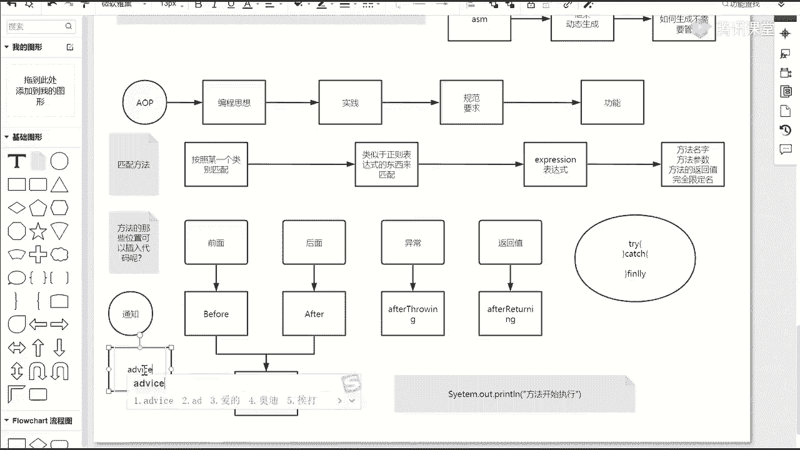

刚才也给出了通知。