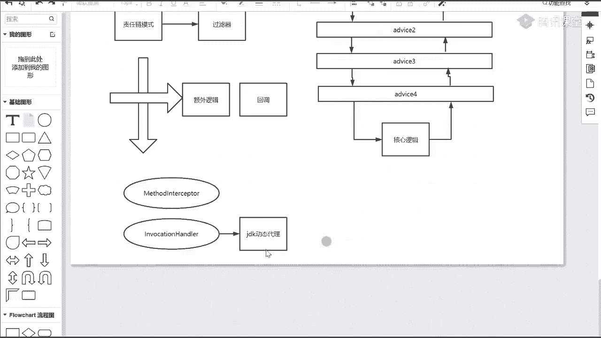
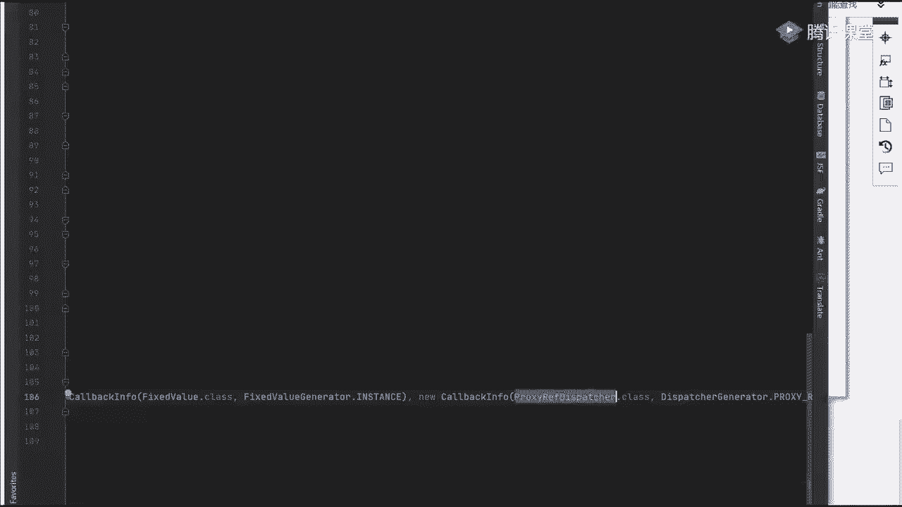
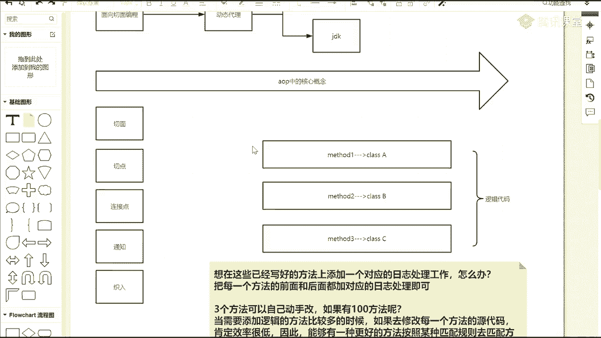
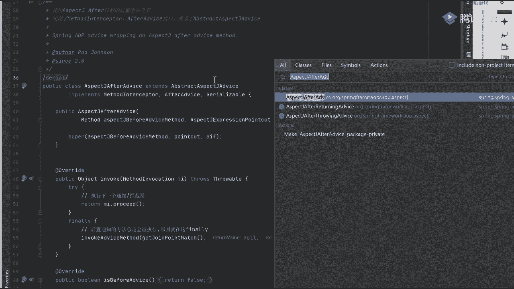
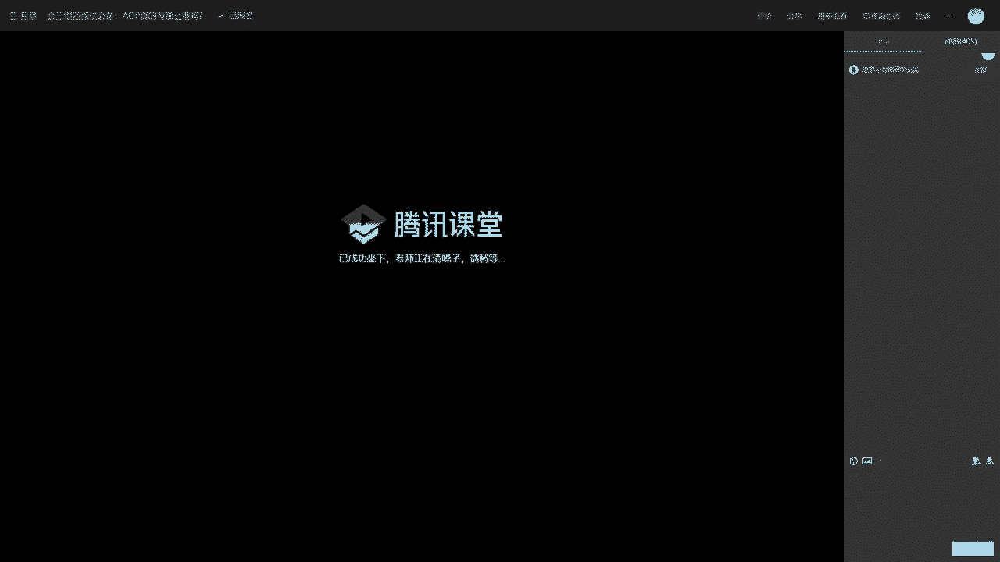
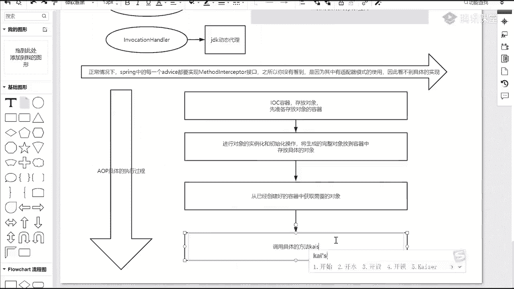

# 马士兵教育MCA4.0架构师课程 - P41：41、AOP的几个核心概念 - 马士兵学堂 - BV1E34y1w773

刚才说叫切入点，切入点放这可能那个名词不太合适啊，就叫消息通知advice，翻译过来叫通知，其实也不太合适啊，你就知道了，它是包含某个具体处理逻辑的，而一般情况下我们在写的时候可能包含前置，包含后置。

包含throwing，包含RETURING，这些东西可能都包含在里面去，当我都包含到里面去之后，这些东西能不能给一个统一的规范的一个描述，或者说放到某一个对应的切面里面去啊，放某一个固定地方。

这里加个背景，当我定义好我们确定的这些具体的通知之后，它里面都有具体的一个方法处理逻辑了，我能不能把它放到里面去，那放到这些里面去之后，它称之为什么，这东西称之为什么玩意儿，切面吧。

是切面叫as pet，要有当前那个切面，当我有了AOP了啊，当我有了这个匹配方法了，当我有了这些切面，有了这些advice通知了，其实我就可以完成什么完成，AOP的过程了，或者说完成。

面向切面编程的所有操作，我只需要知道这几个对象就可以了，但是我们应该知道，当你定义好通知之后，这些通知可能是同时存在的，当这些所有通知都同时存在之后，我一定要有一个什么具体的执行顺序吧。

我不能说谁想先执行就先执行，谁后想后执行就后执行，这肯定不行吧，那当我有这样一个顺序之后怎么办，而且你发现了before也好，after也好，around也好，throwing也好，return也好。

它们应该是包含自己指定的顺序的，而且有可能本身就是有什么嵌套了吧，比如说我先执行before的方法，当我执行完比方法之后，我发现了里面有一个around，我是不是可以执行，或者执行完之后。

我能不能再加一个before都可以吧，它有一个嵌套的过程，而这个嵌套过程，每一个通知你最终都是要执行的，因此基于这个维度考虑什么事儿，可以考虑什么事，同学们在spring a OP中。

它引入了一个非常核心的概念，叫什么叫责任链模式，什么叫责任链模式，谁能解释一下吗，这玩意怎么理解，啊怎么理解啥叫责任链，你们都接触过，往下看，有人接触过滤器吗，接触过吧，啥意思啊。

假如说我这里面有一堆通知，这是advice1，举个例子啊，advice1这个advice啧，那V2有三好吧，有四家有这堆这一段执行的时候，当你执行完成之后，最终的才是谁，我们具体的核心记住叫核心逻辑。

是不是意思，所以我整体的一个调工程变成什么样子了，从刚开始第一层，从第一层开始，从这儿来往下掉掉下来，第二层掉下来，第三层掉下来，在这块当我调完成之后，最终会调到我们的核心逻辑里面去，当这执行完了之后。

没完还要干嘛，还要把当前的结果给返回回去，你不能说没有返回吗，肯定要有返回的，再返回去返回，这是一样的，返回返回，是不是这意思，我必须要有这样一个返回的过程，这东西就可以称之为责任链。

而且在中间某个调用过程中，我再接着往下调，再调用的时候，后面这块逻辑可能还没执行完，我改下名字二，然后三然后四，这都能理解吗，来这个图能理解，同学给老师扣一过滤器，是用这样一个方式对吧，这也是一样的。

一模一样东西，我就是挨个往下进行相关的一个调用，当我调用完成之后好吧，下面来再接着聊聊啥，有当前链了，我要去拦截我们对应的一个方法好吧，那我在方法拦截的时候，我需要怎么拦截啊，我怎么去调用当前方法。

其实这里面还引入了另外一个机制，什么机制，正常情况下我们的代码怎么执行的，从上往下依次执行，假如说我想在中间某个环节执行过程中，当你到这个环节之后，我要执行其他的一些额外逻辑，怎么办，额外逻辑我怎么办。

这还用什么样的一个机制，什么样的机制没问题啊，正常情况下代码是往下执行的，这是我们具体代码逻辑，但是在中间某个环节的时候，我想让它在执行一些其他的额外逻辑，或者怎么做好了，同学调节点叫观察者模式。

模式观察这个模式它最本质的东西，它是一种什么回不是设计模式啊，什么机制啊，它是一种什么机制，同学们，总代理事件扔开扔开观察者模式好不好，好了，对监听我不提供这种模式了啊，这个这个这个例子举的不太好啊。

这不太好，共和纸什么东西呢，想说的是啥，想说的是回调，这样一个机制叫回调机制，这回调你必须能理解什么叫回调，本来我传递参数的时候，我没做任何的一个执行，到后面执行某个环境接的时候。

我可以再把刚刚传进的方法进行一个执行啊，对类似于钩子函数和回调这样的一个方式，而我们在进行回调的时候，在我们具体的spring源码中好吧，它提供了一个非常核心且巨化的类，什么类。

就好比你们之前写代码的时候，一定见过几个对象，什么对象来，有没有见过这样的东西，第一个叫method interceptor，你见过这东西吗，见过吧，除了这个东西，如果你用的是纯原生的JDK的话。

你有没有见过什么东西叫invocation handler，见过没，JDK动态代理的时候，你一定见过这玩意儿，JDK是不是这意思啊，动动态JK动态代理，代理你一定用过这套机制。

同样的它里面有一个method interceptor，在我们整个spring的框架源码里面，它也提供了类似于这样的一些描述，只不过它里面包含的比我们了解，要多发什么东西来往下看，有这样一个对象。

你看一下叫call back，In f，没有啊，call back写错了吗，好往下看往下拖，拖拖拖拖拖到下面，这东西叫cubs，里面包含什么东西，每一个call back的对象有什么东西。

none NO o p好吧，有什么呢，叫method intercepor，这东西我们见过对吧，还包含什么叫invocation handler，我是不是也见过。

在包含后面还有什么什么lazy load对吧，还有什么叫dispatch，后面呢还有叫fied value对吧，后面还有一个叫propose r e f dispatch，是不含这么多类型。

这类型啊我们一般都接触不到，但是在经常使用的时候。

一般这样东西用得非常多，就是说当你的方法想要具体被执行的时候，被执行的时候需要啊，这么这么这么写不太对啊，什么意思呢，通知，通知需要想要被执行，到时候好吧，需要进行相关的拦截好吧。

需要什么叫实现method interceptor接口，这个东西怎么理解，我刚刚说了吗，你想一下，这是我们刚刚的方法逻辑，正常情况下，假如说我先调method1，调完master1之后。

我调method2，调完method2之后，我调method3，它正常情况下是顺序接着往下走的，一个掉一个，这个时候你想在方法一前面加一个逻辑方法二，一下面加一个逻辑，方法二，前面加一个逻辑方法二。

后面加一个逻辑，你这是不是相当于把整个调用链给拦截掉了，这能理解吗，无理说MBC连接器可以这么理解，是不是可以把它理解为一个拦截器的链，当我有了DJ之后，我是不是可以把当前代码的一个。

正常执行顺序给拦截掉，这能理解吗，还能理解同学给老师扣一，能不能理解，而那些拦截器在进行具体代码实现的时候，这就相当于是我们的advice，所以你会看到你的advice里面。

有些是需要实现method interceptor的，来举个例子吧，找一个比如说有什么叫嗯，你点不过来啊，看着啊，它具体时间类，比如说叫as pet，挨着看吧，Before method。

Before b e f o r e o r e advice，完了看它有实现我们具体的method inside inception吗，没有吧，来再看另外一个aspect对，然后呢。

after advice他有没有实现，他实现了没实现了吧好吧，你能看到这个接口啊，这个AVS通知实现了当前这个method接口，但现在，那你。

你信啊，谁天天吃饭，谁是小狗，可以吧，这是不是可以没顾上啊，不聊这事了好吧，一会再说啊，再说啊，来好，这节课，我们想在进行具体的当前这个执行过程的时候，怎么执行啊，第一步干嘛，第一步干嘛。

同学们永远别忘了一件事，别永远别忘了一件事，什么事，spring虽然是个框架，同时它是一个生态，但我们在更多描述的时候把它称之为什么，它是一个容器吧，叫spring容器，我是IOC容器吧，这么说吧。

IC容器，那容器意味着什么事，在容器中一定存放对象吧，但是我要先有容器吧，所以第一步能不能说出这样一句话，什么东西叫做先准备好吧，存放对象等容器可以吧，这可以称之为我们的第一步骤。

当这个步骤执行完成之后，容器有了下一步干嘛，下边干嘛，想一下，容器是第一个环节，我把容器先准备好，当我把容器准备好了之后，第二步要干嘛好了，放东西，非常对，叫存放具体的对象，但在存放之前你要干嘛。

是不是要进行对象的实例化和初始化操作，将生成的完整对象好吧，放到具体的啊，放到容器中，容器中，这没问题吧，这是第二步，当你的容器都准备好了之后，第三步在干嘛，现在干嘛，是不是要从已经创建好的对象啊。

容器中好吧，获取需要的对象，然后呢再往下一步，干什么，这叫调用具体的方法开始。

进行登录是不是过程。