# 系列 5：P42：42、图解说明AOP的运行流程 - 马士兵学堂 - BV1E34y1w773

有这样一个对象，意味着我要往当前对象里面放chain，是不是这意思，所以它在进行最调用的时候是怎么调用的。

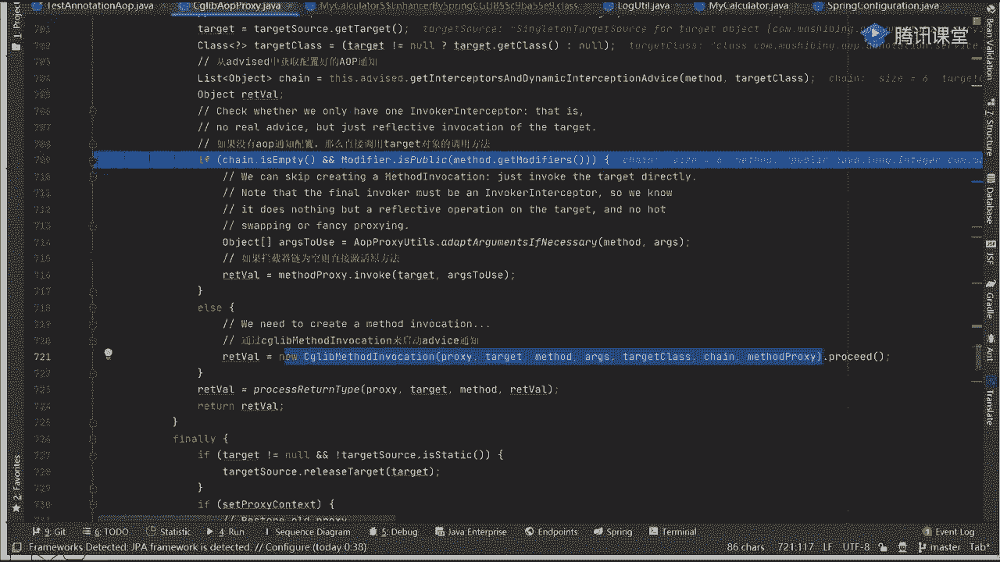

外面有一个包装好的衬对象，对象对象好吧，这东西它需要什么，我第一次调用的时候，通过chain对象里面好吧，我取出0号位置的元素，然后呢再进行第一次调用，到这是第一次，当它调用完成之后，我需要干嘛。

我需要干嘛，同学们注意了，当你这调用完成之后，我需要调下一个，对不对，当我调下一个的时候，我要知道我下一个是啥，我怎么知道我下一个是啥，没问题啊，我怎么知道我下一个是谁，你知道吗。

不知道你如果不知道的话，就意味着你当前这条路线，你要回到当前这个chain的链条里面，我是不是才能找回来，所以第二个从这儿回来来，这东西能不能理解，他是不是回来了回来了，回来之后好了。

我刚刚取的是下标为零的元素，下面我该选谁了，想要为一的元素吧，那如果唯一的话，我要取到这块，这是二第二个步骤对吧，那这是第三个步骤，能不能理解，能理解吗，同学们，这个路能理解不，哎这个比较麻烦的地方。

可以吧，那一样的，我调完它之后，我依然要返回回去，往上走，这是第四个，回来之后我再要怎么样呢，从哪找，第三个，这是第五条路对吧，然后呢再接着回去，往往下拉距大一点，往下走，这是第六个对吧。

他进来之后一样，我再找下一个，这是第七个，他回来之后我一样，他也要返回返回去，这是第八条路，往回走没问题吧，这是第七，然后呢当你做完之后，下午再来吧，我从这儿画了啊，这再来，只要大，这是第九个对吧。

这时候这是第十个，来当前这个调用过程能看明白，同学扣一没问题吧，对这个调查过程应该还是比较清楚的，比较比较好理解的，那这时候你就想意味着我在整体的调研过程中，我必须要时刻知道当前这个对象吧。

而且我在任何一个around也好，before也好，after也好也好也好，我里面必须要能够获取到当前的性对象，什么意思啊，因为你不获取到充电桩的话，我是不知道我从下一个链开始往哪进行调用的。

我找不到了，是不是这意思，所以他给当前这个链式，这个结构也包装了一个对象，换什么东西，它的名字也很好玩，什么意思叫看好了啊，叫什么叫expose invocation，Interceptor。

这东西他给了这样的一个名字，但他给的名字叫什么，叫暴露的执行拦截器，它本身也作为了一个什么东西，叫advice，看这意思吗，本身也作为一个advice，而在进行调用的时候，它是谁，他是第一个被执行的。

也就是说在这个执行过程之前，还有一个什么叫0号位置，0号位置来看一下我们是不是这样一段过程，来，我们走下这个走，走下这个这个过程，分列式给值必须要返回吗，什么叫给值必须要返回，没听懂啊。

1+7这个图如果你能明白的话，下面该干嘛了，我是不是要挨个进行相关的一个调用了，先问一下第零个我指向哪个元素，没问题啊，第零个我指向谁，Come on。

这叫exposed invocation interceptor，因此我们刚刚看到这个链条之后。

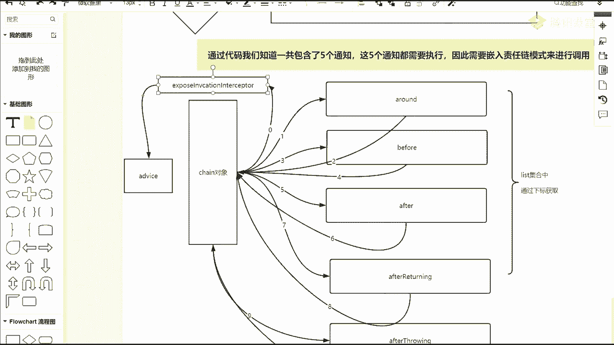

你发现了这个链有几个元素六个吗，第一个叫什么叫invoke，叫expose invoke interceptor，最后第一个取的因是它怎么取得，看效果很好玩。

走我创建一个对象叫CD lib method invocation，创建对象，当我创建好对象之后，好吧，我调了一个什么叫proceed方法，点进去看一下这个方法里面有没有proceed。

proceed调的是谁啊，叫super super，找谁找父类了吧，点开它的父类，父类里面有个什么啊，找proceed，从这开始吧，所以我们最终能进到这块来进去看看吧，好吧，我看你们始终是蒙的啊。

进来来点F7进去，你看一下是本类的吧，当你一进到本类之后，他告诉你说好了，你要叫super调父类了，我再给F7调到分类了，你看一下这个变量好玩不好玩，第一个叫什么。

叫current interceptor index，第二叫interceptor and dynamic method measures，它有几个等于几，它几个等于几个，它的这个结构值一共是六。

他是谁，一吧，为什么一啊，因为我们说了嘛，刚开始取的时候从零开始取，我默认的初始值等于一，好看，默认初始值等于一，所以我在开始获取的时候，判断你第一个值减一等于几，等于五吧，因为你的下标位置是多少。

长度是六，下巴位置是012345吗，是不是这意思，所以刚刚进的时候他能进来吗，这个衣服能不能进来，肯定进不来嘛，你一怎么会等于五呢，肯定进不来，因此它跳过去，跳完之后，你看一下他从这个链里面开始取了。

取的是谁，取的是谁，叫this current intercept index，先加加编辑了，他本来是一，加完成之后变成几个零吧，所以我取出对象是谁。

往下看是不是叫disposed invocation interceptor，我把它取出来，当我把它取出来之后，我要进行调用，执行了，往下走到最后一行进行一个类型转换，转换完成之后。

点invoke开始调用，点F7进去，你看一下他干了什么事，同学们注意啊，这很这样很好玩，这样很好玩。

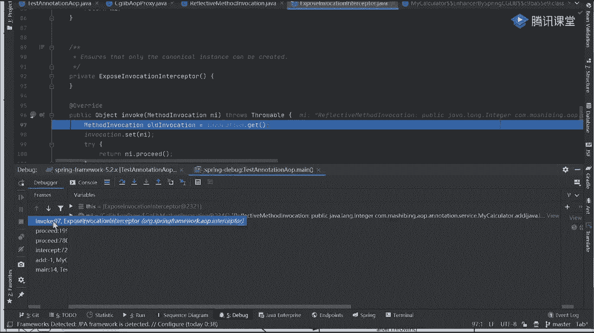

我说了，我们刚调用的时候，我必须要保证我的每一个通知，每一个通知我都能够得到这个亲对象好吧，而我们的chain对象放到哪了，问一下当前的chain对象，我放到哪个对象里面去了，哪个对象，expose吗。

是0号吗。

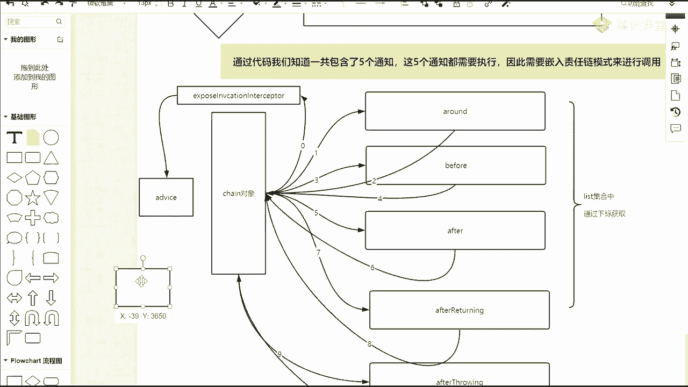

哎呀这是白看了，来回来找一下，放哪了，是不是这玩意儿叫CD live method education。

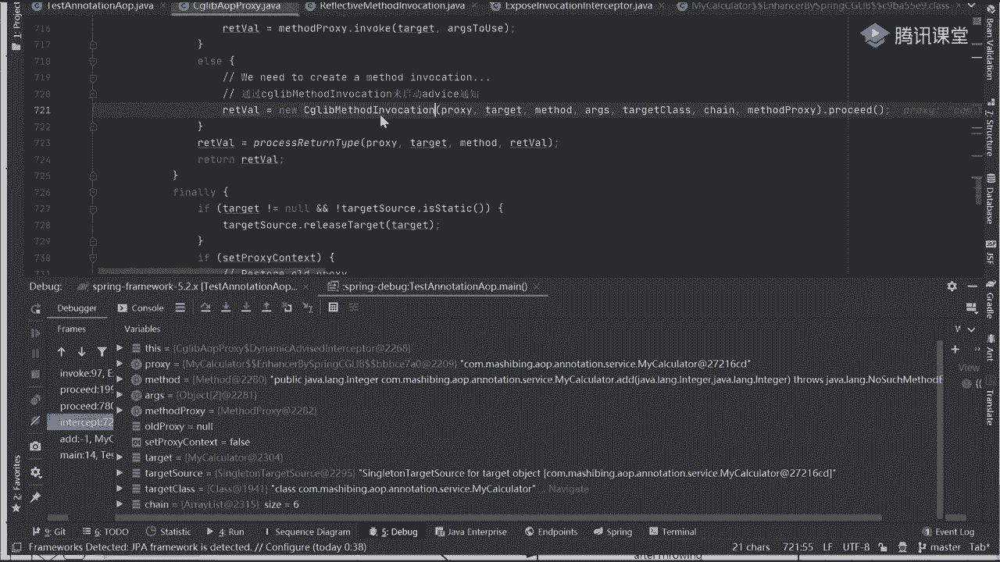

是不是这样一个对象，我放到这里面去了好吧，这里面是包含我们当前的chain，能看到吧，所以当我在进行调用的时候。

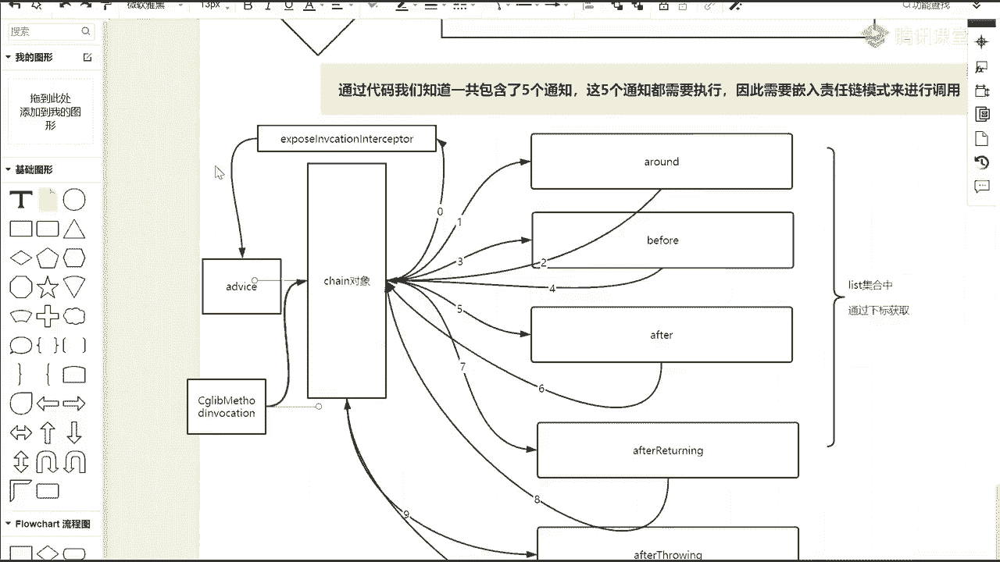

你注意一个核心的点，他进去之后往上走，再往上走，当我调super之后，我传递的是谁，this吧，当前的this，你告诉我指的是哪个对象，这是哪个对象，哪个是不是我外面写这个叫CD lip method。

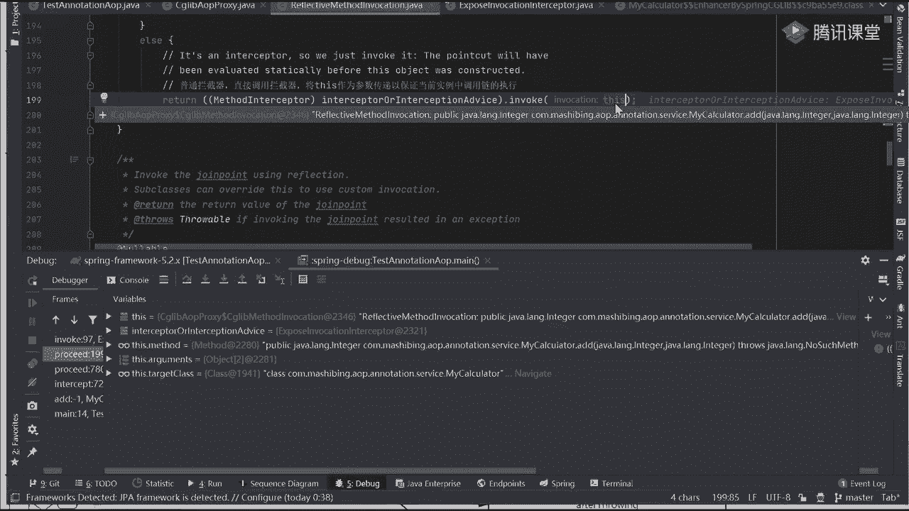

Invocation，对象，是不是他，我为啥要有他呀，我有它最主要的目的，不就是为了获取到我们的吃对象吗，我要知道我下一个元素，或者说下一个通知应该是哪一个吗，我必须要知道他。

因为我只知道他之后我才能理解这是怎么回事，能听懂吗，能听懂吗，那这样能听懂，同学扣一好了，我把放进去。

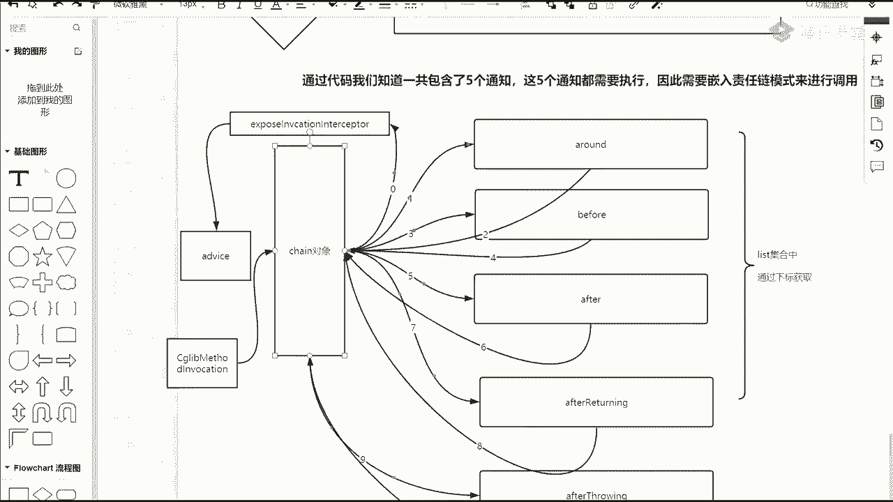

这放完之后，你们你们你再往再接着往下看，往下看，这get一下有一个invocation，它是什么，一个sweet local的当前线程，那个所共享的sy local把它放进去，放完之后，set是mi。

就我们的对象把它放进去，放完之后开始执行mi点proceed mi是谁啊，就刚看那个reflective method education吗，所以点M7进来。

前中后调的是c live a OP policy，然后再往里边点到这了吧，刚刚我取的是哪个对象，同学们，刚刚我取的是哪个对象，0号吧现在该选哪个了。

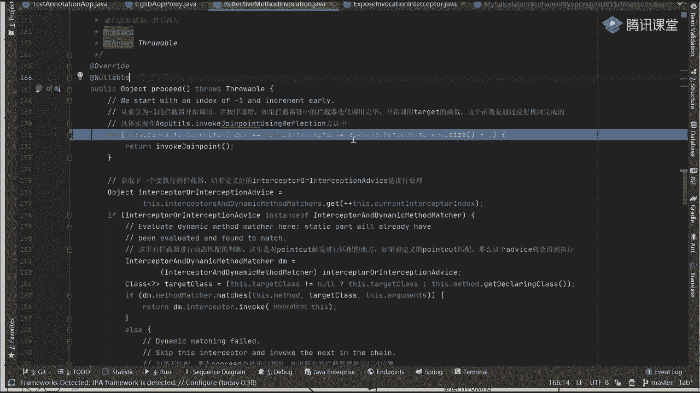

一号对不对，往下走往下走往下走，当你获取完成之后，你发现了你获取到哪个对象叫peg around，我们看这零是不是around，是这样的吧，我找到第一个around，当我找到第一个around之后好吧。

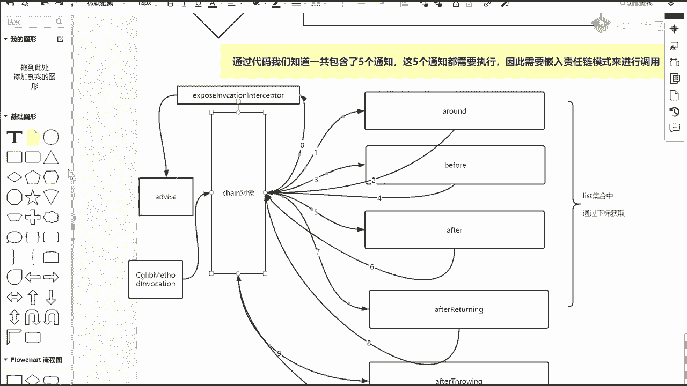

我再接着往下走走，开始点invoke，看这个类它属于哪个类，往上看它属于哪一类，as pad j around advice吧，勇敢这设计有问题啊，我靠胆真肥，你敢说他设计有问题。

你还没体会到他那好好好好在什么地方好吧，是不是到这里面去了，上来之后往里面走走走走，准备一堆对象，准备对象之后执行谁叫invoke advice method，是不是它我再点F7进去，再点它进去啊。

往上看再点它再进去处理逻辑吗，好吧，进来之后上面有一堆的参数，判断最终会叫谁叫this as peg advice method，Invoke，他指的是谁啊。

是不是我们刚刚指定好那个around那个方法，不调run方法了，来往这看啊，再接着往下看，我点invoke，点MC进去，进来之后往下走往下走，往下走往下走，往下走，进来好吧，再进去好吧，再往下走进去。

你看一下他找到哪个方法了，谁，我用什么注解标识的，什么注解标识的around吧，环绕通知好吧，这是我们第一个好了，当我知道了around之后，下一个该调谁啊，同学们，我问一下，下一个该叫谁了。

表表示什么意思，before吧，Before，我问一下，当前程序里面有任何跟before相关的东西吗，没问题啊，当前程序里面有任何跟before相关的东西吗，没有啊，你没看到before吗。

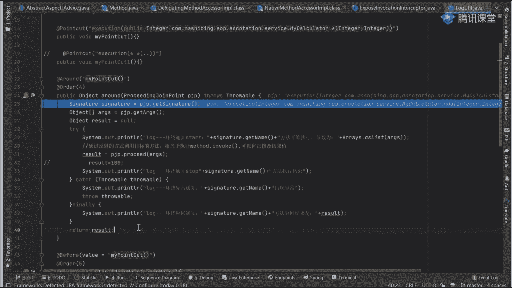

如果没有before的话，你想一下before在我们的链上放着呢，那意味着我还要回调到哪，回调到当前这个链上面，是不是去进行找下一个。

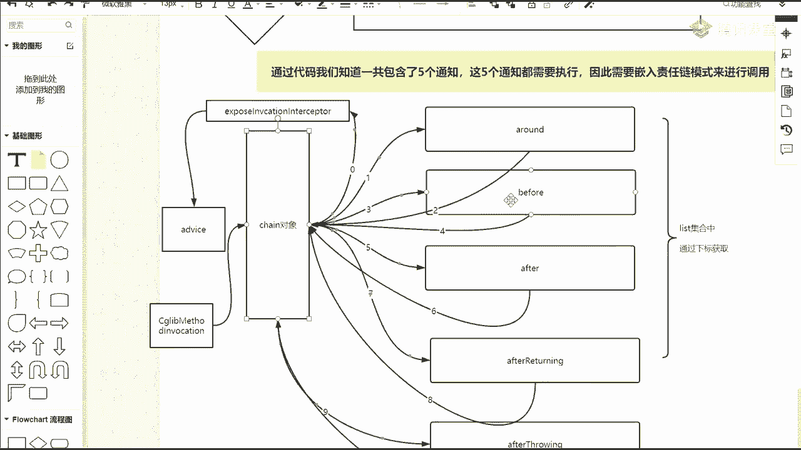

所以我怎么调用呢，你看到一个同名的方法叫什么，往下走往下走，往下走，往走走到这步叫PKP点proceed，看到proceed吗，Proceed，你往里边一点击，往下走好吧，然后呢往下走再往下走。

这有一个proceed点，它回到哪了，叫super点proceed吧，一回到super点proceed，你知道了他这个super点回到这个super proceed里面，干什么事干什么事，干什么事。

找下一个吧，是不是加了点F7进去，我又回到这块了，回来了之后，我该取消了AD等于刚刚是一嘛，现在该二了吧，我取到谁，是不是该取到我们的before了，我到before之后再往下执行，再定义VOKE。

进来之后再执行advice before，开始调before自己的方法了，点它继续进来之后，点它好，进去之后点它同名的方法都是往下走，往下走好吧，往下走点1mo，点完之后往下走，往下走，往下走，往下走。

点它进来再往下走，进来到哪个方法了，到哪了，同学们是进到比方了吗，是进到比方了，是进到比方了，当我进到before之后，意味着我可以执行我们before的一个处理逻辑了，对吧，执行完执行完执行完。

我执行完成之后，我还需要干嘛。

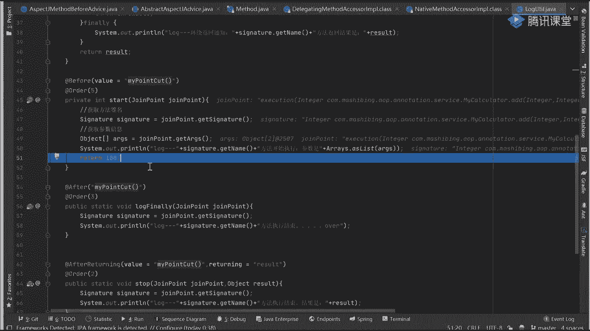

我说了，我刚刚是进到around，然后呢回去找before，找完before之后，我要在干嘛，再回去吧。

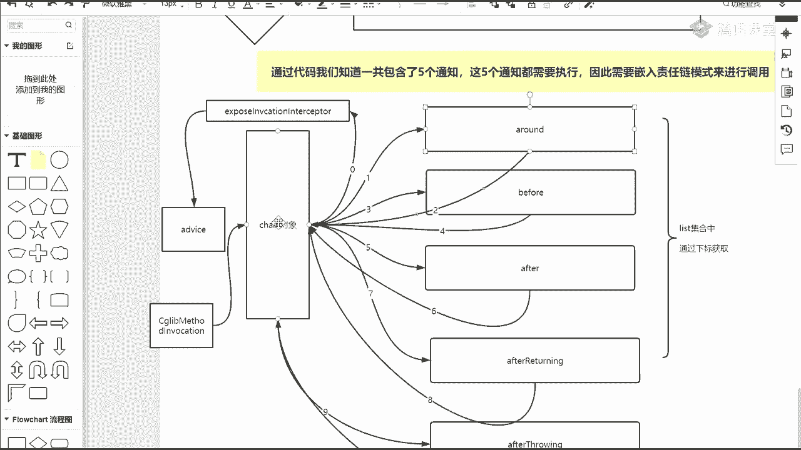

我要再回到池里面，是不是找这找我们对应的来，往下走好，返回返回都刚刚逻辑返回好，返回返回好吧，你看一下，这是我们的before advice before vice。

当我指定好before vice之后，下一步叫mi点proceed，我一点mi点proceed mi是谁，是不是还是那个CD吧，max有vocation对象，那这时候怎么办，我再点下去吧，点进去之后哇。

又到super了，我再取谁，我再取谁，三吧，点不进去好吧，找找找该谁了，该after除了执行完了，当我执行完之后，点进去叫mi点proceed，又回去了吧，是在之后执行的，我们那个I的方法。

到现在为止我有执行过吗，我有执行过吗，有没有执行过，没有嘛，所以这个后置吗，后置就前一次来进行相关的一个执行啊，前一次要进行相关的一个执行，所以这要进行N多次的一个重复。

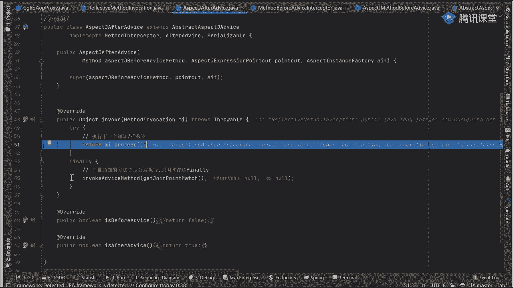

那我再回去再调，我再回去再调用，不就完成了我们这样一个链式结构吗，勇敢地再问一个问题，说为什么，为什么要回到好吧，链上直接在代码中进行调用，不行吗，对吧，我就规定好了，我就规定好了。

什么after不是around好吧，那下一个就是before，执行完成之后，我再指向after好吧，我再指向after throwing，我在指向after after returning，这样行吗。

勇敢这行吗，我规定好，每次都这么干，我只要调到around，我就叫before done before，之后直接调after行啊。

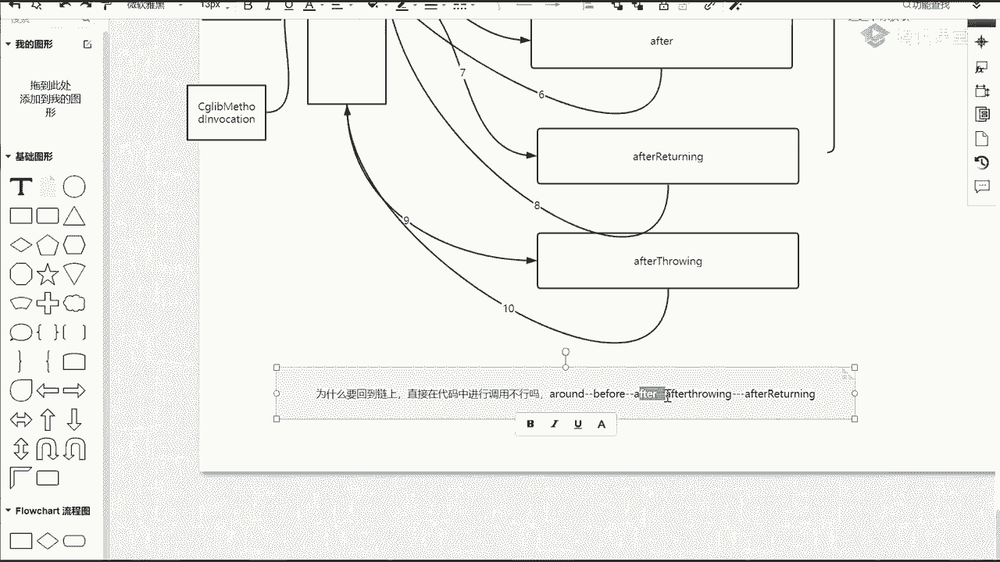

来看看东西，我把单代码停掉，停掉停掉好吧，停完停完之后看一个东西，刚刚那你们看是注解的配置，对不对，下面来看一个XML文件的配置，打开我们的AOP的XML文件，配置方式只是换了而已。

你往下看我的执行顺序是什么，注意啊，看执行顺序，看执行顺序，我第一个执行啥来着，around对不对，好了，我把顺序调一下，第一个是around调上去，第二个是before，第三个是after。

第四个是after retention，下1after throwing，跟我们刚刚注解定义好的顺序一样，不一样一样吗，同学们看好问题啊，跟刚刚注解定义的顺序一样不一样，勇敢一样吗。

就为了把你这个劲儿一样吧，一模一样好吧，一模一样来，我再打开我们的测试类，得到我的test好test之后，我这打一个断点，一样的好吧，点F7，第八个重新开始跑，注意看，看什么，看下那个链。

一会儿你就看到了，我问一下，你觉得那个形成链的顺序，跟我们刚开始形成链的顺序一样吗，来试试好吧，一样对吧，不一样嗯，有说一样的，有时候不一样了，我们不吵了好吧，我们用实践来证明它到底一样不一样。

我这个每次都要编译啊，他这个是源码编译，所以运行起来比较慢一点，写反了，最后俩是不是是不是after after return after throwing吗，我刚刚定义那个配置类的时候。

这个顺序不也是after return after throwing吗，没没错啊，来往下看看好了啊，第一步先获取到一个动态代理对象，没问题吧，注解里写了order，插板里面没写，一会儿把它给去掉。

把order给去掉好吧，又把order给去掉，先先先先证这个结论好吧，点F7进去。

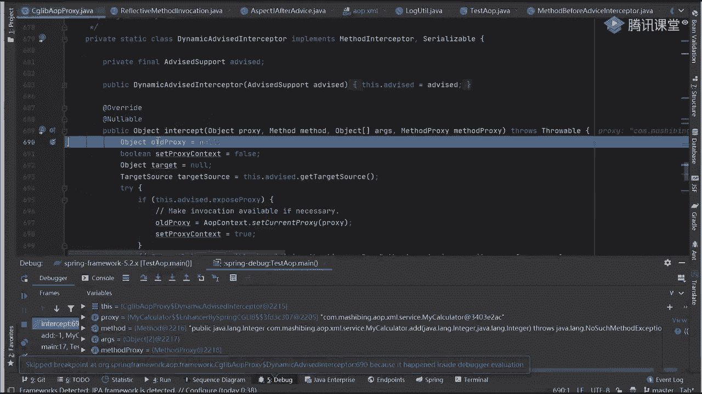