# 系列 5：P43：43、AOP中的拦截器链是如何调用的？ - 马士兵学堂 - BV1E34y1w773

接完之后往下走往下走。

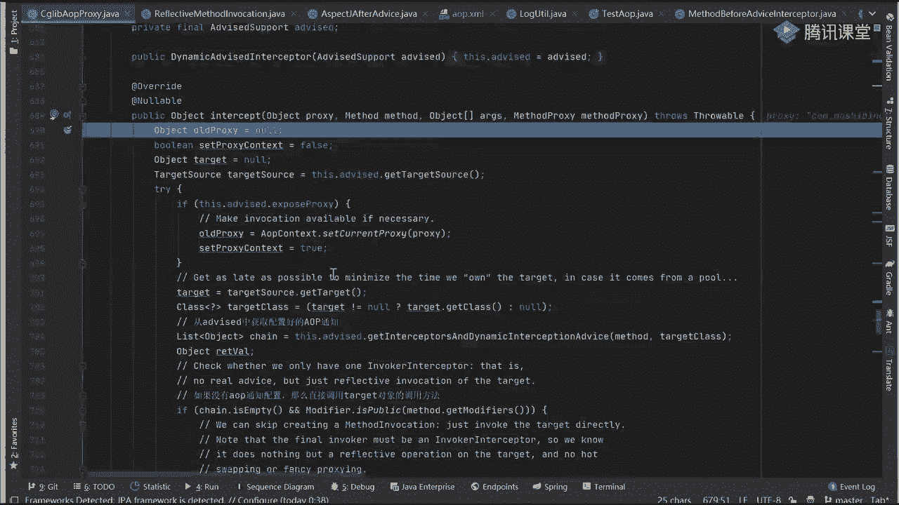

往下走，往下走，往下走，往下走，往下走往下走，我们获取链了，你来看一下当前这列的顺序是什么顺序，什么顺序，一样吗，不一样吧，刘老师不对，你刚刚不对。

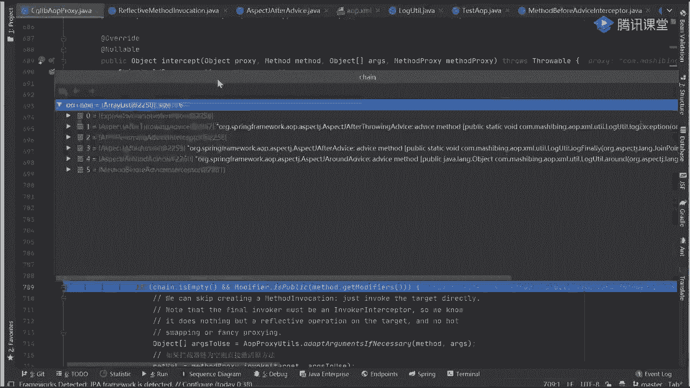

你刚刚那个呃，我要把这个结果留下来，把结果留下来好吧，放一边，老师，你刚刚在写那个注解的时候，你的那个什么指定了一个at order，我这写的1234来，我把order干掉，干掉把他也干掉，把他也干掉。

把他也干掉，把他也干掉，可以吧，可以干吗，完全没问题吧。

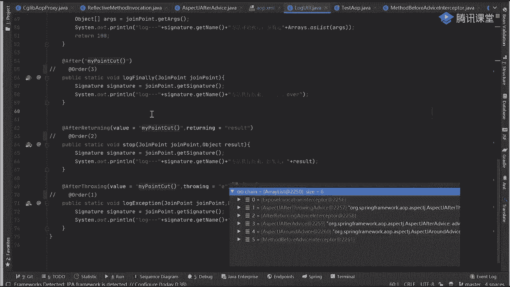

当我把它给干掉之后好吧，我再重新运行我们当前注解程序，我把这个先删除一遍啊，是谁的，这是什么东西，这是我们用在XML文件方式的时候进行配置的，放到一边诶，诶怎么不了了，哎呀完蛋好了，不管了。

反正你们知道它是什么东西，行了，来，我重新启动，把这个也启动一下，右击debug，重新启动，话看好了，这个是注解的吧，你再来看顺序好吧，再看顺序，大家一直以为你们以为的是对的好吧。

但其实你们以为的是不对的，我再问一个问题啊，同学们那个around和before谁先执行，谁后执行影响大吗，没问题啊，around谁先执行和谁和执行一样，影响大吗，不大吧，好来往下走啊，先往下走。

第一步还是一样，先获取到我们当前的拦截对象，好吧，再点F7点ADD进去。

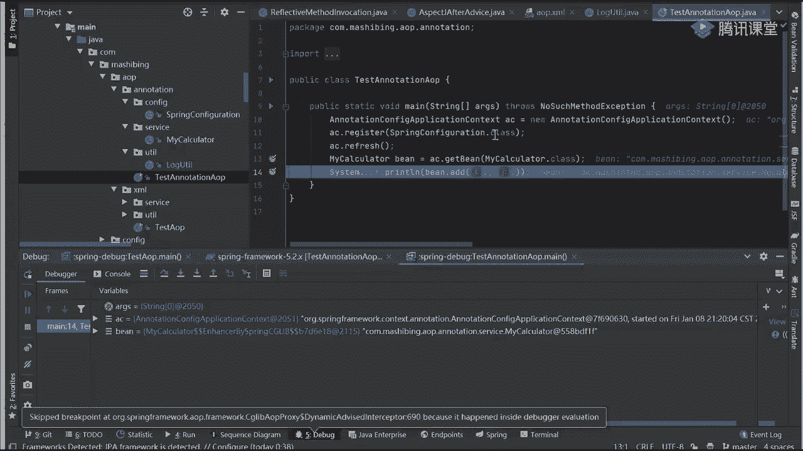

进来之后，进去之后往下走，往下走，往下走，往下走，往下走，往下走，往下走，往下走，来看一下当前的chain，它的顺序什么顺序，我把order已经去掉了好吧，我把order已经去掉了。

order已经去掉了什么东西，Around before after after returning，After throwing，跟刚刚顺序一样吗，这是注解的顺序吧。

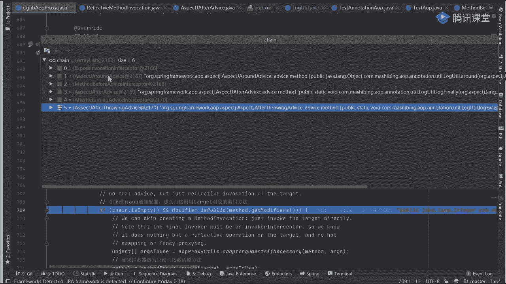

来把它拿过来。

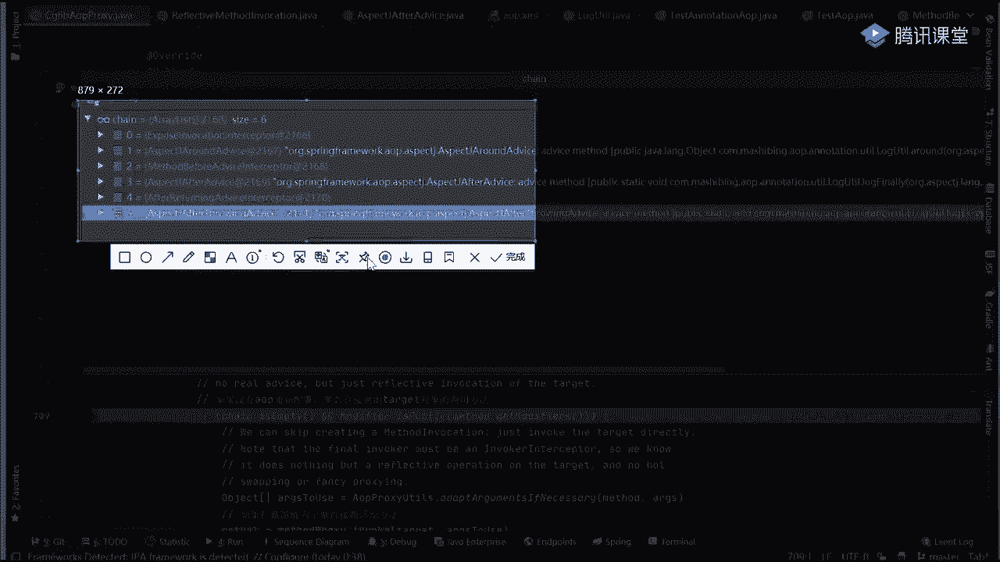

这是注解所对应的顺序好吧，然后呢我们再回过头来打开它，嗯怎么看不到了，算了看不到了，跟刚刚我们的配置配置方式，配置文件方式一样吗，跟配置文件的方式一样吗，同学们，不一样吧，代码里写死的，不可能。

他为什么要回到这个链式结构里面，因为每次你在进行这个排序操作的时候，它的顺序是不一样的，那这个顺序是什么来决定的呀，什么来决定的，注意了，在这里面有一个代码，往上看。

这里面有这样的一个方法叫short adviser，什么叫short advisor，什么叫烧脑的排序，是不是对我们的advice进行排序，好吧，当你在进行排序的时候，这个步骤里面会把所有序都排掉。

但是你注意了，他会先把你取到的advisor值，都转成一个这个对象，啥玩意儿不认识啊，不认识，往上点，这上面有这样一个注释，你告诉我是干嘛的，谁能翻译一下。

This class employment a part of order，好部分的排序对吧，实现了一部分排序好吧，it includes ring for doing啊，这玩意谁能翻译一下什么意思。

什么叫top short，顶级排序，你这个翻译还真牛逼，来看好诶，咱们有没有啊。

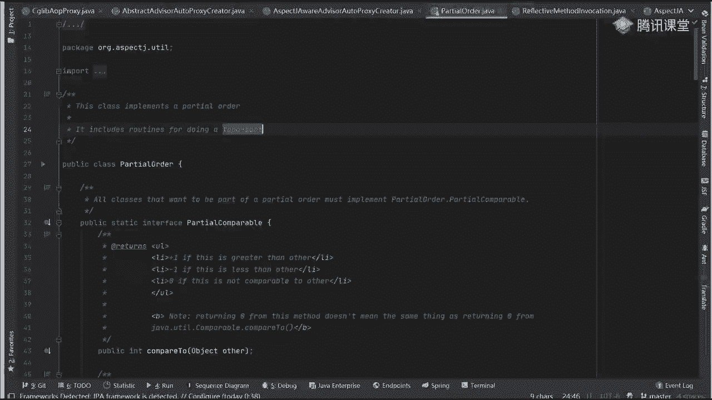

我也不跟你犟好吧，他叫什么，叫拓扑排序吧，是不是拓扑排序叫拓扑排序，如果是拓扑排序的话，拓扑排序的话，我想问一下拓扑排序每一次的结果是一样的吗。

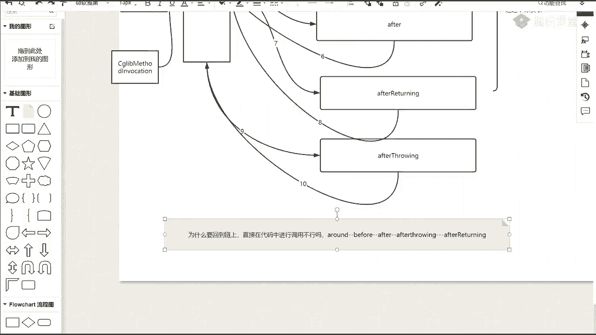

是这样吗，不一样吧，是不一样，比如说ABCDA指向BA指向C，B指向D。

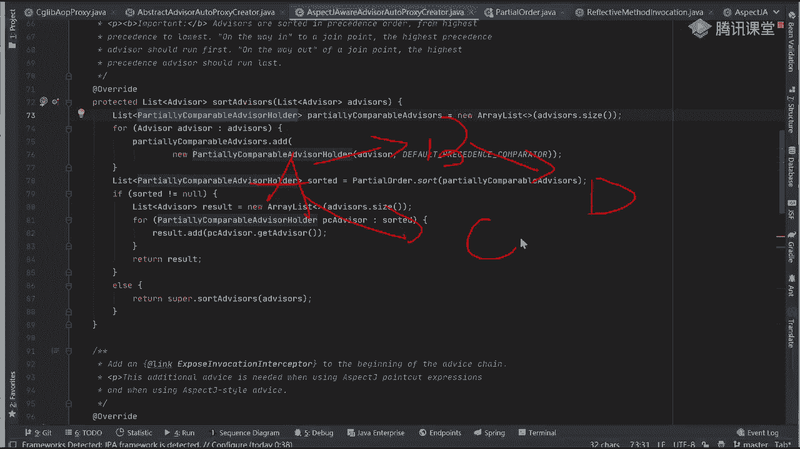

C指向D，这画不太好啊，我来看这是A，这是B，这是C，这是DA指向了BA指向了C，B指向DC指向D，他们有几个结果，A b c d，或者什么东西ACBD吧，这这这能理解吗，这东西啊，谁要不理解。

去看左神的算法课，左神讲了吧，是不是讲过这东西了，是讲这东西了，你把这个东西如果看明白的话好了，你想一下，我每次能规定好我们对应的一个顺序吗，特别是around和before之间，我刚才问了个问题。

我说around和before谁先执行，谁后执行有意义，有影响吗，没印象吧，如果你采用硬编码的方式把这东西写死了，我这个排序的价值在哪，我不要排序了，我都按这个顺序执行行了，是这样的吗。

你既然具备了排序这个功能，就意味着你是为了支撑更灵活的一个体现，我再举个例子，如果我自定义了没问题啊，如果我自定义了一个the vice怎么办，假如说我既包含在里面用的，我又自定义了一个。

你告诉我顺序什么样子的，能自定义吗，哎同学们能不能自定义，我不是说不是说自行顺序啊，我自定义一个消息通知能不能，我自定义一个消息通知可以吗，先说这个操作，我可不可以自定义消息通知，这可以吧。

如果你自定义一个，你按这个顺序执行，你告诉我怎么办，这个硬编码还行吗，勇敢，硬编码还行吗，不行了吧，所以我为什么每次要回到量上，为什么要回到量上，我回到链上，保证的问题就在于说。

我每次能从当前这个链结构里面，拿到我们最新的排好序的，一个下一个结构的数据，我拿到下一个结构数据之后，我就可以进行调用了，这个链不会乱，还按照我们之前的结构往下走，明白了吗，这能听明白意思吗。

能听明白的，扣个一，所以这个东西存在的意义好吧，每次排序都不一样吗，你在传入相同的一个配置项的时候。

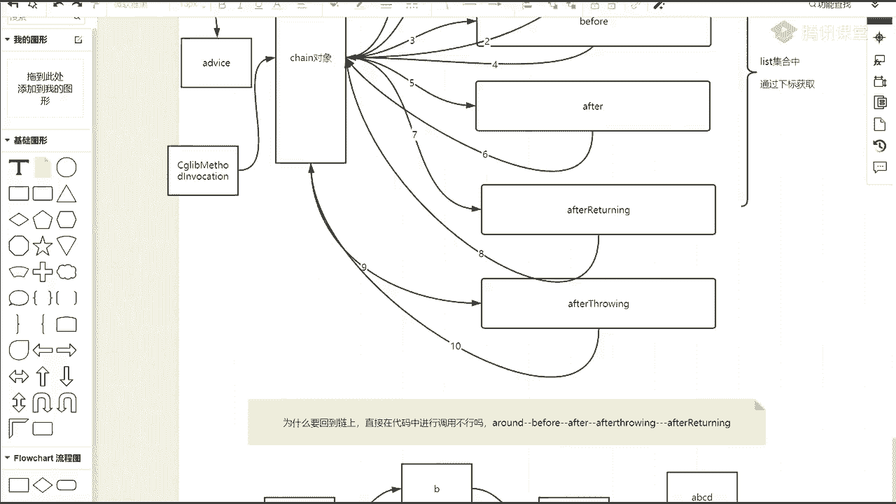

它的顺序是一样的，什么意思，当前代码你不管排重启多少次，当前代码你不管重重启多少次，它的顺序是一样的，但如果你调整了你对应的一些消息通知，包括你如果包含了自定义通知，这个时候就不一样了。

这时候就不一样了，我们这个例子举的比较极端，为什么我里面既包含了around，又包含了before，又包含了after after return after throwing，你在工作中你会都用吗。

Before after returning after throwing，你是不是可以选几个来用，你会多用吗，不会的，所以我只要保证你当前按照这个结构来运行，不就完了吗。

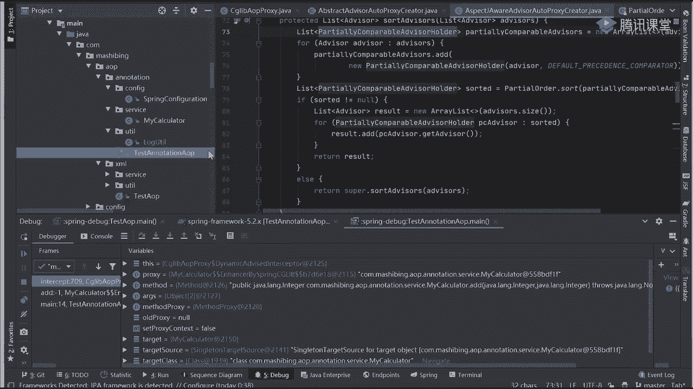

是不是意思，很多老师，那我这样，我把当前这个性对象，我放到每一个消息通知里面可以吗，没问题啊，我把当前的chain对象放到每一个消息通知里面，行不行，行吗，如果你把当前这个链结构放到这些通知里面。

我怎么知道我下一次该取哪一个了，我根据我的名字去做一个判断好吗，我是我是around好了，我取到around的位置，我取下一个位置，我取到了before，我知道before是啥了，我给你放下一个位置。

往里边放可以吗，而且你注意一件事，如果你当前around before after returning after throwing，你都包含了这样的对象，为什么不能把它拿到外边去呢。

为什么不拿到里面去，拿到外边去，本身你相同的东西，我们一直说封装封装封装相同的东西，你就要进封装，你为什么不能把它拿出来呢，明白意思吧，我把它拿出来是一种更好的方式，其他方式并不是说我就一定不行。

我就一定不行，不一定不行，你可以这么解决啊，但是有更好的方式，我们要选择更好的方式来进行相关的一个实践，来相关的一个实现，这次，拿出来就像每次回拿回出来，就像每次回来回来又怎么样了。

你回来会造成什么额外的成本吗，你最终流转是不是也是这个当前的chain对象，而且每次每次回来不消耗性能，你每次比较不消耗性能吗，你每次取集合里面元素不消耗性能吗，我举个例子。

假如说你现在假如你现在有100个通知，100通知你提高到第99个了，还有第100个，你从第零个位置开始挨个匹配，匹配到99个，你怎么知道它下边是谁，能知道吗，这个就不要考虑这个性能方面影响了，好吧。

他就是一行代码执行效率更快的，他这个放到外面之后，它更加独立，更加灵活，好吧，所以这一定要注意了，不要去抬这个杠没有意义好吧，我刚解释半天，这东西真的我觉得意义不大，意义不大好吧。

这个是不是每次回调chain这东西，注意啊，你每次回到chain这个链上，最主要不做做的事情是什么事，是为了找到下一个我要具体执行的哪个通知，到底是啥，到底是啥，谁来做这件事情好。

它在整个过程中维系了各个链的一个组成部分，各链的一个组成部组成部分好吧，这东西啊你要去面试聊的，面试聊的OK好了，不聊这事了啊，不聊这事了好吧，你要去抬这个杠，我也我也我也我也没啥办法。

别别别别别太抬杠没意义好吧，OK对，回来之后，我要找到我下一个集合。

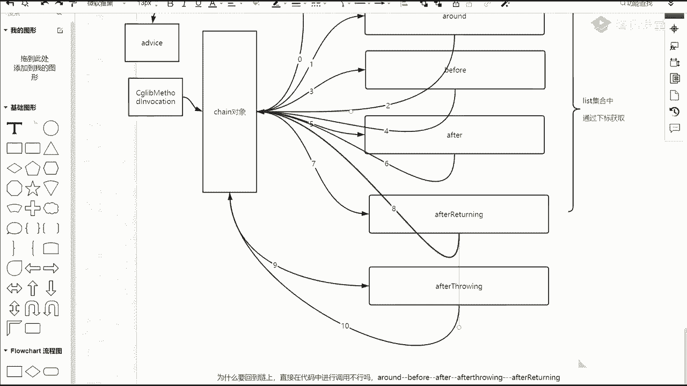

要执行的具体的一个元素值，就这意思好吧好了，把它停掉了，停掉了，这个停掉，调完之后来回到我们代码里面，我刚刚没跑完啊，我重新跑啊，刚被打断了，我们重新跑啊，该下班了，面试都这么难吗，那不会啊。

面试不会问这东西的，记住一点，这东西咱们讲课的时候会会问呃，会会会会会讲这些东西，但这半年工作的时候，一般AOP，如果你能把这个链的一个调用过程，给大家说清楚。

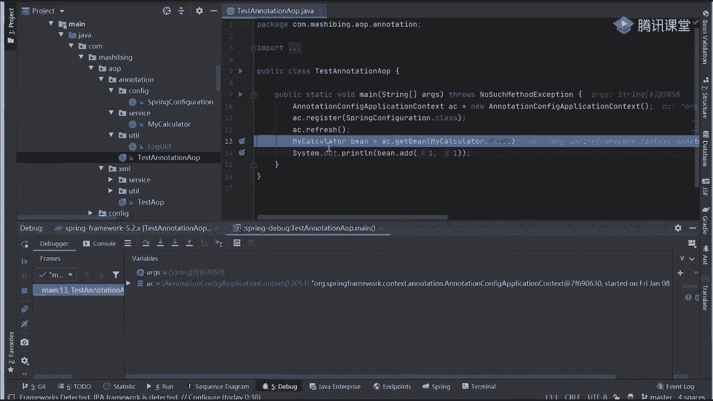

就很草的画这样一个图，我觉得他都会对你有一个新的认知，因为你只有看过源码之后，你才会这么去看它，还要把这个图画出来，如果你不看源码的话。

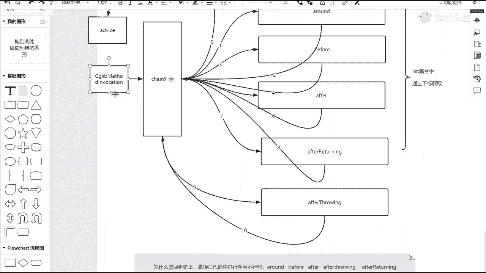

这东西你是画不出来的，明白意思吧，就这一点注意了，OK来接着往下走啊。

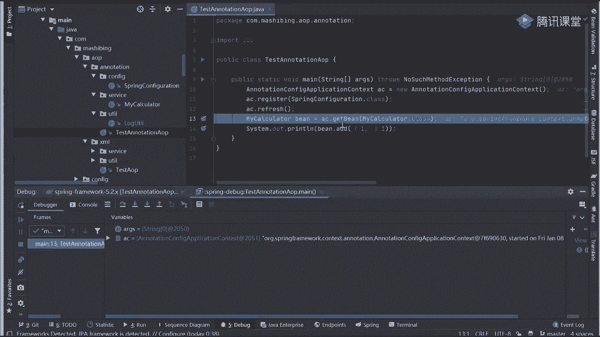

早点ADD来，往下走，往下走往下走，往下走走走走走走走点proceed好吧，一直往下走，注意了它挨个从集合里面取我们对应的元素，取完元素之后，我开始进行调用的一个执行好吧，回来回来往下走，往下走进去。

Model invoke，点它点它进来之后，点它回来，回来回来，我们再往下走啊，往回走往回走，到这执行完了吗，我刚点错了，终于回来了，我刚点错了啊，这个这个哎麻烦了，我刚点错了，所以都回来了。

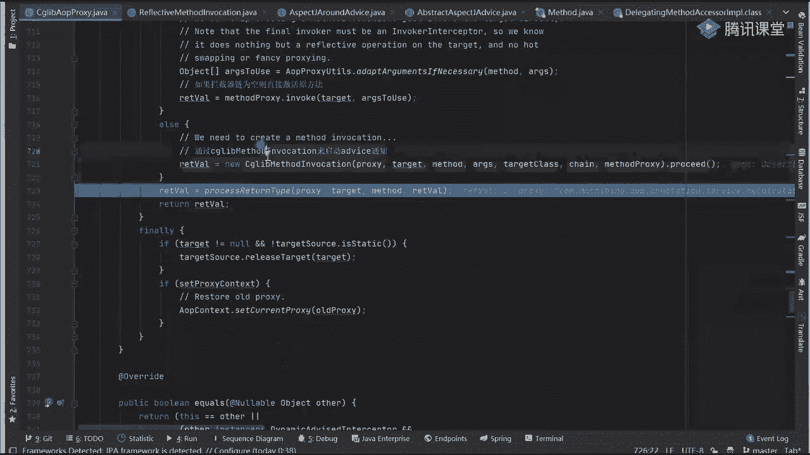

所以都回来了，我们往里点了3月，反正你知道一点，他有了当前这样一个链条过程之后，是不是能解决这个问题了，来这个这个链条，这个过程能看明白的同学在扣一能不能看懂，好了，当你把它看懂之后。

我们来思考另外一件事，另外一件事，刚刚那个具体的细节调用过程，你下一看，我不带你们看了，它的AOP就这么就这么调用的，就这么调用的好，我想问的是另外一个问题，听好了，这个问题才是锻炼内功修为的，如果。

看好了，如果要自己通过AOP的方式好吧，来实现某个统一的功能，我们应该怎么做，就比如说声明式事务，它是怎么实现的啊，刚刚动态生成代理生成的classmate，那时候自己生成就行了，勇敢你不是VIP吗。

我VIP架构师五期里面我就跟你们说呢。

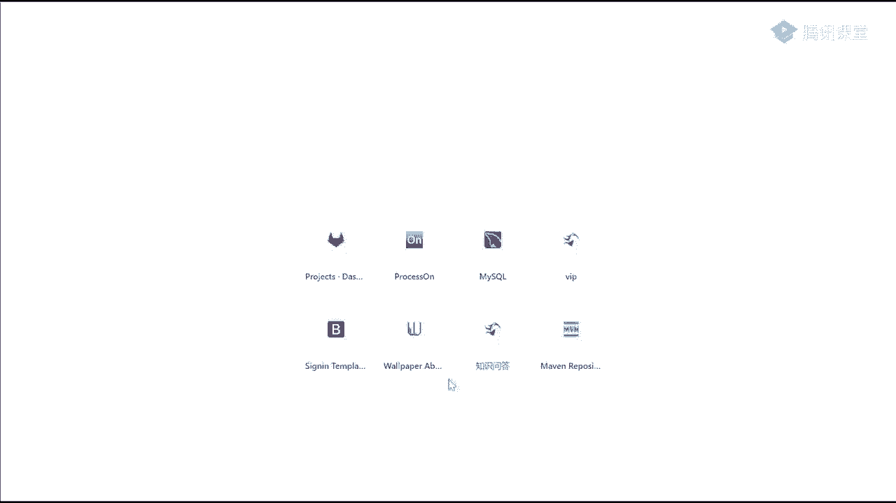

我刚刚看了一节课，好吧，在架构师五期里面，我纯讲的都是spring源码，好吧，往下翻翻翻哪去了，看这叫a OP拦截器链的一个执行，把这节课看了好吧，明白了吗，把这个看了，勇敢好好去看这节课。

我建议你从前往后看光spring源码，讲到现在我还没讲完，讲了28节课了，讲28节课了，东西很多，100 257很有价值，我希望你能看一下，我是一行一行带debug的，你们其实已经发现了。

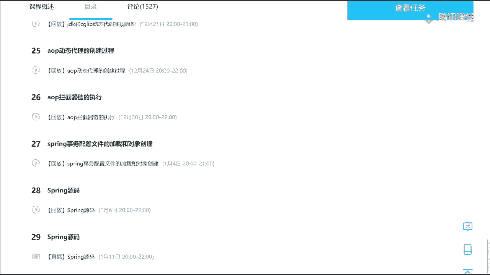

我在这里面都有注释，都是我自己加的中文注释，下周我会看好吧，实际的时候啥时候掉，本身来，我们先挨个回答，先先先回答个问题啊，宋祥坤好吧，包括橘子郎都问了一个问题，他说实际的时候什么时候调用本身的方法来。

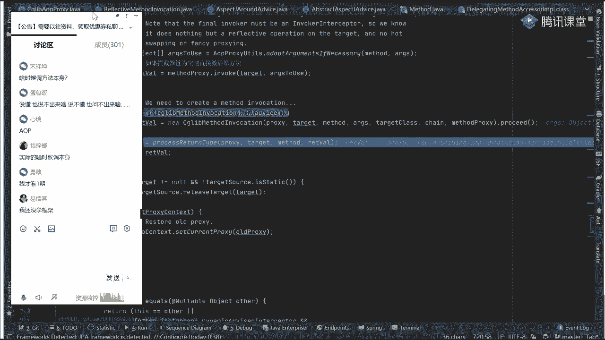

回过头来回到我们这个链上，在当前这些方法执行的时候，你觉得哪一个通知完成之后，我就可以调用本身的方法了，没问题啊，哪个通知执行完成之后，我就可以执行本身的方法了，你觉得听动捕捉before相当有意见吗。

before吧，是不是这块在这块的时候我可以调动自身逻辑，是不是这块，所以你要想看这东西的时候怎么办。

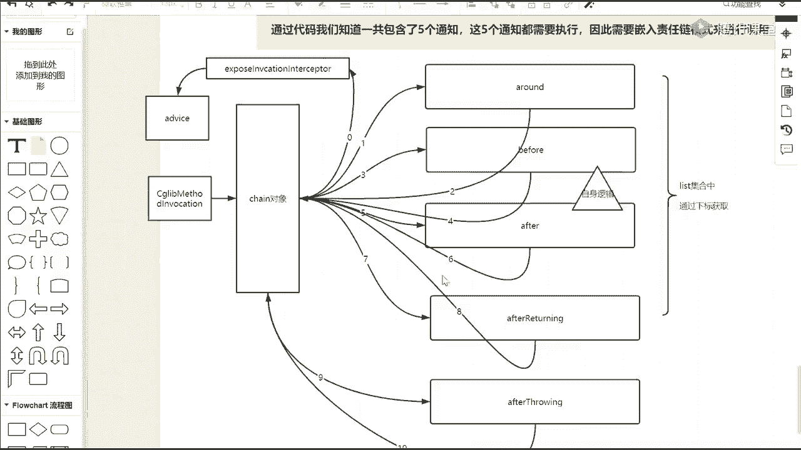

我再带你们走一遍好吧，哎我这人就是心善，再带你们走一遍吧，好看啊，我这次点慢点，刚刚太快了，所以跳过去了，让大家看到具体调用自己方法的过程，一定会掉的，百分之百会掉，好吧，来走一下吧，啊稍等啊嗯。

连上我找你找到这儿了，我咋有问题啊，我在上课没法回消息，慢慢走，第一步点ADD好吧，进来之后先找到我们对应一个链式结构好吧，然后呢往下走，开始进行执行proceed，然后点super开始取。

先取第一个是谁来着，第一个是谁，expose吧，记住啊，第一个是expose，把它给记住，然后呢开始调用调用执行，调完之后往里面设置一个参数回来好吧，点回来开取第二个，第二个是谁，第二个是谁。

around吧，是不是around好吧，所以我往下走再调用around里面具体方法，往下走往下走往下走往下走，Invoke advice method，进来之后检查再进去，往下走，往下走，往下走。

点invoke，进去进去之后再往下走，点invoke，进来之后再点invoke，invoke好吧，往下走往下走，往下走到这步，proceed再回来，往下走好点，proceed又回去吧，该该该该取谁的。

看见谁了，before吧，好了该before了，再点往下走，进去进去之后先执行before里面的方法吧，是不是执行方面的方法好吧，来点F7进来进来之后，我先执行这里面的消息通知，点进去好，执行完好吧。

这完成之后叫m d proceed，进去进来之后叫super proceed，当你这执行完成之后，我想问一下这个值等于几，等于二吧，是不是等于二，等于二的话往下走，他又进不来，这时候我选第三个。

我取三个取的谁，觉得谁，after吧，哎不对啊，老师没有调用那个具体的逻辑处理啊，回来看着我有调用具体方法吗，我只是把环绕通知start什么ADD方法执行了对吧，这before一个before。

一个around，我有执行具体的代码逻辑吗，那个艾特操作有执行吗，没有吧，记住啊，还没执行啊，没执行，别慌别慌，我来往下走，往下走，点invoke，点m proceed，它这个里面为什么没有处理逻辑啊。

提问题，after里面为什么没有处理逻辑，为啥，你知道我在说啥吗，同学们。

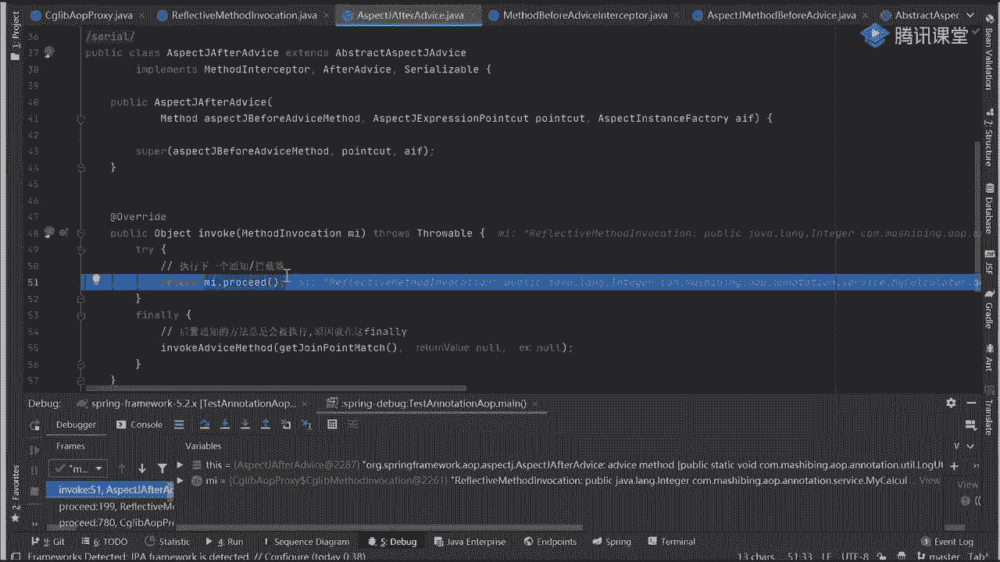