# 马士兵教育MCA4.0架构师课程 - P44：44、AOP的实现原理 - 马士兵学堂 - BV1E34y1w773

它会调用下一个进行执行的，所以它是会被后续执行的，因此点mi proceed之后又回到super里面了，我再取谁，第四个谁叫after return吧，是不是该我们的return了。

当我在执行我们的return之后，我再往下走点Emo，这第一个叫mi点proceed，我是不是又执行mi点proceed，再回去再叫super再取谁，after return那个throwing吧。

我再往下走，点invoke下之后又回哪又回哪儿，终于该回到我们当前的，是复制那个调那个那个那个那个链里边去了，点进去点完之后点super，这个时候我想问一下，我们所有的消息通知我递归完了吗，完了吧。

完了之后好吧，我再往下走一步，看到这个步骤了吗，叫invoke，Join point，点FC进去，进来之后点invoke，再点INIT，往下走，点invoke，点完之后，你看他跳到哪了，同学们。

是不是自己的逻辑，是不是自己逻辑，所以你会发现一件神奇的事情，什么事情，当我们在执行具体的一个消息通知的时候，我在这里面进行递归的时候，我只有当执行到这块的时候，我才能执行具体的方法，逻辑是不是意思。

而每次我都需要把我的链执行完，才会执行到当前这个方法。

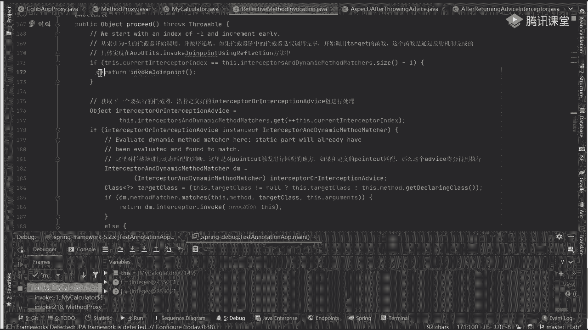

所以我想问一下前面的排序，前面的这个执行这个advice，最本质的目的是为了啥，来看一句话，只有当所有的通知执行完毕之后，才会调用具体的方法，叫实际的方法，而之前啊调用的advice只是为了执行什么。

注意哪，通知的就只是为了指定，什么叫通知的执行顺序好吧，把链，中的执行逻辑都罗列清楚好吧，按照具体的方法进行返回操作，而这个时候其实我们可以做到一个结论，什么结论我们所有的看好了啊。

After returning，好吧，包括后续的after throwing，他们都是在什么时候执行的，同学们，叫都是，在实际的逻辑代码之后执行的好吧，而我们所说的什么东西叫before，好吧。

还有我们的around，在前部分，它们两块是在哪执行的，在具体的代码执行之前执行的吧，所以我不管我怎么去便利当桥链，我只是为了把什么，在前置和后置的这些方法给罗列清楚。

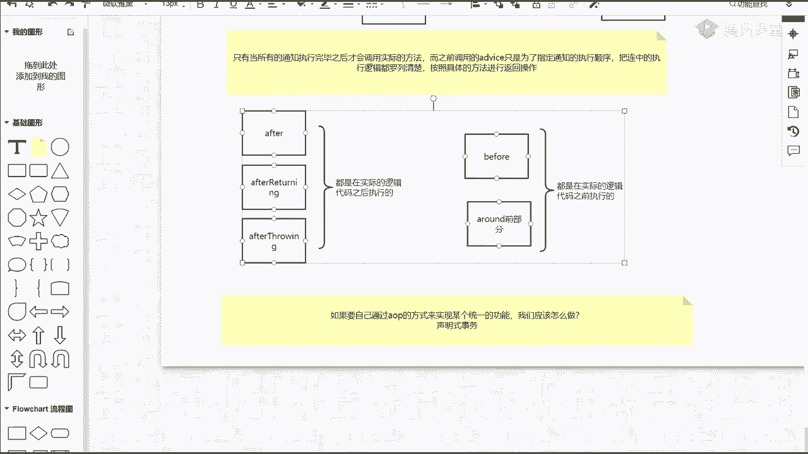

当我执行完毕之后，可以干嘛了，返回返回，当我这返回返回之后，我问一下，我现在第一个应该执行哪个通知，该听哪个了，执行哪个，谁告诉我是after吗，是around吗。

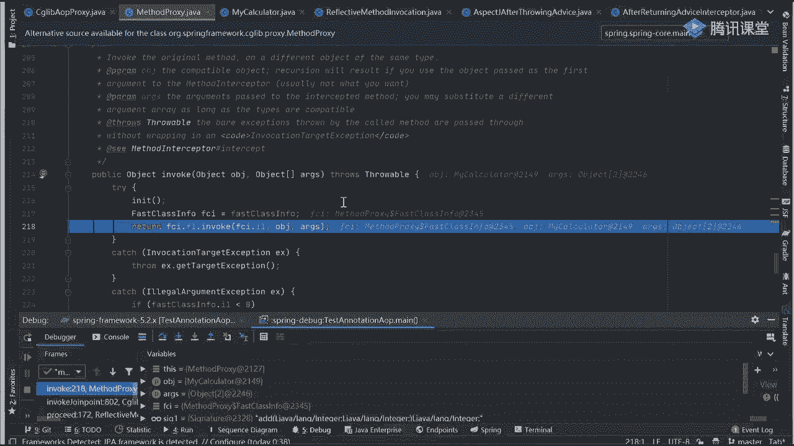

这个链的目的是为了啥，同学们，Expose，哎呀刚刚是以这样一个顺序来执行的，当我执行完了之后，你发现了执行逻辑是在最后面执行的，如果你在最后一个执行的话，我在原路返回的时候，我会怎么反，我会怎么反。

如果你报异常了，After three，如果你没报异常是谁，after return吧。

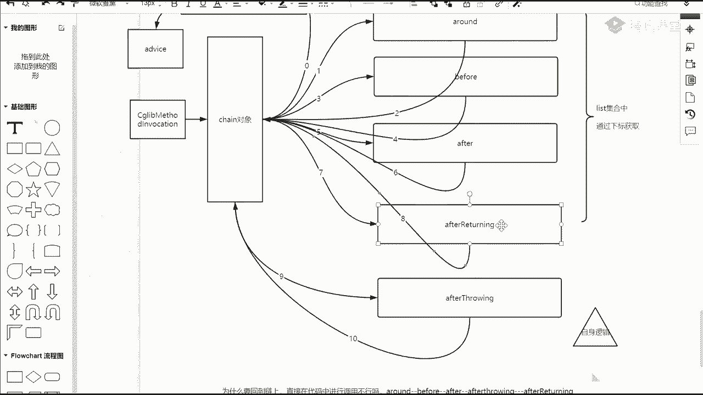

是这意思啊，来返回去啊，看好了，反好吧，再往下翻，再往回返，回到这块再发，你看一下当前是哪个类，哪个类apple throwing，它里面有异常吗，没有异常，没有异常，我是不是直接回去了。

回去之后再回来，你告诉我这是哪个类，after returning吧，是不是return，我该执行after return的一个里面的逻辑了吧，点不进去，加之进去执行好吧，再执行，往下走往下走。

invoke就往下走，往下走走走走，Invoke，然后呢点击voke invoke，这打谁谁的老师听见吗，当我执行完这步之后，你看一下具体代码逻辑，around先执行对吧，at的方法执行完了。

执行完成之后，我方法开始执行完成了，这是什么，执行结束了吧，After returning，然后呢，再返回走走走走走走，再回来回来返回返回再返回，这是哪个方法，是哪个，该after了吧。

是不是我执行完之后，下一个是谁，我还有必要执行我们对应的before吗，before还有吗，没了吧，是返回返回去之后最后是谁，最后谁是不是around，后半部分我是把around后半部分执行完整。

完成之后，我是不是就结束了，当前这个量是不是执行结束了，真结束后再返回返回返回返回返回，是不是到结果了，结果等于几等于二吧，我是把结果打印就可以了。

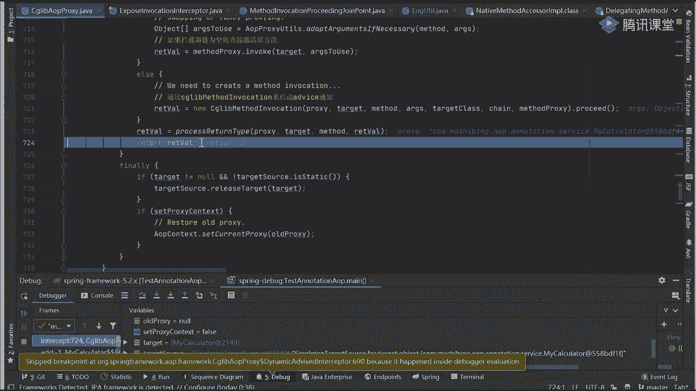

看明白这意思吗，它只是为了维护当前这个链的一个，具体的调用逻辑和调用关系，你把这东西说清楚了，如果你把这手机放到这对吗，对不对，同学们，你们刚刚说在b for后面对吗，不对呀，那没在这儿做呀。

是不是在做，在所有的advice都执行完成之后，在最后一步的时候，才会调用我们具体的一个逻辑，而前面都只是为了什么，我不写了，你刚刚一样，其他东西都只是为了捋回我们对应的一个，执行顺序而已。

执行顺序而已，就这样搞清楚了，好吧哎呀，我真累啊，这个这个这个这个讲的就比较麻烦了，太麻烦，这东西啊，没办法，你只能去慢慢去抠，慢慢去理解这些东西，慢慢理解这些东西啊，那before方法是先执行的吧。

刚刚讲别人讲了个啥。

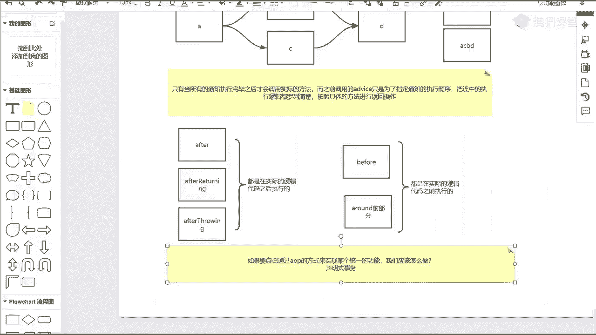

谁先执行的，谁先执行的，谁先执行的，around吧，对方就是比谁before吧，完了之后呢，after吧，不retinue嘛，然后是after吧，然后是我们的环绕通知吧，是不是正好相对的环绕环绕好吧。

Before after after the return，是不是这意思啊，所以你要理清楚当前这样一个顺序，好，得理清当前这样一个顺序，OK这东西啊。

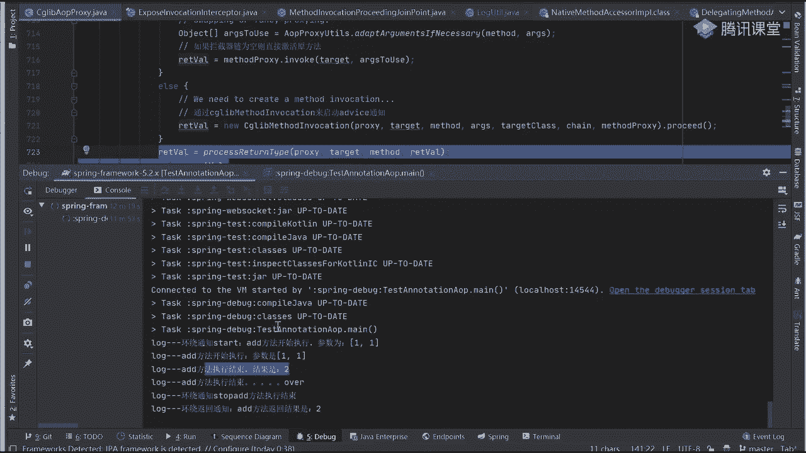

你理解清楚之后好吧，还有东西来看下面这个问题，看下面的东西，这个问题是我这节课最想讲的，结果到现在还没讲到，往上看这玩意儿，同学们想明白一件事，想明白一件事，源码好吧，如果设计简单了，设计。

简单当然了好吧，那么在某一个方面会有缺失，哪个缺失会在哪个方面有缺失，同学们对扩展性，扩展性好会在扩展性方面有缺失的，好了，这东西啊，所有的代码，spring里面所有代码它写的多复杂多乱。

包括说它抽象出来一丢丢的接口好吧，一堆的时间内，这东西最主要目的就是为了做扩展，永远记住他是一个spring全家桶里面的一个基石，最底层的一个支撑，如果它的扩展性不好的话，它的扩展性不好的话。

我们现在用的spring boot spring cloud都将不复存在，你不可能说我每次新出来一个框架，就做一个历史性的变革，这不可能，这不可能，如果你每次出来新东西之后。

你都要把之前的所有代码重新干掉，重来一遍，那就完犊子吗，没完了，就这样，你要想明白了好吧，只不过之前我们在进行这个拦截器件，理解的时候，大部分人是怎么理解的，怎么理解的，第一个链好吧。

我这里面直接指向下一个链，我们下一个链开始执行下一个了之后，我再执行下一个链，我再执行下一个链，他没有这个chain这个外部空间的一个组织，所以跟之前的理解可能不太一样，OK好这一定要注意了好吧。

那最后聊一个问题，这玩意如果要自己通过a OP的方式，来实现一个统一的事物功能，我们应该怎么做，或者说你会怎么做，别别别什么爱的tral spring是这么干的，你自己实现，你说我要准备什么东西。

你自己如果实现的话，我需要执行什么东西，什么叫事务处理啊，我问一下事务的处理，跟我们刚刚日志的处理一样不一样，一样不一样，不一样哪儿不一样好了，举个例子，这是数据库操作，可以吧好吧，这是我们具体的操作。

给数据库操作，操作数据库在操作数据库之前好吧，我一定要干嘛，你们说的打开连接对吧，准备好事，事务对象好吧，然后在后续的时候我又提交，这叫开启，叫打开连接，好吧，开启事务对象，开启事务是不是这块。

然后他执行完成之后，这分两种情况，非常情况怎样情况，歪的这个东西不管了好吧，说是否有异常，如果有异常，有异常怎么做回滚，对不对，回滚如果没异常怎么办，没异常怎么办，提交，这是不是整体的逻辑，是吧。

最简单的一个逻辑，这个东西如果让我们自己来实现的话，我会怎么办，你是不是要选择对应的一个通知了，你告诉我我选择什么通知，我选的什么通知比较合适，你告诉我，好了，毫无疑问一点回归应该用什么。

会用什么throwing吗，After three，是不是东西提交呢，提交用什么，return对吧，开启用什么，before吧，是不是这几个这能理解吧，这是一对应上的好吧，我现在如果想通过，来迭代一下。

叫通过，一个消息通知好吧，来搞定所有事怎么办，能做到吗，不可能为什么不可能，里面有around，是不是可以AROUND，有了around之后好吧。

我只需要在around里面把我们的after throwing，内嵌进去不就行了吗，你不就少了个回滚吗，我把ipathrow in嵌进去行不行，行行不行，行吗，同学们，行吧好了，这东西如果能理解的话。

勇敢你是你是过来抬杠的吗，好了，如果这东西可以的话，在spring里面就这么干的，来transition interceptor，有这样一类。

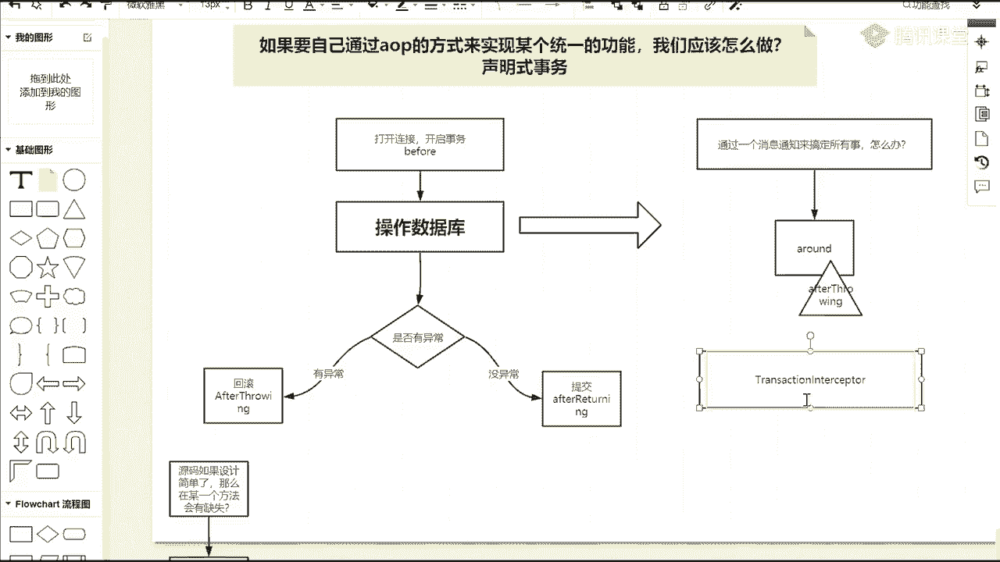

有这样一个类，来我们打开看一眼好吧，我抬杠没事，最不怕的就是就是抬杠，来往这儿看，在我们的transition intercept里面，有一个非常核心的叫什么叫invoke吧，是不是有invoke。

是不是Emo，我们都知道每个通知在进行执行的时候，他一定会叫invoke方法，在invoke里面有一个invoke with within transition，点它进来之后好吧，你看一下它的过程。

看看它的过程，先找一些核心东西，这代码能看懂，这一行能不能能不能看懂，能看懂吧，干嘛的，叫emote proceed with invocation，是不进行后续实际逻辑的一个处理。

这是我们实际逻辑的一个处理，在这个之前都是准备事务对象打开连接，是不是做做这样一件事，好吧，你注意看，如果在执行具体逻辑的一个处理过程中，处理过程中我突然出现异常了，我怎么办，看它的名称描述叫什么。

听同学们叫complete transition after sowing嘛，如果我这个异常没发生，我要正常提交怎么办，怎么办。

叫什么叫commit transition after returning。

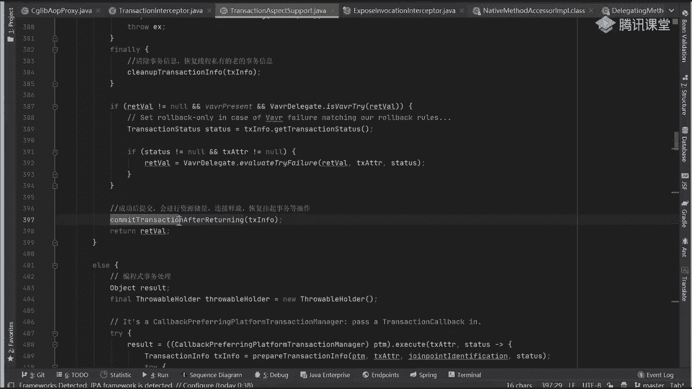

是不是我前面写的方式，是还不是，是吧，是啥东西，有了这仨东西了，我能不能把这仨东西揉到一块，你刚刚我带你们看过源码了，你们应该能体会到所谓的before也好也好，五种消息通知，消息通知，只是。

spring中好吧，原生提供的支持，通知自己在进行实现的时候好吧，可以参考实现好吧，但是没必要非用，费用它本身的模板看明白了吗，我不是说他定义好物种通知，我就只用这五种通知，我自己扩展不就完了吗。

能理解意思吗，好吧，而在进行扩展的时候，就意味着一件事可以干什么事，可以将各种通知到，好吧，模模式或者说更通知的编写方式，拿过来进行，借鉴吗，借鉴借鉴借鉴，看白意思了吗，啊这就是这个框架。

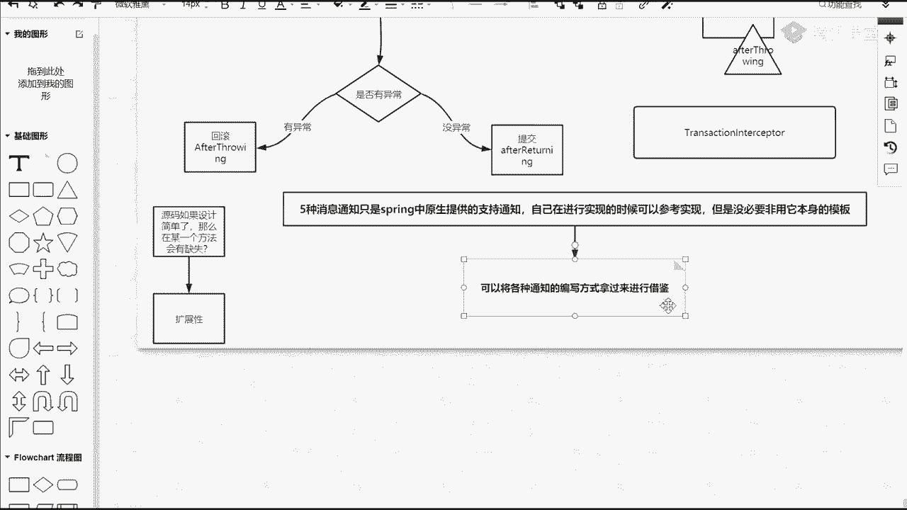

它比较牛的地方是为什么为什么这么牛，你就想一下，刚刚我们看这个max interceptor的时候，呃，不是interceptor的时候，他有实现任何after before这些东西吗，有时间吗。

没有吧，就实现了一个什么东西叫method interceptor，After before around，什么东西，玩蛋去好吧，我自己来实现我们自己的逻辑，而不需要严格遵循什么before阿。

这东西只是在框架里面。

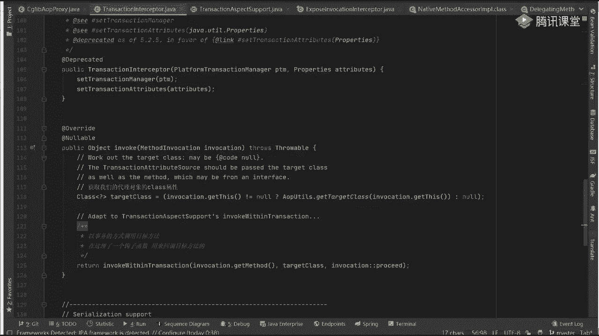

他提供这种原生的支持，那我问一个问题，同学们如果现在就想让你通过after before，不是啊。

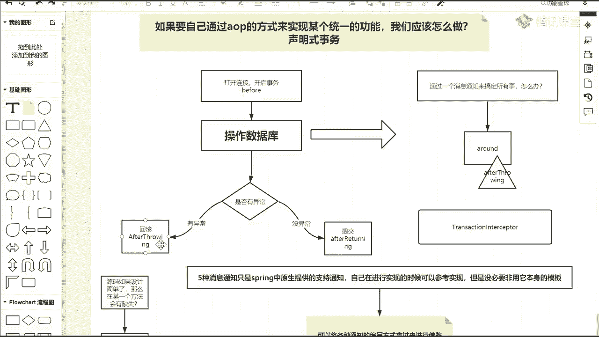