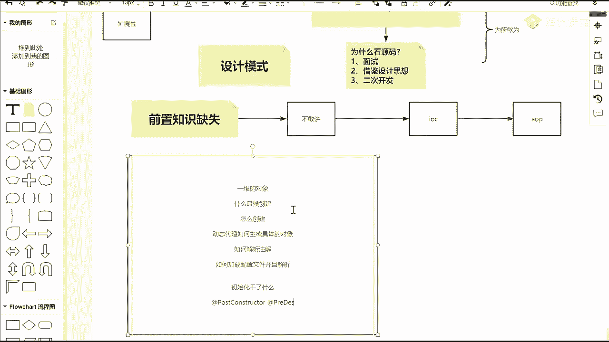
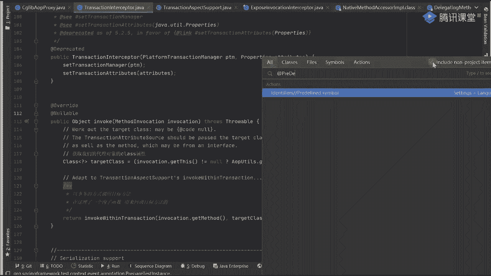
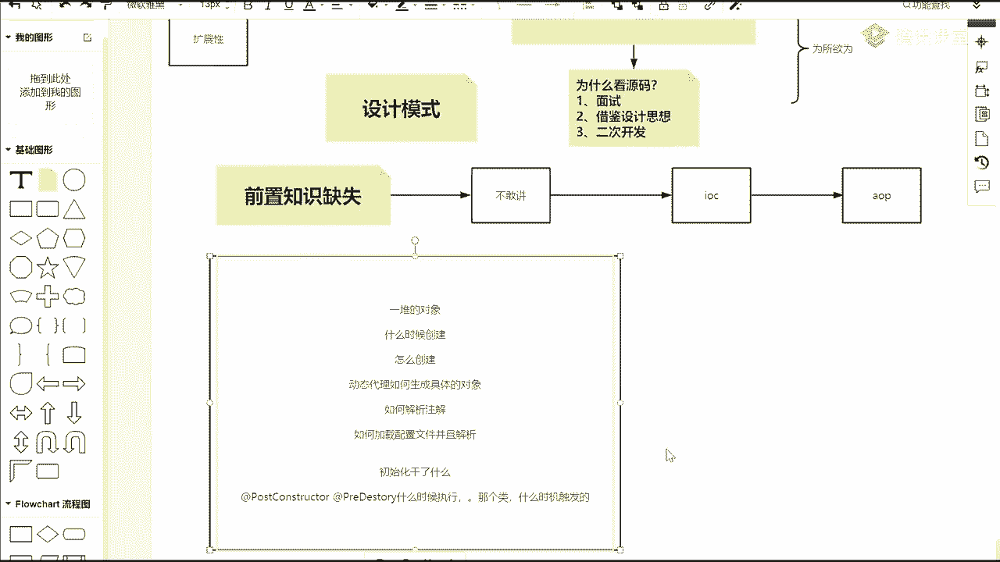
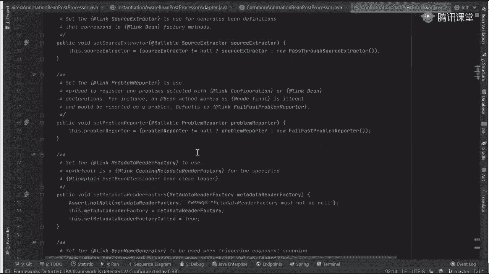
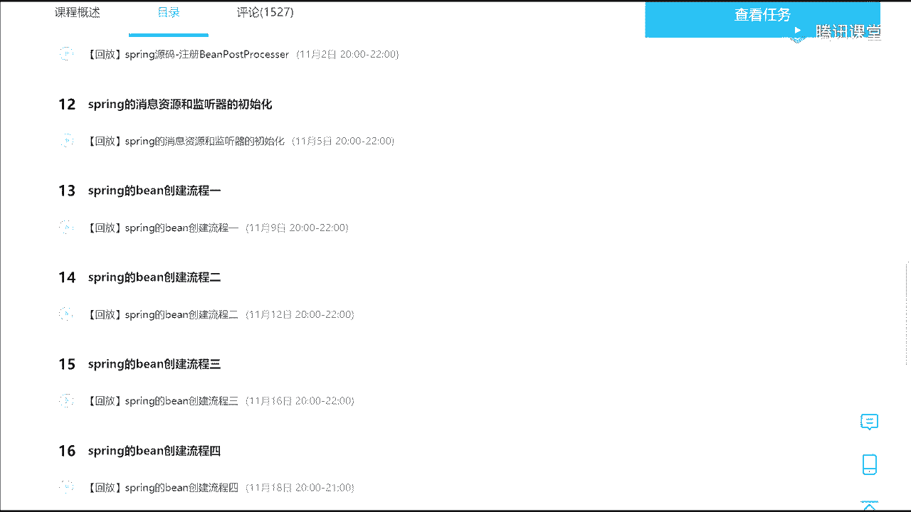
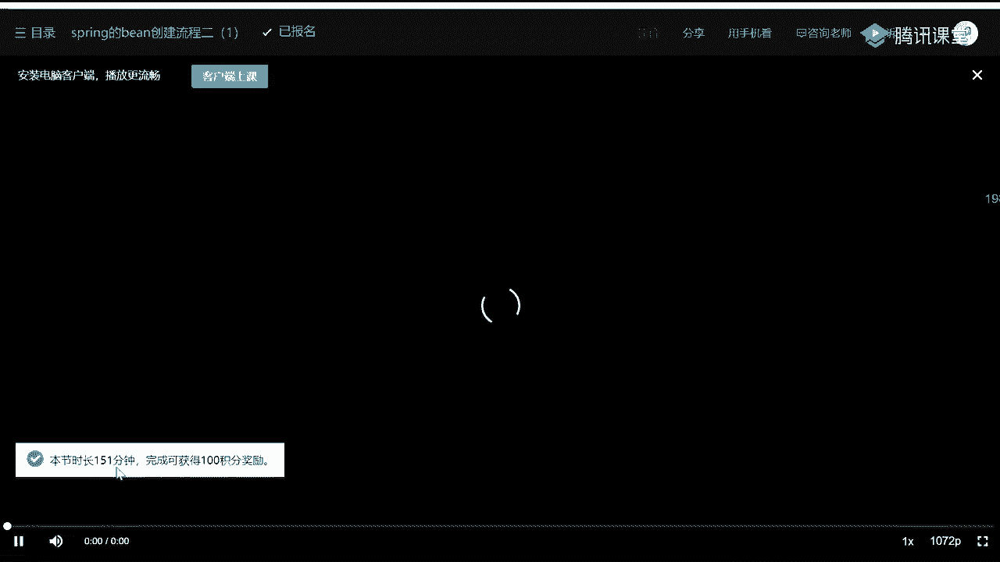
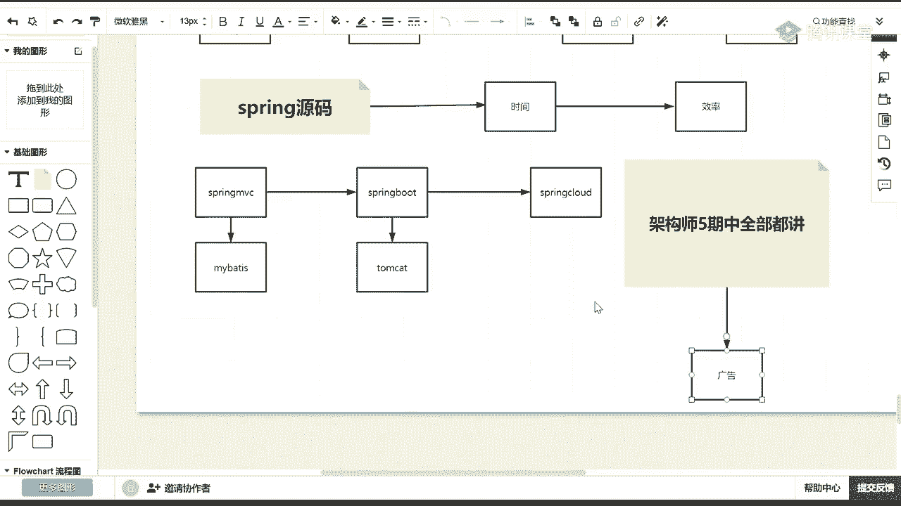
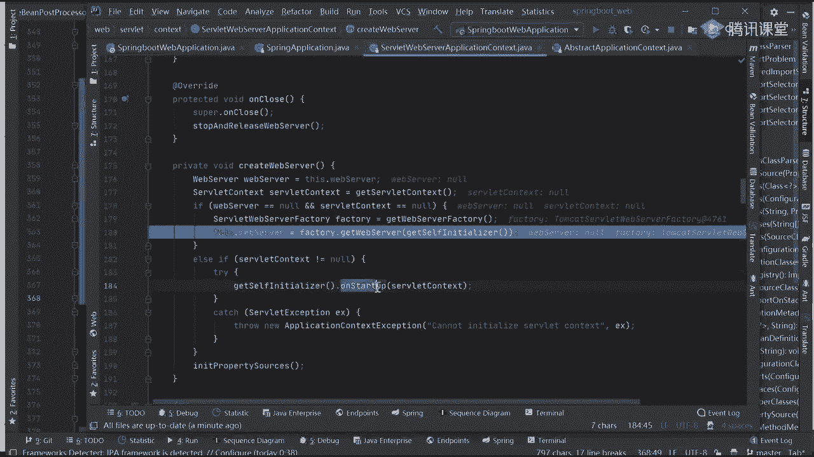
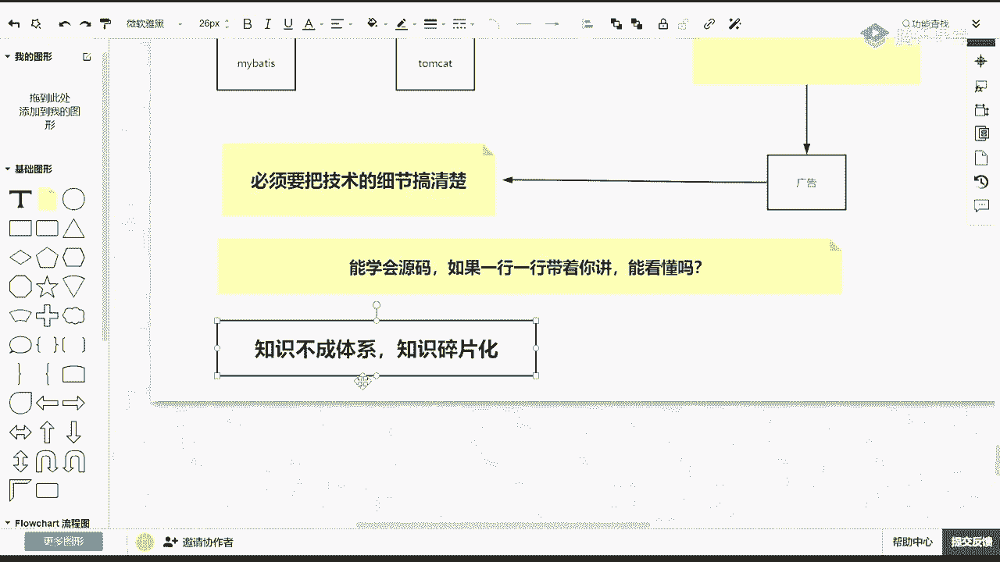

# 马士兵教育MCA4.0架构师课程 - P45：45、面试问到了AOP如何去回答？ - 马士兵学堂 - BV1E34y1w773

是我能不能，能不能别动都不动啊，我就用他原声提供的通知，能不能能吧，都拆分开了吗，肯定可以吗，但是我把它整合到一块，是不是也可以，所以同学们记住了，看源码最主要的目的是为了啥，我已经讲了很多的源码课了。

很多VIP同学还是非P，大家都理解不了，老师，我为什么要看源码，剩下这件事情，为什么太阳马，原因是啥，最简单的一点最简单的一点是什么，面试面试官会问，所以我要用它好吧，第二点是干嘛，借鉴设计思想。

借鉴他的设计思想，好这事是很重要的，当你借鉴完三思想之后，第三步可以干什么事，这个这个同学应该是我们的我们的VIP啊，这样干嘛，二次开发，二次开发，什么叫二次开发，很多同学入职到一些大的外包公司。

或入到一些大的平台之后，好吧，你会发现一件事，什么事，别人已经把接口都封装好了，当别人把这些接口我都封装好了之后，你调的只有API，你掉了只有API，当你调了API之后好吧，你又不知道底层怎么实现的。

别人怎么做这个通用性的，如果我要扩展的话，我怎么办，我能不能扩展，如果让你在这个基础上做扩展，你会吗，你能吗，最主要的一件事，我在上课之前之前给VIP说，上课的时候说过一句话，什么话叫为所欲为。

所以这里面的核心代码你是一定要看的啊，面试是我们最基本的一个追求，但更多的是什么，你要从中学到东西，这最核心的不说别的，就光设计模式要不要学，咱们写代码里面最多用的是谁，单例模式对吧。

工厂模式用一下代理用的很少，原版里有多用用多种设计模式，孩子去了，孩子去了，这东西你必须要知道，因为在考量具体的一个程序的健，壮性和扩展性的时候，你的设计模式必须要良好，应用没招，所以这东西一定要去看。

一定要学，很重要，明白了吗，大家也发现了，我今天给你们讲起来比较费劲，为什么比较费劲，你们听的可能也很难受啊，我知道我有我有大概的感受，你们可能听起来也不太舒服，感觉哪哪都不理解，特别是第一次来听同学。

你知道问题出在什么地方吗，啊不是因为你跟你跟你跟你没关系好吧，跟你没关系啊，勇敢不是因为你啊，你提问题是好事，你现在推着，你现在推着这个课程再往前走，你其实问题都是好事儿，但问题的原因是什么。

是因为一个很重要的点，叫前置知识缺失，这东西不知道你理解不理解，我刚刚一直说一句话，一直说一句话，我说为什么我之前公开课的时候，从来没有讲AOP，因为不敢讲，如果你把IOC相关的东西没理解清楚好吧。

a OP你是理解不了的，明白意思吗，它是这样的一个具体的关系好吧，LC是啥，AB是啥，我们其实可以思考一件事，同学们什么事，刚开始spring出来之前，spring出来之前好吧。

spring出来之前你注意了，它就是一个容器，容器里面代表什么，有一堆的对象，但是对象什么时候创建，创建是不是第一个问题好吧，怎么，创建对吧，动态代理，代理如何生成生成，具体的对象，对吧。

像这像这东西如何，解析注解如何加载，配置文件，并且解析，这都是前置的，这些过程包括初始化干了什么事，干了什么，之前他一直问我一个问题，说老师你能给我解释一下别人卡文件，不需要你给我解释一下。

这两个注解叫at呃，Post concert，好吧，count和at pray destroy。

这是什么情况，这节看这么难受啊，At post disconstruction，可能这东西对吧，包括at pray destroy。

老师这样做，什么时候用的，你们知道吗，这样数学什么时候用的，有没有人知道，有人知道吗，哎没人说话了，怎么，什么，之后执行初始化销毁哪个类，什么时机什么时机，触发了，容器启动之后。

能敢说的再再模糊一点吗，哪，All to wear，诶怎么没有了，auto wd这东西吧好吧，在当前这一类的时候，有什么at where怎么处理的，at value怎么处理的，在这一类的上面。

它有一个父类叫什么，走呃不是，这找一个叫common annotation，Being postprocessor，这里面有什么resource，怎么进行处理的好吧，而在这个类上面。

它继承了一个什么叫INIT，Init，里面有什么找找时间内往哪看哪去了，构造方法呢，看这有什么post constructor，Pray destroy，我什么时候住进去的。

我应该怎么对它进行相关的一个解析工作，是不是都有，你在这个common里面，你能看到一个构造方法，找一下看看post contra predestroy，看到了吗，我是不是在二进调用的，看完意思了吗。

再比如说注解什么时候解析的，我就问一个问题，同学们，我就问一下这个at configuration什么时候解析的，这周几你们现在用的很多，它是解析处理的，如果你用纯注解的话。

at import什么时候处理的，知道吗，什么时候处理，说类名，说这类名就行，不要不要就什么时机类名你知道吗，哪个类有没有知道，好了，李海滨说知道行突破不对啊，李海滨说对了。

叫什么叫configure ration，Class，Post processor，在这个类里面进行相关的一个处理的好吧。

哪个对哪个方法来找一下，叫post process registry，给他，找他找他，往上看什么东西是否被component修饰了好吧，这个东西process any at property。

Source annotation，Process any component，Scan annotation，Properties，Process any import annotation，好吧。

process involu in individual是吧，不会多啊好吧，at in什么时候处理的好吧，看到东西了吗，你要知道他是在哪做的，这个时候你只有把这些细节点你都搞清楚了啊，才会有一件事。

同学们什么事，叫面试的时候好吧，不会垮掉，这才是很重要的，这才是很重要的，现在面试跟原来面试还是一样吗，没人应该应该有感受吧，前面是怎么样的啊，原来面试原来面试来。

你给我说一下spring bean的生命周期，你把网上一个文章或者一个图拿下来背诵一下，背完之后了事了好，我觉得你会结束了，现在会问什么来，你告诉我，invoke不是invoke aware接口干嘛的。

对吧，你告诉我，Init method，干嘛的，你再告诉我动态代理，对象什么时候生成的，对吧，再告诉我如何生成的，是这意思，像这些细节，面试官会一直不停的追着你问下去问下去，问到你答不上来为止。

蛋包饭说了一句话，什么说现在都是聊一聊spring a OP，然后一边说一边追问，连问到底，就这意思，为什么呀，为什么为什么会有这样一个情况，同学们是知道原因在哪，人在哪，原因其实非常简单。

人太多了好吧，需要选择优秀的人才，原来比如说举个例子，我之前其实举举过这个例子，什么例子同样原来都是100分的考卷，100分考卷对于原来而言，你答个60分好了，我就要你了好吧，但对于现在而言。

你达不到90分，我就不要你，很简单一个对比，所以要求大家干嘛，对技术的细节，好吧，必须要掌握清楚，这没招啊，逼着我们去这么做，也不要抱怨什么内卷啊，什么乱七八糟的东西，不要抱怨这件事情。

技术就这么发展的，慢慢这个行业留下来的人是什么人，高精尖人才，你能活下来的一定是这样，你猜如果你就会点COD，就会点基本功能完蛋，这个行业里面你一定混不久，你可以入行，可以干干几年，但是一定混不长。

你会长，我们就拿spring源码来说，你觉得spring源码你要看多久就能学会，你自己看看多久，多久3年十年，还有吗，5年八个月你要拖多长时间，我刚说过，在我们的VIP课程里面，光这光spring源码。

这里面全部都讲的spring。

我给你看个东西，看看东西，这是我在我们的VIP页面里面讲东西，第一节开班典礼，第二节，第三节，第四节，第五节，每节课讲不同东西，现在已经讲到第28节了，明天啊不是明天下周一是第29节。

每节课至少是两个小时以上，随便打开一节，随便开一节好吧，是不是看。

多长时间，两小时31分钟看清了吗，很多东西是一定通过时间的堆积时间，你说短短几个小时之内，我把一个很多东西给你讲清楚，可能吗，不可能一定是需要时间的，有了时间之后好吧，还要注意一件什么事儿叫效率。

为什么很多同学一直在聊，一直让我讲a OP，你从网上从这个地方你找不到对应的资料，没招了，你说老师你讲一下吧，好了，我先讲一下，讲完之后我之后可能都不会讲了，这东西真的太难理解了啊。

VIP里面我已经讲的东西了，但之后我不会讲了，那你想想你还要学要学什么东西，spring源码，spring mvc对吧，后面你要看什么spring boot，后面呢你看看spring cloud，对吧。

在中间过程里面你可能需要穿插my body is对吧，在spring boot里面你需要穿插tomcat，这都是你要学习的基本的必备的点，必须要学，那么这东西什么东西呢，架构师，武器中全部。

都讲好意思吗，会不会学着学着猝死，我还没听说过有谁学着学着猝死的，所以下面到一个非常核心且重要的环节，什么环节叫广告环节，我要告诉你们，你们必须要看这东西。

string说spring boot和tom cat有什么关系，有啥关系啊，原来你在用SSM的时候，你需要外置一个tomcat，在book里面是有内嵌的，怎么内嵌进去的，为什么内线我就问一个问题。

spring里面如果我想内嵌tomcat的话，以你现在了解你觉得应该在哪陷进去，或者说应该从哪嵌进去，你觉得你自己感觉从哪儿，依赖是依赖吗。

哎我就说你们不会来随便打开一个项目，这是我之前写的一个spring boot项目，好吧，之前写的一个案例的一个东西，我们打开我们启动类，这是启动代码，右击debug，来点F7进来F7进去进去。

点run往下走，走走走走走，走到这行点它点它点它往下走，内行走走走，往这看叫on reflesh，点它这个东西叫什么，同学们看这叫啥，你告诉我，这叫什么，create web server吧。

点进去好吧，往下走往下走往下走，这东西叫get web server server factory，它返回什么对象，什么对象叫tomcat server，Web server factory。

那么在最终在后面是不是可以干嘛，叫on start up吧。

我是不是可以启动我们当前的tomcat服务了，看完意思了吗，你说你对这东西不熟，这东西不熟，为什么内嵌怎么内嵌的，问你这样的问题，你怎么答，你怎么答，真的不是为了给大家讲源码，为了给大家拖时间。

所以我把这个课讲了这么久，我还想早点结束呢，到今早我早没事，没办法了好吧，必须现在面试的就这么要求，你必须要把技术的细节都搞得倍儿清楚，必须要把技术的细节，搞清楚搞不清楚，你就没办法跟别人竞争和pk。

老师在家讲课吗，我不在家讲课，在公司现在还没下班，在公司里面呢，在公司里面好吧，所以就问一个问题，如果把这些源码的东西都给你掰开了，揉碎了，给你讲的非常非常清楚，非常非常清楚好吧，那么能学会源码吗。

如果一行一行带着你讲，能看懂吗，你就想一下，我刚刚给你们展示我对应的一个源码的时候，源码的时候我给你看看这注释了吗，虽然不是每行代码都有注释，但是加注释了吧，加点注释之后能不能方便你进行理解，能吧哈。

开车为什么非要懂发动机构造呀，公司怎么想的呀，大哥你想一件事，你现在在公司里面，如果你在做一些cod的项目，你公司能活下去吗，你公司里面必须要有自己的技术堡垒啊，或者技术壁垒啊，你没有技术壁垒的话。

你在公司里面怎么活下去，你公司里面凭什么拿项目，你要留点别人不会的东西，你公司才能活下去，所以公司对于技术的要求好吧，对技术追求会越来越多，越来越高，这没招，这就是这个行业里面出现了一个趋势好吧。

所以这个问题能看懂吗，就这30节课，二八节课你看完之后你觉得怎么样，每节课至少两个小时，目前已经讲了56个小时了，后面还要讲多久，我不确定，至少十节课左右，这种东西你告诉你现在还学不会。

你四五个小时你听一下，你觉得能学会吗，你需要成体系的学习，这是很多同学在面试的时候，经常被问到的一个点或者被反馈出来的信息，看你们有没有什么信息，很简单，一件事说知识不成体系好吧，知识碎片化。

有人收到过，有人收到过当前这样的一些评语吗。

知道过吗。