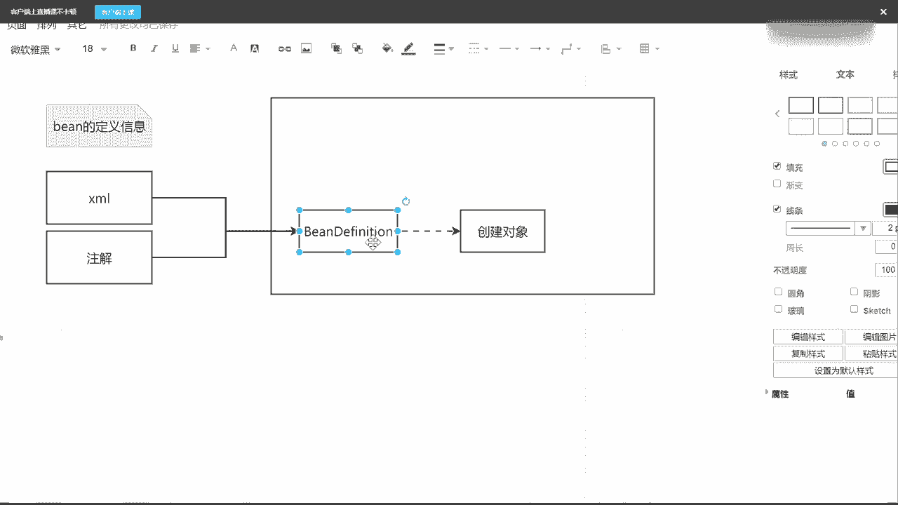
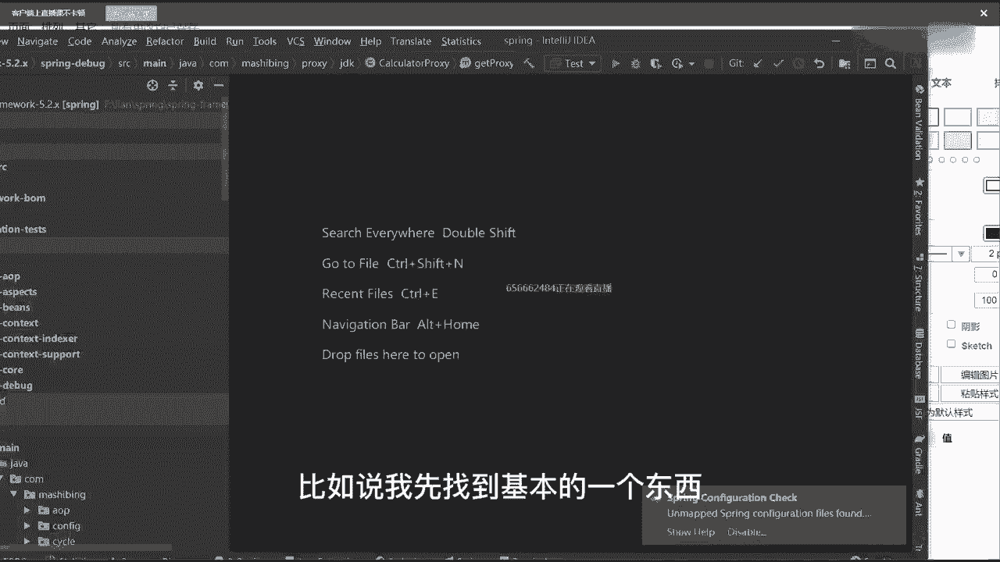
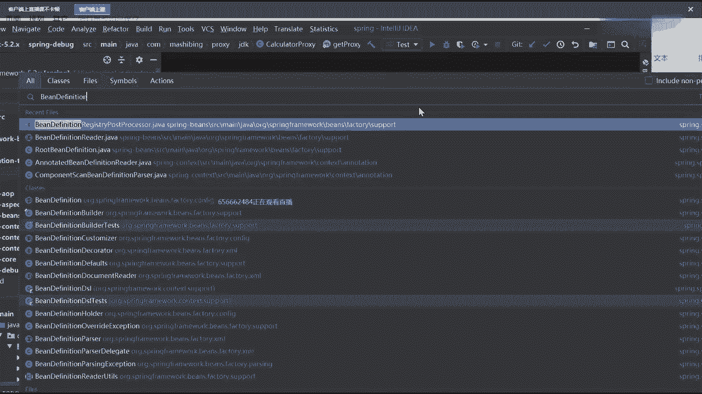
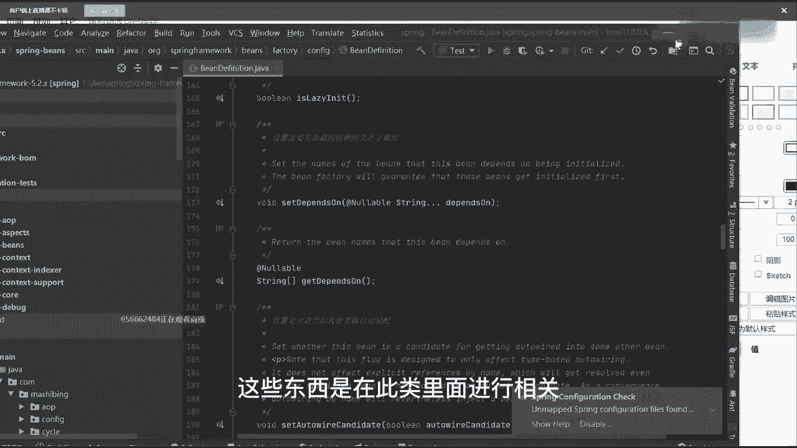
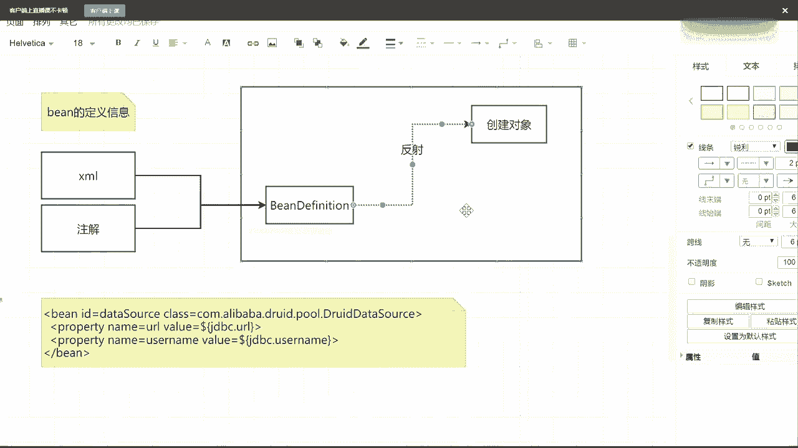

# 系列 5：P46：46、Spring IOC容器的核心实现原理 - 马士兵学堂 - BV1E34y1w773

谁来告诉我spring到底是什么，谁来告诉我spring到底是什么，当然有很多同学会给出一些描述啊，比如说老师，首先第一点他是个框架啊，还有人说春天的好吧，第二点它是个什么容器吧。

我们一般都说spring容器对不对，第三个我希望大家能明确一点，什么叫生态，这是我给的一个知识，什么意思，因为你们现在在基本的呃工作中，要不然用spring，要不然用spring boot。

要不然用spring cloud，基本上都是spring这个全家桶里面的一体系东西，而这些东西里面spring就是最基本和最根本的基石，你把这块了解清楚了才可以，而他现在主流面试的时候。

他上来之后不会问你一些定向的问题，而问你一些什么，谈一下你对spring的理解，或者谈一下你对病的理解，谈一下你对bean生命周期的理解，基本上是以这样的一个方式来问问题了。

那遇到这样的一些理解性的问题，或者说非常宽泛的问题的时候，我们到底应该如何去进行回答呢，谁能告诉我，如果一问到spring，你现在还是只说说一个IOC，说一个a OP，我告诉大家，你就别说了。

这俩东西单打的话肯定是不够的，肯定是不够的，你需要把里面的一些细节点都答清楚，把里面的每一个环节能知道能出多少，输多少，把这些东西一定要完整进行一个转化，那咱们来聊呢，还是一样。

spring我们用起来非常简单，为什么简单，谁能告诉我最核心的点在于，spring帮我们把我们呃应用程序里面所需要的这些，bean对象是帮我们管理起来了，而在进行管理的时候，首先它是个什么，是个容器吧。

所以我这先画一个大格子，它是一个容器，容器的话是什么意思啊，里面一定是放东西的，比如说在程序里面放的是一个一个的bean对象，对吧，一堆并对象你想放多少个，放多少个，当你了解到这个环节的时候。

还不够还不够，还需要具备很多的知识，具备啥，你想吧，spring帮我们来管理人管管理并对象，那spring是怎么知道这些并对象是哪些呢，或者说我应该创建哪些基本的并对象呢，他是怎么理解这件事情的啊。

比如说反射，反射是创建对象的一种方式，这时候根据类型，根据注解，其实这个时候我希望同学们在看源码的时候，先以应用入手，你把应用的点理解透了之后再说什么，这是什么原理，然后下一步再说源码。

我们在用的时候怎么用啊，很简单了，我如果想声明一个对象的话，我一般会在类上面加一些注解，比如说at controller对吧，at service对吧，ADD component是不是这样的一些东西。

除了这些东西之外，这是我们用注解的方式吧，除了用注解之外，当然我还可以选择另外一种叫配置文件，那么对吧，当然现在主流的开发环境里面，XML可能几乎已经不用了，或者用的已经很少了啊，但是我想问一下。

插画也好，还是我们这些注解也好，它到底说的是什么东西，或者说我们为什么要用JA，或者为什么要用注解，它到底代表什么意思，谁能给我解释一下，java config不就是一些configuration吗。

配置类吗，好了空白格说了一个非常重要的描述，叫bean的描述信息，也就是说，不管我用XML文件的方式，还是我用注解的方式，在这两个里面定义的全部都是什，么叫bean的定义信息，写一下，BD定义信息。

所以我希望你能够先把这个东西掌握了，为什么，因为在整个spring源码里面，还有一个非常重要且核心的一个接口，叫做什么呢，叫做bean definition，是不是这玩意儿必须要有这样的东西。

它是一个接口好吧，当然接口里面会有一些具体的实现子类子类，我们先不管，我们先把借口给写出来，那你就要思考过你，你就要想一件事，想什么事情，我用XM2也好，用注解也好。

当我定义好这些bean的定义信息之后，我需要干嘛，是不是需要把它交给我们的容器，容器在识别到这些bean definition之后，我才能够根据bean definition里面的一些相关信息。

来把我需要的对象给创建出来，是不是这样一个逻辑啊，所以在这块它有一个最基本的环节，从这儿我写过来，我们的XML文件也好，还是我们的bean definition也好看，最终需要的是什么啊。

还是我们注解也好，最终都会转成一个bean definition，而我有了bean definition之后可以干什么事，直接来点，可以进行实例化操作，比如说或者换句话叫创建对象，这没问题吧。

从XML到BEDIVISION到创建对象，有人说老师这个XML我怎么解析啊，或者说我的注解我怎么解析啊，有人会吗，拆包怎么解析，谁能告诉我，如果让你来做这件事情的话，你会怎么做，思考这件事情怎么做。

啊咋做，读文件吧，首先我通过IO流的方式对吧，把我们这个文件给读取回来，当我读取回来之后，说白了它就是一堆的字符串，字符串存在，它本身是没意义的，我需要把这个字符串进行一些解析，而解析的时候。

XML本身自己是自带格式的吧，是不是很合适，所以我可以用一些现成的工具，比如说叫DOMOJ对吧，比如说SAX这样的方式，来把我们这些读取到的字符串来转成一系列的，什么叫document对象。

当我有了document对象之后，下一步它就变成了一堆具备父子节点关系的，node节点吧，然后我根据我能够节点循环遍历，是不能取出里面具体的数据值，当我取到这些具体的数据值之后。

是不是可以把我们这些数据值再给到我们的，并在分析选对象中，是不是这意思，那一样的注解是不是也一样的，注解怎么做，注解我先获取到某个类上面的一些注解信息，当我有这些信息之后，我获取对应的class。

有了具体的class之后，我是不是就可以进行相关对象的一个创建了，而我这些class信息也好，name属性也好，value属性也好，我是不是可以直接放到我们的bean，definition里面去。

也就是说不管你是XM还是我注解，我只是解析的方式不同而已，但最终殊途同归，都会合并到bean definition中来，这句话能理解，同学给老师扣一能听懂吗。

这没问题吧，如果你不信的话，我们可以看一些具体的代码，比如说我先找到基本的一个东西叫bean definition。

之前一直有人理解不了老师，这个BEDATION到底是个啥，好吧，你看到了它是一个interface，interface的话里面一定有对应的子类实现，往下找找它对应的属性值。

比如说有一种属性叫parent name，可以设置父类的名称，好吧，叫bin class，是我们的class呃，那个完全限定名，比如说scope是单例的还是圆形的对吧，比如说lin it是不是人家来的。

比如depends on，是不是我需要依赖其他的病对象，我是不是可以把这些属性值全部都设置进去了，当然这些东西是在子类里面进行相关实现了。

但是我已经能看到当前接口里面，表示的具体意义了好吧，因为你们都写过这些东西啊，有点跟不上了，这也跟不上了，来我写一个，这有啥跟不上的，来写一下最基本的YOUTUMB那个注解，你们应该都会啊。

XML可能很多人没写了，我写一个XML好吧，id等于比如说data source，这玩意应该用的最多的，然后class等于写上com点阿里巴巴点，有一点错，Data source，不就写这样的东西吗。

对吧，当你写完这些东西之后，看不到，能看到吗，刷新一下好吧，刷新一下，唉这真是命运多舛，想上个课就这么难吗，来喜欢一个病对象，然后里面我可以配置一些基本的属性信息，比如property。

然后name等于U2，value等于dollar，大括号，JDBC点U2R，然后下面再来一个，gravity name等于username，value等于到了大括号JDEC点。

username有这样的东西吗，这不就是我们定义好的一个配置文件吗，对吧，当我订好这东西之后，我可以经过一系列的解析，把这些具体的属性值全部都放到bean，在飞机里面去，当我放到B，但是你审里面去之后。

就意味着，我已经知道我要创建哪些最基本的对象了，而我有了这些最基本对象之后，是不是可以进行对象创建了，那我问一下对象创建到底应该怎么创建，是用new的方式还是用反射的方式，new还是反射，反射吧。

几乎所有的框架用的都是反射，当然很多同学可能会看到一些帖子的描述，什么呢，说老师反射效率不是很低吗，有这样控制吗，反射效率低啊，为什么还有反射呢啊，注意了，反射它是足够灵活的啊，足够灵活的啊。

但是效率低，你注意了，我之前说过一个数量级，我也是从一个帖子上看的，这个没有，我自己没实际测过，当你创建10万个以上对象的时候，反射才可能会出现性能问题，当你创建少量对象的时候。

是不会出现任何性能问题吧，明白这意思了吗，不会有什么新的问题，所以大家不需要去考虑这件事情，反正足够灵活，当我获取到一个类的完全限定名的时候，就报名加类名好，会到报名家里面的时候。

我就可以根据这个字符串来创建出来，我们具体的一个对象就这么简单啊，所以这是它整体的一个流程，当然如果我直接以这样的方式去创建，我们具体的一个对象的话，那spring就显得太简单了好吧。

而且如果是这样的话，spring它不会有一个非常完整，或者说并不会有这么完整的一个生态的，那我就想问一件事，如果这个过程不是这么简单，就意味着这条路线是不存在的，中间一定包含了其他对应的一些环节。

什么环节，我举个例子，同学们，你觉得spring能活到现在，或者他现在有一整个完整的生态，完整的生态。

