# 系列 5：P47：47、BeanFactoryPostProcessor接口详解 - 马士兵学堂 - BV1E34y1w773

也是因为啥，啊是因为什么，谁能告诉我好了，同学们基本上都说到了，老师基本一个点叫扩展性，其实这点是你们在看源码的时候，最应该学习的知识，很多同学在写代码的时候，其实只是为了完成我们具体的一个业务。

逻辑功能，你压根不会考虑什么扩展性之类的点，可能就不会考虑这些东西会考的东西，但是你看原版的时候，发现原版里面很多地方都是可观的，留了一堆的口子，让我们能够随意对他进行扩展和优化，就这么简单好吧。

而且你可以按照自己的需求来进行，相关的定义和具体的处理工作怎么做，一会儿我再来进行相关的一个描述，我们先放一放，你知道扩展性这点就够了，当扩展计算清楚之后，这个时候你就要去思考一件事了，现在我有了XM。

有了注解，有了bean definition，我可以进行对象创建了，有人说老师不对，你这里面少了一个非常重要的东西，什么叫bean factory，基本上你们在学习spring的时候，别人都告诉你。

老师我们刚开始用的对象叫been factory，这玩意怎么理解啊，这玩意怎么理解，有人把它翻译成叫并工厂，还有其他理解方式吗，对象工程还有吗，其实我觉得如果你把它直接翻译成兵工厂。

这样的方式或这样的一些说法，其实不太准确，为什么，为什么呢，你可以详细来看一下这个bean definition，在源码里面，bean factory它到底是个啥玩意儿，你看到它是个什么。

它是一个接口吧，首先那个接interface好吧，是个接口，这个接口用来干什么使的呢，里面有一堆的描述信息，我们可以来看第一句话叫the root interface。

For assessing a spring beer，什么意思，什么意思，说它是一个根接口对吧，干嘛呢，用来访问一个spring的电容器，刚刚我已经说过了，我们的spring本身它就是一个容器吧。

容器里面可以放具体的一些bean对象，而我们的b factory它更多是一个入口，为什么把它称之为入口呢，你想一件事，你在用spring框架的时候，如果你想自己去获取某一个bean对象，你会怎么来获取。

你会怎么做，告诉我你怎么写代码，怎么写代码，比如说老师我是这么写的，叫什么context，点get be对吧，里面可以写上我们具体的一些类别的person class。

这个时候我就能获取到我们这个person对象了，是不是这么大的，那老师contest跟我们的b factory好像没啥关系吧，如果你去面试面过的话，就应该知道面试官有时候可能会问你一个问题。

说来你告诉我application context和bean factory，他们两个到底是什么样的关系，这又涉及到两个接口，第一个叫bean factory，对吧。

还有一个叫application contest，这里面有关系吗，他们俩什么关系啊，父子注意了，Application context，它继承了我们的bean factory。

提供了一系列更加完善的功能，听明白了吗，它提供了一系列更加完善的功能啊，而并不是说他们两个完全没有。

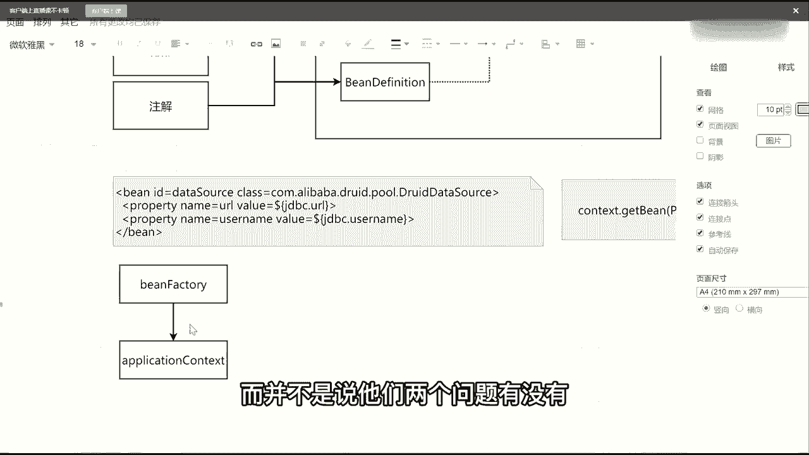

如果你可以打开源码的话，你可以看一下这东西叫application la casion context。

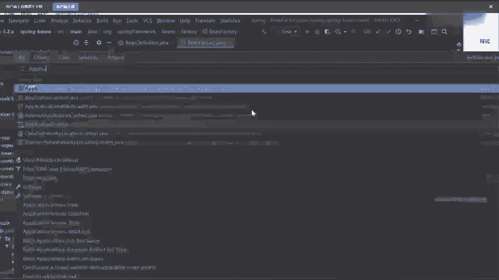

找到这个接口，然后呢选中右击so diagram，你可以看到他一系列的继承关系好吧，往下看它这个接口吧，它是不是嗯不对，它是不是继承了并返回这个接口，看没意思了吗，好吧，那英语老师他这样实现什么意义啊。

它提供了bean factory里啊。

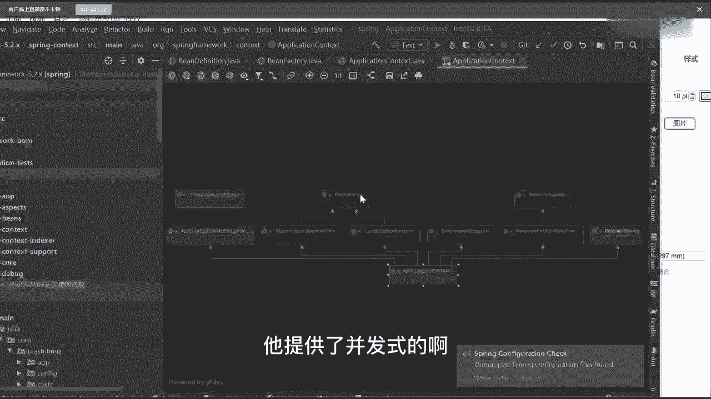

它比较单一，里面只提供了一堆的一系列什么呢，叫get并的方法，但get定的方法可能不太够使不太够用，所以application contest对它做了某些最基本的扩展功能，提供了更加完善的一些方法。

明白这意思吧，好所以把这件事我希望他们能理解清楚了，也就是说你虽然用的是我们的applicant contest，但说白了继承的还是bean factory的方法，所以这时候就问题来了。

老师这个bean factory到底怎么理解，到底怎么理解，你可以把它理解为是一个入口，也可以直接把它就等同于我们对应的容器对象，能明白这句话吗，因为我们这些对象。

不管你的bean definition也好，还是你实例化好之后存在对象也好，他都放在某一个容器里面，而容器是需要bean factor来进行访问的。

这时候你可以把bean factter的某一个实现子类，就当做我们整体的容器，比如说面试中问的比较多的是啥，有一个容器面试中几乎可能会提到啊，如果你回答比较多的话，就会提到有人知道这玩意儿吗。

叫default，Easible，Being factory，有听过这玩意吗，听过的扣一没听过，扣二没见过，注意了，它就是我们所创建的整个spring容器，也就是说我们所有的B类项。

其实都在default visible并factory里面进行存放的，一会儿，我可以带你们看一下整体流程和整体页码，好我们先扔一边，所以这东西我希望你能够先认识到了，当把这东西扔到之后。

你就说它是我们的容器，它是being factory一个子类，我可以把bean factory就等同于我们对应的容器，当我需要访问的时候，可以直接通过bean factory来访问容器里面的。

一些对象值或者一些属性值了，那我问一下，我能不能通过bean factory来获取bean definition，能还是不能，看这个问题啊。

我能不能通过bean factory来获取我们的bean definition，能还是不能，能不能有人说能有人说不能，能不能取决于什么东西，你看一下它里面有没有具体的方法。

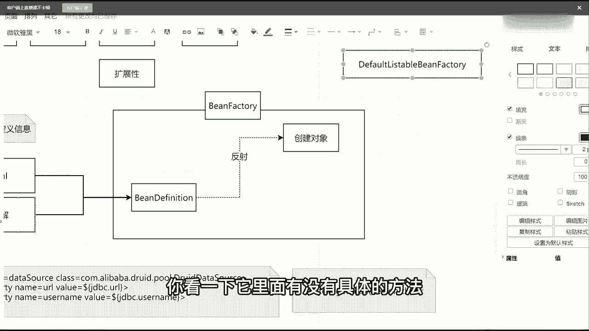

不就完了吗，这东西我们没必要吵的，点开之后来看一下，有个东西叫get bean definition吗，有没有有对应这样的方法吗，好像没有，对不对，没有你也没必要慌，为什么它是一个顶层接口。

既然是一个顶级接口的话，就意味着它一定包含了一堆，或者一系列的实现子类，所以如果复制上面没有的话，我们可以去子类里面进行查找，好吧，来找个东西，这玩意有东西叫CONFIGABLE。

并并并factory点它之后，我们可以来找一个东西叫get，哪去了，看到啊，有get bean class order，有get bean expression，Recover。

get depends是什么东西，这里面是不是比我们刚刚那里面，包含更多的一些属性方法，让他看啊，我刚刚是打开一个子类，当我打开子类之后，它里面是不是提供了更多的一些方法，除此之外你还能看什么。

还有团长，你通过它知道它在子类里面，一定包含了一堆的扩展实现，虽然我的父类接口里面没有，但是我子类接口里面有，比如说我带你们看一个对象，那你看一下啊，Prepost process。

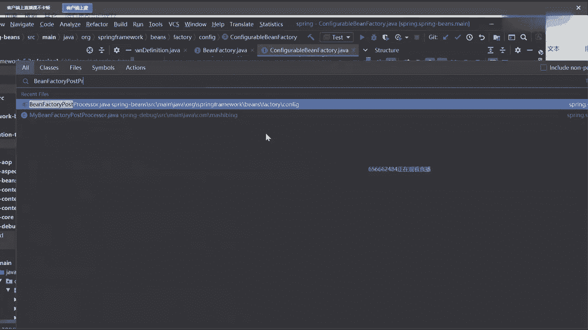

看来我现在点开是当前这个词类，他的继承关系啊，它实现了libbean factory，然后离实现了configable bean factory。

confiable bean factory上面有哪儿去了，叫继承的bean factory，再往上翻有bean factory，因为它有一系列的继承关系。

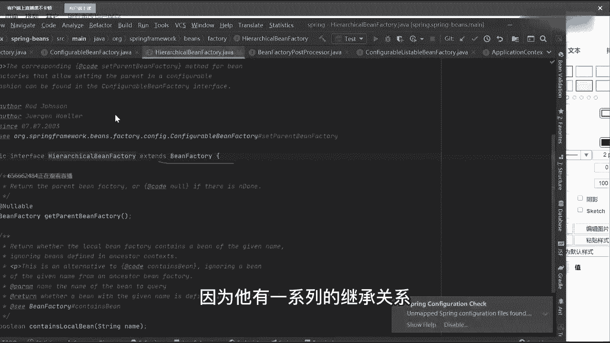

我们不管这个继承关系了，打开它在里面找一个方法叫get，看着你看到啥，他们告诉我看到什么叫get bean definition，能不能看到，能看到吗，就说spring源码它为什么这么难。

或者你们看起来感觉这么乱，最关键和最核心的点在于，它存在了一堆的接口或者一堆的抽象类，这抽象类的继承关系会变得非常复杂，你在找具体的实现的时候，你可能不太容易找，所以你需要一层一层去捋这玩意儿。

像我刚刚说的bean factory没有get bedefinition，但是我往沿着子类往下找，找到了吗，是不是有东西叫get by definitions。

也就是说我可以通过我们的bean factory对象来获取到，我们具体的bean definition对象，找到之后，我就可以直接获取到了，明白意思了吗，所以这是源码它比较难的地方，你需要一层一层去旅。

如果你不去捋这玩意儿，你压根理解不了里面的核心点，好，这东西我们先扔一边，读完之后来回过头来，现在说了，我有了bean factory之后，我可以根据我们的bean factory。

来获取我们的bean definition，刚刚呢我也写好了一个配置文件，比如这个地方，当我写好这个配置文件之后，问题就又来了，同学们什么问题，大家看一下里面的东西啊。

我这定义了一个data source，有人这么定义过data source吗，这么写过同学给老师扣个一，你们这么写过没有，你们现在不这么干了对吧，都用注解，都用注解，对不对，那我问一下好吧。

我们这样配置文件的方式，这里面哦，我没写引号，没写引号，在这里面存在一些占位符吧，比如说叫dollar j DB c u22，dollar j DB c6到name，这些占位符一般我们会写一个配置文件。

叫dB点properties对吧，然后从这个配置文件里面，把我们需要值给拿过来，替换到我们这个value值里面去，一般情况下我们都是这么干的，是不是这意思，那我问题来了，我在这个步骤这个步骤来进行解析。

装，改成一个bean definition对象的时候，我是否会把这个值也进行一个替换，是还是会还是不会，会吗，不会对结论确实是不会不是应该不会，就是不会，如果不会的话，同学们，你注意了，这个步骤。

它只是把配置文件或者处理这样的方式装载成，并单位时对象了，它不会对里面的值进行处理，那下一个步骤，我就应该通过反射的方式来进行对象创建了，现在指根还没有呢，那我怎么办，这还没有怎么办。

我是不是一定在中间某个环节里面，要把这个值给替换掉，因为我如果不替换的话，我没法进行对象属性赋值了，我肯定会进行替换的，那么在哪替换，有人说了，老师在ban Viper里面进行替换。

有人知道什么叫ban Viper吗，好多同学提到这东西了，Ban raper，他是个啥，什么B方法，它是bean对象的一个包装类，是在我们创建了一个bean对象之后，会把它装载或者包装成一个并发牌对象。

你可以直接把它等同一个bean对象，那个时候对象已经创建好了，你还留着他最近干嘛，不是在这注意了，会在哪进行操作，会在我们整个对象创建之前，记住叫之前把这些属性值全部都替换完成，如果我在对象创建之前。

不把属性值替换完成的话，他后面没办法进行属性赋值了，语文老师在popular bean对象里面进行填充，会的popular对象里面只popular的方法里面，他只会去设置属性值，而不会把值进行替换。

所以在中间一定某一个环节会对它进行扩充，扩充啊，所以这里面会涉及到几个东西，我要给大家说明一下，比如说第一个最简单的，有些东西你们应该见过叫bean post processor，有人见过吗。

或者我把病去掉，叫post processor，前缀不要了，叫post processor，有人见过吗，这个post processor是啥玩意儿，什么东西，前置处理器。

完了第一次有人把它称之为前置处理器啊，有人把它称之为叫后置后置处理器好吧，也有人把它称之为叫增强器，我个人认为增强器说的是比较合适的啊，后置处理器这样翻译过来可能不那么合适，可能不那么合适。

明白意思吗好吧，那增加一什么意思啊，它就是用来完成某些具体的扩展功能实现的，比如说问的最多的两个东西，第一个叫并factory post processor，这是第一个好吧。

还有第二个叫b post processor，这应该是我们在日常工作中，或者说在我们那个面试中，问的最多的两个接口了，他们都是用来进行增强功能实现的，那么他们两个到底有什么样的区别呢，啊有什么区别吗。

区别是啥，很明显了吧，你通过类名就能分辨出来啥区别，针对的操作对象不同嘛，一个针对的是been对象，一个针对的是been factory对象，所以你可以思考一件事，我如果去看这个接口的话。

我如果想对我们的bean factory进行扩展的话，我是不是可以通过我们的bean factory，post processor进行扩展来。

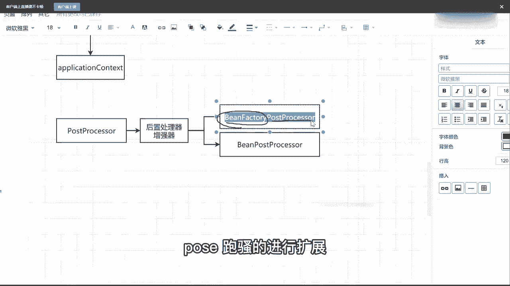

我不不光吹，我给你打开这个接口，你来看一下叫ban favorite post processor，有这样的对象，就这样这样这样一个接口好吧，他说了，他是一个hook，允许用户去自定义。

我们上下文对象的bean definition，看后面那句话啊，翻译好吧，允许for customer modification自定义的修改吧好吧。

Of an application contest bedefinition，某一个应用程序的bean definitions对象吧，我是不是可以通过它来完成某些definition对象，的替换工作。

而你打开这个接口之后，你发现这个接口很好玩，它里面有且仅有一个方法叫post process in factory，其实就把名字翻了个叫bean factory的一个后置处理。

你看到了他传过来的对象是什么，是一个bean factory对象，所以在里面我可以按照这样的方式来获取到bean，definition对象，然后来对bean definition对象进行修改操作。

能这么干吗，可以啊，那怎么来看呀，很简单，找到这个接口，我们依然找一个时间子类。

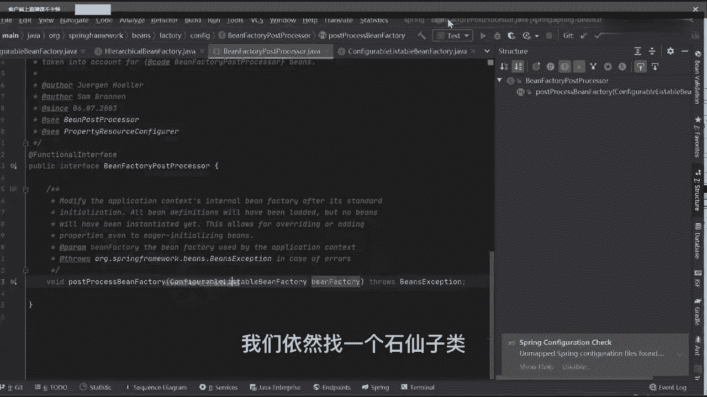

我这儿不让你们去找了啊，我来直接给你们找到，你往下翻，有一个东西叫police holder configure sport，有这样的一个实现子类，在当前实现子类的上面还是看注释好吧，还是看注释。

他说了没事，我们也找不到，来看看啊，什么东西呢，看注释啊，第一个叫abstract base class，说是一个抽象的基础类，对于什么呢。

叫property resource属性资源configure配置，也就是说它呢是一个基础类，你干嘛呢，用来进行属性资源配置的一个基础类，那它来配置啥玩意儿啊，说了叫resolve处理处理。

Place holder，占位符哪占位符啊，叫bean definition，property values里面的占位符操作，明白这意思吗，那翻译过来啥意思。

你想一下我刚刚定义的这个data source，它是不是一个转成一个BD对象了，BD对象里面是不是有一个东西叫property，Property，里面是不是有一个value value。

里面是不是有一个占位符，你看我意思吗，那是不是意味着，我可以在当前的这个BD对象里面啊，不是这个b post processor对象里面来把这个值完成，整体的替换工作是不是这意思啊。

来我刚刚讲的东西能听懂，同学给老师扣个一，能听明白吗，可以画张图，什么图，这是一个BD对象，但是这个B的对象都保留，就保留原始值，明白意思吧，然后在上面往上走的时候，它会变成一个叫最终的BD对象。

BD啊，指的就是我们的bean definition，这没没没法写了，对方太小好吧，转成BD对象，再转成BD对象，中间这个过程里面，中间过程里面会有一堆的东西能对它进行处理，怎么处理呢。

就是我们刚刚说的叫b factory，Post processor，明白了吗，也就是说在这个环节，它可以对我们的bean definition，对它进行相关的一个处理。

当然这样的bean factory post poor，我可以有一个，我也可以有N多个，这个根据你的实际项目需求来做就可以了，这可以完成一个替换。

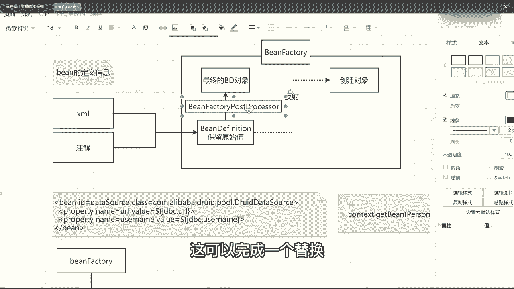

当然很多同学老师我不信啊，你信不信，来我们来验证一下，一页看一下，你知道你信不信了，好吧，来举例子说明吧，我不给你们演示，你们可能觉得都听不懂啊，来我找一个代码，我打开一个配置文件来往下看。

在当前配置文件里面，我这是不是占位符，是不是占位符，同学们，没问题吧，全部都是占位符好吧，全部都占位符，我没有做任何值得替换工作，有在中间某个环节的时候，我需要把这些值进行替换，怎么替换来。

我就bug debug的流程啊，同学们，你怎么还有这么老的项目呢，这是我在讲源码的时候重新编译的项目，5。2。9版本的，不是老项目好吧，这讲源码的时候给大家留做的一些案例，不是老项目。

那我们来看我再debug一下，debug之后我说了，刚开始spring一定先有一个容器。

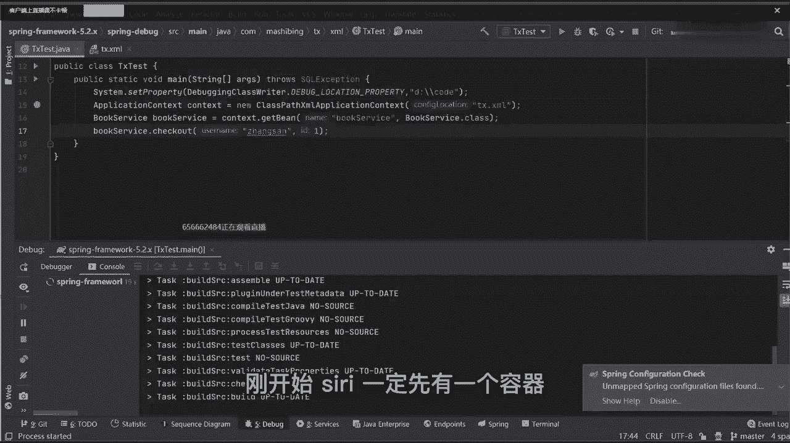

我刚给大家指出来了，这个容器是啥，是default visible bean factory，所以一会我带你看一下这个default lible being factory。

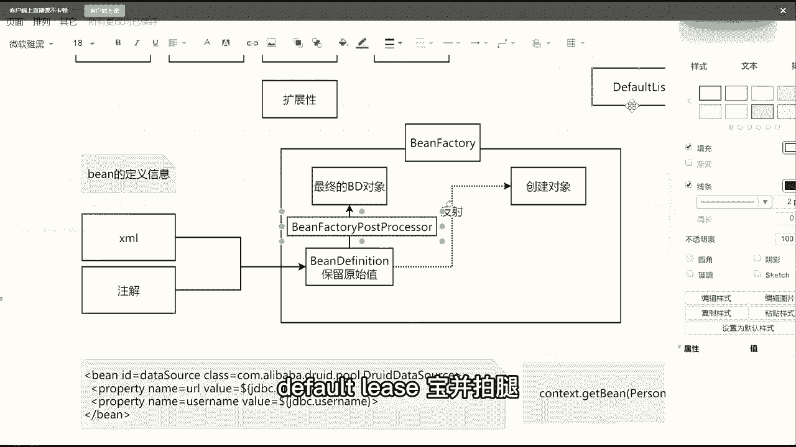

你们可以看看，好吧嗯，启动好了没，因为我这边的是原版那个环境啊，所以它可能每次启动的时候，会相对于比较慢一点，它每次都要重新进行相关的一个编译，而你们如果直接引用战包的话，是不会有这个问题的。

还是比较快的好吧，等一下，怎么这么难，好了进来吧，进来之后来往下走，直接new一个对象吧，好吧，往下走，进来之后，不管他这是个bug，点进去有this往往这边走走走。

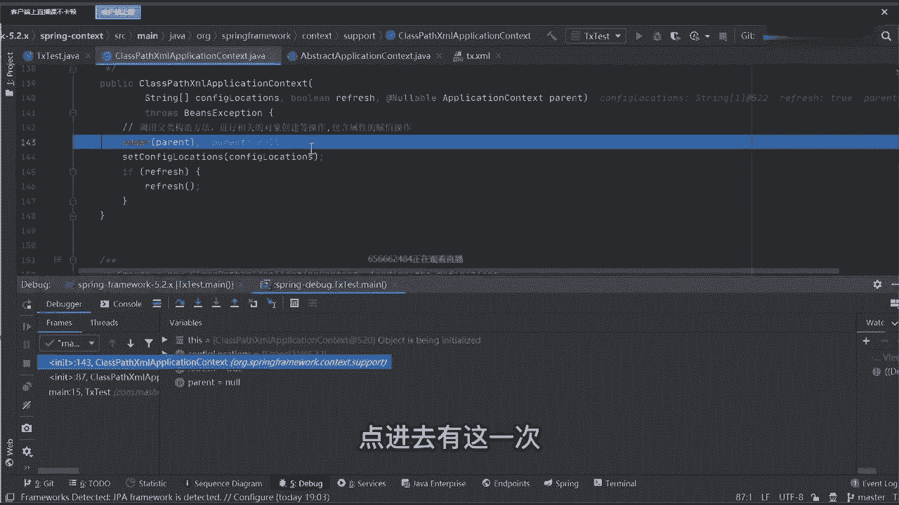

点到REFLESH，报REFLESH之后，我刚刚说过了，刚开始上课之前，我就强调了REFLESH它很重要，里面包含了13个方法，如果你想把这个spring框架看连板，那么这13话你是必须要懂的。

如果这13万你不懂，很明显spring你就等于没学会好吧，前面几个步骤我们不看了，我就带你看关键步骤好吧，来到这儿来翻译一下这个名字是什么意思啊，现在我发一下，这是什么意思啊，不对是什么意思啊。

翻译下获得吧，获得新鲜的bean factory对象，也就是说在这个步骤里面，我会创建一个bean factory对象，来装载我们具体后续的bean对象，来点F7进去进来之后有个REFLESH进去。

进去之后，第一步先判断一下有没有工厂，没办法跳过，跳过之后来看这个步骤是啥意思，叫create d factory吧，Create b factory，是不是这意思，我要创建了吗，你点开这个方法之后。

你发现了它里面干了些什么事，来告诉我你有一个什么对象，啥对象不就是刚刚写的吗，叫default lible bean factory，也是我们后面用的容器对象。

都叫default visible bean factory，这玩意我刚刚说过了好吧，所以让你能看到，看到之后，当我创建完对象之后。

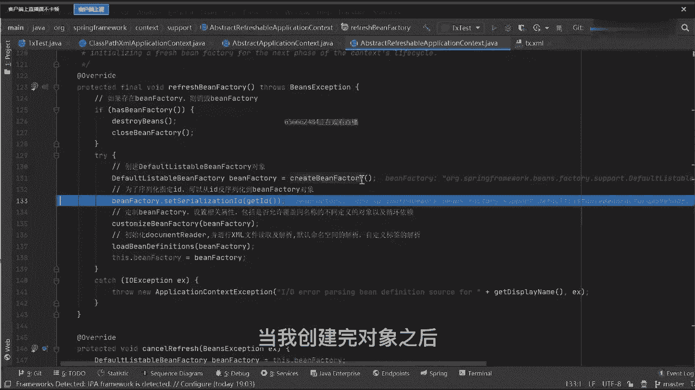

我希望你能注意一下这个bean factory，在这里面呢有两个属性值，我希望你能重点留意一下，第一个属性值叫什么呢，叫bean definition names。

第二个属性值叫bean definition Mac，来告诉我，现在我刚刚把这个default liable并value，对象创建成功，他们的默认值都是什么，两个集合嘛，一个HASHMAP。

一个是release，默认的都是什么零八，我现在什么值都没有。

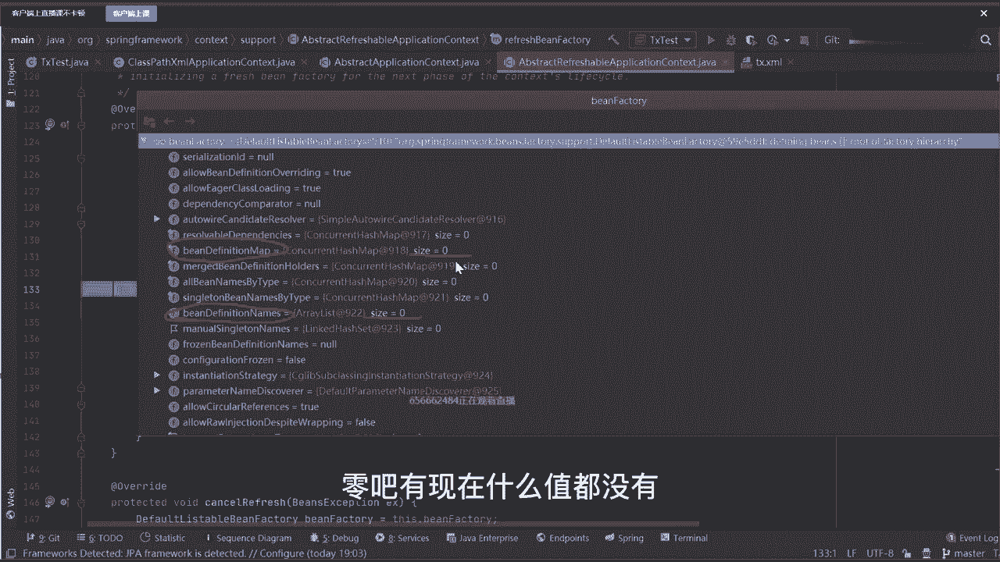

你把这东西记住了，什么值都没有，然后我往下走，走到这一步干嘛的，翻译一下load bean definitions，翻译过来叫什么，叫加载bean对象啊。

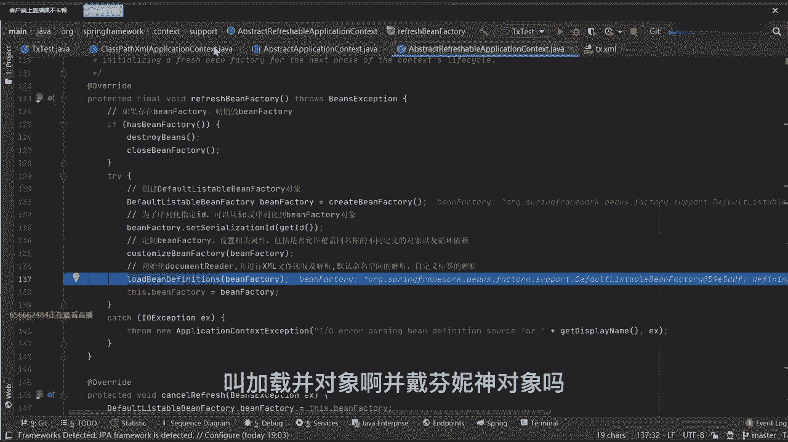

been definition对象吗，从这个环节到这儿加载bean definition对象了。

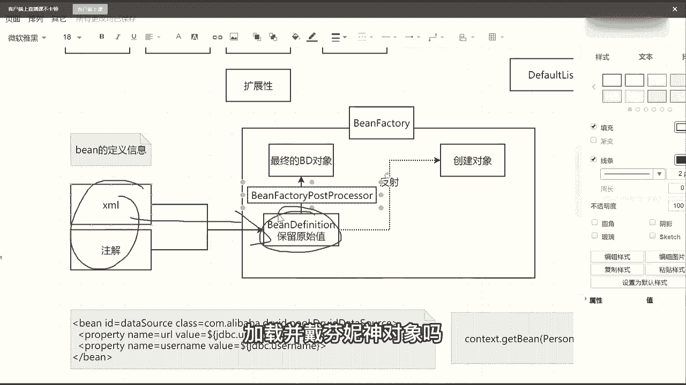

这里面有多少个BEDEFINITION对象，我也不知道，但我们可以往下走一步。

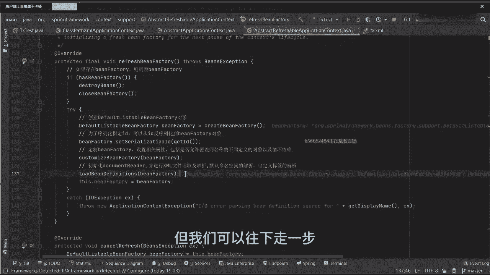

当我走完这个步骤之后，我们可以再打开我们的bean factory，再找到刚刚那两个属性值，你们现在有值了吗。

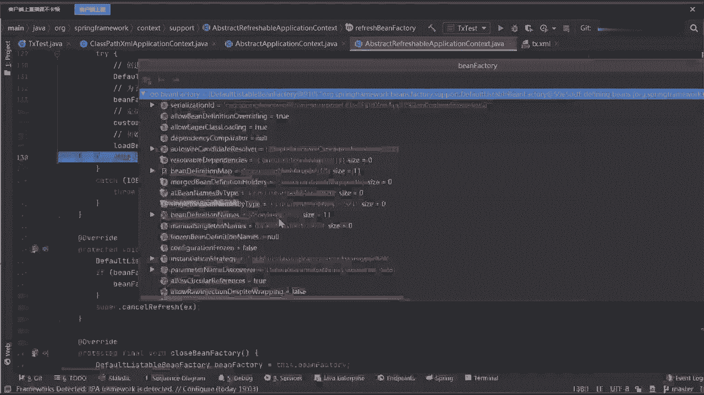

都是11个吧，是不是已经有值了对吧，那意味着我已经下载成功了，当我加载成功之后，不重要，重要的是什么，我我需要看一下里面的data source。

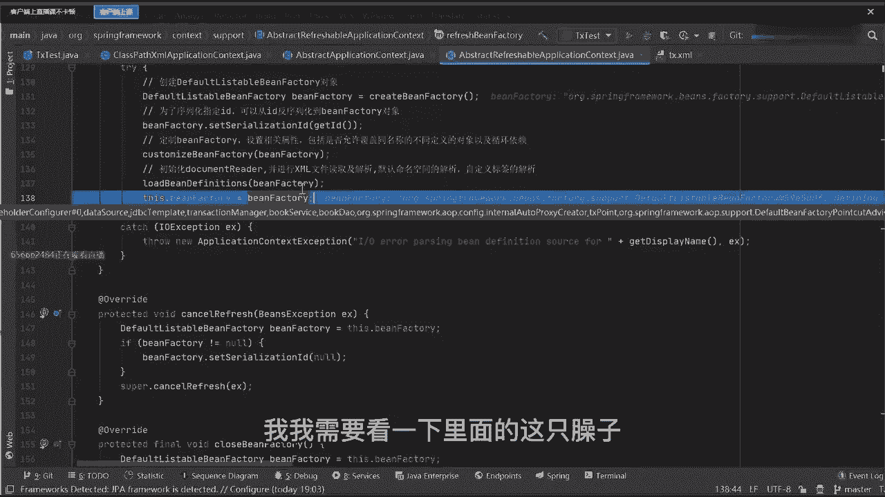

点开我们这个平台，平时map找到我们的BESOURCE，找到我们的value，找到我们的property values，找到我们的proper value list，找到我们的username来。

你告诉我现在的值是啥，这是什么GDBC用的内容吧。

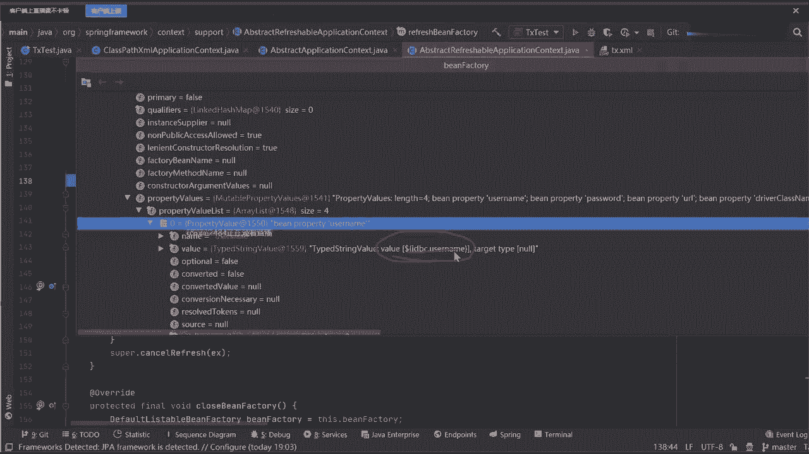

为啥11个我定义了11个，为啥11个不要问这个问题，我定义了11个，所以是11个好吧，Dd source，我再从这看吧，那已经取消了，我问一下，现在这个值是不是，就是我们从编制文件里面下载回来。

这个值现在替换了吗，没替换啊，没做任何的替换工作，然后我再往下走走走走走走走，走到这个步骤，当我走到这个步骤之后，我为了验证我们这个中间过程里面有没有替换，我们来打开b factory。

再找到我们的应该就是Mac it source，找到我们的value，找到我们的property values，找到我们的这个值，Of your name，我问一下现在值替换了吗，有问题吗，没有啊。

没有做任何的替换工作，没有做任何的替换工作，从来没替换过好吧，然后你翻译一下这个方法叫什么，对方什么意思，别的你可以都不理解，invoke中间分开，invoke什么意思，叫执行或者叫调用，听明白吗。

然后bean factory post processor什么意思，不就是我们刚刚说的那个扩展几点吗，叫bean factory post processor。

也就是说我现在要开始调用执行bean factory post processor，那我们就要看一下。

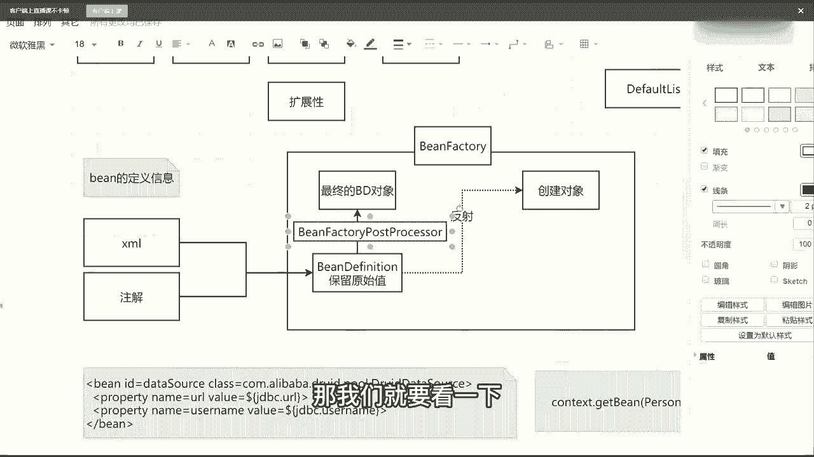

在这个步骤我执行完成之后，我这个值有没有完成替换，来往下走一步走，做完之后来看一下，听完了没，听完了吗，换了吧，已经换成root了好吧。

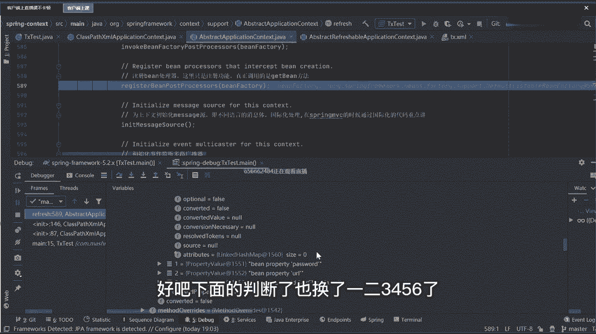

下面得判多少了，你换成123456了，1万2也替换了，是不是全部都完成替换工作了，那是不是意味着在这个环节，这我可以完成他的替换工作，来这块听明白，同学给老师扣一，能听懂吗，所以这时候问题来了。

如果你自己需要去替换某一个病，你可以替换吗，听好了，你自己如果想做这件事能做吗，能不能做，可以啊，怎么做，它是一个接口，你只要去实现这个接口，完成你具体的功能不就完了吗，是不是这意思啊，来试一个。

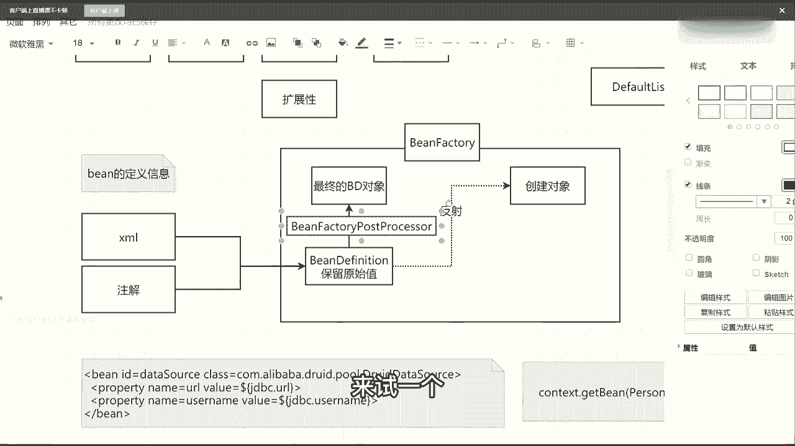

随便写一个，右击new一个class，My bf p p，哎有这东西了，重新建一个吧，无所谓，来右键my BF p p2对吧，在里面实现一下in，post processor实现里面的几个接口。

实验完之后可以干什么事，有一个bean factory的，我可以be factory，第2get bean definition，但是我们有一个person的对象对吧，那这个时候你告诉我。

我能不能获取到现在这个person对象的，Bean definition，能吧，那我获取到对象之后可以干什么事了，person点set，我能不能往里面设置，我是不是想怎么设计，怎么搜，我随便设置了。

只要它里面有的这些方法，我都可以进行属性值的一个基本的设置的工作，这不就完成了吗，对不对，我们现在没需求，没关系，我就是在这打印一句话，比如说ST，应该是0922等于这东西也可以吧，我问一下。

当我定义好一个这玩意儿之后，我们现在容器能够识别到它吗，容器能不能识别到它，能不能，不能你需要把它告诉容器吧，怎么告诉容器啊，第一种方式上面加一个at component，声明好，它是一个并对象对吧。

除了这样方式之外，你可以在我们的配置文件里面，我不是这个，我加一个，So that，并对象，然后打印一个class等于my b f p p2，我是什么样的对象，可以了，帮我生成了对象之后好了，不用管了。

我可以直接来启动我们当前应用程序，我们来看一下它到底会不会打印右击状，我这运行不带debug了，你加注解也可以好吧，注解配置文件两种方式，说什么lock lock了，停掉重来走，哎呀，这有些锁定的文件。

Gradi，5。6。3，Execution history，单调，这里删掉，那句run，这要是没打印出来会不会很尴尬，那肯定会啊，没打印出来肯定会很尴尬啊，肯定会尴尬很尴尬的，但是不可能打印不出来。

好吧，来试试好不好，来我来看092打印出来了吗，对不对，就这玩意吗，好吧，轰隆一问，说spring中BFPP是怎么来实现出来的，注意了，你所需要创建的所有的对象。

所有的对象都会被声明成b definition d对象，所以我可以根据我们BD的类型，来进行一个查找工作，看看工作，这个不是我们这一个重点，我不说了，好吧，好好好，红红，你记住了。

我可以根据我们的类型来识别出，我有哪些必须对象，根据我们的BD来进行对象的创建工作。

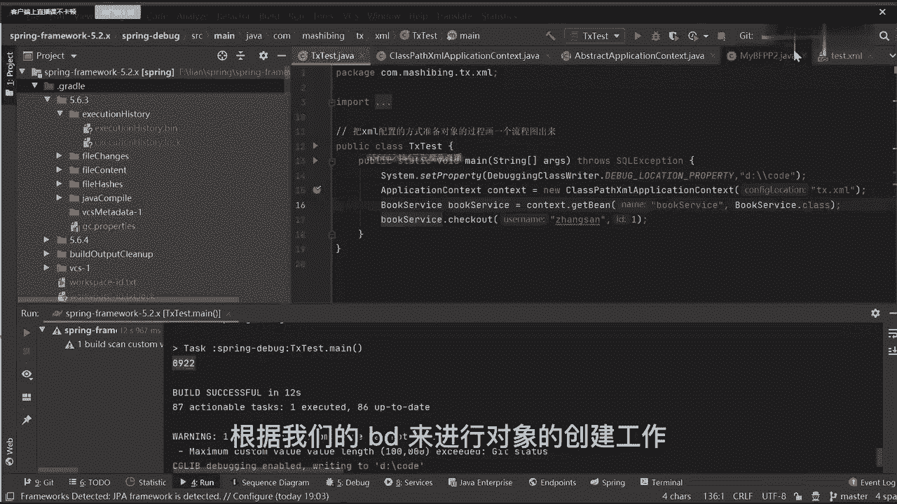

所以这块就完成这件事情，就完成这件事情了，这样我问一下，这是只能定义一个，还还还是可以定义很多个呀，这个bean factory post processor，一个还是很多个很多个好吧，你想定义多少个。

定义多少个，那么这么多个怎么执行啊，怎么执行，能执行吗，对它是通过看心情，它是通过for循环来进行执行的，那for循环的时候，我怎么能强调它的优先级呢，比如说我就想让某个先执行怎么办，怎么办。

打锁不用加速，对at order就可以了，at order好，可以指明在当前这样的一个顺序，可以根据我们的顺序来进行相关的一个，执行操作，就这块好吧，当然这是其中的一个步骤，除了这个步骤之外，还有什么。

我这儿再额外补充一些知识，在唉刚刚的东西。

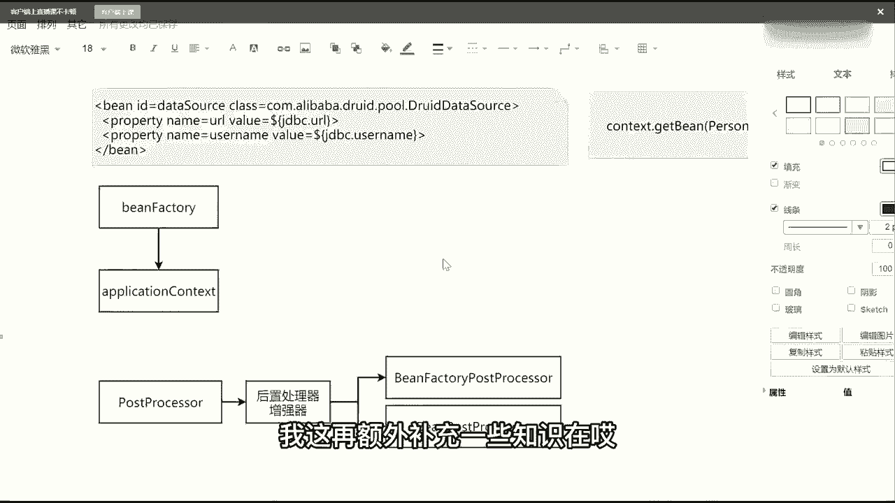

TV派同学给老师扣个一听。