# 马士兵教育MCA4.0架构师课程 - P48：48、BeanPostProcessor接口详解 - 马士兵学堂 - BV1E34y1w773

哎刚刚的东西听明白的同学给老师扣个一，你听明白了吗，听完之后我就再补充一个东西啊，在当前这玩意儿在下面它还有一个子接口，我也希望你能够稍微留意一下这个子接口，它其实也非常重要，什么子接口呢。

我写一下叫B，Definition registry，Post processor，你们见过这东西吗，可能很多人没见过这玩意啊，但其实我还是那句话，你通过名字应该能猜出来他到底干嘛的。

叫bean definition registration，不就是注册BD吗，注册BD的一个增强处理器，增强处理器它有用吗，它有用吗，有它的用处非常非常大，它有什么用。

把bean definition装到map中，不太对，怕什么用，在它的下面有一个很重要的实现子类，叫这个东西，原装的这个吗，有人知道这东西吗，卡了的话，重新刷新一下好不好，我不知道你们那为啥总卡。

你们见过这东西吗，叫competition class，Post processor，它是干嘛的，配置类不太准确，他干嘛了，同学们注意了，这玩意儿你要不知道，那么。

spring boot自动装配原理你就别学了，这东西都不知道，spring boot自动装配原理你就别学了，别学了，因为分布的自动装配原理，实现核心点就在于它的一个扩展，明白意思吗，就在这玩意儿。

它很重要，好吧，你能看到一堆的注解的解析过程，看一眼好。

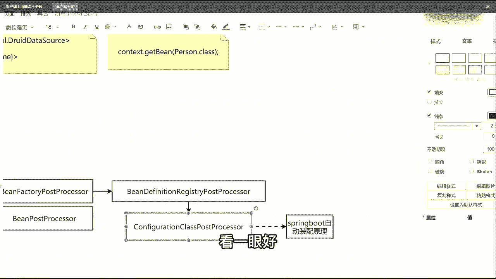

不带你们看一眼啊，我心有不甘，来B。

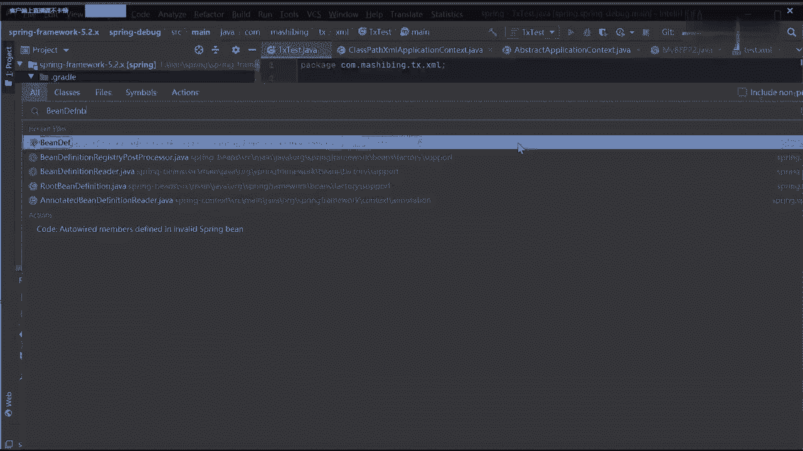

Registry post processor，这里面有一个方法，点开了实现此类，找到configuration class post processor，在这里面找他，然后我点快点好吧。

你不用管这个步骤了，点它点它点它。

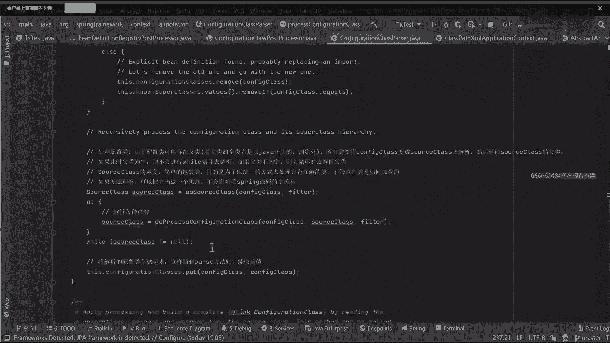

找他来往下看看这个组注释，A process any at property，Source animation，处理这个注解，第二个处理这个注意点，第三个处理import注解。

第四个处理import resource注解，第五个处理艾特定注解，看明白了吗，都是在这以入口能够进来的，如果这东西你搞不明白，那别的东西你就不学了，搜索备原理你永远说不清楚，明白意思吗。

所以这是这块的一个核心点，我们不说这东西了啊，这个这块扯的有点远了，你先把这东西搞清楚了，也就是说我们这儿完成很重要的一个基本功能，那这其实我可以留一个疑问，由于什么疑问，大家想一个问题啊。

你们去你们自己去思考，我今天晚上先摸摸答案，这玩意儿他继承了definition being reject post processor。

那么这里面需不需要实现并factory post processor，里面的方法需要实现吗，看这个继承关系啊，他继承了他，他又继承了他。

他是否需要实现这个里面那个post process bean factory，这个方法需要不需要，一定需要吧，肯定需要，对不对，来公开课同学需要吗要吗，如果要的话，我们可以点开这个东西来看看。

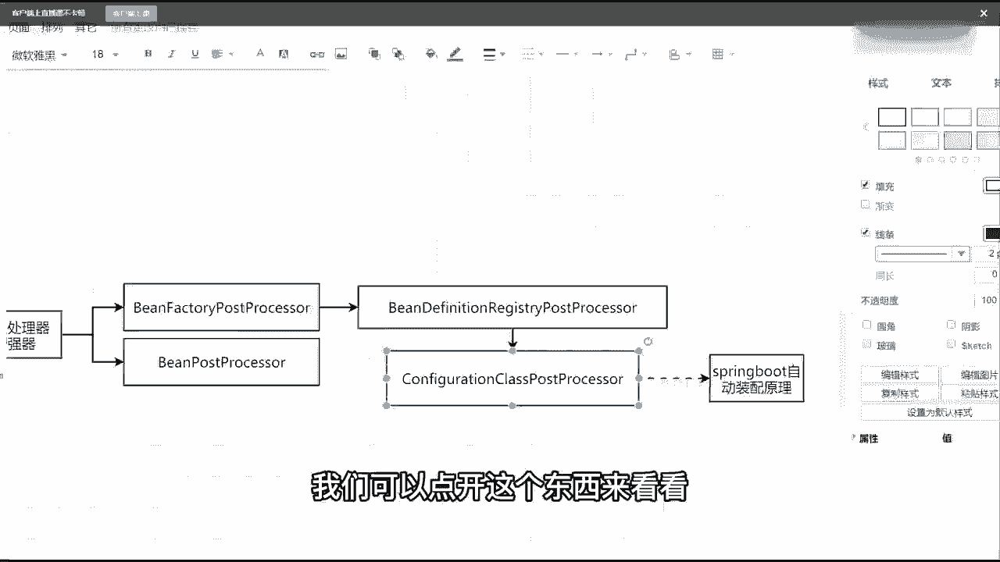

Composition，Composition class，Post post，点开post process，Bean factory，这块有这样的一个实现功能，但里面有一堆的判断逻辑，不管它。

但这块做这样一件事叫enhancer，Configuration classes，这啥意思，别的东西你都可以不了解，Enhanced，了解吧，你看一下什么叫增强，它有什么意义，这里面其实引申出来一个点。

我们在写配置类的时候，pk的时候配置类为什么需要生成代理对象，你考过这件事情吗，配置类，配置类里面你们是那个配置类，是否需要代理对象，需要吗，怎么突然开车没开车呀，需要吗，啊我开车了没有啊，我这看啊。

这个你们是不是因为at configuration过这些类，at configuration类，它是否需要at conversion里面，你们一般会配置一个叫at bean，然后创建出来我们具体对象。

对不对，就是我问一下，这个配置类是否需要动态代理来创建出来，代理对象需要还是不需要，需要吗，要吗为什么呀，有人想过为什么，是什么原因导致我必须要这么做的，核心点就在于这块，好吧，这也告诉你了。

Enhancer，Configuration classes，Enhor，创建代理对象的enhancer，你点进去之后，你会发现里面有具体的逻辑处理过程，你自己看吧好吧，找这个东西你自己看吧。

就里面逻辑里面有这样的一个包含逻辑关系，你们可以自己来看一下好吧，增强肯定要代码吗，不对，这不是更新点，阿福说的靠点边了。

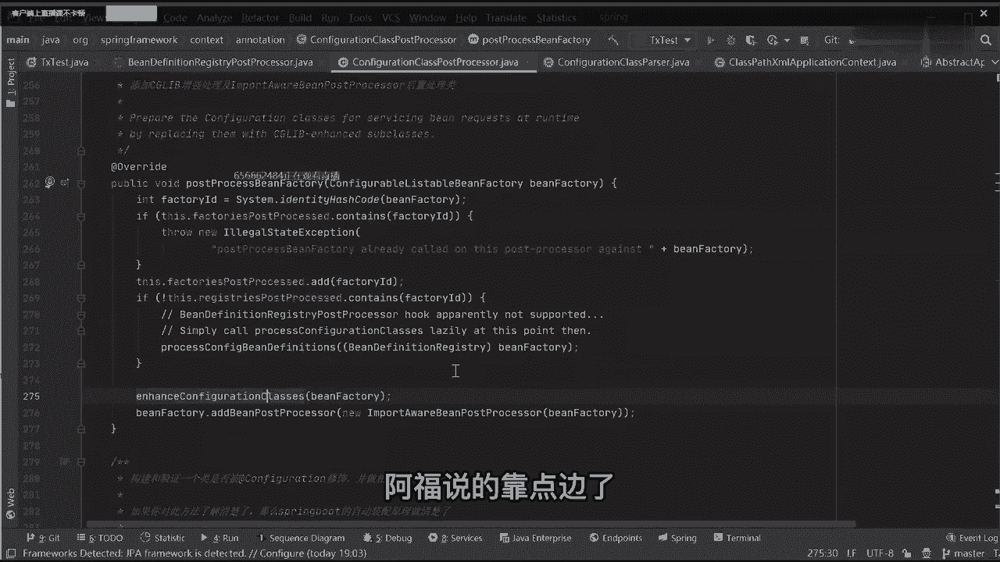

留个疑问下去之后好好思考一下，我们先不管了好吧，有兴趣的话，我们下次再聊，来回过头来看看上面这张图，所以这个图进到这个地方了，也就是说，我现在我现在要把它变成一个最终的对象了，我的值也已经替换完成了。

当我的值替换完成之后，往往下走，走到这块，是不是该创建对象了，创建对象我们说了，我可以直接通过反射的方式，来进行对象的一个创建，那我问一下对象，创建完了之后，下一步干嘛，对象创建完了之后。

下一步干嘛调用使用对该用了，使用使用完了之后呢，销毁，销毁这是不是就是我们整个B的生命周期，从创建开始到使用，从使用开始到销毁这块，我如果把它框起来，框起来，就最后它是什么不就变成十分中心吗。

是不是这意思，但这个生命周期啊太粗糙了，真的太粗糙了，你这样说是不对的，或者说不严谨的，那这样我还要再普及一个最基本的知识，同学们，我们一般说的时候都口头说叫什么叫创建对象，没问题吧，就创建对象。

我问一下创建对象包含几个，过几个步骤啊，对敲黑板要考的，一般情况下包含两个环节，第一个环节叫实例化对吧，第二个环节叫初始化，我先问一下实例化干什么事情，不就是分配内存吗，对吧，当我分配好内存之后。

我的问题是，此时这个对象里面的属性值是什么值，默认值什么问题吧，我们达成共识点，那么很明显，初始化我应该干的事是什么事，什么事属性赋值吧，这大家所有人都想到到此就为止了吗，到此为止了吗，二加属性赋予制。

这是其中一个功能，除了属性赋值之外，还有其他非常重要的核心点，什么点了，比如说执行叫INIT方法，比如说叫扩展实现，还有这样一些东西，这些东西说白了他很麻烦，但是这是spring里面最标准的一套流程。

你是必须要知道的，所以下面我们需要花时间来把整套环节给打通，到底什么叫病的生命周期来，我问一下，有多少同学，现在能把bean的生命周期给完整的背下来有吗，我都不认你们理解啊，你们能背下来就可以。

没有肯定有有很多同学可能会很聪明对吧，上网一搜bean的生命周期对吧，点开网页里面有一堆深究spring变生命周期好吧，别再问spring spring周期了，那随便打开一个帖子好吧，一堆文字来开始干。

开始背对吧，然后呢还有一些同学比较聪明，老师这张图片我去把这张，没了，诶刚刚还有怎么没了，对了大家来看，很多人比较聪明，很多人说老师我去背一张图片，把图片里面的关键步骤给背下来对吧。

告诉一下你背下来之后，你可能每次面试之前你都要去瞅一眼，都要去看看，如果你不看的话，很明显忘了对，很快就忘了，所以这玩意儿你不需要背，写spring源码的作者，他也是个人，他只要是个人。

他就一定会有自己的逻辑思路，那我们能不能把这套逻辑思路给背下来，如果能把这套逻辑思路给背下来，那还有问题吗，这没问题了吗，是不是意思好吧，时间跟他说应该是录播对，没问题，就是录播是录播。

所以下面我们要详细剖析一下，bean的生命周期到底是啥，不是人，别这么说好吧，刚刚我们详细说一下生命周期，从创建对象到使用到销毁，中间还应该包含很多复杂的过程，求道者，你说的加载验证准备解析。

这些东西属于某一某一个bean对象，某一个bean对象的一个创建，但是这个东西它属于JAM里面的，我们不说那么细，我们只是说spring里面大家怎么用的好吧，N9说开发中用不到，注意了，开发中是用不到。

但如果你不会，你可能连开发的机会都没有，所以把这事儿我希望你能想明白，不要说我学东西都是开发商用的，不要用好吧，它就是用来面试的，你说你面试的时候，有谁会问你说你来给我写个代码。

不可能他只能问你这些逻辑上的东西，或者理论原理上的东西，你必须要会，你不会了，你连送CRUD的机会都没有，所以不要再抱怨这件事情了，该学的你就要学，很重要，来我下面带你来梳理这个思路，梳理这个思路。

不要再说老师我是不是不用学，必须要学好吧，第一个不要再说什么内卷什么东西啊，不要说这东西没意义没意义好吧，来我们就学东西就可以了，第一个叫实例化，刚刚说了什么叫实体化来着，NP内存属性为默认值动作。

大家都能理解好吧，在实例化完成之后，下面有很大一块，还要完成一个最基本的初始化功能好吧，初始化到底是干什么事，怎么去理解，第一步你想一件事，我对象创建好了，下一步你告诉我应该干嘛，我们不看源码好吧。

就按照正常的逻辑思路，下一步干嘛，不就该赋值了吗，是不是对应属性赋值啊，随便来一个属性赋值，对不对，我想这个分贝吧，你对象创建好了，下一步直接进行属性赋值，我觉得这个东西作为一个正常人都能想得到。

那复制完了之后，下面干嘛呢，下面干嘛，很多同学可能会比较懵了，老师该干什么事，该扩展了，没到那个环节，也没到那个步骤好吧，他在哪做这个事情呢，你如果看帖子的话，下一步有什么东西，第一个叫实例化变。

第二个叫设置对象属性，第三个叫检查aware相关接口，并设置相关依赖，很多同学对于这个AVA接口理解得非常非常差，来谁能告诉我什么叫AVA接口，这是干嘛的，没听过，你应该听到这啥东西，翻译过来叫什么。

先说翻译过来叫什么，就联想到叫一声到晚啊。

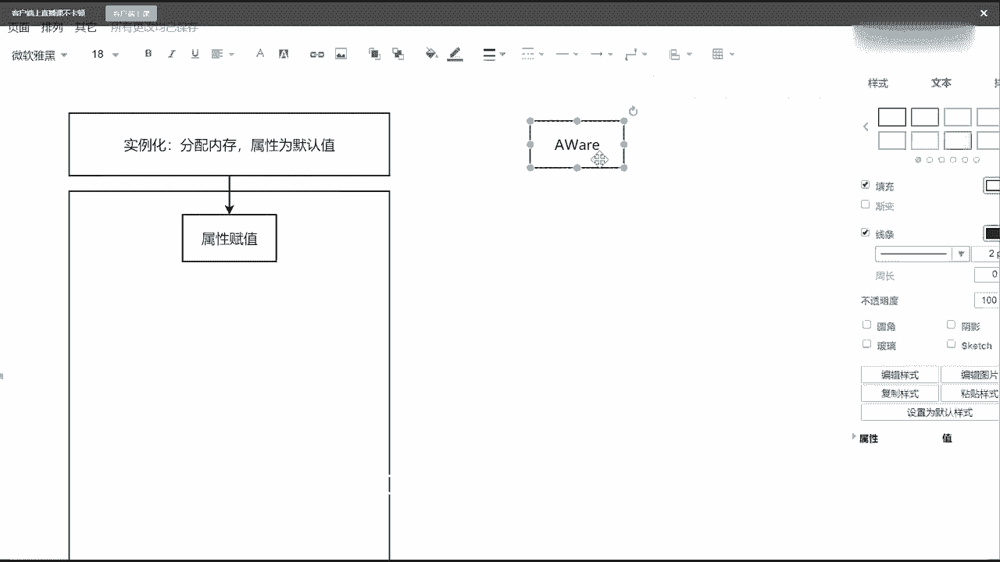

这东西很好理解，我之前给大家讲过不止一遍这玩意儿了啊，讲过很多遍的东西了，它没那么难理解好吧，来随便打下一个对象，我们试一下，把这东西干掉啊，都是之前讲课的时候留个例子删掉，删掉删掉之后。

我们随便创建一个，比如叫student，没问题吧，装好之后我可以往里面写一些属性，Private string name，Private int int id is，这没问题吧，你定义好一个对象之后。

我肯定要设置属性值，我把它设置成自由的，然后生成共有的set和get方法，这没问题吧，来我写这个的扣一，没有人说连这东西都不理解吧，在后续的时候，我肯定要调用我们的set方法方法。

往里面进行一个属性的复制操作，这个我觉得大部分人都能理解对吧，这个基础面向对象好吧。

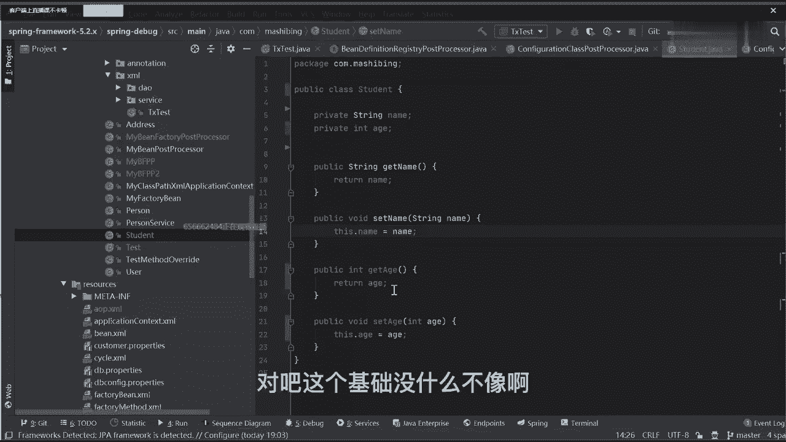

那下面问题就来了，什么问题，spring本身它是一个容器，它是一个框架，spring里面有没有帮我们定义了很多很多，其他不需要我们用户自定义的对象，有没有，有没有懂吧。

比如说刚刚上面提到的bean factory，这是不是有容器帮我们定义的，再比如说application context，是不是有容器帮我们定义的。

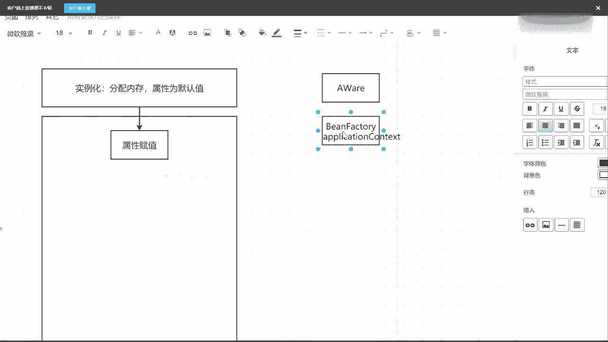

那这个时候问题就来了，同学们什么问题，我这儿完全可以在里面写这样的东西，Private，叫b factory be factory，Private application contest。

嗯contest，是不是数值那一样的，你想吧，我现在已经设置成流量属性值了，它也是私有的，我如果想往当前对象里面，注入对应的一个属性的话，我必须要生成公有的set和get的一个方法，是不是意思是什么了。

那生成好了之后，问题就又来了，同学们什么问题，这什么问题啊，谁在什么时候调用此方法，来先看第一个问题，谁调，你觉得这个赛德法是我们去掉还是容器，帮我们去掉，谁去调，容器吧，你叫对象创建，你都交给容器了。

你自己还没调理方法，你怎么调，你调不了，所以只能是容器帮我们去调用这个方法，放的好吧，第二个问题在什么时候调，什么时候叫，你想吧，这儿有一个set bean factory。

这有一个set application contest，两个set方法，可能还会有其他set方法，我什么时候掉的，我怎么判断启动的时候，启动的时候。

我怎么知道我要去调用这个set in factory呢，我怎么知道我要调用set obligation context呢，因为我是不知道他有几个set方法的，我也不知道里面有什么样的属性值。

那我怎么能确定我去调用什么样的方法呢，听到了吧，所以怎么办，监听实例化没那么复杂，线下面向对象能不能做一件事，D统一的规范接口来实现此功能，通过接口能实现这个功能吗，你就懵逼了。

老师我通过接口定义实现啊，很明显。

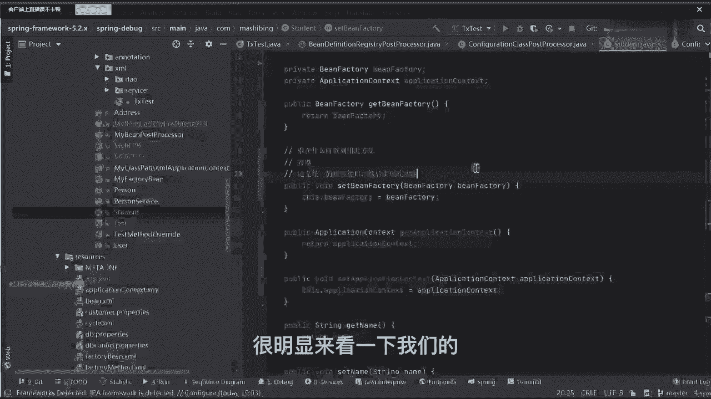

来看一下我们的，CSM里面有一个AVA接口，你发现了这个接口跟single ront一样，它里面有任何方法实现吗，没有吧，没任何方法实现，但是此接口它要由子类实现。

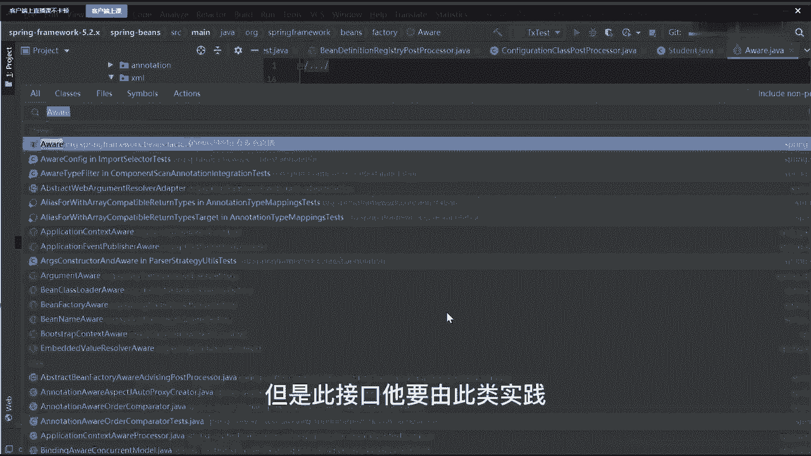

比如说像be factory，有个什么名字，什么名字叫set bean factory，你这时候看一下student里面的set bean factory。

和我们这儿写的set in factory一样不一样，这两个方法一样还是不一样，你告诉我。

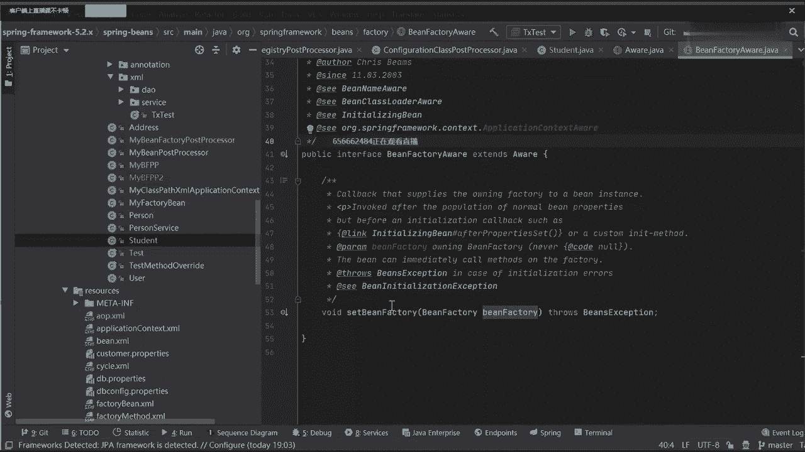

一样吧，没任何区别，对不对，再比如说再打开一个东西叫application context，Aware。

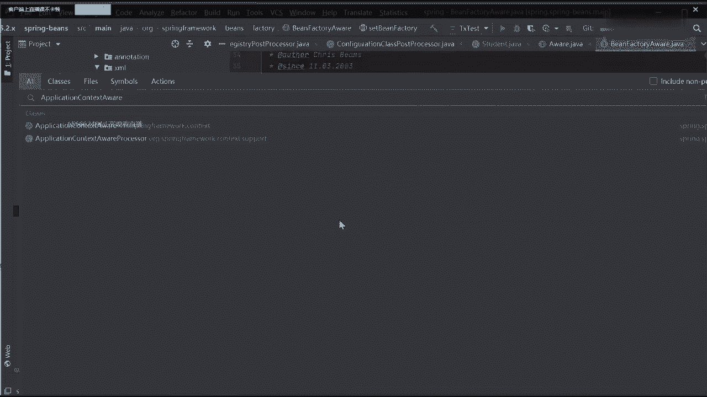

这接口它也实现了aware接口，它也叫set of ligation contest，是这玩意儿，那你想当我设置好这样一些东西之后，我有不一样，哪不一样，138哪不一样，0879同学哪不一样，一样吧。

那所以我在当前对象实现的时候，我可以写了，怎么写，我能这么做，实现并factory aware逗号实现application contest aware，看了吗，我实现两节课之后，方法都没让我重写。

这直接向上向上指向，向上指向，有了吗，有了吧，这玩意不用两个方法吗。

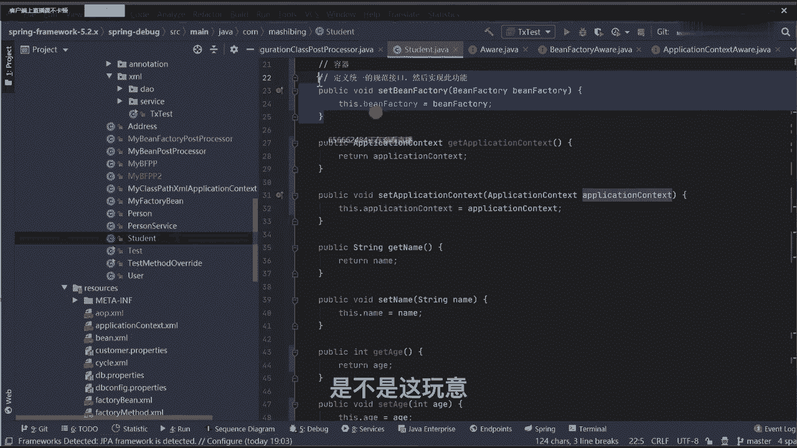

所以你告诉我我是干嘛的，刚刚说了一个东西叫属性赋值，没毛病，非常对，他就是叫属性赋值，但是他这个属性赋值赋值的是什么属性，什么属性，对象，能不能这么写，叫用户自定义属性赋值，能理解吗，这是第一个步骤。

容器自定义选项赋值，比如说我们的name，比如说我们的是不是这意思，第二个还有个东西叫容器对象是吧，是不是这意思好吧，所以这个步骤合起来都可以称之为什么，这是什么，不就是属性赋值吗。

只不过一个是用户自定义对象属性赋值，一个是程序对象的赋值吗，是不是这意思好，当然有人问了好多同学提出疑问，老师现在是不是都不需要where了，直接auto wear不就行了吗。

好加上艾特auto where也行啊，对没问题，你可以加at auto word，但是如果人就是用插画文件写的呢，你用注解没问题，注解可以填写这件事情，你加一个at oware，如果我不用注解呢。

我可以不用注解吗，我不背怎么办，听到了吗，他是一个标准流程，他不可能预估到说用户他会用什么样的方式，所以我只能说我尽可能的把我所有存在的，可以做的事情，我都帮你去做，就这么简单，你在帮帮不了你了。

我没办法，但我能想到的东西我一定帮你想到这个意思吗，来这块听班同学，到时候扣一能听懂吗，所以偶尔你还能理解吗，能理解吗，好吧，刚刚有人问啊，这是什么软件，这个软件名字叫枫叶云笔记，然后他叫笔记。

你们可以下载好吧，你们可以下载看，容器对象赋值指的是啥，就是指的我们spring整个容器里面，整个容器里面它需要的这些对象，比如说我刚刚写的bean factory。

比如写的application contest，再比如说environment，再比如说resource，loader对吧，这东西全部都是容器，帮我们创建好对象，那这个时候如果我想用的话。

我只能这么干了，我只能通过外接口来实现了，明白意思吧，哦process on，不香了，不是不香了，是那个有九张图片的限制，所以我们不用了，好吧，这个vi接口是空的，有啥用，不就是起一个标识作用吗。

你synchronized也是空的，你怎么实现功能的，是不是这意思好吧，理解同学下去之后，自己好好感受一下，好好悟一下，哪不清楚的话再来问我行吗，来我们这儿画一道横道好，当我们到这个步骤之后。

同学们想一下我完成什么事，听好听好，我的思路好吧，同学们，当我们创建完对象了，我也把对象里面的属性，我几乎都已经复制完成了，我这写个东西啊，我把它对应的那个方法给你们写出来，这个步骤放下。

什么叫create be，这个方法的名字好吧，这个步骤它也有对应的一个方法，怎么显示不出来了，他们叫什么叫populate，B，啊下面这个步骤叫invoke aware methods，好。

它对应每一个步骤里面的方法名称，我给你写出来行吧，来到这个步骤，当你到这个步骤之后，循环依赖明天讲好吧，循环依赖明天讲，大家思考这件事情，当我把这个环节我也做完了之后，下面你在想我该干嘛了，我问一下。

当我到这个步骤，我做完之后，我现在是否获取到了一个完整的并对象，是否获取到一个完整的bean对象，获取到了吗，如果按照我们正常的一个创建对象的逻辑的话，我现在已经实例化完了，我也把属性复制复好了。

那这个对象我是不是应该可以拿过来用了，正常情况我们先不考spring好吧，我们先不考虑spring，就我们如果自己创建一个对象的话，第一步先创建对象，第二步属性赋值，赋完值之后。

我是不是已经拿到一个正常的对象了，这没问题吧，就我们不考虑spring的东西啊，但是在spring里面他还没完，他需要做一堆的增强实现，所以下面做的所有事情都属于什么，都属于并等扩展。

实现了都属于B的扩展，实现什么样的扩展实现，比如说当你这个步骤执行完成之后，下面紧跟着会导入到会进入到一个环节，叫执行前置处理方法好吧，下面还有个东西叫执行后置处理方法，当然很多同学可能不太理解。

这个前置和后置到底代表了什么意思。

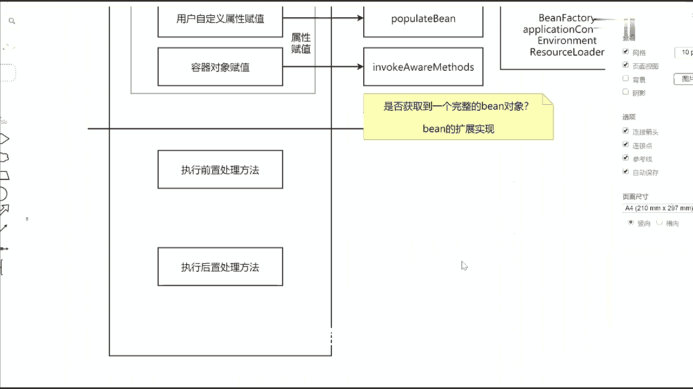

很简单，我带你们看代码，打开一个东西叫bean post processor。

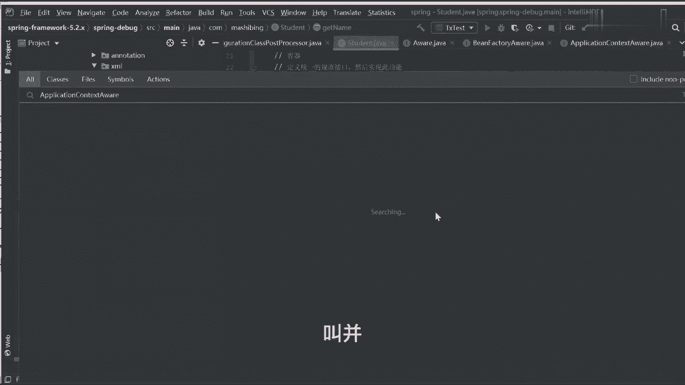

终于找到这个接口了，当你打开这个接口之后，你发现了它是不是也是个post processor，是什么增强器吧，它也是个增强器，只不过当前这个增强器它针对的对象是谁，ban吧，是不是ban，所以往下走。

在这里面有两个方法，一个叫post process before an insulation，下面这个东西叫post process after insulation，我问一下后面的单词什么意思。

什么意思叫初始化前置和初始化后置。

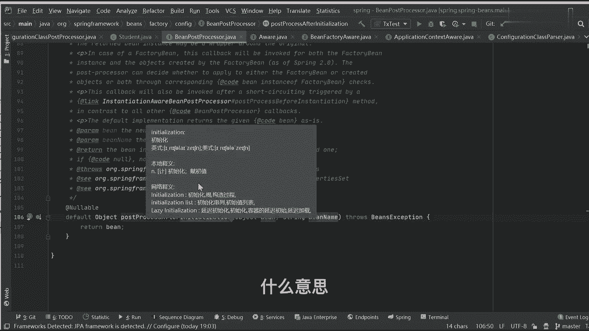

那意味着在中间这个环节里面，它必然包含了一个叫初始化的步骤，有点懵逼了，老师你这个大框不就是初始化吗，怎么这还有个初始化，这个初始化跟那个初始化不是同一个东西，一会儿我来解释他们到底是什么样的。

一个逻辑关系，但我们通过方法我们能判断出来这样的东西，而我们这儿说的前置也好，而说的后置也好，它们全部都归属于谁东西，什么东西，归属于啥，是不是叫bean post processor，是不是。

那么有人就会问了，老师这个being post processor，它有什么用处啊，它有什么意义啊，它存在的价值是什么呀，啊很简单，我为什么不上来直接讲AOP，为什么要讲IOC，记住我这说的一句话。

这句话给你写出来，AOP是，I o c，的一个扩展实现，这句话我不知道有多少同学能理解，但是我希望你把这句话给我记住，这句话很重要，其实我们可以来做这样一个判断，怎么判断，先问a OP。

它实现的原理是什么，ABCD是啥，叫动态代理吧，动态代理两种实现方式分别是什么，JDK好吧，或者cg lib这问题吧，这应该属于一个最最最基本的基础知识了好吧，那我现在我已经获取到一个原始对象了。

并对象已经有了对吧，当我有了一个并对项之后，我现在想设置它的代理代理对象，我是不是要把当前对象作为其中的一个引用，给它传递进去，让它来生成我们整个具体的代理对象了。

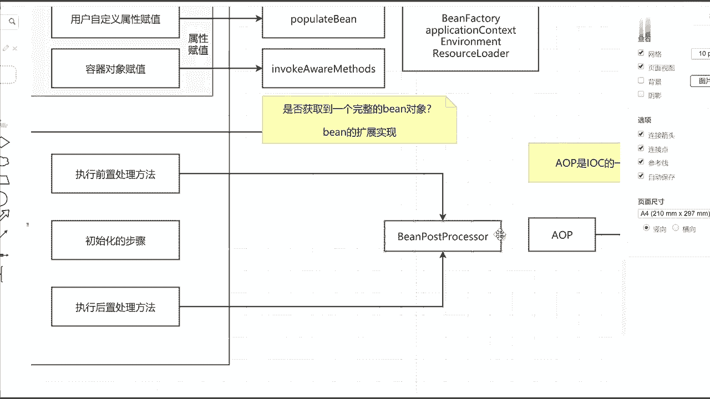

所以这个时候你如果想判断的话怎么办，找到我们的顶post processor，然后点开里面的实现类，其实你一看，你就能知道哪个是用来生成具体的代理项目，哪个是看类的名字好吧，哪个是第三个。

有没有说第二个的，其实不管第二个还是三个，最终都会找到第三个，当找到第三个之后，我们可以点开这里面的方法，找到我们那个bean post processor里面两个对应的方法。

第一个叫post process before initialization，是这方法点开来告诉我这里面有做任何实践吗，或者说有做任何的额外处理工作吗，有没有做没有，就一个return ban。

把变速箱原封不动的返回去，如果这里面不错的话，我们要看谁了，要看你点开之后，你发现了它里面是有处理逻辑的，在这里面你找一个方法叫Viper if necessary，但如果需要的话。

我就去进行一个包装好吧，你点开这个Viper if necessary，点进去，点了之后往下拉，拉拉拉拉这块来告诉我这个话名字叫什么，创建代理吧，好吧，来再点进去往下翻，最后一行叫propose。

Favorget，Propose，工厂模式，通过代理工厂来创建出来我们的代理对象，所以我还要再接着往里边点，点完之后告诉你了，我要创建a OP的代理了，然后获取我们的代理对象，再点进去，点击之后。

你突然发现了它是一个接口里面的方法，那我一定要找谁找具体的子类实现了，所以我可以点一下子类实现来，你告诉我你看到了什么，什么熟吗，这俩你熟吗，熟不熟，很熟了吧，不就是我通过我的条件判断。

选择一种代理模式来进行对象的代理吗。

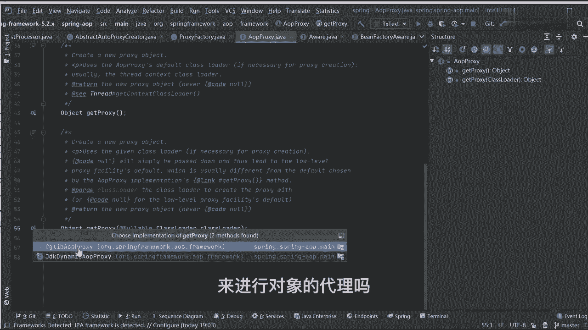

所以你想一件事，我们的a OP是不是在中间的某一个环节里面。

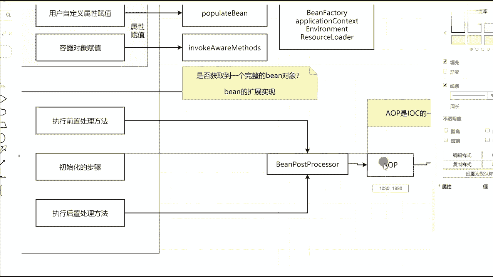

去做这样一件事。