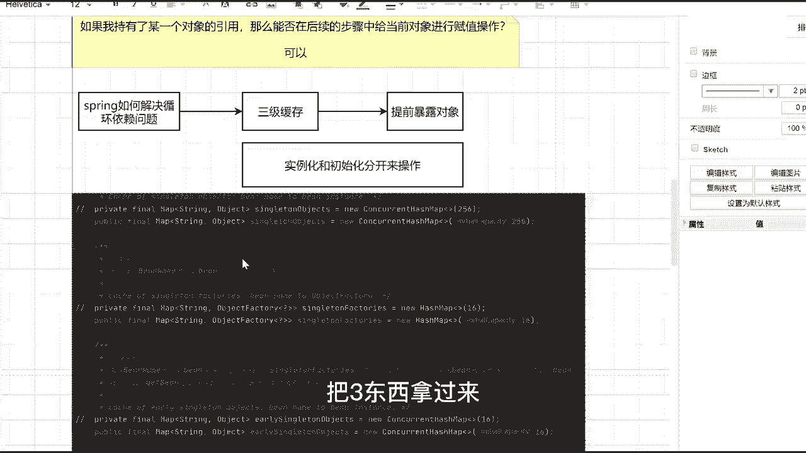

# 马士兵教育MCA4.0架构师课程 - P50：50、循环依赖问题 - 马士兵学堂 - BV1E34y1w773

来先说明一下到底什么叫做循环依赖，这东西啊也比较简单，什么叫循环依赖啊，我们都知道在spring中，对象的创建是交给容器框架来执行的，那么ban是默认是单例的还是圆形的，单例吧。

也就是说在整个容器框架里面，对象有且仅有一个，那么这个时候就可能会存在一种情况，我这里面有一个对象是AA对，象里面呢有一个B属性对吧，同时我还有一个B对象，当我在进行这两个对象赋值的时候。

就会产生循环依赖问题，那到底是如何产生的呢，其实也非常简单，你想吧，现在我的容器里面有两个对象，不管先创建A还是先创建B，总之我是要先创建一个对象的，我们可以举一个假设，假设我先创建的是A对象。

如果我先创建A对象的话，你想吧先进行A对象的实例化，当实例化完成之后，我要给A对象里面的B属性进行赋值操作了，那我问一下我在赋值的时候，我有B对象吗，刚开始肯定没创建B对象，所以我开始创建B对象了。

当我创建完B对象之后，我要给B对象进行A属性赋值了，那么这个时候A是不是也没创建完成，所以它就变成了一个链式的结构，也就是说变成了一个闭环，当形成这个闭环的时候，它就形成了一套循环依赖。

也就是说我们循环引用这个过程，这个时候程序就会报错，告诉我们说程序继续执行下去了，我们要想办法让程序能执行下去啊，这是我们循环依赖，最直接或者最简单的一个例子，当然有人说老师如果是三个对象，四个对象。

五个对象呢，不管你有多少对象，整体的逻辑都是这个样子的，所以这点大家没必要有任何的一个疑惑，然后呢，今天的课程是跟昨天的课程相关联的，我昨天在讲spring的IOC的时候，我就说了。

ban的生命周期里面，包含了N多个环节和N多个步骤，那我问一下，在那些环节和步骤里面最主要的是什么，是不是两个字，是不是有两个名词，第二个名词叫做实例化，第二个名词叫做初始化吧。

所以我们完全可以以一种画图的方式，来模拟一下，这个循环依赖问题到底是如何产生的，这个图只是一个最基本的简略图，它不足以表达我们在实际情况里面，要存在的情况，那怎么来创建这件事情啊，很简单。

第一件事我说了，比如说先创建就创建创建A对象，这没问题吧，当我创建A对象的时候，同学们，你想下一步该干嘛了，如果你想创建A，必然是涉及到一个实例化的过程，所以紧跟着后面一个步骤是啥啥东西，你们来说好吧。

不要让我来说啥玩意儿，啊实例化吧，你说实例化A对象，当实例化完成之后，我想问的是，此时里面的B属性等于什么，那么肯定是默认值嘛，刚开始等于是空的，然后当这步完成之后，紧跟着下一步我要做一个操作叫初始化。

A对象，那说白了什么叫初始化对象，不就是给B属性，赋值吗，是不是逻辑给B属性赋值，而在赋值的时候，我们都知道容器里面对象默认是单例的，所以为了查，为了得到我们的B对象，那你告诉我下一个步骤我应该干嘛。

是不是紧跟着应该是去叫从容器中打的，是不是从容器中查找B对象吧，是不是查找比对象，我要找到吗，如果这既然是查找了，意味着一定涉及到两个结果，第一个找到了，第二个没找到，我们先说如果找到了找到。

抓到之后怎么办，是不是直接赋值即可对吧，他直接给我们当前这个对象赋值连过来结束了，那很多情况下是什么，是没找到吧，所以这有一个问题就是没找到，如果没找到怎么办，我是不是该创建B对象了，一定要创建吧。

你不创建的话，这个步骤是没法做的，所以该创建B对象了，这在这能理解的来，能跟上的，给老师扣个一，能跟上不，这没问题吧，最基本的一个环节，然后下面当创建B对象之后，跟刚刚的流程是一模一样的。

这步骤叫实例化，实例化，B对象对吧，然后呢，此时A等于空，那下面再次做这个操作的时候，紧跟着后面就开始叫初始化，B对象说白了就是给A属性赋值，那同样的当我在给A属性赋值的时候。

我是不是一样要去容器里面查找，我们当前的A对象了，所以这一样拿过来容器中查找A对象，当我在进行查找的时候，也百分之百会需要一个东西，或者存在两个结果，要不然你找到了，要不然你没找到，就是两个来。

先说右边右边这块儿，如果我找到了，抓住怎么办，是不是说了就直接赋值即可，然后呢下面这连下来结束，那下面的呢如果没找到，我是不是又开始进行整个A对象的创建了，来这个流程或者这个过程能看懂吗，这没问题吧。

没对齐是吧，就这样吧，无所谓啊，这没问题吧，来你看一下，当前这个图里面还有没有一个闭环存在，一定有吧，从创建A对象开始到往后走，它形成了一个闭环，那我问一下，当前闭环存在的原因到底是因为什么。

谁能告诉我，那为什么存在这样一个闭环，在闭环形成的时候，中间必然包含了一个非常重要的核心步骤，就在于这块，如果这个地方，如果这个地方我找到A对象了，我是不是就不会有闭环了，或者换句话说。

如果我能把这个东西给阻断掉，它还有闭环吗，这就没有了，所以当它形成这样的一个闭环套路之后，我们就要去思考一件事了，思考什么事情，我能否把当前的闭环给它解开，不要让它变成一个圈。

因为你变成一个圈之后都很麻烦啊，他一直一直这样走，你又想我怎么做这件事情还是一样，注意你在找闭环的突破口的时候，先从哪开始找，从最后一个步骤形成闭环的这个步骤开始，从这开始这个环节明白意思吧。

这样大家一定要注意了，那我问一下，当我这儿开始查找A对象的时候，在刚刚整个创建流程里面，我的A对象到底有没有创建，有没有，听完这个问题啊，在这块我在查找的时候，我的A对象到底有没有创建，有说没有。

有说有创建了吗，这白字白纸黑字写的明明清清白白的，就是创建对象吧，我其实已经有一个A对象了，只不过当前这个A对象，不是我们传统意义上的A对象，啥意思，对象在创建过程中，它存在了两种状态，好亮状态。

怎样状态，第一种状态叫做完成实例化且完成初始化，这个时候我们给它一个名词，比如说叫成品对象问题吧，那一样的我可以再换一个叫完成实例化啊，但未完成初始化，我们把它称之为另一个名词叫半成品。

半成品对象这样东西能理解吗，看看这过程，这两个成品和半成品能理解的，扣个一就可以理解吧对吧，这就是说我在对象的时候，两个不同的状态到底是什么东西，那你想一件事，当我最后一步在形成这个闭环的时候。

我现在的A对象它属于成品还是属于半成品，什么叫半成品，半成品吧，对不对，半成品，那紧跟着就会有一个问题和一个步骤来，有一个问题等大家什么问题，如果我持有了某一个对象的引用，那么能否在后续的步骤中。

给当前对象进行赋值操作，能还是不能听完这个问题啊，这个问题才是最关键的核心点和最本质的东西，如果我持有了某一个对象的引用，那么我能否在后续的某一个步骤中，给当前对象进行复制操作，可以吧，你有了应用之后。

有了引用之后，我能知道他对象的地址，那我一定能够对它进行相关的一个复制操作，所以肯定是可以的，如果这个步骤可以的话，那我们就要去思考一件事情了，什么事情，这个步骤我要去查找A对象。

我虽然获取不到完整的A对象，但是我是能够获取到半成品的A对象了，这肯定没问题吧，所以是不是相当于我们可以把这个步骤给干掉，也就是说它是不存在的，不存在的话，也就意味着我们在刚刚上面整个查找的环节。

或者过程中，我要加一个东西，加什么，就是大家说的加缓存，这玩意儿好吧，加缓存这玩意儿怎么加呢，没有半成品啥意思，完成了实例化，但没有完成初始化吗，我昨天不是讲IOC的时候。

不把大家给大家讲了一下bean的生命周期吗，在bean的生命周期里面，是不是分了大概的分几个模块，实例化对吧，初始化，然后又分为使用中，然后属于销毁，是不是四个状态。

然后我们初始化里面又包含了很多个步骤，我们把这东西统一来说了，统一来说了好吧，同学描述了，所以这时候你想当，我还是沿着这条链路来走的时候，我实例化完A对象之后，我能不能把当前这个A对象。

把它放放到某一个空间里面去啊，举例子，我这儿放一个结构，放啥呢，放一个map结构，我把这个map称之为缓存，可以吧，每次当我存储完具体的一个对象之后，我创建了一个对象之后。

我先把当前的A对象放到缓存里面，那现在我的问题是，现在位移缓存对象里面的A它是什么状态，什么状态，半成品状态吧，记住啊，半成品状态记住它，然后往后面接着走，当我走到这个环节的时候。

叫初始化A对象里面的B属性，也就是说我给B属性要进行复制操作了，我一定从中心点查到B，查到B的时候，我能不能去当前的缓存里面找一下，可以吧，我从缓存里面找B的时候，你告诉我我能找到B对象吗，找不到吧。

因为他还没开始创建嘛，所以一定找不到，找不到，我再接着往下走，我开始创建B对象，当我的B对象创建完成之后好了，这叫实例化B对象吗，我能不能把我的B对象，也扔到当前的环境里面去，可以吧。

此时我的B对象它也是什么状态，叫半成品状态都是半成品，不管它都是半成品，然后我现在给B对象里面的A属性赋值，我这儿从容器里面找的时候，我能不能从当前缓存里面也找一份，这肯定没问题吧。

我在找这个A对象的时候，你告诉我这里面现在有没有A对象，有吧一定是有的，我是有一个对象，当我这有对象之后，是不是意味着我已经找到当前的A对象了，哪怕你现在的A对象，它就是一个半成品，也没关系。

我就是能找到它，我只能找到他，找到之后，我把刚刚的半成品对象我赋值给B属性，那我问一下啊，当我这个地方我找到我们的A对象了，当我这找到之后，现在我的B是什么状态，什状态B是不是已经变成一个成品了。

它依然是一个半成品，就相当于我持有了当前A对A对象的，什么引用吧，我在后面的时候我再给它完成赋值操作，是不是意思，所以现在B已经变成一个成品对象了，那我现在我B的成品要不要往缓存里面放，没问题啊。

要不要往管子里面放，不用啊，不要你后面怎么找啊，要吧，就意味着这会存在这样的东西，叫B冒号成品，是不是意思，这没问题吧，叫B叫成品，接过来，然后我这放进去之后，下面紧跟着回到这个环节里面。

现在如果我再去我们的容器里面，查找B对象的时候，我能不能找到B对象，先留着好吧，我们先写先留着，先写到这，先写到这，这能不能获取到，能吧好吧，那你想我这应该取的是B的半成品。

还是取的B的成品去办成那样的成品，你有成品了，我肯定取成品对象嘛对吧，所以这个时候我找到B的成品对象，当我找到之后，我给A里面的B属性来赋值操作，那我问一下，现在我们的A对象它属于什么，属于什么东西。

成品了吧，A也是成品了，对不对，所以我把A我也写进来，A，冒号成品，同学们，你想一件事，当刚刚这个流程我总体都完成之后，我有没有解决刚刚我所说的循环依赖问题，你先不考虑缓存里面这个半成品和成品的事。

好吧，解决了吗，是不是解决了，这就是spring中到底是如何解决循环依赖问题的，但这里面还有问题，因为我这边写的时候，现在刚刚在写的时候，同学们都发现问题了，老师当你形成了一个成品的A和B对象之后。

我不会对这玩意儿进行覆盖吗，为什么你这个缓存里面它既存在了ab的半成品，又存在了ab的成品对象，这很明显不太合适，是不是不太合适，那我怎么办，所以大家就要考虑一件事了，这个map到底是啥玩意儿。

而据我们刚刚这个流程，听明白的同学给老师扣个一，我看看，没问题吧，我把这个框一下换个色，来看一下，这流程我觉得听懂应该没问题吧，说听懂没问题好吧，只不过对于这个Mac这大家还有疑问，那么这还有疑问。

所以我们之前按照我不讲这节课之前，你们的理解怎么解决循环依赖问题的，Spring，如何解决循环依赖问题的，基本上所有看过帖子和面试中，被问到过题的同学都会搭一个东西叫三级缓存，当然还有同学会说一句话。

叫什么叫提前暴露对象，是不是意思就是说通过这样的方式来解决，这没问题吧，但是你注意了，其实它解决循环依赖的问题，最根本的点在于什么地方，在于一个东西，记住了，叫实例化和初始化分开来操作。

我们刚刚能划开这样的一张图，是因为我把实例化和初始化的步骤是分开了，正因为分开了，所以你才能完成这样一件事，那我问一下，有人见过spring的三级缓存到底是什么东西吗，或者到底长什么样子吗，有人见过吗。

三级缓存到底啥玩意，很多同学光在说三级缓存，三级缓存是哈希map还是看看哈，希map还是map。

来我带你们看一下好吧，在spring源码中有一个类。

我希望你能记住叫default呃，Singleton。

Being reject，在当前对象里面有三个缓存结构。

分别是这玩意儿。

我把这三样东西拿出来粘出来。

14段粘过来，我给你们放到这把三东西拿过来。

这就是spring里面的三级缓存，好吧，来解释一下三级缓存分别是啥东西，比如说第一个像这块singleton objects，它称之为叫一级缓存。

需要把字改一下颜色。

这么说的，一级缓存就这玩意儿好吧，同样的还有二级缓存是这东西，这叫二级缓存啊，那一样的，还有三级缓存，就是中间那块儿它叫做三级缓存，我希望同学们能明白一件事，这里面所说的一级也好，二级也好，三级也好。

是人为给它下的一个定义，他在他这个三个map定义的时候，并没有明确说明说那哪个是一级，哪个是二级，哪个是三级，这种人为给它加上这样一个东西，好吧，那这个时候我的问题就来了，同学们什么问题。

这三个缓存它们有什么样的区别，有区别不，来有区别吗，有吧什么区别，语文老师他们有的是contact hashmap，像一级和二级都是content hashmap，而三级变成了HASHMAP。

还有它们的容量是不一样的，上面是256，一级缓存，256，二级和三级是16，还有吗，除了value这些这些东西不一样之外，还有什么不一样，其实三个缓存里面最最最最大的一个区别，并不在于后面这块东西。

他只是为了控制线程是否安全的，最根本的点在于泛型，我希望你能够好好看一下这个泛型，一级缓存和二级缓存里面，我放的全部都是object类型的对象，就是一个对象吧。

但是我的三级缓存里面放了什么叫object factory，这个object factory到底是啥东西，你们知道吗，啥玩意儿，记住它叫做函数式接口，函数式接口不是工厂对象好吧，不要直译，不要直译。

千万不要直译好吧，它叫做函数式接口，你可以理解为它可以把什么，把匿名内部类和lambda表达式传递，进去当做参数，好我们来看一下。

找到一个对象，Object batter，上面写的东西叫functional interface，叫函数式接口，如果谁不了解什么叫函数式接口，同学好吧，下去之后好好看一下JDK1。8之后的新特性。

这属于一个新特性，其实也没有什么难理解的啊，就算函数接口，那它有哪些用途呢，就是我们可以传递一个匿名内部类，或者传递一个拉姆达表达式进去，相当于是一种函数式编程了，我问一下。

在原生的java jdk里面或者java里面，我能传一个函数当做参数吗，能不能不能吧，但是当你有了函数式接口之后，它可以定义一个函数式接口的参数类型，然后我可以把拉姆达式传进去，而我在进行调用的时候。

可以通过get object来进行相关的调用，就这意思，比如你写的函数接口，括号指向再写一个create d，假如你写这样一个方法，当写方法之后，它就变成一个函数接口，我传到三路里面去了。

当我在调get object方法的时候，实际上调的就是create bean这个方法啊，这属于一个最基本的一个应用。

好吧，如果谁这块不熟的话，你先去看一下。