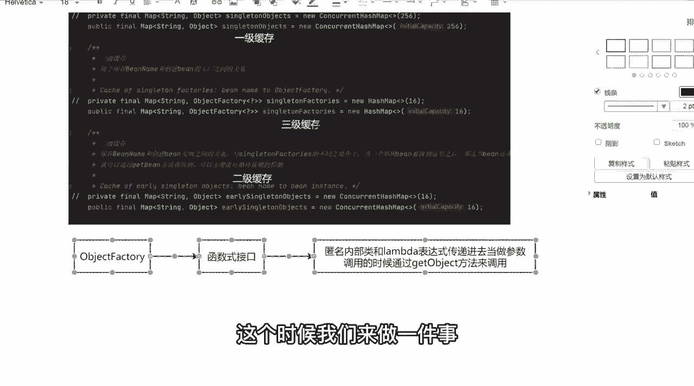
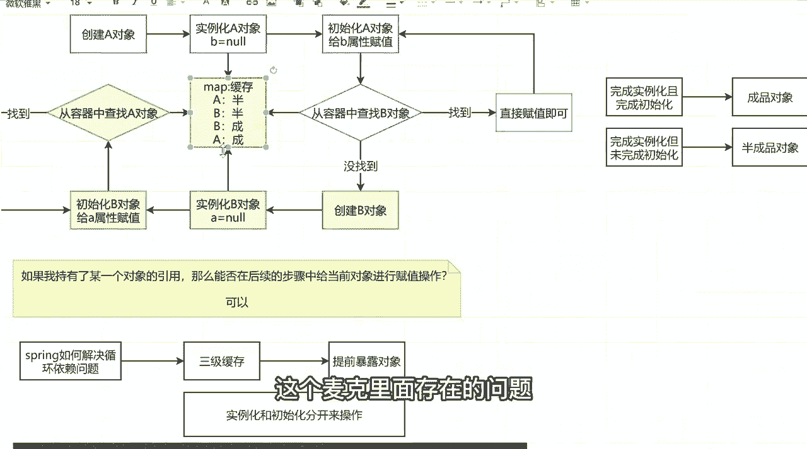
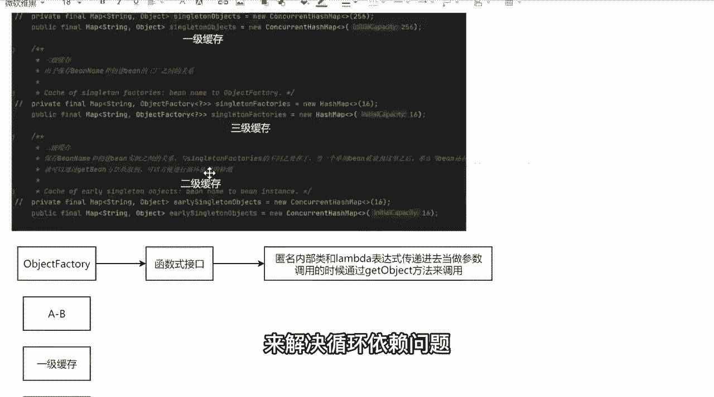

# 系列 5：P51：51、源码留心的6个方法 - 马士兵学堂 - BV1E34y1w773

好吧，调用的时候通过get object方法来调用，把这两句话我希望你能够记住了，我希望你能记住好吧，那光讲这东西，我觉得很多同学还是一脸懵逼的，我还是不知道他为什么使用这样一个东西。

它存在的意义到底是什么，或者说它到底有什么样的一个价值，那这个时候我们来做一件事。

做些什么事情，光说这些理论的东西，光说这个图，我觉得你们都理解了好，但是我们要看一下源码里面，它到底是如何来进行实际操作的，我可以往这个地方放一些东西，什么东西，这定义好叫一级缓存，下面叫二级缓存。

再往下叫三级缓存，我定义三个缓存对象，后面可以往三个缓存里面放东西，放对象啊，我们来完整的模拟一下什么，当A杠B存在循环引用的时候，它是如何往当前这些缓存对象里面设置，具体指导。

我们把整个流程来进行一个优化，可以吗，可以吧，我现在你把这个流程过一下，因为我不带你们这个这块东西啊，我还是希望能够带你们debug的源码，因为如果不接吧，呃不debug源码的话。

这东西会显得非常非常麻烦，单说理论没意义，所以我们还是按照这样一个流程来，但是有的同学可能会说，老师我之前自己从来没有debug源码，我deb源码的时候，我应该怎么debug，或者你debug太快的话。

我跟不上怎么办，注意我让你跟上，所以在讲这些东西之前，我需要让同学们能够记住几个异常重要的方法，原文里面的代码和步骤是非常非常多的，我也不会把每一行代码都给你行，详细进行一个讲解。

这都不是最主要和最关键的，所以我们只说非常重要和核心的方法，到底有哪些，我希望你能给我记住六个方法，记六个方法能记住吗，同学们记这个方法能记住吧，我这应该没问题，好吧，我先写一下，你好好记一下。

第一个叫get be，他后面第二个叫do get be，它后面叫做create be，看后面，叫做do create，并再往下走，叫create bean instance，然后下面再来一个。

Populate be，一共就这六个方法，我觉得这个方法大家不可能记不住，也不应该记不住，也就是说你在看原版的时候，只需要留心这几个环节就可以了，别的东西我们都可以跳过，这没问题吧，就这东西。

然后我还需要再给大家提个醒，在原版过程中，在debug，过程中会出现套娃操作，所以每一个步骤必须明确到底，在干什么事，没问题吧，原版里面有很多套娃操作，或者有很多递归的操作。

很多同学其实蒙就蒙在递归上面了，你发现刚调完一个方法诶，又重新调用了，诶，又重新调用了，很麻烦，所以我把这些提前东西我都给你预先准备好，没问题吧，我们先来走这样的一个流程，当我走完这些流程之后。

我们再来解决这一块，这个map里面存在的问题。

就是源码里面，它到底为什么要使用三级缓存，来解决循环依赖问题。

好吧。