# 马士兵教育MCA4.0架构师课程 - P52：52、a到b循环到缓存优化源码讲解 - 马士兵学堂 - BV1E34y1w773

来啊看好了，我这定义了一个A对象，我把这个name都干掉，不要name了，可以吧，大家看到了，在A对象里面有一个B属性，没毛病吧，有set方法，有get方法，然后这我定义了一个B对象。

B对象里面同样有一个A属性，这把它干掉，不要它，这没问题吧，也就是说A现在里面有B了，B现在里面有A了，是不是这个过程，这是我基本定义的两个基本对象，当我定义好之后，我这用的是配置文件的方式。

因为我觉得配置文件的方式它更加好理解一点，所以打开我们配置文件，你可以看一下这个过程怎么做的，现在我定义了一个B对象，它是A的，然后看呃SQLA里面有一个属性，一个BREFB，还有一个B对象。

也是B对象，引用了refer a，Refer a，你告诉我这样的代码在进行debug过程中，它到底是否会出现循环依赖问题，知识代码会出现循环依赖问题吗，哎会不会啊，肯定会的吧，如果不会的话。

我们一会来测试一下好吧，来点个菜test，我这直接运行run啊，错了不行，用这个啊，上面这找到我们的circular test，来这个get name表，右击我先run一下吧，先跑一下。

大家先看一下这个问题好吧，我错了，我这每次都要编译源码，所以这个过程是比较慢的，你们如果不是编译源码的话，这个过程不会这么慢，直接引用炸包的话是非常快的，来看看这个过程。

很多刚刚说是会出现这样的问题的对吧，我们运行完之后，你发现了B对象我也打印出来了，A对象我也打印出来了，它并没有出现循环依赖问题，而为什么又出现，原因点在于我们spring中内置的三级缓存。

它帮我们解决这个问题，所以下一步我要看一下它到底是如何解决的，到底如何解决的，所以我们从debug开始看，我说过了，在debug的时候，这个过程是比较麻烦的，但是我直接带你们找到创建对象。

是从哪一个步骤开始的，好吧，还记得昨天我讲课的时候，我说了一个非常重要的方法，还有人记得叫什么名字吗，我说了一个非常非常重要的方法，还有人记得叫什么名字吗，Flash，这叫flash吗。

REFLESH吧，REFLESH好吧，Reflesh，所以这进来进来之后，先点F7跳过，这是一个static，是一个防止这个呃，WEBLOGIC8。1版本之后的一个小bug的东西，超过它，不管它是什么。

好吧，再点F7进来，尽量做到方法里面再点MC进来，这有一个REFLESH方法，我们进去进去之后，这里面包含了13个非常重要的步骤，这些步骤你都可以跳过，但是到这行的时候，我希望你能停一下。

叫finish be factory initialization，你翻译一下这句话，它上面的解释是什么意思，叫什么，这是什么意思，实例化吧，实例化所有剩下的非懒加载的单例对象。

就说在这个步骤里面我才开始进行实例化操作，所以我直接跳过这个步骤里面，别的东西都跳过来，点超过啊，直到变行到变量之后，为了验证一下。

我们可以打开当前的bean factory来看一眼in factory，找到我们刚刚说的一级缓存，二级缓存和三级缓存，来找一下那个叫什么来着，一级缓存叫singleton object吧。

你可以找一下啊，看着，在这个一级缓存里面，它有AB对象吗，现在有没有AB对象，一级缓存里面没有吧，没有，再往下看，这是二级缓存，有东西吗，没有这三级缓存有东西吗，也没有，所以从这个步骤开始。

我们才开始正儿八经进行实例化的关键步骤，从这开始，我们点FC进去，进去之后，上面都是一些对象属性值的设置工作，你可以直接跳过，不管它好吧，再往下进行，进到对面，从这开始，重要点来了，我问一下。

在当前整个应用程序里面，我需要创建几个对象，几个告诉我两个吧，就俩一个A1个B，所以我刚开始我先获取一个东西，叫this点bedefinition names，昨天我带你看过这个属性了。

除了这个属性之外，还有个叫什么叫病戴芬尼森MATT吧，里面放的就是我们要创建的bean，对象的一些BD信息，那这里面肯定有两个吧，所以你打开这个NES之后往下走走一步，你会看到当前这个集合里面有两个值。

一个A1个BA和B谁先创建谁后创建，无所谓好吧，爱谁先谁先爱谁厚谁厚，没关系的，在下面我要开始循环取了，刚刚例子里面看到了是AB开头的，所以一定是先创建A对象吧，是不是一定要先看对象。

所以从这开始完之后，第一个我获取到的病名称是A，比如说从这个步骤开始，我要创建A对象了啊，中间有一系列的判断步骤，第一步获取一下我们的bean definition，好吧，中间有一系列的判断。

我们都管不管它，但最终我需要找到一个东西，啥玩意儿，这个方法，能看到吗，这放干嘛的，我刚刚有没有在你说这个有没有说这个东西啊。

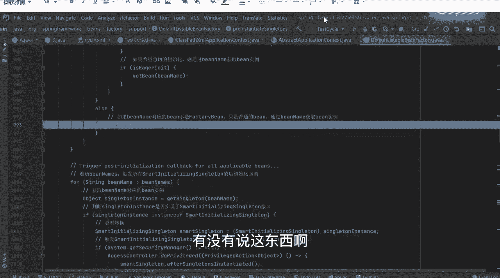

它叫做get be，还记得第一个方法吗。

是不是get in，你告诉我这get in是干嘛的，注意了，当你在创建对象的时候，我每次都要去我们当前的容器里面，判断一下我之前到底有没有创建过对象，所以我会先获取一下B根据A去创建并对象，那很明显。

你告诉我我之前有创建过吗，没有吧，所以紧跟着听到一个方法叫do get in，这是我说的第二个方法，Do get in，再点FC进去，进来之后转换一下名称，不管它来往，这看叫get singleton。

你通过名字方法你能猜到什么叫get singleton，叫获取单例对象吧，那很明显我刚刚说过了，我说现在有A的单例对象吗，有A的单对象吗，没有有啊，1800821有吗。

你程序运行到现在有创建对象这个环节吗，没有没有，所以这个值取出来之后，它一定是等于空的，等于none，等于NN了，怎么办，我是不是该去创建对象了对吧，我该创建对象了，因为没有对象，我肯定要创建嘛。

你不创建，你后面怎么用呢，所以往下走，下面有一堆的条件判断，我们直接跳过，不看这些步骤了好吧，唯一拿走走到一个步骤里面，走到这一行，说MBDESLETON，说，我们当前的A对象是否是一个单例的。

默认单例吗，我没做任何配置，默认就是单例的，进来之后叫get singleton，好了，你看到了第一个方法叫get singleton。

这个get singleton跟上面这个get singleton，它方法名字是一样的，但是传递的参数不一样，第一个里面只需要传一个冰name就可以了，而第二个里面我除了传一个冰name之外。

我还传了一个什么玩意儿，看这段代码是什么鬼。

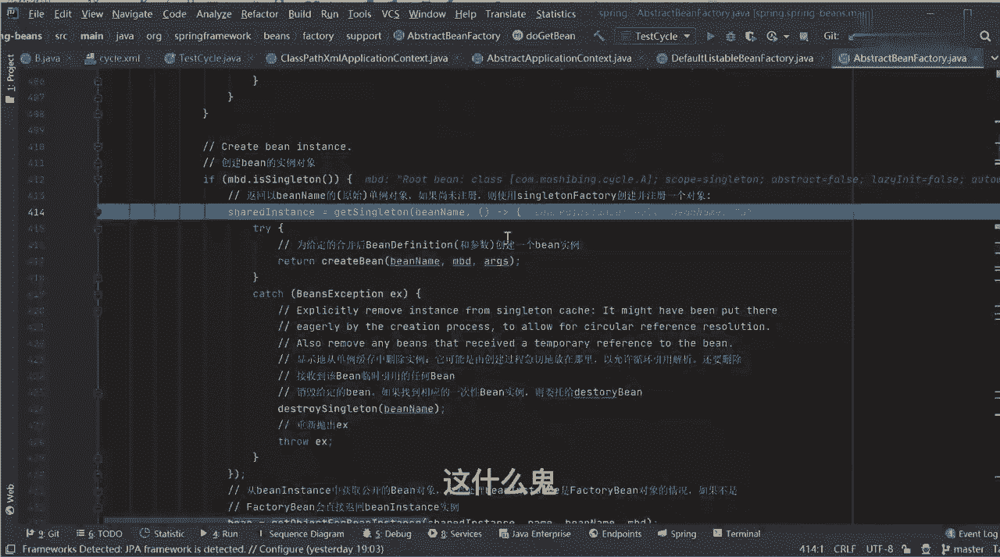

是不是相当于我传了一个拉姆的表达式，把它拿出来，站出来，我把中间那些注释都干掉，不要浪费空间干掉，是不是这样东西，这里面其实就指向了一个东西，叫create be CD变吧，就调用这个方法。

我问一下，当我们在进行具体调用的时候，现在我一进到或者我一调用get sn方法的时候，这里面的东西会被调用执行吗，就这个la表达式它会被调用和执行吗，会不会，不会吧，不会调用执行的，我说过了。

他什么时候掉，在执行get object方法的时候才会掉，所以它只是当成一个参数，传递到了get singleton这个方法里面去，所以我点FC进去，进来之后，第一个断言，第二个加锁，不管它往下走。

往下走来往下走走走走，一堆的判断逻辑好吧，当我走完之后，走到下面这行，你看这块了吗，叫singleton factory，什么叫singleton factory呀，往上翻。

singleton factory指的是啥，你告诉我这个singleton factory指的是什么，啥东西，lambda表达式吧，前面拉姆表达式对不对，也告诉你类型是什么。

是object factory类型，所以当我这个地方我在调用get object的时候，你告诉我我实际执行的是什么方法，是一个什么叫做create bean吧。

所以点F7我进去到create ban了吧，所以这是我给你们说的第三个方法叫create bean，再点F7进去，记住这上面一堆的赋值和其他操作，不管它好，不再往下走走走，走到这一行，你看到了什么。

方法名称叫do create定吧，是不do create变明白意思吗，这是我需要给大家提个醒，同学们注意了，在整个源码过程中，研发过程中有很多方法名称前面是带着do的，当你看到do开头的方法的时候。

我希望你能够给自己提个醒儿，为什么，因为带do的方法才是实际干活的方法，明白吗，就说我们实际真正的处理逻辑，数理逻辑都是在do开发方案里面执行的，你想一件事，这涉及到杜奎的病呢，你下一步是干嘛了。

我是不是该真的去创建对象了，对不对，真出对象好吧，所以我再点F7进到这个逻辑处理里面去，点FC进来，进来之后，这有一个ban Viper，昨天你说过这Viper是一个包装类，无所谓好吧。

你可以把这个ban Viper直接等同于我们的对象，往下走，往下走，往下走，到这个步骤是啥玩意来着，还记得不叫create bean instance，什么东西。

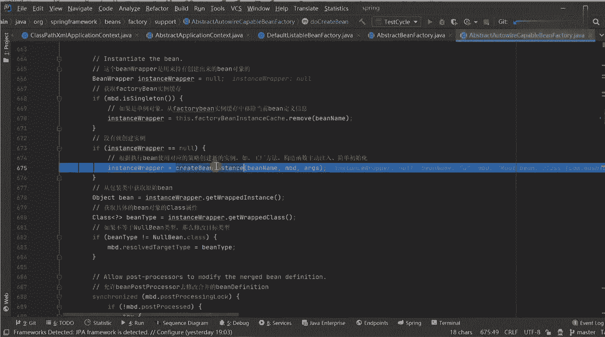

我跟你说第五第五个方法吧，叫create bean instance，你少一个S，是不是东西他要干嘛的。

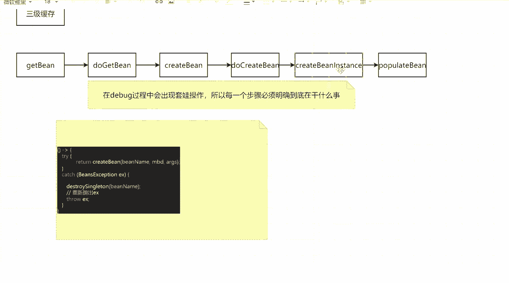

这不是干嘛的，它是用来进行具体的实例化操作的，我带你们看一遍好吧，里面干什么事，其实我问一下，我们都知道对象里面的呃，容器里面的对象，都是通过反射的方式来进行操作的。

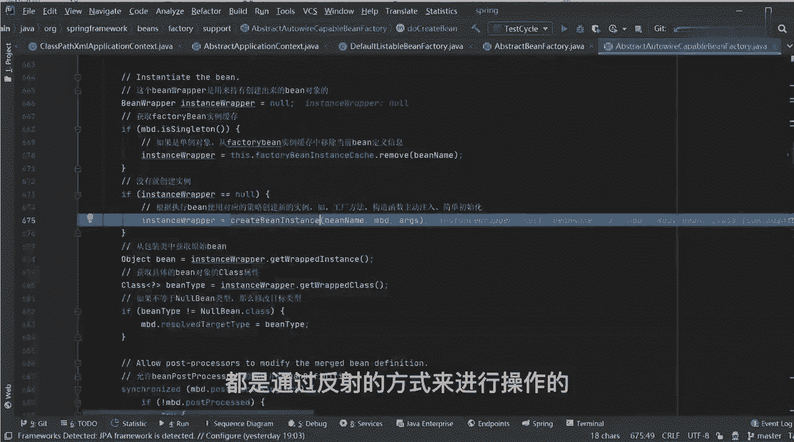

我问一下反射代码，大家还记得吗，我们写一下好吧，第一步骤获取class大写C，获取class对象吧，啥玩意，第一步是不是有对象，当我获取对象，第二步在干嘛，是不是叫construct c t o r。

等于class点，Get declare the construction，什么意思，是不是要获根据我们当前的卡class对象，来获取到我具体的构造器了，当我获取到构造器之后，第三个步骤在干嘛。

是不是叫object o b j等于CTOR点new instance吧，我是不是通过这个步骤能创建出来，我们具体对象，这没问题吗，这个问题没，这个视频是录播吗，是的，这个反射我觉得应该会啊。

我觉得过分了，说明你的基础真的掌握的有问题，所以这个机器人的反射东西你要了解，所以我们在看那个critical instance的时候。

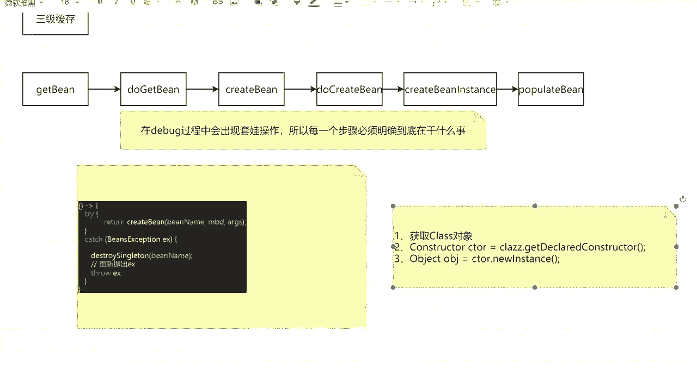

我也要去找到具体的逻逻实现逻辑怎么找，点F7进去，当然里面啊依然有一堆东西很多好吧，我们只看到往下走走走走走，跳过跳过跳过一堆好吧，跳过不看它，不看它走走走在外走。

走到这行叫instance bedmc，进去进来之后往下走，到我们的实例化环节好吧，往下走走走走走走走，来看这行代码告诉我什么意思，看这行代码什么意思。

class点get declared constructor，不就是获取到我们对应的构造器吗，当我有了构造器之后，我是不是该用构造器来创建创建对象了，往下走走走，走到这一行，再点FC进去。

进来之后上面一堆判断跳过去，不管它不管它，不管它，到最后一步叫CTOR点new instance，你告诉我，我是不是通过反射的方式来创建出具体对象了，是还是不是，没问题吧，所以这个步骤里面干什么事。

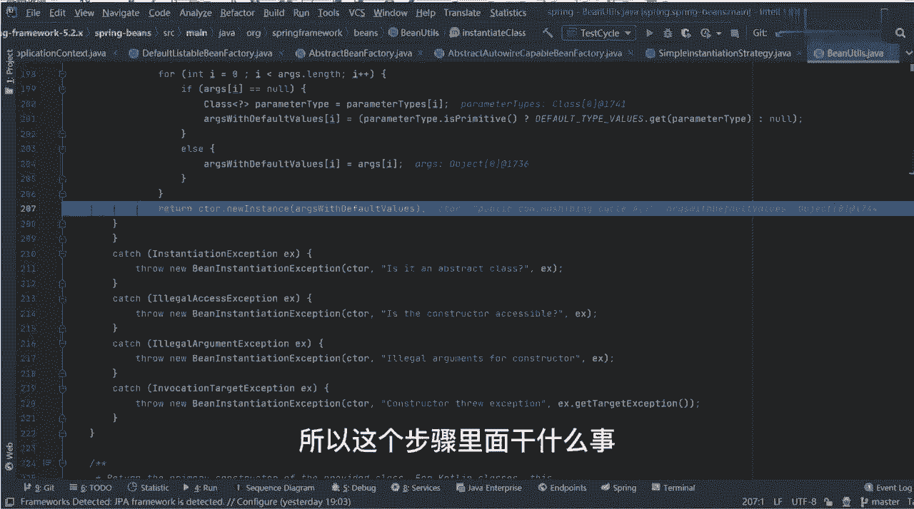

就是通过反射创建对象，就这么简单，没别的意思。

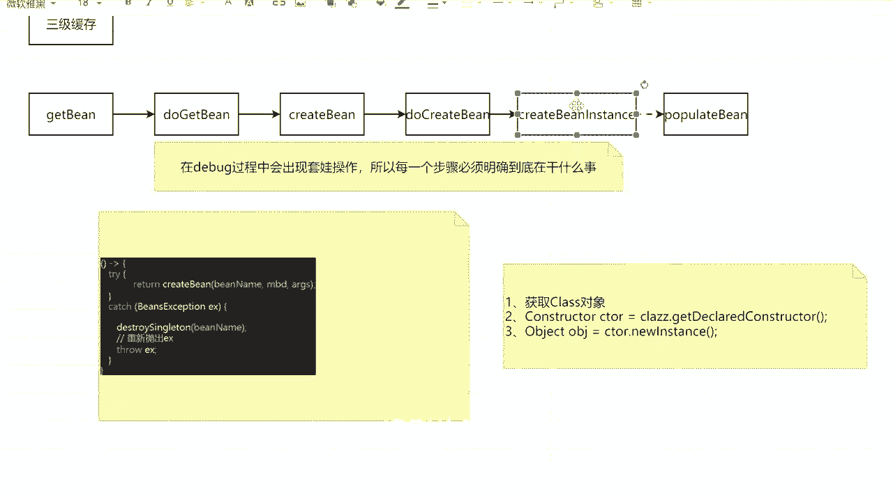

没别的意思好吧，就这块处理的逻辑，我来我们返回去啊，返回去返回去返回去返回去返回去返回去之后。

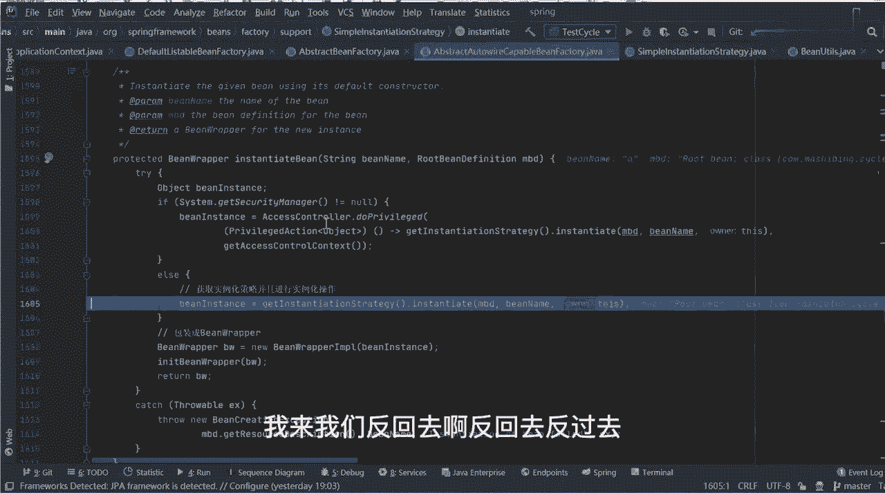

我们来看一下这个病对象，现在我的病对象已经有了，这是有个A是不是有对象叫a at1573吧。

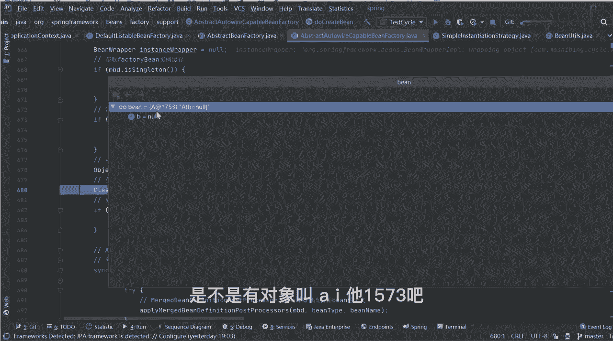

我们这儿记录一下，记住对象叫a at1573，我的问题是同学们现在B属性有值吗，B水有没有值，没有吧，B等于公记录下来对吧，现在我这玩意儿，我有往任何的1233个缓存里面放东西吗，我没往缓存里放啊。

我只是做了一个记录，表示说他是A对象了，但是我还没往我们的三级缓存里面扔东西呢。

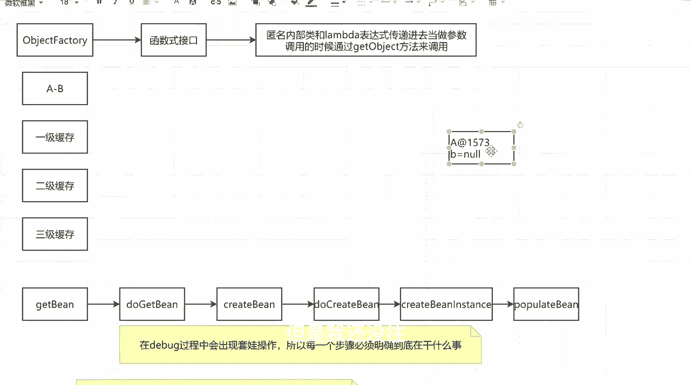

一点都没扔，所以接着往下走，往下走好吧，抑制买家进行相关的一个处理吧，按道理说我第一步对象有了，下一步该进行实例化了，但是恰巧不巧的是什么，在整个实例化环节的时候，这里面有这样的一个判断逻辑。

有这样一行代码，这行代码其实就是三级缓存最主要的点，因为你往上看，这儿有个东西好，Early catch singletons to be able resolve cooler reference。

说这个东西能够解决我们的循环依赖问题，这源码里面写的注释，就这行代码它会变得很重要，来看这行代码，第一个参数是b name，问一下现在的b name是谁，A吧B是A没有B的事，还没到B呢，好吧。

就是A就是A后面这又是个啥东西啊，啥东西又一个lb表示好了。

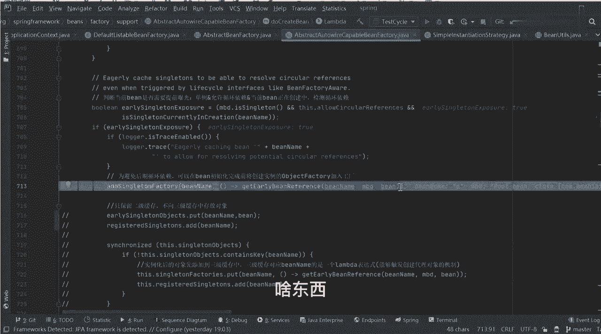

我把这浪表达式拿出来，所以这里面啊拉达是比较多，它有它非常重要的核心作用，我把它写了下来。

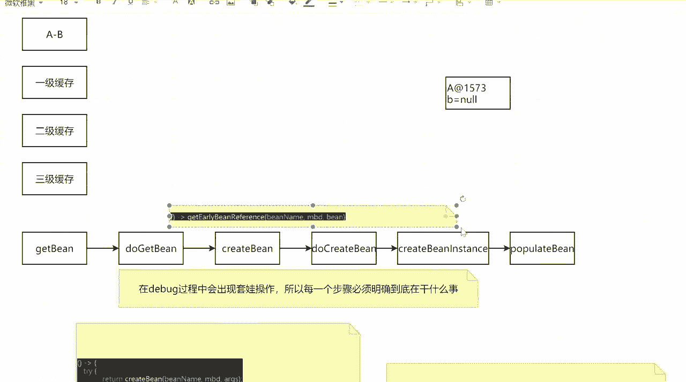

我要放这块儿啊，做一个标记，这张表示，所以同学们想一下，当我开始执行的时候，它会直接掉档表示吗，不会我们看一下这个adsingleton factory干什么事好吧，点F7进去下来之后往下走走走来。

第一个步骤干什么事，第一个步骤，干什么事，告诉我，叫this singleton factories，点put b name，加singleton factory，把谁放到三级缓存了。

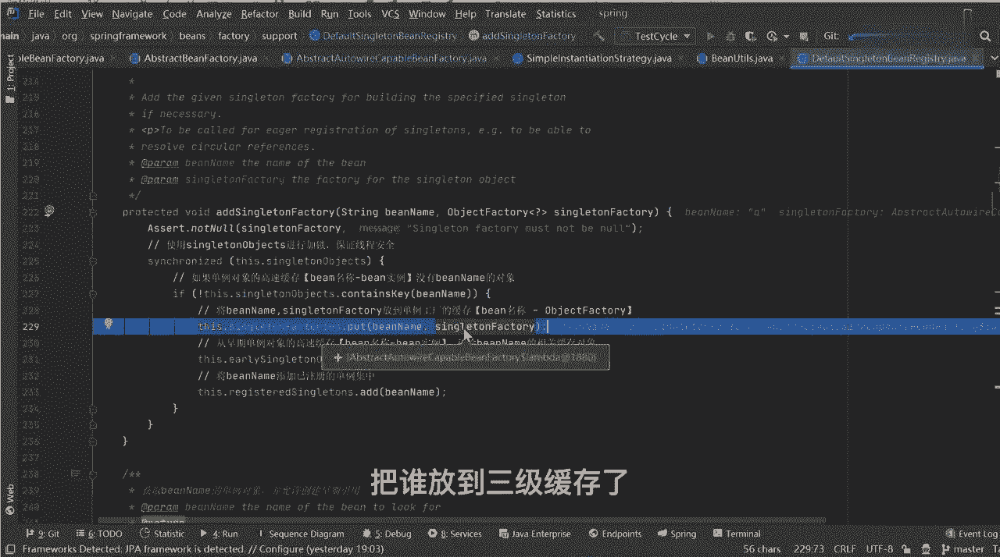

来key等于什么，等于A吧，value等于什么东西，value是A对象吗，不是啊，value放的是谁，放的是拉姆的表达式，value放的是拉姆达表达式，它不是半成品，也不是成品。

不管是我们的成品还是半成品，没往三级缓存里放吧。

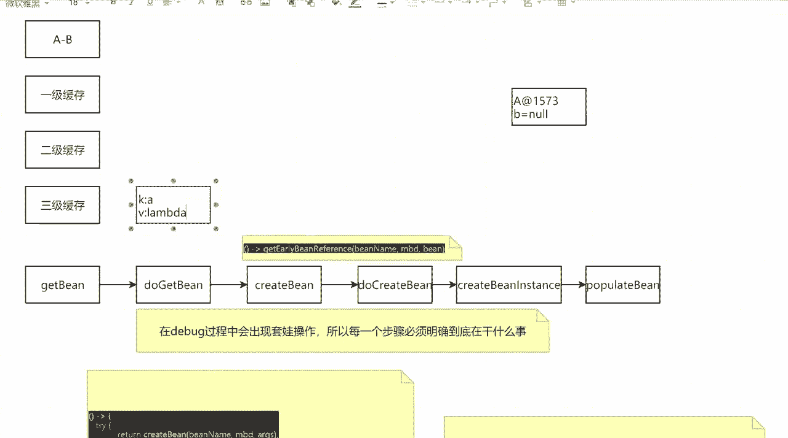

我三级缓存里面放了什么东西，C功能factory sfc是谁，这个参数参数是谁，拉表达式是不是这个意思，所以这我只需要放拉表达是不是可以了。

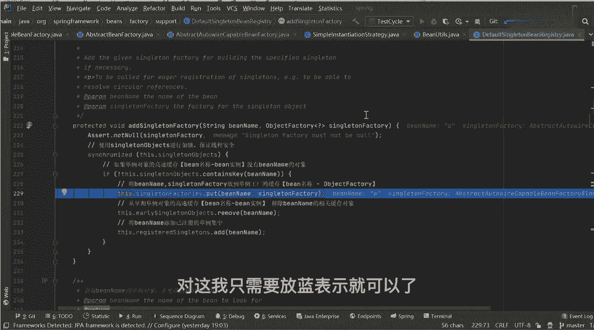

没问题吧，来这个步骤没问题的，扣一，一定要跟上好吧，这些核心步骤一定要跟上。

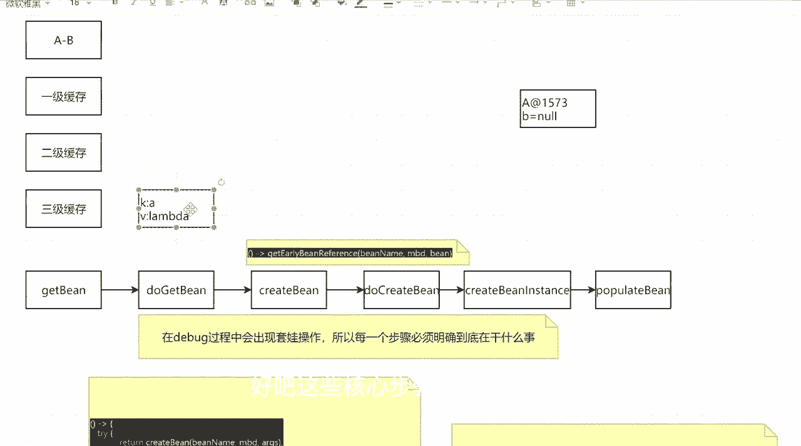

这放到三级缓存区，放到三级缓存之后好了，往下走叫early signal remove，把二级缓存给移除掉，二级缓存本来没东西嘛，也不需要移除好吧，再往下走叫register singletons。

我们这没关系，它不属于三级缓存，所以跳过去不管好了，也就是说刚刚这个步骤里面就干了一件事，把我们的拉姆达式扔到三级缓存里面去了，当我扔完之后，同学们，你告诉我紧跟着下一个步骤该干嘛了。

我A对象是不是已经创建好了，挺好，A对象就创建好了，只不过它是一个半成品的对象，所以下一步我需要给A对象里面的B属性，来赋值了，那复制的方法叫什么叫populate bean吧。

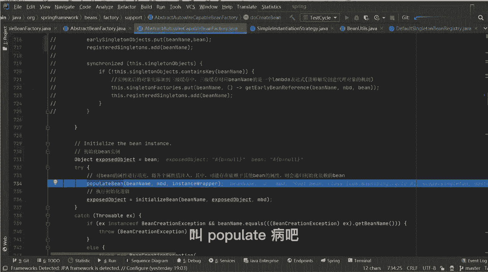

这就是我们跟你说的第六个方法叫populate be，我现在已经在里面把这六个方法都过了一遍了，之后，你还会看到这六个方法的这个流程，我希望你能把这个方法给我记住。

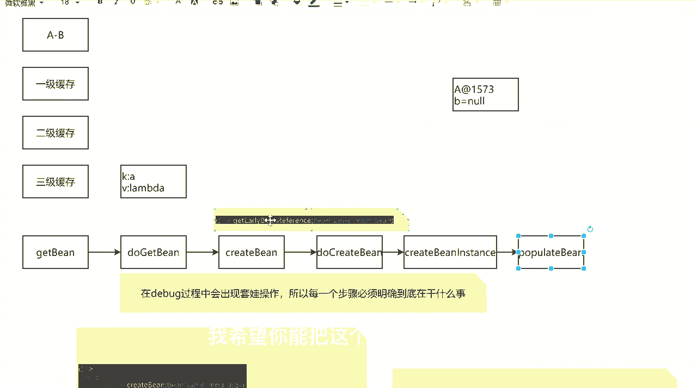

所以这个步骤干嘛的，populate啥意思啊，什么叫populate填充嘛，叫属性填充啊，所以这里面我开始进行属性的赋值操作了，怎么复制啊，也很简单好吧，点F7进去进来之后。

上面一堆的逻辑判断跳过了好吧，不重要，不管它，你们不用管它干嘛的好吧，往下走，直到最后一行叫apply property values，叫应用属性值，比如说这个步骤才是最关键的属性赋值的步骤。

我只有走到这个步骤里面才会进行属性赋值，卡了吗，卡的同学刷新一下好不好，刷新一下好吧，自己刷新一下，我等一下卡的同学刷新一下，自己刷新一下，你们可能用的是浏览器看的，所以可能会卡一点。

如果你用客户端的话，他不会卡的，把自己刷新一下好了吗，你们刷的，我抽根烟，好了吗，好了好，现在往下讲到这个步骤的时候，它是很重要的步骤，叫apply property value，这叫应用属性值。

也就是说往属性里面进行一个，最基本的赋值操作，好吧，我们点F7进去，进来之后，我想问一下A对象里面有几个属性，一个吧，只有一个B，所以往下走走走，这些都跳过了啊，不带你拿一个看了没意义好吧。

我带你们看看关键步骤里面，去带你们找关键步骤好了，唉这行第一步叫PV点get value，PV叫什么叫property value，它封装了一个对象啊，就属性value值拼装了一个对象。

第一个叫获取名称，我们的名字叫什么叫B吧，叫B啊好吧，第二个叫获取value，获取一下我们B的value值，这时候当我获取完之后，我希望你把这个value值给我记下来，你看一下这个value是啥。

是啥叫wrong time being reference，啥玩意儿啊，什么叫wrong time being reference，这东西你可以不知道它是干嘛的，但是我希望你能先把这个词记下来。

我已经敲出来了，叫状态bean re，你把这个单词给我记住，因为后面我们会用到这个wrong time being reference，往下走，跳过在这一行叫resolve value。

if necessary说如果必要的话，我需要去处理当前值了，我们这个wrong time be reference，它不是B类型对象，所以我是一定要把这个值进行相关的一个，处理工作的，所以点F7进去。

当我进来之后，来同学们告诉我，我们的value是不是wrong time being reference，是还是不是，是吧，所以这时候不谋而合，正好匹配上了，既然我匹配上了。

我就一定能进到我的if判断里面去，所以先进行一个类型的强制转换，转换之后叫resolve reference，叫处理引用，我需要把这个long time bean reference。

转成我需要的B对象了，所以点F7进去，进来之后获取类型，判断有没有复工厂好吧，往里面进行一堆操作不重要，来往下看，这样处理的东西也要注意到name或选名称，名称是B没问题吧，来看这一行代码。

套娃从此开始叫this bean factory，点get be，这是你第几次见get电脑，同学们告诉我，第二次刚刚创建A对象的时候，我见过一次get变了，现在我又建了一次get变的方法。

是不是意思好吧，所以现在我见到两次了，这是干嘛的，我说了，每次我在创建对象的时候，我需要先从容器里面去获取，或者判断一下有没有B对象，我现在在B类模块是谁了，发完B了吧，是不是就相当于有干一件事。

我要判断一下容器里面到底是否有B对象，来到这为止，能听懂的扣一，问题吧，所以来我点进去点F7，进来进来之后你看到了什么，第二个方法叫do get be，我再点F7进去好吧，往下走，从容器里面获取。

我们带对象，有B对象吗，现在现在有没有B对象啊，有啊，宋祥坤没嘛，没创建的，怎么会有呢，没有没创建过，没有没有没有没有没有，所以这个对象依然是等于空的，一等于空没创建的，所以肯定没有。

你就严格按照我的标准步骤去走没有，那如果没有的话，你告诉我下一个步骤该干嘛了，下一步该干嘛了，创建B对象，所以往下走走，跟刚刚的流程一模一样，一模一样一模一样，所以走到这行叫get singleton。

我再点进去get singleton，进来之后往下走，往下走，往下走，往下走，往下走，往下走，往下走，找到我们的get object了，来问一下这个get不get，我要调谁了，我要到谁。

create bean方法吧，该调create bean方法了，所以点F7进去到create bean，再点F7进去到create bean方法之后，我要找谁了，是不是该找do create变了。

所以你发现了流程一模一样吧，你刚刚看别的流程，现在又是这面流程一模一样，所以原版为什么看起来比较难，你如果真的把一遍捋通了的话，它并不难，你懂了吗，那一点都不难，它很容易，所以往下走走走。

我们找多亏的病走do奎bean到这吧，终于到do cret bean了，然后当我到do cret bean之后，下一步在干嘛，点FC进去吗，进来之后往下走走走走，就到这一步了。

叫create bance，我这边不用不用带你们看了吧，它用来创建哪个对象，training对象，B对象，B对象，所以往下走完走完，我们来看一下当前B对象是谁，叫b at2171对吧。

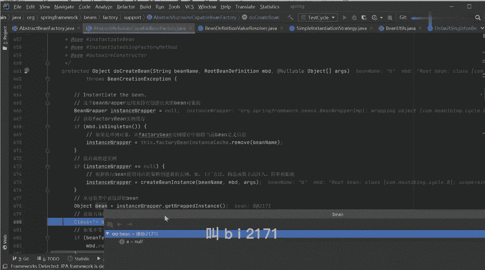

我把对象留下来记一下，叫b at2171，现在A等于那没问题吧，我现在AB对象全部都有了，全部都有了，全部有了之后，我再接着往下走，往下走，下一步啊，走走走走，下一步走走走走走走走走，走到这一步。

你告诉我干嘛，这不也见过吧，这不是干啥的，往三级缓存里面放东西吧，放的是啥，来改了，待会呢，key冒号是b value冒号是谁，拉姆达表达式好吧，而我们这儿指的兰表达式，就是下面的拉姆表达式。

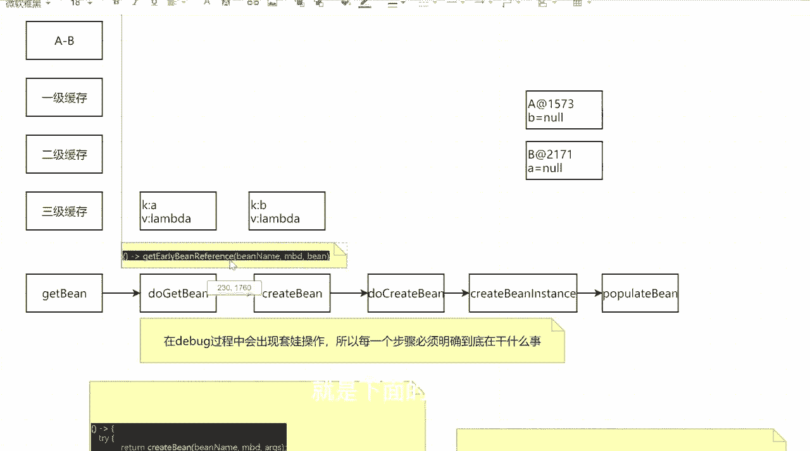

是放进去好了，放完之后结束了，回过头来我再接着往下执，行到populate bean，一模一样的逻辑，同学们还是找populate bean点FC进去好吧，来走走走，跳到最后一行，跳过啊，跳过最后一行。

走到第一行叫apply property value，再点进去，这时候问题来了，我的B对象里面有几个属性，第一个吧只有一个A属性，只有一个A属性，所以往下走，我依然跳过这些无关紧要的步骤，好吧。

不管他走走走走走走走走走，来到这，第一个，我先获取属性名称名称是A，第二个我在获取属性的Y6值，来看一下当前的value值是谁，又是wrong time being reference吧。

不是两个表达式啊，是wrong time being reference，叫run time bean reference，运行时对象引用好，运行是一个B类引用，所以它是没有任何的一个变化。

叫状态并reference还能搞清楚那一样的，我问一下，我们刚刚看到创建B的过程，跟创建A的过程一样不一样，一样啊，所以我说什么叫流水线工作，他就是这样一个标准流程，它没有任何区别，就这样一个流程。

所以我们接着按这个流程往下走就可以了，好吧，往下跳一步到resolve并resolve value，if necessary点FC进去。

value是不是wrong time being reference是吧，value是不是也是这个类型类型，如果匹配的话，我进来进来之后，我要处理的引用了，要result reference。

我再点F7进去，又回到这块往下走，往下走，往下走，获取到我们的属性值等于A，这是你第几次见到get变了，同学们第几次，第三次，那你告诉我，我现在的get bean是要get谁，是不是该get a了。

get a了一样，我再进去点F7，进来又回到这了，Do get in，我再点F7进去，是不是又来第三遍了，同学们，他是不是套娃，是吗，为什么好多同学理不清楚，就算这玩意一遍一遍重复在那重复。

在那从那重重复滚滚，一会儿同学们就懵了，所以别蒙我，就到目前为止，你们应该还能跟得上对吧，来能跟上同学扣波一，没问题吧，跟着我的节奏好吧，跟着我的思路去往下捋，往下捋啊，慢慢来，走完之后往下走。

往下走来，现在我的问题来了，这个时候我能不能获取到A对象，这个是什么，能很多同学都告诉我，能，如果能的话，那我们是不是要看一下这个get singleton，里面的处理逻辑了。

我们看一下到底怎么过去的好，有人说不能不管能不能，我们判断下逻辑好吧，总总没问题吧，我看一下到底怎么操作都没问题吧，我点F7进去，再点F7进去。

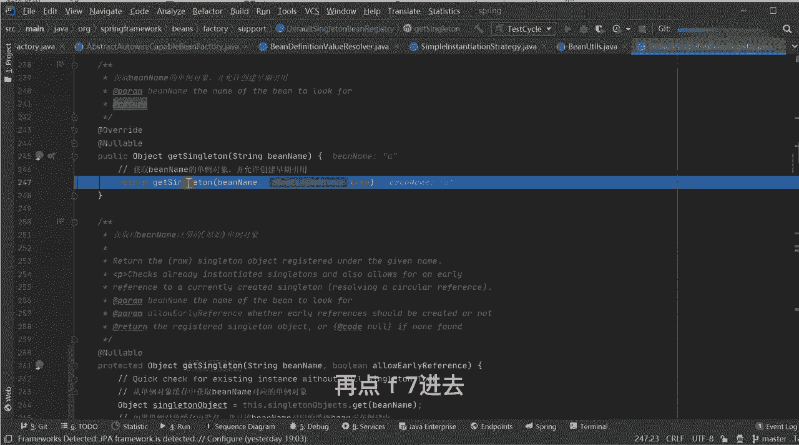

来看一下这一长串代码，很多套代码之后我蒙了，别蒙，我们挨个来捋，第一个，这是几级缓存，这几级缓存，三级你确定是三级吗，来姐姐，signal vs1级嘛，先从一级里面取，我问一下，按我们这个图里面画的。

一级里面有东西吗，一级里面有东西吗，没有，所以这个值很明显，我取到一定等于空，signal object等于空，第二步这个判断就很重要了，说singleton object如果等于空。

并且叫is singleton currently increation，什么意思，说你当前对象是否在被创建过程中，我问一下，我们的A和B现在是否都在创建过程中。

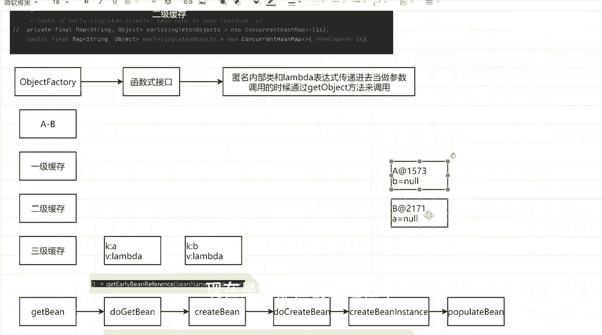

是吗是吧，所以就等于true吗，所以这种条件能进来，进来之后我再从哪取，这是几级缓存，二级吧，我再从二级里面取那一样的，二级本身就等于空嘛，它一定也取不到，如果取不到的话，我再往下走。

这有一个双重的一个星空，net的一个检查，检查的时候里面一样，先从一级里面取，取不到，再从二级里面取，二级里面取不到，再往这来叫this singleton factories，点get，我问一下。

现在我是从哪儿取，到三级了吧，到三级缓存区了，我从三级缓存取的话，我的问题就来了，同学们，我这个时候取出来的是某一个对象吗，挺有问题啊，我取出来是某个对象吗，不是我取出来是什么。

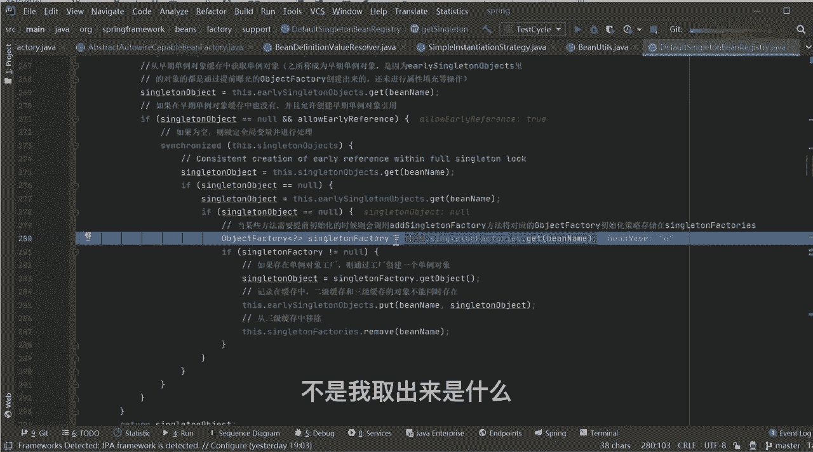

是一个拉姆达表达式，所以当我取出来lb表示之后，我需要通过什么方法来执行，Get object，是叫这get不JECT，当我这在调用get object方法的时候，我实际执行的方法是哪个。

是不是这玩意儿叫get early being reference吧。

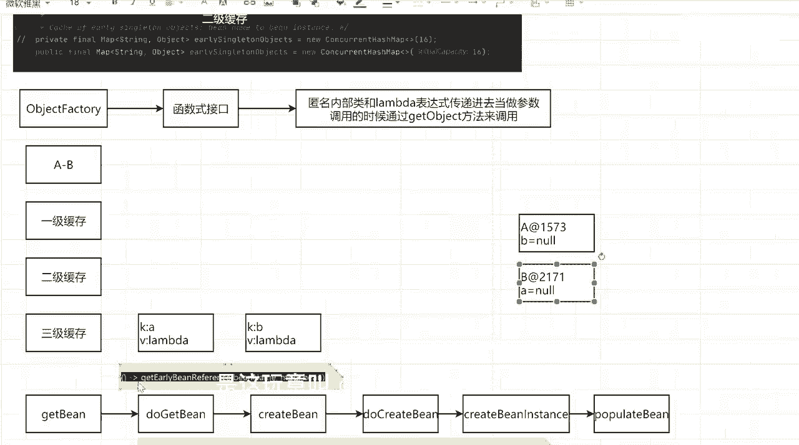

所以来我们点进去点F7进去，你发现了，我跳到了get early bean reference，对不对。

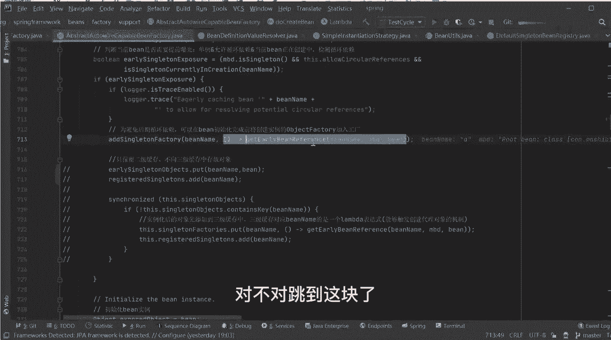

跳到这块了，我再点F7进去好了，到这一段的处理逻辑了，这一段处理逻辑才是三级缓存，它的精髓所在，这个方法这个逻辑精髓，来我们分析一下第一个步骤，并对象，我把当前的并对象是A8AI1573。

我赋值给了叫exposed object，什么叫exposed object呀，怎么翻译，怎么办呀，叫对外暴露吗，这就是叫提前对外暴露对象，暴露对象暴露谁暴露，是这里面的exposed obje好吧。

然后中间这样一个一分判断，既然是一个if判断的话，就会收到一个问题，这个if可能进去，也可能不进去，但是你返回值是什么东西，是不是一次不做，这对吧，我刚刚如果我的衣服进不去的话。

我返回什么东西告诉我听好啊，如果我的if进不去，我返回是谁，返回什么原始的A对象吧，原始对象如果我的if判断我能进去了，这个地方是不是会改变我们的expose object，是不是改变怎么改的。

我们先不管，但不管怎么样，我这个步骤到目前为止往下走，跳过是不是直接返回了A，所以往下走往下走，现在我取到A对象了吗，同学你好，我现在有没有取到AB项，提到了吧，学到了吧，A是A。

A是a at1573吗，还是对象取到了，取到之后干什么事，看这个步骤，什么东西往哪放，是不是该放到我们的二级缓存里面去了，所以当这个步骤完了之后，我要往二级缓存里面移动了。

这变成K冒号还是A但是value冒号变成谁了，叫a at1573，但是现在的1573它是一个什么状态的，什么状态的成品，还是半成品，成品半成品，半成品是半成品。

因为现在你这个signal里面B还是等于空嘛，所以还是半成品无所谓，好吧，往下走，叫this singleton factories remove，干嘛，我是要把三级缓存给移除掉了，把三级缓存给移除掉。

我们这不真的删，我把它标记为一个其他颜色，比如说这个色这个色儿表示删除，我们不算三啊，我把这个表就是这个色调表示删除。

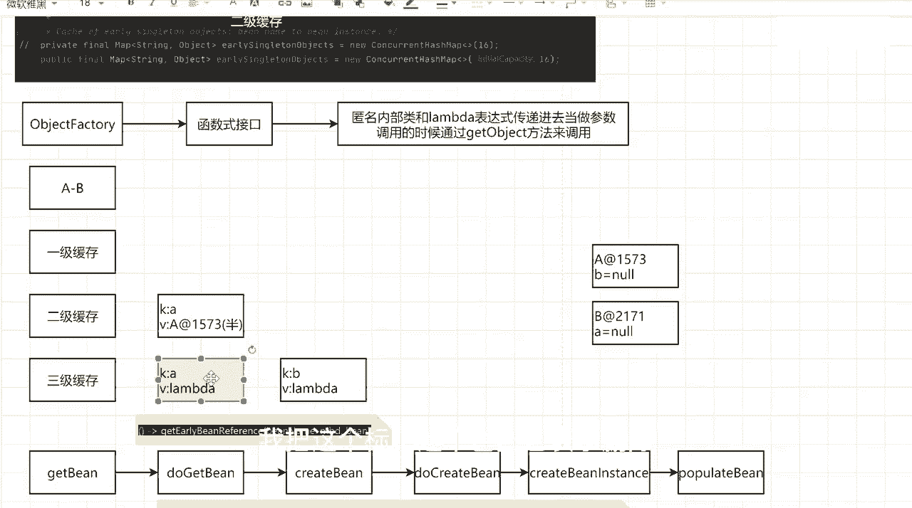

可以吧，好了，现在我也取到我们的A对象了，回过头来回头来回到这块，当我取到我的A对象之后，你告诉我，我还需要接着去创建A对象吗，需要吗，不用了吧，所以你在往下走的过程中走走，直接返回B对象了，是不是。

这个时候我把A对象取消了，对不对，A对方取到了，我问一下啊，我问一下，现在我取到了A对象，我刚刚为什么要取A对象来着，我刚刚为什么要取A对象，还记得吗，所以往下走往下走，往下走往下走。

再返回一直返回返回返回返回返回往下走啊，处理完处理完，处理完处理完处理，处理完拿走到这一步叫BW点，set property value给谁设置，给B设置，所以当这个步骤我走完之后。

现在我的B对象它是一个成品还是半成品，聪明吗，A已经复制完了吗，所以你点开之后，你发现A对象已经有值了，但是A里面的B现在有值吗，A里面的B现在有值吗，没有吧好吧没有，不管它接着往下走。

后面是初始化环节，可以直接跳过，不重要好吧，往下走往下走，往下走，走完走完走完走完走完走完一直往回返好吧，这是刚刚创建B对线的过程，当我这块完了之后，来到这个方法里面，这还有一个方法很重要，这干嘛的。

叫ADD singleton吧，你点MC进去进去之后往下看叫singleton object，点put signal object，是几级缓存缓存，一级吧，b name等于B吧，SNL不是等于谁。

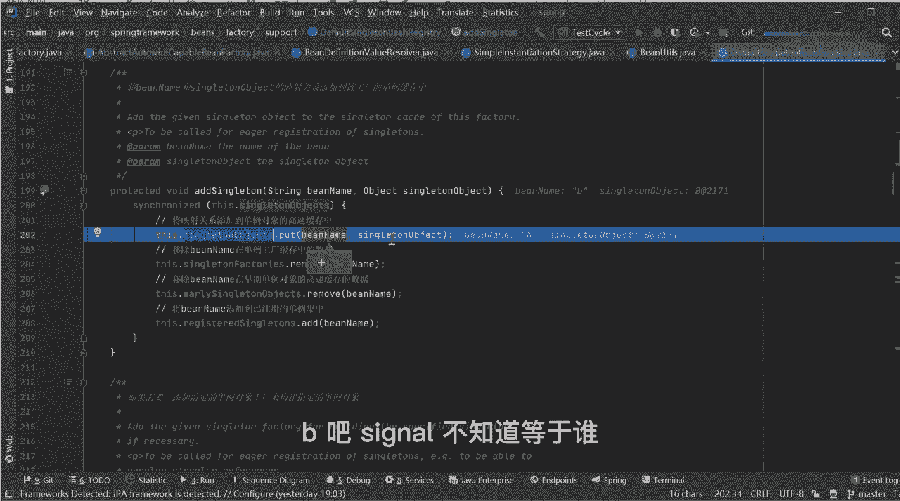

b at2171吧，所以现在我把我们的一级缓存里放是谁了，K冒号等于b value，冒号等于b at2171，它是一个什么状态的对象，商品对吧，成品对象好吧，成品对象整理完了之后往下看。

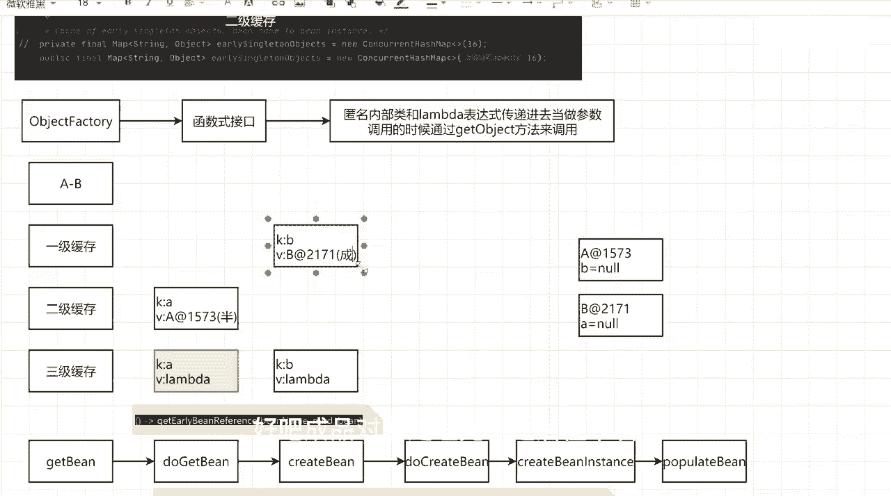

叫this singleton factory remove，这是直接缓存，这是几级缓存三级吧。

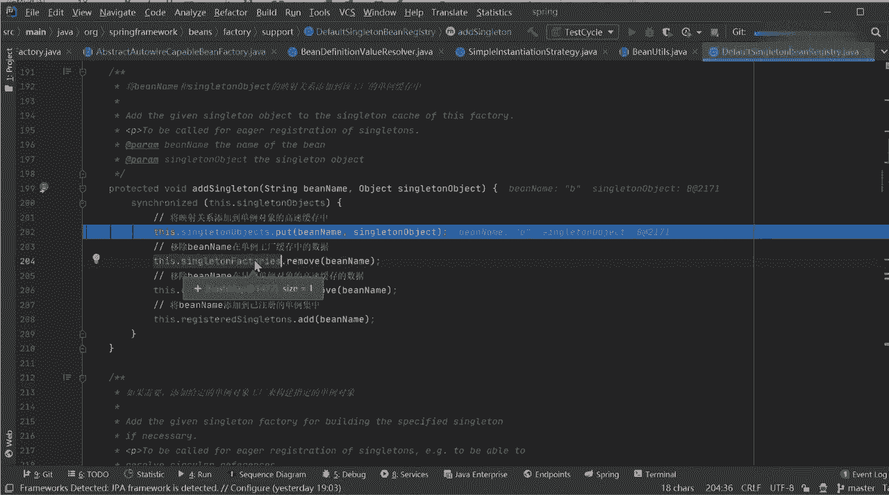

所以我把三级我再给它清空掉，移除掉对吧，然后回过头来再往下走，我再把二级给移除掉，二级里面本来也没东西移除掉就可以。

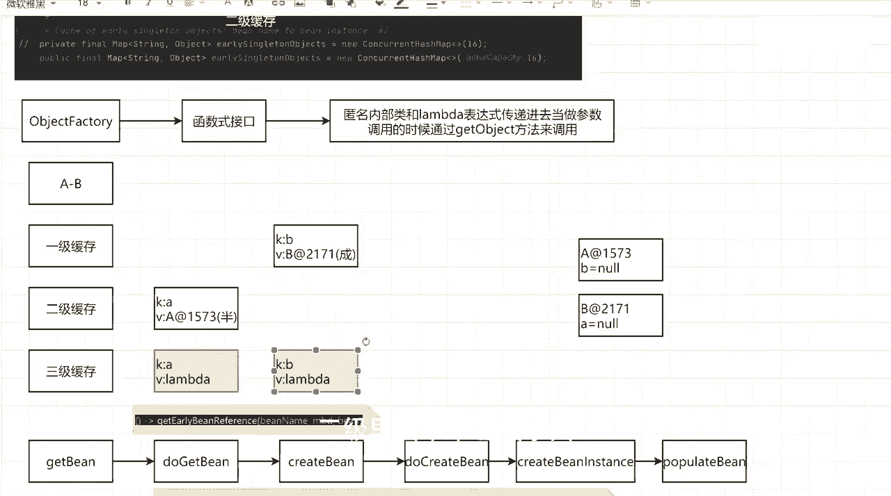

就就就就移除掉了，无所谓，OC走完走完走完走完走完之后，往回返回返返反反，现在是反反到这个步骤之后，刚刚是不是去创建B对象去了，我问一下为什么要创建B对象来着。

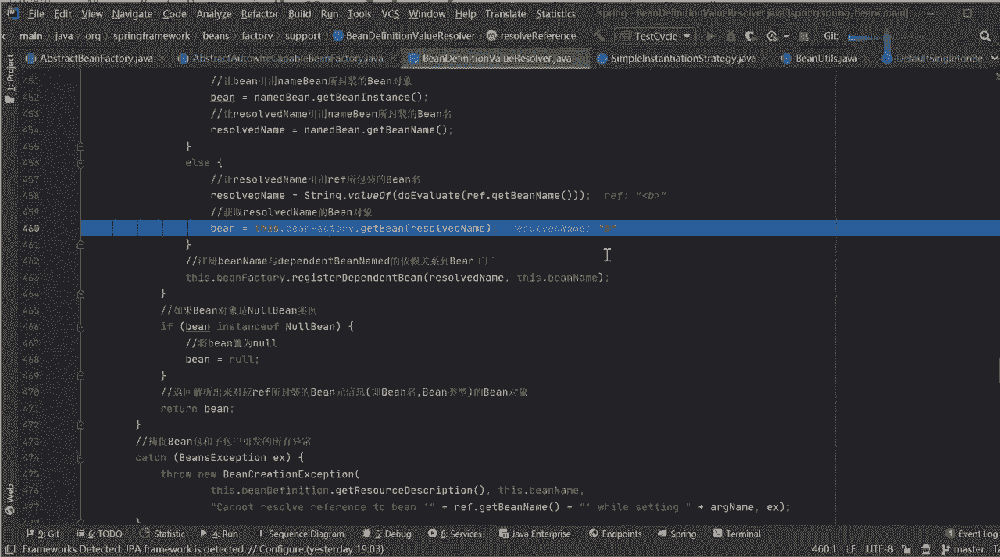

为什么要创建B对象来着，是为了给A对象里面的B属性来赋值。

所以我去创建B对象了，所以现在我已经获取到我们的B对象了，那我剩下步骤干嘛，我是不是就该给A属性赋值了吧，再往上走走走走走走走，走，完到这个步骤叫BW点，Set property value。

设置完成之后拿走这步骤，我问一下A对象里面是A吧，A现在里面是成品还是半成品，A成品了吧，是不是这个过程了，所以现在A是不是也成了一个成品对象了，成品完了之后往下走走走，返回好吧，人往下走。

走完走完走完走完走完走完走完，走完之后到最下面到这块叫ADSINGLETON。

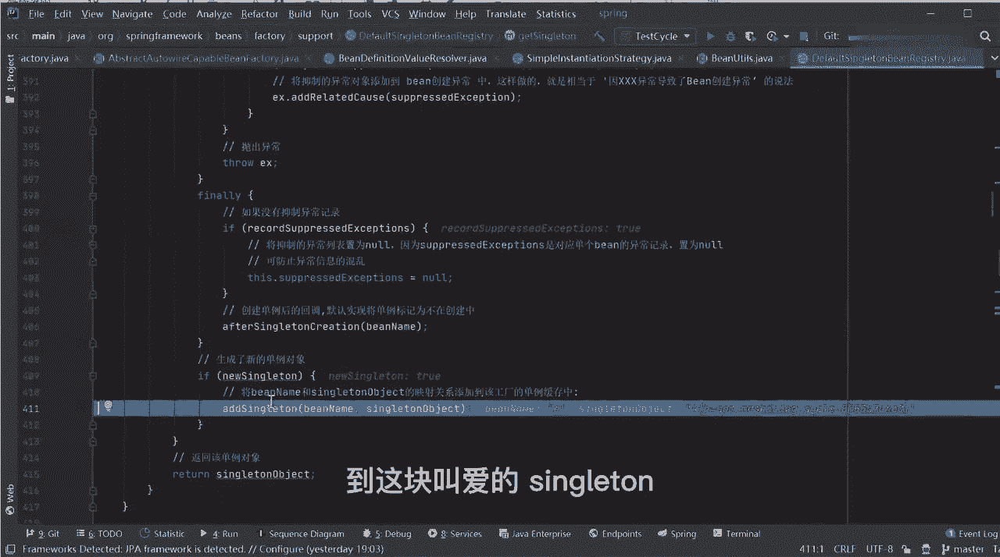

也是往一级缓存里放吧，所以这我再往一级缓存里放对象，这是K冒号，a value value冒号，这写一个a at1573，现在什么状态。

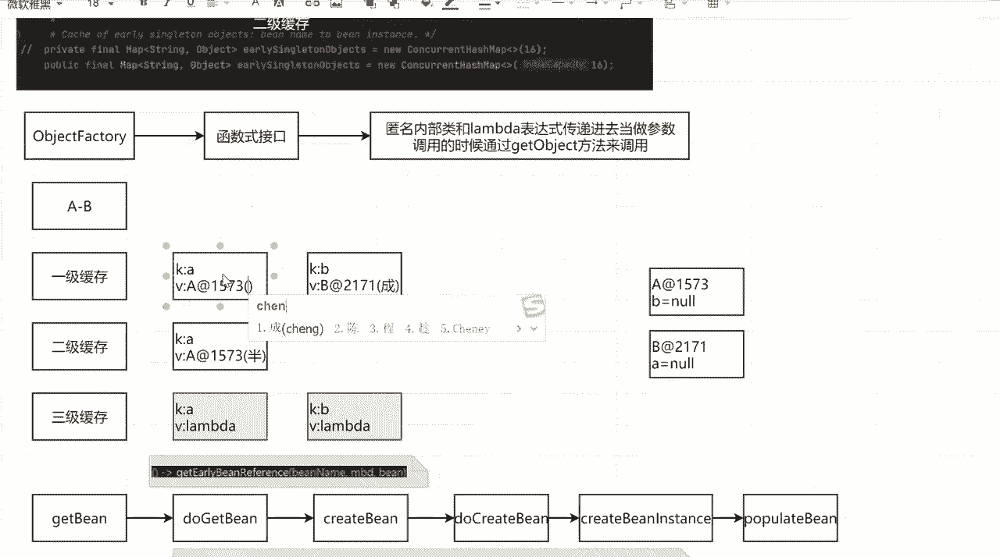

通过对象吧，完了之后把三级缓存移除掉。

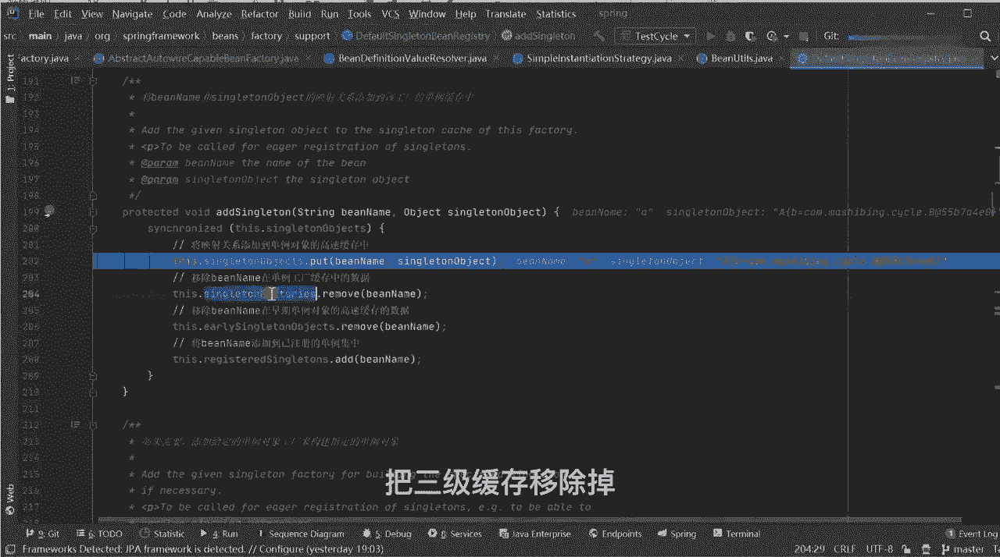

把二级缓存移除掉，把它移除掉对吧。

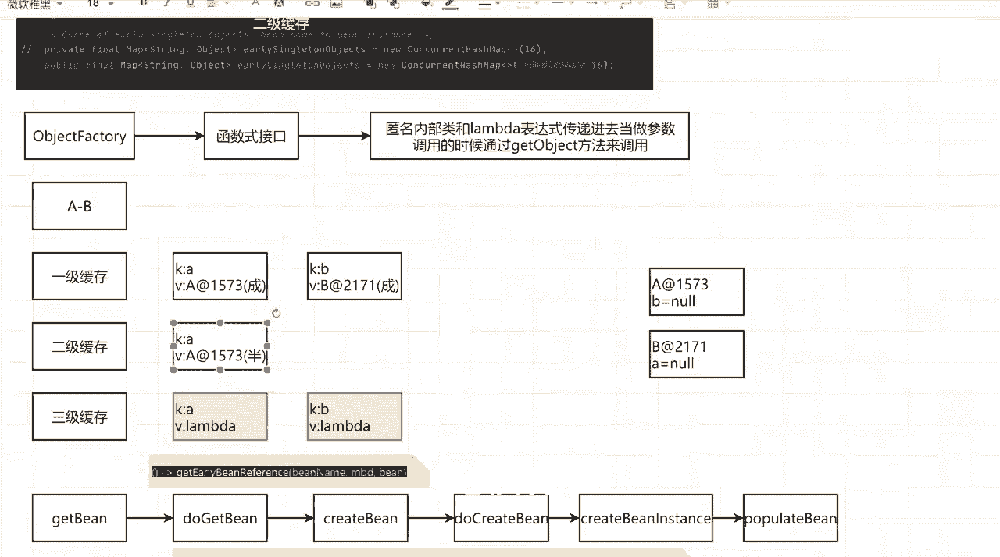

当我移除完成之后好了，整个过程我就结束了对吧，A对象创建完成了，当A对象结束完成之后，回过头来，这时候该干嘛了，同学们，刚刚别忘了我们有ab两个对象，我刚刚是为了创建A对象的时候。

我把B对象给创建出来了，但是实际情况下我B要不要创建了，必要不要创建了，要吧，所以我接着取第二对象等于B，只不过B在进行创建的时候get get，这能获取到我们的B对象吗，能获取到能吗。

因为一级缓存面积有了吗，还不能啊，大叔能吧，因为我已经放到一级缓存里面去了，所以肯定能，所以当这步执行完成之后好了，我的B对象取到了，取到之后，我还有必要create吗，我是不是直接返回就可以了。

这个时候我的ab就结束了，这是我们刚刚ab已经结束这个流程。

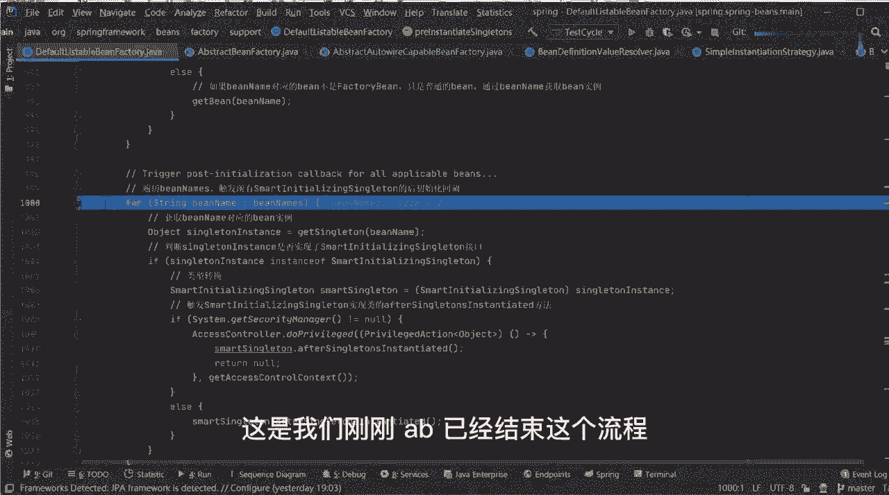

所以刚刚我带你们debug过了一下这个流程，你现在还觉得模糊吗，有没有捋清楚一点，对吧，这个时候牛逼是不是应该刷刷起来了，明白意思吗，你们为什么一直模糊，原因点就在于什么，你们从来没有像我一样。

跟着把这套流程给刷一下，梳理一下，如果你真的梳理清楚之后，它还难吗，你把每一个对象都放到这里面去，挨个步骤去迭代，它还难吗，它不难啊，最起码没你们想象中那么难，所以我一直给大家说，我说你注意了。

你一定要注意一件事，什么事注意思路和方法，这事比什么都重要。

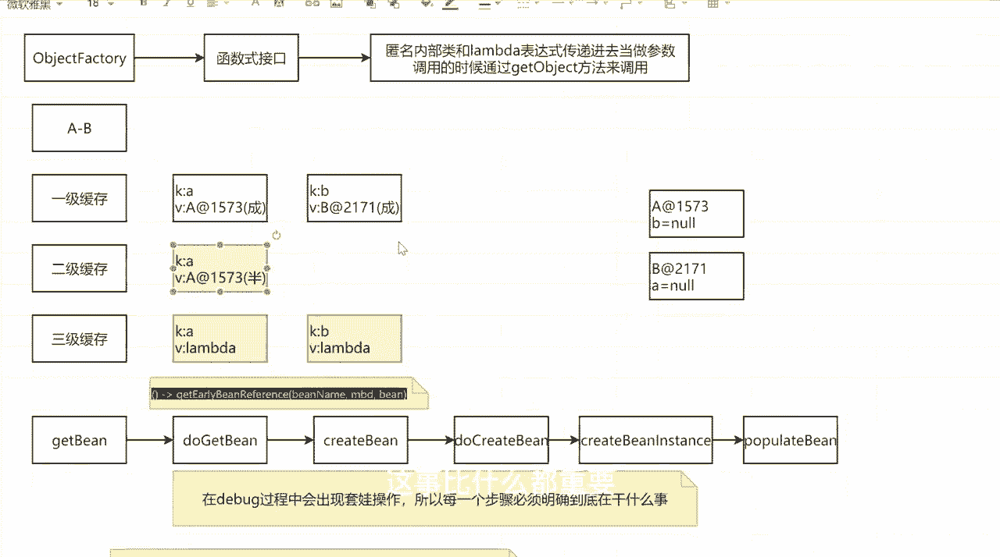

懂了吗。